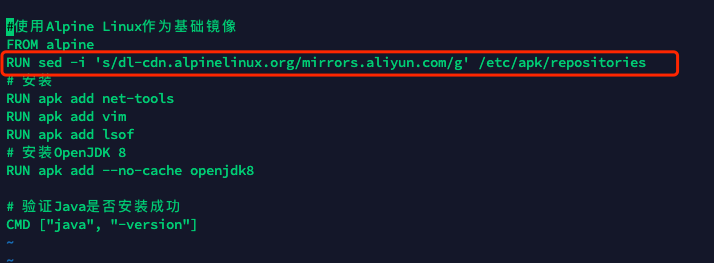

# 一、docker基于aipine基础镜像
```shell
#使用Alpine Linux作为基础镜像
FROM alpine
RUN sed -i 's/dl-cdn.alpinelinux.org/mirrors.aliyun.com/g' /etc/apk/repositories
# 安装
RUN apk add net-tools
RUN apk add vim
RUN apk add lsof
# 安装OpenJDK 11
RUN apk add --no-cache openjdk8

# 验证Java是否安装成功
CMD ["java", "-version"]
```

- 构建镜像`docker build -t alpine-java8:1.0 .`
- 运行：`docker run --name alpine-java8 -itd   alpine-java8:1.0 /bin/sh`
# 二、基于aipine基础镜像部署jar包实例
```shell
FROM alpine
MAINTAINER SoftLeaderGy
RUN sed -i 's/dl-cdn.alpinelinux.org/mirrors.aliyun.com/g' /etc/apk/repositories
# 安装
RUN apk add net-tools
RUN apk add vim
RUN apk add lsof
# 安装OpenJDK 8
RUN apk add --no-cache openjdk8

# VOLUME 指定临时文件目录为/tmp，在主机/var/lib/docker目录下创建了一个临时文件并链接到容器的/tmp
VOLUME /tmp
ADD docker_boot-0.0.1-SNAPSHOT.jar docker_boot.jar
ENTRYPOINT ["java","-jar","docker_boot.jar", "--server.port=6001"]
EXPOSE 6001

# 验证Java是否安装成功
CMD ["java", "-version"]
```

- 构建镜像：`docker build -t alpine-java8:1.0 .`（需要将Dockerfile 与 jar包放在同一级目录下）
- 启动命令`docker run --name alpine-java8-boot -itd -p 6001:6001  alpine-java8:1.0 /bin/sh`
# 三、遇到相关问题
## 1、Dockerfile apk add 下载更新软件时，比较慢，如何解决

- 更新下仓库源
- 
- 阿里镜像`RUN sed -i 's/dl-cdn.alpinelinux.org/mirrors.aliyun.com/g' /etc/apk/repositories`
- 科大镜像`RUN sed -i 's/dl-cdn.alpinelinux.org/mirrors.ustc.edu.cn/g' /etc/apk/repositories`
- 其他镜像仓库问题参考：[https://blog.csdn.net/u011582922/article/details/130153250](https://blog.csdn.net/u011582922/article/details/130153250)
- 注意：alpine系统需要以`/bin/sh`结尾进行启动
# docker-compose中设置Redis容器密码
[https://blog.csdn.net/weixin_44799217/article/details/131079990](https://blog.csdn.net/weixin_44799217/article/details/131079990)

