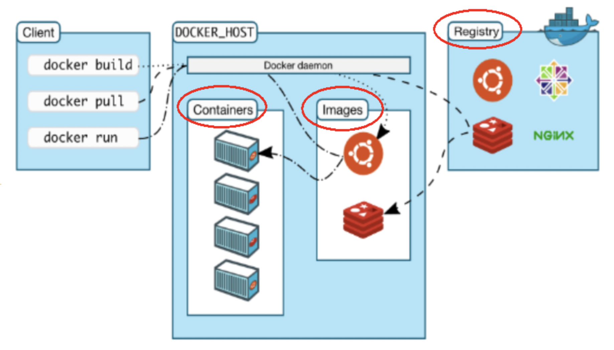
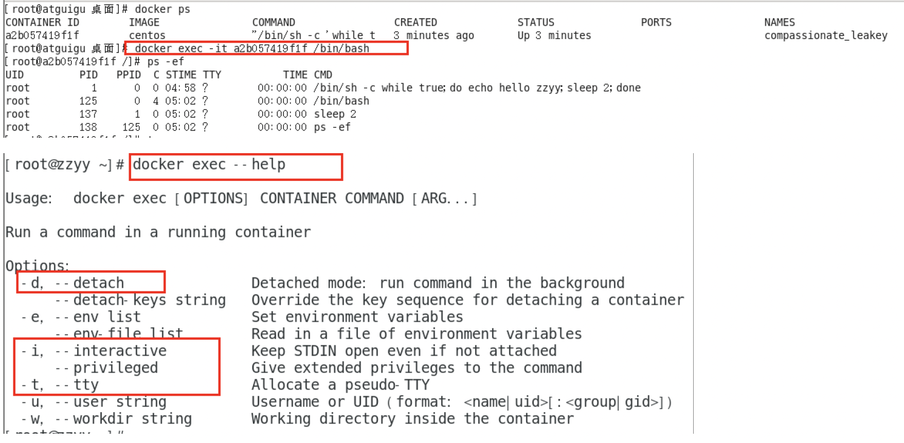

# 一、docker基础篇

## 1、docker简介

### 1、是什么？

-  为什么会出现docker？ 
> 假定您在开发一个商城，您使用的是一台笔记本电脑而且您的开发环境具有特定的配置。其他开发人员身处的环境配置也各有不同。您正在开发的应用依赖于您当前的配置且还要依赖于某些配置文件。此外，您的企业还拥有标准化的测试和生产环境，且具有自身的配置和一系列支持文件。您希望尽可能多在本地模拟这些环境而不产生重新创建服务器环境的开销。请问？
>  
> 您要如何确保应用能够在这些环境中运行和通过质量检测？并且在部署过程中不出现令人头疼的版本、配置问题，也无需重新编写代码和进行故障修复？
>  
> 答案就是使用容器。Docker之所以发展如此迅速，也是因为它对此给出了一个标准化的解决方案----- 系统平滑移植，容器虚拟化技术 。
>  
> 环境配置相当麻烦，换一台机器，就要重来一次，费力费时。很多人想到，能不能从根本上解决问题， 软件可以带环境安装？ 也就是说， 安装的时候，把原始环境一模一样地复制过来。开发人员利用 Docker 可以消除协作编码时“在我的机器上可正常工作”的问题。

 

   - 
> 之前在服务器配置一个应用的运行环境，要安装各种软件，就拿尚硅谷电商项目的环境来说，Java/RabbitMQ/MySQL/JDBC驱动包等。安装和配置这些东西有多麻烦就不说了，它还不能跨平台。假如我们是在 Windows 上安装的这些环境，到了 Linux 又得重新装。况且就算不跨操作系统，换另一台同样操作系统的服务器，要 **移植** 应用也是非常麻烦的。
>  
> 传统上认为，软件编码开发/测试结束后，所产出的成果即是程序或是能够编译执行的二进制字节码等(java为例)。而为了让这些程序可以顺利执行，开发团队也得准备完整的部署文件，让维运团队得以部署应用程式， 开发需要清楚的告诉运维部署团队，用的全部配置文件+所有软件环境。不过，即便如此，仍然常常发生部署失败的状况 。Docker的出现 使得Docker得以打破过去「程序即应用」的观念。透过镜像(images)将作业系统核心除外，运作应用程式所需要的系统环境，由下而上打包，达到应用程式跨平台间的无缝接轨运作。

-  docker理念 

> Docker是基于Go语言实现的云开源项目。
>  
> Docker的主要目标是“Build，Ship and Run Any App,Anywhere”，也就是通过对应用组件的封装、分发、部署、运行等生命周期的管理，使用户的APP（可以是一个WEB应用或数据库应用等等）及其运行环境能够做到 “一次镜像，处处运行”。
>  
> 
>  
> Linux容器技术的出现就解决了这样一个问题，而 Docker 就是在它的基础上发展过来的 。将应用打成镜像，通过镜像成为运行在Docker容器上面的实例，而 Docker容器在任何操作系统上都是一致的，这就实现了跨平台、跨服务器。 只需要一次配置好环境，换到别的机子上就可以一键部署好，大大简化了操作。


-  一句话
解决了运行环境和配置问题的软件容器，方便做持续集成并有助于整体发布的容器虚拟化技术。 

### 2、容器与虚拟机比较

-  容器发展简史 
   - 
-  传统虚拟机技术 
   - 
-  容器虚拟化技术 
-  
> 由于前面虚拟机存在某些缺点，Linux发展出了另一种虚拟化技术：
>  
> Linux容器(Linux Containers，缩写为 LXC)
>  
> Linux容器是与系统其他部分隔离开的一系列进程，从另一个镜像运行，并由该镜像提供支持进程所需的全部文件。容器提供的镜像包含了应用的所有依赖项，因而在从开发到测试再到生产的整个过程中，它都具有可移植性和一致性。
>  
> Linux 容器不是模拟一个完整的操作系统 而是对进程进行隔离。有了容器，就可以将软件运行所需的所有资源打包到一个隔离的容器中。 容器与虚拟机不同，不需要捆绑一整套操作系统 ，只需要软件工作所需的库资源和设置。系统因此而变得高效轻量并保证部署在任何环境中的软件都能始终如一地运行。

 

-  对比 
> 
>  
> 比较了 Docker 和传统虚拟化方式的不同之处：
>  
> *传统虚拟机技术是虚拟出一套硬件后，在其上运行一个完整操作系统，在该系统上再运行所需应用进程；
>  
> *容器内的应用进程直接运行于宿主的内核，容器内没有自己的内核 且也没有进行硬件虚拟 。因此容器要比传统虚拟机更为轻便。
>  
> * 每个容器之间互相隔离，每个容器有自己的文件系统 ，容器之间进程不会相互影响，能区分计算资源。

 

### 3、能干嘛

-  技术职级变化 
   - coder --> programmer --> software engineer --> DevOps engineer
-  开发/运维（DevOps）新一代开发工程师 
   -  一次构建、随处运行 
      -  更快速的应用交付和部署 
> 传统的应用开发完成后，需要提供一堆安装程序和配置说明文档，安装部署后需根据配置文档进行繁杂的配置才能正常运行。Docker化之后只需要交付少量容器镜像文件，在正式生产环境加载镜像并运行即可，应用安装配置在镜像里已经内置好，大大节省部署配置和测试验证时间。

 

      -  更便捷的升级和扩缩容 
> 随着微服务架构和Docker的发展，大量的应用会通过微服务方式架构，应用的开发构建将变成搭乐高积木一样，每个Docker容器将变成一块“积木”，应用的升级将变得非常容易。当现有的容器不足以支撑业务处理时，可通过镜像运行新的容器进行快速扩容，使应用系统的扩容从原先的天级变成分钟级甚至秒级。

 

      -  更简单的系统运维 
> 应用容器化运行后，生产环境运行的应用可与开发、测试环境的应用高度一致，容器会将应用程序相关的环境和状态完全封装起来，不会因为底层基础架构和操作系统的不一致性给应用带来影响，产生新的BUG。当出现程序异常时，也可以通过测试环境的相同容器进行快速定位和修复。

 

      -  更高效的计算资源利用 
> Docker是 内核级虚拟化 ，其不像传统的虚拟化技术一样需要额外的Hypervisor支持，所以在一台物理机上可以运行很多个容器实例，可大大提升物理服务器的CPU和内存的利用率。

 

   -  Docker应用场景 
      - 

### 4、去哪下

-  官网
docker官网：[http://www.docker.com](http://www.docker.com) 
-  仓库
Docker Hub官网: [https://hub.docker.com/](https://hub.docker.com/) 

## 2、docker安装

### 1、前提说明

-  **CentOS Docker** **安装** 
   - 
-  **前提条件** 
   -  目前，CentOS 仅发行版本中的内核支持 Docker。Docker 运行在CentOS 7 (64-bit)上，
要求系统为64位、Linux系统内核版本为 3.8以上，这里选用Centos7.x 
-  **查看自己的内核** 
   - uname命令用于打印当前系统相关信息（内核版本号、硬件架构、主机名称和操作系统类型等）。 
      - 

### 2、docker的基本组成部分

-  镜像(image) 
> Docker 镜像（Image）就是一个 **只读** 的模板。镜像可以用来创建 Docker 容器， 一个镜像可以创建很多容器 。
>  
> 它也相当于是一个root文件系统。比如官方镜像 centos:7 就包含了完整的一套 centos:7 最小系统的 root 文件系统。
>  
> 相当于容器的“源代码”， docker镜像文件类似于Java的类模板，而docker容器实例类似于java中new出来的实例对象。

 

-  容器(container) 
> 1 从面向对象角度
>  
> Docker 利用容器（Container）独立运行的一个或一组应用，应用程序或服务运行在容器里面，容器就类似于一个虚拟化的运行环境， 容器是用镜像创建的运行实例 。就像是Java中的类和实例对象一样，镜像是静态的定义，容器是镜像运行时的实体。容器为镜像提供了一个标准的和隔离的运行环境 ，它可以被启动、开始、停止、删除。每个容器都是相互隔离的、保证安全的平台
>  
> 2 从镜像容器角度
>  
> **可以把容器看做是一个简易版的** **_Linux*_ **环境** （包括root用户权限、进程空间、用户空间和网络空间等）和运行在其中的应用程序。

 

-  仓库(repository) 
> 仓库（Repository）是 集中存放镜像 文件的场所。 类似于
>  
> Maven仓库，存放各种jar包的地方；
>  
> github仓库，存放各种git项目的地方；
>  
> Docker公司提供的官方registry被称为Docker Hub，存放各种镜像模板的地方。
>  
> 仓库分为公开仓库（Public）和私有仓库（Private）两种形式。
>  
> 最大的公开仓库是 Docker Hub([https://hub.docker.com/](https://hub.docker.com/)) ，
>  
> 存放了数量庞大的镜像供用户下载。国内的公开仓库包括阿里云 、网易等

 

-  小总结 
> 需要正确的理解仓库/镜像/容器这几个概念:
>  
> Docker 本身是一个容器运行载体或称之为管理引擎。我们把应用程序和配置依赖打包好形成一个可交付的运行环境，这个打包好的运行环境就是image镜像文件。只有通过这个镜像文件才能生成Docker容器实例(类似Java中new出来一个对象)。
>  
> image文件可以看作是容器的模板。Docker 根据 image 文件生成容器的实例。同一个 image 文件，可以生成多个同时运行的容器实例。
>  
> 镜像文件
>  
> - image 文件生成的容器实例，本身也是一个文件，称为镜像文件。
> 
 
> 容器实例
>  
> - 一个容器运行一种服务，当我们需要的时候，就可以通过docker客户端创建一个对应的运行实例，也就是我们的容器
> 
 
> 仓库
>  
> - 就是放一堆镜像的地方，我们可以把镜像发布到仓库中，需要的时候再从仓库中拉下来就可以了。

 

### 3、Docker平台架构图解(入门版)

-  
-  **Docker工作原理**
Docker是一个Client-Server结构的系统，Docker守护进程运行在主机上， 然后通过Socket连接从客户端访问，守护进程从客户端接受命令并管理运行在主机上的容器 。 容器，是一个运行时环境，就是我们前面说到的集装箱。可以对比mysql演示对比讲解 
   - 

### 4、**Docker平台架构图解(架构版)

- 首次懵逼正常，后续深入，先有大概轮廓，混个眼熟
- 整体架构及底层通信原理简述 
   - 
   - 

### 5、安装步骤

> centos 7安装docker
>  
> [https://docs.docker.com/engine/install/centos/](https://docs.docker.com/engine/install/centos/)


1.  确定你是CentOS7及以上版本
cat /etc/redhat-release 
2.  卸载旧版本 
   1. [https://docs.docker.com/engine/install/centos/](https://docs.docker.com/engine/install/centos/)
   2. 
3.  yum安装gcc相关 
   1. CentOS7能上外网
   2. yum -y install gcc
   3. yum -y install gcc-c++
4.  安装需要的软件包 
   1.  官网要求 
      1. 
   2.  执行命令
yum install -y yum-utils 
5.  设置stable镜像仓库 
   -  大坑
yum-config-manager --add-repo [https://download.docker.com/linux/centos/docker-ce.repo](https://download.docker.com/linux/centos/docker-ce.repo) 
      - 
   -  
> 报错：
>  
> 1  [Errno 14] curl#35 - TCP connection reset by peer
>  
> 2  [Errno 12] curl#35 - Timeout


官网要求 

      - 
   -  推荐
yum-config-manager --add-repo [http://mirrors.aliyun.com/docker-ce/linux/centos/docker-ce.repo](http://mirrors.aliyun.com/docker-ce/linux/centos/docker-ce.repo)
我们自己 
      - 
6.  更新yum软件包索引
	yum makecache fast 
7.  安装DOCKER CE 
   -  yum -y install docker-ce docker-ce-cli [containerd.io](http://containerd.io)
[	](http://containerd.io)官网要求 
      - 

	执行结果 

      - 
8.  启动docker
systemctl start docker 
9.  测试
docker version
docker run hello-world 
10.  卸载 
   1. 
   -  systemctl stop docker 
   -  yum remove docker-ce docker-ce-cli [containerd.io](http://containerd.io) 
   -  rm -rf /var/lib/docker 
   -  rm -rf /var/lib/containerd 

### 6、阿里云镜像加速

-  是什么
[https://promotion.aliyun.com/ntms/act/kubernetes.html](https://promotion.aliyun.com/ntms/act/kubernetes.html) 
-  注册一个属于自己的阿里云账户(可复用淘宝账号) 
-  获得加速器地址连接 
   - 登陆阿里云开发者平台
   - 点击控制台
   - 选择容器镜像服务
   - 获取加速器地址
-  粘贴脚本直接执行
	直接粘 
   - 

	或者分步骤都行 

   -  mkdir -p /etc/docker
   -  vim /etc/docker/daemon.json
> #阿里云
>  
> {
>  
> "registry-mirrors": ["https://｛自已的编码｝.mirror.aliyuncs.com"]
>  
> }

 

### 7、重启服务

- systemctl daemon-reload
- systemctl restart docker

### 8、HelloWorld

启动Docker后台容器(测试运行 hello-world)

- docker run hello-world 
   - 
- run干了什么 
   - 

### 9、**底层原理**

为什么Docker会比VM虚拟机快

> (1)docker有着比虚拟机更少的抽象层
>  
> 由于docker不需要Hypervisor(虚拟机)实现硬件资源虚拟化,运行在docker容器上的程序直接使用的都是实际物理机的硬件资源。因此在CPU、内存利用率上docker将会在效率上有明显优势。
>  
> (2)docker利用的是宿主机的内核,而不需要加载操作系统OS内核
>  
> 当新建一个容器时,docker不需要和虚拟机一样重新加载一个操作系统内核。进而避免引寻、加载操作系统内核返回等比较费时费资源的过程,当新建一个虚拟机时,虚拟机软件需要加载OS,返回新建过程是分钟级别的。而docker由于直接利用宿主机的操作系统,则省略了返回过程,因此新建一个docker容器只需要几秒钟。
>  
> 


## 3、docker常用命令

### 1、帮助启动类命令

- 启动docker： systemctl start docker
- 停止docker： systemctl stop docker
- 重启docker： systemctl restart docker
- 查看docker状态： systemctl status docker
- 开机启动： systemctl enable docker
- 查看docker概要信息： docker info
- 查看docker总体帮助文档： docker --help
- 查看docker命令帮助文档： docker 具体命令 --help

### 2、镜像命令

-  docker images 
   -  列出本地主机上的镜像 
      - 
   -  
> 各个选项说明:
>  
>    -  REPOSITORY：表示镜像的仓库源 
>    -  TAG：镜像的标签版本号 
>    -  IMAGE ID：镜像ID 
>    -  CREATED：镜像创建时间 
>    -  SIZE：镜像大小 
> 
 
> 同一仓库源可以有多个 TAG版本，代表这个仓库源的不同个版本，我们使用 REPOSITORY:TAG 来定义不同的镜像。 如果你不指定一个镜像的版本标签，例如你只使用 ubuntu，docker 将默认使用 ubuntu:latest 镜像  （最新的镜像）

 

   -  OPTIONS说明：
	-a :列出本地所有的镜像（含历史映像层）
	-q :只显示镜像ID。 
-  docker search 某个XXX镜像名字 
   -  网站
[https://hub.docker.com](https://hub.docker.com) 
   -  命令 
      -  docker search [OPTIONS] 镜像名字 
         - 
      -  OPTIONS说明：
	--limit : 只列出N个镜像，默认25个
	docker search --limit 5 redis 
-  docker pull 某个XXX镜像名字
下载镜像 
   -  docker pull 镜像名字[:TAG] 
   -  docker pull 镜像名字 
      -  没有TAG就是最新版 
      -  等价于 docker pull 镜像名字:latest 
-  docker system df 查看镜像/容器/数据卷所占的空间 
   - 
-  docker rmi 某个XXX镜像名字ID
删除镜像 
   -  删除单个
	docker rmi -f 镜像ID 
   -  删除多个
	docker rmi -f 镜像名1:TAG 镜像名2:TAG 
   -  删除全部
	docker rmi -f $(docker images -qa) 
-  面试题：谈谈docker虚悬镜像是什么？ 
   -  是什么
	仓库名、标签都是的镜像，俗称虚悬镜像dangling image 
   -  长什么样 
-  结合我们Git的学习心得，大家猜猜是否会有
docker commit /docker push？？ 

### 3、容器命令

-  有镜像才能创建容器，这是根本前提(下载一个CentOS或者ubuntu镜像演示)
	说明 
   -  
   -  docker pull centos 
   -  docker pull ubuntu 
   -  本次演示用ubuntu演示 
-  新建+启动容器 
   -  docker run [OPTIONS] **IMAGE** [COMMAND] [ARG...] 
   -  OPTIONS说明 
> OPTIONS说明（常用）：有些是一个减号，有些是两个减号
>  
> --name="容器新名字"    为容器指定一个名称；
>  
> -d: 后台运行容器并返回容器ID，也即启动守护式容器(后台运行)；
>  
> -i：以交互模式运行容器，通常与 -t 同时使用；
>  
> -t：为容器重新分配一个伪输入终端，通常与 -i 同时使用；
>  
> 也即 启动交互式容器(前台有伪终端，等待交互) ；
>  
> -P: 随机 端口映射，大写P
>  
> -p: 指定 端口映射，小写p
>  
>    - 

 

   -  启动交互式容器(前台命令行) 
      -  
      -  
> #使用镜像centos:latest以 交互模式 启动一个容器,在容器内执行/bin/bash命令。
>  
> docker run -it centos /bin/bash
>  
> 参数说明：
>  
>       - -i: 交互式操作。
>       - -t: 终端。
>       - centos : centos 镜像。 /bin/bash：放在镜像名后的是命令，这里我们希望有个交互式 Shell，因此用的是 /bin/bash。 要退出终端，直接输入 exit:

 

-  列出当前所有正在运行的容器 
   -  docker ps [OPTIONS] 
   -  OPTIONS说明 
> OPTIONS说明（常用）：
>  
> -a : 列出当前所有 正在运行 的容器 + 历史上运行过 的
>  
> -l :显示最近创建的容器。
>  
> -n：显示最近n个创建的容器。
>  
> -q :静默模式，只显示容器编号。

 

-  退出容器
	两种退出方式 
   -  exit
run进去容器，exit退出，容器停止 
   -  ctrl+p+q
run进去容器，ctrl+p+q退出，容器不停止 
-  启动已停止运行的容器
	docker start 容器ID或者容器名 
-  重启容器
	docker restart 容器ID或者容器名 
-  停止容器
	docker stop 容器ID或者容器名 
-  强制停止容器
	docker kill 容器ID或容器名 
-  删除已停止的容器 
   -  docker rm 容器ID
一次性删除多个容器实例 
      - docker rm -f $(docker ps -a -q)
      - docker ps -a -q | xargs docker rm

### 4、重要

> 有镜像才能创建容器，这是根本前提(下载一个Redis6.0.8镜像演示)


#### 1、启动守护式容器(后台服务器)

> 在大部分的场景下，我们希望 docker 的服务是在后台运行的，我们可以过 -d 指定容器的后台运行模式。


-  docker run -d 容器名 
> #使用镜像centos:latest以后台模式启动一个容器
>  
> docker run -d centos
>  
> 问题：然后docker ps -a 进行查看, 会发现容器已经退出
>  
> 很重要的要说明的一点: Docker容器后台运行,就必须有一个前台进程.
>  
> 容器运行的命令如果不是那些 一直挂起的命令 （比如运行top，tail），就是会自动退出的。
>  
> 这个是docker的机制问题,比如你的web容器,我们以nginx为例，正常情况下,
>  
> 我们配置启动服务只需要启动响应的service即可。例如service nginx start
>  
> 但是,这样做,nginx为后台进程模式运行,就导致docker前台没有运行的应用,
>  
> 这样的容器后台启动后,会立即自杀因为他觉得他没事可做了.
>  
> 所以，最佳的解决方案是, 将你要运行的程序以前台进程的形式运行，
>  
> 常见就是命令行模式，表示我还有交互操作，别中断，O(∩_∩)O哈哈~

 

-  redis 前后台启动演示case 
   -  前台交互式启动
	 docker run -it redis:6.0.8 
   -  后台守护式启动
	docker run -d redis:6.0.8 
-  如果docker run -d 容器名启动时出现自杀 行为的，需要使用 
   - dokcer run -it -d 容器名称

#### 2、查看容器日志

	docker logs 容器ID

#### 3、查看容器内运行的进程

	docker top 容器ID

#### 4、查看容器内部细节

	docker inspect 容器ID

#### 5、进入正在运行的容器并以命令行交互

-  docker exec -it 容器ID bashShell 
   - 
-  重新进入docker attach 容器ID 
-  案例演示，用centos或者unbuntu都可以 
-  上述两个区别 
   -  attach 直接进入容器启动命令的终端，不会启动新的进程
用exit退出，会导致容器的停止。 
      - 
   -  exec 是在容器中打开新的终端，并且可以启动新的进程
用exit退出，不会导致容器的停止。 
      - 
-  推荐大家使用 docker exec 命令，因为退出容器终端，不会导致容器的停止。 
-  用之前的redis容器实例进入试试，进入redis服务 
   - docker exec -it 容器ID /bin/bash
   - docker exec -it 容器ID redis-cli
   - 一般用-d后台启动的程序，再用exec进入对应容器实例

#### 6、从容器内拷贝文件到主机上

-  容器→主机
docker cp 容器ID:容器内路径 目的主机路径 
   - 

#### 7、导入和导出容器

- export 导出容器的内容留作为一个tar归档文件[对应import命令]
- import 从tar包中的内容创建一个新的文件系统再导入为镜像[对应export]
- 案例 
   - docker export 容器ID > 文件名.tar
   - cat 文件名.tar | docker import - 镜像用户/镜像名:镜像版本号

### 5、小总结常用命令


-  attach
Attach to a running container
当前 shell 下 attach 连接指定运行镜像 
-  build
Build an image from a Dockerfile
通过 Dockerfile 定制镜像 
-  commit
Create a new image from a container changes
提交当前容器为新的镜像 
-  cp
Copy files/folders from the containers filesystem to the host path
从容器中拷贝指定文件或者目录到宿主机中 
-  create
Create a new container
创建一个新的容器，同 run，但不启动容器 
-  diff
Inspect changes on a container's filesystem
查看 docker 容器变化 
-  events
Get real time events from the server
从 docker 服务获取容器实时事件 
-  exec
Run a command in an existing container
在已存在的容器上运行命令 
-  export
Stream the contents of a container as a tar archive
导出容器的内容流作为一个 tar 归档文件[对应 import ] 
-  history
Show the history of an image
展示一个镜像形成历史 
-  images
List images
列出系统当前镜像 
-  import
Create a new filesystem image from the contents of a tarball
从tar包中的内容创建一个新的文件系统映像[对应export] 
-  info
Display system-wide information
显示系统相关信息 
-  inspect
Return low-level information on a container
查看容器详细信息 
-  kill
Kill a running container
kill 指定 docker 容器 
-  load
Load an image from a tar archive
从一个 tar 包中加载一个镜像[对应 save] 
-  login
Register or Login to the docker registry server
注册或者登陆一个 docker 源服务器 
-  logout
Log out from a Docker registry server
从当前 Docker registry 退出 
-  logs
Fetch the logs of a container
输出当前容器日志信息 
-  port
Lookup the public-facing port which is NAT-ed to PRIVATE_PORT
查看映射端口对应的容器内部源端口 
-  pause
Pause all processes within a container
暂停容器 
-  ps
List containers
列出容器列表 
-  pull
Pull an image or a repository from the docker registry server  #
从docker镜像源服务器拉取指定镜像或者库镜像 
-  push
Push an image or a repository to the docker registry server
推送指定镜像或者库镜像至docker源服务器 
-  restart
Restart a running container
重启运行的容器 
-  rm
Remove one or more containers
移除一个或者多个容器 
-  rmi
Remove one or more images
移除一个或多个镜像[无容器使用该镜像才可删除，否则需删除相关容器才可继续或 -f 强制删除] 
-  run
Run a command in a new container
创建一个新的容器并运行一个命令 
-  save
Save an image to a tar archive
保存一个镜像为一个 tar 包[对应 load] 
-  search
Search for an image on the Docker Hub
在 docker hub 中搜索镜像 
-  start
Start a stopped containers
启动容器 
-  stop
Stop a running containers
停止容器 
-  tag
Tag an image into a repository
给源中镜像打标签 
-  top
Lookup the running processes of a container
查看容器中运行的进程信息 
-  unpause
Unpause a paused container
取消暂停容器 
-  version
Show the docker version information
查看 docker 版本号 
-  wait
Block until a container stops, then print its exit code
截取容器停止时的退出状态值 

## 4、Dockerfile
### DockerFile常用保留字指令

- FROM
   - 基础镜像，当前新镜像是基于哪个镜像的，指定一个已经存在的镜像作为模板，第一条必须是from
- MAINTAINER
   - 镜像维护者的姓名和邮箱地址
- RUN
   - 容器构建时需要运行的命令
   - 两种格式
      - shell格式
         - 
         - RUN yum -y install vim
      - exec格式
         - 

   - RUN是在 docker build 时运行
- EXPOSE
   - 当前容器对外暴露出的端口
- WORKDIR
   - 指定在创建容器后，终端默认登陆的进来工作目录，一个落脚点
- USER
   - 指定该镜像以什么样的用户去执行，如果都不指定，默认是root
- ENV
   - 用来在构建镜像过程中设置环境变量
   - ENV MY_PATH /usr/mytest 
   - 这个环境变量可以在后续的任何RUN指令中使用，这就如同在命令前面指定了环境变量前缀一样； 
   - 也可以在其它指令中直接使用这些环境变量， 
   - 比如：WORKDIR $MY_PATH 
- ADD
   - 将宿主机目录下的文件拷贝进镜像且会自动处理URL和解压tar压缩包
- COPY
   - 
- VOLUME
   - 容器数据卷，用于数据保存和持久化工作
- CMD
   - 
- ENTRYPOINT
   - 
   - 案例说明
   - 
### 实例
```shell


FROM centos:7
MAINTAINER zzyy<zzyybs@126.com>
 
ENV MYPATH /usr/local
WORKDIR $MYPATH
 
#安装vim编辑器
RUN yum -y install vim
#安装ifconfig命令查看网络IP
RUN yum -y install net-tools
#安装java8及lib库
RUN yum -y install glibc.i686
RUN mkdir /usr/local/java
#ADD 是相对路径jar,把jdk-8u341-linux-x64.tar.gz添加到容器中,安装包必须要和Dockerfile文件在同一位置
ADD jdk-8u341-linux-x64.tar.gz /usr/local/java/
#配置java环境变量
ENV JAVA_HOME /usr/local/java/jdk1.8.0_341
ENV JRE_HOME $JAVA_HOME/jre
ENV CLASSPATH $JAVA_HOME/lib/dt.jar:$JAVA_HOME/lib/tools.jar:$JRE_HOME/lib:$CLASSPATH
ENV PATH $JAVA_HOME/bin:$PATH
 
EXPOSE 80
 
CMD echo $MYPATH
CMD echo "success--------------ok"
CMD /bin/bash
```

- 虚悬镜像：
   - 在构建的时候或者加载的时候出现异常或者没有版本信息导致的没有仓库信息、版本信息等
   - 查看命令如下`docker image ls -f dangling=true`
   - 
   - 最好是删除掉 
      - 可以一个一个删除：`docker rmi -f 镜像id`
      - 也可以使用命令`docker image prune`直接删除
### Dockerfile部署微服务

- 在步骤2中，已经打好了centosjava8的镜像，使用这个镜像将jar包打进容器，并运行启动
- 编写Dockerfile
```shell
FROM centosjava8:1.0
MAINTAINER guoyang
# VOLUME 指定临时文件目录为/tmp，在主机/var/lib/docker目录下创建了一个临时文件并链接到容器的/tmp
VOLUME /tmp
ADD hsa-management-system.jar test.jar
ENTRYPOINT ["java","-jar","test.jar"]
EXPOSE 8080
```

- 将jar包和Dockerfile放在一个文件夹下
- 
- 构建镜像：`docker build -t auth-test:1.0 .`
- 
- 启动：`docker run -d -p 8080:8080 auth-test:1.0`
## 5、docker网络
### 是什么？

- docker不启动，默认网络情况
   - 
      - ens33（也就是本地网卡ip）
      - lo（也就是localhost）
      - virbr0
         - 
- docker启动后，网络情况
   - 
   - 查看docker网络模式命令`docker network ls`
      - 
### 常用基础命令

- All命令
   - 
- 查看网络`docker network ls`
- 查看网络源数据`docker network inspect XXX网络名字`（查看网络模式的详细信息）
- 删除网络`docker network rm XXX网络名字`
- 案例
   - 
### 是干什么？

- 容器见的互联和通信以及端口映射
- 容器IP变动的时候可以通过容器的名称直接网络通讯，而不受到影响
### 网络模式

- 总体介绍
   - 
   - 
- 容器实例内默认网络ip生产规则
   - 说明
      - 
      - 
   - 结论
      - docker容器内部的ip是有可能发生改变的
- 案例
   - **bridge**（将宿主机上的所有容器都连接到这个内部网络上，两个容器在同一个网络下,会从这个网关下各自拿到分配的ip，此时两个容器的网络是互通的。）
      - 
   - **host**（直接使用宿主机的 IP 地址与外界进行通信，不再需要额外进行NAT转换）
      - 容器将不会获得一个独立的Network Namespace，而是和宿主机共用一个Network Namespace。容器将不会虚拟出自己的网卡而是使用宿主机的IP和端口。
      - 
   - **none**（相当于禁用了网络功能，只有lo标识。就是127.0.0.1表示本地回环）
      - 在none模式下，并不为Docker容器进行任何网络配置。也就是说，这个Docker容器没有网卡、IP、路由等信息，只有一个lo（localhost） 需要我们自己为Docker容器添加网卡、配置IP等。
   - **container**（借用别人的网卡信息，实现自己与外界的网络通讯）
      - 新建的容器和已经存在的一个容器共享一个网络ip配置而不是和宿主机共享。新创建的容器不会创建自己的网卡，配置自己的IP，而是和一个指定的容器共享IP、端口范围等。同样，两个容器除了网络方面，其他的如文件系统、进程列表等还是隔离的。 
      - 
   - 自定义网络
      - 过时的link
         - 
      - 作用
         - 简单的说，就是我们自己新建一个docker网络，一般默认就可以（**bridge**）然后，将需要通讯的docker进行全部放在这一个网络下（--network 自定义的网络），后续容器1可以通过容器2的名称作为域名直接访问容器2的网络（在容器1中 使用 `ping 容器2的名称`网络通！！）
      - 案例
         - 
### Docker平台架构图解

- 整体说明
   - 
- 整体架构
   - 
## 6、Docker-compose容器编排
> Dockerfile部署单体微服务实例请参考：[docker基于aipine基础镜像与部署jar包](https://www.yuque.com/yang.guo.top1/java-start/sbw2dx1wgw6vpgnx?view=doc_embed)


### 是什么

- Docker-Compose是Docker官方的开源项目
- 负责实现对Docker容器集群的快速编排
### 能干嘛

### 去哪下

- 官网 [https://docs.docker.com/compose/compose-file/compose-file-v3/](https://docs.docker.com/compose/compose-file/compose-file-v3/)
- 官网下载 [https://docs.docker.com/compose/install/](https://docs.docker.com/compose/install/)
- 安装步骤
   - `curl -L "https://github.com/docker/compose/releases/download/1.29.2/docker-compose-$(uname -s)-$(uname -m)" -o /usr/local/bin/docker-compose `
   - `chmod +x /usr/local/bin/docker-compose `
   - `docker-compose --version `
   - 
- 卸载步骤
   - 
### 核心概念

- 一文件（docker-compose.yml）
- 两要素
   - 服务（service）
      - 一个个应用容器实例，比如订单微服务、库存微服务、mysql容器、nginx容器或者redis容器
   - 工程（project）
      - 由一组关联的应用容器组成的一个完整业务单元，在 docker-compose.yml 文件中定义。
### 使用三步骤

- 编写Dockerfile定义各个微服务应用并构建出对应的镜像文件
- 使用 docker-compose.ym 定义一个完整业务单元，安排好整体应用中的各个容器服务。
- 最后，执行docker-compose up命令 来启动并运行整个应用程序，完成一键部署上线
### 常用命令

### 编排微服务

- 工程（java工程，主要两个功能，添加、查询）
   - 工程demo：[GitHub - SoftLeaderGy/docker_boot: docker-compose部署微服务demo](https://github.com/SoftLeaderGy/docker_boot.git)
   - 添加人员
   - 查询人员信息，先查询缓存（redis），如果没有在查询数据库（mysql）并回写到redis中
- 不用compose
   - 单独创建mysql容器
   - 单独创建redis容器
   - 通过编写Dockerfile，将微服务jar包打进镜像中。
   - 按照顺序启动，redis、mysql、微服务容器
- 测试
- 测试成功，有哪些问题？
   - 先后顺序要求固定，先mysql+redis才能微服务访问成功
   - 多个run命令......
   - 容器间的启停或宕机，有可能导致IP地址对应的容器实例变化，映射出错，要么生产IP写死(可以但是不推荐)，要么通过服务调用
- 使用compose
   - 
   - 编写docker-compose.yml
```yaml
version: "3"

networks:
  gy_net:
services:
  microService:
    image: alpine-java8:1.0
    container_name: ms01
    ports:
      - "6001:6001"
    volumes:
      - /app/microService:/data
    networks:
      - gy_net
    depends_on:
      - redis
      - mysql

  redis:
    image: redis
    container_name: docker_redis
    ports:
      - "6378:6379"
    volumes:
      - /opt/docker/myfile/alpine-java8/compose/redis/redis.conf:/etc/redis/redis.conf
      - /opt/docker/myfile/alpine-java8/compose/redis/data:/data
    networks:
      - gy_net
    command: redis-server /etc/redis/redis.conf

  mysql:
    image: mysql:5.7
    container_name: docker_mysql
    environment:
      MYSQL_ROOT_PASSWORD: 'root123456'
      MYSQL_ALLOW_EMPTY_PASSWORD: 'no'
      MYSQL_DATABASE: 'db2021'
      MYSQL_USER: 'gy'
      MYSQL_PASSWORD: 'root123456'
    ports:
      - "3307:3306"
    volumes:
      - /opt/docker/myfile/alpine-java8/compose/mysql/data:/var/lib/mysql
      - /opt/docker/myfile/alpine-java8/compose/mysql/scripts:/docker-entrypoint-initdb.d
    networks:
      - gy_net
    command: --default-authentication-plugin=mysql_native_password #解决外部无法访问
```

   - 在redis文件夹下可放置对redis镜像的配置信息
      - 可参考：[docker-compose中设置Redis容器密码_docker-compose redis 设置密码-CSDN博客](https://blog.csdn.net/weixin_44799217/article/details/131079990)
      - 通过docker-compose.yml中对redis的配置映射，可映射至该文件夹
```yaml
    volumes:
      - /opt/docker/myfile/alpine-java8/compose/redis/redis.conf:/etc/redis/redis.conf
      - /opt/docker/myfile/alpine-java8/compose/redis/data:/data
```

      - 
      - 注意：
         - 在启动redis服务是可能会报错`Memory overcommit must be enabled! Without it, a background save or replication may fail under low m`
         - **解决可参考：**[Memory overcommit must be enabled! Without it, a background save or replication may fail under low m_warning memory overcommit must be enabled! without-CSDN博客](https://blog.csdn.net/m0_57236802/article/details/134726043)
         - 

   - 在mysql文件夹下可放置对mysql镜像的配置信息
      - 可参考：[MySQL Docker Compose mysql 导入 .sql|极客笔记](https://deepinout.com/mysql/mysql-questions/305_mysql_docker_compose_mysql_import_sql.html)
      - 通过docker-compose.yml中对mysql的配置映射，可映射至该文件夹
```yaml
    volumes:
      - /opt/docker/myfile/alpine-java8/compose/mysql/data:/var/lib/mysql
      - /opt/docker/myfile/alpine-java8/compose/mysql/scripts:/docker-entrypoint-initdb.d
```

      - 其中`- /opt/docker/myfile/alpine-java8/compose/mysql/scripts:/docker-entrypoint-initdb.d` 的映射配置，可以将mysql库表数据信息放在本地的`/opt/docker/myfile/alpine-java8/compose/mysql/scripts`文件夹下，并映射至`/docker-entrypoint-initdb.d` 在我们构建的时候就会自动将映射在`/opt/docker/myfile/alpine-java8/compose/mysql/scripts`文件夹下的sql文件导入进库中。
      - 
   - 修改微服务配置文件，将redis链接、mysql链接不在使用ip，改成使用docker-compose文件里边定义的容器名称来访问
   - 
   - 将工程打成jar包，上传至服务器，并在同级目录下编写Dockerfile
   - 
```yaml
FROM alpine
MAINTAINER SoftLeaderGy
RUN sed -i 's/dl-cdn.alpinelinux.org/mirrors.aliyun.com/g' /etc/apk/repositories
# 安装
RUN apk add net-tools
RUN apk add vim
RUN apk add lsof
# 安装OpenJDK 8
RUN apk add --no-cache openjdk8

# VOLUME 指定临时文件目录为/tmp，在主机/var/lib/docker目录下创建了一个临时文件并链接到容器的/tmp
VOLUME /tmp
ADD docker_boot-0.0.1-SNAPSHOT.jar docker_boot.jar
ENTRYPOINT ["nohup","java","-jar","docker_boot.jar",">","/", "--server.port=6001"]
EXPOSE 6001

# 验证Java是否安装成功
CMD ["java", "-version"]
```

   - 通过`docker build -t alpine-java8:1.0 .`打成镜像
   - 执行`docker-compose up` 或者`docker-compose up -d`
   - 
   - 测试 
   - 可以通过`docker-compose logs  yml里面的服务id     #  查看容器输出日志 ` 查看日志
      - 
   - 关停
      - 
### 针对docker-compose.yml文件进行解析
```yaml
# docker-compose版本 默认3就可以
version: "3"
# 声明新建网络，下面的容器，服务 都是可以使用这个网络，使得哥哥容器之间可以通过容器名称进行访问，不必再写对应的ip
networks:
  # 新建的网络名字
  gy_net:
#声明服务
services:
  # 声明我们自己的要部署的微服务名字，名字随便起，可以叫myApp、myWeb... （切记这个是服务名字）
  microService:
    # 我们部署的服务基于那个镜像进行部署，如果是我们自己的微服务的话，就需要我们自己编写Dockerfile后打成镜像，然后这几在基于刚才打的镜像
    image: alpine-java8:1.0
    # 部署服务的镜像名称（这个是镜像名称，如果不写的话自动命名就是：当前文件夹名称_服务名称_01）
    container_name: ms01
    # 映射的端口（本机：镜像内）
    ports:
      - "6001:6001"
    # 挂载的数据卷映射（宿主机：镜像内）
    volumes:
      - /app/microService:/data
    # 当前镜像基于哪个网络，在这里就可以基于上边定义的网络（以下的镜像也都可以基于上面定义的镜像，这样就保证了镜像之间的网络通讯）
    networks:
      - gy_net
    # 声明我们自己的微服务，是依赖于compose文件中的那个服务的，
    # 依赖那个服务就会先启动被依赖的服务，后续在启动我们自己的微服务。
    # 这里我们的服务依赖于redis、mysql两个服务，也就是我们下面至少还要在定义两个服务，redis、mysql
    depends_on:
      - redis
      - mysql

  redis:
    image: redis
    container_name: docker_redis
    ports:
      - "6378:6379"
    volumes:
      # 部署redis时我们需要对redis进行配置，配置文件可以通过这个方式进行映射（本机：镜像内）
      - /opt/docker/myfile/alpine-java8/compose/redis/redis.conf:/etc/redis/redis.conf
      - /opt/docker/myfile/alpine-java8/compose/redis/data:/data
    networks:
      - gy_net
    # 附加命令，可以设置redis启动命令，并使用我们刚才映射的镜像内的redis配置
    command: redis-server /etc/redis/redis.conf

  mysql:
    image: mysql:5.7
    container_name: docker_mysql
    # 设置环境变量
    environment:
      # 设置mysql root密码
      MYSQL_ROOT_PASSWORD: 'root123456'
      # 
      MYSQL_ALLOW_EMPTY_PASSWORD: 'no'
      # 创建数据库名称
      MYSQL_DATABASE: 'db2021'
      # 创建用户
      MYSQL_USER: 'gy'
      # 创建用户对应的密码
      MYSQL_PASSWORD: 'root123456'
    ports:
      - "3307:3306"
    volumes:
      - /opt/docker/myfile/alpine-java8/compose/mysql/data:/var/lib/mysql
      # 如果我们需要将数据库的库表结构在compose up的时候就导入进去的话，可以通过将我们导出来的sql文件
      # XXX.sql 放在宿主机的某个文件夹下，通过数据卷映射到镜像内的/docker-entrypoint-initdb.d 文件夹下
      # 例如我们将导出的库表接口放在/opt/docker/myfile/alpine-java8/compose/mysql/scripts文件夹下
      # 就可以通过下面的映射后，在docker-compose up的时候就会自动创建数据库，且导入库表结构和数据
      - /opt/docker/myfile/alpine-java8/compose/mysql/scripts:/docker-entrypoint-initdb.d
    networks:
      - gy_net
    command: --default-authentication-plugin=mysql_native_password #解决外部无法访问
```
### docker-compose查看日志

- 使用`docker-compose logs webapp`查看，`webapp`一定是yml中定义的服务名称，不是镜像名称
- 如果你想要实时地跟踪日志输出，可以加上`-f`或`--follow`选项 `docker-compose logs -f webapp`
- 此外，如果你想要查看所有服务的日志，可以不指定服务名称：`docker-compose logs`
- 如果你想要查看特定时间段的日志，可以使用`--since`和`--until`选项来指定时间范围：
   - `docker-compose logs --since 2021-01-01T00:00:00 --until 2021-01-02T00:00:00 webapp`
