# 一、基础篇

## 1、方法的形参的传递机制

- 形参：方法定义时，声明的小括号内的参数

- 实参：方法调用时，实际传递给形参的数据

- 值传递：

- 如果参数是基本数据类型，此时实参赋给形参的是实参真实存储的数据值

- 如果参数是引用数据类型，此时实参赋给形参的是实参存储数据的地址值

## 2、Object类

- 1、Object类是所有Java类的根父类

- 2、如果在类的中声明中未使用extents关键字指明其父类，则默认父类为java.lang.Object类

```javascript
public class Person{
    
}
//等价于
public class Person extents Object{
    
}

```


- 3、所以Object类中的功能（属性、方法）就具有通用性

- 4、Object类只声明了一个空参构造器

- 5、方法：

```javascript
clone() // 克隆 （复制一个当前的对象，并返回一个新的对象副本）

finalize() //垃圾回收（发现没有任何引用指向堆空间的实体，就会调用此方法，当成垃圾，进行回收。自动调用）

getClass() //获取当前类的所属类

hashCode() //返回当前对象的哈希值
// 多线程会涉及

wait()
notify()
notifyAll()

toString() //

equals() //比较两个对象是否相等

```


---

### 2.1、equals（）相关

#### 面试题： == 和 equals（）的区别

1、回顾 == 的使用

- 可以使用在基本数据类型变量和引用数据类型变量中。

- 如果比较的是基本数据类型变量：比较两个变量保存的数据是否相等。（不一定类型相等，<自动类型转换>）

- 如果比较的是引用数据类型变量：比较两个对象的地址值是否相同。即两个引用是否指向了同一个对象实体

2、equals方法

- 是一个方法，而非一个运算符

- 只能适用于引用数据类型

- Object类中equals（）的定义

```javascript
//源码
public boolean equals(Object obj){
    return (this == obj)
}
//说明： Object类中定义的equals() 和 == 的作用是相同的，比较两个对象的地址值是否相同，即两个引用是否指向了同一个对象实体
```

- 像String、Data、File、包装类等 这些都重写了object中equals方法，重写以后比较的就不是连个实体的地址值了，而是两个实体的内容。

---

说明：通常情况下，我们自定义的类如果使用equals（）的话，也通常是比较实体内容是否相同，那么我们就需要对object类中的euqals（）进行重写

重写equals（）：

```javascript
// 可参照String重写的equals()方法进行重写
public boolean equals(Object anObject) {
    if (this == anObject) {
        return true;
    }
    if (anObject instanceof String) {
        String anotherString = (String)anObject;
        int n = value.length;
        if (n == anotherString.value.length) {
            char v1[] = value;
            char v2[] = anotherString.value;
            int i = 0;
            while (n-- != 0) {
                if (v1[i] != v2[i])
                    return false;
                i++;
            }
            return true;
        }
    }
    return false;
}
```


### 2.2、toString()相关

- 1、当我们输出一个对象的引用时实际上就是调用了当前对象的toString()

- 2、Object类中的toString()的定义：

```javascript
public String toString() {
    return getClass().getName() + "@" + Integer.toHexString(hashCode());
}
```

- 3、像String、Date、File、包装类等都重写了object类的toString()方法，是得再调用对象的toString()方法时，返回“实体内容”信息

- 4、自定义类也可以重写toString()方法，当调用此方法时，返回对象的“实体内容”

## 3、MVC设计模式

说明:mvc是常用的设计模式之一，将整个程序分为三个层次：视图模型层、控制器层、与数据模型层。这种将程序输入输出、数据处理、以及数据的展示分离开来的设计模式使程序结构领会清晰，同时也描述了程序各个对象之间的通信方式，降低了耦合性。

∆ 模型层 model主要是处理数据

- 数据对象封装model.bean/damain

- 数据库操作类model.dao

- 数据库 model.db

∆ 视图层 view显示数据

- 相关工具类 view.utils

- 自定义view view.ui

∆ 控制层controller处理业务逻辑

- 应用界面相关 controller.activity

- 存放fragment controller.fragment

- 显示列表的适配器 controller.adapter

- 服务相关的  controller.service

- 抽取的基类 controller.base

## 4、JavaBean

概念：所谓JavaBean，是指符合如下标准的Java类

- 类是公共的

- 一个无参的公共的构造器

- 属性，且对应的get、set方法

## 5、instanceof关键字的使用

```javascript
A instanceof B //表示判断 对象A是否是类B的实例对象，如果是返回true，如果不是返回false
```

使用情景：为了避免在向下转型的时候出现ClassCastException的异常，我们在向下转型之前，线进行instanceof的判断，一旦返回true，就进行向下转型，如果返回false，不进行向下转型。

## 6、垃圾回收 （ finalize() ）

- 垃圾回收发生具有不可预知性，程序无法精确的控制垃圾回收机制的执行。

- 可以将对象的引用变量设置为null，暗示垃圾回收机制可以回收该对象了、

- 程序员可以通过System.gc()或者Runtime.getRuntime().gc()来通知系统惊醒垃圾回收，会有一些效果，但是系统是否进行垃圾回收不确定。

- 垃圾回收机制回收任何对象之前，做那个会先调用它的finalize方法（如果覆盖该方法，让一个新的引用变量重新引用该对象，则会重新激活对象）

- 永远不要主动调用某个对象的finalize方法，应该交给垃圾回收机制调用。

## 7、基本数据类型、包装类、String类的相互转换

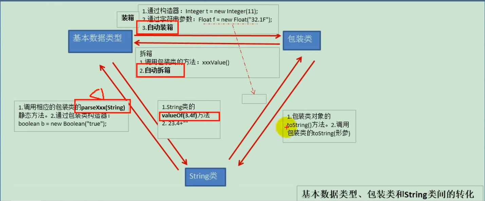


测试：

```javascript
@Test
void test(){
    // 基本数据类型转换为引用数据类型
    int a = 1;
    Integer b  = a;
    System.out.println(b);
    System.out.println(b.getClass());
    // String类型 转换为 基本数据类型
    String c = "100";
    int i = new Integer(c);
    int j = parseInt(c);
    System.out.println(i);
    System.out.println(j);
    // 基本数据类型转换为String类型
    String d = String.valueOf(a);
    System.out.println(d);
    // 包装类转换为基本数据类型
    Integer integer = 1;
    System.out.println(integer.getClass());
    //转换
    System.out.println(integer.intValue());
}
```

输出结果：

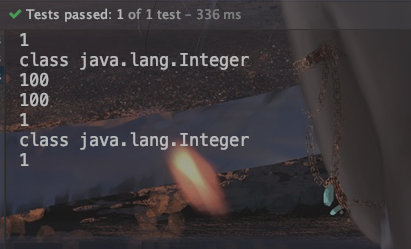

### 7.1、自动类型提升的面试题

题目：输出什么？

```javascript
@Test
void test(){
    Object obj = true ? new Integer(1) : new Double(2.0);
    System.out.println(obj);
}
```

输出：1.0

说明：

```javascript
Object obj = true ? new Integer(1) : new Double(2.0);
//1、使用了三元运算符，"?" 之前如果为true则执行":"之前的表达式，反之执行":"之后的表达式
//2、虽然"?"前为true 执行了"new Integer(1)" 但是以为这是一个程序语句，
//   所以"new Double(2.0)"也要执行，只不过执行的值没有赋给obj，由于Integer会自动提升为Double
//   类型，所以原本的new Integer(1)会变成1.0，并且此时的obj已经不是Integer类型了，而是Double类型。
```

### 7.2、Integer面试题

#### 1、题目：分别输出什么

```javascript
@Test
void test(){
    Integer i = new Integer(1);
    Integer j = new Integer(1);
    System.out.println(i==j);

    Integer a = 1;
    Integer b = 1;
    System.out.println(a==b);

   Integer c = 128;
   Integer d = 128;
   System.out.println(c==d);
}
```


输出：false true flase


> 解释：Integer内部定义了一个IntegerCache结构，IntegerCache中定义了Integer[],保存了从-128～127范围的整数。      （相当于缓存了起来）如果我们使用自动装箱的方式，给Integer赋值的范围在-128～127范围内时，可以使用数组元素，不用再在new了

2、题目

```javascript
Map<Long, String> map = new HashMap<>();
map.put(1l,"test");
System.out.println(map.get(1));
```

输出：null

> 解释： 因为泛型时Long “1”的包装类时Integer，相当于key找不到


## 8、static关键字

### 8.1、使用static关键字修饰静态变量（类变量）

- 修饰属性：按属性、是否使用了static修饰，有分为，静态属性、非静态属性（实例变量）

- -  实例变量：我们创建了类的多个对象，每个对象都是独立的拥有一套类中的非静态属性。当修改其中一个										对象中的非静态属性时，不会导致其他对象中同样的属性值的修改。

- -  静态变量：我们创建了类的多个对象，多个对象共享同一个静态变量，当通过某个对象修改静态变量时，会导致其他对象调用次静态变量时，是修改过的。

- static修饰属性的其他说明

- -  静态变量是随着类的加载而加载的，可以通过“类.静态变量”的方式去调用

- -  静态变量的加载要早于对象的加载。

- -  由于类只会加载一次，则静态变量在内存中也只会加载一份，切存在方法去的静态域中中

- -  类、对象调用静态变量、非静态变量对比

|  | 类变量（静态变量） | 实例变量 |
| - | - | - |
| 类 | √ | NO |
| 对象 | √ | √ |


- 静态属性举例：System.out 、Math.PI

- static的内存解析

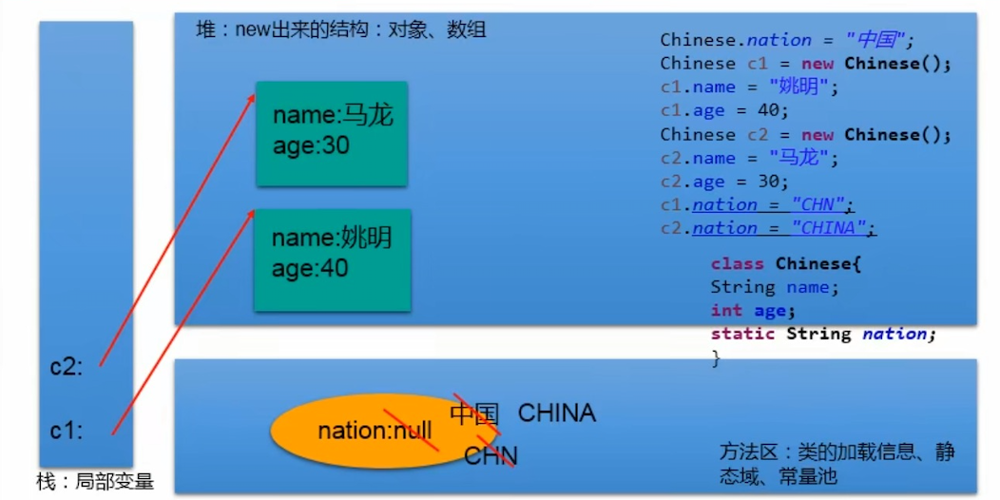

### 8.2、使用static修饰方法

- 随着类的加载而加载，可以通过“类.静态方法”的方式进行调用。

- 静态方法中，只能调用静态的方法或属性

- 非静态方法中，既可以调用非静态的方法或属性，也可以调用静态的方法或属性

- 类、对象调用静态方法、非静态方法对比

|  | 静态方法 | 非静态方法 |
| - | - | - |
| 类 | √ | NO |
| 对象 | √ | √ |


### 8.3、static的注意点

- 在静态方法内，不能使用this关键字，super关键字

- 关于静态属性和静态方法的使用，可以从生命周期的角度去理解

### 8.4、开发中，如何确定一个属性是否要声明为static的

- 属性可以被多个对象共享，不会随着对象的不同而不同

### 8.5、开发中，如何确定一个方法是否要声明为static的

- 操作静态属性的方法，通常设置为static的

- 工具类中的方法，习惯上声明为static的，比如，Math、Arrays、Collections

## 9、单例设计模式

> 设计模式：设计模式是大量的实践中总结和理论化之后选取的代码结构、编程风格、以及解决问题的思考方式。		

>                     设计模式免去了我们自己在思考和摸索。就像是经典的棋谱，不同的棋局，我们用不同的棋谱“套路”

- 单例设计模式，就是采取一定的方法保证整个的软件系统中，对某个类只能存在一个对象实例，并且该类只提供了一个取得起对象实例的方法如果我们要让类在一个虚拟机中只能产生一个对象，我们首先必须将类的构造器的访问权限设置为private，这样，就不能用new操作符在类的外部产生类的对象了，但在类内部仍可以产生该类的对象。因为在类的外部开始还无法得到类的对象，只能调用该类的某个静态方法以返回类内部创建的对象，静态方法只能访问类中的静态成员变量，所以，指向类内部产生的该类对象的变量也必须定义成静态的。

### 9.1、单例设计模式的实现

- 饿汉式

```java
class Bank{
    //1、私有化类的构造器
    private Bank(){
    }
    //2、内部创建类的对象
    //4、要求此对象也必须声明为静态的
    private static Bank bank = new Bank();
    //3、提供公共的方法，返回类的对象
    public static Bank getBank(){
        return bank;
    }
}
```

测试：

```java
public class test {
    public static void main(String[] args) {
        Bank ba1 = Bank.getBank();
        Bank ba2 = Bank.getBank();
        System.out.println(ba1==ba2);
    }

}
class Bank{
    //1、私有化类的构造器
    private Bank(){
    }
    //2、内部创建类的对象
    //4、要求此对象也必须声明为静态的
    private static Bank bank = new Bank();
    //3、提供公共的方法，返回类的对象
    public static Bank getBank(){
        return bank;
    }
}
```

输出：true

- 懒汉式

```java
class Bank{
    //1、私有化类的构造器
    private Bank(){
    }
    //2、声明当前类的对象，没有初始化
    //4、要求此对象也必须声明为静态的
    private static Bank bank = null;
    //3、提供公共的方法，返回类的对象
    public static Bank getBank(){
        if(bank == null){
            bank = new Bank();
        }
        return bank;
    }
}
```

测试：

```javascript
public class test {
    public static void main(String[] args) {
        Bank ba1 = Bank.getBank();
        Bank ba2 = Bank.getBank();
        System.out.println(ba1==ba2);
    }

}


class Bank{
    //1、私有化类的构造器
    private Bank(){
    }
    //2、声明当前类的对象，没有初始化
    //4、要求此对象也必须声明为静态的
    private static Bank bank = null;
    //3、提供公共的方法，返回类的对象
    public static Bank getBank(){
        if(bank == null){
            bank = new Bank();
        }
        return bank;
    }
}
```

输出： true

### 9.2、区分饿汉式 和懒汉式

- 饿汉式： 

- 坏处：对象加载时间过长

- 好处：饿汉式是线程安全的

- 懒汉式： 

- 坏处： 目前写法是线程不安全的-->安全的写法请看多线程章节

- 好处： 延迟对象的创建


## 10、main()方法的使用说明

- mian()作为一个程序的入口

- mian()方法也是一个普通的静态方法

## 11、类的成员之四，代码块（或初始化块）

- 代码块的作用，用来初始化类、对象

- 代码块如果有修饰的话，只能用static

- 分类：静态代码块 vs 非静态代码块

- 静态代码块

- -  内部可以有输出的语句

- -  随着类的加载而执行，而且只执行一次

- -  作用，初始化类的信息

- -  如果一个类中定义了多个代码块，则按照声明的先后顺序执行

- -  静态代码块的执行要优于非静态的代码块的执行

- -  静态代码块内只能调用静态的属性、静态的方法、不能点用静态的结构

- 非静态代码块

- -  内部可以有输出语句

- -  随着对象的创建而执行

- -  每创建一个对象，就执行一次非静态代码块

- -  作用：可以在创建对象时，对对象的属性进行赋值

- -  如果一个类中定义了多个非静态代码块，则按照声明的先后顺序执行

- -  非静态代码块内只能调用静态的属性、静态的方法、或非静态的属性、非静态的方法

- 对属性可以赋值的位置的顺序

-  1、默认初始化

-  2、显示初始化

-  3、构造器中初始化

-  4、有了对象以后，可以通过“对象.属性”或者"对象.方法"的方式，进行赋值

-  5、在代码中赋值

-  执行顺序为：1 - 2/5 - 3 - 4


## 12、final关键字

∆  final最终的

- final可以用来修饰的结构：类、方法、变量

- final用来修饰一个类：此类不可以被其他类继承。

- -  比如：String类、System类、StringBuffer类

- final用来修饰方法：表示该方法不可以被重写

- -  比如：Object类中的getClass();

- final用来修饰变量：此时“变量”称为常量

- -  final修饰属性：可以考虑赋值的位置有：显示初始化、代码块初始化、构造器初始化

- - final修饰局部变量：尤其是使用final修饰形参时，表明此形参是一个常量。当我们调用此方法是，给常量形参赋一个实参。以后就只能在方法体内使用此形参，但不能进行重新赋值。

- static final 用来修饰属性：全局变量

## 13、抽象类与抽象方法

- 概念：随着继承层次中一个一个新子类的定义，类变得越来越具体，而父类则更一般，更通用。类的设计应该保证父类和子类能够共享特征。有时将一个父类设计的非常的抽象，以至于他没有具体的实例，这样的类叫做抽象类。

- abstract关键字的使用

- -  abstract可以用来修饰的结构：属性、方法

- -  abstract修饰类：抽象类

- > 此类不能实例化（造对象）

- > 抽象类中一定有构造器，便于子类实例化时调用（涉及：子类对象实例化的全过程）

- > 开发中，都会提供抽象类的子类，让子类对象实例化，完成相关操作

- -  abstract修饰方法：抽象方法

- > 抽象方法只有方法的声明，没有方法体

- > 包含抽象方法的类一定是抽象类，。反之，抽象类中可以没有抽象方法。

- > 若子类没有重写父类的所有抽象方法，次子类可实例化

- > 若子类没有重写父类中的所有抽象方法，则此子类也是一个抽象类，需要使用的abstract修饰

- abstract使用上的注意点

- -  abstract不能用来修饰实行、构造器等结构

- -  abstratc不能用来修饰私有方法、静态方法、final的方法、fanal的类

- 思考：

- -  为什么抽象类不可以使用final关键字声明？

- > 答：抽象类要求子类去继承，而final要求不可被继承

- -  一个抽象类中可以定义构造器吗

- > 答：可以，虽然抽象类自己不可以造对象，但是抽象类的子类得造对象，调用父类(抽象类)的构造器

- -  是否可以这样理解：抽象类就是比普通类对定义了抽象方法，除了不可以直接进行类的实例话操作之外，并没有任何不同。

- > 答：不一定有抽象方法，其他的都没问题

## 14、接口（Interface）

- 1.接口使用interface来定义

- 2.Java中，接口和类是并列的两个结构

- 3.如何定义接口:定义接口中的成员

- -  3.1 JDK7及以前: 只能定义全局常量和抽象方法	

- >  全局常量: public static final的. 但是书写时，可以省略不写	

- >   public abstract的

- -  3.2 JDK8:除了定义全局常量和抽象方法之外，还可以定义静态方法、默认方法(略)

- 4.接口中不能定义构造器的!意味着接口不可以实例化

- 5. Java开发中， 接口通过让类去实现( implements )的方式来使用.

- -  如果实现类覆盖了接口中的所有抽象方法，则此实现类就可以实例化

- -  如果实现类没有覆盖接口中所有的抽象方法，则此实现类仍为一一个抽象类

- 6. Java类可以实现多个接口 --- >弥补了Java单继承性的局限性

- -  格式: class AA extends BB implements CC,DD,EE		

- -  关系：class AA extends BB implements CC,DD,EE。

-  若 BB 、CC、DD、EE都有m1()方法

- 调用了m1方法，调用了父类的（BB）的m1()方法	

- -  关系：class AA implements CC,DD,EE

- 若 CC、DD、EE都有m1()方法

- 调用了m1方法，编译不通过，想调用可以用 "接口.m1"的形式去调用 或重写 m1方法（重写了m1相当于重写了CC、DD、EE三个接口的m1方法）

- 7.接口与接口之间可以继承， 而且可以多继承

- 8.实现接口的类中必须提供接口中所有方法的具体实现内容，方可实例化。否则，仍是抽象类

- 9.接口的主要用途就是被实现类实现。（面向接口编程）

- 10.与继承关系类似，接口与实现类之间存在多态性。

- 11.接口和类是并列关系，或者可以理解为是特殊的类，从本质上讲，接口是一种特殊的抽象类，这种抽象类中只包含常量和方法的定义（jdk7.0及以前）而没有变量和方法的实现。

### 14.1、Java8中接口中的新特性

- 1、接口中定义的静态方法，只能通过接口来调用

- 2、通过实现类的对象，可以调能用接口中的默认方法。如果实现类重写了接口中的默认方法，调用是，仍然调的是重写以后的方法

- 3、如果子类（或实现类）继承的父类和实现的接口中声明了同名同参数的默认方法，那么子类在没有重写此方法的情况下，默认调用的是父类 中的同名同参数的方法。-->类优先的原则

- 4、如果实现类实现了多个接口，而这个多个接口中的定义了同名同参数的默认方法，那么实现类没有 虫科此方法的情况下，报错。-->接口冲突（这要求我们必须在实现类中重写此方法）

- 5、如何在子类（或实现类）的方法中调用父类、接口中被重写的方法

- - method3(); // 调用自己定义的重写的方法

- - super.method3() // 调用父类中声明的

- - CompareA.super.method3() // 调用接口中默认的方法

###  		14.2、面试题:(抽象类和接口有什么异同？)

- 相同点：不能实例化、都可以包含抽象方法。

- 不同点：

- 抽象类和接口（java7、java8，java9）的定义的、内部结构解释说明

- 类：单继承性

- 接口：多继承

- 类与接口：多实现。

## 15、内部类

类的内部成员之五：内部类

- java中允许将一个类A声明在另一个类B中，则类A就是内部类，类B就称为外部类。

- 内部类的分类：成员内部类（静态、非静态） vs 局部内部类（方法内、代码块内、构造器内）

- 成员内部类

- 一方面，作为外部类的成员：

- 调用外部类的结构

- 可以被static修饰

- 可以被4种不同的权限修饰符修饰

- 另一方面，作为类

- 类中可以定义属性、方法、构造器等

- 可以被final修饰，表示此类不能被继承。言外之意，不使用final修饰，就可以被继承

- 可以呗abstract（抽象）修饰

- 关注如下三个问题

- 如何实例化成员内部类的对象

- 如何在成员类中区分调用外部类的结构

- 开发中局部内部类的使用

## 16、异常（Exception）

- 异常：在Java语言中，将程序执行中发生的不正常的情况称为“异常”。（开发过程中的语法错误和逻辑错误不是异常）

- Java程序在执行过程中所发生的异常时间可以分为两大类：

- Error：Java虚拟机无法解决的严重问题。如：JVM系统的内部错误、资源耗尽等严重情况。比如：StackOverflowError（栈溢出）和OOM（堆溢出）。一般不编写针对行的代码处理

- main(arge); (在main方法中main方法，会造成栈溢出情况) java.lang.StackOverflowError

- Integer[] arr = new Integer[1024*1024*1024]; (定义个Integer数组，初始长度1024*1024*1024 会造成堆溢出情况) java.lang.OutOfMemoryError

- Exception：其他因编程错误或偶然的外部因素导致的一般性的错误，可以是用针对应的代码进行处理。

- 例如：

- 空指针异常

- 试图读取不存在的文件

- 网络连接中断

- 数组角标越界

- 异常的体系结构

- java.lang.Throwable

- java.lang.Error：一般不编写针对的代码进行处理

- java.lang.Exception：可以进行异常处理

- 编译时异常（checked）

- IOException

- FileNotFoundException

- ClassNotFoundException

- 运行时异常（unchecked）

- NullPointerException

- ArrayIndexOutOfBoundsException

- ClassCastException

- NumberFormatException

- InputMismatchException

- ArithmeticException

- Java异常的处理方式：

- 方式一：try-catch-finally

- 方式二：throws+异常类型

- 异常的处理：抓抛模型

- 过程一：“抛”：程序在正常执行的过程中，一旦出现异常，就会在异常代码处生成一个对应异常类的对象。并将此对象抛出。一旦对象抛出。其后的代码就不再执行。

- 关于异常对象的产生：

- 系统自动生成异常对象

- 手动的生成一个异常对象，并抛出（throw）（throw new 异常类型(msg)）

- 过程二：“抓”：可以理解为异常的处理方式：1、try-catch-finally 2、throws

- try-catch-finally的使用

```javascript
try{
    // 可能出现异常的代码
}catch(异常类型1 变量名1){
    //处理异常的方式
}catch(异常类型2 变量名2){
    //处理异常的方式
}catch(异常类型3 变量名3){
    //处理异常的方式
}
...
finally{
    // 一定会被执行的代码（如果try里有return语句的话finally在return之前执行）
}
```

- 说明：

- finally是可选的

- 使用try将可能出现异常的代码包装起来，在执行过程中，一旦出现异常，就会生成一个对应的异常对象，根据此对象的类型，去catch中进行匹配

- 一旦try中的异常对象匹配到某一个catch是就进入catch中进行异常处理，一旦处理完成，就跳出当前的try-catch结构（在没有写finally的情况下）。继续执行其后的代码

- catch中的异常类型如果没有子父类关系，则谁声明在上，谁声明在下，无所谓。

- catch中的异常类型如果满足子父类关系，则要求子类一定声明在父类的上面。否则，报错

- 常用的异常对象处理方式：1、String getMessage() 2、printStackTrace()

- 在try结构中声明的变量，再出了try结构以后就不能在被调用

- try-catch-finally结构可以嵌套

- 体会：

- 使用try-catch-finally处理编译时异常，使得程序在编译时就不再把报错，但是运行时仍可能报错。相当于我们在使用try-catch-finally讲一个编译时可能出现的异常，延迟到运行时出现。

- 开发中，由于运行时异常比较常见，所以我们通常就不针对运行时异常try-catch-finally了，针对于编译时异常，我们说一定要考虑的处理

- try-catch-finally中finally的使用

- finally时可选的

- finally中声明的事一定会被执行的，即使catch中又出现了异常，try中有return语句，catch中有return语句等情况。

- 像数据库连接，输入输出流、网络编程Socket等资源JVM事不能自动回收的，我们需要自己手动的进行资源的释放，此时的资源释放，就需要声明在finally中

- 异常处理的方式二：throws + 异常类型

- “throws + 异常类型” 写在方法的声明处。指明此方法执行时，可能会抛出异常类型，一旦当方法体执行时，出现异常，仍会在异常代码处生成一个异常类的对象，此对象满足throws后异常类型时，就会抛出，异常代码后续的代码就不再执行。

- 体会：try-catch-finally:真正的将异常给处理掉了。throws的方式只是将异常抛给了方法的调用者，并没有真正将异常处理掉。

- 子类重写的方法抛出的异常类型不大于父类被重写的方法抛出的异常类型

- 开发中如何选择使用try-catch-finally 还是throws？

- 如果父类中被重写的方法没有throws方式处理异常，则子类重写的方法也不能使用throws，意味着如果子类重写的方法中有异常，必须使用try-catch-finally方式处理

- 执行的方法a中，先后又调了另外两个方法，这几个方法时递进的关系执行的，我们建议这几个方法使用throws方式进行处理。而执行的方法a可以考虑使用try-catch-finally方式进行处理

- 如何自定义异常类？

- 继承于现有的异常类：RuntimeException 、Exception

- 提供全局变量：serialVerSionUID（可参考现有异常类）

- 提供重载的构造器

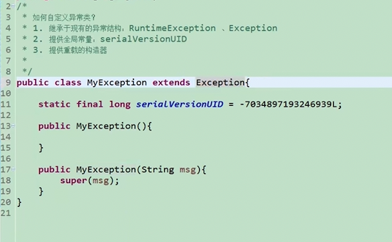

- 一首小悟结束异常处理

- 世界上最遥远的距离，是我在if里你在else里，似乎一直相伴又永远分离。

- 世界上最痴心的等待，是我当case你是switch，或许永远都端不上自己

- 世界上最真情的相依，是你在try里我是catch。无论你发什么脾气，我都默默承受，静静处理。到那时，再来期待我们的finally

- 对比两种处理方式try... vs throws

- try-catch-finally:真正的将异常处理掉了

- throws：只是将异常抛给了方法的调用者，并没有真正的将异常处理掉

- 面试题：

- throw 和 throws的区别：

- throw 表示抛出一个异常类的对象，生成异常对象过程。声明在方法体内。

- throws 属于异常处理的一种方式，声明在方法的声明处

- final、finally、finalize三者的区别？

- Collection 和 Collections

- String、StringBuffer、StringBuilder

- ArrayList 、LinkedList

- HashMap、LinkedHashMap

- 重写、重载

- 抽象类、接口

- == 、equals()

- sleep()、wait()

## 17、多线程

- 基本概念

- 程序（program）：是为了完成特定任务、用某种语言编写的一组指令的集合。即指一段静态的代码，静态对象

- 进程（process）：是程序的一次执行过程，或事正在运行的一个程序。是一个动态的过程:有他自身的产生、存在和消亡的过程。——生命周期

- 如：运行的亲戚、运行的MP3播放器

- 程序是静态的，进程是动态的。

- 进程作为资源分配的单位，系统在运行时会为每个进程分配不同的内存区域

- 线程（thread）：进程可进一步细化为线程，是一个程序内部的一条执行路径。

- 若一个进程同一时间并行执行多个线程，就是支持多线程的

- 线程作为调度和执行的单位，每个线程拥有独立的运行栈个程序计数器（pc），线程切换的开销小

- 一个进程中多个线程共享相同的内存单元/内存地址空间->他们 从同一堆中分配对象，可以访问相同的变量和对象。这就使得线程间通信更简便、高效。单多个线程操作共享的系统资源可能就会带来安全的隐患。

- 单核CPU和多核cpu的理解

- 单核CPU，其实是一种假的多线程，因为在一个时间单元内，也只能执行一个线程的任务。例如:虽然有多车道，但是收费站只有一个工作人员在收费，只有收了费才能通过，那么CPU就好比收费人员。如果有某个人不想交钱，那么收费人员可以把他“挂起”(晾着他， 等他想通了，准备好了钱，再去收费)。但是因为CPU时间单元特别短，因此感觉不出来。

- 如果是多核的话，才能更好的发挥多线程的效率。 (现在的服务器都是多核的)，一个Java应用程序java.exe， 其实至少有三个线程: main() 主线程，gc()，垃圾回收线程，异常处理线程。当然如果发生异常，会影响主线程。

- 并行与并发

- 并行:多个CPU同时执行多个任务。比如:多个人同时做不同的事。

- 并发:一个CPU(采用时间片)同时执行多个任务。比如:秒杀、多个人做同一件事。

- 使用多线程的优点

- 背景:以单核CPU为例，只使用单个线程先后完成多个任务(调用多个方法)，肯定比用多个线程来完成用的时间更短，为何仍需多线程呢?

- 多线程程序的优点:

- 1.提高应用程序的响应。对图形化界面更有意义，可增强用户体验。

- 2.提高计算机系统CPU的利用率

- 3.改善程序结构。将既长又复杂的进程分为多个线程，独立运行，利于理解和

- 何时需要多线程

- 程序需要同时执行两个或多个任务。

- 程序需要实现一些需要等待的任务时，如用户输入、文件读写操作、网路操作、搜索等。

- 需要一些后台运行的程序时

- 多线程的创建：

- 方式一：继承于Thread类

- 1、创建一个继承于Thread类的子类

- 2、重写Thread类的run() -->将此线程执行的操作声明在run()中

- 3、创建继承于Thread类的子类对象

- 4、通过此对象调用start()

- 例子：遍历100以内的所有偶数

```javascript

@Test
void test2(){
    //创建Thread类的子类对象
    ThreadTest threadTest = new ThreadTest();
    //通过此对象调用start() // 1、启动当前线程 2、调用当前线程的run()
    threadTest.start();
    
    //以下代码仍然会在main线程中执行
//        for (int i = 0 ; i <= 100 ; i++){
//            if (i % 2 == 0 ){
//                System.out.println(i + "***********main************");
//            }
//        }
}

//创建一个继承于Thread类的子类
class ThreadTest extends Thread{
    //重写Thread类的run() -->将此线程执行的操作声明在run()中
    @Override
    public void run() {
        for (int i = 0 ; i <= 100 ; i++){
            if (i % 2 == 0 ){
                System.out.println(i);
            }
        }
    }
}
```


- 说明一：我们不能通过直接调用run()方法启动线程（那样就相当于实例化对象，调用run方法，不是开启了多线程）

- 说明二：再启动一个线程，遍历100以内的偶数，不可以还让已经start()的线程去执行，会报IllegalThreadStateException (我们可以在创建一个线程对象)

```javascript
ThreadTest threadTest1 = new ThreadTest();
threadTest1.start();
```

- 创建多线程的方式二：实现Runnable接口

- 创建一个实现了Runnable接口的类

- 实现类去实现Runnable中的抽象方法:run()

- 创建实现类的对象

- 将此对象作为参数传递到Thread类的构造方法，创建Thread类的对象

- 通过Thread类的对象调用start()：一、启动线程 二、调用了当前线程的run()-->调用了Runable类型的target的run();

```javascript

@Test
void test2(){
    //3、创建实现类的对象
    ThreadTest3 threadTest3 = new ThreadTest3();
    //4、将此对象作为参数传递到Thread类的构造方法，创建Thread类的对象
    Thread t1 = new Thread(threadTest3);
    //5、通过Thread类的对象调用start()
    t1.start();
}
 
 // 1、创建一个实现了Runnable接口的类
class ThreadTest3 implements Runnable{
    //2、实现类去实现Runnable中的抽象方法:run()
    @Override
    public void run() {
        for (int i = 0 ; i <= 100 ; i++){
            if (i % 2 == 0 ){
                System.out.println(Thread.currentThread().getName()+"*****"+i);
            }
        }
    }
}
```

- 比较创建线程的两种方式

- 开发中：优先选择：实现Runnable接口的方式

- 原因；

- 实现的方式没有类的单继承性和局限性

- 实现的方式更适合来处理多个线程有共享数据的情况

- Thread类也是实现了Runnable接口

- 相同点：两种方式都需要重写run()，将线程要执行的逻辑声明在run()中

-  Thread类有关的方法

- start() : 启动当前线程；调用当前线程的run()

- run() : 通常需要重写Thread类中的此方法，将创建的线程要执行的操作声明在此方法中

- currentThread() : 静态方法，返回执行当前代码的线程

- getName() : 获取当前线程的名字

- setName() : 设置当前线程的名字

- yield() : 释放当前cpu的执行权

- join() : 在线程a中调用线程b的join(),此时线程a就会进入阻塞状态，直到线程b完全执行完以后，线程a才结束阻塞。(如果除了a、b线程外，还存在其他线程的话，不一定等b执行完再去执行其他线程，只是当b执行完之前a是一直阻塞的)

- stop() : 已过时。当执行方法时，强制结束当前线程。

- sleep(long millitime) : 让当前线程”睡眠“指定的millitime毫秒。在指定的millitime毫秒内，当前线程是阻塞状态。

- isAlive() : 判断当前线程是否存活

- 线程的优先级（用1～10表示，10表示最大优先级）

- MAX_PRIORITY:10 、MIN_PRIORITY：1、NORM_PRIORITY：5 --> 默认为5

- 如何获取和设置当前线程的优先级

- getPriority():获取线程的优先级

- setPriority(int p):设置线程的优先级

- 说明：高优先级的线程要抢占低优先级线程的cpu的执行权。但是从概率上讲，高优先级的线程高概率情况下被执行，并不意味着只有当高优先级的线程执行完以后，低优先级的线程在执行

- 线程的生命周期

- JDK中用Thread.State类定义了线程的几种状态。Java语言使用Thread类及其子类的对象来表示线程，在他的一个完整的生命周期中通常要经历如下的五种状态

- 新建 ： 当一个Thread类或其子类的对象被声明并创建时，新生的线程对象处于新建的状态

- 就绪 ： 处于新建状态的线程被start()后，将进入线程队列等待CPU时间片，此时他已具备运行条件，只是没分配到CPU资源

- 运行 ： 当就绪的线程被调度并获得CPU资源时，便进入了运行状态，run()方法定义了线程的操作功能

- 阻塞 ： 在某种特殊情况下，被认为挂起货执行输入输出操作时，让CPU并临时中止自己的执行，进入阻塞状态

- 死亡 ： 线程完成了他的全部工作或线程被提前强制性的终止或出现异常导致结束

  ​                 

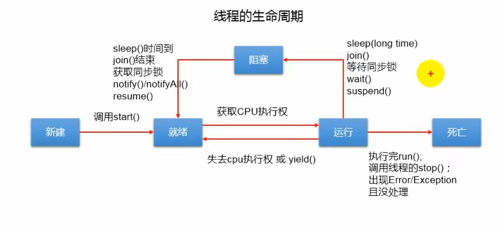


- 线程安全问题的举例和解决措施

- 例子：创建三个窗口卖票，总票数为100张，使用实现Runnable接口的方式

```javascript
public static void main(String[] args) {
    ThreadTest1 threadTest1 = new ThreadTest1();
    Thread t1 = new Thread(threadTest1);
    Thread t2 = new Thread(threadTest1);
    Thread t3 = new Thread(threadTest1);
    t1.setName("窗口1");
    t2.setName("窗口2");
    t3.setName("窗口3");
    t1.start();
    t2.start();
    t3.start();
}

static class ThreadTest1 implements Runnable{
    private int ticket = 100;
    @Override
    public void run() {
        while (true){
            if(ticket>0){
                try {
                    Thread.sleep(100);
                } catch (InterruptedException e) {
                    e.printStackTrace();
                }
                System.out.println(Thread.currentThread().getName()+"卖票，票号为"+ticket);
                ticket--;
            }
        }
    }
}
```

- 问题：卖票过程中，出现了重票、错票 ——>出现了线程的安全问题

- 问题出现的原因：当一个线程操作车票的过程中，尚未操作成完成时，其他线程参与进来，也操作车票

- 如何解决：当一个线程a在操作ticket（总车票数）的时候，其他线程不能参与进来，直到其他线程a操作完成ticket时，其他线程才可以开始操作ticket，这种情况即使线程a出现了阻塞，也不能被改变

- 在java中，我们可以通过同步机制，来解决线程的安全问题。

- 方式一：同步代码块

```javascript
synchronized(同步监视器){
    //需要被同步的代码
}

// 同步监视器：锁，任何一个对象都可以，相当于所有线程都去竞争这个对象，如果线程进入sychronized获得对象
// 当线程离开synchronized时将失去对象（锁）
```


- 说明： 

- 同步代码：操作共享数据的代码，即为同步代码。--> 不能包含代码多了，也不能包含代码少了。

- 共享数据：多个线程共同操作的数据，比如：ticket

- 同步监视器： 俗称：锁。任何一个类的对象，都可以充当锁

- 要求：多个线程必须共用同一把锁。

- 补充：

- 在实现Runable接口创建多线程的方式中，我们可以考虑使用this充当同步监视器（锁）

- 在继承Thread类创建多线程的方式中，慎用this关充当同步监视器（锁），考虑使用当前类（XXX.Class）充当同步监视器

- 同步方式，解决了线程的安全的问题  --好处  ； 操作同步代码是，只能有一个线程参与，其他线程等待。相当于是一个单线程的过程，效率低 -- 局限性

```javascript
// 同步锁解决卖票问题
public static void main(String[] args) {
    ThreadTest1 threadTest1 = new ThreadTest1();
    Thread t1 = new Thread(threadTest1);
    Thread t2 = new Thread(threadTest1);
    Thread t3 = new Thread(threadTest1);
    t1.setName("窗口1");
    t2.setName("窗口2");
    t3.setName("窗口3");
    t1.start();
    t2.start();
    t3.start();
}

static class ThreadTest1 implements Runnable{
    private int ticket = 100;
    Object object = new Object();
    @Override
    public void run() {
        while (true){
            synchronized(object){
                if(ticket>0){
                    try {
                        Thread.sleep(100);
                    } catch (InterruptedException e) {
                        e.printStackTrace();
                    }
                    System.out.println(Thread.currentThread().getName()+"卖票，票号为"+ticket);
                    ticket--;
                }else {
                    break;
                }
            }
        }
    }
}

```


- 方式二：同步方法：如果操作共享数据的代码完整的声明在一个方法中，我们不妨将此方法声明为同步的。

- 将需要同步的代码抽取出来做成方法，在方法的返回类型前加上synchronized即可实现同步。

```javascript
// 解决实现Runnable接口的线程安全问题
// 同步监视器：this（当前对象）
public synchronized void show(){
    if(ticket>0){
        System.out.println(Thread.currentThread().getName()+"卖票，票号为"+ticket);
        ticket--;
    }
}

// 解决继承Thread类的线程安全问题
// 同步监视器：当前类（XXX.Class）
public static synchronized void show(){
    if(ticket>0){
        System.out.println(Thread.currentThread().getName()+"卖票，票号为"+ticket);
        ticket--;
    }
}
```

- 同步方法仍然涉及到同步监视器（锁）只是不需要显示的声明

- 非静态的同步方法，同步监视器是：this  --> 建议 解决实现Runnable接口的

- 静态的同步方法，同步监视器是：当前类本身 --> 建议 解决继承Thread类的


- 单例模式-懒汉式——解决线程安全

```javascript
// 懒汉式
class BankTest{
    private BankTest(){

    }

    private static BankTest instance = null;

    public static BankTest getInstance() {
        if(instance == null){
            instance  = new BankTest();
        }
        return instance;
    }
}
```

- 方式一

```javascript
// 效率比较低
public static BankTest getInstance() {
    synchronized(Bank.class){
        if(instance == null){
            instance  = new BankTest();
        }
        return instance;
    }

}
```

- 方式二

```javascript
// 效率比较高
public static BankTest getInstance() {
    if(instance == null){
        synchronized(Bank.class){
            if(instance == null){
                instance  = new BankTest();
            }
        }
    }
    return instance;
}
```

- 线程的死锁问题

- 死锁的理解：不同的线程分别占用了对方需要的同步资源不放弃，都在等待对方放弃自己的同步资源（锁），就形成了线程的死锁。

```javascript
// 死锁演示
public static void main(String[] args) {

    StringBuffer s1 = new StringBuffer();
    StringBuffer s2 = new StringBuffer();

    new Thread(){
        @Override
        public void run() {
            synchronized (s1){
                s1.append("1");
                s2.append("a");
                try {
                    sleep(100);
                } catch (InterruptedException e) {
                    e.printStackTrace();
                }
                synchronized (s2){
                    s1.append("2");
                    s2.append("b");
                    System.out.println(s1);
                    System.out.println(s2);
                }
            }
        }
    }.start();


    new Thread(new Runnable() {
        @Override
        public void run() {
            synchronized (s2){
                s1.append("3");
                s2.append("c");
                synchronized (s1){
                    s1.append("4");
                    s2.append("d");
                    System.out.println(s1);
                    System.out.println(s2);
                }
            }
        }
    }).start();
}
```

- 说明

- 出现死锁以后，不会出现异常，不会出现提示，只是所有的线程都处于阻塞状态，无法继续。

- 我们使用同步时，要避免出现死锁。

- 解决办法

- 专门的算法、原则

- 尽量减少同步资源的定义

- 尽量避免嵌套同步

- 解决线程的安全问题的方式三：Lock锁  --- JDK5.0新增

- 实例化ReentrantLock

- ReentrantLock实例化对象调用lock()方法,给同步代码上锁

- 调用解锁方法:lock.unlock();

```javascript
// lock 上锁演示
public static void main(String[] args) {
    ThreadTest1 threadTest1 = new ThreadTest1();
    Thread t1 = new Thread(threadTest1);
    Thread t2 = new Thread(threadTest1);
    Thread t3 = new Thread(threadTest1);
    t1.setName("窗口1");
    t2.setName("窗口2");
    t3.setName("窗口3");
    t1.start();
    t2.start();
    t3.start();
}

static class ThreadTest1 implements Runnable{
    // 实例化ReentrantLock
    private ReentrantLock lock = new ReentrantLock(true);
    private int ticket = 100;
    @Override
    public void run() {
        while (true){
            lock.lock();
            try{
                // ReentrantLock实例化对象调用lock()方法
                // 给同步代码上锁
                if(ticket>0){
                    System.out.println(Thread.currentThread().getName()+"卖票，票号为"+ticket);
                    ticket--;
                }else {
                    break;
                }
            }finally {
                // 调用解锁方法
                lock.unlock();
            }
        }
    }

}
```


- 面试题：

- synchronized 与 Lock的异同？

- 相同点：二者都是用来解决线程安全的问题

- 不同点：

- sychronized机制在执行完相应的代码以后，自动的释放同步监视器（锁）

- Lock需要手动的上锁（lock()）,同时解锁也需要手动的实现（unlock()）

- 如何解决线程的安全问题？有几种方式

- 两种或者三种

- 两种的话就是：synchronized和lock

- 三种的话就是：synchronized代码块、synchronized方法、Lock

- sleep() 和 wait()的异同？

- 相同点；一旦执行方法，都可以使得当前的线程进入阻塞状态

- 不同点：

- 两个方法声明的位置不同：Thread类中声明sleep() , Object类中声明wait()

- 调用的范围不同：sleep()可以在任何需要的场景下调用，wait()必须在同步代码块或同步方法中调用

- 关于是否释放同步监视器（锁）：如果两个方法都是用在同步代码块或同步方法中，sleep()不会释放锁，而wait()会释放锁

- 线程的通信

- 例子：使用两个线程打印1-100。线程1，线程2，交替打印

- 涉及到的方法：

- wait() : 一旦执行此方法，当前线程就进入阻塞状态，并释放同步监视器（锁）

- notify() ：一旦执行此方法，就会被唤醒一个被wait()的线程，如果有多个线程被wait，就唤醒优先级高的，若优先级相同，就随机唤醒。

- notifyAll()：一旦执行此方法。就会唤醒所有被wait的线程。

- 说明：

- wait()、notify()、notifyAll() 三个方法必须使用在同步代码块或同步方法中（synchronized）

- wait()、notify()、notifyAll() 三个方法的调用者必须是同步代码块或同步方法中的同步监视器（锁）否则会出现异常

- wait()、notify()、notifyAll() 三个方法是定义在类java.lang.object类下的

- JDK5.0新增线程创建方式

- 创建线程的方式三：实现Callable接口 。  --- JDK 5.0新增

- 创建一个实现Callable接口的实现类

- 实现call()方法，将此线程需要执行的操作声明在call()方法当中

- 创建Callable接口实现类的对象

- 将Callable接口实现类的对象作为参数传递到FutureTask类的构造器中，创建FutureTask的对象

- 将FutureTask的对象作为参数传递到Thread类的构造器当中，创建Thread类对象，并调用start()

- 若有需要获取Callable中call方法的返回值的话，通过FutureTask的对象调用get()，获取

```javascript
/**
 * @Description: 实现Callable接口方式，创建线程
 * @Author: Yang.Guo
 * @Date: 2021/03/03/3:22 PM
 */
public class ThreadNew {
    public static void main(String[] args) {
        numThread thread = new numThread();
        FutureTask futureTask = new FutureTask(thread);
        new Thread(futureTask).start();
        try {
            System.out.println("总和为："+ futureTask.get());
        } catch (InterruptedException e) {
            e.printStackTrace();
        } catch (ExecutionException e) {
            e.printStackTrace();
        }
    }

}
class numThread implements Callable {
    int sum = 0;
    @Override
    public Object call() throws Exception {
        for (int i = 1; i < 100; i++) {
            if(i%2 == 0){
                System.out.println(Thread.currentThread().getName()+":"+i);
                sum += i;
            }
        }
        return sum;
    }
}
```

- 如何理解实现Callable接口的方式创建多线程比实现Runable接口创建多线程方式强大？

- call() 可以有返回值的

- call() 可以抛出异常，被外面的操作捕获，获取异常信息

- Callable是支持泛型的

- 新增方式二 ：使用线程池

- 背景：经常创建和销毁、使用量特别大的资源，比如并发情况的线程，对性能影响很大。

- 思路：提前创建好多个线程，放在线程池中，使用时直接获取，使用完放回池中。可以避免频繁的创建销毁、实现重复利用。类生活中的公共交通工具

- 好处：

- 提高响应速度（减少了创建新线程的时间）

- 降低了资源消耗（重复利用线程池中的线程，不需要每次都创建）

- 便于线程管理

- corePoolSize：线程池的大小

- maximumPoolSize:最大线程数

- keepAliveTime：线程没有任务时最多保持多长时间后会终止

- ...

- 创建方式

- JDK5.0起提供了线程池的相关API：ExecutorService 和 Executors

- ExecutorService：真正的线程池接口。常见的子类ThreadPoolExecutor

- void execute(Runnable command):执行任务/命令，没有返回值，一般用来执行Runable

- <T>Future<T>submit(Callable<T> task):执行任务，有返回值，一般用来执行Callable

- void shutdown():关闭连接池

- Executor：工具类、线程池的工厂类，用于常见并返回不同类型的线程池

- Executors.newCachedThreadPool(): 创建- -个可根据需要创建新线程的线程池

- Executors.newFixedThreadPool(n); 创建一个可重用固定线程数的线程池

- Executors.newSingleThreadExecutor(): 创建一个 只有一个线程的线程池

- Executors.newScheduledThreadPool(n): 创建一个线程池， 它可安排在给定延迟后运行命令或者定期地执行。

- 使用：

- 1、提供指定线程数量的线程池；Executors.newFixedThreadPool(10);

- 2、创建一个实现Runnable接口的类；class thread implements Runnable

- 3、实例化实现Runnable接口的类；thread thread = new thread();

- 4、将实现Runnable接口的类的实例化对象一参数的形式传给execute()方法service.execute(thread);

- 5、关闭线程池；service.shutdown();

- 6、若想在开启个线程就在创建个实现Runable接口的实例； thread thread1 = new thread();

- 7、开启第二个线程；service.execute(thread1);

```javascript
/**
 * @Description: 创建线程池的方式四
 * @Author: Yang.Guo
 * @Date: 2021/03/03/5:31 PM
 */
public class ThreadPool {
    public static void main(String[] args) {

                                    // 1、提供指定线程数量的线程池
        ExecutorService service = Executors.newFixedThreadPool(10);

        // 3、实例化实现Runnable接口的类
        thread thread = new thread();

        // 6、若想在开启个线程就在创建个实现Runable接口的实例
        thread thread1 = new thread();

        // 4、将实现Runnable接口的类的实例化对象一参数的形式传给execute()方法
        service.execute(thread);

        // 7、开启第二个线程
        service.execute(thread1);
        
        //也是开启线程，适用于Callable
        //service.submit(Callable callable)

        // 5、关闭连接池
        service.shutdown();

    }
}

// 2、创建一个实现Runnable接口的类
class thread implements Runnable{

    @Override
    public void run() {
        for (int i = 0; i < 100; i++) {
            if (i%2 == 0){
                System.out.println(Thread.currentThread().getName() + ":"+ i);
            }
        }
    }
}
```

## 18、常用类

### 18.1、字符串相关的类（String）

- String的特性

- string类：代表字符串

- String声明为final的，不可被继承

- String实现了Serialized接口：表示字符串是支持序列话的。

- String实现了Comparable接口：表示String可以比较大小。

- String内部定义了fianl char[] value 用于存储字符串数据。

- String：代表不可变的字符传序列。简称：不可变性

- 体现

- 当字符串重新赋值时，需要重写指定内存区域赋值，不能使用原有的value进行赋值

- 当对现有的字符串进行连接操作时，也需要指定内存区域赋值，不能使用原有的value进行赋值

- 当调用了String的replace()方法修改指定字符或字符串时，也需要重新指定内存区域

- 通过字面量的方式（区别于new）给一个字符串赋值，此时的字符串值声明在字符床常量池中

- 字符串常量池中不会存储相同的内容

- 字符串对象的存储


- String不同实例化方式的对比

- 通过字面量的方式

- 通过new+构造器的方式

- 面试题：String s = new String("abc");方式创建对象，在内存中创建了几个对象？

- 两个：一个是堆空间中new的结构，另一个是char[]对应的常量池中的数据：“abc”

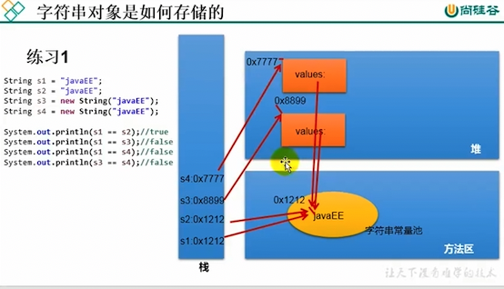

- 说明：

- 通过字面量定义的方式：此时的s1和s2的数据javaEE声明在方法区的字符串常量池中

- 通过new+构造器的方式：此时的s3和s4保存的地址值，是数据在堆空间中开辟空间以后对应的地址值。

- 练习

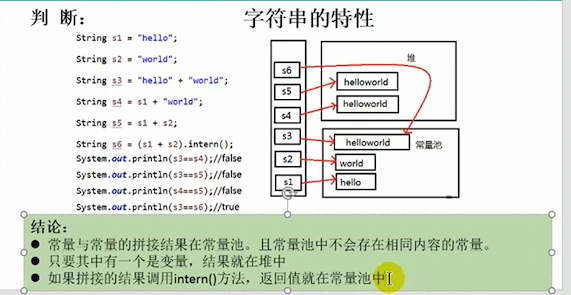

- 面试题

```javascript

class StringTest{
    String str = new String("good");
    char[] ch = {'t','e','s','t'};

    public void chenge(String str , char ch[]){
        str = "test ok";
        ch[0] = 'b';
    }
}
@Test
public void test7(){
    StringTest stringTest = new StringTest();
    stringTest.chenge(stringTest.str,stringTest.ch);
    System.out.println(stringTest.str);
    System.out.println(stringTest.ch);
}

// 输出：good 、best
```

- 字符串中常用的方法

- int length():返回字符串的长度: return value.length

- char charAt(int index):返回某索引处的字符return value[index]

- boolean isEmpty():判断是否是空字符串: return value.length== 0

- String toLowerCase():使用默认语言环境，将String 中的所有字符转换为小写

- String toUpperCase():使用默认语言环境，将String 中的所有字符转换为大写

- String trim():返回字符串的副本，忽略前导空白和尾部空白

- boolean equals(Object obj):比较字符串的内容是否相同

- boolean equalsIgnoreCase(String anotherString): 与equals方法类似， 忽略大小写

- String concat(String str):将指定字符串连接到此字符串的结尾。等价于用“+”

- int compareTo(String anotherString):比较两个字符串的大小

- String substring(int beginIndex): 返回一个新的字符串，它是此字符串的从

- beginIndex开始截取到最后的一一个 子字符串。

- String substring(int beginIndex, int endIndex) :返回一个新字符串，它是此字符串从beginIndex开始截取到endIndex(不包含)的个 子字符串。

- String与其他类型进行转换

- String --> char[]: 调用String的toCharArray();

- char[] --> String: 调用String的构造器

- String与byte[]之间的转换

- 编码：String --> byte[]: 调用String的getBytes();

- 解码： btye[] --> String: 调用String的构造器

- 说明

- 编码：字符集 -->字节（看的懂 -->看不懂的二进制数据）

- 解码：编码的逆过程，字节 -->字符串（看不懂的二机制数据--> 看得懂）

- 解码时，要求解码使用的字符集必须与编码时使用的字符集一致，否则就会出现乱码

- String、StringBuffer、StringBuilder三者的异同？

- String：不可变的字符序列；底层使用char[]储存

- StringBuffer；可变的字符序列，线程安全的，效率低；底层使用char[]储存

- Stringbuilder：可变的字符序列；jdk5.0新增的，线程不安全的，效率高；底层使用char[]储存

- 源码分析

```javascript
String str = new String();//char[] value = new char[0];
String str1 = new String("abc");//char[] value = new char[]{'a', 'b','c'};
StringBuffer sbl = new StringBuffer();//char[] value = new char[16]; 底层创建了一个长度是16char[]
System. out. println(sb1. Length());// 0
sb1. append('a');//value[0] = 'a';
sb1. append('b');//value[1] = 'b';
StringBuffer sb2 = new StringBuffer( "abc");//char[] value = new char["abc ". length() + 16]


//问题1. System. out. println(sb2. length());//3
//问题2.扩容问题:如果要添加的数据底层数组盛不下了,那就需要扩容底层的数组。默认情况下，扩容为原来的2倍+2，同时将原有的数组元素复制到新的数组中。

```

- StringBuffer的常用方法

- 

- 总结

- 增：append(xxx)

- 删: delete(int start,int end)

- 改: setCharAt(Int n , char ch)

- 查: charAt(Int n)

- 插: insert(int offset, xxx)

- 长度: length()

- 遍历: for() + charAt 或 toString()

- System获取时间的方法

- currentTimeMillis()：返回当前时间与1970年1月1号0时0分0秒之间的豪秒数（时间戳）

### 18.2、java.util.Data类

- 两种构造器

- new Data()：创建一个对应当前时间的Data对象

- new Data(Long 时间戳):创建指定豪秒数的Data对象

- 两种方法

- toString()：显示当前时间

- getTime(); 获取当前时间的时间戳

- java.sql.Data类

- 如何实例化：java.sql.Data data = new java.sql.Data(Long 时间戳);

- 如何util.Data—>sql.Data 

```javascript
Date date = new Date();
java.sql.Date date1 = new java.sql.Date(date.getTime());

```

- SimpleDateFormat

- SimpleDateFormat的实例化

```javascript
// 无参的构造器
SimpleDateFormat sdf = new SimpleDateFormat();
String str = sdf.format(new Date()))
//输出str 。  19-12-18 上午11：43

//有参的构造器
SimpleDateFormat sdf = new SimpleDateFormat("yyyy-MM-dd HH:mm:ss");
String str = sdf.format(new Date()))
//输出str 。  2019-12-18 11:43:12
```


- 解析：格式化的逆过程 String --> 日期

```javascript
String str = "19-12-18 上午11:43";
Date date1 = sdf.parse(str);
```

-  将String类型的当前时间（"yyyy-MM-dd HH:mm:ss"）转换为Timestamp 类型的当前时间，时间格式为("yyyy-MM-dd HH:mm:ss")

```javascript
Timestamp time = Timestamp.valueOf(new SimpleDateFormat("yyyy-MM-dd HH:mm:ss").format(new Date().getTime()));
System.out.println(time);
// 输出： 2021-02-03 14:47:13.0
```

### 18.3、Comparable接口的使用举例

- 像String、包装类等实现了Comparabled接口，重写了comparTo(obj)方法，给出了比较两个对象的方法

- 像String、包装类等重写了compareTo()方法以后，惊醒了从小到大的排序

- 重写了compare(obj)的规则

- 如果当前对象this大于形参对象obj，则返回正整数

- 如果当前对象this小于形参对象obj，则返回负整数

- 如果当前对象this等于形参对象obj，则返回零

### 18.4、其他类

- System

- Math

- BigInegar 和 BigDecimal

- 任何长度、任何精度的数据


## 19、枚举类和注解

### 19.1、枚举类

#### 1、枚举类的使用

- 1、枚举类的理解：类的对象只有有限个，确定的。我们称此类为枚举类

- 2、当需要定义一组常量时，强烈建议使用枚举类

- 3、如果枚举类中只有一个对象时，则可以作为单例模式的实现方式 。

#### 2、如何定义枚举类

- 方式一：jdk5.0之前，自定义枚举类

```javascript
public class enumTest {
    public static void main(String[] args) {
        System.out.println(Season.AUTUMN.getSeasonName());
    }
}

class Season{
    // 1、声明Season对象的属性：private final属性
    private final String SeasonName;
    private final String SeasonDesc;
    // 2、私有化类的构造器，并给对象属性赋值
    private Season(String seasonName,String seasonDesc){
        this.SeasonName = seasonName;
        this.SeasonDesc = seasonDesc;
    }

    // 3、提供当前枚举类的多个对象：public static final的
    public static final Season SPRING = new Season("春天","春风得意");
    public static final Season SUMMER = new Season("xiao天","春风得意");
    public static final Season AUTUMN = new Season("春天","春风得意");
    public static final Season WINTER = new Season("春天","春风得意");

    // 4、其他诉求1；获取枚举类对象的属性

    public String getSeasonName() {
        return SeasonName;
    }

    public String getSeasonDesc() {
        return SeasonDesc;
    }
    // 4、其他诉求2；提供toString()
    @Override
    public String toString() {
        return "Season{" +
                "SeasonName='" + SeasonName + '\'' +
                ", SeasonDesc='" + SeasonDesc + '\'' +
                '}';
    }
}
```

- 方式二：jdk 5.0，可以使用enum关键字定义枚举类

- 说明：定义的枚举类默认继承于java.lang.Enum类

```javascript
public class enumTest1 {
    public static void main(String[] args) {
        System.out.println(Season1.AUTUMN);
    }
}

enum Season1{
    // 1、提供当前枚举类的多个对象,多个对象之间用",'隔开,末尾对象";"结束
    SPRING("春天","春风得意"),
    SUMMER("xiao天","春风得意"),
    AUTUMN("春天","春风得意"),
    WINTER("春天","春风得意");
    // 2、声明Season对象的属性：private final属性
    private final String SeasonName;
    private final String SeasonDesc;

    // 3、私有化类的构造器，并给对象属性赋值
    private Season1(String seasonName,String seasonDesc){
        this.SeasonName = seasonName;
        this.SeasonDesc = seasonDesc;
    }
    // 4、其他诉求1；获取枚举类对象的属性
    public String getSeasonName() {
        return SeasonName;
    }
    public String getSeasonDesc() {
        return SeasonDesc;
    }
    // 4、其他诉求2；提供toString()
//    @Override
//    public String toString() {
//        return "Season{" +
//                "SeasonName='" + SeasonName + '\'' +
//                ", SeasonDesc='" + SeasonDesc + '\'' +
//                '}';
//    }
}
```

#### 3、Enum类中常用的方法

- values()方法:返回枚举类型的对象数组。该方法可以很方便地遍历所有的枚举值。

- valueOf(String str):可以把一个字符串转为对应的枚举类对象。要求字符串必须是枚举类对象的“名字”。如不是，会有运行时异常: llegalArgumentException。

- toString():返回当前枚举类对象常量的名称

#### 4、使用enum关键字定义的枚举类实现接口的情况

- 情况一：实现接口 ，在enum类中分别实现抽象方法

- 情况二：让枚举类的对象分别实现接口中的抽象方法

### 19.2、注解（Annotation）

1、如何自定义注解：参照@SuppressWarnings定义即可

-  声明一个注解为：public @interface myAnnocation

- 内部定义成员，通常使用value表示

- 可以指定成员的默认值，使用default定义

- 如果自定义的注解没有成员，表示是一个标识作用
- 如果注解有成员，在使用注解时，需要指明成员的值.自定义注解必须配上注解的信息处理流程（使用反射）才有意义。自定义注解通常都会指明连个元注解：@Retention、@Target

2、jdk提供的4种元注解 

- 元注解：对现有的注解进行解释说明的注解

- @Retention

- 指定所修饰的Annotation的声明周期：SOURCE/CLASS(默认行为)/RUNTIME

- 只有声明为RUNTIME声明周期的注解，才能通过反射获取。 

```javascript
@Retention(RetentionPolicy.SOURCE)
```

- @Tarhet

- 用于指定被修饰的Annocation能用于修饰那些程序元素

```javascript
@Target({TYPE, FIELD, METHOD, PARAMETER, CONSTRUCTOR, LOCAL_VARIABLE})
```

- @Documented

- 表示所修饰的注解在呗javadoc解析时，保留下来

- @Inherited

- 别他修饰的Annocation将具有继承性。

3、jdk8中注解新特性

- 可重复注解

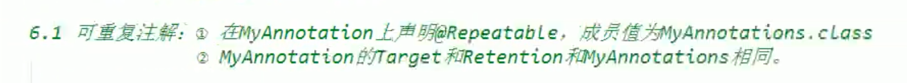

- 类型注解

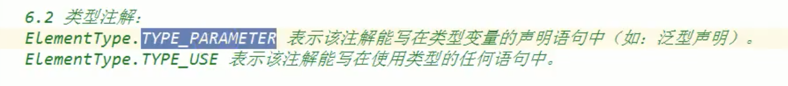


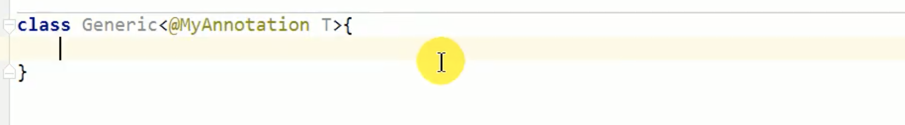

## 20、泛型


## 21、集合

### 21.1、集合框架的概述

- 集合、数组都是对多个数据进行存储操作的结构，简称Java容器

- 说明:此时的存储，主要指的是内存层面的存储，不涉及到持久层的存储（.txt、.jpg、.avi、数据库中）

- 数组在存储多个数据方面的特点

- 一旦初始化后，其长度就确定了

- 数组一旦定义好，其元素的类型就确定了，我们也就只能操作指定类型的数据了。比如：String[] arr、int[] arr1、Object[] arr2.

- 数组在存储多个数据方面的特点

- 一旦初始化后，其长度不可修改

- 数组中提供的方法非常有限，对于添加、删除、插入等操作，非常不方便，同时效率低

- 获取数组中实际元素的个数的需求，数组没有线程的属性或者方法

- 数组储存数据的特点：有序、可重复。对于无序、不可重复的需求，不能满足

- 集合框架

- Collection接口：单列集合，用来存储一个一个的对象

- List接口：存储有序的、可重复的数据。 -->“动态数组”

- ArrayList、LinkedList、Vector

- Set接口：存储无序的、不可重复的数据。 -->高中讲的“集合”

- HashSet、LinkedhashSet、TreeSet

- Map接口：双列集合，用来存储一对（key - value）一对数据 --> 高中函数 y = f(x)

- hashMap、LinkedHashMap、TreeMap、Hashtable、Properties

### 21.2、Collection接口中的常用方法

- add(Object e) : 将元素e添加到集合coll中

- size()：获取添加的元素个数

- addAll(Collection coll1)：将coll1集合中的元素添加到当前的集合中

- clear()：清空集合中的元素

- isEmpty()：判断当前集合是否为空

- contains(object obj)：判断当前集合中是否包含obj，在判断过程中系统会调用obj对象所在类的equlas()

- containsAll(Collection coll1)：判断形参coll1中所有的元素是否都错在与当前集合中

- remove(Object obj)：从当前集合中移除obj元素

- removeAll(Collection coll)：从当前集合中移除colll中的所有元素

- retailAll(Collection coll1)：交集：获取当前集合和coll1集合的交集，并返回给当前集合

- equals(Object obj)：要想返回true，需要当前集合和形参的元素相同

- hashCode()：返回当前对象的哈希值

- toArray()：集合 --> 数组

- 拓展：数组 --> 集合：点用Array,asList()

- Iterator()：返回Inerator接口的实例，用于便利集合元素。放在InteratorTest.java中测试

### 21.3、使用迭代器Iterator遍历Collection

- next()：获取下一个元素

- hashNext()：判断是否还有下一个元素

```javascript
    // 测试
    @Test
    public void iteratorTest(){
        Collection collection = new ArrayList();
        collection.add(123);
        collection.add(456);
        collection.add(new String("Tom"));
        collection.add(false);

        Iterator iterator = collection.iterator();

        while (iterator.hasNext()){
            System.out.println(iterator.next());
        }
    }
}
```

- 迭代器Iterator的执行原理

- hashNext()：判断是否还有下一个元素

- next()：1、指针下移 2、将下移以后集合位置的元素返回

- 集合对象每次调用iterator()方法都会得到一个全新的迭代器对象，默认右边都在集合的第一个元素之前

- 内部定义了一个remove方法，可以在遍历的时候，删除集合中的元素，此方法不同于集合直接调用remove()

- 注意

- 如果还未点用next()或上一次调用next方法之后已经调用了remove方法在调用remove都会报错

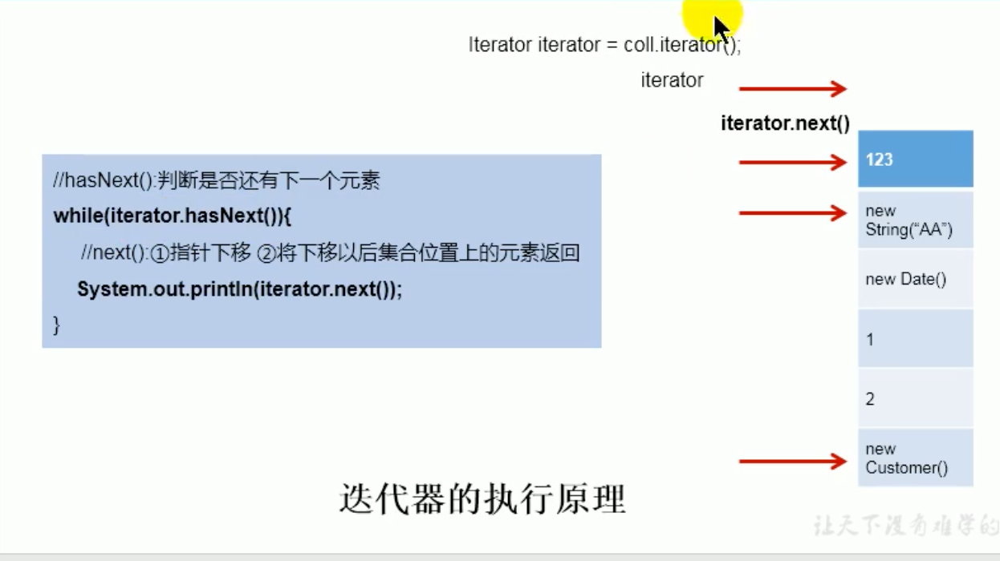

### 21.4、List接口：存储有序的、可重复的数据

- ArrayList：作为lis接口的主要实现类，线程不安全，效率高。

- LinkedList：对于频繁的插入、删除操作，使用此类效率比ArrayList高，底层是双向链表结构

- vector：作为list接口的古来实现类：线程安全，效率低，底层使用Object[] elementData

- 相同点：三类都是实现list接口，存储数据的特点相同，存储有序的、可重复的数据

- ArrayList源码分析

- JDK7.0

- ArrayList List = new ArrayList();底层创建了长度是10的Object[]数组elementData

- List. add(123);//eLementData[e] = new Integer(123);

- ...

- list.add(11);//如果此次的添加导致底层e LementData数组容量不够，则扩容。默认情况下，扩容为原来的容量的1.5倍，同时需要将原有数组中的数据复制到新的数组中。

- 结论:建议开发中使用带参的构造器: ArrayList list = new Arraylist(int capacity)

- JDK8.0中的Arraylist的变化

- ArrayList List = new ArrayList();//底 层0bject[] elementData 初始化为{}.并没有创建长度为10的数组，

- list. add(123);//第一次调用add()时，底层才创建了长度10的数组，并将数据123添加到eLemenData

- 后续的添加和扩容操作与jdk 7无异。

- 小结: jdk7中的ArrayList的对象的创建类似于单例的饿汉式，而jdk8 中的ArrayList的对象的创建类似于单例的懒汉式，延迟了数组的创建，节省内存。

- LinkedList源码分析

- LinkedList list = new LinkedList(); 内部声明Node类型的first和last属性，默认值为null

- list.add(123); // 将123封装成Node中，创建了Node对象

- 其中Node定义为：体现了LinkedList的双向链表的说法

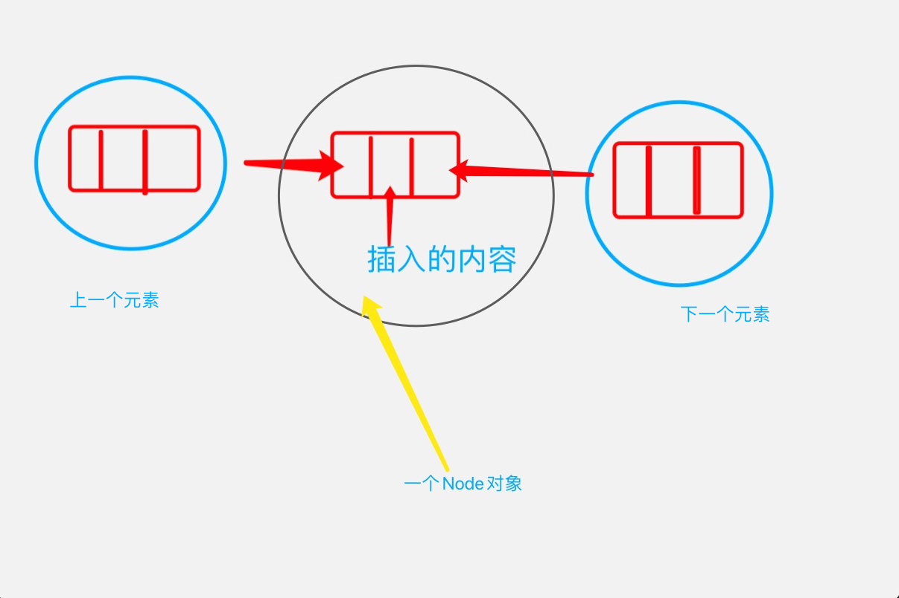

```javascript
// Node结构
private static class Node<E> {
    E item;
    Node<E> next;
    Node<E> prev;

    Node(Node<E> prev, E element, Node<E> next) {
        this.item = element;
        this.next = next;
        this.prev = prev;
    }
}
```

-  List接口中的常用方法

-  void add(int index, object ele): 在index位置插入ele元素

- boolean addALL(int index, Collection eles): 从index位置开始将eles中的所有元素添加进来

- Object get(int index): 获取指定index位置的元素

- int index0f(Object obj): 返回obj在集合中首次出现的位置

- int LastIndexOf(object obj): 返回obj在当前集合中末次出现的位置

- object remove(int index): 移除指定index位置的元素，并返回此元素

- Object set(int index, object ele):设置指定index位置的元素为ele

- List subList(int fromIndex, int toIndex): 返回从fromIndex到toIndex位置的子集合

- 总结常用方法

- 增：add(Object obj)

- 删：remove(int index) / remove(Object obj)

- 改：set(int index,Object ele)

- 查：get(int index)

- 插：add(int index,Object obj)

- 长度：size()

- 遍历：

- iterator迭代器

- foreach

- 普通循环

### 21.5、Set接口

- Collection接口：单列集合，用来存储一个一个的对象

- Set接口：存储无序的、不可重复的数据。 -->高中讲的“集合”

- HashSet：作为Set接口的主要实现类，线程不安全，可存null值

- LinkedhashSet：作为HashSet的子类；遍历其内部数据时，可按照添加的顺序遍历

- TreeSet：可以按照添加对象的指定属性，进行排序

- Set无序的，不可重复的

- 无序性：不等于随机性，存储的数据在底层数组中并非按照数组索引的顺序添加，而是根据数据的哈希值决定的。

- 不可重复性：保证添加的元素按照equals()判断是，不能返回true，即：相同元素只能添加一个。

- 添加元素的过程：以HashSet为例

- 我们向HashSet中添加元素a,首先调用元素a所在类的hashCode()方法，计算元素a的哈希值，此哈希值接着通过某种算法计算出在HashSet底层数组中的存放位置(即为:索引位置)，判断数组此位置上是否已经有元素:

- 如果此位置上没有其他元素，则元素a添加成功。---> 情况1

- 如果此位置上有其他元素b(或以链表形式存在的多个元素)，则比较元素a与元素b的hash值: 如果hash值不相同，则元素a添加成功。--->情况2 

- 如果hash值相同，进而需要调用元素a所在类的equlas()方法:equals()返回true,元素a添加失败。equals()返回false,则元素a添加成功。---> 情况2

- 对于添加成功的情况2和情况3而言:元素a与已经存在指定索引位置上数据以链表的方式存储。 jdk 7 :元素a放到数组中，指向原来的元素。jdk 8 : 原来的元素在数组中，指向元素a。总结:七上八下。

- HashSet底层；数组 + 链表的形式

- 为什么要用链表的形式：解决哈希冲突，以链表的形式进行下挂。

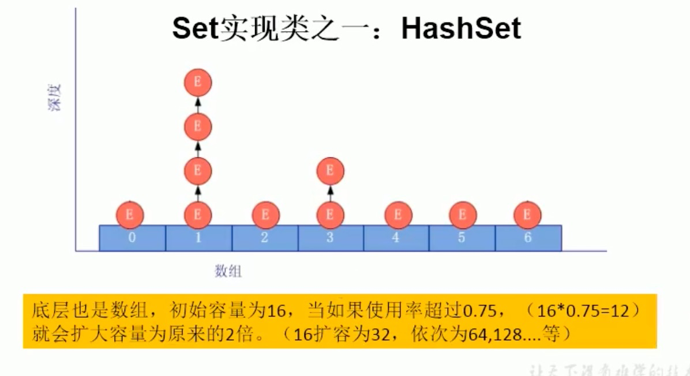

- hashCode() 和 equals() 的重写

- 要求：

- 向Set中添加的数据，其所在的类一定要重写hashCode()和equals()

- 重写的hashCode()和equals()尽可能保持一致性：相等的对象必须具有相等的hash值（散列码）

- 对象中用作equals()方法比较的Field，都应该用来计算hashCode值

- 说明：

- new HashSet(); // 底层

```javascript
// 实例化HashSet对象
public HashSet() {
    map = new HashMap<>();
}
// 添加数据
// 相当于，存在HashSet的数据，存在了HashMap中key的位置。而value的位置时用一个
//（private static final Object PRESENT = new Object();）静态对象充当的，
// 也就是说添加的所有的key都会指向同一个对象。
public boolean add(E e) {
    return map.put(e, PRESENT)==null;
}

private static final Object PRESENT = new Object();
```

### 21.6、Map接口

- 双列数据，存储key-value对的数据 。  --->类似与高中的函数y=f(x)

- HashMap：作为Map的主要实现类；线程不安全的，效率高；可以存储null的key和value

- LinkedHashMap：保证在遍历map元素时，可以按照添加的顺序实现遍历

- 原因：在原有的HashMap底层结构基础上，添加了一对指针，指向前一个和后一个元素，对于频繁操作的遍历操作，此类执行效率高于HashMap

- Treemap：保证添加的key-value对进行排序，实现排序遍历，此时考虑key的自然排序和定制排序，低层使用的红黑树。

- Hashtable：作为古老的实现类；线程安全的，效率低；不能存储null的key-value

- Properties：常用来处理配置文件。key和value都是String类型的。

- HashMap的底层：

- JDK7.0（及以前）：数组 + 链表

- JDK8.0：数组 + 链表 + 红黑树

- 面试题

- HashMap的底层实现原理？

- HashMap 和 Hashtable的异同？

- CurrentHashMap 与Hashtable的异同？（了解即可）

- CurrentHashMap实现类当多线程处理时可以控制多线程执行执行各自的方法，但是也都带着锁，不会产生，线程安全问题。

- Map结构的理解

- Map中的key：无序的、不可重复的，使用Set存储所有的key 。 -->key所在的类要重写euqals()和hashCode()（以HashMap为例）

- Map中的value：无序的、可重复的使用Collection存储所有的value   -->value所在的类要重写equals()

- 一个键值对构成了一个Entry对象

- Map中的entry对象：无序的、不可重复的、使用Set存储所有的entry

- HashMap的底层实现原理（以JDK7.0为例）

- HashMap map = New HashMap();

- 在实例化以后，底层创建了长度为16的一唯数组 Entry[] table

- ...

- 可能已经经过了多次put

- map.put(key1,value1);

- 首先调用了key1所在类的hashCode()计算key1的哈希值，此时哈希值经过了某种算法以后，得到在Entry数组中存放的位置。

- 如果此位置上的数据为空，此时的key1-value1添加成功。-->情况一

- 如果此位置上的数据不为空（意味着此位置存在一个或多个数据（以链表的形式存在）），比较key1和已经存在的一个或多个数据的哈希值

- 如果key1的哈希值与已经存在的某个数据的哈希值都不相同，此时key1-value1添加成功。 --->情况二

- 如果key1的哈希值和已经存在的某个数据（key2-value2）的哈希值相同，继续比较；调用key1坐在类的equals(key2)

- 如果equals()返回false：此时key1-value添加成功。 ---> 情况三

- 如果equals()返回true：使用value1替换value2.

- 补充：关于情况二和情况三：此时key1-value1和原来的数据以链表的形式存储。关于不断的添加过程中，会涉及到扩容问题，默认的扩容方式：扩容为原来容量的2倍，并将原来的数据复制过来。

- JDk8.0相比较JDK7.0在底层实现的方式不同的是：

- new HashMap()：底层没有穿件一个长度为16的数组

- JDK8.0底层的数组是Node[]，而非Entry[]

- 首次调用put()方法时，底层创建长度为16 的数组

- JDK7.0底层结构只有：数组 + 链表。 JDK8.0中底层结构：数组 + 链表 + 红黑树

- 当数组的某个索引位置上的元素以链表的形式存在的数据个数 > 8且当前数组的长度 > 64时，此时此索引位置上的所有数据给为使用红黑时存储。

- 说明：

- DEFAULT INITIAL_ CAPACITY : HashMap 的默人容量，16

- DEFAULT_ LOAD_ FACTOR: HashMap 默认因子：0.75

- threshold:扩容的临界值，=容量*填充因子: 16 * 0.75 => 12

- TREEIFY_ THRESHOLD: Bucked中链表的长度大于该默认值，转换为红黑树：8

- MIN_ TREEIFY_ CAPACITY: 插入的Node被树化时，最小的的hash表容量：64

- LinkedHashMap的底层实现

- Entry中定义了before、after两种属性，记录前后两个Entry。能记录添加元素的先后顺序。

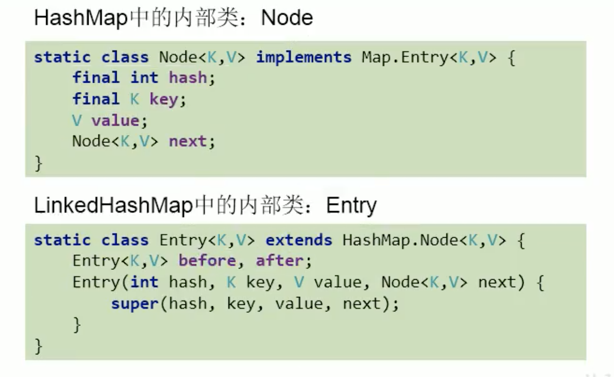

- Map中常用的方法

- 增：put(Object key, Object value)

-  删：remove(Object key)

- 改：put(Object key, Object value)

- 查：get(Object key) 

- 长度：size()

- 遍历：keySet() / values() / entrySet()

- Properties：常用来处理配置文件，key和value都是String类型

- Collections常用的方法

- reverse(List):反装List中元素的順序

- shuffle(List):対List集合元素迸行随机排序

- sort(List):根据元素的自然順序肘指定List 集合元素按升序排序

- sort(List, Comparator):根据指定的Comparator 六生的順序対List集合元素迸行排序

- swap(List, int, int): 将指定list集合中的i処元素和j処元素迸行交換

- object max(Collection): 根据元素的自然順序，返回給定集合中的最大元素

- Object max(Collection, Comparator): 根据Comparator指定的厥序，返回給定集合中的最大的

- Object min(Collection)

- Object min(Collection, Comparator)

- int frequency(Collection, object): 返回指定集合中指定元素的出現次数

- void copy(List dest,List src): 将src中的内容复制到dest中

- 注意：旧的集合copy到新的集合时，新的集合的大小一定不小于旧的集合，否则就报异常

- 处理办法

```javascript
List dest = Arrays.List(new Object[List.size])
```

- boolean replaceAll(List list, Object oldVal, Object newVal):使用新值替换List対

- synchronizedXxx()

- Collections类中提供了多个synchronizedXxx()方法，该方法可使将集合包装成线程同步的集合，从而可以解决对线程并发访问集合时线程安全问题。

```javascript
// 线程不安全的，list
List list = new ArrayList();
// 返回的list1就是线程安全的
List list1 = Collections.synchronizedList(list);
```

## 22、IO流

- 一、流的分类:

- 1.操作数据单位:字节流、字符流

- 2.数据的流向:输入流、输出流

- 3.流的角色:节点流、处理流

- 二、流的体系结构

| 抽象基类 | 节点流(或文件流) | 缓冲流(处理流的一-种) |
| - | - | - |
| InputStream | FileInputStream | BufferedInputStream |
| OutputStream | FileOutputStream | BufferedOutputStream |
| Reader | FileReader | BufferedReader |
| Writer | FileWriter | BufferedWriter |


- FileReader读入数据的基本操作

```javascript
//   不标准的写法，只是表达步骤

// 1、实例化file对象,并将文本路径填入构造器中。
File file1 = new File("src/hello.txt");
// 2、提供具体的流
FileReader fileReader = new FileReader(file1);
// 3、read();返回读入的一个字符，如果文件达到末尾则返回 -1
int read = fileReader.read();
while ( read!= -1){
    System.out.print((char) read);
    read = fileReader.read();
}
```


```javascript
// 正确的写法

public static void main(String[] args) {
    FileReader fileReader = null;
    try {
        // 1、实例化file对象,并将文本路径填入构造器中。
        File file1 = new File("src/hello.txt");
        // 2、提供具体的流
        fileReader = new FileReader(file1);
        // 3、read();返回读入的一个字符，如果文件达到末尾则返回 -1
        int i;
        while ( (i = fileReader.read()) != -1){
            System.out.print((char) i);
        }
    } catch (IOException e) {
        e.printStackTrace();
    } finally {
        try {
            if(fileReader != null){
                // 流的关闭操作
                fileReader.close(); 
            }
        } catch (IOException e) {
            e.printStackTrace();
        }
    }
}
```

- 说明：

- read()的理解：返回读入的一个字符，如果达到文件末尾，返回-1.

- 异常的处理：为了保证流资源一定执行关闭操作，使用try-catch-finaly处理。

- 读入的文件一定要存在，否则会报FileNotFoundException，

- 注意的是，main方法里读文件时读的是系统的绝对路径，若写的是相对路径的话，也会报fileNotFoundException

- 流的操作四步

- File类的实例化

- 具体流的实例化

- 读入/写入的操作

- 资源的关闭

- 对read()操作升级：使用read的重载方法

- 使用char[]数组作为载体，相当于送货的“小车”，每次将读的文件，读入数组中，

- 数组的长度决定了每次读几个字符

- 读入数组的时候不是将数组清空再去读入，而是从数组索引的第一位开始进行覆盖，也就是说，当数组做后一个没有读满整个数组时，倒数第二次的数组没有覆盖的部分还会继续保留。

```javascript
    
    @Test
    public void testFileReader() {
        FileReader fileReader = null;
        try {
            // 1、File类的实例化
            File file = new File("src/hello.txt");
            // 2、具体流的实例化
            fileReader = new FileReader(file);
            // 3、读入/写出的操作细节
            // read(char[] chars): 返回每次读入chars数组中的字符个数，如果达到了文件的末尾，返回-1
            char[] chars = new char[5];
            int read;
            while ((read = fileReader.read(chars)) != -1){
                //方式一：
                // 错误的写法
//                for (int i = 0; i < chars.length; i++) {
//                    System.out.println(chars[i]);
//                }

                // 正确的写法
//                for (int i = 0; i < read; i++) {
//                    System.out.println(chars[i]);
//                }
                //方式二：
                // 错误的
//                String string = new String(chars);
//                System.out.println(string);

                // 正确的写法
//                String string = new String(chars,0,read);
//                System.out.print(string);
            }
        } catch (IOException e) {
            e.printStackTrace();
        } finally {
            if(fileReader != null){
                // 4、流资源的关闭
                try {
                    fileReader.close();
                } catch (IOException e) {
                    e.printStackTrace();
                } finally {
                }
            }
        }
    }
```

- FileWrite()写出操作

- 从内存中写出数据到硬盘文件里

- 说明：输出的操作，对应的File可以不存在的

- 如果不存在，在输出的过程中，会自动创建此文件

- 如果存在：

- 如果流使用的构造器是：FileWriter(file, false)或FileWriter(file)：对原有文件的覆盖

- 如果流使用的构造器是：FileWriter(file, true):不会对原有文件覆盖，而是在原有文件基础上追加内容。

```javascript
@Test
public void testFileWrite() throws IOException {
    // 1、提供File类的实体对象，指明写出到的文件
    File file = new File("hello1");
    // 2、提供FileWrite的对象，用于数据的写出
    FileWriter fileWriter = new FileWriter(file, true);
    // 3、写出的具体操作
    fileWriter.write("I have a dream!\n");
    fileWriter.write("you need to have a dream");

    // 4、流的关闭操作
    fileWriter.close();
}
```

- 文件的复制操作write()(读入后将文件写出)

```javascript
@Test
public void testFileReaderFileWriter(){
    FileReader fileReader = null;
    FileWriter fileWriter = null;
    try {
        // 创建File对象，指明读入写出的文件
        File fr = new File("hello1");
        File fw = new File("hello2");
        // 创建输入流和输出流的对象
        fileReader = new FileReader(fr);
        fileWriter = new FileWriter(fw);
        // 读入并写出的具体操作

        char[] chars = new char[5];
        int len; // 记录每次读入到chars数组中的字符的个数
        while ((len = fileReader.read(chars)) != -1){
            // 每次写出len个字符
            fileWriter.write(chars,0,len);
        }
    } catch (IOException e) {
        e.printStackTrace();
    } finally {
        // 关流操作
        try {
            fileReader.close();
        } catch (IOException e) {
            e.printStackTrace();
        }
        try {
            fileWriter.close();
        } catch (IOException e) {
            e.printStackTrace();
        }
    }
}
```

- 不能使用字符流来处理图片等字节数据

- 处理以后文件显示损坏，打不开。

- FileInputStream字节输入流

- 使用FileInputStream字节输入流，处理文本文件可能会出现乱码的，例如文本文件内容是中文，就会出现乱码。

- 使用FileInputStream实现图片的复制

```javascript
@Test
public void testFileInputStream(){
    FileInputStream fileInputStream = null;
    FileOutputStream fileOutputStream = null;
    try {
        File fr = new File("任万万.JPG");
        File fw = new File("任万万1.JPG");

        fileInputStream = new FileInputStream(fr);
        fileOutputStream = new FileOutputStream(fw);
        byte[] bytes = new byte[5];
        int len;
        while ((len = fileInputStream.read(bytes)) != -1){
            fileOutputStream.write(bytes,0,len);
        }
    } catch (IOException e) {
        e.printStackTrace();
    } finally {
        try {
            if(fileInputStream == null){
                fileInputStream.close();
            }
        } catch (IOException e) {
            e.printStackTrace();
        }
        try {
            if(fileOutputStream == null){
                fileOutputStream.close();
            }
        } catch (IOException e) {
            e.printStackTrace();
        }
    }

}
```

- 结论

- 对于文本文件（.txt、.java、.c、.php）,使用字节流处理

- 对于非文本文件（.jpg、.mp3、.mp4、.avi、.doc、.ppt ...），使用字节流处理

- 处理流之一：缓冲流的使用

- 缓冲流：

- BufferedInputStream

- BufferedOutputStream

- BufferedReader

- BufferedWriter

- 作用：提高流的读取、写入速度

- 原因：因为内部提供了一个缓冲区，默认是8192（8kb）

```javascript
@Test
public void testFileBufferInputStream() {
    BufferedInputStream bis = null;
    BufferedOutputStream bos = null;
    try {
        File fr = new File("任万万.JPG");
        File fw = new File("任万万2.JPG");

        FileInputStream fileInputStream = new FileInputStream(fr);
        FileOutputStream fileOutputStream = new FileOutputStream(fw);

        bis = new BufferedInputStream(fileInputStream);
        bos = new BufferedOutputStream(fileOutputStream);
        byte[] bytes = new byte[10];
        int len;
        while ((len = bis.read(bytes)) != -1){
            bos.write(bytes,0,len);
        }
    } catch (IOException e) {
        e.printStackTrace();
    } finally {
        // 关流操作
        // 先关外层的流，在关里层的流，但关外成流的同时，
        // 外层流已经帮我们关了内层流，我们只需要关掉外层的就可以了
        try {
            if(bis != null)
            bis.close();
        } catch (IOException e) {
            e.printStackTrace();
        }
        try {
            if(bos != null)
            bos.close();
        } catch (IOException e) {
            e.printStackTrace();
        }
    }
}
```

- 处理流：就是“套接”在已有的流的基础上

- 流体系及方法

| 抽象基类 | 节点流(或文件流) | 缓冲流(处理流的一-种) |
| - | - | - |
| InputStream | FileInputStream<br>（read(byte[] bytes)） | BufferedInputStream<br>（read(byte[] bytes)） |
| OutputStream | FileOutputStream<br>（write(byte[] bytes,0,len)） | BufferedOutputStream<br>（write(byte[] bytes,0,len) <br>    flush() // 调用方法，手动刷新缓冲区） |
| Reader | FileReader<br>（read(char[] chars)） | BufferedReader<br>（read(char[] chars)<br>    readLine() // 读取一行字符） |
| Writer | FileWriter<br>（write(char[] chars,0,len)） | BufferedWriter<br>（write(char[] chars,0,len)<br>    flush() // 调用方法，手动刷新缓冲区） |


- 说明：

- readLine() ：读取文件中的一行字符，当读到最后一行在往下读时会返回null

- 处理流之二：转换流的使用

- 转换流：属于字符流

- InputStreamReader：将一个字节的输入流转换为字符的输入流

- OutputStreamWriter：将一个字符的输出流转换为字节的输出流

- 作用：提供字节流与字符流之间的转换

- InputStreamReader的使用：实现字节流到字符流的转换

```javascript
    @Test
    public void testInputStreamReader() throws IOException {

        FileInputStream fileInputStream = new FileInputStream("hello1");
        // new InputStreamReader(fileInputStream,"gbk") 
        // 参数一：字节流的实例对象  参数二：编码集名称：被读取的文件是以什么编码集除进去的就要以什么编码集读取，否则乱码。
//        InputStreamReader inputStreamReader = new InputStreamReader(fileInputStream,"gbk");
        InputStreamReader inputStreamReader = new InputStreamReader(fileInputStream,"UTF-8");
        int len;
        char[] chars = new char[10];
        while ((len = inputStreamReader.read(chars)) != -1){
            for (int i = 0; i < len; i++) {
                System.out.print(chars[i]);
            }
        }
        inputStreamReader.close();
    }
```

- 综合使用InputStreamReader和OutputStreamWriter

- 实现文件读取以正常编码集读取，然后以另一种编码集写出去

```javascript

@Test
public void test1() throws Exception {
    FileInputStream fileInputStream = new FileInputStream("hello1");
    FileOutputStream fileOutputStream = new FileOutputStream("Hello_gbk");

    InputStreamReader inputStreamReader = new InputStreamReader(fileInputStream ,"utf-8");
    OutputStreamWriter outputStreamWriter  = new OutputStreamWriter(fileOutputStream,"gbk");
    char[] chars = new char[10];
    int len;
    while ((len = inputStreamReader.read(chars)) != -1) {
        outputStreamWriter.write(chars,0,len);
    }
    inputStreamReader.close();
    outputStreamWriter.close();
}
```

- 处理流之三：标准的输入、输出流

- System.in：标准的输入流，默认从键盘上输入

- System.out：标准的输出流，默认是从控制台上

- System类的setIn(InputStream is)/ setOut(PringStream ps) 方式重新指定输入和输出的位置

- 练习：从键盘输入字符，要求将读取的整行字符串转成大写输出，然后继续进行输入操作，直至当输入“e”或者“exit”时，退出程序

- 方法一：使用Scanner实现，调用next()返回一个字符串。

- 方法二：使用System.in实现。System.in --> 转换流 --> BufferedReader的readLine()方法。

- 数据流：

- DataInputStream 和 DataOutputStream

- 作用：用于读取或写出基本数据类型的变量或字符串

- 练习：将内存中的字符串、基本数据类型的变量写出到文件中

- 总结：输入输出的标准过程

- 输入过程

- 创建File类的对象，指明读取的数据的来源（要求文件一定要存在）

- 创建相应的输入流，将File类的对象作为参数，传入流的构造器中

- 具体读入的过程

- 常见相应的byte[] 或 char[].

- 关闭流资源

- 说明：程序中出现的异常需要使用try-catch-finally处理

- 输出过程

- 创建File类的对象，指明写出的数据的位置

- 创建相应的输出流，将File类的对象作为参数，传入流的构造器中

- 具体写出的过程

- write(char[] / byte[] bytes,0,len)

- 关闭流资源

- 说明：程序中出现的异常需要使用try-catch-finally处理

- 对象流ObjectInputStream / ObjectOutputStream

- 作用：用于存储和读取基本数据类型数据或对象的处理流。他的强大之处就是可以把Java中的对象写入磁盘中，也能把对象从磁盘中加载到程序的内存中

- 序列化：用ObjectOutputStream类保存基本类型数据或对象的机制（将程序内存中的java对象保存到磁盘中或通过网络传输出去，使用ObjectOutputStream实现）

- 反序列化：用ObjectInputStream类读取基本数据类型或对象的机制（将磁盘中的对象文件加载到程序内存中）

```javascript
// 序列化

@Test
public void testObjectInputOutputStream(){
    ObjectOutputStream objectOutputStream = null;
    try {
        objectOutputStream = new ObjectOutputStream(new FileOutputStream("object.dat"));

        objectOutputStream.writeObject(new String("我爱中国天安门"));

        objectOutputStream.flush();
    } catch (IOException e) {
        e.printStackTrace();
    } finally {
        try {
            objectOutputStream.close();
        } catch (IOException e) {
            e.printStackTrace();
        }
    }
}
```


```javascript
// 序列化过程，及反序列化的文件，见序列化测试


// 反序列化过程

@Test
public void testObjectInputOutputStream(){
    ObjectInputStream objectInputStream = null;
    try {
        objectInputStream = new ObjectInputStream(new FileInputStream("object.dat"));

        Object object = objectInputStream.readObject();
        String string = (String) object;
        System.out.println(string);
        System.out.println(string.getClass().getName());
    } catch (IOException e) {
        e.printStackTrace();
    } catch (ClassNotFoundException e) {
        e.printStackTrace();
    } finally {
        try {
            objectInputStream.close();
        } catch (IOException e) {
            e.printStackTrace();
        }
    }

}
// 输出：
// 我爱中国天安门
// java.lang.String

```

- 序列化某个类需要满足的条件

- 需要实现Serializable接口，表示此类是个可序列化的。

- 当前类提供一个全局常量：serialVersionUID

- 除了当前类需要实现Serializable接口之外，还需要保证其内部所有属性也不许是可序列化的，（默认情况下，基本数据类型是可序列化的）。

- 说明：ObjectOutputStream和ObjectInputStream不能实例化static和transient修饰的成员变量

- 序列化机制

- 对象序列化机制允许把内存中的java对象转换成平台无关的二进制流，从而允许把这种二进制流持久地保存在磁盘上，或通过网络将二进制传输到另一个网络节点。

- 当其它程序获取了这种二进制流，就可以恢复成原来的java对象

- RandomAccessFile类（随机储存文件流）（既可以作为输入流，又可以作为输出流）

- 构造器

- public RandomAccessFile(File file, String mode)

- public RandomAccessFile(String name, String mode)

- 创建RandomAccessFile类的实例需要指定mode参数，该参数指定 RandomAccessFile的访问模式。

- r：以只读的方式打开

- rw：打开以便读取和写入

- rwd：打开以便读取和写入；同步内容文件的更新

- rws：打开以便读取和写入；同步内容文件和元数据的更新

- 如果模式为只读r。则不会创建文件，而是会去读取一个已经存在的文件，如果读取的文件不存在则会出现异常，如果模式为rw读写。如果文件不存在则会去创建文件，如果存在则不会去创建。

- RandomAccessFile的使用

- RandomAccessFile直接继承于java.lang.Object类实现了DataInput和DataOutput接口

- RandomAccessFile既可以作为一个输入流，又可以作为一个输出流

- 如果RandomAccessFile作为输入流是，写出的文件如果不存在，则在执行过程中自动创建

- 如果写出的文件存在，则会对原有的文件内容进行覆盖（默认情况下，从头覆盖）

- seek(): 从头覆盖的原因是因为相当于有个指针指在了第一个元素的位置，seek(3)方法可以指针调至角标为3的位置

- NIO简介

- Java NIO (New I0，Non-Blocking I0)是从Java 1.4版本开始引入的一套新的I0 API，可以替代标准的Java I0 API。NIO与原来的IO有同样的作用和目的，但是使用的方式完全不同，NIO支持面向缓冲区的(IO是而向流的)、基于通道的IO操作。NIO将以更加高效的方式进行文件的读写操作。

- Java API中提供了两套NIO，一套是针对标准输入输出NIO,另一套就是网络编程NIO。

- java.nio.channels.Channel

- FileChannel:处理本地文件

- SocketChannel: TCP网络编程的客户端的Channel

- ServerSocketChannel:TCP网絡编程的服务器端的Channel

- DatagramChannel: UDP网络编程中发送端和接收端的Channel

- NIO.2为了弥补IO提供的方法性能不高，而且大多数在出错时仅返回失败，并不会提供异常信息，引入Path接口，代表一个平台无关的平台路径，描述了目录结构中文件的位置。path、可以看成是File类的升级版本，实际引用的资源可以不存在

- 在以前的IO操作都是这样写的：

- File file = new File("index.html")

- 但在Java7中

- Path path = new Paths.get("index.html")

- Path、Paths和Files核心API

- 同时，NIO.2在java.nio.file包下还提供了Files、Paths 上具类，Files包含了大量静态的工具方法来操作文件; Paths则包含 了两个返回Path的静态工厂方法。

- Paths类提供的静态get()方法用来获取Path对象:

- ➢static Path get(String first, String ...more):用于将多个字符串串连成路径

- ➢static Path get(URI uri): 返回指定uri对应的Path路径

## 23、网络编程

- Java提供的网络类库，可以实现无痛的网络连接，联网的底层细节被隐藏在java的本机系统里，有JVM进行控制。并且Java实现了跨平台的网络库，程序员面对的是一个统一的网络编程环境

- 网络通信协议

- 1

- 网络编程中的两大问题

- 如何准确地地位网络上一台或多台主机：定位主机上的某个应用

- 找到主机后如何可靠高效地进行数据传输

- 网络编程中的两大要素

- 对应问题一：IP和端口号

- 对应问题二：提供网络通信协议：TCP/IP参考模型（应用层、传输层、网络层、物理+数据链路层）

- IP地址: InetAddress

- ➢唯一的标识Internet上的计算机(通信实体)

- ➢本地回环地址(hostAddress): 127.0.0.1 主 机名(hostName): localhost

- ➢IP地址分类方式1: IPV4 和IPV6、

- IPV4: 4个字节组成，4个0-255。 大概42亿，30亿都在北美，亚洲4亿。2011年初已经用尽。以点分十进制表示，如192.168.0.1

- IPV6: 128位(16个字节)，写成8个无符号整数，每个整数用四个十六进制位表示，数之间用冒号(: )分开，如:3ffe:3201:1401:1280:c8fe4d:db39:1984

- ➢IP地址分类方式2:公网地址(万维网使用)和私有地址(局域网使用)。192.168.开头的就是私有址址，范围即为192.168.0.0--192.168.255.255， 专门为组织机构内部使用

- ➢特点:不易记忆

- 网络编程中的两大要素：

- IP：唯一的标识Internet上的计算机（通信实体）

- 在Java中使用InetAddress类代表IP

- IP分类：IPv4 和 IPv6；万维网和局域网

- 域名：www.baidu.com

- 本地回路地址：127.0.0.1 对应的域名就是：localhost

- 如何实例化InetAddress：两个方法：

- getByName(String host)

- getLocalHost

- 两个常用的方法：getHostName()、getHostAddress()

- 通过访问域名访问网络上的服务器过程：

- DNS：域名解析：将域名解析成真实的IP地址，然后进行访问。

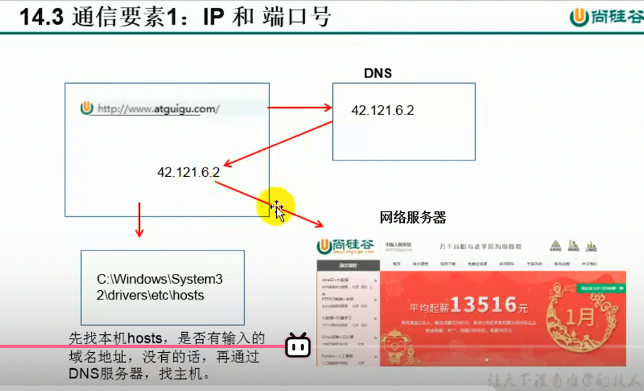

- 端口号

- 正在计算机上运行的程序。

- 要求：不同的进程有不同的端口号

- 范围：被规定为一个16位的正式0～65535

- 端口号+IP地址 得到了一个网络套接字：Socket

- 网络通信协议：TCP/IP协议簇

- 传输层协议中有两个非常重要的协议:.

- ➢传输控制协议TCP(Transmission Control Protocol)

- ➢用户数据报协议UDP(User Datagram Protocol)。

- TCP/IP以其两个主要协议:传输控制协议(TCP)和网络互联协议(IP)而得:名，实际上是一组协议，包括多个具有不同功能且互为关联的协议。

- IP(Internet Protocol)协议是网络层的主要协议，支持网间互连的数据通信。

- TCP/IP协议模型从更实用的角度出发，形成了高效的四层体系结构，即物理链路层、IP层、传输层和应用层。

- TCP和UDP

- TCP协议：

- ➢使用TCP协议前，须先建立TCP连接，形成传输数据通道

- ➢传输前，采用“三次握手”方式，点对点通信，是可靠的

- ➢TCP协议进行通信的两个应用进程:客户端、服务端。

- ➢在连接中可进行大数据量的传输

- ➢传输完毕，需释放已建立的连接，效率低

- UDP协议：

- ➢将数据、源、目的封装成数据包，不需要建立连接

- ➢每个数据报的大小限制在64K内

- ➢发送不管对方是否准备好，接收方收到也不确认，故是不可靠的

- ➢可以广播发送

- ➢发送数据结束时无需释放资源，开销小，速度快

- TCP三次握手

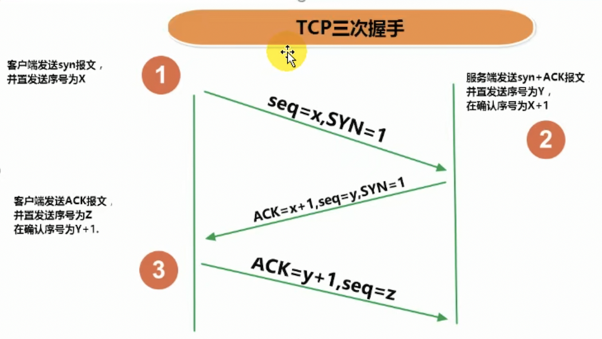

- TCP四次挥手

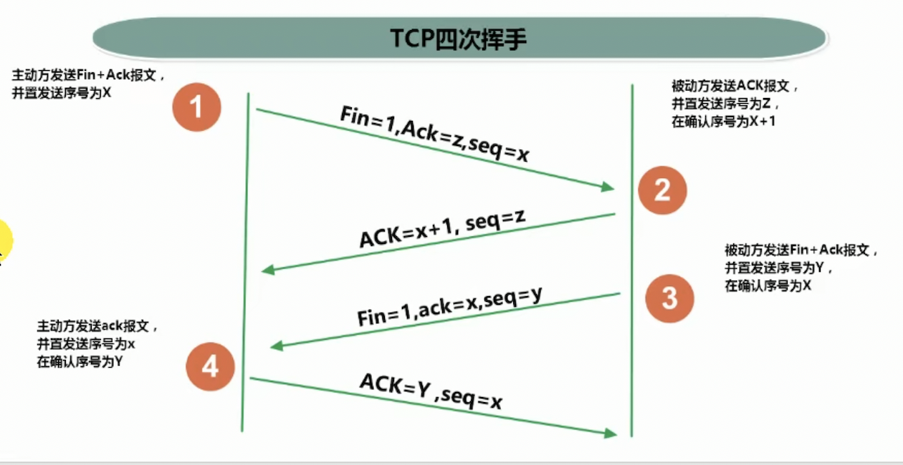

## 24、反射

### 24.1、关于java.lang.Class类的理解

- 类的加载过程

- 程序经过java.exe命令以后，会生成一个或多个字节码文件（.class结尾）

- 接着我们使用java.exx命令对某个字节码文件进行解释运行，相当于某个字节码文件加载到内存中。此过程就称为类的加载。

- 加载到内存中的类，我们就称为运行时类，此运行时类，就作为Class的一个实例。（换句话说，Class的实例就对应着一个运行时类）

- 获取Class的实例方式

-  //方式一：调用运行时类的属性：.class

```javascript
Class<Person> clazz1 = Person.class;
System.out.println(clazz1);
```

- //方式二：通过运行时类的对象，调用getClass()

```javascript
Person person = new Person();
Class<? extends Person> clazz2 = person.getClass();
System.out.println(clazz2);
```

- //方式三：调用Class的静态方法：forName(String classPath)

```javascript
Class<?> clazz3 = Class.forName("com.yang.reflection.Person");
System.out.println(clazz3);
```

-  //方式四：使用类的加载器

```javascript
ClassLoader classLoader = ClassTest.class.getClassLoader();
Class<?> clazz4 = classLoader.loadClass("com.yang.reflection.Person");
System.out.println(clazz4);
```

### 24.2、类的加载过程

- 过程描述

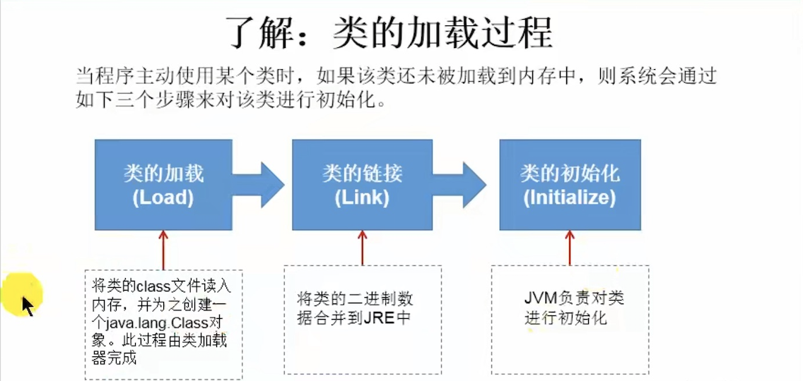

- 过程理解

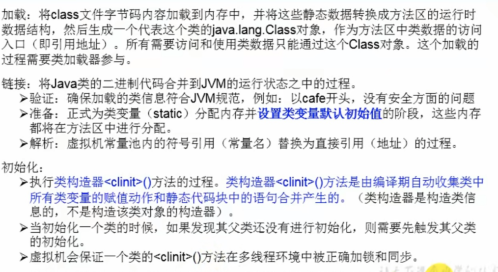

- 实例

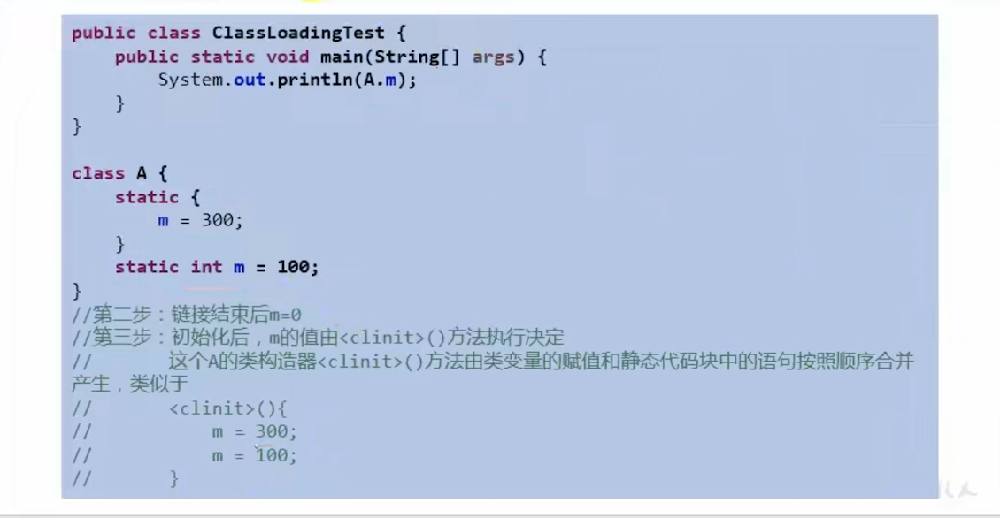

### 24.3、类的加载器

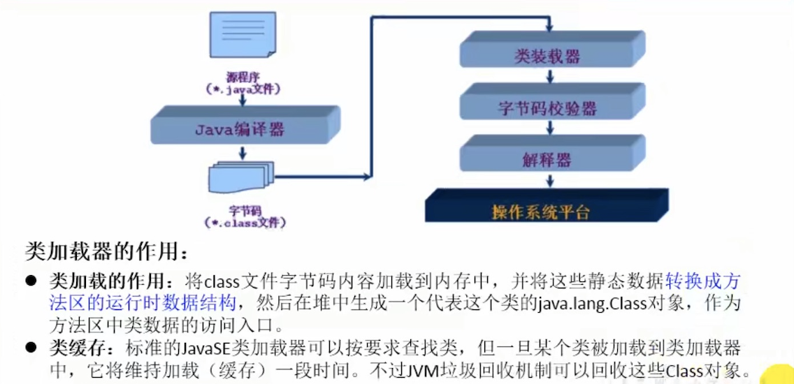

- 类加载器的几种类型（对Classloader的理解）

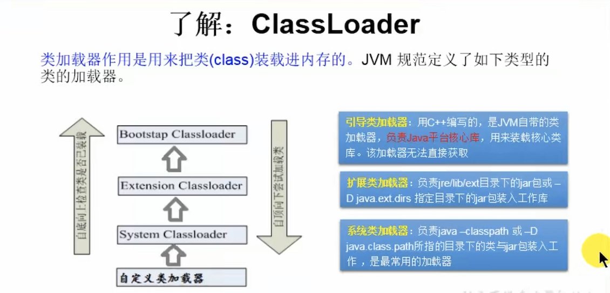

- 实例：

```javascript
@Test
public void test2(){

    // 对于自定义类，使用系统类加载器进行加载
    ClassLoader classLoader = ClassTest.class.getClassLoader();
    System.out.println(classLoader);

    // 调用系统类加载器的getParent()：获取扩展类加载器
    ClassLoader parentClassLoader = classLoader.getParent();
    System.out.println(parentClassLoader);

    // 调用扩展类加载器的getParent()：无法获取引导类加载器
    // 引导类加载器主要负责加载java的核心类库，无法加载自定义的类
    ClassLoader parent = parentClassLoader.getParent();
    System.out.println(parent);

}
```

- 输出结果

```javascript
sun.misc.Launcher$AppClassLoader@18b4aac2
sun.misc.Launcher$ExtClassLoader@7adf9f5f
null
```

### 24.4、使用ClassLoader加载配置文件

- 实例

```javascript
    @Test
    public void test3() throws Exception {
        Properties properties = new Properties();
        // 读取配置文件方式一：
        // 此时的文件默认在当前module下
//        FileInputStream fileInputStream = new FileInputStream("jdbc.properties");
//        properties.load(fileInputStream);


        // 读取配置文件方式二：使用ClassLoader
        // 配置文件默认识别为：当前module的src下

//        ClassLoader classLoader = ClassTest.class.getClassLoader();
//        InputStream resourceAsStream = classLoader.getResourceAsStream("jdbc1.properties");
//        properties.load(resourceAsStream);


        String user = properties.getProperty("user");
        String password = properties.getProperty("password");
        System.out.println("user"+user+",password"+password);

    }
```

### 24.5、通过反射创建运行时类的对象

- 实例

```javascript
@Test
public void test1() throws IllegalAccessException, InstantiationException {
    Class<Person> personClass = Person.class;
    /*
    newInstance():调用此方法，创建对应的运行时类的对象。内部调用了运行时类的空参构造器
    要想此方法正常创建运行时的对象，要求：
    1、运行时类必须提供空参的构造器
    2、空参构造器的权得够。通常，设置为public
    
    在javabean中要求提供一个public的空参构造器，原因：
    1、便于通过反射，创建运行时类的对象
    2、便于子类继承此运行时类时，默认调用super()时，保证父类由此构造器
     */
    Person person = personClass.newInstance();
    System.out.println(person);
}
```

- 说明

- newInstance():调用此方法，创建对应的运行时类的对象。内部调用了运行时类的空参构造器要想此方法正常创建运行时的对象，要求：

- 1、运行时类必须提供空参的构造器

- 2、空参构造器的权得够。通常，设置为public

- 在javabean中要求提供一个public的空参构造器，原因：

- 1、便于通过反射，创建运行时类的对象

- 2、便于子类继承此运行时类时，默认调用super()时，保证父类由此构造器

### 24.6、获取运行时类的内部结构

- 获取属性

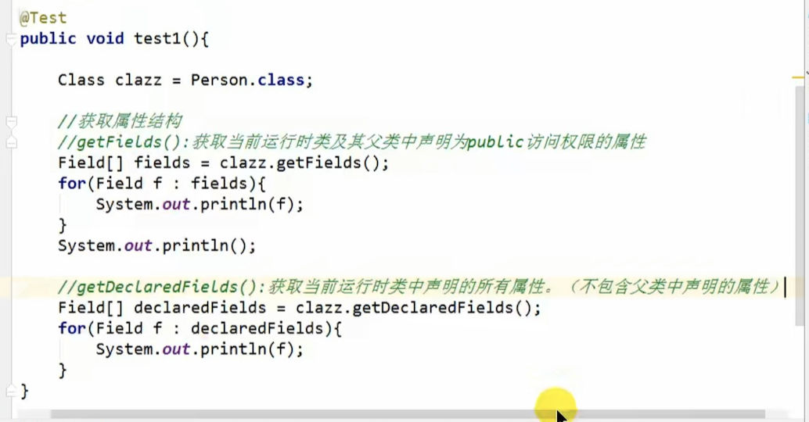

- 获取属性的权限修饰符、变量类型、变量名

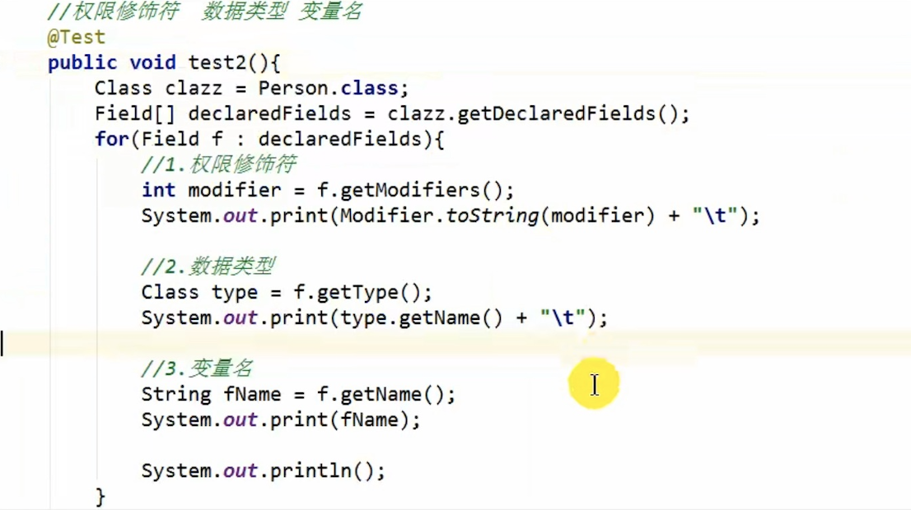

- 获取运行时类的方法结构

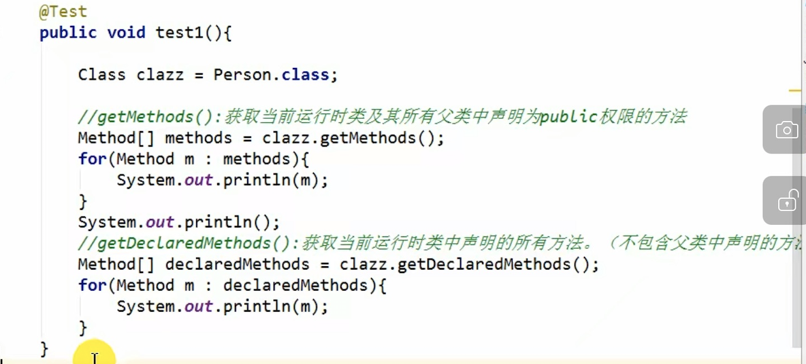

- 获取方法上生命的注解信息

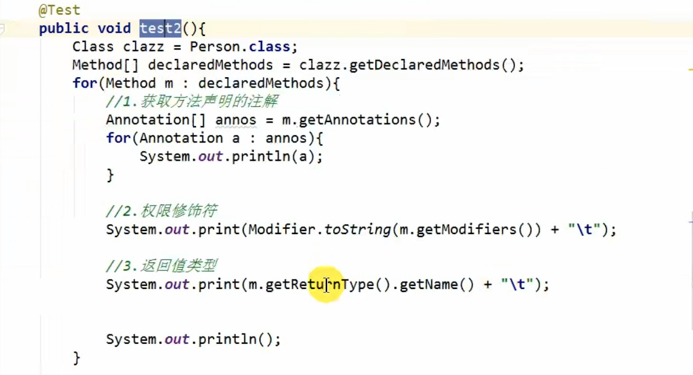

- 权限修饰符 返回值类型 方法名（参数类型1 形参数1，。。。）throws XxxException{}

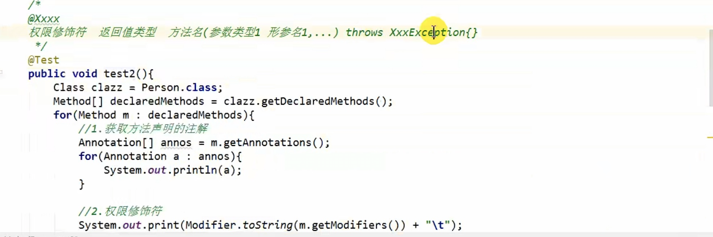


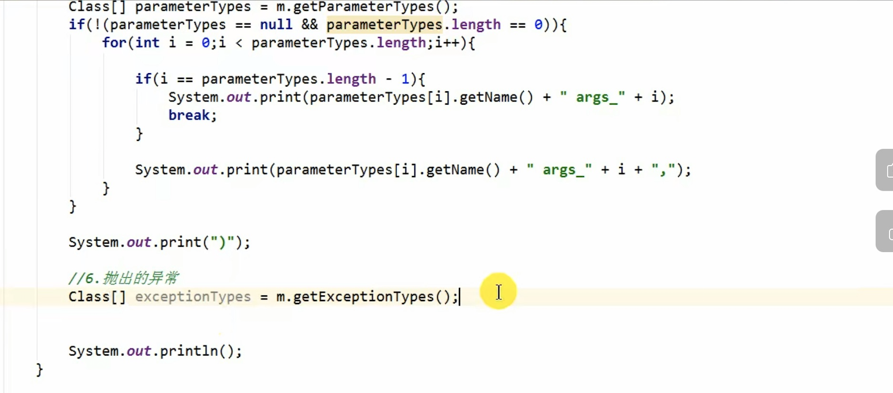

- 获取运行时类的构造器

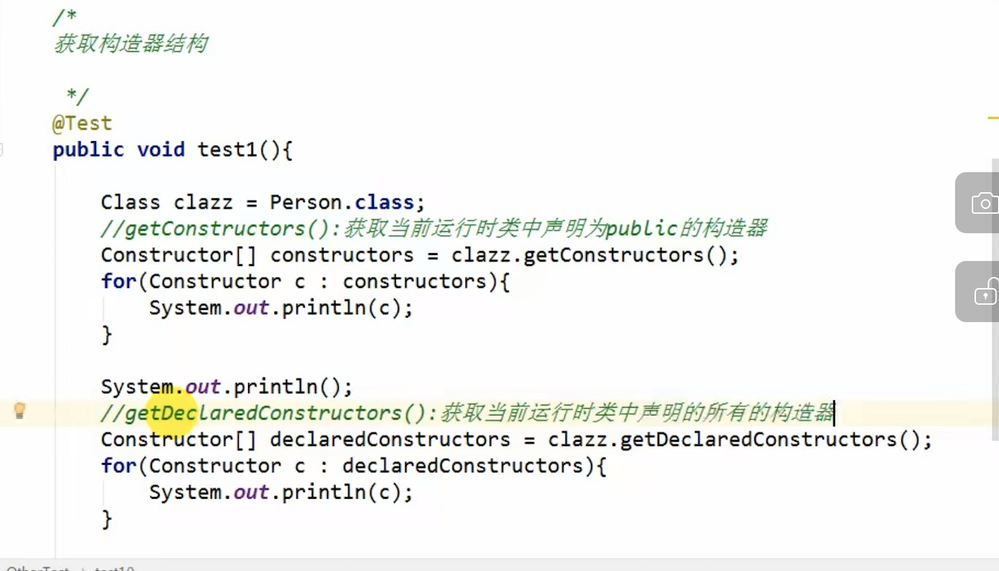

- 获取运行时类的父类及父类的泛型

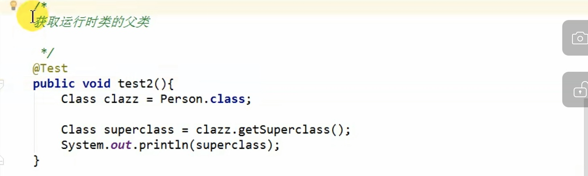


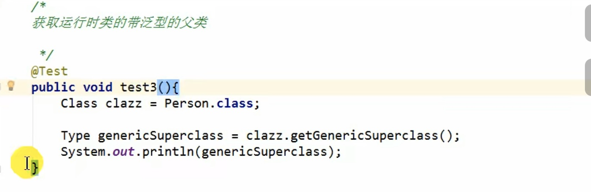


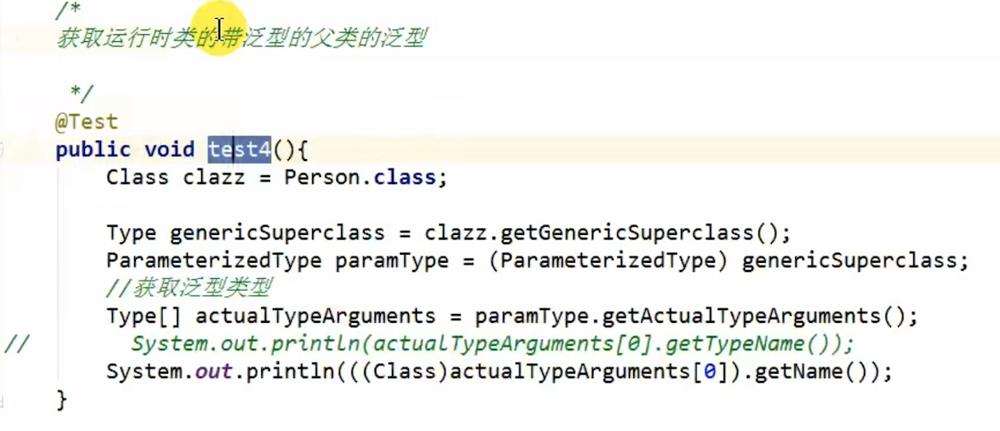

- 获取运行时类实现的接口

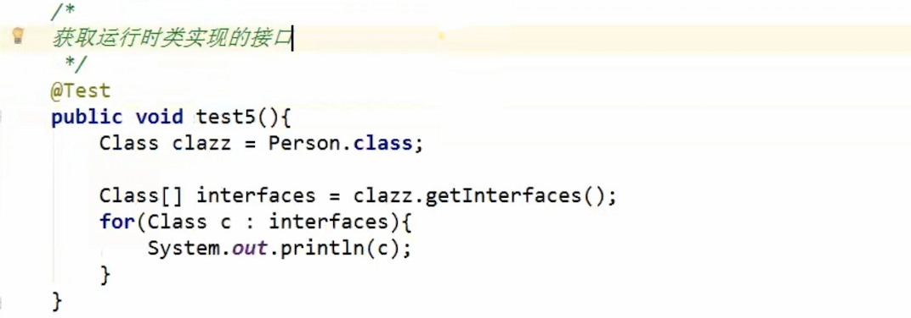

- 获取运行时类所在的包

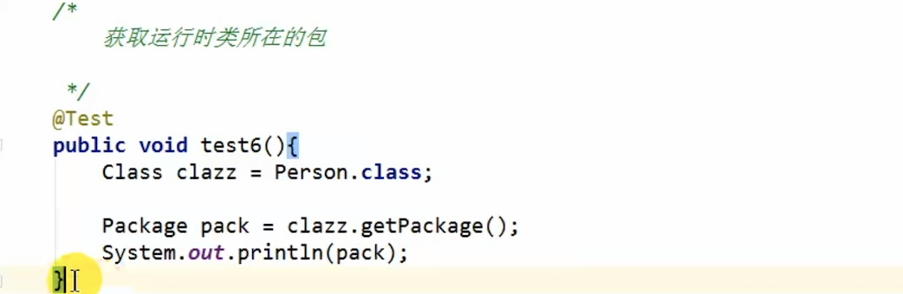


---

## 25、动态代理

657-684


# 二、web服务端

## 1、springmvc如何接收前端传过来的图片

```javascript
@RequestMapping("/addPhoto")
@ResponseBody
public String uploadimg(MultipartFile file) throws Exception{
    String filename = file.getOriginalFilename();
    System.out.println(filename);
    //写入本地磁盘
    InputStream is = file.getInputStream();
    byte[] bs = new byte[1024];
    int len;
    String id = UUID.randomUUID().toString(); // 图片名字为UUID+原有的图片名称
    OutputStream os = new FileOutputStream(new File("/Users/yang/Desktop/" + id+ filename));
    while ((len = is.read(bs)) != -1) {
        os.write(bs, 0, len);
    }
    photoUrl = "/Users/yang/Desktop/" + id + filename;
    os.close();
    is.close();
    return "ok";
}
```

 参考： https://zhidao.baidu.com/question/2058565757435915827.html

# 三、积累

## 1、获取当前运行的系统

```javascript
System.out.println(System.getProperty("os.name").toLowerCase());

//输出 mac os x
```

