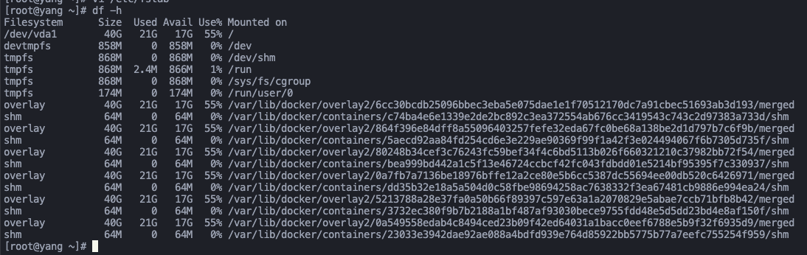
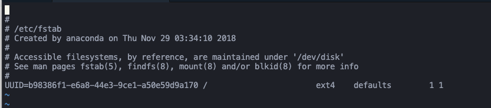
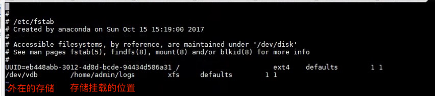
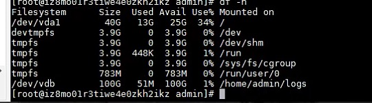
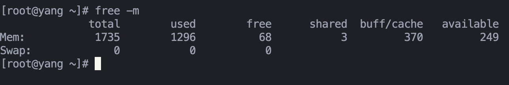
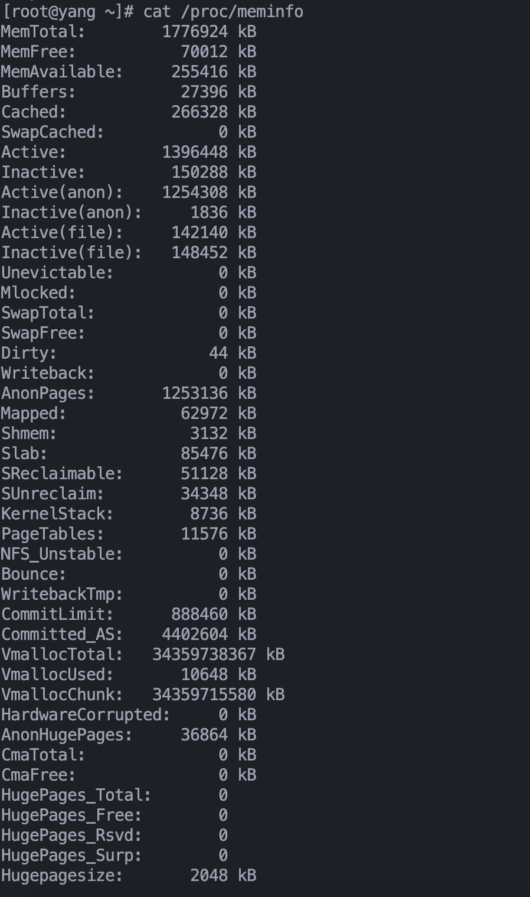
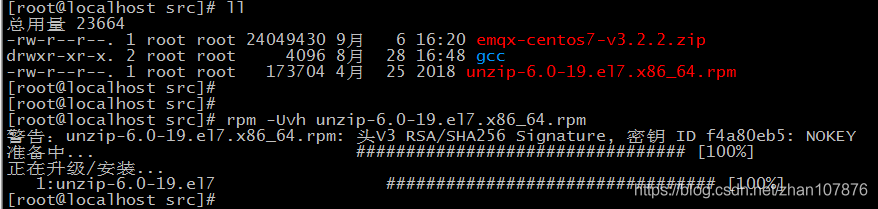

# Linux

## 基础命令：

### shutdown： 关机命令

shutdown -h 10          计算机将在10分钟后关机；

shutdown -r now        系统里吗重启；

shutdown -r 10           系统10分钟后重启

1、 一切皆文件

2、根目录/，所有的文件都挂载在这个节点下。

系统下文件目录的作用：


## 常用命令：

### 目录管理：

绝对路径：路径的全称：

相对路径：相对于现在在的位置 目录所在位置

#### cd：切换目录命令

cd  目录名（绝对路径/相对路径）

	./ ：当前目录

	.. :   上一级目录

	~ : 	回到当前的用户目录

#### ls : 列出命令

（在Linux中ls是最被常用的命令）

	-a：（all），查看全部文件，包括隐藏文件

	-l： 列出全部文件，包含文件的属性和权限，没有隐藏文件

	-al： 列出全部文件（包括隐藏文件） 包含属性 和权限

#### pwd； 显示当前用户所在的目录

#### mkdir ：创建目录

(如果文件或者重复 是否覆盖 y/s)

	mkdir text1: 创建text1文件夹

	mkdir -p text2/text3: 创建text2下text3文件夹（层级式目录）

#### rmdir：删除文件夹

（remir命令只能删除空的文件夹，里边有文件的需要先删除文件）

	   rmdir text1：删除text1文件夹

		rmdir -p text2/text3: 删除层级目录

#### cp：复制文件或者目录

		cp 原来的地方 新的地方

#### rm: 移除文件或者目录

		-f： 忽略存在的文件，不会出现警告，强制删除

		-r：递归删除目录

		-i：互动，询问是否删除

#### rm -rf /   ：删除系统中所有文件

删库跑路的做法

#### mv：移动文件或者目录 或重命名文件夹

		-f：强制移动

		-u：只替换已经更新过的文件

		mv 文件 新位置

		mv 旧文件夹名  新文件夹名

#### scp：从远程服务器上复制文件（目录）

		scp 用户名@ip地址:文件路径 复制到本地的哪个路径

		实例：scp [root@10.4.4.17](mailto:root@10.4.4.17):/home/icp-web-new/db2文件zip /home/

#### chowd:更改文件属组

		chown [-R] 属主名 文件名

		chown[-R] 属主名：属组名 文件名

#### chmod：更改文件9大属性（重要）

		情景：你没有权限操作此文件

		chmod [-R] xyz  (文件或者目录)

读： r：4

写： w：2

操作： x：1

可读可写不可执行			rw-       或。  6

chmod 777 filename

给 filename文件 赋予。可读可写可执行操作

ls -l :查看文件类型、属性、权限

基本属性：

第一个字母：

	当为【d】则是目录

	当为【-】则是文件

	当为【L】则表示为链接文档（link file）

接下来的字符中、以三个为一组、且均为【rwx】的三个参数的组合

其中「r」表示可读、「w」表示可写、「x」表示可执行

字母的位置不会变化。没有该权限的会出现「-」。


## 日常积累

### 下载文件：  sz 文件名

> 从服务端下载到本地
实例： sz bd2-sub-oip-core-1.0-SNAPSHOT.jar


### 上传文件： rz 文件名

> 实例： rz bd2-sub-oip-core-1.0-SNAPSHOT.jar


### 替换文件： rz -y
### 找出所有进程pid： ps -ef
### 找出某个进程的pid： ps -ef| grep 进程名

> 实例： ps -ef| grep zookeeper


### 查看某个端口的pid
> ### lsof -i tcp:端口号

> 实例：lsof -i tcp:4200


### 解压 fileName.zip文件

> 实例：unzip fileName.zip


### 重命名文件 fileName

> 实例：mv fileName fileName1

### 设置文件代码行号
> :set nu


### 修改linux挂载的存储

1. 查看存储情况`df -h`



2. 修改挂载
   1. 修改/etc/fstab文件 `vi /etc/fstab`



   2. 修改为



   3. `mount -a`
   4. 再次查看存储情况 `df -h`


### linux怎么查看所有用户
> linux查看所有用户的方法：
> 1. 使用cat等文件操作命令读取“/etc/passwd”文件的内容，可打印Linux系统上创建的用户列表。
> 2. 使用getent命令查看，语法“getent passwd”，可以显示类似于“/etc/passwd”文件的用户详细信息。
> 3. 使用compgen命令，语法“compgen -u”。

- 参考：[https://m.php.cn/article/500804.html](https://m.php.cn/article/500804.html)
### 查看linux内存使用率

- free命令
> Free 命令是 Linux 管理员广泛使用的最强大的命令。但与"/proc/meminfo"文件相比，它提供的信息很少。Free 命令显示系统上可用和已用物理内存和交换内存的总量，以及内核使用的缓冲区和缓存。


下面是图中参数字段的含义：

   - total: 总内存
   - used: 正在运行的进程使用的内存(used= total – free – buff/cache)
   - free: 未使用的内存 (free= total – used – buff/cache)
   - shared: 多个进程共享的内存
   - buffers: 内存保留用于内核操作一个进程队列请求
   - cache: 在 RAM 中保存最近使用的文件的页面缓存的大小
   - buff/cache: Buffers + Cache
   - available: 估计有多少内存可用于启动新应用程序，而无需交换。
- /proc/meminfo文件
> "/proc/meminfo"文件是一个拟文件，其中包含有关内存使用情况的各种实时信息。它以千字节为单位显示内存统计信息，其中大多数有点难以理解。但是，它包含有关内存使用情况的有用信息。


### 防火墙相关
#### 1、防火墙的开启、关闭、禁用命令

- 设置开机启用防火墙：systemctl enable firewalld.service
- 设置开机禁用防火墙：systemctl disable firewalld.service
- 启动防火墙：systemctl start firewalld
- 关闭防火墙：systemctl stop firewalld
- 检查防火墙状态：systemctl status firewalld
#### 2、使用firewall-cmd配置端口

- 查看防火墙状态：firewall-cmd --state
- 重新加载配置：firewall-cmd --reload
- 查看开放的端口：firewall-cmd --list-ports
- 开启防火墙端口：firewall-cmd --zone=public --add-port=9200/tcp --permanent
- 命令含义：
> –zone #作用域
> –add-port=9200/tcp #添加端口，格式为：端口/通讯协议
> –permanent #永久生效，没有此参数重启后失效
> 注意：添加端口后，必须用命令firewall-cmd --reload重新加载一遍才会生效.

### 从一台服务器copy文件到另一台服务器上
```shell
# scp root@ip:文件路径 要copy的位置
scp root@10.58.39.40:/root/index.html /root/
```
### 离线安装unzip命令
[unzip-6.0-19.el7.x86_64.rpm](https://www.yuque.com/attachments/yuque/0/2023/rpm/13004873/1690250795587-5949bc81-083d-4b49-9933-fd1774d8ed26.rpm)

1. 将 unzip-6.0-19.el7.x86_64.rpm 上传至服务器
2. 执行 rpm -Uvh unzip-6.0-19.el7.x86_64.rpm  命令安装
3. 
# 

