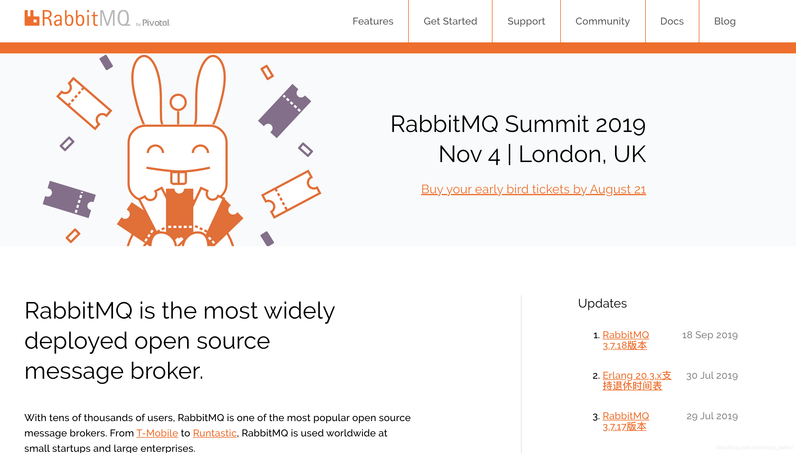
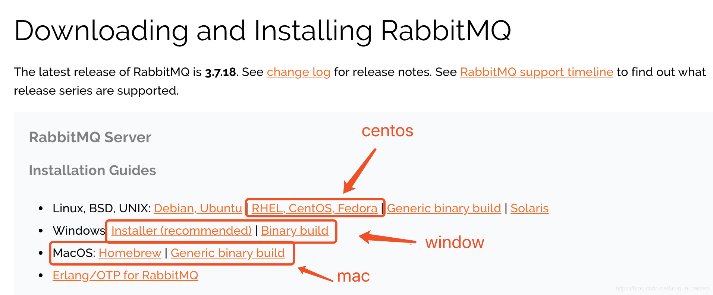
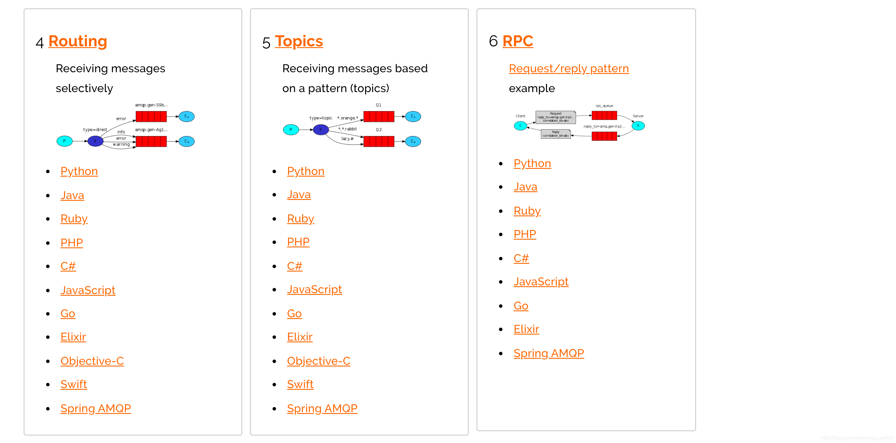
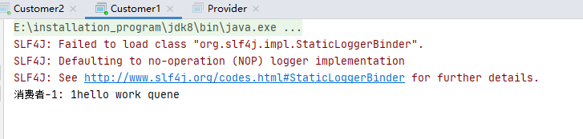
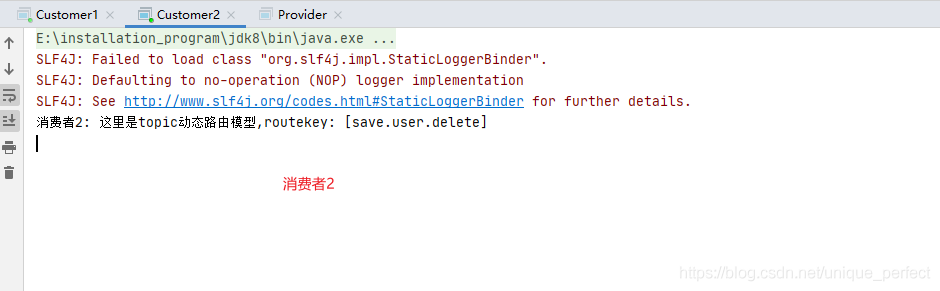
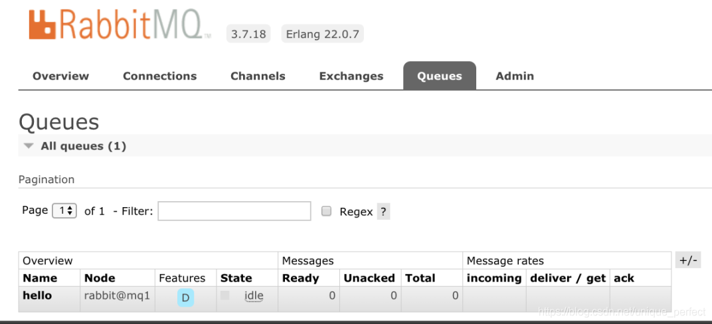
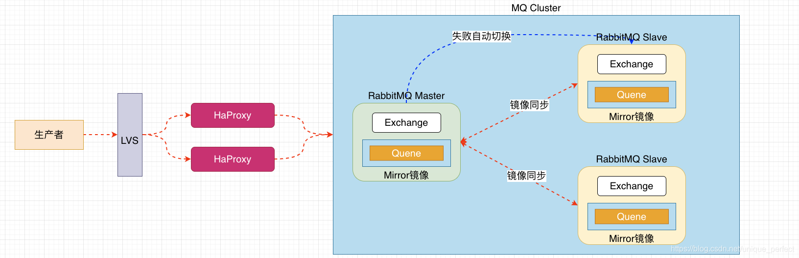
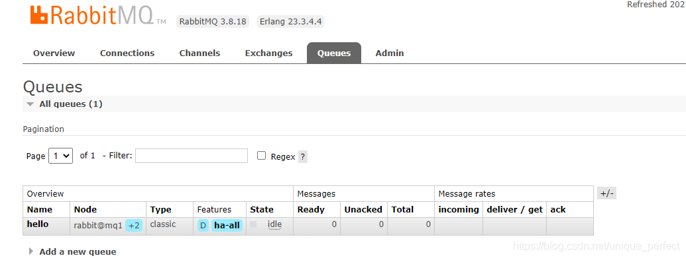

# [RabbitMQ](https://blog.csdn.net/unique_perfect/article/details/109380996)
[RabbitMQ demo GitHub - SoftLeaderGy/rabbitmq-start: 开始rabbitmq](https://github.com/SoftLeaderGy/rabbitmq-start)

---


## 1 MQ引言
### 1.1 什么是MQ
> MQ(Message Quene) :  翻译为消息队列,通过典型的生产者和消费者模型,生产者不断向消息队列中生产消息，消费者不断的从队列中获取消息。因为消息的生产和消费都是异步的，而且只关心消息的发送和接收，没有业务逻辑的侵入,轻松的实现系统间解耦。别名为 消息中间件通过利用高效可靠的消息传递机制进行平台无关的数据交流，并基于数据通信来进行分布式系统的集成。

### 1.2 MQ有哪些
> 当今市面上有很多主流的消息中间件，如老牌的ActiveMQ、RabbitMQ，炙手可热的Kafka，阿里巴巴自主开发RocketMQ等。

### 1.3 不同MQ特点
> 1.ActiveMQ
> 		ActiveMQ 是Apache出品，最流行的，能力强劲的开源
> 		消息总线。它是一个完全支持JMS规范的的消息中间件。
> 		丰富的API,多种集群架构模式让ActiveMQ在业界成为老
> 		牌的消息中间件,在中小型企业 颇受欢迎!
> 
> 2.Kafka
> 		Kafka是LinkedIn开源的分布式发布-订阅消息系统，目
> 		前归属于Apache顶级项目。Kafka主要特点是基于Pull
> 		的模式来处理消息消费，追求高吞吐量，一开始的目的
> 		就是用于日志收集和传输。0.8版本开始支持复制，不支
> 		持事务，对消息的重复、丢失、错误没有严格要求，
> 		适合产生大量数据的互联网服务的数据收集业务。
> 
> 3.RocketMQ
> 		RocketMQ是阿里开源的消息中间件，它是纯Java开发，
> 		具有高吞吐量、高可用性、适合大规模分布式系统应用
> 		的特点。RocketMQ思路起源于Kafka，但并不是Kafka
> 		的一个Copy，它对消息的可靠传输及事务性做了优化，
> 		目前在阿里集团被广泛应用于交   易、充值、流计算、
> 		消息推送、日志流式处理、binglog分发等场景。
> 
> 4.RabbitMQ
> 		RabbitMQ是使用Erlang语言开发的开源消息队列系统，
> 		基于AMQP协议来实现。AMQP的主要特征是面向消息、
> 		队列、路由（包括点对点和发布/订阅）、可靠性、安全。
> 		AMQP协议更多用在企业系统内对数据一致性、稳定性和
> 		可靠性要求很高的场景，对性能和吞吐量的要求还在
> 		其次。
> 
> RabbitMQ比Kafka可靠，Kafka更适合IO高吞吐的处理，一般应用
> 在大数据日志处理或对实时性（少量延迟），可靠性（少量丢数据）
> 要求稍低的场景使用，比如ELK日志收集。		

## 2 RabbitMQ 的引言
### 2.1 RabbitMQ
> 基于AMQP协议，erlang语言开发，是部署最广泛的开源
> 消息中间件,是最受欢迎的开源消息中间件之一。


> AMQP 协议
>  	AMQP（advanced message queuing protocol）在2003年
>  	时被提出，最早用于解决金融领不同平台之间的消息传递
>  	交互问题。顾名思义，AMQP是一种协议，更准确的说是
>  	一种binary wire-level protocol（链接协议）。这是其和
>  	JMS的本质差别，AMQP不从API层进行限定，而是直接
>  	定义网络交换的数据格式。这使得实现了AMQP的
>  	provider天然性就是跨平台的。以下是AMQP协议模型:


### 2.2 RabbitMQ 的安装
> 最新版的3.8版本的可以看我这篇文章
> [https://blog.csdn.net/unique_perfect/article/details/108643804](https://blog.csdn.net/unique_perfect/article/details/108643804)

#### 2.2.1 下载

#### 2.2.2 下载的安装包

> 注意:这里的安装包是centos7安装的包

#### 2.2.3 安装步骤
```java
# 1.将rabbitmq安装包上传到linux系统中
	erlang-22.0.7-1.el7.x86_64.rpm  #l7表示是Centosl7,Centosl8表示Centos8
	rabbitmq-server-3.7.18-1.el7.noarch.rpm

# 2.安装Erlang依赖包
	rpm -ivh erlang-22.0.7-1.el7.x86_64.rpm

# 3.安装RabbitMQ安装包(需要联网)
	yum install -y rabbitmq-server-3.7.18-1.el7.noarch.rpm
	注意:默认安装完成后配置文件模板在:/usr/share/doc/rabbitmq-server-3.7.18/rabbitmq.config.example目录中,需要	
	将配置文件复制到/etc/rabbitmq/目录中,并修改名称为rabbitmq.config
# 4.复制配置文件
	cp /usr/share/doc/rabbitmq-server-3.7.18/rabbitmq.config.example /etc/rabbitmq/rabbitmq.config

# 5.查看配置文件位置
	ls /etc/rabbitmq/rabbitmq.config

# 6.修改配置文件(参见下图:)
	vim /etc/rabbitmq/rabbitmq.config 

```

> 将上图中配置文件中红色部分去掉`%%`,以及最后的`,`逗号 
> 修改为下图:


```java

# 7.执行如下命令,启动rabbitmq中的插件管理
	rabbitmq-plugins enable rabbitmq_management
	
	出现如下说明:
		Enabling plugins on node rabbit@localhost:
    rabbitmq_management
    The following plugins have been configured:
      rabbitmq_management
      rabbitmq_management_agent
      rabbitmq_web_dispatch
    Applying plugin configuration to rabbit@localhost...
    The following plugins have been enabled:
      rabbitmq_management
      rabbitmq_management_agent
      rabbitmq_web_dispatch

    set 3 plugins.
    Offline change; changes will take effect at broker restart.

# 8.启动RabbitMQ的服务
	systemctl start rabbitmq-server
	systemctl restart rabbitmq-server
	systemctl stop rabbitmq-server
	

# 9.查看服务状态(见下图:)
	systemctl status rabbitmq-server
  ● rabbitmq-server.service - RabbitMQ broker
     Loaded: loaded (/usr/lib/systemd/system/rabbitmq-server.service; disabled; vendor preset: disabled)
     Active: active (running) since 三 2019-09-25 22:26:35 CST; 7s ago
   Main PID: 2904 (beam.smp)
     Status: "Initialized"
     CGroup: /system.slice/rabbitmq-server.service
             ├─2904 /usr/lib64/erlang/erts-10.4.4/bin/beam.smp -W w -A 64 -MBas ageffcbf -MHas ageffcbf -
             MBlmbcs...
             ├─3220 erl_child_setup 32768
             ├─3243 inet_gethost 4
             └─3244 inet_gethost 4
      .........

```

```java
# 10.关闭防火墙服务
	systemctl disable firewalld  # 需要关闭防火墙，否则访问不了
    Removed symlink /etc/systemd/system/multi-user.target.wants/firewalld.service.
    Removed symlink /etc/systemd/system/dbus-org.fedoraproject.FirewallD1.service.
	systemctl stop firewalld   

# 11.访问web管理界面
	http://10.15.0.8:15672/

```

> # 12.登录管理界面
> 	username:  guest
> 	password:  guest


## 3 RabiitMQ 配置
### 3.1 RabbitMQ 管理命令行
```java
# 1.服务启动相关
	systemctl start|restart|stop|status rabbitmq-server

# 2.管理命令行  用来在不使用web管理界面情况下命令操作RabbitMQ
	rabbitmqctl  help  可以查看更多命令

# 3.插件管理命令行
	rabbitmq-plugins enable|list|disable 

```
### 3.2 web管理界面介绍
#### 3.2.1 overview概览

```java
connections：无论生产者还是消费者，都需要与RabbitMQ建立连接后才
可以完成消息的生产和消费，在这里可以查看连接情况`

channels：通道，建立连接后，会形成通道，消息的投递获取依赖通道。

Exchanges：交换机，用来实现消息的路由

Queues：队列，即消息队列，消息存放在队列中，等待消费，
消费后被移除队列。

```
#### 3.2.2 Admin用户和虚拟主机管理
##### 3.2.2.1 添加用户

```java
上面的Tags选项，其实是指定用户的角色，可选的有以下几个：

超级管理员(administrator)

可登陆管理控制台，可查看所有的信息，并且可以对用户，
策略(policy)进行操作。

监控者(monitoring)

可登陆管理控制台，同时可以查看rabbitmq节点的相关信息
(进程数，内存使用情况，磁盘使用情况等)

策略制定者(policymaker)

可登陆管理控制台, 同时可以对policy进行管理。但无法查看节点的
相关信息(上图红框标识的部分)。

普通管理者(management)

仅可登陆管理控制台，无法看到节点信息，也无法对策略进行管理。

其他

无法登陆管理控制台，通常就是普通的生产者和消费者。

```
##### 3.2.2.2 创建虚拟主机
> 虚拟主机
> 为了让各个用户可以互不干扰的工作，RabbitMQ添加了
> 虚拟主机（Virtual Hosts）的概念。其实就是一个独立的
> 访问路径，不同用户使用不同路径，各自有自己的
> 队列、交换机，互相不会影响。相当于关系型中的数据库


##### 3.2.2.3 绑定虚拟主机和用户
> 创建好虚拟主机，我们还要给用户添加访问权限：
> 
> 点击添加好的虚拟主机：


> 进入虚拟机设置界面


## 4 RabbitMQ 的第一个程序
### 4.1 AMQP协议的回顾

### 4.2 RabbitMQ支持的消息模型


### 4.3 引入依赖
```xml
<dependency>
  <groupId>com.rabbitmq</groupId>
  <artifactId>amqp-client</artifactId>
  <version>5.7.2</version>
</dependency>
```
### 4.4 第一种模型(直连)

> 在上图的模型中，有以下概念：
> 
> P：生产者，也就是要发送消息的程序
> C：消费者：消息的接受者，会一直等待消息到来。
> queue：消息队列，图中红色部分。类似一个邮箱，
> 可以缓存消息；生产者向其中投递消息，消费者从其中取出消息。

#### 4.4.1 开发生产者
```java
package com.yang.rabbitmqstart.module1;

import com.rabbitmq.client.Channel;
import com.rabbitmq.client.Connection;
import com.rabbitmq.client.ConnectionFactory;
import com.rabbitmq.client.MessageProperties;
import com.yang.rabbitmqstart.util.RabbitMQUtils;
import lombok.SneakyThrows;
import org.junit.Test;

/**
 * @Description: 消息生产者
 * @Author: Guo.Yang
 * @Date: 2022/07/24/11:12
 */
public class Producer {
    /**
     * 生产消息
     */
    @Test
    @SneakyThrows
    public void testSendMsg(){
        /*
        // 创建连接mq的连接工厂对象
        ConnectionFactory connectionFactory = new ConnectionFactory();
        // 设置连接RabbitMQ的主机地址
        connectionFactory.setHost("localhost");
        // 设置连接mq的端口
        connectionFactory.setPort(5672);
        // 设置连接哪个虚拟主机
        connectionFactory.setVirtualHost("/msg");
        // 设置mq连接的用户名密码
        connectionFactory.setUsername("msg");
        connectionFactory.setPassword("123");
        // 通过连接工厂 获取连接对象
        Connection connection = connectionFactory.newConnection();
         */

        /**
         * 使用rabbitMQ工具类获取MQ连接对象
         */
        Connection connection = RabbitMQUtils.getConnection();
        // 通过连接对象获取连接通道
        Channel channel = connection.createChannel();
        // 连接通道绑定对应的消息队列
        //参数1:  队列名称 如果队列不存在自动创建
        //参数2:  用来定义队列特性是否要持久化 true 持久化队列   false 不持久化
        //参数3:  exclusive 是否独占队列  true 独占队列   false  不独占
        //参数4:  autoDelete: 是否在消费完成后自动删除队列  true 自动删除  false 不自动删除
        //参数5:  额外附加参数
        /**
         * 设置队列自动删除,只能是在消费着断开连接的时候，且队列中的消息消费没了后 才会自动删除
         */
        channel.queueDeclare("hello",false,false,true,null);

        //发布消息
        //参数1: 交换机名称 参数2:队列名称  参数3:传递消息额外设置  参数4:消息的具体内容
        // 由于本次的队列模型是生产者直接发送消息给队列，并没有涉及到交换机，所以本次发送消息的 参数一（交换机名称）为空
        /**
         * MessageProperties.PERSISTENT_TEXT_PLAIN 设置消息持久化
         * queueDeclare方法中的第二个参数  是可以设置队列持久化。
         */
//        channel.basicPublish("","hello", MessageProperties.PERSISTENT_TEXT_PLAIN,"Hello RabbitMQ".getBytes());
        channel.basicPublish("","hello", null,"Hello RabbitMQ".getBytes());

        /*
        // 关闭通道
        channel.close();
        // 关闭连接
        connection.close();
         */
        /**
         * 使用rabbitMQ工具类获取关闭资源
         */
        RabbitMQUtils.closeConAndChanel(connection,channel);
    }
}

```

#### 4.4.2 开发消费者
```java
package com.yang.rabbitmqstart.module1;

import com.rabbitmq.client.*;
import com.yang.rabbitmqstart.util.RabbitMQUtils;
import lombok.SneakyThrows;
import org.junit.Test;
import org.springframework.scheduling.annotation.Async;

import java.io.IOException;

/**
 * @Description: 开发消费者
 * @Author: Guo.Yang
 * @Date: 2022/07/24/11:15
 */
public class Consumer {

    /**
     *
     * @param args
     */
    @SneakyThrows
    public static void main(String[] args) {
        /*
        // 创建mq连接
        ConnectionFactory connectionFactory = new ConnectionFactory();
        connectionFactory.setHost("localhost");
        connectionFactory.setPort(5672);
        connectionFactory.setVirtualHost("/msg");
        connectionFactory.setUsername("msg");
        connectionFactory.setPassword("123");
        Connection connection = connectionFactory.newConnection();
         */
        /**
         * 使用RabbitMQ工具类获取连接对象
         */
        Connection connection = RabbitMQUtils.getConnection();

        Channel channel = connection.createChannel();
        channel.queueDeclare("hello",false,false,true,null);

        // 消费指定队列中的消息
        // 参数1: 消费那个队列中的消息 （队列名称）
        // 参数2：开启消息的确认机制
        // 参数3：消费是回调的接口（需要重写handleDelivery 方法即可）
        channel.basicConsume("hello",true,new DefaultConsumer(channel){
            @Override // 最后一个参数为消息的具体内容
            public void handleDelivery(String consumerTag, Envelope envelope, AMQP.BasicProperties properties, byte[] body) throws IOException {
                System.out.println(Thread.currentThread().getName() + "==========================" + new String(body));
            }
        });
        /**
         * 消费着在 消费消息的时候是异步进行的，重新开启了个线程进行消费处理，主线程会继续执行，如果直接关闭的话 ，
         * 会出现还没等消息处理呢，连接已经关闭了，但是消息已经被消费了
         */
//            channel.close();
//            connection.close();
    }
}

```
#### 4.4.3 参数的说明
```java
channel.queueDeclare("hello",true,false,false,null);
'参数1':用来声明通道对应的队列
'参数2':用来指定是否持久化队列
'参数3':用来指定是否独占队列
'参数4':用来指定是否自动删除队列
'参数5':对队列的额外配置
```


#### 4.4.4 工具类的包装
```java
package com.yang.rabbitmqstart.util;

import com.rabbitmq.client.Channel;
import com.rabbitmq.client.Connection;
import com.rabbitmq.client.ConnectionFactory;

/**
 * @Description: RabbitMQ工具类
 * @Author: Guo.Yang
 * @Date: 2022/07/24/16:23
 */
public class RabbitMQUtils {

    /**
     * 实现ConnectionFactory 对象的单例模式，在类加载的时候生成ConnectionFactory对象
     * 并且将对应的连接信息设置好
     */
    private static ConnectionFactory connectionFactory;

    static {
        // 因为ConnectionFactory 属于重量级资源，在整个项目中出现一个对象就够了（实现ConnectionFactory 对象的单例）
        connectionFactory = new ConnectionFactory();
        connectionFactory.setHost("localhost");
        connectionFactory.setPort(5672);
        connectionFactory.setVirtualHost("/msg");
        connectionFactory.setUsername("msg");
        connectionFactory.setPassword("123");
    }

    /**
     * 获取MQ连接的工具方法
     * @return
     */
    public static Connection getConnection(){
        try {
            return connectionFactory.newConnection();
        }catch (Exception e){
            e.printStackTrace();
        }
        return null;
    }

    /**
     * 关闭连接、通道的工具方法
     * @param connection
     * @param channel
     */
    public static void closeConAndChanel(Connection connection, Channel channel){
        try {
            if(channel != null) channel.close();
            if(connection != null) connection.close();
        }catch (Exception e){
            e.printStackTrace();
        }
    }
}

```
### 4.5 第二种模型(work quene)
> Work queues，也被称为（Task queues），任务模型。
> 当消息处理比较耗时的时候，可能生产消息的速度会
> 远远大于消息的消费速度。长此以往，消息就会堆积
> 越来越多，无法及时处理。此时就可以使用work 模型：
> 让多个消费者绑定到一个队列，共同消费队列中的消息。
> 队列中的消息一旦消费，就会消失，因此任务是不会被重复执行的。


> 角色：
> 
> P：生产者：任务的发布者
> C1：消费者-1，领取任务并且完成任务，假设完成速度较慢
> C2：消费者-2：领取任务并完成任务，假设完成速度快

#### 4.5.1 开发生产者
```java
package com.yang.rabbitmqstart.workqueue;

import com.rabbitmq.client.Channel;
import com.rabbitmq.client.Connection;
import com.yang.rabbitmqstart.util.RabbitMQUtils;

import java.io.IOException;

/**
 * @Description: 工作队列模型-消息生产者
 * @Author: Guo.Yang
 * @Date: 2022/07/26/20:17
 */
public class Producer {
    public static void main(String[] args) throws IOException {
        Connection connection = RabbitMQUtils.getConnection();
        Channel channel = connection.createChannel();
        channel.queueDeclare("work",true,false,false,null);

        // 生产消息
        for (int i = 0; i < 10; i++) {
            channel.basicPublish("","work",null, (i +"hello work queue").getBytes());
        }
        // 关闭连接
        RabbitMQUtils.closeConAndChanel(connection,channel);
    }
}

```
#### 4.5.2 开发消费者-1
```java
package com.yang.rabbitmqstart.workqueue;

import com.rabbitmq.client.*;
import com.yang.rabbitmqstart.util.RabbitMQUtils;
import lombok.SneakyThrows;

import java.io.IOException;

/**
 * @Description: 工作队列模型-消息消费者1
 * @Author: Guo.Yang
 * @Date: 2022/07/26/20:27
 */
public class Consumer1 {
    public static void main(String[] args) throws IOException {
        Connection connection = RabbitMQUtils.getConnection();
        Channel channel = connection.createChannel();
        channel.basicQos(1); // 一次只拿一个队列中的消息
        channel.queueDeclare("work",true,false,false,null);
        // 消费指定队列中的消息
        // 参数1: 消费那个队列中的消息 （队列名称）
        // 参数2：开启消息的确认机制
        // 参数3：消费是回调的接口（需要重写handleDelivery 方法即可）
        /**
         * 开启自动确认机制，会将队列中的消息，一次性的分派到消费者身上
         * rabbitMQ 消息消费策略是循环，也就是说  如果队列中有10个消息 ，有两个消费者  那么13579消息会给消费者1 其他的会给消费者2
         * 并且是一次性都拿到通道里边进行依次执行，
         */
        /**
         * 为了达到能者多劳的目的 实现 哪个消费者处理消息快，谁就多处理的原则
         * 1、设置一次只拿一条消息 // channel.basicQos(1); // 一次只拿一个队列中的消息
         * 2、设置消费者消费的时候不，自动确认消息（手动确认消息） // channel.basicAck(envelope.getDeliveryTag(),false);// 参数1:确认队列中那个具体消息 参数2:是否开启多个消息同时确实
         */
        channel.basicConsume("work",false,new DefaultConsumer(channel){
            @Override
            @SneakyThrows
            public void handleDelivery(String consumerTag, Envelope envelope, AMQP.BasicProperties properties, byte[] body) throws IOException {
                Thread.sleep(2000);
                System.out.println("消费者 1 ： " + new String(body));
                // ...   业务执行完成以后，请手动确认消息

                // 手动消息确认
                channel.basicAck(envelope.getDeliveryTag(),false);// 参数1:确认队列中那个具体消息 参数2:是否开启多个消息同时确实
            }
        });
    }
}

```
#### 4.5.2 开发消费者-2
```java
package com.yang.rabbitmqstart.workqueue;

import com.rabbitmq.client.*;
import com.yang.rabbitmqstart.util.RabbitMQUtils;

import java.io.IOException;

/**
 * @Description: 工作队列模型-消息消费者2
 * @Author: Guo.Yang
 * @Date: 2022/07/26/20:32
 */
public class Consumer2 {
    public static void main(String[] args) throws IOException {
        Connection connection = RabbitMQUtils.getConnection();
        Channel channel = connection.createChannel();
        channel.queueDeclare("work",true,false,false,null);
        channel.basicConsume("work",true,new DefaultConsumer(channel){
            @Override
            public void handleDelivery(String consumerTag, Envelope envelope, AMQP.BasicProperties properties, byte[] body) throws IOException {
                System.out.println("消费者 2 ： " + new String(body));
            }
        });
    }
}

```
#### 4.5.4 测试结果


> 总结:默认情况下，RabbitMQ将按顺序将每个消息发送给
> 下一个使用者。平均而言，每个消费者都会收到相同数量
> 的消息。这种分发消息的方式称为循环。

#### 4.5.5 消息自动确认机制
> Doing a task can take a few seconds. You may
> wonder what happens if one of the consumers 
> starts a long task and dies with it only partly 
> done.With our current code,once RabbitMQ 
> delivers a message to the consumer it immediately
> marks it for deletion. In this case, if you kill a 
> worker we will lose the message it was just
> processing. We'llalso lose all the messages that  
> were dispatched to this particular worker but 
> were not yet handled.
> 
> But we don't want to lose any tasks. If a worker 
> dies,we'd like the task to be delivered to 
> another worker.
> 
> 完成一项任务可能需要几秒钟。您可能想知道，如果其中一个消费者
> 开始了一项长期任务，但只完成了一部分就死了，会发生什么情况。
> 在我们当前的代码中，一旦RabbitMQ将消息传递给使用者，
> 它就会立即将其标记为删除。在这种情况下，
> 如果您杀死一个worker，我们将丢失它刚刚处理的消息。
> 我们还将丢失发送给该特定工作进程但尚未处理的所有消息。
> 
> 但我们不想失去任何任务。如果一个worker死了，我们希望把
> 任务交给另一个工人。

##### 4.5.5.1 开发生产者
```java
package workquene;

import com.rabbitmq.client.Channel;
import com.rabbitmq.client.Connection;
import utils.RabbitMQUtils;

import java.io.IOException;

public class Provider {
    public static void main(String[] args) throws IOException {
        //获取连接对象
        Connection connection = RabbitMQUtils.getConnection();
        //获取通道对象
        Channel channel = connection.createChannel();

        //通过通道声明队列
        channel.queueDeclare("work", true, false, false, null);

        for (int i = 1; i <=20; i++) {
            //生产消息
            channel.basicPublish("", "work", null, (i + "hello work quene").getBytes());
        }

        //关闭资源
        RabbitMQUtils.closeConnectionAndChanel(channel, connection);

    }
}

```
##### 4.5.5.2 开发消费者-1
```java
消费之1
package workquene;

import com.rabbitmq.client.*;
import utils.RabbitMQUtils;

import java.io.IOException;

public class Customer1 {
    public static void main(String[] args) throws IOException {

        //获取连接
        Connection connection = RabbitMQUtils.getConnection();
        final Channel channel = connection.createChannel();
        channel.basicQos(1);//每一次只能消费一个消息
        channel.queueDeclare("work",true,false,false,null);
        //参数1:队列名称  参数2:消息自动确认 true  消费者自动向rabbitmq确认消息消费  false 不会自动确认消息
        channel.basicConsume("work",false,new DefaultConsumer(channel){
            @Override
            public void handleDelivery(String consumerTag, Envelope envelope, AMQP.BasicProperties properties, byte[] body) throws IOException {
                try{
                    Thread.sleep(2000);
                }catch (Exception e){
                    e.printStackTrace();
                }
                System.out.println("消费者-1: "+new String(body));
                // 参数1:确认队列中那个具体消息 参数2:是否开启多个消息同时确实
                channel.basicAck(envelope.getDeliveryTag(),false);
            }
        });


    }
}

```
##### 4.5.5.3 开发消费者-2
```java

package workquene;

import com.rabbitmq.client.*;
import utils.RabbitMQUtils;

import java.io.IOException;

public class Customer2 {
    public static void main(String[] args) throws IOException {

        //获取连接
        Connection connection = RabbitMQUtils.getConnection();
        final Channel channel = connection.createChannel();

        channel.basicQos(1);
        channel.queueDeclare("work",true,false,false,null);

        channel.basicConsume("work",false,new DefaultConsumer(channel){
            @Override
            public void handleDelivery(String consumerTag, Envelope envelope, AMQP.BasicProperties properties, byte[] body) throws IOException {
                System.out.println("消费者-2: "+new String(body));
                //手动确认  参数1:手动确认消息标识  参数2:false 每次确认一个
                channel.basicAck(envelope.getDeliveryTag(), false);
            }
        });

        

    }
}


```
> 设置通道一次只能消费一个消息
> 关闭消息的自动确认,开启手动确认消息



### 4.5 第三种模型(fanout)
> fanout 扇出 也称为广播


> 在广播模式下，消息发送流程是这样的：
> 
> 可以有多个消费者
> 每个消费者有自己的queue（队列）
> 每个队列都要绑定到Exchange（交换机）
> 生产者发送的消息，只能发送到交换机，
> 交换机来决定要发给哪个队列，生产者无法决定。
> 交换机把消息发送给绑定过的所有队列
> 队列的消费者都能拿到消息。实现一条消息被多个消费者消费

#### 4.5.1 开发生产者
```java
package com.yang.rabbitmqstart.fanoutqueue;

import com.rabbitmq.client.Channel;
import com.rabbitmq.client.Connection;
import com.yang.rabbitmqstart.util.RabbitMQUtils;

import java.io.IOException;

/**
 * @Description: 广播模型-生产者
 * @Author: Guo.Yang
 * @Date: 2022/07/26/22:03
 */
public class Producer {
    public static void main(String[] args) throws IOException {
        Connection connection = RabbitMQUtils.getConnection();
        Channel channel = connection.createChannel();
        /**
         * 声名交换机
         */
        //将通道声明指定交换机   //参数1: 交换机名称    参数2: 交换机类型  fanout 广播类型
        channel.exchangeDeclare("logs","fanout"); // 广播 一条消息会同时被多个消费者消费

        // 向名为logs的交换机中发送消息
        //参数1: 交换机名称 参数2:队列名称  参数3:传递消息额外设置  参数4:消息的具体内容
        channel.basicPublish("logs","",null,"hello fanout queue".getBytes());

        // 释放资源
        RabbitMQUtils.closeConAndChanel(connection,channel);
    }
}

```
#### 4.5.2 开发消费者-1
```java
package com.yang.rabbitmqstart.fanoutqueue;

import com.rabbitmq.client.*;
import com.yang.rabbitmqstart.util.RabbitMQUtils;

import java.io.IOException;

/**
 * @Description: 广播模型-消费者
 * @Author: Guo.Yang
 * @Date: 2022/07/26/22:12
 */
public class Consumer1 {
    public static void main(String[] args) throws IOException {

        // 获取资源
        Connection connection = RabbitMQUtils.getConnection();
        Channel channel = connection.createChannel();

        // 通道绑定（声名）交换机
        channel.exchangeDeclare("logs","fanout");
        /**
         * 由于使用了交换机的模型，
         * 生产者生成的消息送至交换机
         * 消费者 消费队列中的消息
         *
         * 队列为了节约资源，使用的一般都是临时队列
         */
        // 获取临时队列的名称
        String queueName = channel.queueDeclare().getQueue();

        //绑定交换机和队列
        channel.queueBind(queueName,"logs","");

        // 消费队列中的消息
        channel.basicConsume(queueName,true,new DefaultConsumer(channel){
            @Override
            public void handleDelivery(String consumerTag, Envelope envelope, AMQP.BasicProperties properties, byte[] body) throws IOException {
                System.out.println("消费者1"+new String(body));
            }
        });
    }
}

```
#### 4.5.3 开发消费者-2
```java
package com.yang.rabbitmqstart.fanoutqueue;

import com.rabbitmq.client.*;
import com.yang.rabbitmqstart.util.RabbitMQUtils;

import java.io.IOException;

/**
 * @Description: 广播模型-消费者
 * @Author: Guo.Yang
 * @Date: 2022/07/26/22:12
 */
public class Consumer2 {
    public static void main(String[] args) throws IOException {

        // 获取资源
        Connection connection = RabbitMQUtils.getConnection();
        Channel channel = connection.createChannel();

        // 通道绑定（声名）交换机
        channel.exchangeDeclare("logs","fanout");
        /**
         * 由于使用了交换机的模型，
         * 生产者生成的消息送至交换机
         * 消费者 消费队列中的消息
         *
         * 队列为了节约资源，使用的一般都是临时队列
         */
        // 获取临时队列的名称
        String queueName = channel.queueDeclare().getQueue();

        //绑定交换机和队列
        channel.queueBind(queueName,"logs","");

        // 消费队列中的消息
        channel.basicConsume(queueName,true,new DefaultConsumer(channel){
            @Override
            public void handleDelivery(String consumerTag, Envelope envelope, AMQP.BasicProperties properties, byte[] body) throws IOException {
                System.out.println("消费者2"+new String(body));
            }
        });
    }
}

```
#### 4.5.3 开发消费者-3
```java
package com.yang.rabbitmqstart.fanoutqueue;

import com.rabbitmq.client.*;
import com.yang.rabbitmqstart.util.RabbitMQUtils;

import java.io.IOException;

/**
 * @Description: 广播模型-消费者
 * @Author: Guo.Yang
 * @Date: 2022/07/26/22:12
 */
public class Consumer3 {
    public static void main(String[] args) throws IOException {

        // 获取资源
        Connection connection = RabbitMQUtils.getConnection();
        Channel channel = connection.createChannel();

        // 通道绑定（声名）交换机
        channel.exchangeDeclare("logs","fanout");
        /**
         * 由于使用了交换机的模型，
         * 生产者生成的消息送至交换机
         * 消费者 消费队列中的消息
         *
         * 队列为了节约资源，使用的一般都是临时队列
         */
        // 获取临时队列的名称
        String queueName = channel.queueDeclare().getQueue();

        //绑定交换机和队列
        channel.queueBind(queueName,"logs","");

        // 消费队列中的消息
        channel.basicConsume(queueName,true,new DefaultConsumer(channel){
            @Override
            public void handleDelivery(String consumerTag, Envelope envelope, AMQP.BasicProperties properties, byte[] body) throws IOException {
                System.out.println("消费者3"+new String(body));
            }
        });
    }
}

```
#### 4.5.5 测试结果

### 4.6 第四种模型(Routing)
#### 4.6.1 Routing 之订阅模型-Direct(直连)
> 在Fanout模式中，一条消息，会被所有订阅的队列都消费。
> 但是，在某些场景下，我们希望不同的消息被不同的队列消费。
> 这时就要用到Direct类型的Exchange。

> 在Direct模型下：队列与交换机的绑定，不能是任意绑定了，
> 而是要指定一个RoutingKey（路由key）
> 消息的发送方在 向 Exchange发送消息时，
> 也必须指定消息的 RoutingKey。
> 
> Exchange不再把消息交给每一个绑定的队列，
> 而是根据消息的Routing Key进行判断，
> 只有队列的Routingkey与消息的 Routing key完全一致，
> 才会接收到消息


> P：生产者，向Exchange发送消息，发送消息时，
> 会指定一个routing key。
> X：Exchange（交换机），接收生产者的消息，
> 然后把消息递交给 与routing key完全匹配的队列
> C1：消费者，其所在队列指定了需要routing key 为 error 的消息
> C2：消费者，其所在队列指定了需要routing key 为 info、
> error、warning 的消息

##### 4.6.1.1 开发生产者
```java
package com.yang.rabbitmqstart.directqueue;

import com.rabbitmq.client.Channel;
import com.rabbitmq.client.Connection;
import com.yang.rabbitmqstart.util.RabbitMQUtils;

import java.io.IOException;

/**
 * @Description: 订阅模型生产者
 * @Author: Guo.Yang
 * @Date: 2022/08/02/21:40
 */
public class Producer {
    public static void main(String[] args) throws IOException {
        Connection connection = RabbitMQUtils.getConnection();
        Channel channel = connection.createChannel();
        String exchangeName = "logs_direct";
        // 声名交换机
        channel.exchangeDeclare(exchangeName,"direct");
        String routeKey = "info";
        // 发送消息 到交换机、需要携带路由键
        // 参数1：交换机名称、消息携带的路由键、消息的基础配置、消息的具体内容
        channel.basicPublish(exchangeName,routeKey,null,("这个是direct模型生产的消息，路由键为 「"+ routeKey + "」").getBytes());
        RabbitMQUtils.closeConAndChanel(connection,channel);
    }
}

```
##### 4.6.1.2 开发消费者-1
```java
package com.yang.rabbitmqstart.directqueue;

import com.rabbitmq.client.*;
import com.yang.rabbitmqstart.util.RabbitMQUtils;

import java.io.IOException;

/**
 * @Description: 订阅模型消费者
 * @Author: Guo.Yang
 * @Date: 2022/08/02/22:39
 */
public class Consumer1 {
    public static void main(String[] args) throws IOException {
        Connection connection = RabbitMQUtils.getConnection();
        Channel channel = connection.createChannel();
        channel.exchangeDeclare("logs_direct","direct");
        String queue = channel.queueDeclare().getQueue();
        channel.queueBind(queue,"logs_direct","error");
        channel.basicConsume(queue,true,new DefaultConsumer(channel){
            @Override
            public void handleDelivery(String consumerTag, Envelope envelope, AMQP.BasicProperties properties, byte[] body) throws IOException {
                System.out.println(new String(body));
            }
        });
    }
}

```
##### 4.6.1.2 开发消费者-2
```java
package com.yang.rabbitmqstart.directqueue;

import com.rabbitmq.client.*;
import com.yang.rabbitmqstart.util.RabbitMQUtils;

import java.io.IOException;

/**
 * @Description:
 * @Author: Guo.Yang
 * @Date: 2022/08/02/22:57
 */
public class Consumer2 {
    public static void main(String[] args) throws IOException {
        Connection connection = RabbitMQUtils.getConnection();
        Channel channel = connection.createChannel();
        channel.exchangeDeclare("logs_direct","direct");
        // 获取临时队列名称
        String queue = channel.queueDeclare().getQueue();
        // 绑定队列和交换机，和要消费的路由键
        channel.queueBind(queue,"logs_direct","info");
        channel.queueBind(queue,"logs_direct","error");
        // 消费
        channel.basicConsume(queue,true,new DefaultConsumer(channel){
            @Override
            public void handleDelivery(String consumerTag, Envelope envelope, AMQP.BasicProperties properties, byte[] body) throws IOException {
                System.out.println(new String(body));
            }
        });
    }
}

```
##### 4.6.1.4 测试生产者发送Route key为error的消息时


##### 4.6.1.5 测试生产者发送Route key为info的消息时


#### 4.6.2 Routing 之订阅模型-Topic
> Topic类型的Exchange与Direct相比，都是可以根据RoutingKey
> 把消息路由到不同的队列。只不过Topic类型Exchange可以让
> 队列在绑定Routing key的时候使用通配符！这种模型Routingkey 
> 一般都是由一个或多个单词组成，多个单词之间以”.”分割，
> 例如： item.insert


```java
# 统配符
		* (star) can substitute for exactly one word.    匹配不多不少恰好1个词
		# (hash) can substitute for zero or more words.  匹配零个、一个或多个词
# 如:
		audit.#    匹配audit、audit.irs 、或者audit.irs.corporate等
    audit.*   只能匹配 audit.irs

```
##### 4.6.2.1 开发生产者
```java
package com.yang.rabbitmqstart.topic;

import com.rabbitmq.client.Channel;
import com.rabbitmq.client.Connection;
import com.yang.rabbitmqstart.util.RabbitMQUtils;

import java.io.IOException;

/**
 * @Description: topic模型的生产者
 * @Author: Guo.Yang
 * @Date: 2022/08/03/21:15
 */
public class Producer {
    public static void main(String[] args) throws IOException {
        Connection connection = RabbitMQUtils.getConnection();
        Channel channel = connection.createChannel();
        String exchangeName = "topics";
        String routeKey = "user.save.qwe";
        channel.exchangeDeclare(exchangeName,"topic");
        channel.basicPublish(exchangeName,routeKey,null,("这是topic模型发布的消息，路由键为：「" + routeKey + "」").getBytes());
        RabbitMQUtils.closeConAndChanel(connection,channel);
    }
}

```
##### 4.6.2.2 开发消费者-1
> Routing Key中使用*通配符方式
> Routing Key中使用#通配符方式

```java
package com.yang.rabbitmqstart.topic;

import com.rabbitmq.client.AMQP;
import com.rabbitmq.client.Channel;
import com.rabbitmq.client.DefaultConsumer;
import com.rabbitmq.client.Envelope;
import com.yang.rabbitmqstart.util.RabbitMQUtils;

import java.io.IOException;

/**
 * @Description: topic模型的消费者
 * @Author: Guo.Yang
 * @Date: 2022/08/03/21:22
 */
public class Consumer1 {
    public static void main(String[] args) throws IOException {
        Channel channel = RabbitMQUtils.getConnection().createChannel();
        String exchangeName = "topics";
        String routeKey = "user.*";
        channel.exchangeDeclare(exchangeName,"topic");
        String queue = channel.queueDeclare().getQueue();
        channel.queueBind(queue,exchangeName,routeKey);
        channel.basicConsume(queue,true,new DefaultConsumer(channel){
            @Override
            public void handleDelivery(String consumerTag, Envelope envelope, AMQP.BasicProperties properties, byte[] body) throws IOException {
                System.out.println(new String(body));
            }
        });
    }
}

```
##### 4.6.2.3 开发消费者-2
```java
package com.yang.rabbitmqstart.topic;

import com.rabbitmq.client.AMQP;
import com.rabbitmq.client.Channel;
import com.rabbitmq.client.DefaultConsumer;
import com.rabbitmq.client.Envelope;
import com.yang.rabbitmqstart.util.RabbitMQUtils;

import java.io.IOException;

/**
 * @Description: topic模型的消费者
 * @Author: Guo.Yang
 * @Date: 2022/08/03/21:22
 */
public class Consumer2 {
    public static void main(String[] args) throws IOException {
        Channel channel = RabbitMQUtils.getConnection().createChannel();
        String exchangeName = "topics";
        String routeKey = "user.#";
        channel.exchangeDeclare(exchangeName,"topic");
        String queue = channel.queueDeclare().getQueue();
        channel.queueBind(queue,exchangeName,routeKey);
        channel.basicConsume(queue,true,new DefaultConsumer(channel){
            @Override
            public void handleDelivery(String consumerTag, Envelope envelope, AMQP.BasicProperties properties, byte[] body) throws IOException {
                System.out.println(new String(body));
            }
        });
    }
}

```
##### 4.6.2.4 测试结果


## 5 SpringBoot中使用RabbitMQ
### 5.1 搭建初始环境
#### 5.1.1 引入依赖
```xml
<dependency>
  <groupId>org.springframework.boot</groupId>
  <artifactId>spring-boot-starter-amqp</artifactId>
</dependency>
```
#### 5.1.2 配置配置文件
```yaml
spring:
  application:
    name: springboot-rabbitmq
#    rabbitmq 配置
  rabbitmq:
    host: localhost
    port: 5672
    username: msg
    password: 123
#    虚拟主机
    virtual-host: /msg
```
> RabbitTemplate用来简化操作    使用时候直接在项目中注入即可使用

### 5.2 第一种hello world模型使用
> 开发生产者

```java
package com.yang.rabbitmqstart;

import com.rabbitmq.client.Channel;
import com.rabbitmq.client.Connection;
import com.rabbitmq.client.ConnectionFactory;
import lombok.SneakyThrows;
import org.junit.jupiter.api.Test;
import org.springframework.amqp.rabbit.core.RabbitTemplate;
import org.springframework.beans.factory.annotation.Autowired;
import org.springframework.boot.test.context.SpringBootTest;

@SpringBootTest
class RabbitmqStartApplicationTests {
    
    // rabbitmq集成springboot后，我们操作rabbitmq时，直接注入RabbitTemplate 即可
    @Autowired
    private RabbitTemplate rabbitTemplate;
    
    // hello world
    @Test
    void contextLoads() {
        // 通过rabbitTemplate 里的 convertAndSend 方法发送消息
        // convertAndSend(转换和发送) => 直接传入发送的对象即可，因为rabbitmq发送消息底层需要的是 字节数组,该方法封装后 直接传入对象
        // 参数一：路由键（队列名称） 参数二：发送的消息
        rabbitTemplate.convertAndSend("hello","hello world");
    }
}

```
> 开发消费者

```java
package com.yang.rabbitmqstart.rabbitmq_springboot.helloworld;

import org.springframework.amqp.rabbit.annotation.Queue;
import org.springframework.amqp.rabbit.annotation.RabbitHandler;
import org.springframework.amqp.rabbit.annotation.RabbitListener;
import org.springframework.stereotype.Component;

/**
 * @Description: boot rabbitmq消费者
 * @Author: Guo.Yang
 * @Date: 2022/08/03/22:55
 */
// 需要交给spring管理 @Component
// 添加 @RabbitListener 注解表示该类为mq消费者（监听者），queuesToDeclare 表示队列的申明或创建（没有队列就会创建，有队列的话 就声名）
    // @Queue表示具体的队列 value 表示队列的名称
@Component
@RabbitListener(queuesToDeclare = @Queue(value = "hello"))
public class BootConsumer1 {

    // 在创建的消费者类上随意创建一个方法，方法名称随意，方法上添加¥@RabbitHandler注解 表示 消费执行的方法 方法里的参数就是获取队列中的消息
    @RabbitHandler
    public void  consumerHandler(String message){
        System.out.println(message);
    }
}

```

### 5.3 第二种work模型使用
> 开发生产者

```java
package com.example;

import org.junit.jupiter.api.Test;
import org.springframework.amqp.rabbit.core.RabbitTemplate;
import org.springframework.beans.factory.annotation.Autowired;
import org.springframework.boot.test.context.SpringBootTest;

@SpringBootTest
class DemoApplicationTests {


    @Autowired
    private RabbitTemplate rabbitTemplate;
    @Test
    void contextLoads() {
        for (int i = 0; i < 10; i++) {
            rabbitTemplate.convertAndSend("work","hello work!"); 
			// 生产端没有指定交换机只有routingKey和Object。
			//消费方产生work队列，放在默认的交换机(AMQP default)上。
			//而默认的交换机有一个特点，只要你的routerKey的名字与这个
			//交换机的队列有相同的名字，他就会自动路由上。 
			//生产端routingKey 叫work ，消费端生产work队列。
			//他们就路由上了	             
        }
    }

}


```
> 开发消费者

```java
package com.yang.rabbitmqstart.rabbitmq_springboot.work;

import org.springframework.amqp.rabbit.annotation.Queue;
import org.springframework.amqp.rabbit.annotation.RabbitListener;
import org.springframework.stereotype.Component;

/**
 * @Description: work模型集成springboot 消费者
 * @Author: Guo.Yang
 * @Date: 2022/08/06/20:34
 */
@Component
public class Consumer1 {

    @RabbitListener(queuesToDeclare = @Queue(value = "work"))
    public void cunsume1(String message){
        System.out.println("message1 = " + message);
    }


    @RabbitListener(queuesToDeclare = @Queue(value = "work"))
    public void cunsumer2(String message){
        System.out.println("message2 = " + message);
    }
}

```

> 说明:默认在Spring AMQP实现中Work这种方式就是公平调度,如果需要实现能者多劳需要外配置

### 5.4 Fanout 广播模型
> 开发生产者

```java
package com.example;

import org.junit.jupiter.api.Test;
import org.springframework.amqp.rabbit.core.RabbitTemplate;
import org.springframework.beans.factory.annotation.Autowired;
import org.springframework.boot.test.context.SpringBootTest;

@SpringBootTest
class DemoApplicationTests {


    @Autowired
    private RabbitTemplate rabbitTemplate;
    @Test
    void contextLoads() {
        rabbitTemplate.convertAndSend("logs","","这是日志广播"); // 参数1为交换机，参数2为路由key，“”表示为任意路由，参数3为消息内容
    }

}

```
> 开发消费者

```java
package com.yang.rabbitmqstart.rabbitmq_springboot.fanout;

import org.springframework.amqp.rabbit.annotation.Exchange;
import org.springframework.amqp.rabbit.annotation.Queue;
import org.springframework.amqp.rabbit.annotation.QueueBinding;
import org.springframework.amqp.rabbit.annotation.RabbitListener;
import org.springframework.stereotype.Component;

/**
 * @Description: fanout集成springboot模型 消费者
 * @Author: Guo.Yang
 * @Date: 2022/08/06/21:15
 */
@Component
public class FanoutConsumer1 {

    @RabbitListener(
            // 绑定
            bindings = @QueueBinding(
                    value = @Queue, // 创建绑定临时队列
                    exchange = @Exchange(value = "logs",type = "fanout") // 绑定交换机
            )
    )
    public void dispose(String message){
        System.out.println("message1 : " + message);
    }

    @RabbitListener(
            // 绑定
            bindings = @QueueBinding(
                    value = @Queue, // 创建绑定临时队列
                    exchange = @Exchange(value = "logs",type = "fanout") // 绑定交换机
            )
    )
    public void dispose1(String message){
        System.out.println("message2 : " + message);
    }

}

```

### 5.5 Route 路由模型
> 开发生产者

```java
package com.example;

import org.junit.jupiter.api.Test;
import org.springframework.amqp.rabbit.core.RabbitTemplate;
import org.springframework.beans.factory.annotation.Autowired;
import org.springframework.boot.test.context.SpringBootTest;

@SpringBootTest
class DemoApplicationTests {


    @Autowired
    private RabbitTemplate rabbitTemplate;
    @Test
    void contextLoads() {
        rabbitTemplate.convertAndSend("directs","error","error 的日志信息");
    }

}


```
> 开发消费者

```java
package com.yang.rabbitmqstart.rabbitmq_springboot.route;

import org.springframework.amqp.rabbit.annotation.Exchange;
import org.springframework.amqp.rabbit.annotation.Queue;
import org.springframework.amqp.rabbit.annotation.QueueBinding;
import org.springframework.amqp.rabbit.annotation.RabbitListener;
import org.springframework.stereotype.Component;

/**
 * @Description: direct模型消费者
 * @Author: Guo.Yang
 * @Date: 2022/08/07/17:23
 */
@Component
public class DirectConsumer1 {

    @RabbitListener(
            bindings = @QueueBinding(
                    exchange = @Exchange(value = "directs",type = "direct"),
                    value = @Queue,
                    key = {"info","error"}
            )
    )
    public void messageDispose1(String message){
        System.out.println("message1 : " + message);
    }


    @RabbitListener(bindings = @QueueBinding(
            value = @Queue,
            exchange = @Exchange(value = "directs",type = "direct"),
            key = {"error"}
    ))
    public void messageDispose2(String message){
        System.out.println("message2 : " + message);
    }
}

```

### 5.6 Topic 订阅模型(动态路由模型)
> 开发生产者

```java
package com.example;

import org.junit.jupiter.api.Test;
import org.springframework.amqp.rabbit.core.RabbitTemplate;
import org.springframework.beans.factory.annotation.Autowired;
import org.springframework.boot.test.context.SpringBootTest;

@SpringBootTest
class DemoApplicationTests {


    @Autowired
    private RabbitTemplate rabbitTemplate;
    @Test
    void contextLoads() {
        rabbitTemplate.convertAndSend("topics","user.save.findAll","user.save.findAll 的消息");
    }


}


```
> 开发消费者

```java
package com.yang.rabbitmqstart.rabbitmq_springboot.topic;

import org.springframework.amqp.rabbit.annotation.Exchange;
import org.springframework.amqp.rabbit.annotation.Queue;
import org.springframework.amqp.rabbit.annotation.QueueBinding;
import org.springframework.amqp.rabbit.annotation.RabbitListener;
import org.springframework.stereotype.Component;

/**
 * @Description: topic模型（订阅模型）消费者
 * @Author: Guo.Yang
 * @Date: 2022/08/07/20:26
 */
@Component
public class TopicConsumer1 {

    @RabbitListener(bindings = @QueueBinding(
            value = @Queue,
            exchange = @Exchange(value = "topics",type = "topic"),
            key = {"user.*"}
    ))
    public void receive(String message){
        System.out.println("message1 ：" + message);
    }

    @RabbitListener(bindings = @QueueBinding(
            value = @Queue,
            exchange = @Exchange(value = "topics",type = "topic"),
            key = {"order.#"}
    ))
    public void receive1(String message){
        System.out.println("message2 ：" + message);
    }
}

```

## 6 MQ的应用场景
### 6.1 异步处理
> 场景说明：用户注册后，需要发注册邮件和注册短信,传统的做法有两种 
> 1.串行的方式 2.并行的方式

> 串行方式: 将注册信息写入数据库后,发送注册邮件,再发送注册短信,
> 以上三个任务全部完成后才返回给客户端。 这有一个问题是,邮件,
> 短信并不是必须的,它只是一个通知,而这种做法让客户端等待没有
> 必要等待的东西. 


> 并行方式: 将注册信息写入数据库后,发送邮件的同时,发送短信,
> 以上三个任务完成后,返回给客户端,并行的方式能提高处理的时间。 


> 消息队列:假设三个业务节点分别使用50ms,串行方式使用时间150ms,
> 并行使用时间100ms。虽然并行已经提高的处理时间,但是,前面说过,
> 邮件和短信对我正常的使用网站没有任何影响，客户端没有必要等
> 着其发送完成才显示注册成功,应该是写入数据库后就返回. 消息队
> 列: 引入消息队列后，把发送邮件,短信不是必须的业务逻辑异步处理 


> 由此可以看出,引入消息队列后，用户的响应时间就等于写入数据库的
> 时间+写入消息队列的时间(可以忽略不计),引入消息队列后处理后,响
> 应时间是串行的3倍,是并行的2倍。

### 6.2 应用[解耦](https://so.csdn.net/so/search?q=%E8%A7%A3%E8%80%A6&spm=1001.2101.3001.7020)
> 场景：双11是购物狂节,用户下单后,订单系统需要通知库存系统,传统
> 的做法就是订单系统调用库存系统的接口. 


> 这种做法有一个缺点:
> 当库存系统出现故障时,订单就会失败。 订单系统和库存系统高耦合.  引入消息队列 


> 订单系统:用户下单后,订单系统完成持久化处理,将消息写入消息队列,
> 返回用户订单下单成功。
> 
> 库存系统:订阅下单的消息,获取下单消息,进行库操作。
> 就算库存系统出现故障,消息队列也能保证消息的可靠投递,
> 不会导致消息丢失.

### 6.3 流量削峰
> 场景: 秒杀活动，一般会因为流量过大，导致应用挂掉,为了解决这个
> 问题，一般在应用前端加入消息队列。  

> 作用:
> 
> 1.可以控制活动人数，超过此一定阀值的订单直接丢弃(我为什么
> 秒杀一次都没有成功过呢^^) 
> 
> 2.可以缓解短时间的高流量压垮应用(应用程序按自己的最大处理能力
> 获取订单) 


> 1.用户的请求,服务器收到之后,首先写入消息队列,加入消息队列长度
> 超过最大值,则直接抛弃用户请求或跳转到错误页面.  
> 
> 2.秒杀业务根据消息队列中的请求信息，再做后续处理.

## 7 RabbitMQ的集群
> 最新版的3.8版本的可以看我这篇文章
> [https://blog.csdn.net/unique_perfect/article/details/108643804](https://blog.csdn.net/unique_perfect/article/details/108643804)

### 7.1 集群架构
#### 7.1.1 普通集群(副本集群)
> All data/state required for the operation of a 
> RabbitMQ broker is replicated across all nodes. 
> An exception to this are message queues, which
> by default reside on one node, though they are 
> visible and reachable from all nodes. To 
> replicate queues across nodes in a cluster   
> --摘自官网
> 默认情况下:RabbitMQ代理操作所需的所有数据/状态都将跨
> 所有节点复制。这方面的一个例外是消息队列，默认情况下，
> 消息队列位于一个节点上，尽管它们可以从所有节点看到和访问


> 核心解决问题:  当集群中某一时刻master节点宕机,
> 可以对Quene中信息,进行备份

> 集群搭建

```java
# 0.集群规划
	node1: 10.15.0.3  mq1  master 主节点
	node2: 10.15.0.4  mq2  repl1  副本节点
	node3: 10.15.0.5  mq3  repl2  副本节点

# 1.克隆三台机器主机名和ip映射
	vim /etc/hosts加入:
		 10.15.0.3 mq1
    	10.15.0.4 mq2
    	10.15.0.5 mq3
	node1: vim /etc/hostname 加入:  mq1
	node2: vim /etc/hostname 加入:  mq2
	node3: vim /etc/hostname 加入:  mq3

# 2.三个机器安装rabbitmq,并同步cookie文件,在node1上执行:
	scp /var/lib/rabbitmq/.erlang.cookie root@mq2:/var/lib/rabbitmq/
	scp /var/lib/rabbitmq/.erlang.cookie root@mq3:/var/lib/rabbitmq/

# 3.查看cookie是否一致:
	node1: cat /var/lib/rabbitmq/.erlang.cookie 
	node2: cat /var/lib/rabbitmq/.erlang.cookie 
	node3: cat /var/lib/rabbitmq/.erlang.cookie 

# 4.后台启动rabbitmq所有节点执行如下命令,启动成功访问管理界面:
	rabbitmq-server -detached 

# 5.在node2和node3执行加入集群命令:
	1.关闭       rabbitmqctl stop_app
	2.加入集群    rabbitmqctl join_cluster rabbit@mq1
	3.启动服务    rabbitmqctl start_app

# 6.查看集群状态,任意节点执行:
	rabbitmqctl cluster_status

# 7.如果出现如下显示,集群搭建成功:
	Cluster status of node rabbit@mq3 ...
	[{nodes,[{disc,[rabbit@mq1,rabbit@mq2,rabbit@mq3]}]},
	{running_nodes,[rabbit@mq1,rabbit@mq2,rabbit@mq3]},
	{cluster_name,<<"rabbit@mq1">>},
	{partitions,[]},
	{alarms,[{rabbit@mq1,[]},{rabbit@mq2,[]},{rabbit@mq3,[]}]}]

# 8.登录管理界面,展示如下状态:

```

> # 9.测试集群在node1上,创建队列


> # 10.查看node2和node3节点:



> # 11.关闭node1节点,执行如下命令,查看node2和node3:
> rabbitmqctl stop_app


#### 7.1.2 镜像集群
> This guide covers mirroring (queue contents replication) 
> of classic queues  --摘自官网
> 
> By default, contents of a queue within a RabbitMQ 
> cluster are located on a single node (the node on 
> which the queue was declared). This is in contrast 
> to exchanges and bindings, which can always be
> considered to be on all nodes. Queues can 
> optionally be made *mirrored* across multiple nodes. 
> --摘自官网
> 镜像队列机制就是将队列在三个节点之间设置主从关系，
> 消息会在三个节点之间进行自动同步，且如果其中一个
> 节点不可用，并不会导致消息丢失或服务不可用的情况，
> 提升MQ集群的整体高可用性。


```java
# 0.策略说明
rabbitmqctl set_policy [-p <vhost>] [--priority <priority>] [--apply-to <apply-to>] <name> <pattern>  <definition>
-p Vhost： 可选参数，针对指定vhost下的queue进行设置
Name:     policy的名称
Pattern: queue的匹配模式(正则表达式)
Definition：镜像定义，包括三个部分ha-mode, ha-params, ha-sync-mode
ha-mode:指明镜像队列的模式，有效值为 all/exactly/nodes
all：表示在集群中所有的节点上进行镜像
exactly：表示在指定个数的节点上进行镜像，节点的个数由ha-params指定
nodes：表示在指定的节点上进行镜像，节点名称通过ha-params指定
ha-params：ha-mode模式需要用到的参数
ha-sync-mode：进行队列中消息的同步方式，有效值为automatic和manual
              priority：可选参数，policy的优先级
              
               
# 1.查看当前策略
rabbitmqctl list_policies

# 2.添加策略
rabbitmqctl set_policy ha-all '^hello' '{"ha-mode":"all","ha-sync-mode":"automatic"}' 
说明:策略正则表达式为 “^” 表示所有匹配所有队列名称  ^hello:匹配hello开头队列

# 3.删除策略
rabbitmqctl clear_policy ha-all

# 4.测试集群

```



> 想要获取该该课程markdown笔记（脑图+笔记）。可以扫描以下
> 微信公众号二维码。或者搜索微信公众号-Java大世界。回复
> RabbitMQ即可获取笔记获取方式。


