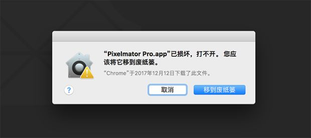
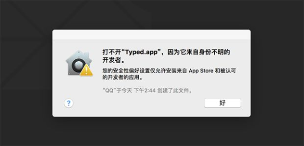
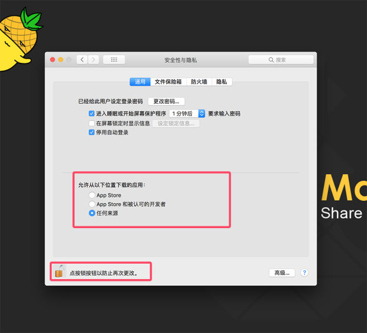
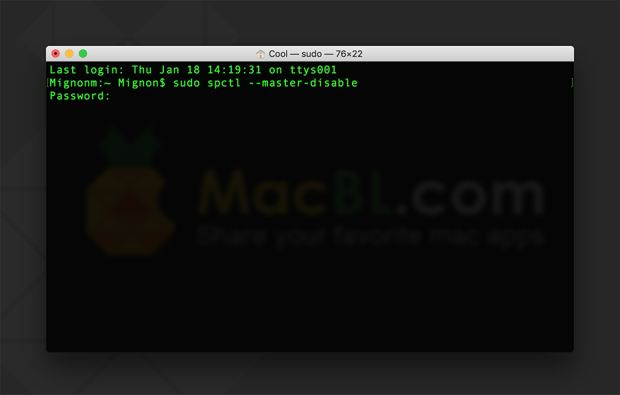
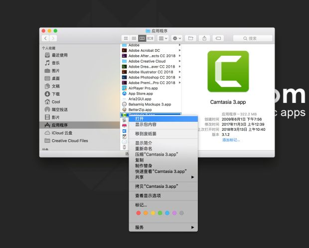

# Mac应用程序无法打开或文件损坏的处理方法
## 问题一
大多数用户在安装 Mac 应用时，经常会遇到提示 “ _XXX.app 已损坏，打不开。您应该将它移到废纸篓 _” 或 “ _打不开 XXX.app，因为它来自身份不明的开发者 _” ，如下图所示：


### 遇到这种情况，解决的方法很简单，步骤如下：

1. 打开_系统偏好设置_界面，进入_安全性与隐私_
2. 点按左下角的锁头图标，解锁更改权限
3. 将允许从以下位置下载的应用，更改为 “ _任何来源 _” ，然后再打开应用即可


### 若没有“任何来源”这个选项（macOS Sierra 10.12及以上的用户可能会遇到），按以下步骤执行：

1. 打开终端（Terminal.app）
2. 拷贝粘贴 _sudo spctl --master-disable_，按回车键
3. 输入你的账户密码，按回车键确认执行（该密码不会显示，直接输入即可）


### 如已经开启任何来源，但依旧打不开（macOS Catalina  10.15以上会遇到）按以下步骤执行：
#### 方法一

1. 打开终端
2. 输入以下命令，回车；
```java
sudo xattr -d com.apple.quarantine /Applications/xxxx.app
```
注意：/Applications/xxxx.app 换成你的 App 路径

3. 重启 App 即可。
#### **方法二**

1. 打开终端；
2. 输入以下命令，回车；
```java
xattr -cr /Applications/xxxx.app
```
注意：/Applications/xxxx.app 换成你的 App 路径（把 App 直接拖入即可）

3. 重启 App 即可。
## 问题二
如安装应用时，出现 _“ 打不开 XXX.app，因为它来自身份不明的开发者 ”_ ，并提示你的软件在什么位置什么时间下载了磁盘影像。如图所示：

### 遇到这种情况，方法如下：

1. 将软件放入“应用程序”后，点击软件 _右键-打开_ ，如图所示：



2. 弹出以下对话框后，你打开即可。


## 问题三
某些软件的最新版本在 _macOS Mojave 10.14 及以上系统_会出现报错无法使用的情况，可在终端输入以下代码即可运行：
```java
sudo codesign --force --deep --sign - 文件位置（直接将应用拖进去即可）
```
注意最后一个_ -_ 与 _文件位置_ 中间有一个 _空格_）
[https://www.macbl.com/video/tips/1689](https://www.macbl.com/video/tips/1689)
