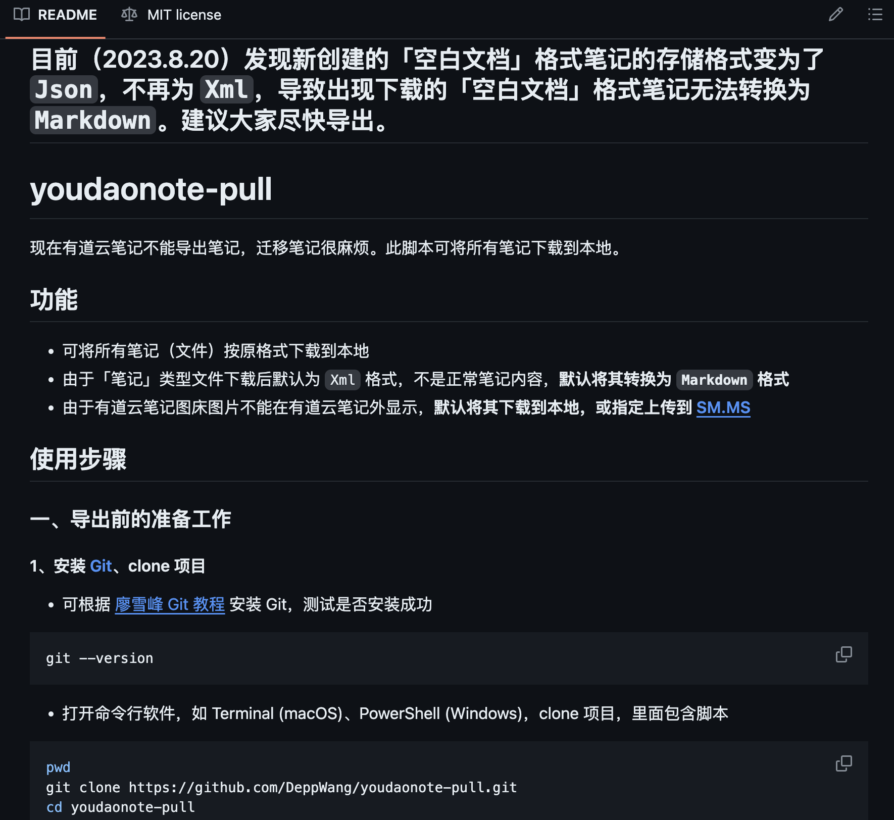
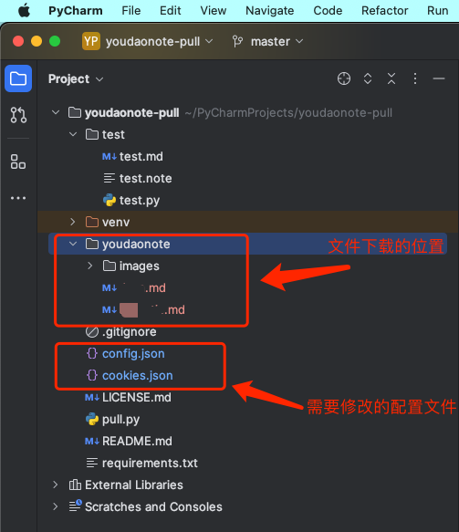
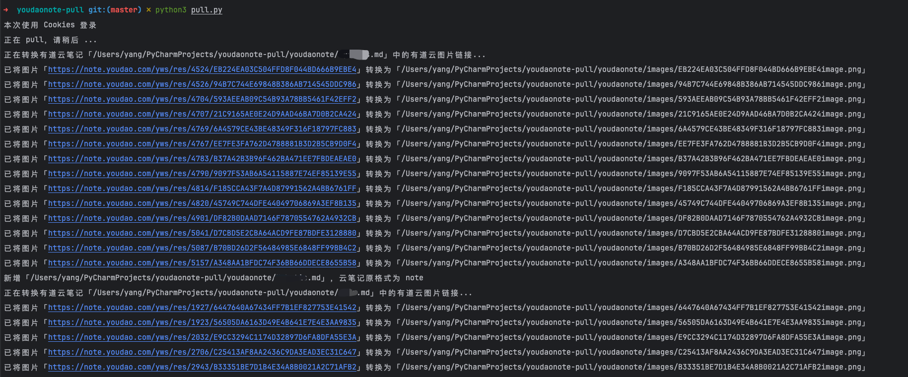
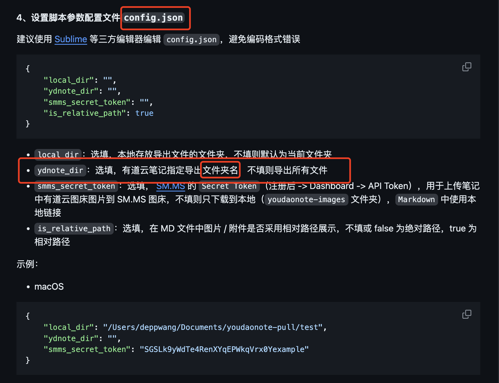

# 一、背景
> 用了很多年有道云，倒不是多喜欢，而是一直在用，里面有不少资料，换来换去觉得很麻烦；最近突然发现有道云越来越卡，占的内存很大，而在使用的时候，顶行打字的时候，光标老是跳，必须敲个空格才能正常，我也不知道是输入法问题还是有道云的问题，但用其他软件和平台又没有这种现象。再加上有道云的搜索实在是很难用。开始换软件，突然发现有道云居然没法批量导出，并且有道云笔记并不是md文件，也就是就算单个导出的话，也是没办法把，笔记文档，导出md格式的，实在理解不了，于是在网上搜索批量导出的方法，最后找到这个。

# 二、解决项目
> [GitHub - DeppWang/youdaonote-pull: 📝 一个一键导出 / 备份「有道云笔记」所有笔记的 Python 脚本。 A Python script to export/backup all the notes of the “Youdao Note”.](https://github.com/DeppWang/youdaonote-pull)

- 

- 这是一个大牛写的，按照步骤操作，只要稍微懂一点的，都可以很顺利完成，我用的是mac，所以git和python之前都安装好了，找cookies文件也很方便，只要找到“YNOTE_CSTK”、“YNOTE_LOGIN”、“YNOTE_SESS”三个关键词。
# 三、项目实践

- 拉取项目，根据`youdaonote-pull`项目中的操作步骤一步一步进行即可。操作步骤不在这里赘述。
- 项目结构和需要修改的文件
   - 
- 运行截图
   - 
# 四、注意

- 需要注意的是在修改`config.json`文件时`ydnote_dir`配置项是对有道云的文件夹下的所有文章进行导出，并不是对某个文章进行导出，所以不要写文章名
- 如果不想把所有的文章导出来，或者只想导出几个指定的文章，我的做法是新建一个文件夹，把想要导出的文章移动到该文件夹，然后导出该文件夹下的所有文章即可。
- 
