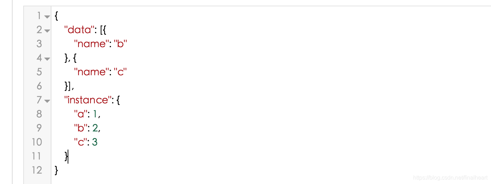
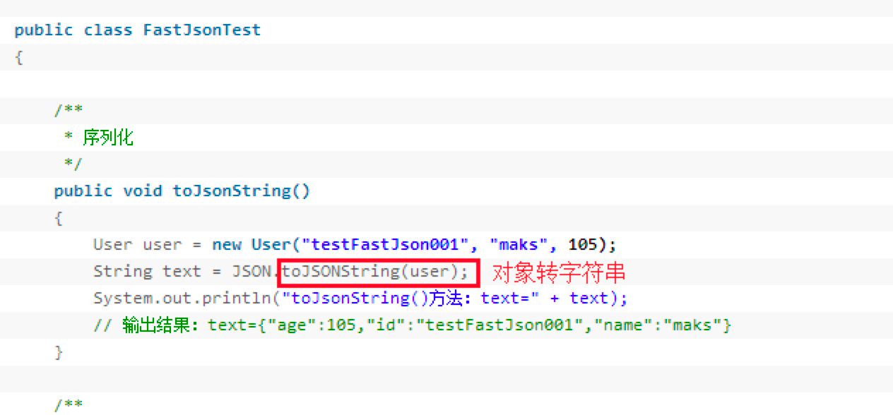

**JSON学习**<br />**第一章**<br />**fastjson**<br /> import com.alibaba.fastjson import com.alibaba.fastjson.JSON; <br />**pom依赖**<br /> <!-- https://mvnrepository.com/artifact/com.alibaba/fastjson --> <dependency> <groupId>com.alibaba</groupId> <artifactId>fastjson</artifactId> <version>1.2.47</version> </dependency> <br />**简介**<br />这个包里面最主要也是最常用的两个类是 JSON JSONObject 这两个类也都是内部使用的是final map 来实现的。构造的时候可以传入一个ordered。来确定使用LinkedHashMap还是HashMap。看下面这个构造。还可以使用map入参来构造jsonObject。也可以看到jsonobject实际上是json的子类。有一个特征就是 jsonObject是没有static方法的。我们打点出来的静态方法都是JSON那边继承过来的。就不往深挖源码了，知道大概就好。<br />
> 下面为例子json。data的value可以看成List persion有name属性。 instance可以看成Map(对象的json字符串形式)


```java
@Test
public void myTest(){
    Person person = new Person();
    person.setName("郭洋");
    person.setAge(23);
    String str = JSON.toJSONString(person);// 把对象转化成json字符串
    System.out.println(str); // 输出：{"age":23,"name":"郭洋"}
    
    // 这个方法可以将Json字符串转成任意的javabean、Map、集合也可以。
    // 不指定后面的class就会转成JSONobject，
    // 若指定转成那个class，前面就要用那个class的实例去接收
    Person person1 = JSON.parseObject(str,person.getClass());// 转成Person类的实例对象
    System.out.println(person1);// Person(name=郭洋, age=23)
    JSONObject jsonObject = JSON.parseObject(str);// 不指定json字符串要转成那个class对象实例，默认转成JSONObject对象实例
    System.out.println(jsonObject);// {"name":"郭洋","age":23}
    
    Map<Integer,Double> map = new HashMap<>();
    map.put(1,1.2);
    map.put(2,1.2);
    map.put(3,1.2);
    map.put(4,1.2);
    String strMap = JSON.toJSONString(map);// 将Map转成json字符串
    System.out.println(strMap);// {1:1.2,2:1.2,3:1.2,4:1.2}
    Map strMap1 = JSON.parseObject(strMap);// 将json字符串转化成map对象
    System.out.println(strMap1);// {"1":1.2,"2":1.2,"3":1.2,"4":1.2}
}

// 输出：
//{"age":23,"name":"郭洋"}
//Person(name=郭洋, age=23)
//{"name":"郭洋","age":23}
//{1:1.2,2:1.2,3:1.2,4:1.2}
//{"1":1.2,"2":1.2,"3":1.2,"4":1.2}
```
测试二代码如下：
```java
@Test
public void myTest2(){
    Person person = new Person();
    person.setName("郭洋2");
    person.setAge(22);
    Person person1 = new Person();
    person1.setName("郭洋1");
    person1.setAge(21);
    List<Person> personList = new ArrayList<>();
    personList.add(person);
    personList.add(person1);
    String str = JSON.toJSONString(personList);// 将List转成Json字符串
    System.out.println(str);// [{"age":22,"name":"郭洋2"},{"age":21,"name":"郭洋1"}]

    System.out.println("*****************************");

    List list = JSON.parseObject(str,personList.getClass());// 将json字符串转化成数组对象
    for (Object o : list) {
        System.out.println(o);  //{"name":"郭洋2","age":22}
                                //{"name":"郭洋1","age":21}
    }

    System.out.println("*****************************");

    JSONArray objects = JSON.parseArray(str);// 将json字符串转化成JSONArray对象
    System.out.println(objects);// [{"name":"郭洋2","age":22},{"name":"郭洋1","age":21}]
    System.out.println("*****************************");
    List<Person> personList1 = JSON.parseArray(str,Person.class);
    System.out.println(personList1);// [Person(name=郭洋2, age=22), Person(name=郭洋1, age=21)]
    System.out.println("*****************************");

}

//输出：
//[{"age":22,"name":"郭洋2"},{"age":21,"name":"郭洋1"}]
//*****************************
//{"name":"郭洋2","age":22}
//{"name":"郭洋1","age":21}
//*****************************
//[{"name":"郭洋2","age":22},{"name":"郭洋1","age":21}]
//*****************************
//[Person(name=郭洋2, age=22), Person(name=郭洋1, age=21)]
//*****************************
```
参考：[https://blog.csdn.net/finalheart/article/details/86073477](https://blog.csdn.net/finalheart/article/details/86073477)<br /> 2021/07/25 16:52 <br />**第二章**<br />**Java中TypeReference用法说明**<br />**用途、测试**<br />在使用fastJson时,对于泛型的**反序列化**很多场景下都会使用到TypeReference，例如：<br />
> parseObject()方法同理

- getObject(key,xxx.class)
   - 传入类对象的时候
   - 再不破坏数据结构的情况下，传啥，返回的类型就是啥。
- getObject(key,new TypeReference< Xxx >() {})
   - 传入TypeReference时，
   - 传啥返回的类型都是Object，再不破坏数据结构的情况下，传入啥类型就用啥类型去接收返回值就可以。
- parseObject(str,xxx)方法同理（将JSON字符串转化成对应的对象，str：json字符串、xxx要转成的对象类型）
   - xxx若为xxx.class时、或new TypeReference>() {}
   - 传啥返回值的类型就是啥

**测试parseObject（）方法**<br />若传入的类型有泛型就会编译不通过<br />

- 传new TypeReference< List >() {} 
```java
List<Person> personList2 = JSONObject.parseObject(str, new TypeReference<List<Person>>(){});
for (Person person2 : personList2) {
    System.out.println(person2);
}

//输出：
//Person(name=郭洋2, age=22)
//Person(name=郭洋1, age=21)
```

- 传List.class
```java
List list1 = JSONObject.parseObject(str, List.class);
for (Object o : list1) {
    System.out.println(o);
}

//输出
//{"name":"郭洋2","age":22}
//{"name":"郭洋1","age":21}
```
**疑惑：**<br />**1、JSON.parseObject(String str)与JSONObject.parseObject(String str)的区别**<br />**parseObject(String str)的作用**

- JSON.parseObject(String str)是将str转化为相应的JSONObject对象，其中str是“键值对”形式的json字符串，转化为JSONObject对象之后就可以使用其内置的方法，进行各种处理了。

**JSON.parseObject(String str)与JSONObject.parseObject(String str)的区别**

- 根据[源码](https://www.2cto.com/ym/)显示：JSON是一个抽象类，JSON中有一个静态方法parseObject(String text)，将text解析为一个JSONObject对象并返回;JSONObject是一个继承自JSON的类，当调用JSONObject.parseObject(result)时，会直接调用父类的parseObject(String text)。所以两者没什么区别，一个是用父类去调用父类自己的静态的parseObject(String text)，一个是用子类去调用父类的静态parseObject(String text)，两者调的是同一个方法。
```java
JSONObject json=JSON.parseObject(params); // parms：字符串   把字符串转为JSONObject对象
```

