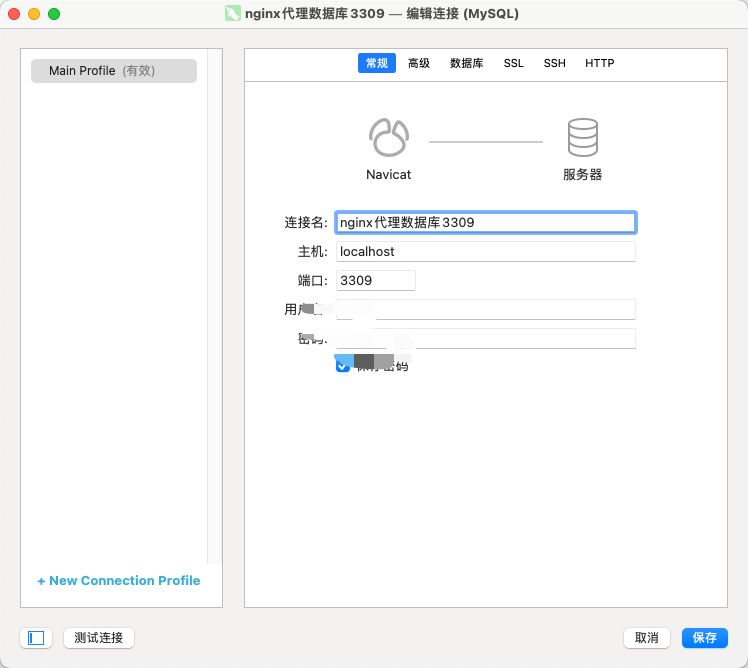

# 一、前言
我们的生产环境基本上都部署在云服务器上，例如应用服务器、MySQL服务器等。如果MySQL服务器直接暴露在公网，就会存在很大的风险，为了保证数据安全，MySQL服务器的端口是不对外开放的。
好巧不巧，线上业务遇到bug了，开发的小伙伴需要远程连接MySQL来查看数据，那应该怎么办呢？
我们可以通过Nginx代理（“跳板机”）来进行连接。
# 二、nginx代理连接
要实现对连接的代理转发，我们需要一台服务器并安装Nginx，且与MySQL服务器处于一个内网之中，内网之间可以访问。
其次，我们需要用到`ngx_stream_core_module`模块，该模块不是默认构建的，我们需要在`configure`时添加`--with-stream`来进行构建。
## 2.1、在原有模块添加`ngx_stream_core_module`

- 安装stream模块
```nginx
# 安装stream模块实现tcp代理
./configure --with-http_ssl_module --add-module=/usr/local/src/nginx-module-vts-0.1.18/ --with-http_stub_status_module --with-http_sub_module --with-stream

# 编译
make

# 停止当前nginx
nginx -s stop
```

- 备份原有的nginx二进制文件`mv /use/sbin/nginx{,.bak}`
- 替换原有的二进制文件`cp objs/nginx /use/sbin/`（拷贝到当前nginx所在文件夹下）
- 启动nginx
- 使用`nginx -V`查看nginx安装了那些模块
- 配置stream

既然要用到`ngx_stream_core_module`模块，首当其冲，是看看其提供的指令，我们才知道怎么来进行配置。
## 2.2、stream
该指令定义了stream服务器。与`http`块平级，定义在main块中。

- 作用域：main
- 语法：stream {...}
- 示例：
```nginx
 stream {
     server {
         ......
     }
 }
```
## 2.3、server
该指令定义一个虚拟主机，与`http`块中的`server`类似。我们可以在`stream`块中定义多个`server`块

- 作用域：stream
- 语法：server {...}
- 示例：
```nginx
stream {
     server {
         ......
     }
     server {
         ......
     }
 }
```
## 2.4、listen
该指令定义虚拟主机`server`要监听的socket的地址和端口。

- 作用域：`server`
- 语法：`listen address:port;`
- 示例：
```nginx
listen 127.0.0.1:3306;
 listen *:3306;
 # 效果与listen *:3306一样
 listen 3306;
 listen localhost:3306;
```
## 2.5、配置示例

- 代理MySQL服务器，端口3306（单机环境）
```nginx
stream  {
     server {
         listen 3306;
         proxy_pass 192.168.110.101:3306;
     }
 }
```

- 代理MySQL服务器，端口3306（集群环境）
```nginx
stream  {
     upstream mysql_socket {
         server 192.168.110.101:3306;
     }
     server {
             listen 3309;
             proxy_pass mysql_socket;
     }
 }
```

- 此时，我们就可以通过例如Navicat等客户端连接`nginx ip:3309`，因为本次搭建是用自己电脑的nginx，使用的是`localhost:3309`即可连接到mysql。



# 三、限制访问IP
实现了对连接的代理，所有人都可以通过访问Nginx来连接MySQL服务器，解决了外网无法连接的问题。
为了更进一步的缩小访问范围，保证数据安全，我们可以限制只有公司网络的IP地址可以通过Nginx进行连接。
Nginx提供了`ngx_stream_access_module`模块，其指令非常简单，仅包含`allow`和`deny`指令。
## 3.1、allow
该指令设置指定的IP允许访问。可以和deny指令配合使用

- 作用域：stream, server
- 语法：allow address | CIDR | unix: | all;
- 示例：
```nginx
 # 允许192.168.110.1访问
 allow 192.168.110.1;
 
 # 允许192.168.110.1到192.168.255.254
 allow 192.168.110.0/16;
 
 # 允许192.168.110.1到192.168.110.254
 allow 192.168.110.0/24;
 
 # 允许所有的IP访问
 allow all;
```
## 3.2、deny
该指令设置指定的IP禁止访问。可以和allow指令配合使用。

- 作用域：stream, server
- 语法：deny address | CIDR | unix: | all;
- 示例：
```nginx
# 禁止192.168.110.1访问
 deny 192.168.110.1;
 
 # 禁止192.168.110.1到192.168.255.254
 deny 192.168.110.0/16;
 
 # 禁止192.168.110.1到192.168.110.254
 deny 192.168.110.0/24;
 
 # 禁止所有的IP访问
 deny all;
```
## 3.3、配置示例

- 禁止所有的IP访问，192.168.110.100除外。
```nginx
allow 192.168.110.100;
 deny all;
```

- **Tips：如果指定了allow，需要配合deny使用，否则就是允许所有的IP地址访问！！！！！**
## 3.4、综合案例

- 只允许`127.0.0.1`通过Nginx连接MySQL服务器。
```nginx
stream  {
     allow 127.0.0.1;
     deny all;
     server {
         listen 3309;
         proxy_pass 192.168.110.101:3306;
     }
 }
```

- 允许一些指定的一些ip通过nginx访问Mysql服务器
```nginx
stream  {
     allow 127.0.0.1;
     allow xxx.xxx.xxx.xxx;
     allow xxx.xxx.xxx.xxx;
     allow xxx.xxx.xxx.xxx;
     deny all;
     server {
         listen 3309;
         proxy_pass 192.168.110.101:3306;
     }
 }
```

---

