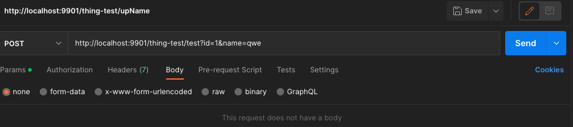
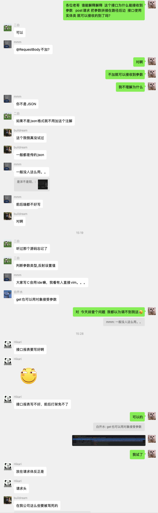
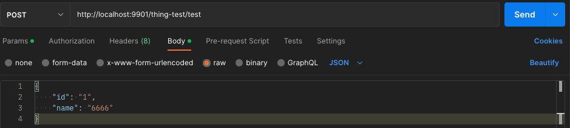
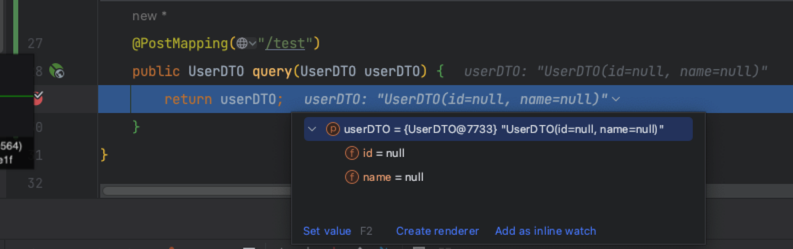
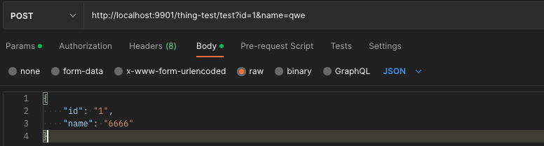
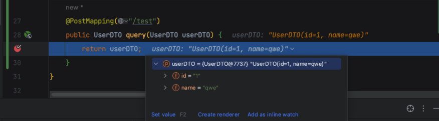
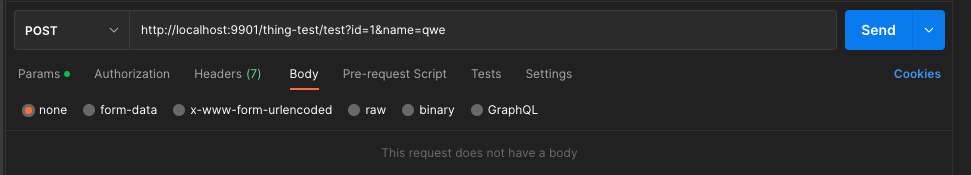
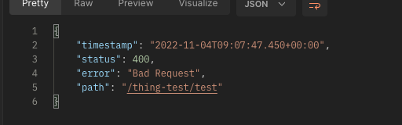
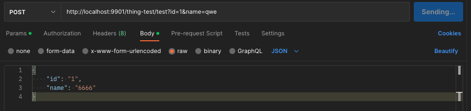
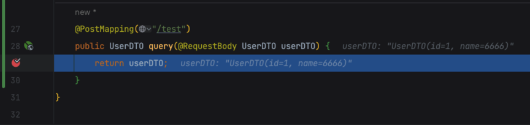

- 今天在公司偶然发现一个很神奇的代码。上截图

# 一、发现问题
> 一个post请求并没有请求体，只是把参数拼在了路径的后边，后台接口接收的参数上也并没有加`@RequestBody`，接收的参数同样是实体类。 神奇的是接口接收到了参数。

# 二、查资料
求知聊天记录

# 三、探究

- 我们都知道post请求在请求体的情况下，接口不加`@RequestBody`传入的请求体参数是不能被接收的
  - 
  - 
- 我们把参数拼在后边，并且请求体也传入参数的话
  - 
  - 
  - 到此我们得出结论：接口在不加`@RequestBody`注解的时候，我们传入请求体与否对于接口来说是无效的，只有我们拼了参数在后边才会接受到参数
- 接口添加`@RequestBody` 注解 拼接参数且不传入请求体
  - 
  - 
  - 此时我们的服务端返回报错400
  - 报错信息为：Required request body is missing:........
- 接口添加`@RequestBody` 注解 拼接参数且传入请求体
  - 
  - 
  - 此时我们的接口一样可以接收到参数
# 四、结论
> @RequestBody 主要用于处理 json格式数据，Content-type:application/json
> ContentType类型application/x-www-form-urlencoded,格式为key1=value1&key2=value2提交到后台 ，不需要加@requestBody。
> `使用@requestBody.当请求content_type为：application/json类型的请求，数据类型为json时， json格式如下：{“aaa”:“111”,“bbb”:“222”}`

建议在项目当中不要使用文章开头的形式去写，第一会引起歧义，前台不好写，后台也蒙，最好严格按照 GET（拼接）POST（请求体）的形式，清晰明了

---

END.....
