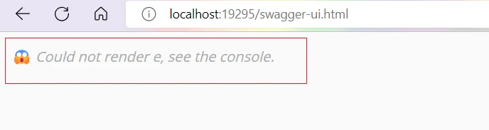

# 1、关闭Druid监控配置
- 在Spring Boot中，我们可以通过配置文件来控制Druid的监控功能。首先，打开application.properties（或application.yml）文件，添加以下配置项：
```properties
# application.properties
spring.datasource.druid.filter.config.enabled=false
spring.datasource.druid.stat-view-servlet.enabled=false
spring.datasource.druid.web-filter.enabled=false
```
或者
```yaml
# Spring配置
spring:
  # 数据源配置
  datasource:
      type: com.alibaba.druid.pool.DruidDataSource
      driverClassName: oracle.jdbc.driver.OracleDriver
      url: jdbc:oracle:thin:@127.0.0.1:1521:orcl
      username: name
      password: pwd
      # 这段配置，关闭监控
      # localhost/druid/index.html
      druid:
        stat-view-servlet:
          enabled: false
        web-stat-filter:
          enabled: false
        filter:
          config:
            enabled: false
```

- 测试
   - 
