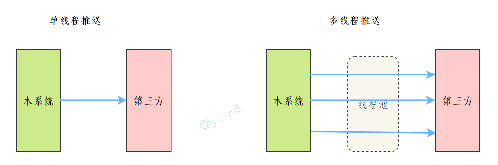
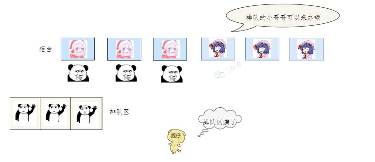
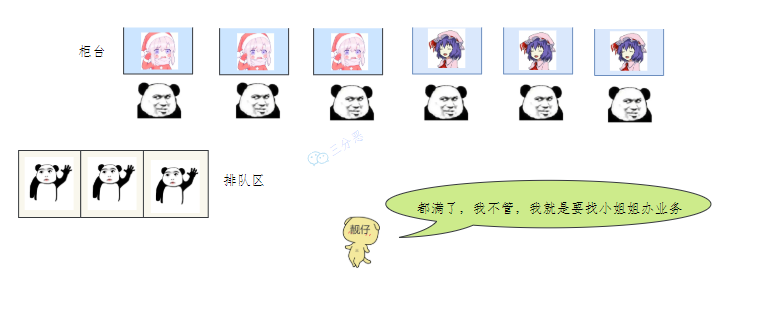
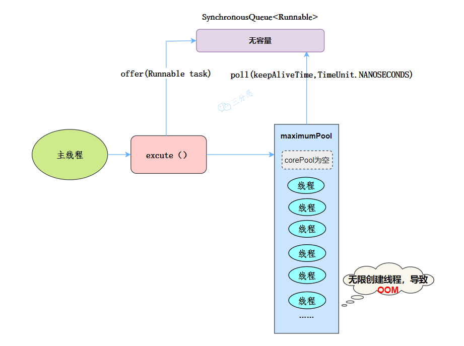
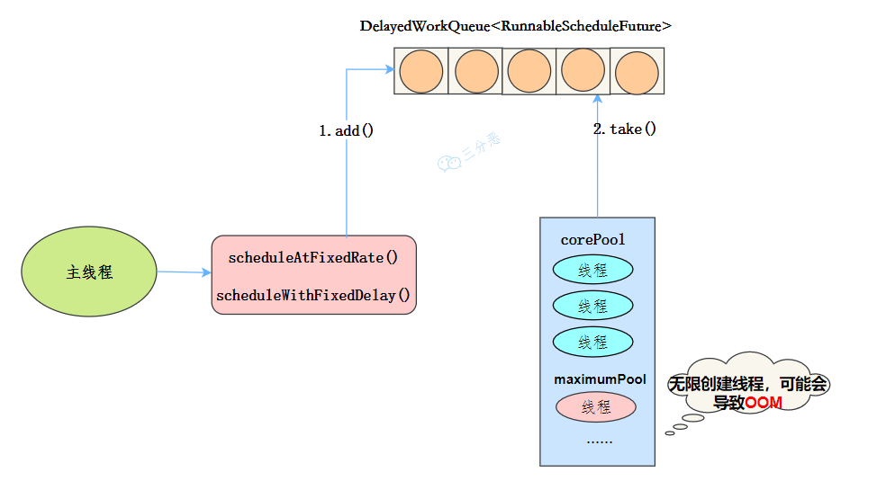
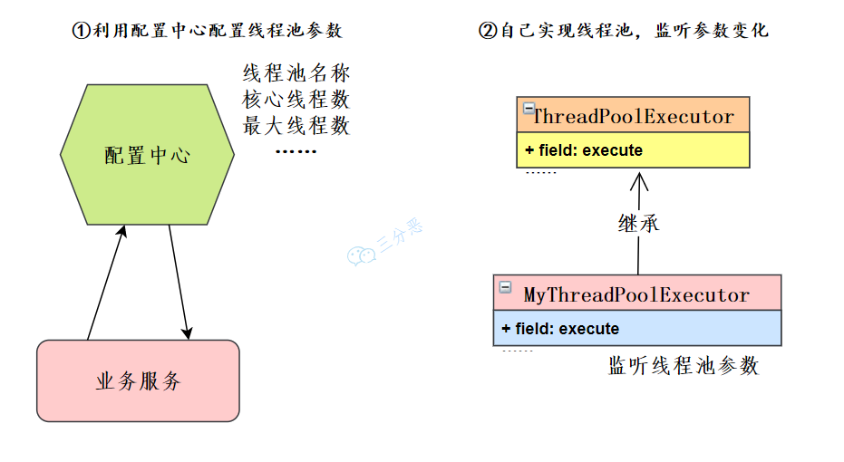
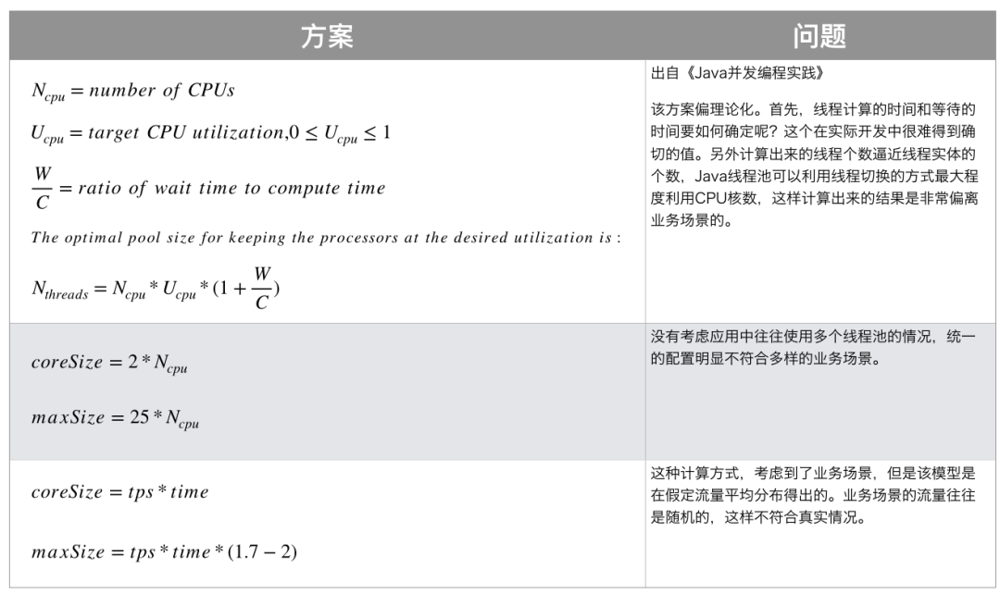
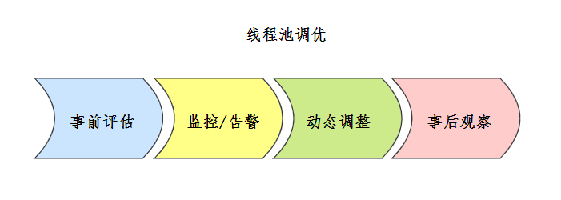
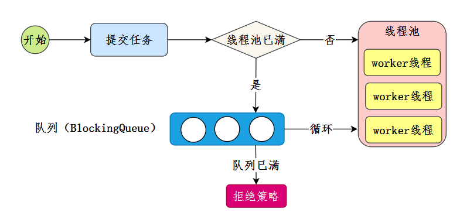

# 1\. 什么是线程池？

**线程池：** 简单理解，它就是一个管理线程的池子。

* **它帮我们管理线程，避免增加创建线程和销毁线程的资源损耗** 。因为线程其实也是一个对象，创建一个对象，需要经过类加载过程，销毁一个对象，需要走GC垃圾回收流程，都是需要资源开销的。 
* **提高响应速度。** 如果任务到达了，相对于从线程池拿线程，重新去创建一条线程执行，速度肯定慢很多。 
* **重复利用。** 线程用完，再放回池子，可以达到重复利用的效果，节省资源。 

# 2\. 能说说工作中线程池的应用吗？

之前我们有一个和第三方对接的需求，需要向第三方推送数据，引入了多线程来提升数据推送的效率，其中用到了线程池来管理线程。



主要代码如下：


完整可运行代码地址：https://gitee.com/fighter3/thread-demo.git

线程池的参数如下：

* corePoolSize：线程核心参数选择了CPU数×2 

* maximumPoolSize：最大线程数选择了和核心线程数相同 

* keepAliveTime：非核心闲置线程存活时间直接置为0 

* unit：非核心线程保持存活的时间选择了 TimeUnit.SECONDS 秒 

* workQueue：线程池等待队列，使用 LinkedBlockingQueue阻塞队列 

同时还用了synchronized 来加锁，保证数据不会被重复推送：

      synchronized (PushProcessServiceImpl.class) {}  

ps:这个例子只是简单地进行了数据推送，实际上还可以结合其他的业务，像什么数据清洗啊、数据统计啊，都可以套用。

# 3.能简单说一下线程池的工作流程吗？

用一个通俗的比喻：

有一个营业厅，总共有六个窗口，现在开放了三个窗口，现在有三个窗口坐着三个营业员小姐姐在营业。

老三去办业务，可能会遇到什么情况呢？

1. 老三发现有空间的在营业的窗口，直接去找小姐姐办理业务。 


直接办理

2. 老三发现没有空闲的窗口，就在排队区排队等。 


排队等待

3. 老三发现没有空闲的窗口，等待区也满了，蚌埠住了，经理一看，就让休息的小姐姐赶紧回来上班，等待区号靠前的赶紧去新窗口办，老三去排队区排队。小姐姐比较辛苦，假如一段时间发现他们可以不用接着营业，经理就让她们接着休息。 


排队区满

4. 老三一看，六个窗口都满了，等待区也没位置了。老三急了，要闹，经理赶紧出来了，经理该怎么办呢？ 


等待区，排队区都满


> 1. 我们银行系统已经瘫痪
> 
> 2. 谁叫你来办的你找谁去
> 
> 3. 看你比较急，去队里加个塞
> 
> 4. 今天没办法，不行你看改一天

上面的这个流程几乎就跟 JDK 线程池的大致流程类似，


> 1. 营业中的 3个窗口对应核心线程池数：corePoolSize
> 2. 总的营业窗口数6对应：maximumPoolSize
> 3. 打开的临时窗口在多少时间内无人办理则关闭对应：unit
> 4. 排队区就是等待队列：workQueue
> 5. 无法办理的时候银行给出的解决方法对应：RejectedExecutionHandler
> 6. threadFactory 该参数在 JDK 中是 线程工厂，用来创建线程对象，一般不会动。

所以我们线程池的工作流程也比较好理解了：

1. 线程池刚创建时，里面没有一个线程。任务队列是作为参数传进来的。不过，就算队列里面有任务，线程池也不会马上执行它们。 
2. 当调用 execute() 方法添加一个任务时，线程池会做如下判断： 
* 如果正在运行的线程数量小于 corePoolSize，那么马上创建线程运行这个任务； 
* 如果正在运行的线程数量大于或等于 corePoolSize，那么将这个任务放入队列； 
* 如果这时候队列满了，而且正在运行的线程数量小于 maximumPoolSize，那么还是要创建非核心线程立刻运行这个任务； 
* 如果队列满了，而且正在运行的线程数量大于或等于 maximumPoolSize，那么线程池会根据拒绝策略来对应处理。 


线程池执行流程

3. 当一个线程完成任务时，它会从队列中取下一个任务来执行。 

4. 当一个线程无事可做，超过一定的时间（keepAliveTime）时，线程池会判断，如果当前运行的线程数大于 corePoolSize，那么这个线程就被停掉。所以线程池的所有任务完成后，它最终会收缩到 corePoolSize 的大小。 

# 4.线程池主要参数有哪些？

1. corePoolSize 

此值是用来初始化线程池中核心线程数，当线程池中线程池数< ` corePoolSize ` 时，系统默认是添加一个任务才创建一个线程池。当线程数 =
corePoolSize时，新任务会追加到workQueue中。

2. maximumPoolSize 

` maximumPoolSize ` 表示允许的最大线程数 = (非核心线程数+核心线程数)，当 ` BlockingQueue `
也满了，但线程池中总线程数 < ` maximumPoolSize ` 时候就会再次创建新的线程。

3. keepAliveTime 

非核心线程 =(maximumPoolSize - corePoolSize ) ,非核心线程闲置下来不干活最多存活时间。

4. unit 

线程池中非核心线程保持存活的时间的单位

* TimeUnit.DAYS; 天 

* TimeUnit.HOURS; 小时 

* TimeUnit.MINUTES; 分钟 

* TimeUnit.SECONDS; 秒 

* TimeUnit.MILLISECONDS; 毫秒 

* TimeUnit.MICROSECONDS; 微秒 

* TimeUnit.NANOSECONDS; 纳秒 
5. workQueue 

线程池等待队列，维护着等待执行的 ` Runnable ` 对象。当运行当线程数= corePoolSize时，新的任务会被添加到 ` workQueue
` 中，如果 ` workQueue ` 也满了则尝试用非核心线程执行任务，等待队列应该尽量用有界的。

6. threadFactory 

创建一个新线程时使用的工厂，可以用来设定线程名、是否为daemon线程等等。

7. handler 

` corePoolSize ` 、 ` workQueue ` 、 ` maximumPoolSize ` 都不可用的时候执行的饱和策略。

# 5.线程池的拒绝策略有哪些？

类比前面的例子，无法办理业务时的处理方式，帮助记忆：


四种策略

* AbortPolicy ：直接抛出异常，默认使用此策略 
* CallerRunsPolicy：用调用者所在的线程来执行任务 
* DiscardOldestPolicy：丢弃阻塞队列里最老的任务，也就是队列里靠前的任务 
* DiscardPolicy ：当前任务直接丢弃 

想实现自己的拒绝策略，实现RejectedExecutionHandler接口即可。

# 6.线程池有哪几种工作队列？

常用的阻塞队列主要有以下几种：

* ArrayBlockingQueue：ArrayBlockingQueue（有界队列）是一个用数组实现的有界阻塞队列，按FIFO排序量。 
* LinkedBlockingQueue：LinkedBlockingQueue（可设置容量队列）是基于链表结构的阻塞队列，按FIFO排序任务，容量可以选择进行设置，不设置的话，将是一个无边界的阻塞队列，最大长度为Integer.MAX_VALUE，吞吐量通常要高于ArrayBlockingQuene；newFixedThreadPool线程池使用了这个队列 
* DelayQueue：DelayQueue（延迟队列）是一个任务定时周期的延迟执行的队列。根据指定的执行时间从小到大排序，否则根据插入到队列的先后排序。newScheduledThreadPool线程池使用了这个队列。 
* PriorityBlockingQueue：PriorityBlockingQueue（优先级队列）是具有优先级的无界阻塞队列 
* SynchronousQueue：SynchronousQueue（同步队列）是一个不存储元素的阻塞队列，每个插入操作必须等到另一个线程调用移除操作，否则插入操作一直处于阻塞状态，吞吐量通常要高于LinkedBlockingQuene，newCachedThreadPool线程池使用了这个队列。 

# 7.线程池提交execute和submit有什么区别？

1. execute 用于提交不需要返回值的任务 

```java
threadsPool.execute(new Runnable() { 
    @Override public void run() { 
        // TODO Auto-generated method stub } 
    });
```

2. submit()方法用于提交需要返回值的任务。线程池会返回一个future类型的对象，通过这个 future对象可以判断任务是否执行成功，并且可以通过future的get()方法来获取返回值 

```java
    Future future = executor.submit(harReturnValuetask); 
    try { Object s = future.get(); } catch (InterruptedException e) { 
        // 处理中断异常 
    } catch (ExecutionException e) { 
        // 处理无法执行任务异常 
    } finally { 
        // 关闭线程池 executor.shutdown();
    }
``` 

# 8.线程池怎么关闭知道吗？

可以通过调用线程池的 ` shutdown ` 或 ` shutdownNow `
方法来关闭线程池。它们的原理是遍历线程池中的工作线程，然后逐个调用线程的interrupt方法来中断线程，所以无法响应中断的任务可能永远无法终止。

1. shutdown() 将线程池状态置为shutdown,并不会立即停止： 


> 1. 停止接收外部submit的任务
> 2. 内部正在跑的任务和队列里等待的任务，会执行完
> 3. 等到第二步完成后，才真正停止

2. shutdownNow() 将线程池状态置为stop。一般会立即停止，事实上不一定： 


> 1. 和shutdown()一样，先停止接收外部提交的任务
> 2. 忽略队列里等待的任务
> 3. 尝试将正在跑的任务interrupt中断
> 4. 返回未执行的任务列表

shutdown 和shutdownnow简单来说区别如下：


> shutdownNow()能立即停止线程池，正在跑的和正在等待的任务都停下了。这样做立即生效，但是风险也比较大。shutdown()只是关闭了提交通道，用submit()是无效的；而内部的任务该怎么跑还是怎么跑，跑完再彻底停止线程池。

# 9.线程池的线程数应该怎么配置？

线程在Java中属于稀缺资源，线程池不是越大越好也不是越小越好。任务分为计算密集型、IO密集型、混合型。


> 1. 计算密集型：大部分都在用CPU跟内存，加密，逻辑操作业务处理等。
> 2. IO密集型：数据库链接，网络通讯传输等。

1. 计算密集型一般推荐线程池不要过大，一般是CPU数 + 1，+1是因为可能存在 **页缺失** (就是可能存在有些数据在硬盘中需要多来一个线程将数据读入内存)。如果线程池数太大，可能会频繁的 进行线程上下文切换跟任务调度。获得当前CPU核心数代码如下： 

    Runtime.getRuntime().availableProcessors();  

2. IO密集型：线程数适当大一点，机器的Cpu核心数*2。 
3. 混合型：可以考虑根据情况将它拆分成CPU密集型和IO密集型任务，如果执行时间相差不大，拆分可以提升吞吐量，反之没有必要。 

当然，实际应用中没有固定的公式，需要结合测试和监控来进行调整。

# 10.有哪几种常见的线程池？

主要有四种，都是通过工具类Excutors创建出来的，阿里巴巴《Java开发手册》里禁止使用这种方式来创建线程池。

* newFixedThreadPool (固定数目线程的线程池) 

* newCachedThreadPool (可缓存线程的线程池) 

* newSingleThreadExecutor (单线程的线程池) 

* newScheduledThreadPool (定时及周期执行的线程池) 

# 11.能说一下四种常见线程池的原理吗？

前三种线程池的构造直接调用ThreadPoolExecutor的构造方法。

### newSingleThreadExecutor

      public static ExecutorService newSingleThreadExecutor(ThreadFactory threadFactory) {  
            return new FinalizableDelegatedExecutorService  
                (new ThreadPoolExecutor(1, 1,  
                                        0L, TimeUnit.MILLISECONDS,  
                                        new LinkedBlockingQueue<Runnable>(),  
                                        threadFactory));  
        }  

**线程池特点**

* 核心线程数为1 
* 最大线程数也为1 
* 阻塞队列是无界队列LinkedBlockingQueue，可能会导致OOM 
* keepAliveTime为0 


SingleThreadExecutor运行流程

工作流程：

* 提交任务 
* 线程池是否有一条线程在，如果没有，新建线程执行任务 
* 如果有，将任务加到阻塞队列 
* 当前的唯一线程，从队列取任务，执行完一个，再继续取，一个线程执行任务。 

**适用场景**

适用于串行执行任务的场景，一个任务一个任务地执行。

### newFixedThreadPool

      public static ExecutorService newFixedThreadPool(int nThreads, ThreadFactory threadFactory) {  
            return new ThreadPoolExecutor(nThreads, nThreads,  
                                          0L, TimeUnit.MILLISECONDS,  
                                          new LinkedBlockingQueue<Runnable>(),  
                                          threadFactory);  
        }  

**线程池特点：**

* 核心线程数和最大线程数大小一样 
* 没有所谓的非空闲时间，即keepAliveTime为0 
* 阻塞队列为无界队列LinkedBlockingQueue，可能会导致OOM 


FixedThreadPool

工作流程：

* 提交任务 
* 如果线程数少于核心线程，创建核心线程执行任务 
* 如果线程数等于核心线程，把任务添加到LinkedBlockingQueue阻塞队列 
* 如果线程执行完任务，去阻塞队列取任务，继续执行。 

**使用场景**

FixedThreadPool 适用于处理CPU密集型的任务，确保CPU在长期被工作线程使用的情况下，尽可能的少的分配线程，即适用执行长期的任务。

### newCachedThreadPool

       public static ExecutorService newCachedThreadPool(ThreadFactory threadFactory) {  
            return new ThreadPoolExecutor(0, Integer.MAX_VALUE,  
                                          60L, TimeUnit.SECONDS,  
                                          new SynchronousQueue<Runnable>(),  
                                          threadFactory);  
        }  

**线程池特点：**

* 核心线程数为0 
* 最大线程数为Integer.MAX_VALUE，即无限大，可能会因为无限创建线程，导致OOM 
* 阻塞队列是SynchronousQueue 
* 非核心线程空闲存活时间为60秒 

当提交任务的速度大于处理任务的速度时，每次提交一个任务，就必然会创建一个线程。极端情况下会创建过多的线程，耗尽 CPU 和内存资源。由于空闲 60
秒的线程会被终止，长时间保持空闲的 CachedThreadPool 不会占用任何资源。


CachedThreadPool执行流程

工作流程：

* 提交任务 
* 因为没有核心线程，所以任务直接加到SynchronousQueue队列。 
* 判断是否有空闲线程，如果有，就去取出任务执行。 
* 如果没有空闲线程，就新建一个线程执行。 
* 执行完任务的线程，还可以存活60秒，如果在这期间，接到任务，可以继续活下去；否则，被销毁。 

**适用场景**

用于并发执行大量短期的小任务。

### newScheduledThreadPool

        public ScheduledThreadPoolExecutor(int corePoolSize) {  
            super(corePoolSize, Integer.MAX_VALUE, 0, NANOSECONDS,  
                  new DelayedWorkQueue());  
        }  

**线程池特点**

* 最大线程数为Integer.MAX_VALUE，也有OOM的风险 
* 阻塞队列是DelayedWorkQueue 
* keepAliveTime为0 
* scheduleAtFixedRate() ：按某种速率周期执行 
* scheduleWithFixedDelay()：在某个延迟后执行 


ScheduledThreadPool执行流程

**工作机制**

* 线程从DelayQueue中获取已到期的ScheduledFutureTask（DelayQueue.take()）。到期任务是指ScheduledFutureTask的time大于等于当前时间。 
* 线程执行这个ScheduledFutureTask。 
* 线程修改ScheduledFutureTask的time变量为下次将要被执行的时间。 
* 线程把这个修改time之后的ScheduledFutureTask放回DelayQueue中（DelayQueue.add()）。 


ScheduledThreadPoolExecutor执行流程

**使用场景**

周期性执行任务的场景，需要限制线程数量的场景

# 12.使用无界队列的线程池会导致什么问题吗？

例如newFixedThreadPool使用了无界的阻塞队列LinkedBlockingQueue，如果线程获取一个任务后，任务的执行时间比较长，会导致队列的任务越积越多，导致机器内存使用不停飙升，最终导致OOM。

# 13.线程池异常怎么处理知道吗？

在使用线程池处理任务的时候，任务代码可能抛出RuntimeException，抛出异常后，线程池可能捕获它，也可能创建一个新的线程来代替异常的线程，我们可能无法感知任务出现了异常，因此我们需要考虑线程池异常情况。

常见的异常处理方式：


线程池异常处理

# 14.能说一下线程池有几种状态吗？

线程池有这几个状态：

RUNNING,SHUTDOWN,STOP,TIDYING,TERMINATED。

       //线程池状态  
       private static final int RUNNING    = -1 << COUNT_BITS;  
       private static final int SHUTDOWN   =  0 << COUNT_BITS;  
       private static final int STOP       =  1 << COUNT_BITS;  
       private static final int TIDYING    =  2 << COUNT_BITS;  
       private static final int TERMINATED =  3 << COUNT_BITS;  

线程池各个状态切换图：


线程池状态切换图

**RUNNING**

* 该状态的线程池会接收新任务，并处理阻塞队列中的任务; 
* 调用线程池的shutdown()方法，可以切换到SHUTDOWN状态; 
* 调用线程池的shutdownNow()方法，可以切换到STOP状态; 

**SHUTDOWN**

* 该状态的线程池不会接收新任务，但会处理阻塞队列中的任务； 
* 队列为空，并且线程池中执行的任务也为空,进入TIDYING状态; 

**STOP**

* 该状态的线程不会接收新任务，也不会处理阻塞队列中的任务，而且会中断正在运行的任务； 
* 线程池中执行的任务为空,进入TIDYING状态; 

**TIDYING**

* 该状态表明所有的任务已经运行终止，记录的任务数量为0。 
* terminated()执行完毕，进入TERMINATED状态 

**TERMINATED**

* 该状态表示线程池彻底终止 

# 15.线程池如何实现参数的动态修改？

线程池提供了几个 setter方法来设置线程池的参数。


JDK 线程池参数设置接口来源参考[7]

这里主要有两个思路：


动态修改线程池参数

* 在我们微服务的架构下，可以利用配置中心如Nacos、Apollo等等，也可以自己开发配置中心。业务服务读取线程池配置，获取相应的线程池实例来修改线程池的参数。 

* 如果限制了配置中心的使用，也可以自己去扩展 **ThreadPoolExecutor** ，重写方法，监听线程池参数变化，来动态修改线程池参数。 

# 16.线程池调优了解吗？

线程池配置没有固定的公式，通常事前会对线程池进行一定评估，常见的评估方案如下：


线程池评估方案 来源参考[7]

上线之前也要进行充分的测试，上线之后要建立完善的线程池监控机制。

事中结合监控告警机制，分析线程池的问题，或者可优化点，结合线程池动态参数配置机制来调整配置。

事后要注意仔细观察，随时调整。


线程池调优

具体的调优案例可以查看参考[7]美团技术博客。

# 17.你能设计实现一个线程池吗？

⭐这道题在阿里的面试中出现频率比较高

线程池实现原理可以查看 [ 要是以前有人这么讲线程池，我早就该明白了！
](https://mp.weixin.qq.com/s?__biz=MzkwODE5ODM0Ng==&mid=2247488521&idx=1&sn=66b0ae23ef24ba47f4487aa8a3646886&scene=21#wechat_redirect)
，当然，我们自己实现， 只需要抓住线程池的核心流程-参考[6]：


线程池主要实现流程

我们自己的实现就是完成这个核心流程：

* 线程池中有N个工作线程 
* 把任务提交给线程池运行 
* 如果线程池已满，把任务放入队列 
* 最后当有空闲时，获取队列中任务来执行 

实现代码[6]：

```java
public class MyThreadPoolExecutor implements Executor {  

    //记录线程池中线程数量  
    private final AtomicInteger ctl = new AtomicInteger(0);  

    //核心线程数  
    private volatile int corePoolSize;  
    //最大线程数  
    private volatile int maximumPoolSize;  

    //阻塞队列  
    private final BlockingQueue<Runnable> workQueue;  

    public MyThreadPoolExecutor(int corePoolSize, int maximumPoolSize, BlockingQueue<Runnable> workQueue) {  
        this.corePoolSize = corePoolSize;  
        this.maximumPoolSize = maximumPoolSize;  
        this.workQueue = workQueue;  
    }  

    /**  
     * 执行  
     *  
     * @param command  
     */  
    @Override  
    public void execute(Runnable command) {  
        //工作线程数  
        int c = ctl.get();  
        //小于核心线程数  
        if (c < corePoolSize) {  
            //添加任务失败  
            if (!addWorker(command)) {  
                //执行拒绝策略  
                reject();  
            }  
            return;  
        }  
        //任务队列添加任务  
        if (!workQueue.offer(command)) {  
            //任务队列满，尝试启动线程添加任务  
            if (!addWorker(command)) {  
                reject();  
            }  
        }  
    }  

    /**  
     * 饱和拒绝  
     */  
    private void reject() {  
        //直接抛出异常  
        throw new RuntimeException("Can not execute!ctl.count："  
                + ctl.get() + "workQueue size：" + workQueue.size());  
    }  

    /**  
     * 添加任务  
     *  
     * @param firstTask  
     * @return  
     */  
    private boolean addWorker(Runnable firstTask) {  
        if (ctl.get() >= maximumPoolSize) return false;  
        Worker worker = new Worker(firstTask);  
        //启动线程  
        worker.thread.start();  
        ctl.incrementAndGet();  
        return true;  
    }  

    /**  
     * 线程池工作线程包装类  
     */  
    private final class Worker implements Runnable {  
        final Thread thread;  
        Runnable firstTask;  

        public Worker(Runnable firstTask) {  
            this.thread = new Thread(this);  
            this.firstTask = firstTask;  
        }  

        @Override  
        public void run() {  
            Runnable task = firstTask;  
            try {  
                //执行任务  
                while (task != null || (task = getTask()) != null) {  
                    task.run();  
                    //线程池已满，跳出循环  
                    if (ctl.get() > maximumPoolSize) {  
                        break;  
                    }  
                    task = null;  
                }  
            } finally {  
                //工作线程数增加  
                ctl.decrementAndGet();  
            }  
        }  

        /**  
         * 从队列中获取任务  
         *  
         * @return  
         */  
        private Runnable getTask() {  
            for (; ; ) {  
                try {  
                    System.out.println("workQueue size:" + workQueue.size());  
                    return workQueue.take();  
                } catch (InterruptedException e) {  
                    e.printStackTrace();  
                }  
            }  
        }  
    }  

    //测试  
    public static void main(String[] args) {  
        MyThreadPoolExecutor myThreadPoolExecutor = new MyThreadPoolExecutor(2, 2,  
                new ArrayBlockingQueue<Runnable>(10));  
        for (int i = 0; i < 10; i++) {  
            int taskNum = i;  
            myThreadPoolExecutor.execute(() -> {  
                try {  
                    Thread.sleep(1500);  
                } catch (InterruptedException e) {  
                    e.printStackTrace();  
                }  
                System.out.println("任务编号：" + taskNum);  
            });  
        }  
    }  
} 
```

这样，一个实现了线程池主要流程的类就完成了。

# 18.单机线程池执行断电了应该怎么处理？

我们可以对正在处理和阻塞队列的任务做事务管理或者对阻塞队列中的任务持久化处理，并且当断电或者系统崩溃，操作无法继续下去的时候，可以通过回溯日志的方式来撤销
` 正在处理 ` 的已经执行成功的操作。然后重新执行整个阻塞队列。

也就是：阻塞队列持久化；正在处理任务事务控制；断电之后正在处理任务的回滚，通过日志恢复该次操作；服务器重启后阻塞队列中的数据再加载。
