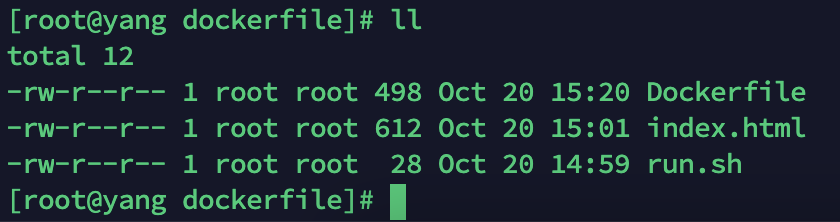

# 一、容器
- 清理停止的容器: `docker container prune`
- 容器错误日志
```java
例：实时查看docker容器名为user-uat的最后10行日志
docker logs -f -t --tail 10 user-uat

例：查看指定时间后的日志，只显示最后100行：
docker logs -f -t --since="2018-02-08" --tail=100 user-uat

例：查看最近30分钟的日志:
docker logs --since 30m user-uat

例：查看某时间之后的日志：
docker logs -t --since="2018-02-08T13:23:37" user-uat

例：查看某时间段日志：
docker logs -t --since="2018-02-08T13:23:37" --until "2018-02-09T12:23:37" user-uat

例：将错误日志写入文件：
docker logs -f -t --since="2018-02-18" user-uat | grep error >> logs_error.txt

```
# 二、docker基础
## 2.1、一个web应用

- 使用 docker inspect 来查看 Docker 的底层信息。它会返回一个 JSON 文件记录着 Docker 容器的配置和状态信息
docker底层信息Json串
```json
[
  {
    "Id": "7ffab71229acf64fc1174f0699a4ef0432ab871b4a89610f19fda460d5405845",
    "Created": "2022-10-18T06:13:44.595238345Z",
    "Path": "python",
    "Args": [
      "app.py"
    ],
    "State": {
      "Status": "running",
      "Running": true,
      "Paused": false,
      "Restarting": false,
      "OOMKilled": false,
      "Dead": false,
      "Pid": 16049,
      "ExitCode": 0,
      "Error": "",
      "StartedAt": "2022-10-18T06:13:44.799141139Z",
      "FinishedAt": "0001-01-01T00:00:00Z"
    },
    "Image": "sha256:6fae60ef344644649a39240b94d73b8ba9c67f898ede85cf8e947a887b3e6557",
    "ResolvConfPath": "/var/lib/docker/containers/7ffab71229acf64fc1174f0699a4ef0432ab871b4a89610f19fda460d5405845/resolv.conf",
    "HostnamePath": "/var/lib/docker/containers/7ffab71229acf64fc1174f0699a4ef0432ab871b4a89610f19fda460d5405845/hostname",
    "HostsPath": "/var/lib/docker/containers/7ffab71229acf64fc1174f0699a4ef0432ab871b4a89610f19fda460d5405845/hosts",
    "LogPath": "",
    "Name": "/determined_darwin",
    "RestartCount": 0,
    "Driver": "overlay2",
    "MountLabel": "",
    "ProcessLabel": "",
    "AppArmorProfile": "",
    "ExecIDs": null,
    "HostConfig": {
      "Binds": null,
      "ContainerIDFile": "",
      "LogConfig": {
        "Type": "journald",
        "Config": {}
      },
      "NetworkMode": "default",
      "PortBindings": {
        "5000/tcp": [
          {
            "HostIp": "",
            "HostPort": "5001"
          }
        ]
      },
      "RestartPolicy": {
        "Name": "no",
        "MaximumRetryCount": 0
      },
      "AutoRemove": false,
      "VolumeDriver": "",
      "VolumesFrom": null,
      "CapAdd": null,
      "CapDrop": null,
      "Dns": [],
      "DnsOptions": [],
      "DnsSearch": [],
      "ExtraHosts": null,
      "GroupAdd": null,
      "IpcMode": "",
      "Cgroup": "",
      "Links": null,
      "OomScoreAdj": 0,
      "PidMode": "",
      "Privileged": false,
      "PublishAllPorts": false,
      "ReadonlyRootfs": false,
      "SecurityOpt": null,
      "UTSMode": "",
      "UsernsMode": "",
      "ShmSize": 67108864,
      "Runtime": "docker-runc",
      "ConsoleSize": [
        0,
        0
      ],
      "Isolation": "",
      "CpuShares": 0,
      "Memory": 0,
      "NanoCpus": 0,
      "CgroupParent": "",
      "BlkioWeight": 0,
      "BlkioWeightDevice": null,
      "BlkioDeviceReadBps": null,
      "BlkioDeviceWriteBps": null,
      "BlkioDeviceReadIOps": null,
      "BlkioDeviceWriteIOps": null,
      "CpuPeriod": 0,
      "CpuQuota": 0,
      "CpuRealtimePeriod": 0,
      "CpuRealtimeRuntime": 0,
      "CpusetCpus": "",
      "CpusetMems": "",
      "Devices": [],
      "DiskQuota": 0,
      "KernelMemory": 0,
      "MemoryReservation": 0,
      "MemorySwap": 0,
      "MemorySwappiness": -1,
      "OomKillDisable": false,
      "PidsLimit": 0,
      "Ulimits": null,
      "CpuCount": 0,
      "CpuPercent": 0,
      "IOMaximumIOps": 0,
      "IOMaximumBandwidth": 0
    },
      "GraphDriver": {
      "Name": "overlay2",
      "Data": {
      "LowerDir": "/var/lib/docker/overlay2/c719b91742384efce7d2ee8cb8f8ab2fa5bf4cc8d8b693e15e234f6717780387-init/diff:/var/lib/docker/overlay2/8e61be56950fb288dda35dad1a7e1e3aea32b8f44a6d05f9e0523c29e48944d0/diff:/var/lib/docker/overlay2/54f0c4ccb841cbd74564b681e9e8d887e0c4a2ebe814ad69502575e91bfc3298/diff:/var/lib/docker/overlay2/73cfb4f856cf251ce3bc5551176002c3d8f10072251b510f4e150157b5add911/diff:/var/lib/docker/overlay2/ea77e0c8dbe191a7e40674689292a9accca74523016dcf3c3b4227ce9eb58198/diff:/var/lib/docker/overlay2/1d1a0cb4f0881e1af7a35b549c8eec0b097c1fb50759a6d25c203a770cfa5594/diff:/var/lib/docker/overlay2/29453061b7d793f1734e70232052024a7ee32a9564b0508af78ab5201b259e08/diff:/var/lib/docker/overlay2/0f6b00b78ff0d672ff210c34393aaf7ea2e592e6cc6da12ad10733b147b9cd0b/diff:/var/lib/docker/overlay2/8e37db20e31e0732d3f0ffd3a827bc8ad165b925175b9965845eafd9ba447c14/diff:/var/lib/docker/overlay2/184e1257d982eff094e1b2badb9335635de4d2b53ea3a15c1059b98b1972eb3d/diff:/var/lib/docker/overlay2/31e2e813af7636e45bc21fa1907f2516b9604252fc569dc1937724a4547dcace/diff:/var/lib/docker/overlay2/98352acc28350a594a15ce857b48c886374b9b5e9c1af8bd3b821e77171bb010/diff:/var/lib/docker/overlay2/26df7de47790fb0818a792aea30b93f54a2a17c38420c02b4dfb417d787d5835/diff:/var/lib/docker/overlay2/228f408ae13f5fba75fd7e4f76056af5ce6484cb89532ec6e8ce17c3bb2c1ffc/diff",
      "MergedDir": "/var/lib/docker/overlay2/c719b91742384efce7d2ee8cb8f8ab2fa5bf4cc8d8b693e15e234f6717780387/merged",
      "UpperDir": "/var/lib/docker/overlay2/c719b91742384efce7d2ee8cb8f8ab2fa5bf4cc8d8b693e15e234f6717780387/diff",
      "WorkDir": "/var/lib/docker/overlay2/c719b91742384efce7d2ee8cb8f8ab2fa5bf4cc8d8b693e15e234f6717780387/work"
    }
    },
      "Mounts": [],
      "Config": {
      "Hostname": "7ffab71229ac",
      "Domainname": "",
      "User": "",
      "AttachStdin": false,
      "AttachStdout": false,
      "AttachStderr": false,
      "ExposedPorts": {
      "5000/tcp": {}
    },
      "Tty": false,
      "OpenStdin": false,
      "StdinOnce": false,
      "Env": [
      "PATH=/usr/local/sbin:/usr/local/bin:/usr/sbin:/usr/bin:/sbin:/bin"
      ],
      "Cmd": [
      "python",
      "app.py"
      ],
      "Image": "training/webapp",
      "Volumes": null,
      "WorkingDir": "/opt/webapp",
      "Entrypoint": null,
      "OnBuild": null,
      "Labels": {}
    },
      "NetworkSettings": {
      "Bridge": "",
      "SandboxID": "92420642df3f4dc4c638e1b33928df7a4c23ccc70eb6a1130929a2b8b1f7398d",
      "HairpinMode": false,
      "LinkLocalIPv6Address": "",
      "LinkLocalIPv6PrefixLen": 0,
      "Ports": {
      "5000/tcp": [
      {
      "HostIp": "0.0.0.0",
      "HostPort": "5001"
    }
      ]
    },
      "SandboxKey": "/var/run/docker/netns/92420642df3f",
      "SecondaryIPAddresses": null,
      "SecondaryIPv6Addresses": null,
      "EndpointID": "cc634478cd8737a7fc5259d5ecd35da89d028f099b29af25caeac00ca8603259",
      "Gateway": "172.17.0.1",
      "GlobalIPv6Address": "",
      "GlobalIPv6PrefixLen": 0,
      "IPAddress": "172.17.0.3",
      "IPPrefixLen": 16,
      "IPv6Gateway": "",
      "MacAddress": "02:42:ac:11:00:03",
      "Networks": {
      "bridge": {
      "IPAMConfig": null,
      "Links": null,
      "Aliases": null,
      "NetworkID": "871cd74edc68bc3a6c71dc3de973f6a0f9e6f444ed2231e04a5ea6d74de913b6",
      "EndpointID": "cc634478cd8737a7fc5259d5ecd35da89d028f099b29af25caeac00ca8603259",
      "Gateway": "172.17.0.1",
      "IPAddress": "172.17.0.3",
      "IPPrefixLen": 16,
      "IPv6Gateway": "",
      "GlobalIPv6Address": "",
      "GlobalIPv6PrefixLen": 0,
      "MacAddress": "02:42:ac:11:00:03"
    }
    }
    }
    }
```

- 与其它容器（DB容器）互联
   - 与数据库容器互联
      - docker run -d --name db training/postgres（运行一个数据库 名字为db）
      - docker run -d -p 5001:5000 --name web --link db:db training/webapp python app.py（db 容器和 web 容器建立互联关系）
      - --link 参数的格式为 --link name:alias，其中 name 是要链接的容器的名称，alias 是这个连接的别名。
> - Docker 在两个互联的容器之间创建了一个安全隧道，而且不用映射它们的端口到宿主主机上。在启动 db 容器的时候并没有使用 -p 和 -P 标记，从而避免了暴露数据库端口到外部网络上。
```


## 2.2、数据卷和数据管理
数据卷(Data Volume)是一个可供一个或多个容器使用的特殊目录，它绕过 UFS，可以提供很多有用的特性：

- 数据卷可以在容器之间共享和重用
- 对数据卷的修改会立马生效
- 对数据卷的更新，不会影响镜像
- 卷会一直存在，直到没有容器使用
### 2.2.1、建一个数据卷
> 在用 docker run 命令的时候，使用 -v 标记来创建一个数据卷并挂载到容器里。在一次 run 中多次使用可以挂载多个数据卷。

下面创建一个 web 容器，并加载一个数据卷到容器的 /webapp3 目录。
```shell
[root@yang data]# docker run -d -p 5001:5000 --name web -v /opt/docker/data:/opt/webapp3 training/postgres 
5374b215ef017b4c256f48dc2228aa726046cb7179067518e3e67e999668ab37
```
我们看下容器内部是否生成/webapp3目录
```shell
[root@yang test]# docker exec -it 5374b215ef01 /bin/bash
root@5374b215ef01:/# cd opt/        
root@5374b215ef01:/opt# ls
webapp3
root@5374b215ef01:/opt# 
```
*注意：也可以在 Dockerfile 中使用 VOLUME 来添加一个或者多个新的卷到由该镜像创建的任意容器。
#### 挂载一个主机目录作为数据卷
> 使用 -v 标记也可以指定挂载一个本地主机的目录到容器中去。

```shell
[root@yang data]# docker run -d -p 5001:5000 --name web -v /opt/docker/data:/opt/webapp3 training/postgres 
5374b215ef017b4c256f48dc2228aa726046cb7179067518e3e67e999668ab37
```
上面的命令加载主机的 /opt/docker/data 目录到容器的 /opt/webapp3 目录。**本地目录的路径必须是绝对路径，如果目录不存在 Docker 会自动为你创建它**。
> *注意：Dockerfile 显然是不支持这种用法，这是因为 Dockerfile 是为了移植和分享用的, 因为不同操作系统的路径格式不一样，所以目前还不能支持。

我们删除容器，主机上数据是不会被删除的
## 2.3、镜像的导入导出
[使用Docker将容器打成镜像的方法步骤_docker_脚本之家](https://www.jb51.net/article/249787.htm)
## 2.4、Dockerfile部署nginx

- 在同一个文件夹中需要有这三个东西
   - Dockerfile、index.html、run.sh



- Dockerfile
```java
# 设置基础镜像
FROM centos:centos7.5.1804
# 作者信息
MAINTAINER SoftLeaderGy DU<826044698@qq.com>
# 安装第三方yum源
RUN yum -y install epel-release
#更新
RUN yum makecache
# 安装
RUN yum -y install wget net-tools
RUN yum -y install nginx
# 暴露80、443端口
EXPOSE 80
EXPOSE 443
RUN echo "daemon off;">>/etc/nginx/nginx.conf
# 切换工作目录
WORKDIR /root/nginx/
ADD index.html /usr/share/nginx/html/index.html
ADD run.sh /run.sh
RUN chmod 755 /run.sh
CMD ["/run.sh"]
```

- run.sh
```java
#!/bin/bash
/usr/sbin/nginx
```

- index.html
- 在当前目录下执行`docker build -t nginx:new .` 进行打包构建
- `docker imanges` 查看镜像即可
- 启动镜像
```shell
docker run --name nginxd -p 80:80 -p 443:443 -v /opt/docker/server/nginx/conf.d/:/etc/nginx/conf.d -v /opt/docker/server/nginx/html/:/usr/share/nginx/html -v /opt/docker/server/nginx/log/:/var/log/nginx -d --restart always nginx:new
```

- 导出镜像
```shell
docker save -o nginx:new.tar nginx:new
```

- 导入镜像
```shell
docker load -i nginx:new.tar
```
## 2.5、docker安装部署es
```shell
sudo docker run --name elasticsearch -p 9200:9200  -p 9300:9300 \
-e "discovery.type=single-node" \
-e ES_JAVA_OPTS="-Xms84m -Xmx512m" \
-v /opt/docker/server/elasticsearch/config/elasticsearch.yml:/usr/share/elasticsearch/config/elasticsearch.yml \
-v /opt/docker/server/elasticsearch/data:/usr/share/elasticsearch/data \
-v /opt/docker/server/elasticsearch/plugins:/usr/share/elasticsearch/plugins \
-d elasticsearch:7.12.0
```
## 2.6、docker安装基础命令-vi、ping

- Docker：bash: vi: command not found
```java
操作步鄹：
1、apt-get update
2、apt-get install vim
```

- 如果是：bash:ping: command not found
```java
apt-get install iputils-ping
```
