# jvm总结图解
[JVM图解](https://softleadergy.gitee.io/JVM%E7%AF%87/JVM%E5%9B%BE%E8%A7%A3/JVM%E5%9B%BE%E8%A7%A3.html)
# jvm探究

- 谈谈你对jvm的理解？java8 与之前的版本有什么不同
- 什么是oom？ 什么是栈溢出
- JVM常用调优参数有哪些
- 内存快照如何抓取，怎么分析Dump文件
- 谈谈JVM中类加载器的认识


# 一、jvm的位置
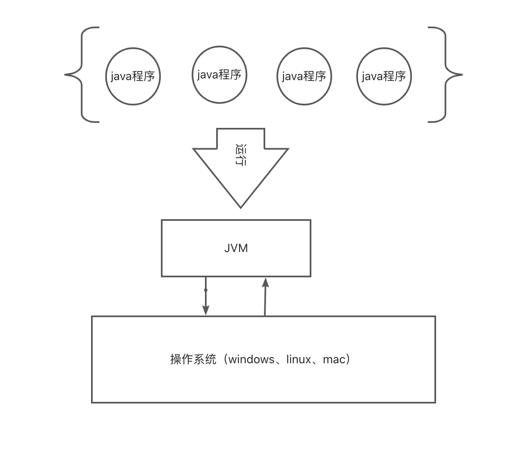
# 二、jvm的体系结构
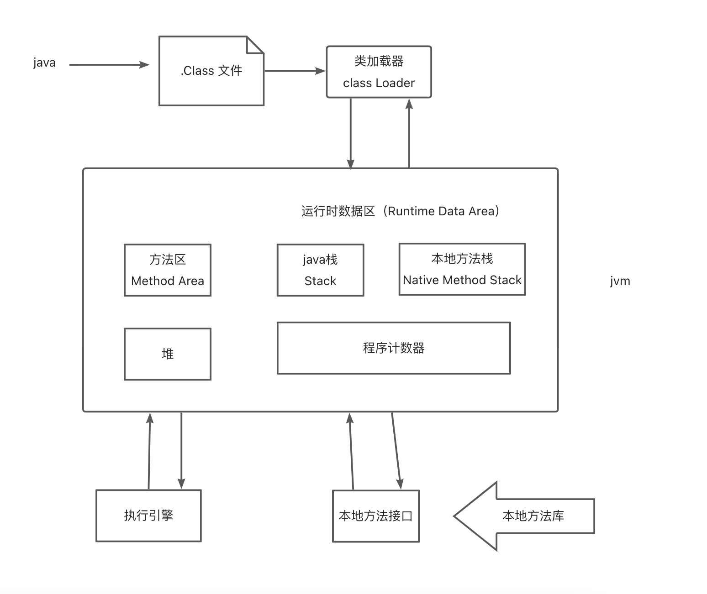
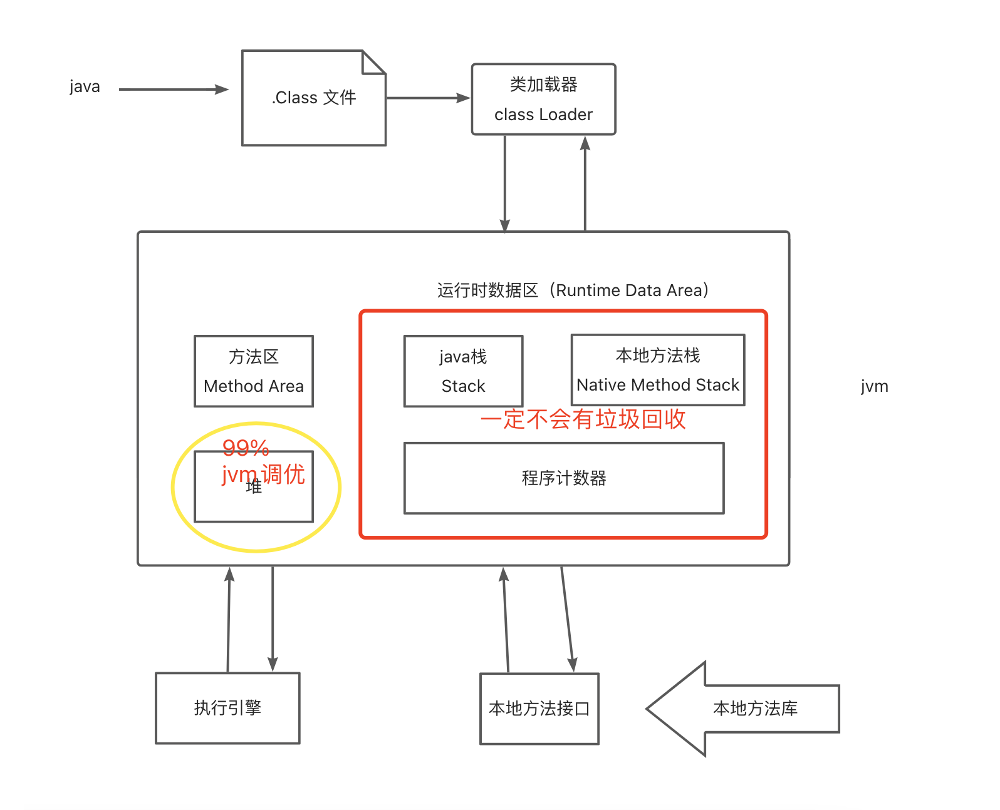
# 三、类加载器

- 作用：加载一个Class文件
- jvm架构图
   - 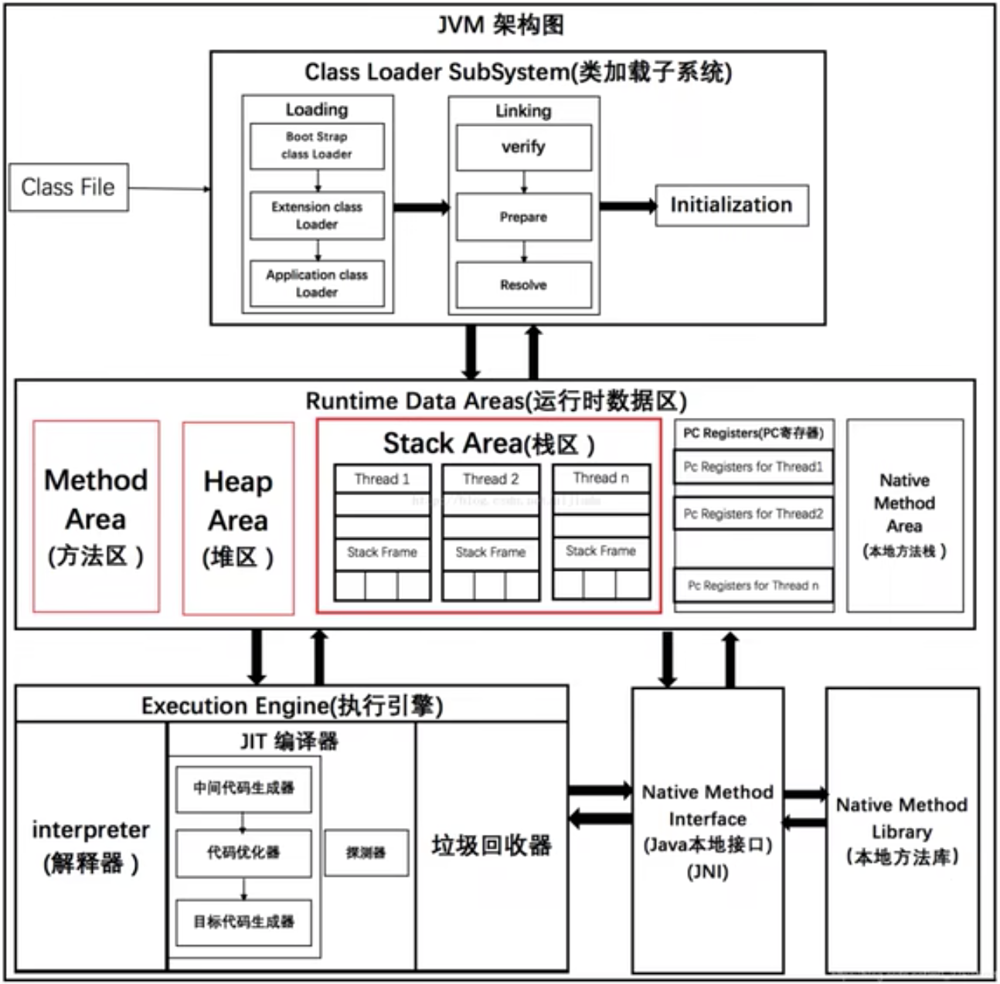
- 类加载过程
   - 
- 加载器
   1. 虚拟机自带的加载器
   2. 启动类（根）加载器（Boot）
   3. 扩展类加载器 （ExtClassLoader）
   4. 应用程序（系统类）加载器（AppClassLoader）
```java
/**
* @Description:
* @Author: Guo.Yang
* @Date: 2022/10/27/23:44
*/
public class Car {
    public int age;

    public static void main(String[] args) {
        Car car1 = new Car();
        Car car2 = new Car();
        Car car3 = new Car();

        Class<? extends Car> aClass = car1.getClass();

        ClassLoader classLoader = aClass.getClassLoader();
        ClassLoader parent = classLoader.getParent();
        ClassLoader parent1 = parent.getParent();

        System.out.println(classLoader); // sun.misc.Launcher$AppClassLoader@18b4aac2  应用程序加载器
        System.out.println(parent); // sun.misc.Launcher$ExtClassLoader@29453f44 扩展类加载器
        System.out.println(parent1); // null java获取不到 启动类加载器
    }
}

```
# 四、双亲委派机制

- 双亲委派机制
   - AppClassLoader -> ExtClassLoader -> Boot （不管有没有都会一直向上找对应的类）、
   - 如果在boot加载器中找到了的话 就直接执行boot中的类
   - 如果在boot加载器中没找到的话 在从boot -> ExtClassLoader -> AppClassLoader  循序往回找 直到找到后，执行
   - 如果返回的时候还是没找到的话 会报异常 ClassNotFind～
- 实例
   - 如果模仿jdk中的包在 java.lang下建一个String类，并重写了toSting方法后 在调用String类的toString方法去执行就会发现问题
```java
package java.lang;

/**
 * @Description:
 * @Author: Guo.Yang
 * @Date: 2022/10/27/23:52
 */
public class String {
    // 双亲委派机制
    // 1、AppClassLoader -> ExtClassLoader -> Boot （不管有没有都会一直向上找对应的类）
    // 如果在boot加载器中找到了的话 就直接执行boot中的类
    // 如果在boot加载器中没找到的话 在从boot -> ExtClassLoader -> AppClassLoader  循序往回找 直到找到后，执行
    // 如果返回的时候还是没找到的话 会报异常 ClassNotFind～
    @Override
    public String toString(){
        return "hello";
    }

    public static void main(String[] args) {
        String s = new String();
        System.out.println(s.toString());
    }
}
// 报错
错误: 在类 java.lang.String 中找不到 main 方法, 请将 main 方法定义为:
   public static void main(String[] args)
否则 JavaFX 应用程序类必须扩展javafx.application.Application
```

1. 沙箱安全机制
2. native：调用的方法java已经不能够完成了，去调用了底层的本地方法区，也就是底层的方法
3. pc寄存器：线程之所以有1、2、3、4、5....   就是因为有寄存器
4. 方法区：里边只有：static修饰的、final修饰的、Class、常量池


# 五、栈
> 栈是一种数据结构
> 程序 = 数据结构 + 框架

- 栈：先进后出、后进先出
- 队列：先进先出
> 喝多了吐就是栈，吃多了拉就是队列

- 栈：
   - 栈内存，主管程序的运行，生命周期和线程同步，
   - 线程结束，栈内存也就会释放，
   - 对于栈来说，不存在垃圾回收问题  一旦线程结束，栈就Over
   - 栈里边放：8大基本数据类型、对象引用、实例方法
- 运行原理：栈针
- 栈满了就会 ：StackOverflowError 是个错误 就会让jvm停下里

# 六、三种jvm
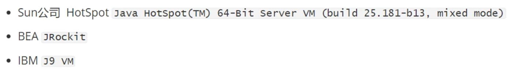
# 七、堆 Heap
> Heap，一个jvm 只有一个堆内存，堆内存的大小是可以调节的

-  堆内存中还要细分为三个区域
   - 新生区
   - 老年区
   - 永久区

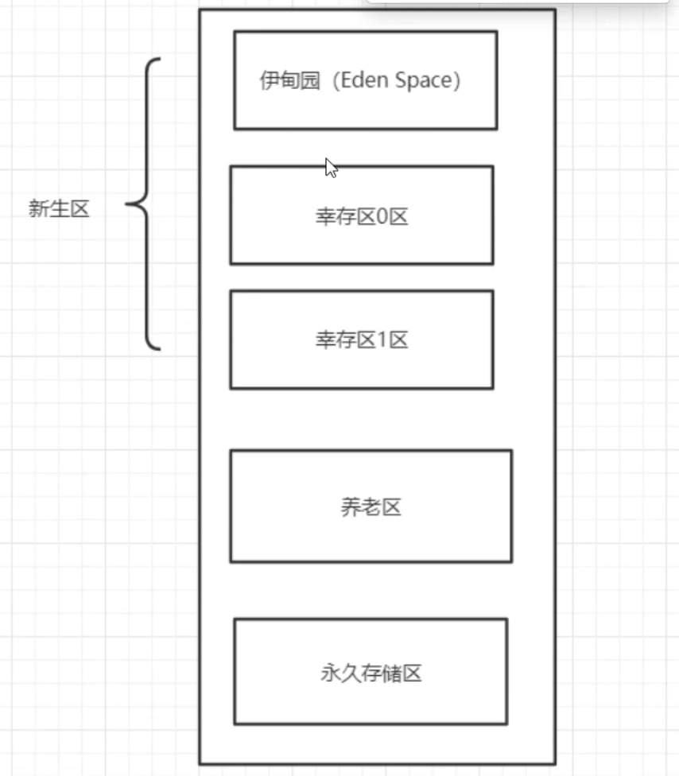

- GC垃圾回收，主要在伊甸园区（新生区）和老年区
- 堆内存满了 就会发生 OOM 堆内存不够了 java.lang.OutOfMemoryError: Java heap space
- 在JDK8以后，永久存储区改了个名字，叫“元空间”
## 7.1、新生代、老年代
> 经过研究，99%的对象都是临时对象

## 7.1.1、新生代
> 新生代里边可分为：伊甸园区、幸存区0区、幸存区1区

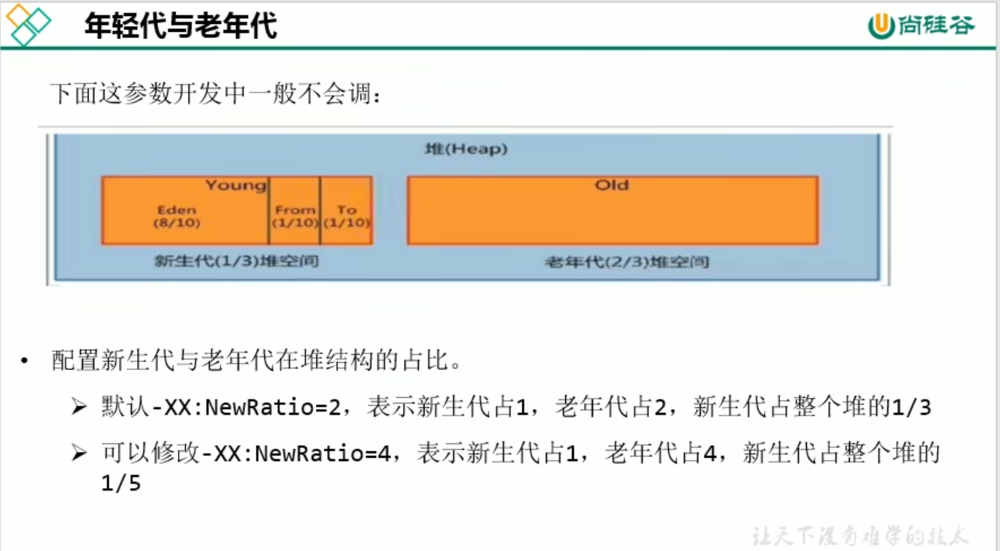
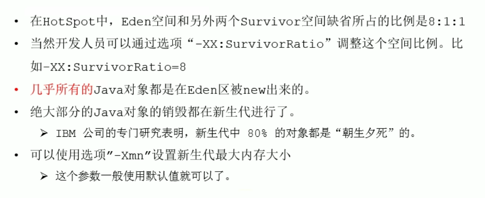

- 类诞生 和成长的地方，甚至是死亡
- 伊甸园区：所有的对象都是在伊甸园区new出来的
- 幸存区：（0，1）在伊甸园区轻GC没有被干掉的对象就会到 幸存区

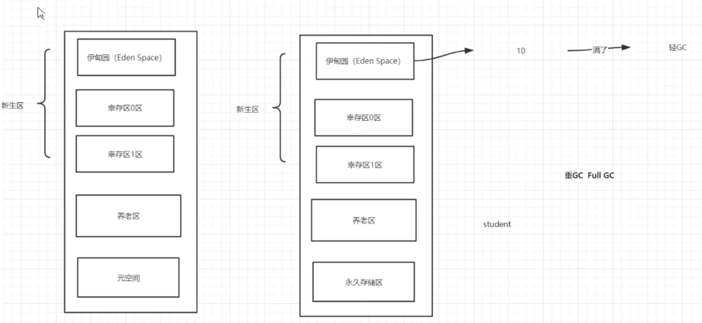
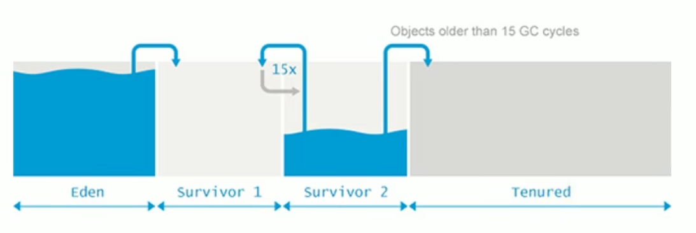
## 7.1.2、老年代
## 7.1.3永久区
这个区域是常驻内存的，用来存放JDK自身携带的Class对象。Interface元数据，存储的是java运行时的一些环境或类信息～，这个区域不存在垃圾回收！关闭VM虚拟机就会释放这个区域的内存
> OOM的情况
> 1. 一个启动类，加载了大量的第三方jar包，
> 2. Tomcat部署了太多的应用
> 3. 大量的动态的反射类不断的被加载，直到内存满，就会出现OOM

- jdk1.6之前：永久代 ，常量池是在方法区；
- jdk1.7 ： 永久代，但是慢慢的退化了，`区永久代`，常量池在堆中
- jdk1.8之后：无永久代，常量池在原空间

堆的模型图
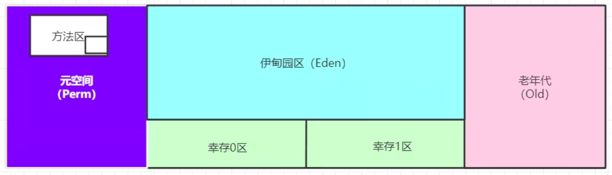
虚拟机的内存占用情况
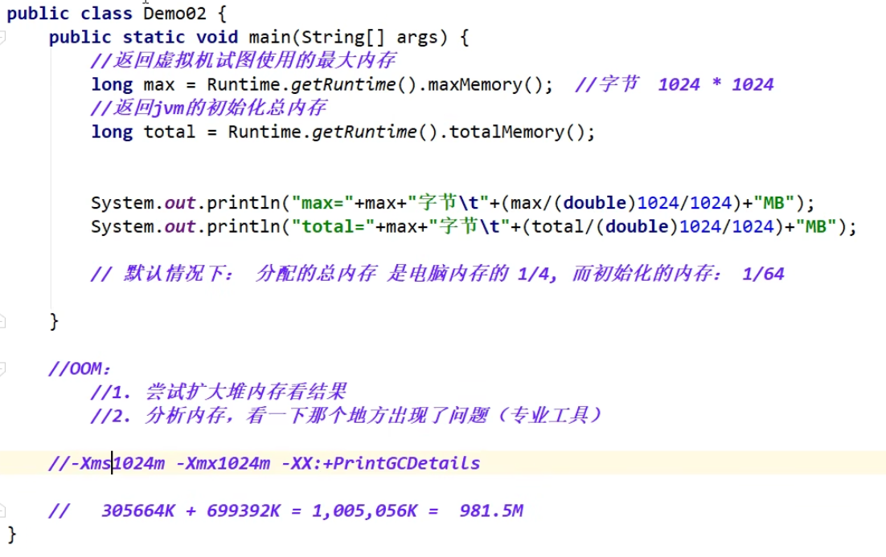

- 测试
   - 代码
```json
public class JvmTest {
    public static void main(String[] args) {
        String str = "hello world";
        while (true)
            str += str + new Random().nextInt(88888888) + new Random().nextInt(88888888);
    }
}
```

   - 启动时添加jvm参数 `-Xms8m -Xmx8m -XX:+PrintGCDetails`
   - 打印结果 （GC过程以及OOM错误） 
```json
[GC (Allocation Failure) [PSYoungGen: 1536K->512K(2048K)] 1536K->667K(7680K), 0.0013803 secs] [Times: user=0.01 sys=0.01, real=0.00 secs] 
[GC (Allocation Failure) [PSYoungGen: 2048K->512K(2048K)] 2203K->845K(7680K), 0.0013051 secs] [Times: user=0.00 sys=0.00, real=0.00 secs] 
[GC (Allocation Failure) [PSYoungGen: 2007K->512K(2048K)] 2340K->1240K(7680K), 0.0020866 secs] [Times: user=0.01 sys=0.00, real=0.00 secs] 
[GC (Allocation Failure) [PSYoungGen: 1868K->512K(2048K)] 3459K->2351K(7680K), 0.0006873 secs] [Times: user=0.00 sys=0.00, real=0.00 secs] 
[Full GC (Ergonomics) [PSYoungGen: 1419K->0K(2048K)] [ParOldGen: 5291K->1423K(5632K)] 6711K->1423K(7680K), [Metaspace: 3347K->3347K(1056768K)], 0.0034816 secs] [Times: user=0.00 sys=0.00, real=0.00 secs] 
[GC (Allocation Failure) [PSYoungGen: 923K->0K(2048K)] 4072K->3149K(7680K), 0.0003901 secs] [Times: user=0.00 sys=0.00, real=0.00 secs] 
[GC (Allocation Failure) [PSYoungGen: 0K->0K(2048K)] 3149K->3149K(7680K), 0.0004963 secs] [Times: user=0.00 sys=0.00, real=0.00 secs] 
[Full GC (Allocation Failure) [PSYoungGen: 0K->0K(2048K)] [ParOldGen: 3149K->3146K(5632K)] 3149K->3146K(7680K), [Metaspace: 3347K->3347K(1056768K)], 0.0033730 secs] [Times: user=0.01 sys=0.00, real=0.01 secs] 
[GC (Allocation Failure) [PSYoungGen: 0K->0K(2048K)] 3146K->3146K(7680K), 0.0003357 secs] [Times: user=0.00 sys=0.00, real=0.00 secs] 
[Full GC (Allocation Failure) [PSYoungGen: 0K->0K(2048K)] [ParOldGen: 3146K->3127K(5632K)] 3146K->3127K(7680K), [Metaspace: 3347K->3347K(1056768K)], 0.0033696 secs] [Times: user=0.01 sys=0.01, real=0.00 secs] 
Heap
 PSYoungGen      total 2048K, used 57K [0x00000007bfd80000, 0x00000007c0000000, 0x00000007c0000000)
  eden space 1536K, 3% used [0x00000007bfd80000,0x00000007bfd8e4a8,0x00000007bff00000)
  from space 512K, 0% used [0x00000007bff00000,0x00000007bff00000,0x00000007bff80000)
  to   space 512K, 0% used [0x00000007bff80000,0x00000007bff80000,0x00000007c0000000)
 ParOldGen       total 5632K, used 3127K [0x00000007bf800000, 0x00000007bfd80000, 0x00000007bfd80000)
  object space 5632K, 55% used [0x00000007bf800000,0x00000007bfb0de20,0x00000007bfd80000)
 Metaspace       used 3389K, capacity 4496K, committed 4864K, reserved 1056768K
  class space    used 369K, capacity 388K, committed 512K, reserved 1048576K
Exception in thread "main" java.lang.OutOfMemoryError: Java heap space
	at java.util.Arrays.copyOf(Arrays.java:3332)
	at java.lang.AbstractStringBuilder.ensureCapacityInternal(AbstractStringBuilder.java:124)
	at java.lang.AbstractStringBuilder.append(AbstractStringBuilder.java:674)
	at java.lang.StringBuilder.append(StringBuilder.java:213)
	at com.yang.thingtest.JvmTest.main(JvmTest.java:14)

Process finished with exit code 1

```
## 7.1.4、jvm相关参数说明

- -Xms   设置初始化堆内存大小 默认1/64
- -Xms   设置最大分配内存 ，默认1/4
- -XX:+HeapDumpOnOutofMemoryError    当jvm发生OutofMemoryError 时会去下载一个dump文件，可以根据这个文件去分析是什么地方发生了错误
# 八、GC 垃圾回收
 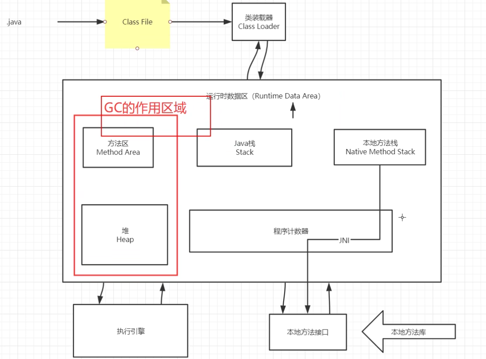
jvm在进行GC是，并不是对这三个区域统一回收。大部分时候，回收都是新生代
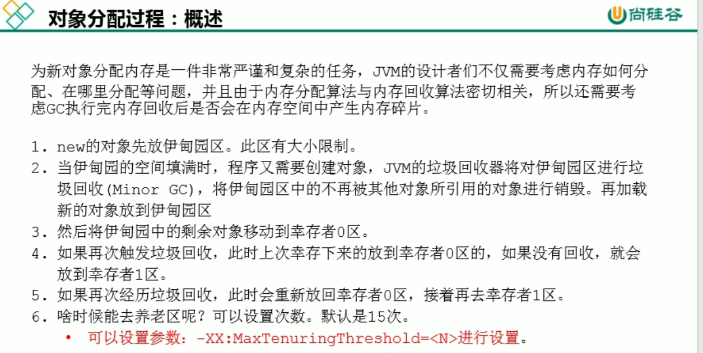

- 新生代
- 幸存区
- 老年代

GC的两个种类：轻GC（普通的GC）、重GC（全局GC）

- 总结

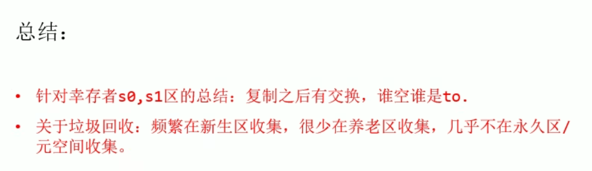
## 8.1、GC题目

- jvm的内存模型和分区～ 详细到每个区放什么？
- 堆里边的分区有哪些？Eden、from、to、老年区，说说他们的特点
- GC的算法有哪些？
- 轻GC 和重GC分别在什么时候发生？

  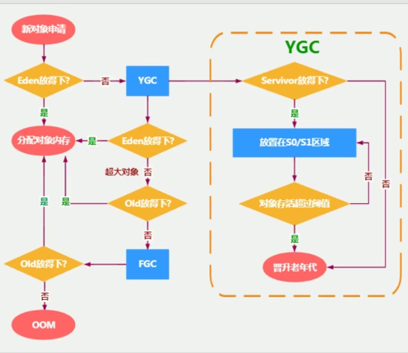
## 8.2、GC的算法
### 8.2.1、GC之复制算法
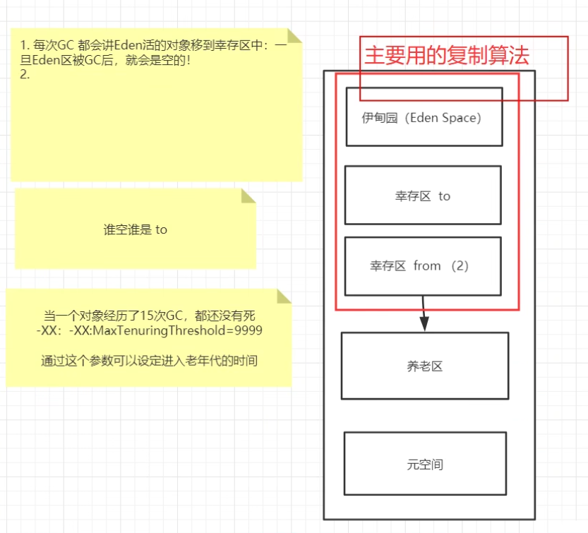
GC的过程
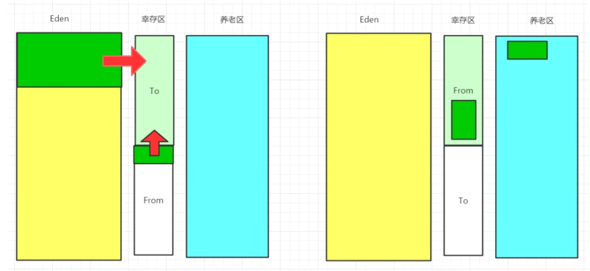

- 好处：没有内存的碎片～
- 坏处：浪费了内存空间～；多了一半空间永远是空的（to区），假设对象100%存活（极端情况下，这种算法是不可取的）
- 复制算法的最佳使用场景：对象存活度较低的时候：新生区
### 8.2.2、GC之标记算法
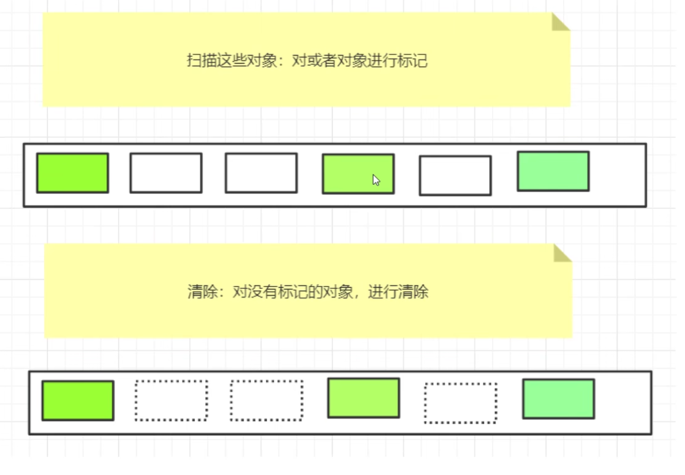

- 优点：不需要额外的空间
- 缺点：两次扫描，严重浪费时间，会产生内存碎片
### 8.2.3、标记压缩
标记算法的在优化
> 没有最优的解决方案，永远都只是时间和空间的权衡，而现在因为不缺标记，所以都是优化复制算法

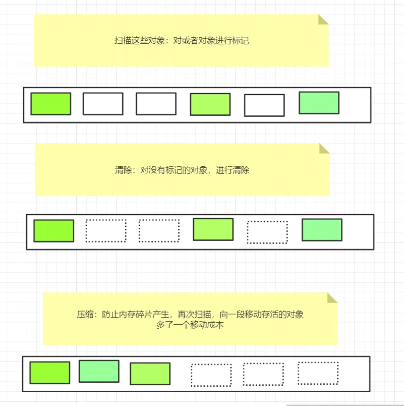
## 8.3、总结

- 内存效率：复制算法 > 标记清除算法 > 标记压缩算法（时间复杂度）
- 内存整齐度：复制算法 = 标记压缩算法 > 标记清除算法
- 内存利用率：标记压缩算法 > 标记清除算法 > 复制算法
> 没有最好的算法，只有最合适的算法 -----> GC:分代收集算法

- 年轻代
   - 存活率低
   - 复制算法
- 老年代
   - 区域大：存活率
   - 标记清除（内存碎片不是太多）+ 标记压缩混合实现
# 九、JMM

1. 什么是JMM？
   1. JMM（Java Memory Model得缩写）java内存模型
2. 他是干嘛的？
   1. 作用：缓存一致性协议，用于定义数据读写的规则

