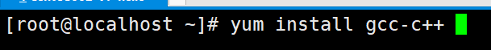
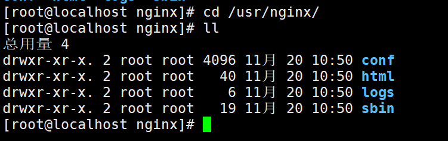
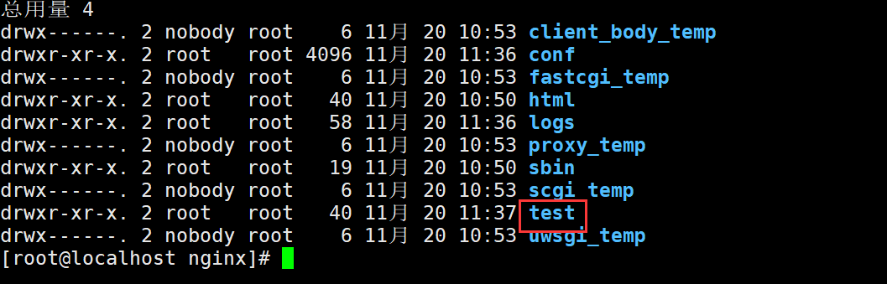
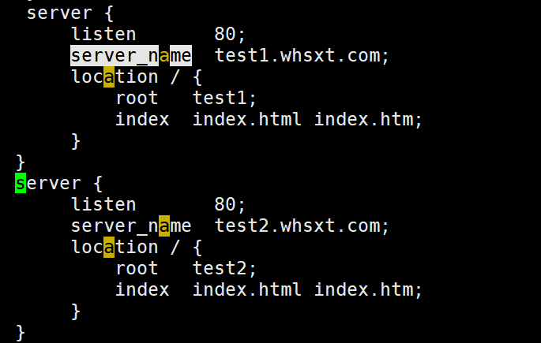
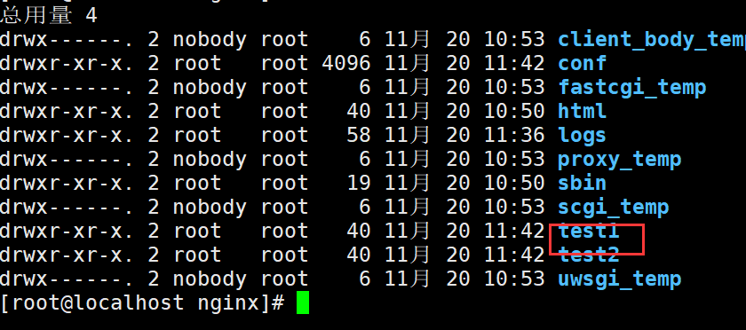
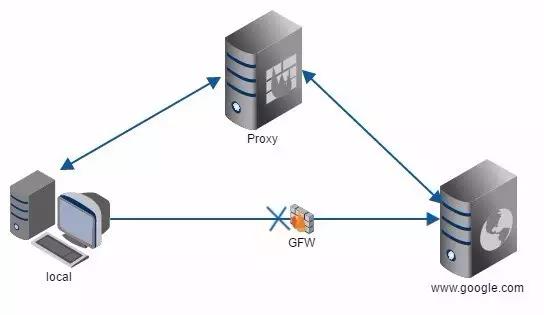
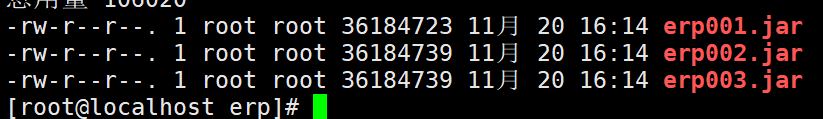
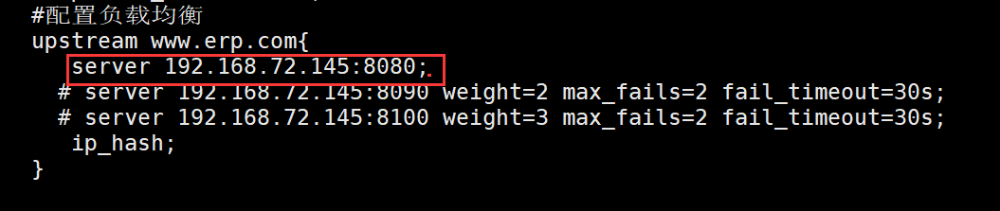

# 01【熟悉】实际开发中的问题？
现在我们一个项目跑在一个tomcat里面

当一个tomcat无法支持高的并发量时。可以使用多个tomcat

那么这多个tomcat如何云分配请求
		|-nginx

# 02【熟悉】服务器概述
## 1，目前常见的web服务器
1，Apache([http://httpd.apache.org)](http://httpd.apache.org))
    它是世界上用的最多的web服务器，市场占有率达60%左右，模块非常丰富，系统非常稳定，可移植性好，但是比较消耗资源
2，lighttpd([http://www.lighttpd.net)](http://www.lighttpd.net))
    它是德国人开发的一个开源软件，目标是提供一个高性能的网站，它具有内存开销低，cpu占用低，效能好及模块丰富，Nginx的重要竞争对手之一
3，tomcat([http://tomcat.apache.org)](http://tomcat.apache.org))
    是一个开源的软件，运行servlet+jsp web应用软件，对静态文件，高并发的处理能力弱。
4，IBM websphere
    它功能完善，开放的Web应用程序服务器，是IBM电子商务计划的核心部分，它是基于java的应用环境，范围从简单到高级到企业级应用，相于对其它web服务器来说应该比较少
5，Microsoft IIS
     Microsoft的web服务器产品为Internet information Server (IIS)  IIS提供了图形界面管理工具，IIS是一种web服务器组件，其中有 web服务器，FTP服务器，nntp服务器，smtp服务器，因为有window2008和2012的支持，所以IIS也有一定的市场
## 2，各web服务器占有率
查询网站
[https://news.netcraft.com/archives/2017/10/26/october-2017-web-server-survey-13.html](https://news.netcraft.com/archives/2017/10/26/october-2017-web-server-survey-13.html)

# 03【熟悉】Nginx概述
## 1、前言
      为毛要用nginx服务器代理，不直接用tomcat 7.0，还做多了一次接请求？
      这个是我想问的，公司的新项目是要用Nginx+tomcat7+jdk开发的，用户命名可以直接访问tomcat，为啥还要用Nginx？这货是个啥玩意？

## 2、为什么使用Nginx？
      在传统的Web项目中，并发量小，用户使用的少。所以在低并发的情况下，用户可以直接访问tomcat服务器，然后tomcat服务器返回消息给用户。比如，我们上传图片：

当然我们知道，为了解决并发，可以使用负载均衡：也就是我们多增加几个tomcat服务器。当用户访问的时候，请求可以提交到空闲的tomcat服务器上。

 但是这种情况下可能会有一种这样的问题：上传图片操作。我们把图片上传到了tomcat1上了，当我们要访问这个图片的时候，tomcat1正好在工作，所以访问的请求就交给其他的tomcat操作，而tomcat之间的数据没有进行同步，所以就发生了我们要请求的图片找不到。
      为了解决这种情况，我们就想出了分布式。我们专门建立一个图片服务器，用来存储图片。这样当我们都把图片上传的时候，不管是哪个服务器接收到图片，都把图片上传到图片服务器。
      图片服务器上需要安装一个http服务器，可以使用tomcat、apache、nginx。

 看到这里大家可能会问，既然我们要选择的是http服务器，为什么不继续使用tomcat，而要使用Nginx？
      原因如下：nginx常用做静态内容服务和代理服务器（不是你FQ那个代理），直面外来请求转发给后面的应用服务（tomcat，django什么的），tomcat更多用来做做一个应用容器，让java web app跑在里面的东西，对应同级别的有jboss,jetty等东西。

## 3、什么是Nginx？
      根据前面的对比，我们可以了解到Nginx是一个[http服务器](http://baike.baidu.com/link?url=a2dLY11NbWgcCzbX1s7JDyWLOh_QFjVlC2wys--TLKbZybTCA8oEP7c-5gEDCK35jFmQHG0YFRoAVEI8M7cbFcp74nDVgz1ckZiWAuntvCF_oxMSMDlDIWEGGN-63mTb" \t "_blank)。是一个使用c语言开发的高性能的http服务器及反向代理服务器。Nginx是一款高性能的http 服务器/反向代理服务器及电子邮件（IMAP/POP3）代理服务器。由俄罗斯的程序设计师Igor Sysoev所开发，官方测试nginx能够支支撑5万并发链接，并且cpu、内存等资源消耗却非常低，运行非常稳定。
## 3.1 Nginx的应用场景
      1、 http服务器。Nginx是一个http服务可以独立提供http服务。可以做网页静态服务器。
      2、 虚拟主机。可以实现在一台服务器虚拟出多个网站。例如个人网站使用的虚拟主机。

- 基于端口的，不同的端口
- 基于域名的，不同域名

      3、 反向代理，负载均衡。当网站的访问量达到一定程度后，单台服务器不能满足用户的请求时，需要用多台服务器集群可以使用nginx做反向代理。并且多台服务器可以平均分担负载，不会因为某台服务器负载高宕机而某台服务器闲置的情况。

## 4、小结
      通过了解Nginx也算是多了一门技术，而且还是挺简单的，使用也比较方便。重点是可以给系统带来很大的性能提升。

# 04【掌握】在Centos7系统下安装Nginx
## 1，下载

[http://nginx.org/en/download.html](http://nginx.org/en/download.html)

## 2，安装先安装nginx依赖的包

- gcc

      安装nginx需要先将官网下载的源码进行编译，编译依赖gcc环境，如果没有gcc环境，需要安装gcc

Yum install gcc-c++

- PCRE

   PCRE(Perl Compatible Regular Expressions)是一个Perl库，包括 perl 兼容的正则表达式库。nginx的http模块使用pcre来解析正则表达式，所以需要在linux上安装pcre库。

yum install -y pcre pcre-devel

- zlib

zlib库提供了很多种压缩和解压缩的方式，nginx使用zlib对http包的内容进行gzip，所以需要在linux上安装zlib库。

yum install -y zlib zlib-devel

- openssl

      OpenSSL 是一个强大的安全套接字层密码库，囊括主要的密码算法、常用的密钥和证书封装管理功能及SSL协议，并提供丰富的应用程序供测试或其它目的使用。 
      nginx不仅支持http协议，还支持https（即在ssl协议上传输http），所以需要在linux安装openssl库。

yum install -y openssl openssl-devel

## 3，上传nginx到linux

## 4，解压拷贝
| #把解压nginx-1.16.1.tar.gz包
tar -zxvf nginx-1.16.1.tar.gz
#修改文件夹的名字
mv nginx-1.16.1 nginx
#把nginx拷贝到/usr/local/src里面
cp -r nginx /usr/local/src |
| --- |

## 5，安装
### 进入nginx的目录
cd /usr/local/src/nginx

### 创建nginx的安装目录
mkdir  /usr/nginx

### 运行configure
./configure --prefix=/usr/nginx    (指定安装目录编译)
./configure --prefix=/usr/nginx --with-http_stub_status_module --with-http_ssl_module  --with-http_gzip_static_module 
### make编译
cd /usr/local/src/nginx

make
### make install编译安装
cd /usr/local/src/nginx

make  install

## 6, Nginx的目录说明

conf 配置目录 
html静态文件[cdn加速]
logs日志目录
sbin执行文件

## 7, Nginx的启动、停止
### 启动
cd /usr/nginx/sbin

./nginx   

### 停止

### 刷新[当用户修改了conf/nginx.conf]

./nginx -s reload

# 05【掌握】Nginx基础配置详解
## Conf/nginx.conf

#代表权限  
#user  nobody;
user root;
#工作进程 
worker_processes  1;

#error_log  logs/error.log;
#error_log  logs/error.log  notice;
#error_log  logs/error.log  info;

#pid        logs/nginx.pid;

events {
    worker_connections  1024;
}

#代表网络请求
http {
    #支持的文件类型
    include       mime.types;
	#流
    default_type  application/octet-stream;

    #log_format  main  '$remote_addr - $remote_user [$time_local] "$request" '
    #                  '$status $body_bytes_sent "$http_referer" '
    #                  '"$http_user_agent" "$http_x_forwarded_for"';

    #access_log  logs/access.log  main;

    sendfile        on;
    #tcp_nopush     on;

    #keepalive_timeout  0;
    keepalive_timeout  65;

    #gzip  on;
    #代表服务配置
    server {
        listen       80;   #端口配置
        server_name  localhost;  #服务名

        #charset koi8-r;

        #access_log  logs/host.access.log  main;
		#当用户访问http://ip:80/
        location / {
            root   html;   #当匹配到/这个规则时指向nginx目录里面的/html文件夹
            index  index.html index.htm;   #当访问不指定具体页面时默认显示的页面  类似web.xml的welcomefiles
        }

        #error_page  404              /404.html;

        # redirect server error pages to the static page /50x.html
        #
        error_page   500 502 503 504  /50x.html;
		#当服务器出现500的错时访问的页面
        location = /50x.html {
            root   html;
        }

        # proxy the PHP scripts to Apache listening on 127.0.0.1:80
        #
        #location ~ \\.php$ {
        #    proxy_pass   [http://127.0.0.1;](http://127.0.0.1;)
        #}

        # pass the PHP scripts to FastCGI server listening on 127.0.0.1:9000
        #
        #location ~ \\.php$ {
        #    root           html;
        #    fastcgi_pass   127.0.0.1:9000;
        #    fastcgi_index  index.php;
        #    fastcgi_param  SCRIPT_FILENAME  /scripts$fastcgi_script_name;
        #    include        fastcgi_params;
        #}

        # deny access to .htaccess files, if Apache's document root
        # concurs with nginx's one
        #
        #location ~ /\\.ht {
        #    deny  all;
        #}
    }

    # another virtual host using mix of IP-, name-, and port-based configuration
    #
    #server {
    #    listen       8000;
    #    listen       somename:8080;
    #    server_name  somename  alias  another.alias;

    #    location / {
    #        root   html;
    #        index  index.html index.htm;
    #    }
    #}

    # HTTPS server
    #
    #server {
    #    listen       443 ssl;
    #    server_name  localhost;

    #    ssl_certificate      cert.pem;
    #    ssl_certificate_key  cert.key;

    #    ssl_session_cache    shared:SSL:1m;
    #    ssl_session_timeout  5m;

    #    ssl_ciphers  HIGH:!aNULL:!MD5;
    #    ssl_prefer_server_ciphers  on;

    #    location / {
    #        root   html;
    #        index  index.html index.htm;
    #    }
    #}

} |
| --- |

## 在nginx.conf里面添加一个Server节点

## 在nignx的根目录创建test文件夹

## 通过域名虚拟机
### 修改nginx添加两个server节点

### 在nginx的根目录创建test1 test2

### 修改window的host
C:\Windows\System32\drivers\etc

### 访问测试

# 05【掌握】反向代理+负载均衡
## 1.1.正向代理
拿借钱打个比方，A想向C借钱，但是C不认识A所以不借给他，然后A就通过B向C借钱，B借到钱之后再转交给A，在这个过程中B就扮演了一个正向代理的角色，这个过程中，真正借钱的人是谁，C是不知道的~
我们常说的代理也就是指正向代理，正向代理的过程，它隐藏了真实的请求客户端，服务端不知道真实的客户端是谁，客户端请求的服务都被代理服务器代替来请求，科学上网工具 Shadowsocks 扮演的就是典型的正向代理角色。
比如我想访问www.google.com，要想翻越这堵墙，你可以在国外用Shadowsocks来搭建一台代理服务器，代理帮我们请求www.google.com，代理再把请求响应结果再返回给我。

## 1.2.反向代理
还用借钱的例子，A想向C借钱，然后C借给他了，但是实际上这个钱可能C向B借的~至于钱到底是谁的，A是不知道的~
这里的C扮演着一个反向代理的角色，客户不知道真正提供服务的人是谁。
反向代理隐藏了真实的服务端，当我们访问www.baidu.com的时候，背后可能有成千上万台服务器为我们服务，但具体是哪一台，你不知道，也不需要知道，你只需要知道反向代理服务器是谁就好了。www.baidu.com就是我们的反向代理服务器，反向代理服务器会帮我们把请求转发到提供真实服务的服务器那里去。Nginx就是性能非常好的反向代理服务器，它可以用来做负载均衡。

## 2，负载均衡
网站的访问量越来越大，服务器的服务模式也得进行相应的升级，比如分离出数据库服务器、分离出图片作为单独服务，这些是简单的数据的负载均衡，将压力分散到不同的机器上。有时候来自web前端的压力，也能让人十分头痛。怎样将同一个域名的访问分散到两台或更多的机器上呢？这其实就是另一种负载均衡了，nginx自身就可以做到，只需要做个简单的配置就行。
　　nginx不单可以作为强大的web服务器，也可以作为一个反向代理服务器，而且nginx还可以按照调度规则实现动态、静态页面的分离，可以按照轮询、ip哈希、URL哈希、权重等多种方式对后端服务器做负载均衡，同时还支持后端服务器的健康检查。
Nginx负载均衡一些基础知识：
nginx 的 upstream目前支持 4 种方式的分配 
1)、轮询（默认） 
　　每个请求按时间顺序逐一分配到不同的后端服务器，如果后端服务器down掉，能自动剔除。 
2)、weight 
　　指定轮询几率，weight和访问比率成正比，用于后端服务器性能不均的情况。 
2)、ip_hash 
　　每个请求按访问ip的hash结果分配，这样每个访客固定访问一个后端服务器，可以解决session的问题。  
3)、fair（第三方） 
　　按后端服务器的响应时间来分配请求，响应时间短的优先分配。  
4)、url_hash（第三方）

## 3，反向代理+负载均衡的配置
### 1，架构思想

### ~~2，准备三个tomcat~~
~~#把原来的tomcat改个名这字~~
~~mv apache-tomcat-7.0.90 tomcat1~~
~~#复制两个~~
~~cp -r tomcat1  tomcat2/~~
~~cp -r tomcat1  tomcat3/~~

~~#修改端口号~~
~~tomcat1 8005 8080 8443 8009 8443  保持默认~~
~~tomcat2 8015 8090 8453 8019 8453~~
~~tomcat3 8025 8100 8463 8029 8463~~

~~#修改三个tomcat里面的webapps里面页面。让其有点区别【这里不做代码展示，自行去改】~~

~~#启动三个tomcat~~
~~cd tomcat1/bin~~
~~./startup~~
~~cd tomcat2/bin~~
~~./startup~~
~~cd tomcat3/bin~~
~~./startup~~

### 3，打包仓库项目
#### 修改登陆页面
登陆001
登陆002
登陆003

#### 分别打三个jar包

### 4,上传到linux  /root/download/erp

### 5,分别启动三个jar包
java -jar erp001.jar –server.port=8080  &

java -jar erp002.jar –server.port=8080  &

java -jar erp003.jar –server.port=8080  &

### 5,测试三个项目是否可以访问

### 7，配置nginx服务器

| #配置负载均衡
    upstream www.erp.com{
       server 192.168.72.145:8080 weight=1 max_fails=2 fail_timeout=30s;
       server 192.168.72.145:8090 weight=2 max_fails=2 fail_timeout=30s;
       server 192.168.72.145:8100 weight=3 max_fails=2 fail_timeout=30s;
       ip_hash;
    }

    #gzip  on;
    server {
        listen       80;
        server_name  www.erp.com;

        #charset koi8-r;

        #access_log  logs/host.access.log  main;

        location / {
          #  root   html;
           # index  index.html index.htm;
           proxy_pass [http://www.erp.com/;](http://www.erp.com/;)
        } |
| --- |

### 8，启动nginx测试

清空缓存之后再测试轮询

## 4， 登陆session的配置问题
### 1、不使用session，换用cookie
session是存放在服务器端的，cookie是存放在客户端的，我们可以把用户访问页面产生的session放到cookie里面，就是以cookie为中转站。你访问web服务器A，产生了session然后把它放到cookie里面，当你的请求被分配到B服务器时，服务器B先判断服务器有没有这个session，如果没有，再去看看客户端的cookie里面有没有这个session，如果也没有，说明session真的不存，如果cookie里面有，就把cookie里面的sessoin同步到服务器B，这样就可以实现session的同步了。
说明：这种方法实现起来简单，方便，也不会加大数据库的负担，但是如果客户端把cookie禁掉了的话，那么session就无从同步了，这样会给网站带来损失；cookie的安全性不高，虽然它已经加了密，但是还是可以伪造的。
### 2、session存在数据库（MySQL等）中
可以配置将session保存在数据库中，这种方法是把存放session的表和其他数据库表放在一起，如果mysql也做了集群了话，每个mysql节点都要有这张表，并且这张session表的数据表要实时同步。
说明：用数据库来同步session，会加大数据库的IO，增加数据库的负担。而且数据库读写速度较慢，不利于session的适时同步。
### 3、session存在memcache或者redis中
memcache可以做分布式，php配置文件中设置存储方式为memcache，这样php自己会建立一个session集群，将session数据存储在memcache中。
说明：以这种方式来同步session，不会加大数据库的负担，并且安全性比用cookie大大的提高，把session放到内存里面，比从文件中读取要快很多。但是memcache把内存分成很多种规格的存储块，有块就有大小，这种方式也就决定了，memcache不能完全利用内存，会产生内存碎片，如果存储块不足，还会产生内存溢出。
### 4、ip_hash
 
upstream www.erp.com {
   server 192.168.15.131:8080;
   server 192.168.15.131:8090;
   server 192.168.15.131:8100;
   ip_hash;#一种IP的算法，只要用户使用同一个IP请求，nginx会分流到之前请求的服务器
} 
nginx中的ip_hash技术能够将某个ip的请求定向到同一台后端应用服务器，这样一来这个ip下的某个客户端和某个后端就能建立起稳固的session，ip_hash是在upstream配置中定义的：
说明：因为这种方式只能用IP来分配后端，所以要求nginx一定要是最前端的服务器，否则nginx会取不到真实的客户端ip，那ip_hash就失效了。例如在服务器架构中使用squid做前端高速缓存，那么nginx取到的就是squid服务器的ip，用这个ip来做ip_hash肯定是不对的。再有，如果nginx的后端还有其他的负载均衡，将请求又分流了，那么对于某个客户端的请求，肯定不能定位到同一台应用服务器（例如php的fast-cgi服务器等），这样也不能做到session共享，如果在nginx后面再做负载均衡，我们可以再搭一台squid，然后再直接到应用服务器，或者用 location作一次分流，将需要session的部分请求通过ip_hash分流，剩下的走其它后端。
# 06【掌握】动静分离
## 1，概述
    静动分离，就是将css、js、jpg等静态资源和jsp等动态资源分开处理，以此提高服务器响应速度，提高性能。

## 2，复制ERP项目到桌面

## 3，删除ERP resources/static 

## 4，打jar包 

## 5，把jar包放到linux里面运行

Java -jar erp004.jar –server.port=8080 &

## 6，修改nginx.conf

## 7，在nginx的安装根目录下创建resources

## 8，把项目的resources/static里面的所有内容放到nginx/resources里面
## 9，启动nginx访问

## _10，动静分离的配置正则说明_
| http.server.localtion语法

基本语法： location [=&#124;~&#124;~*&#124;^~]/uri/{...} 
= 严格匹配, 如果这个查询匹配，将停止搜索并立即处理此请求 
~ 区分大小写匹配（可用正则表达式） 
~* 不区分大小写匹配（可用正则表达式） 
!~ 区分大小写匹配 
!~* 不区分大小写匹配 
^~ 如果把这个前缀用于一个常规字符串，那么告诉nginx如果路径匹配那么不测试正则表达式

location = /{
#只匹配/查询
}

location /{
#匹配任何查询，因为所有请求都以/开头。但是正则表达式和长的块规则将被优先查询匹配
}

location ^~ /images/{
#匹配任何以/images/开头的查询并停止搜索。任何正则表达式将不会被测试。
}

location ~*.(gif&#124;jpg&#124;jpeg)${
#匹配任何以gif&#124;jpg&#124;jpeg结尾的请求
} |
| --- |

