# 环境
## 解释器
### Python
> [https://www.python.org](https://www.python.org)

Python 是一个高层次的结合了`解释性`、`编译性`、`互动性`和`面向对象`的脚本语言。
Python解释器：一个计算机程序。

1. 翻译Python代码
2. 提交给计算机执行
### linux安装
下载解释器地址 [https://www.python.org/downloads](https://www.python.org/downloads)
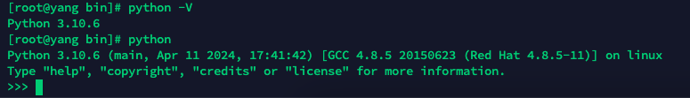
```shell
cd /opt/python

# 安装所需依赖 
yum install wget zlib-devel bzip2-devel openssl-devel ncurses-devel sqlite-devel readline-devel tk-devel gcc make zlib zlib-devel libffi-devel -y

# 下载解释器 -- 如果慢的话，可通过直接下载上图中给出的源码包，然后上传到服务器上
wget https://www.python.org/ftp/python/3.10.6/Python-3.10.6.tgz

# 解压
tar -xvf Python-3.10.6.tgz

cd Python-3.10.6

# 配置
./configure --prefix=/usr/local/python3.10.6

# 编译
make && make install

# 查看旧软链接
ls -l /usr/bin/python*

# 删除系统自带的老版本(python2)的软链接
rm -f /usr/bin/python

# 创建软链接
ln -s /usr/local/python3.10.6/bin/python3.10 /usr/bin/python

# 测试 -- 可在任意地方执行
python -V
```


- 问题：创建软链接后，会破坏yum程序的正常使用（只能使用系统自带的python2）
```
$ yum install git 
  File "/usr/bin/yum", line 30
    except KeyboardInterrupt, e:
           ^^^^^^^^^^^^^^^^^^^^
SyntaxError: multiple exception types must be parenthesized
```
解决：将第一行的 `#!/usr/bin/python` 修改为 `#!/usr/bin/python2`
```shell
vim /usr/bin/yum
vim /usr/libexec/urlgrabber-ext-down
```
### Windows安装
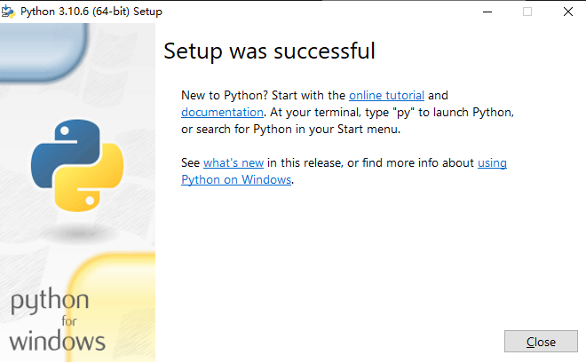
> `python.exe`：解释器程序

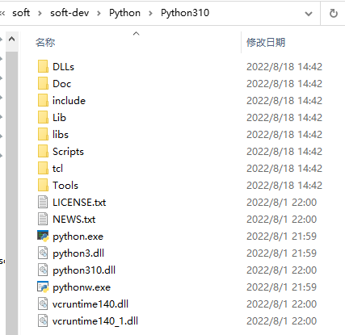

---

验证
> win+r 输入 cmd 进入命令行

```shell
python -V
```
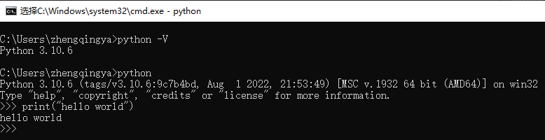
### Mac安装
下载解释器地址 [https://www.python.org/downloads](https://www.python.org/downloads)
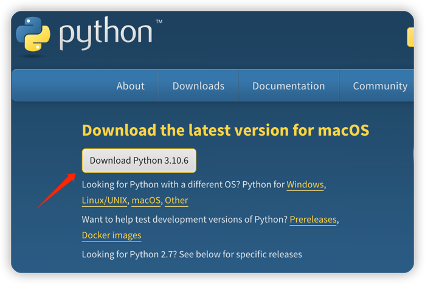
安装
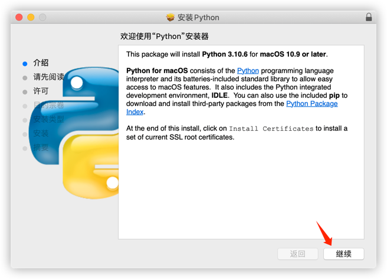
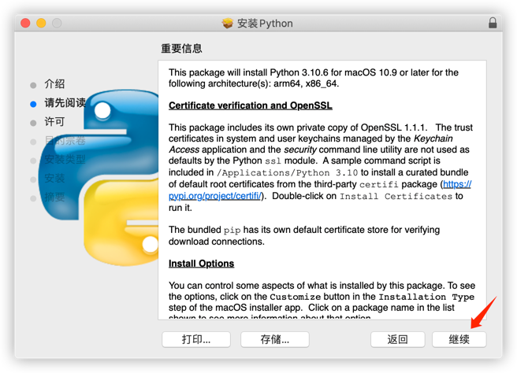
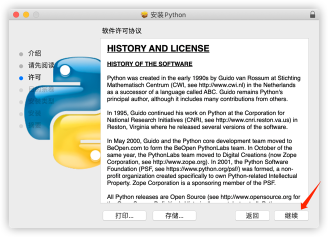
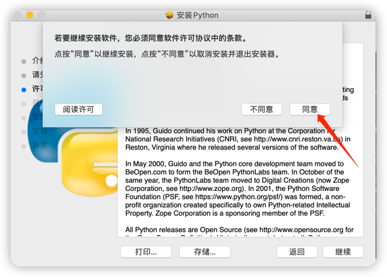
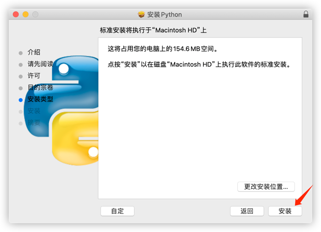
安装完成


- 配置
```shell
# python3安装路径
/Library/Frameworks/Python.framework/Versions/3.10
# 查看版本
/Library/Frameworks/Python.framework/Versions/3.10/bin/python3 -V


# 配置python3环境变量
open ~/.bash_profile

############################# ↓↓↓↓↓↓ set python environment ↓↓↓↓↓↓ #############################
PATH="/Library/Frameworks/Python.framework/Versions/3.10/bin:${PATH}"
export PATH
# 输入python命令的时候，使用python3命令执行
alias python="/Library/Frameworks/Python.framework/Versions/3.10/bin/python3"
################################################################################################


# 使配置生效
source ~/.bash_profile

# 验证
python -V
```
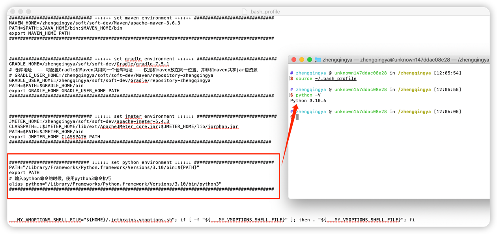
```shell
#=======================也可以直接使用=============================
echo 'alias python=python3' >> .bash_profile
# 使配置生效
source ~/.bash_profile
# 验证
python -V
```
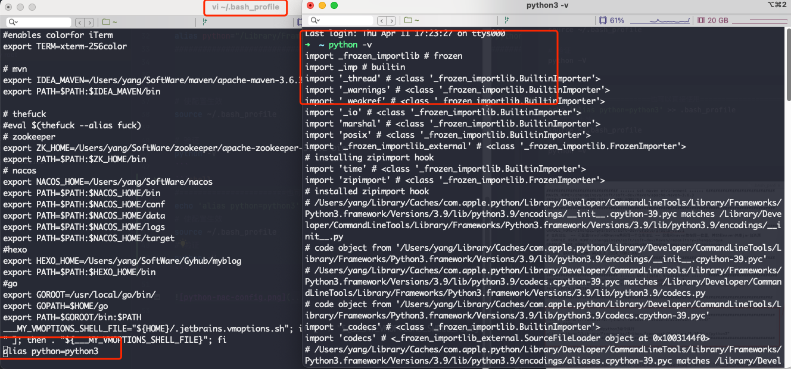
## IDE工具
# 基础
## 基础语法
### 字面量
字面量：被写下来的固定的值
`test.py`
```python
# 整数
print(6)
# 浮点数
print(6.6)
# 字符串
print("六六六")
```
运行
```shell
python test.py
```
### 注释
注释：对代码进行解释说明的文字，增加代码可读性。
```python
# 单行注释：以#开头   # 与 注释内容之间，建议用一个空格隔开


"""
    多行注释：以 一对三个双引号 引起来
    一般用来描述一个类的作用
    或一段代码的作用...
"""
```
### 变量
变量：记录数据
格式：变量名 = 变量值
```python
num = 10
print("num值：", num)

num = num - 3
print("num值：", num, "变了")
```
### 数据类型：type()
```python
# 直接输出
print(type(6))
print(type(6.6))
print(type("六六六"))

# 使用变量存储结果
int_type = type(6)
float_type = type(6.6)
string_type = type("六六六")
print(int_type)
print(float_type)
print(string_type)

# 查看变量存储的数据信息
name = "你好"
name_type = type(name)
print(name_type)
```
### 数据类型转换
```python
# 转换为一个整数   int(x)
print(type(int("666")))

# 转换为一个浮点数  float(x)
print(type(float("666")))

# 转换为一个字符串  str(x)
print(type(str(666)))
```
### 标识符
标识符：内容标识，用于给变量、类、方法等命名。
下划线命名法：`user_name`、`nick_name`
### 运算符
#### 算术运算符

1. `+`：加法
2. `-`：减法
3. `*`：乘法
4. `/`：除法
5. `//`：取整除
6. `%`：取余
7. `**`：指数
```python
print("1 + 1 = ", 1 + 1)
print("2 - 1 = ", 2 - 1)
print("3 * 3 = ", 3 * 3)
print("4 / 3 = ", 4 / 3)
print("5 // 3 = ", 5 // 3)
print("5 % 3 = ", 5 % 3)
print("2 ** 3 = ", 2**3)
```
#### 赋值运算符
把 = 号右边的结果 赋给 左边的变量
```python
num = 1 + 2 * 3
print(num)
```
#### 复合运算符
```
num += 1
print("[加法赋值运算符] num += 1:  ", num)
num -= 1
print("[减法赋值运算符] num -= 1:  ", num)
```
### 字符串扩展
#### 字符串定义的3种方式
```python
name = '你好'
name = "你好"
name = """你好
小白"""
print("单引号定义法：", name)
print("双引号定义法：", name)
print("三引号定义法：", name)
print("其它：", "'嵌套一下' \" 转义一下 ")
```
#### 字符串拼接
```python
name = "你好"
sex = "男"
print("姓名：" + name + "   性别：" + sex)
# print("姓名：" + name + "性别：" + sex + "年龄：" + 18) # 字符串和其它数据类型(ex：数字)拼接会报错
```
#### 字符串格式化
| 占位符 | 描述 |
| --- | --- |
| %s | 将内容转换成字符串，放入占位位置 |
| %d | 整数 |
| %f | 浮点型 |

```python
name = "小白"
sex = "男"
print("占位符 %s" % name)
# 多个占位符需用()括起来
print("占位符 %s %s" % (name, sex))
print("占位符 %s %d %f" % ("字符串", 666, 6.6)) # 输出： 占位符 字符串 666 6.600000
```
> 上面%f丢失精度

##### 数字精度控制
使用辅助符号`m.n`来控制数据的宽度和精度

- `m`: 控制宽度，要求是数字（很少使用）,设置的宽度小于数字自身，不生效
- `.n`: 控制小数点精度，要求是数字，会进行小数的四舍五入
```python
print("%1d" % 666)  # 输出：`666`，m对数字小，不生效
print("%3d" % 5)  # 输出：`  5`，前面2个空格占位
print("%2.1f" % 9.11111)  # 输出：`9.1`
print("%.2f" % 3.555)  # 输出：`3.56`，小数精度限制2位，结果四舍五入
```
##### f"{占位}"
> 不做精度控制，不限类型，适用于快速格式化字符串

```python
name = "小白"
age = 18
print(f"姓名：{name} 年龄：{age}")  # 输出： `姓名：小白 年龄：18`
```
##### 对表达式进行格式化
```python
print(f"2*3={2*3}")  # 输出：`2*3=6`
```
### 数据输入
print: 数据输出
input: 数据输入，获取键盘输入的内容
```python
name = input("请输入数据：")
print("结果：", name)
```
## 判断语句
### 布尔类型

1. `True`：真
2. `False`：假
### 比较运算符

1. `==`
2. `!=`
3. `>`
4. `<`
5. `>=`
6. `<=`
```python
# 定义变量存储布尔类型的数据
bool = True
print(f"{bool} 类型是：{type(bool)}")
print(f"{False} 类型是：{type(False)}")

# 比较运算符
num1 = 10
num2 = 10
print(f"10==10 => {num1 == num2}")
```
### if
判断条件的结果，必须是布尔类型True或False
True会执行if内的代码语句
False则不会执行
```python
if 判断条件:
    条件成立时执行...
```
```python
age = 18
if age >= 18:
    print("18...")
```
### if else
```python
if 判断条件:
    条件成立时执行...
else:
    条件不成立时执行...
```
```python
age = 15
if age >= 18:
    print("18...")
else:
    print("小娃娃...")
```
### if elif else
```python
if 条件1:
    条件1成立时执行...
elif 条件2:
    条件2成立时执行...
else:
    条件1和2都不成立时执行...
```
```python
age = 20
if age == 18:
    print("18...")
elif age > 18:
    print("大娃娃...")
else:
    print("小娃娃...")
```
### 嵌套使用
用于多条件、多层次的逻辑判断
```python
age = 66
if age == 18:
    print("18...")
elif age > 18:
    if age > 60:
        print("老娃娃...")
    else:
        print("成年人...")
else:
    print("娃娃？？？")
```
## 循环语句
### while
只要条件满足会无限循环执行...
```python
while 条件:
    条件满足时执行...
    ...
```
```python
i = 0
while i <= 10:
    i += 1
    print(i)
```
### 嵌套使用
```python
while 条件1:
    条件1满足时执行...
    ...
    while 条件2:
        条件2满足时执行...
        ...
```
```python
i = 0
j = 0
while i <= 10:
    i += 1
    print(i)
    while j <= 20:
        j += 5
        print("j: ", j)
print("***************")
```

---

### 九九乘法表
```python
i = 1
while i <= 9:
    j = 1
    while j <= i:
        # 内层循环的print语句，不要换行，通过\t制表符进行对齐（\t:等同于在键盘上按下tab键）
        print(f"{j} * {i} = {j * i}\t", end="")
        j += 1
    i += 1
    print()  # print空内容，就是输出一个换行
```
### for
```python
for 临时变量 in 待处理数据集(序列):
    循环满足条件时执行...
```
```python
name = "guoyang"
for i in name:
    print(i)
```
### range
待处理数据集，`可迭代类型`: 其内容可以一个个依次取出的一种类型

- 字符串
- 列表
- 元组
- ...
| 语法 | 描述 | 示例值 |
| --- | --- | --- |
| range(num) | 从 0 开始，到 num 结束，不包含 num | `range(3)`
 => `[0,1,2]` |
| range(num1, num2) | 从 num1 开始，到 num2 结束，不包含 num2 | `range(1, 3)`
 => `[1,2]` |
| range(num1, num2, step) | 从 num1 开始，到 num2 结束，不包含 num2，步长 step | `range(0, 10, 2)`
 => `[0,2,4,6,8]` |

```python
for i in range(0, 10, 2):
    print(i)
```
### 嵌套使用
```python
for 临时变量 in 待处理数据集(序列):
    循环满足条件时执行...
    ...
    for 临时变量 in 待处理数据集(序列):
        循环满足条件时执行...
        ...
```
```python
# for循环打印九九乘法表
for i in range(1, 10):
    for j in range(1, i + 1):
        print(f"{j} * {i} = {j * i}\t", end="")
    print()
```
### continue
临时跳过，中断本次循环，直接进入下一次循环
```python
for 临时变量 in 待处理数据集(序列):
    循环满足条件时执行1...
    continue
    循环满足条件时执行2...       # 这里不会执行，进入下一次循环
```
```python
for i in range(5):
    print(i)
    continue
    print("for循环内 continue之后的代码 将不会被执行，进入下一次循环")
```
### break
直接结束循环
> 在嵌套循环中，只能作用在所在层循环上，无法对上层循环起作用

```python
for 临时变量 in 待处理数据集(序列):
    循环满足条件时执行1...
    break
    循环满足条件时执行2...       # 这里不会执行，并跳出循环
```
```python
for i in range(5):
    print(i)
    break
    print("已经跳出循环，不会被执行了...")
```
## 函数
> 函数：组织好的，可重复使用的，用来实现特定功能的代码段。
提高程序的复用性，减少重复性代码，提高开发效率。

### 基础语法
参数和返回值不需要时，可省略
```python
# 定义函数
def 函数名(形参):
    函数体
    return 返回值

# 调用函数
函数名(实参)
```
```python
# 定义函数
def say_hi():
    print("Hi")


# 调用函数
say_hi()
```
```python
def add(x, y, z):
    print(f"{x} + {y} + {z} = {x + y + z}")
    return "这是有返回值且带参数的函数..."


result = add(1, 2, 3)
print(result)
```
#### 无返回值 - None类型
```python
def say_hi():
    print("Hi")
# return None  # 可不写


print(
    f"无返回值函数 返回内容：{say_hi()} 返回内容类型：{type(say_hi())}"
)  # 无返回值函数 返回内容：None 返回内容类型：<class 'NoneType'>
```
##### None用于if判断
```python
if not None:
    print("None值 相当于 False ...")
```
##### None用于变量定义 - 声明无初始内容的变量
```python
name = None
```
### 嵌套调用
```python
def func_b():
    print(2)


def func_a():
    print(1)

    # 嵌套调用
    func_b()

    print(3)


func_a()
```
### 说明文档
通过注释对函数进行解释说明
> 在PyCharm编写代码时，可以通过鼠标悬停，查看调用函数的说明文档

```python
def func(x, y):
    """
    函数说明
    :param x: 参数x的说明
    :param y: 参数y的说明
    :return: 返回值的说明
    """
    函数体
    return 返回值
```
```python
def add(x, y):
    """
    add函数可以接收2个参数，实现2数相加的功能
    :param x: 形参x表示相加的其中一个数字
    :param y: 形参y表示相加的另一个数字
    :return: 返回值是2数相加的结果
    """
    return x + y


print(add(1, 2))
```
### 变量作用域
变量的作用范围

1. 局部变量：定义在函数体内部的变量，即只在函数体内部生效 => 临时保存数据，当函数调用完成后销毁局部变量
2. 全局变量：在函数体内、外都能生效的变量
```python
# 全局变量
num = 888


def test_a():
    # 局部变量
    num = 666
    print(f"局部变量: {num}")  # 局部变量: 666


test_a()
print(f"全局变量: {num}")  # 全局变量: 888
```
### 将函数内部定义的变量声明为全局变量 - global关键字
```python
num = 888


def test_a():
    # 使用 global关键字 可以在函数内部声明变量为全局变量
    global num
    num = 666
    print(num)  # 666


test_a()
print(num)  # 666
```
## 数据容器
数据容器：一种可以存储多个元素的python数据类型。
> 每一个元素，可以是任意类型的数据，如字符串、数字、布尔等。

1. list: 列表 []
2. tuple: 元组 ()
3. str: 字符串 ""
4. set: 集合 {}
5. dict: 字典
### list 列表
列表特点：

1. 可以容纳多个元素（上限为2**63-1、9223372036854775807个）
2. 可以容纳不同类型的元素（混装）
3. 数据是有序存储的（下标索引）
4. 允许重复数据存在
5. 可以修改/增加/删除元素等
6. 支持while/for循环
#### 定义语法
```python
# 字面量
[元素1, 元素2, 元素3 ...]

# 定义变量
变量名称 = [元素1, 元素2, 元素3 ...]

# 定义空列表
变量名称 = []
变量名称 = list()
```
示例
```python
# 定义一个列表
my_list = [1, 2, 3]
print(my_list)
print(type(my_list))  # <class 'list'>

# 定义一个多数据类型的列表
my_list = ["zhengqingya", 666, True]
print(my_list)
print(type(my_list))

# 定义一个嵌套的列表
my_list = [[1, 2, 3], [4, 5, 6]]
print(my_list)
print(type(my_list))
```
#### 使用下标索引获取值
```python
# 通过下标索引取出对应位置的数据
# 格式：列表[下标索引]
#       从前向后从0开始，每次+1
#       从后向前从-1开始，每次-1
my_list = ["张三", "李四", "王五"]
print(my_list[0])  # 张三
print(my_list[1])  # 李四
print(my_list[2])  # 王五
# tips: 下标索引超出范围会报错    IndexError: list index out of range
# print(my_list[3])
print(my_list[-1])  # 王五
print(my_list[-2])  # 李四
print(my_list[-3])  # 张三

# 取出嵌套列表的元素
my_list = [[1, 2, 3], [4, 5, 6]]
print(my_list[1][2])  # 6
```
#### 列表常用操作方法
| 方法 | 描述 |
| --- | --- |
| `列表.index(元素)` | 查找指定元素下标 |
| `列表.insert(下标,元素)` | 在指定下标处，插入指定元素 |
| `列表.append(元素)` | 往列表中追加一个元素 |
| `列表.extend(容器)` | 将数据容器的内容依次取出，追加到列表尾部 |
| `del 列表[下标]` | 删除列表指定下标元素 |
| `列表.pop(下标)` | 删除列表指定下标元素 |
| `列表.remove(元素)` | 从前往后，删除列表中第一个匹配的元素 |
| `列表.count(元素)` | 统计此元素在列表中出现的次数 |
| `len(列表)` | 统计列表中有多少元素 |
| `列表.clear()` | 清空列表 |

```python
mylist = ["java", "python", "go"]
print(f"1. 查找python在列表内的下标索引：{mylist.index('python')}")
# 如果被查找的元素不存在会报错     ValueError: 'php' is not in list
# mylist.index("php")

mylist[0] = "java-plus"
print(f"2. 修改指定下标索引的值：{mylist}")

mylist.insert(1, "C++")
print(f"3. 在指定下标位置插入新元素：{mylist}")

mylist.append("Typescript")
print(f"4. 在列表的尾部追加单个新元素：{mylist}")

mylist.extend([1, 2, 3])
print(f"5. 在列表的尾部追加多个新元素：{mylist}")

del mylist[2]
print(f"6.1 删除指定下标索引的元素：{mylist}")
element = mylist.pop(1)
print(f"6.2 通过pop方法取出元素后列表内容：{mylist}   取出的元素是：{element}")

mylist = ["java", "python", "go", "ts", "go"]
mylist.remove("go")
print(f"7. 删除某元素在列表中的第一个匹配项：{mylist}")

mylist.clear()
print(f"清空列表：{mylist}")

mylist = ["java", "python", "python", "ts", "python"]
print(f"9. 统计列表内python的数量：{mylist.count('python')}")

print(f"10. 统计列表中全部的元素数量：{len(mylist)}")
```
#### 遍历列表
遍历/迭代：将容器内的元素依次取出，并处理
##### while循环
```python
def list_while_func():
    mylist = ["java", "python", "go"]
    # 循环控制变量：通过下标索引来控制，默认是0
    # 每一次循环，将下标索引变量+1
    # 循环条件：下标索引变量 < 列表的元素数量
    index = 0
    while index < len(mylist):
        element = mylist[index]
        print(f"[while] 元素：{element}")
        index += 1

list_while_func()
```
##### for循环
```python
def list_for_func():
    mylist = [1, 2, 3]
    for element in mylist:
        print(f"[for] 元素：{element}")

list_for_func()
```
### tuple 元组
元组特点：

1. 可以容纳多个数据
2. 可以容纳不同类型的元素（混装）
3. 数据是有序存储的（下标索引）
4. 允许重复数据存在
5. 不可以修改（修改/增加/删除元素等） -- tips: 可以修改内部list中的元素
6. 支持while/for循环
#### 定义语法
```python
# 字面量 tips: 元组只有一个数据时，这个数据后面要添加,
(元素1, )
(元素1, 元素2, 元素3 ...)

# 定义变量
变量名称 = (元素1, 元素2, 元素3 ...)

# 定义空元组
变量名称 = ()
变量名称 = tuple()
```
示例
```python
# 定义元组
t1 = ("zhengqingya", 666, True)
t2 = ()
t3 = tuple()
print(f"t1 类型：{type(t1)}  内容：{t1}")
print(f"t2 类型：{type(t2)}  内容：{t2}")
print(f"t3 类型：{type(t3)}  内容：{t3}")

# 定义单个元素的元组
t4 = ("zhengqingya",)
print(f"t4 类型：{type(t4)}  内容：{t4}")
# 元组的嵌套
t5 = ((1, 2, 3), (4, 5, 6))
print(f"t5 类型：{type(t5)}  内容：{t5}")
```
#### 使用下标索引获取值
```python
my_tuple = ("zhengqingya", 666, True)
print(f"下标索引获取值：{my_tuple[1]}")
```
#### 常用操作方法
| 方法 | 描述 |
| --- | --- |
| `元组.index()` | 查找指定元素下标 |
| `元组.count(元素)` | 统计此元素出现的次数 |
| `len(元组)` | 统计元组中有多少元素 |

```python
my_tuple = ("zhengqingya", 666, True)
print(f"下标索引获取值：{my_tuple[1]}")

# 修改元组内容
# my_tuple[0] = "go"  # 报错 TypeError: 'tuple' object does not support item assignment
my_tuple = (1, ["go", "python"])
my_tuple[1][0] = "go-plus"
print(f"修改元组内部list中的元素：{my_tuple}")  # (1, ['go-plus', 'python'])

my_tuple = ("java", "python", "go")
print(f"查找指定元素下标：{my_tuple.index('python')}")

my_tuple = ("java", "python", "python", "python", "go")
print(f"统计此元素出现的次数：{my_tuple.count('python')}")

print(f"统计元组中有多少元素：{len(my_tuple)}")
```
#### 遍历元组
##### while循环
```python
my_tuple = ("java", "python", "go")
index = 0
while index < len(my_tuple):
    print(f"[while] 元素：{my_tuple[index]}")
    index += 1
```
##### for循环
```python
my_tuple = ("c++", "python", "go")
for element in my_tuple:
    print(f"[for] 元素：{element}")
```
### str 字符串
字符串特点：

1. 只可以存储字符串
2. 长度任意（取决于内存大小）
3. 支持下标索引
4. 允许重复字符串存在
5. 不可以修改（修改/增加/删除元素等） -- tips: 不可修改字符串本身，但可通过replace替换得到一个新字符串
6. 支持while/for循环
#### 常用操作方法
| 方法 | 描述 |
| --- | --- |
| `字符串[下标]` | 根据下标索引获取值 |
| `字符串.index(字符串）` | 查找指定字符的第一个匹配项的下标 |
| `字符串.replace(字符串1, 字符串2)` | 将字符串内的全部 字符串 1，替换为 字符串 2 ，不会修改原字符串，而是得到一个新的字符串 |
| `字符串.split(字符串)` | 分隔字符串，不会修改原字符串，而是得到一个新的列表 |
| `字符串.strip()`
/`字符串.strip(字符串)` | 移除首尾的空格和换行符或指定字符串 |
| `字符串.count(字符串)` | 统计字符串内某字符串的出现次数 |
| `len(字符串)` | 统计字符串的字符个数 |

```python
my_str = "zhengqingya"
print(f"通过下标索引取值：{my_str[1]} {my_str[-2]}")
print(f"[index] ：{my_str.index('e')}")

new_my_str = my_str.replace("g", "G")
print(f"[replace] 原字符串：{my_str} 新字符串：{new_my_str}")  # zhenGqinGya

# split：分隔字符串，划分为多个字符串，并存入列表对象中
my_str = "java python go"
my_str_list = my_str.split(" ")
print(f"[split] 原字符串：{my_str} 分隔字符串后：{my_str_list} 类型：{type(my_str_list)}")

my_str = "  java go python  "
new_my_str = my_str.strip()  # 不传入参数，去除首尾空格
print(f"[strip] 原字符串：{my_str} 被strip后：{new_my_str}")

my_str = "123java go python321"
new_my_str = my_str.strip("123")  # 去除首尾含有123的字符串
print(f"[strip] 原字符串：{my_str} 被strip后：{new_my_str}")  # java go python

my_str = "zhengqingya"
print(f"统计字符串中某字符串的出现次数：{my_str.count('g')}")  # 2
print(f"统计字符串的长度：{len(my_str)}")  # 11
```
#### 遍历字符串
##### while循环
```python
my_str = "zhengqingya"
index = 0
while index < len(my_str):
    print(f"[while] 元素：{my_str[index]}")
    index += 1
```
##### for循环
```python
my_str = "zhengqingya"
for element in my_str:
    print(f"[for] 元素：{element}")
```
### 序列
序列：内容连续、有序，可使用下标索引的一类数据容器（列表、元组、字符串）
### 切片
切片：从一个序列中取出一个子序列
语法：`序列[起始下标: 结束下标: 步长]`
> 前闭后开区间 [起始下标, 结束下标)

表示在序列中，从指定位置开始，依次取出元素，到指定位置结束，得到一个新的序列

1. 起始下标：为空则从头开始
2. 结束下标：为空则截取到结尾
3. 步长：依次取元素的间隔 
   - 步长1：一个一个元素取
   - 步长n：每次跳过n-1个元素取
   - 步长为负数：反向取，起始下标和结束下标也需反向标记
```python
my_list = [0, 1, 2, 3, 4, 5, 6]
print(f"[list切片] 从1开始，到3结束，步长1：{my_list[1:3]}")  # [1, 2]

print(f"[list切片] 从2开始，到1结束，步长-1：{ my_list[3:0:-1]}")  # [3, 2, 1]

my_tuple = (0, 1, 2, 3, 4, 5, 6)
print(f"[tuple切片] 从头开始，到尾结束，步长1：{my_tuple[:]}")  # (0, 1, 2, 3, 4, 5, 6)
print(f"[tuple切片] 从头开始，到尾结束，步长-2：{my_tuple[::-2]}")  # (6, 4, 2, 0)

my_str = "01234567"
print(f"[str切片] 从头开始，到尾结束，步长2：{my_str[::2]}")  # 0246

my_str = "01234567"
print(f"[str切片] 从头开始，到尾结束，步长-1 (序列反转)：{my_str[::-1]}")  # 76543210
```
### set 集合
集合特点：

1. 可以容纳多个元素
2. 可以容纳不同类型的元素（混装）
3. 数据是无序存储的（不支持下标索引）
4. 不允许重复数据存在
5. 可以修改(增加/删除元素等)
6. 支持for循环，不支持while循环（因为不支持下标索引）
#### 定义语法
```python
# 定义字面量
{元素1, 元素2, 元素3 ...}

# 定义变量
变量名称 = {元素1, 元素2, 元素3 ...}

# 定义空集合
变量名称 = set()
```
#### 集合常用操作方法
| 方法 | 描述 |
| --- | --- |
| `集合.add(元素)` | 添加指定元素 |
| `集合.remove(元素)` | 移除指定元素 |
| `集合.pop()` | 随机取出一个元素 |
| `集合.clear()` | 清空集合 |
| `集合1.difference(集合2)` | 得到一个新集合，`内含 2 个集合的差集`
，原有的 2 个集合内容不变 |
| `集合1.difference_update(集合2)` | 在集合 1 中，删除集合 2 中存在的元素，集合 1 被修改，集合 2 不变 |
| `集合1.union(集合2)` | 合并集合，得到 1 个新集合，原有的 2 个集合内容不变 |
| `len(集合)` | 统计集合中有多少元素 |

```python
my_set = {"java", "python", "go"}
my_set_empty = set()
print(f"集合：{my_set}  类型：{type(my_set)}")
print(f"空集合：{my_set_empty}  类型：{type(my_set_empty)}")

my_set.add("c++")
my_set.add("php")
print(f"添加新元素：{my_set}")  # {'java', 'php', 'go', 'c++', 'python'}

my_set.remove("c++")
print(f"移除元素：{my_set}")  # {'java', 'php', 'go', 'python'}

element = my_set.pop()
print(f"随机取出一个元素：{element}, 取出元素后的集合：{my_set}")

my_set.clear()
print(f"清空集合：{my_set}")  # set()

print("************************")

set1 = {1, 2, 3}
set2 = {2, 5, 6}
print(f"取2个集合的差集：{set1.difference(set2)}")  # {1, 3}
print(f"取2个集合的差集，原set1不变：{set1}")
print(f"取2个集合的差集，原set2不变：{set2}")


set1.difference_update(set2)
print(f"消除2个集合的差集后，set1结果：{set1}")  # {1, 3}
print(f"消除2个集合的差集后，set2不变：{set2}")  # {2, 5, 6}

set_union = set1.union(set2)
print(f"合并集合：{set_union}")  # {1, 2, 3, 5, 6}
print(f"合并集合后set1不变：{set1}")
print(f"合并集合后set2不变：{set2}")

print(f"set1内的元素数量：{len(set1)}")  # 2
```
#### 遍历集合
```python
# 集合不支持下标索引，不能用while循环
# 可以用for循环
my_set = {"java", "python", "go"}
for element in my_set:
    print(f"[for] 元素：{element}")
```
### dict 字典
字典特点：

1. 可以容纳多个元素
2. 可以容纳不同类型的元素
3. 每一份数据是`key:value`键值对
4. key和value可以是任意数据类型（key不可为字典）
5. 可以通过key获取到value，key不可重复（重复会覆盖原有数据）
6. 不支持下标索引
7. 可以修改（增加/删除/更新元素等）
8. 支持for循环，不支持while循环
#### 定义语法
```python
# 定义字面量
{key:value, key:value, key:value ...}

# 定义变量
变量名称 = {key:value, key:value, key:value ...}

# 定义空字典
变量名称 = {}
变量名称 = dict()
```
示例
```python
my_dict = {"java": 1, "python": 2, "go": 3}
my_dict_empty_01 = {}
my_dict_empty_02 = dict()
print(f"字典：{my_dict} 类型：{type(my_dict)}")
print(f"空字典：{my_dict_empty_01} 类型：{type(my_dict_empty_01)}")
print(f"空字典：{my_dict_empty_02} 类型：{type(my_dict_empty_02)}")

my_dict = {"java": 1, "java": 2, "go": 3}
print(f"重复key：{my_dict}")

my_dict = {"java": 1, "python": 2, "go": 3}
print(f"通过key获取value：{my_dict['java']}")

my_dict = {
    "张三": {"age": 18, "nickname": "zhangsan"},
    "李四": {"age": 20, "nickname": "lisi"},
}
print(f"嵌套字典：{my_dict}")
print(f"嵌套字典获取值：{my_dict['李四']['age']}")
```
#### 字典常用操作方法
| 方法 | 描述 |
| --- | --- |
| `字典[key]` | 获取指定 key 对应的 value 值 |
| `字典[key] = value` | 添加或更新键值对 |
| `字典.pop(key)` | 删除指定键的元素 |
| `字典.clear()` | 清空字典 |
| `字典.keys()` | 获取包含字典键的列表，可用于 for 循环遍历字典 |
| `字典.values()` | 获取包含字典值的列表 |
| `len(字典)` | 统计字典中有多少元素 |

```python
my_dict = {"java": 1, "python": 2, "go": 3}

my_dict["php"] = -1
print(f"新增元素：{my_dict}")

my_dict["python"] = 100
print(f"更新元素：{my_dict}")

php = my_dict.pop("php")
print(f"{my_dict} 删除元素：{php}")

my_dict.clear()
print(f"清空元素：{my_dict}")

my_dict = {"java": 1, "python": 2, "go": 3}
print(f"字典内的元素数量：{len(my_dict)}")

keys = my_dict.keys()
print(f"全部key：{keys}")
```
#### 遍历字典
```python
for key in keys:
    print(f"[方式1] key:{key}    value:{my_dict[key]}")

for key in my_dict:
    print(f"[方式2] key:{key}    value:{my_dict[key]}")

values = my_dict.values()
for value in values:
    print(f"[方式3] value:{value}")
```
### 数据容器的通用操作
| 方法 | 描述 |
| --- | --- |
| `通用for循环` | 遍历容器（字典是遍历key） |
| `max()` | 容器内最大元素 |
| `min()` | 容器内最小元素 |
| `len()` | 容器元素个数 |
| `list()` | 转换为列表 |
| `tuple()` | 转换为元组 |
| `str()` | 转换为字符串 |
| `set()` | 转换为集合 |
| `sorted(序列, [reverse=True])` | 排序，reverse=True 表示降序，最终会得到一个排好序的列表 |

```python
my_list = [1, 2, 3, 4, 5]
my_tuple = (1, 2, 3, 4, 5)
my_str = "hello"
my_set = {1, 2, 3, 4, 5}
my_dict = {"key1": 1, "key2": 2, "key3": 3, "key4": 4, "key5": 5}
print("***************************************** len：元素个数")
print(f"列表 元素个数有：{len(my_list)}")
print(f"元组 元素个数有：{len(my_tuple)}")
print(f"字符串 元素个数有：{len(my_str)}")
print(f"集合 元素个数有：{len(my_set)}")
print(f"字典 元素个数有：{len(my_dict)}")
print("***************************************** max：最大元素")
print(f"列表 最大的元素是：{max(my_list)}")
print(f"元组 最大的元素是：{max(my_tuple)}")
print(f"字符串 最大的元素是：{max(my_str)}")
print(f"集合 最大的元素是：{max(my_set)}")
print(f"字典 最大的元素是：{max(my_dict)}")
print("***************************************** min：最小元素")
print(f"列表 最小的元素是：{min(my_list)}")
print(f"元组 最小的元素是：{min(my_tuple)}")
print(f"字符串 最小的元素是：{min(my_str)}")
print(f"集合 最小的元素是：{min(my_set)}")
print(f"字典 最小的元素是：{min(my_dict)}")
print("***************************************** 类型转换：容器转列表")
print(f"列表转列表的结果是：{list(my_list)}")
print(f"元组转列表的结果是：{list(my_tuple)}")
print(f"字符串转列表结果是：{list(my_str)}")
print(f"集合转列表的结果是：{list(my_set)}")
print(f"字典转列表的结果是：{list(my_dict)}")
print("***************************************** 类型转换：容器转元组")
print(f"列表转元组的结果是：{tuple(my_list)}")
print(f"元组转元组的结果是：{tuple(my_tuple)}")
print(f"字符串转元组结果是：{tuple(my_str)}")
print(f"集合转元组的结果是：{tuple(my_set)}")
print(f"字典转元组的结果是：{tuple(my_dict)}")
print("***************************************** 类型转换：容器转字符串")
print(f"列表转字符串的结果是：{str(my_list)}")
print(f"元组转字符串的结果是：{str(my_tuple)}")
print(f"字符串转字符串结果是：{str(my_str)}")
print(f"集合转字符串的结果是：{str(my_set)}")
print(f"字典转字符串的结果是：{str(my_dict)}")
print("***************************************** 类型转换：容器转集合")
print(f"列表转集合的结果是：{set(my_list)}")
print(f"元组转集合的结果是：{set(my_tuple)}")
print(f"字符串转集合结果是：{set(my_str)}")
print(f"集合转集合的结果是：{set(my_set)}")
print(f"字典转集合的结果是：{set(my_dict)}")
# 容器排序
my_list = [1, 2, 3, 4, 5]
my_tuple = (1, 2, 3, 4, 5)
my_str = "hello"
my_set = {1, 2, 3, 4, 5}
my_dict = {"key1": 1, "key2": 2, "key3": 3, "key4": 4, "key5": 5}
print("***************************************** 容器排序：正序")
print(f"列表对象的排序结果：{sorted(my_list)}")
print(f"元组对象的排序结果：{sorted(my_tuple)}")
print(f"字符串对象的排序结果：{sorted(my_str)}")
print(f"集合对象的排序结果：{sorted(my_set)}")
print(f"字典对象的排序结果：{sorted(my_dict)}")
print("***************************************** 容器排序：降序")
print(f"列表对象的反向排序结果：{sorted(my_list, reverse=True)}")
print(f"元组对象的反向排序结果：{sorted(my_tuple, reverse=True)}")
print(f"字符串对象反向的排序结果：{sorted(my_str, reverse=True)}")
print(f"集合对象的反向排序结果：{sorted(my_set, reverse=True)}")
print(f"字典对象的反向排序结果：{sorted(my_dict, reverse=True)}")
```
### 字符串大小比较
在程序中，字符串所用的所有字符都有其对应的ASCII码表值

1. 大小写英文单词
2. 数字
3. 特殊符号(!、\、|、@、#、空格等）
> 每一个字符都对应一个数字的码值

#### 字符串如何比较
从头到尾，一位一位进行比较，其中一位大，后面就无需比较了。
#### 单个字符之间如何确定大小？
通过ASCII码表，确定字符对应的ASCII码值数字来确定大小
```python
print(f"{'abd' > 'abc'}")  # True
print(f"{'ab' > 'a'}")  # True
print(f"{'a' > 'A'}")  # True
print(f"{'key2' > 'key1'}")  # True
```
## 函数进阶
### 函数多返回值
```python
def test_return():
    return 1, "hello", True


x, y, z = test_return()
print(x)  # 1
print(y)  # hello
print(z)  # True
```
### 函数多种传参方式
#### 位置参数
根据参数位置来传递参数
> 实参和形参的顺序及个数必须一致

```python
def user_info(name, age, sex):
    print(f"姓名:{name} 年龄:{age} 性别：{sex}")


user_info("小白", 18, "男")
```
#### 关键字参数
通过`键=值`形式传递参数，可以不限参数顺序
作用: 可以让函数更加清晰、容易使用，同时也清除了参数的顺序需求.
> 可以和位置参数混用，但位置参数必须在最前面，关键字参数之间不存在先后顺序

```python
def user_info(name, age, sex):
    print(f"姓名:{name} 年龄:{age} 性别：{sex}")


user_info(name="张三", age=100, sex="女")
user_info(age=20, sex="男", name="李四")
user_info("乖乖", sex="男", age=18)
```
#### 缺省参数
不传递参数值时会使用默认的参数值
> 缺省参数也叫默认参数，默认参数必须定义在最后

```python
def user_info(name, age, sex="未知"):
    print(f"姓名:{name} 年龄:{age} 性别：{sex}")


user_info("小白", 18)
user_info("小白", 18, "男")
```
#### 不定长参数
不定长参数也叫可变参数. 用于函数调用时不确定参数个数
##### 位置传递 => `*`标记形参
> 以元组形式接收参数
形参一般命名`args`

```python
def user_info(*args):
    print(f"不定长 - 位置不定长：{args} 类型:{type(args)}")


user_info(1, 2, 3, "小明", "男孩")
```
##### 关键字传递 => `**`标记形参
> 以字典形式接收参数
形参一般命名`kwargs`

```python
def user_info(**kwargs):
    print(f"不定长 - 关键字不定长：{kwargs} 类型:{type(kwargs)}")


user_info(name="小白", age=18, sex="男")
```
### 匿名函数
#### 函数作为参数传递
作用：传入计算逻辑，而非传入数据
```python
def test_func(add):
    print(f"类型:{type(add)} 结果：{add(1, 2)}")


def add(x, y):
    return x + y


test_func(add)  # 类型:<class 'function'> 结果：3
```
#### lambda匿名函数

1. 匿名函数用于临时构建一个函数，只用一次的场景
2. 匿名函数的定义中，函数体只能写一行代码，如果函数体要写多行代码，不可用lambda匿名函数，应使用def定义具名函数

语法：`lambda 传入参数: 函数体(一行代码)`
```python
def test_func(add):
    print(f"类型:{type(add)} 结果：{add(1, 2)}")


test_func(lambda x, y: x + y)  # 类型:<class 'function'> 结果：3
```
## 文件操作
### 文件编码
编码：一种规则集合，记录了内容和二进制间进行相互转换的逻辑。
ex: `UTF-8`

- 为什么需要使用编码？
> 计算机只认识0和1，所以需要将内容翻译成0和1才能保存在计算机中。
同时也需要编码， 将计算机保存的0和1，反向翻译回可以识别的内容。

### 文件读取
> tips: 文件读取完后，记得close关闭文件对象，不然文件会被一直占用
读取到某一位置时，下次会从上次读取的位置继续读取

| 操作 | 功能 |
| --- | --- |
| `文件对象 = open(file, mode, encoding)` | 打开文件获得文件对象 |
| `文件对象.read(num)` | 读取指定长度字节，不指定num读取文件全部 |
| `文件对象.readline()` | 读取一行 |
| `文件对象.readlines()` | 读取全部行，得到列表 |
| `for line in 文件对象` | for循环文件行，一次循环得到一行数据 |
| `文件对象.close()` | 关闭文件对象 |
| `with open() as f` | 通过`with open`
语法打开文件，可以自动关闭文件对象 |

- mode访问模式
| 模式 | 描述 |
| --- | --- |
| `r` | 以只读方式打开文件，默认模式 |
| `w` | 可写入，如果文件在则重新写入内容，如果文件不存在则创建新文件 |
| `a` | 追加文件内容，如果文件在则追加，不在则创建新文件再写入 |

```python
# 以只读模式打开文件
f = open("./test.txt", "r", encoding="UTF-8")
print(type(f))

# 读取文件
# print(f"文件内容：\n{f.read()}")

# 读取文件的全部行，封装到列表中
# lines = f.readlines()
# print(f"lines对象类型：{type(lines)}  内容：\n{lines}")

# for循环读取文件行
for line in f:
    print(f"[for] 行数据:{line}")
# 关闭文件
f.close()

# with open 语法操作文件 -- 此方式可以自动关闭文件
with open("./test.txt", "r", encoding="UTF-8") as f:
    for line in f:
        print(f"[with open] 行数据：{line}")
```
### 文件写入
> flush作用: 避免频繁操作硬盘，导致效率下降，因此在文件写好之后，再一次性写入磁盘中

```python
# 1、打开文件 -- 如果文件存在将清空原有内容重新写入
f = open("./test.txt", "w", encoding="UTF-8")
# 2、文件写入 -- 写入到缓冲区
f.write("Hello World!!!")
# 3、内容刷新 -- 真正写入文件
# f.flush()
# 4、close关闭 内置了flush功能
f.close()
```
### 文件追加
```python
# 1、打开文件 -- 如果文件不存在将创建新文件
f = open("./test.txt", "a", encoding="UTF-8")
# 2、文件写入 -- 写入到缓冲区
f.write("\nHello World!!!")
# 3、close关闭 内置flush功能
f.close()
```
## 异常、模块、包
> 异常
> 程序运行的过程中出现了错误，即bug

### 异常捕获
作用：在可能出现异常的地方提前做处理
#### 捕获常规异常
语法：
```python
try:
    可能出现异常的代码
except:
    出现异常后执行...
```
示例：
```python
try:
    1 / 0
except:
    print("异常来了...")
```
#### 捕获指定异常
```python
try:
    1 / 0
except ZeroDivisionError as e:
    print(e)  # 输出描述信息
```
#### 捕获多个异常
```python
try:
    # 1 / 0
    print(name)
except (NameError, ZeroDivisionError) as e:
    print(e)
```
#### 捕获所有异常
```python
try:
    1 / 0
except:
    print("异常...")
```
> tips: 建议使用下面这一种来捕获所有异常

```python
try:
    1 / 0
except Exception as e:
    print(e)
```
#### 异常else
没有异常时执行代码
```python
try:
    print("hi")
except Exception as e:
    print(e)
else:
    print("没有异常时执行...")
```
#### 异常finally
不管有没有异常都执行代码
```python
try:
    print("hi")
except Exception as e:
    print(e)
else:
    print("没有异常时执行...")
finally:
    print("不管有没有异常都执行....")
```
### 异常传递性
通过异常具有传递性的特点，我们可以在外层调用处去捕获异常
```python
def test_func():
    print("执行start...")
    1 / 0
    print("执行end...")


def main():
    try:
        test_func()
    except Exception as e:
        print(e)


main()
```
### 模块
模块就是一个Python文件（以`.py`结尾），里面有类、函数、变量等，我们可以导入模块进行使用。
### 模块-导入
语法：`[from 模块名] import [模块|类|变量|函数|*] [as 别名]`
#### import 模块名
```python
import time

time.sleep(3)
print("hello...")
```
#### from 模块名 import 类、变量、方法等
```python
from time import sleep

sleep(3)
print("hello...")
```
#### from 模块名 import *
> `*`：导入指定模块名的全部功能

```python
from time import *

sleep(3)
print("hello...")
```
#### import 模块名 as 别名
```python
import time as t

t.sleep(3)
print("hello...")
```
#### from 模块名 import 功能名 as 别名
```python
from time import sleep as sl

sl(3)
print("hello...")
```
### 自定义模块
> 每个Python文件都可以作为一个模块，模块的名字就是文件的名字

`my_module.py`
```python
def test():
    print("test ...")
```
#### 导入自定义模块使用
语法：`[from 模块名] import [模块|类|变量|函数|*] [as 别名]`
```python
import my_module

my_module.test()
```
#### 导入不同模块的同名功能
后导入的会覆盖之前导入的
```python
from my_module1 import test
from my_module2 import test

test()  # 使用my_module2中的test
```
#### `__main__`
> 如果其它模块里有执行函数的代码，当我们在导入其它模块时，也会默认执行
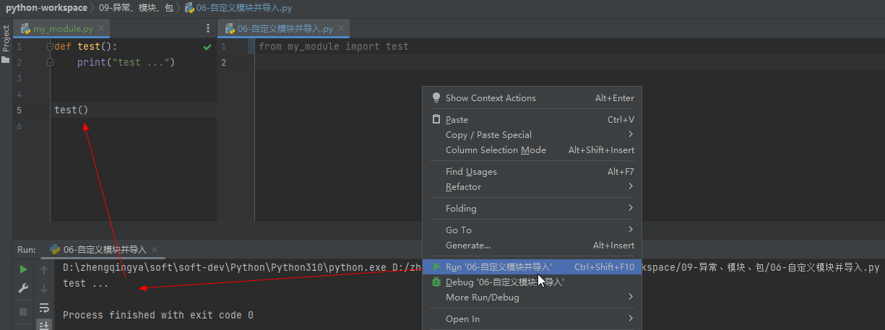

`__main__`：当程序直接被执行时才进入if内部，如果是通过导入方式则不会被执行
`my_module.py`
> 这里会执行test逻辑代码

```python
def test():
    print("test ...")


if __name__ == "__main__":
    test()
```
> 这里不会执行test逻辑代码

```python
from my_module import test
```
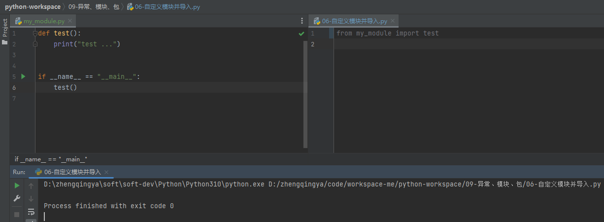
#### `__all__`
控制`import *`时哪些功能可以被导入
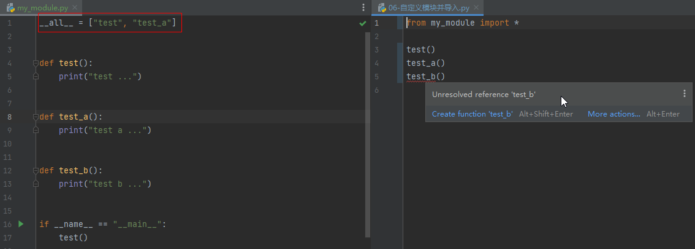
```python
__all__ = ["test", "test_a"]


def test():
    print("test ...")


def test_a():
    print("test a ...")


def test_b():
    print("test b ...")


if __name__ == "__main__":
    test()
```
```python
from my_module import *

test()
test_a()
# test_b() # 这里无法调用
```
### Python包
包：就是一个文件夹，里面有多个模块文件。 -- 通过包分类管理模块
从物理上看，包，在该文件夹下包含了一个`__init__.py`文件
### 自定义包
#### 创建包
`New` -> `Python Package`
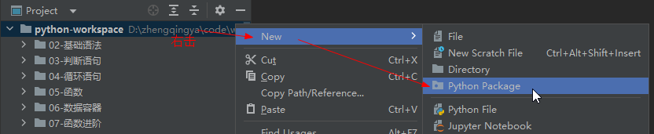
创建包会自动生成`__init__.py`文件：标识这是一个python的包，非普通文件夹
#### 创建模块
`my_module1.py`
```python
def test():
    print("test1 ...")
```
`my_module2.py`
```python
def test():
    print("test2 ...")
```
#### 导入自定义包中的模块并使用
##### 方式一
```python
import my_package.my_module1
import my_package.my_module2

my_package.my_module1.test()
my_package.my_module2.test()
```
##### 方式二
```python
from my_package import my_module1
from my_package import my_module2

my_module1.test()
my_module2.test()
```
##### 方式三
```python
from my_package.my_module1 import test
from my_package.my_module2 import test

test()
test()  # 使用的`my_package.my_module2`下的test
```
#### `__init__.py` -> `__all__` 控制`import *`可使用模块
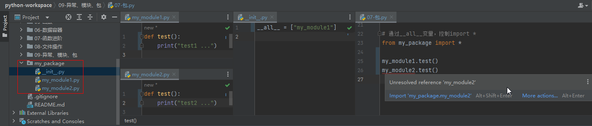
`__init__.py`
```python
__all__ = ["my_module1"]
```
导入自定义包中的模块并使用时发现`my_module2`无法调用，因为在`__init__.py`中未声明引用
```python
from my_package import *

my_module1.test()
# my_module2.test() # 无法调用
```
### 第三方包
第三方包：非Python官方内置的包，可以通过安装它们扩展功能，提高开发效率。
ex:

1. 科学计算中常用的：`numpy`包
2. 数据分析中常用的：`pandas`包
3. 大数据计算中常用的：`pyspark`、`apache-flink`包
4. 图形可视化常用的：`matplotlib`、`pyecharts`
5. 人工智能常用的：`tensorflow`
> 由于是第三方的包，Python没有内置，所以我们需要安装它们才可以导入使用

### 安装第三方包
#### 方式一：pip
> 使用Python内置的pip程序安装即可

```shell
pip install 包名称
```
##### pip网络优化
问题：pip是连接的国外网站进行包的下载，有时候速度会很慢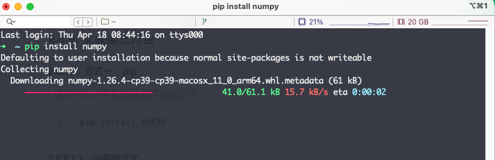
解决：通过`-i`使用清华源进行下载
```shell
pip install -i https://pypi.tuna.tsinghua.edu.cn/simple 包名称
```
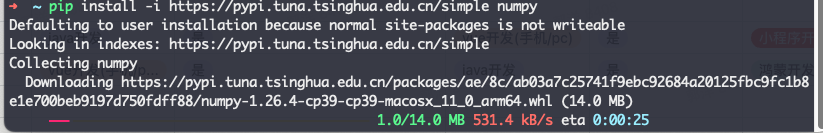
#### 方式二：PyCharm
`File` -> `Settings...` -> `Python Interpreter`

## 综合案例
### JSON

- JSON是一种轻量级的数据交互格式。
- JSON本质上是一个带有特定格式的字符串。
```json
{
  "name": "admin",
  "age": 18
}
```
```json
[
  {
    "name": "admin",
    "age": 18
  },
  {
    "name": "test",
    "age": 20
  }
]
```
### Python数据和JSON数据 相互转换
| 方法 | 描述 |
| --- | --- |
| `json.dumps(data, ensure_ascii=False)` | python中的列表或字典 转 json字符串，`ensure_ascii=False`：解决中文乱码问题 |
| `json.loads(json_str)` | json字符串 转 python中的列表或字典 |

```python
import json

# 定义列表
data = [{"name": "admin", "age": 18}, {"name": "test", "age": 20}]
# 列表 转 json字符串 -- `ensure_ascii=False`：解决中文乱码问题
json_str = json.dumps(data, ensure_ascii=False)
print(f"{type(json_str)}  ---  {json_str}")

# 定义字典
data = {"name": "admin", "age": 18}
# 字典 转 json字符串 -- `ensure_ascii=False`：解决中文乱码问题
json_str = json.dumps(data, ensure_ascii=False)
print(f"{type(json_str)}  ---  {json_str}")

# 定义json字符串
json_str = '[{"name": "admin", "age": 18}, {"name": "test", "age": 20}]'
# json字符串 转 列表
python_list = json.loads(json_str)
print(f"{type(python_list)}  ---  {python_list}")

# json字符串 转 字典
json_str = '{"name": "admin", "age": 18}'
python_dict = json.loads(json_str)
print(f"{type(python_dict)}  ---  {python_dict}")
```
### Pyecharts
数据可视化
> - [https://github.com/pyecharts/pyecharts](https://github.com/pyecharts/pyecharts)
> - [https://pyecharts.org/#/zh-cn/intro](https://pyecharts.org/#/zh-cn/intro)

#### 安装
```shell
pip install pyecharts
```
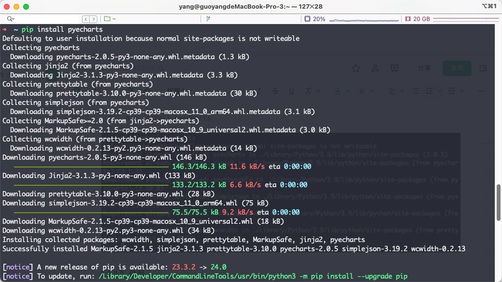
#### 使用
```python
# 导包
from pyecharts.charts import Bar
from pyecharts.options import TitleOpts, LegendOpts, ToolboxOpts, VisualMapOpts

# bar对象
bar = Bar()
# x轴
bar.add_xaxis(["java", "python", "go", "php", "c", "c++"])
# y轴
bar.add_yaxis("语言", [100, 90, 80, 70, 60, 50])

# 全局配置项 set_global_opts  详细配置见 https://pyecharts.org/#/zh-cn/global_options
bar.set_global_opts(
    # 标题配置项
    title_opts=TitleOpts(title="计算机语言", pos_left="center", pos_bottom="1%"),
    # 图例配置项
    legend_opts=LegendOpts(is_show=True),
    # 工具箱配置项
    toolbox_opts=ToolboxOpts(is_show=True),
    # 视觉映射配置项
    visualmap_opts=VisualMapOpts(is_show=True),
)

# render 会生成本地 HTML 文件，默认会在当前目录生成 render.html 文件
# 也可以传入路径参数，如 bar.render("mycharts.html")
bar.render()
```
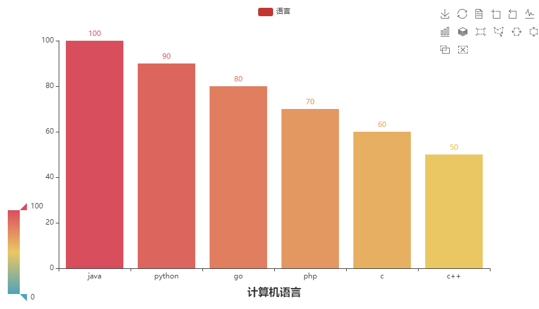
## 面向对象
面向对象编程：设计类，基于类创建对象，并使用对象做具体的工作。
### 类的定义和使用
语法
```python
# 定义类
class 类名:
    # 类的属性 -- 成员变量
    类的属性1: None
    类的属性2: None

    # 类的行为 -- 成员方法  tips:类外部叫函数，类里面叫方法。  self: 让成员方法能访问到当前类的成员变量的值
    def 方法名(self, 形参1, 形参2, ...):
        方法体...


# 创建对象
对象 = 类名()

# 对象属性赋值
对象.属性名 = "xxx"
```
示例
```python
# 定义类
class User:
    # 姓名
    name: None
    # 年龄
    age: None

    def say_hi(self):
        print(f"hi {self.name}")

    def say_hi_2(self, name):
        print(f"hi {self.name} {name}")


# 创建对象
user_1 = User()

# 对象属性赋值
user_1.name = "zhengqingya"
user_1.age = 18

# 调用类方法
user_1.say_hi()
user_1.say_hi_2("小郑")

# 打印值
print(f"姓名：{user_1.name} 年龄：{user_1.age}")
```
### 构造方法
### 常用类内置方法(魔术方法)
| 方法 | 功能 |
| --- | --- |
| `__init__` | 构造方法: 创建类对象时设置初始化行为 |
| `__str__` | 实现类对象转字符串的行为 |
| `__lt__` | 用于2个类对象进行小于或大于比较 |
| `__le__` | 用于2个类对象进行小于等于或大于等于比较 |
| `__eq__` | 用于2个类对象进行相等比较 |

示例
```python
class User:
    # 构造方法
    def __init__(self, name, age):
        self.name = name
        self.age = age

    # 对象输出字符串
    def __str__(self):
        return f"姓名：{self.name} 年龄：{self.age}"

    # 大小比较
    def __lt__(self, other):
        return self.age < other.age

    def __le__(self, other):
        return self.age <= other.age

    # 相等比较
    def __eq__(self, other):
        return self.age == other.age


user_1 = User("zhengqingya", 18)
user_2 = User("zhengqingya2", 20)

print(user_1)  # 姓名：zhengqingya 年龄：18
print(user_1 < user_2)  # True
print(user_1 <= user_2)  # True
print(user_1 == user_2)  # False
```
语法：`__init__(self, 形参1, 形参2, ...)`
作用：

1. 将传入参数自动传递给`__init__`方法使用
2. 创建类对象的时候，自动执行

示例
```python
class User:
    # 可省略
    # name: None
    # age: None

    def __init__(self, name, age):
        self.name = name
        self.age = age
        print(f"姓名：{self.name} 年龄：{self.age}")


user_1 = User("zhengqingya", 18)
```
### 封装

1. 将动物的身高、体重、外貌等封装为属性(类的成员变量)
2. 将动物的吃饭、睡觉、跑步等封装为行为(类的成员方法)

私有成员(变量和方法)：不对外开放-即类对象无法使用，但在类中可以使用-即提供仅内部可使用的属性和方法。 命名定义以`__`开头
示例
```python
class User:
    # 私有成员变量
    __basic_age = 18

    # 构造方法
    def __init__(self, name, age):
        self.name = name
        self.age = age

    # 私有成员方法
    def __un_adult(self):
        print("未成年...")

    # 公开方法
    def is_adult(self):
        # 内部调用私有成员变量
        if self.age >= self.__basic_age:
            print("成年了...")
        else:
            # 内部调用私有成员方法
            self.__un_adult()


user = User("zhengqingya", 20)
user.is_adult()
```
### 继承
继承：一个类从另外一个类继承它的成员变量和成员方法(不含私有)
语法：
```python
# 单继承
class 类名(父类名):
    类内容体...


# 多继承 -- tips: 如果父类中有同名方法或属性，先继承的优先级高于之后的
class 类名(父类名1, 父类名2, ...):
    类内容体...
```
示例：
```python
class Animal:
    name: None

    def run(self):
        print(f"[动物] {self.name} 跑...")


class Person:
    name: None

    def run(self):
        print(f"[人类] {self.name} 跑...")


class Dog(Animal):
    # 占位语句，用于补充语法完整性
    pass


class Cat(Animal, Person):
    pass


cat = Cat()
cat.name = "西西"
cat.run()  # [动物] 西西 跑...
```
#### 复写
复写：对父类的成员属性或方法重新定义。
语法：子类中定义同名的成员属性或方法即可。
子类中调用父类成员语法：
```python
# 方式1：
父类名.成员变量
父类名.成员方法(self)

# 方式2：
super().成员变量
super().成员方法()
```
示例：
```python
class Animal:
    name = "小动物"

    def run(self):
        print(f"[动物] {self.name} 跑...")


class Pig(Animal):
    name = "小猪猪"

    def run(self):
        print("111")
        # 调用父类方式1
        print(f"{Animal.name}")  # 小动物
        Animal.run(self)  # [动物] 小猪猪 跑...
        # 调用父类方式2
        print(f"{super().name}")  # 小动物
        super().run()  # [动物] 小猪猪 跑...
        print("333")


pig = Pig()
pig.run()
```
### 类型注解
> python3.5版本之后引入

类型注解：对数据类型进行显式的说明、提示。 ex：PyCharm的代码提示
> tips: 仅做提示使用，就算数据类型和类型注解无法对应也不会导致代码的错误。

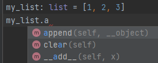
#### 类型注解 - 变量

- 语法1：`变量: 类型`
- 语法2：在注释中，`# type: 类型`
```python
# 基础数据类型注解
var_1: int = 666
var_2: str = "字符串"
var_3: float = 6.6
var_4: bool = True


# 类对象类型注解
class User:
    pass


user: User = User()


# 基础容器类型注解
my_str: str = "zhengqingya"
my_list: list = [1, 2, 3]
my_set: set = {1, 2, 3}
my_dict: dict = {"age": 18}
my_tuple: tuple = ("zq", 18, True)


# 容器类型详细注解
my_list: list[int] = [1, 2, 3]
my_set: set[int] = {1, 2, 3}
my_dict: dict[str, int] = {"age": 18}
my_tuple: tuple[str, int, bool] = ("zq", 18, True)


# 在注释中进行类型注解
my_str = "zq"  # type: str
```
#### 类型注解 - 函数(方法)形参和返回值
语法：
```python
# 形参类型注解
def 函数(方法)名(形参名1: 类型, 形参名2: 类型, ...):
pass

# 返回值类型注解
def 函数(方法)名(形参名1: 类型, 形参名2: 类型, ...) -> 返回值类型:
pass
```
示例：
```python
def add(x: int, y: int) -> int:
    pass
```
#### 使用`Union类型`进行联合类型注解
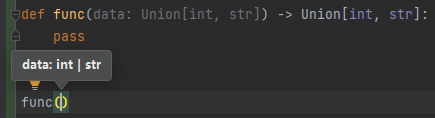
```python
# 导包
from typing import Union

# 定义联合类型注解
Union[类型1, 类型2, ...]
```
示例：
```python
def func(data: Union[int, str]) -> Union[int, str]:
    pass
```
### 多态
多态：同一个行为用不同的对象获取不同的状态。
ex: 定义一个函数（方法），通过类型注解声明需要父类对象，但实际使用时传入子类对象工作。
### 抽象类（接口）
抽象方法：没有具体实现的方法体（pass）
抽象类：包含抽象方法的类
作用：用于顶层设计(设计标准)，以便子类做具体实现。 -- 对子类的一种软性约束，要求子类必须复写(实现)父类的一些方法。

---

示例：
```python
# 定义抽象类（也可以叫接口） -- 含有抽象方法的类叫抽象类
class Animal:
    # 方法体为空实现(pass)的叫抽象方法
    def say(self):
        pass


class Dog(Animal):
    def say(self):
        print("汪~ 汪~ 汪~")


class Cat(Animal):
    def say(self):
        print("喵~ 喵~ 喵~")


# 多态
# 抽象的父类设计（设计标准）
# 具体的子类实现（实现标准）
def say(animal: Animal):
    animal.say()


dog = Dog()
say(dog)  # 汪~ 汪~ 汪~
cat = Cat()
say(cat)  # 喵~ 喵~ 喵~
```
## 操作Mysql
### pymysql
pymysql：可以对MySQL数据库进行操作的第三方库。
#### 安装
```shell
pip install pymysql
```
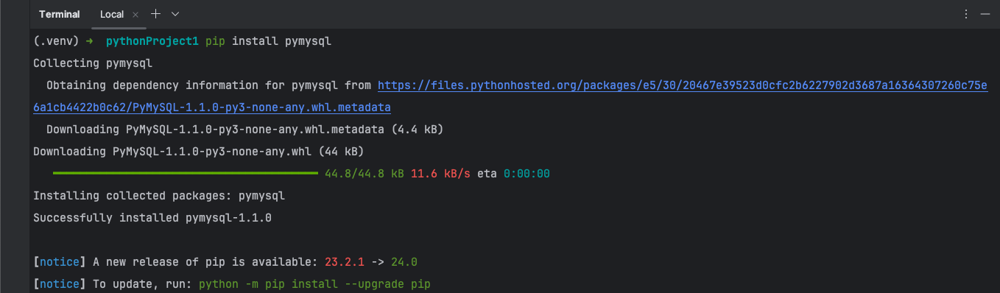
#### 使用
```python
from pymysql import Connection

# 获取mysql的链接对象
conn = Connection(
    host="localhost",  # 主机名或IP地址
    port=3306,  # 端口
    user="root",  # 账号
    password="root123456",  # 密码
    autocommit=True,  # 自动提交 -- 更新数据的时候无需手动提交commit
)

# 获取版本信息
print(conn.get_server_info())

# 拿到游标对象
cursor = conn.cursor()
conn.select_db("demo")

# 使用游标对象，执行sql语句
cursor.execute(
    "CREATE TABLE IF NOT EXISTS `t_test` ( `id` int(11) NOT NULL AUTO_INCREMENT, `name` varchar(50) DEFAULT NULL, PRIMARY KEY (`id`) ) ENGINE=InnoDB AUTO_INCREMENT=1 DEFAULT CHARSET=utf8mb4;"
)

# 插入数据
cursor.execute("insert into t_test(name) values ('小郑');")
cursor.execute("insert into t_test(name) values ('小张');")
# 手动提交数据
# conn.commit()

# 查询数据
cursor.execute("select * from t_test")
results: tuple = cursor.fetchall()
# 遍历查看元组（或对查询的结果作一系列的操作）
for item in results:
    print(item)

# 关闭链接
conn.close()
```
# 框架
### FastAPI
FastAPI 是一个用于构建 API 的现代、快速（高性能）的 web 框架，使用 Python 3.6+ 并基于标准的 Python 类型提示。
```shell
# 安装
pip install fastapi
# ASGI服务器 -- uvicorn
pip install "uvicorn[standard]"
```
#### 安装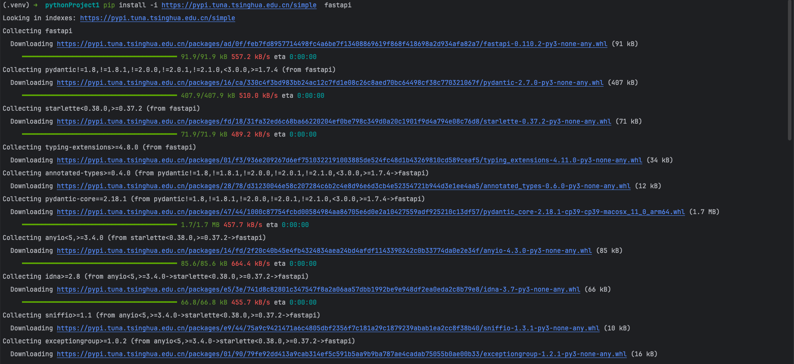
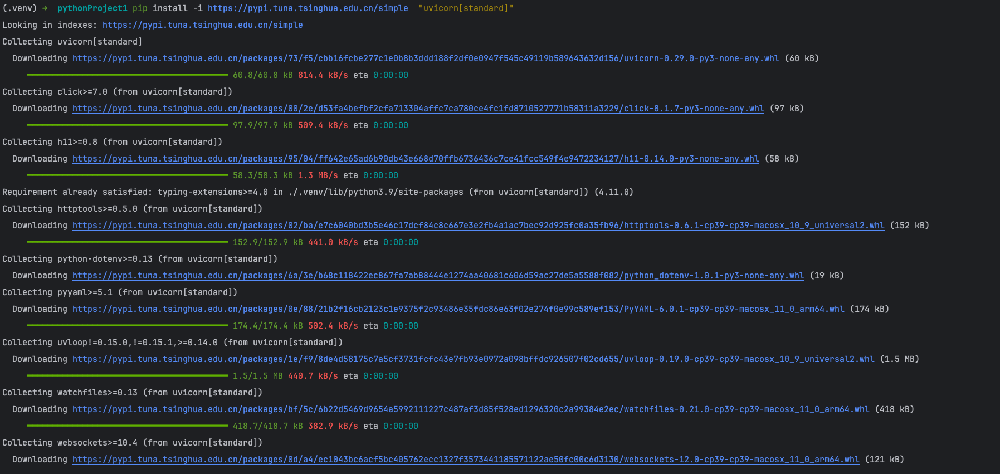
#### helloworld

- `main.py`
```python
from typing import Union

from fastapi import FastAPI

app = FastAPI()


@app.get("/")
def read_root():
    return {"Hello": "World"}


@app.get("/test/{name}")
def read_item(name: str, age: Union[int, None] = None):
    return {"name": name, "age": age}
```

- 运行
```shell
uvicorn main:app --reload --port 8000 --host 0.0.0.0
```
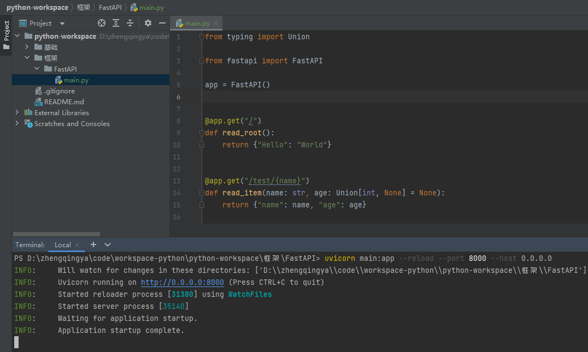

- 访问
- [http://127.0.0.1:8000](http://127.0.0.1:8000)
   - 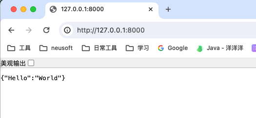
- [http://127.0.0.1:8000/test/zq?age=18](http://127.0.0.1:8000/test/zq?age=18)
   - 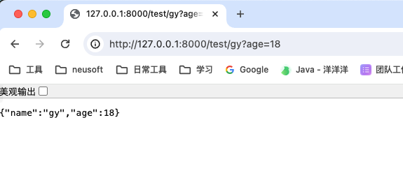
- API文档
- [http://127.0.0.1:8000/docs](http://127.0.0.1:8000/docs)
- [http://127.0.0.1:8000/redoc](http://127.0.0.1:8000/redoc)

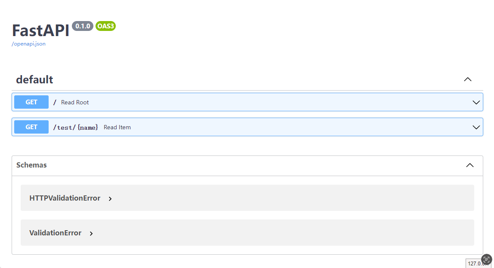

