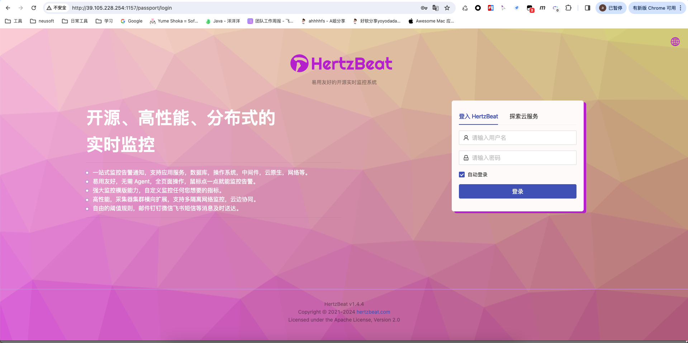
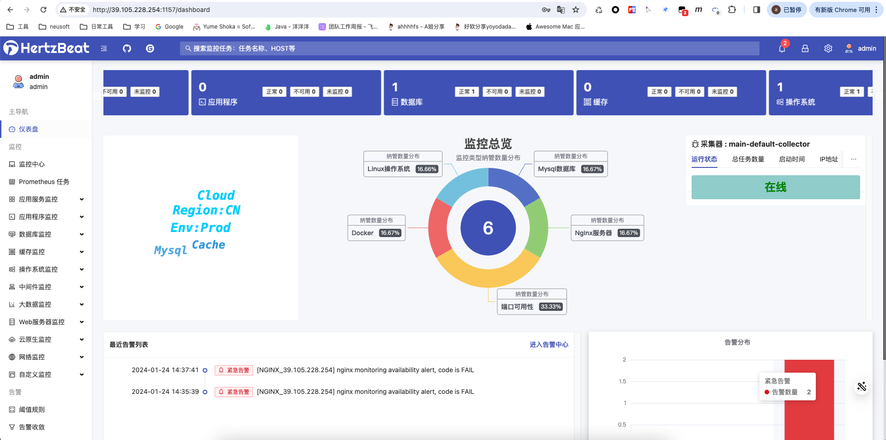
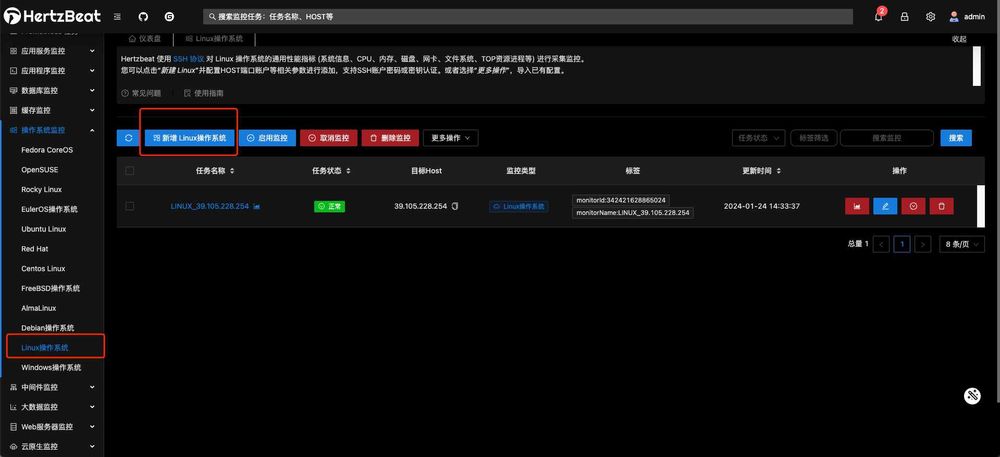
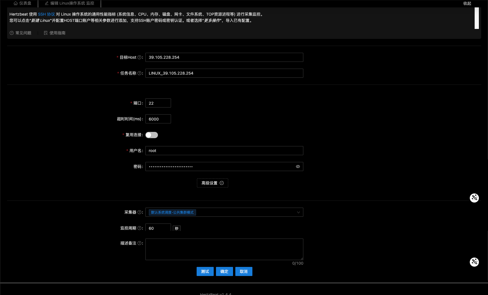
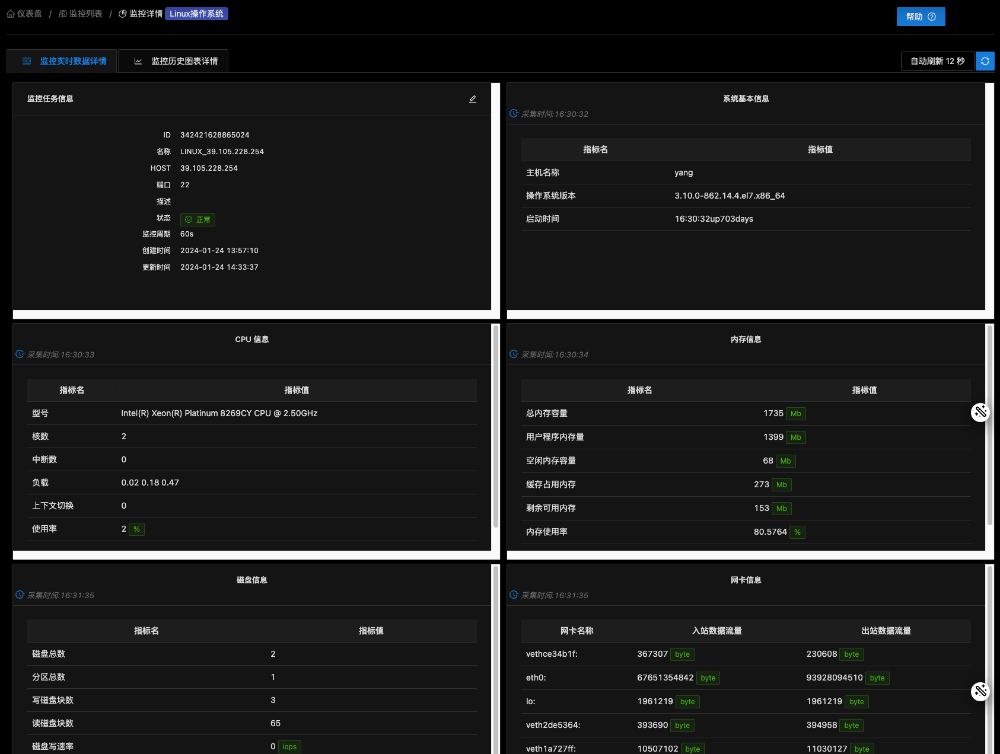
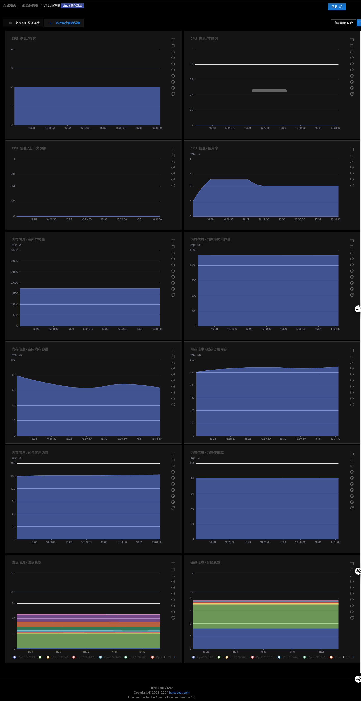
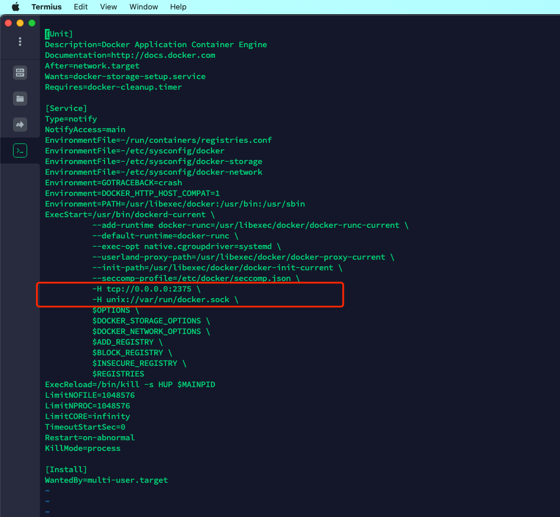

# 介绍
[HertzBeat 赫兹跳动](https://gitee.com/link?target=https%3A%2F%2Fgithub.com%2Fdromara%2Fhertzbeat) 是一个拥有强大自定义监控能力，高性能集群，兼容 Prometheus，无需 Agent 的开源实时监控告警系统。
> 易用友好的开源实时监控告警系统，无需Agent，高性能集群，兼容Prometheus，强大自定义监控能力。

- 官网：[HertzBeat · An open source, real-time monitoring tool with custom-monitor and agentLess. | HertzBeat](https://hertzbeat.com/zh-cn/)
- gitee：[dromara/hertzbeat](https://gitee.com/dromara/hertzbeat#https://gitee.com/link?target=https%3A%2F%2Fhertzbeat.com)
# 安装搭建
> HertzBeat支持通过源码安装启动，Docker容器运行和安装包方式安装部署，CPU架构支持X86/ARM64。

## 方式一：Docker方式快速安装

1. docker 环境仅需一条命令即可开始
```shell
docker run -d -p 1157:1157 -p 1158:1158 --name hertzbeat tancloud/hertzbeat

或者使用 quay.io (若 dockerhub 网络链接超时)

docker run -d -p 1157:1157 -p 1158:1158 --name hertzbeat quay.io/tancloud/hertzbeat
```

2. 浏览器访问 `http://localhost:1157` 即可开始，默认账号密码 `admin/hertzbeat`
3. 部署采集器集群
```shell
docker run -d -e IDENTITY=custom-collector-name -e MANAGER_HOST=127.0.0.1 -e MANAGER_PORT=1158 --name hertzbeat-collector tancloud/hertzbeat-collector
```

   - `-e IDENTITY=custom-collector-name` : 配置此采集器的唯一性标识符名称，多个采集器名称不能相同，建议自定义英文名称。
   - `-e MODE=public` : 配置运行模式(public or private), 公共集群模式或私有云边模式。
   - `-e MANAGER_HOST=127.0.0.1` : 配置连接主HertzBeat服务的对外IP。
   - `-e MANAGER_PORT=1158` : 配置连接主HertzBeat服务的对外端口，默认1158。
## 其他方式：请阅读官方文档：[快速开始 | HertzBeat](https://hertzbeat.com/zh-cn/docs/start/quickstart/)
# 启动

- 本次使用的是docker方式安装启动
```shell
docker run -d -p 1157:1157 -p 1158:1158 --name hertzbeat tancloud/hertzbeat
```

- 查看容器状态
```shell
[root@yang docker]# docker ps 
CONTAINER ID        IMAGE                       COMMAND                  CREATED             STATUS              PORTS                                                                                                                NAMES                                                                         nginxnew
e8159d7f701d        tancloud/hertzbeat          "./bin/entrypoint.sh"    5 hours ago         Up About an hour    22/tcp, 0.0.0.0:1157-1158->1157-1158/tcp                                                                             hertzbeat
[root@yang docker]# 
```

- 访问测试
   - 浏览器输入：`ip:1157`进入登录界面
   - 默认账号密码：`admin/hertzbeat`
   - 
   - 
   - 正常进来后的监控总览是没有的，需要后续添加
# 添加监控
## linux操作系统监控

1. 
2. 
3. 点击`测试`
4. 点击`确定`即可
5. 效果展示
   1. 
   2. 
## 其他监控同理
## 注意：
### docker监控需要开放docker服务的2375端口
#### 开放步骤：

1. 配置docker远程连接端口
```shell
vi /usr/lib/systemd/system/docker.service
```

2. 找到 ExecStart，在最后面添加 -H tcp://0.0.0.0:2375 \ -H unix://var/run/docker.sock \



3. 重启docker
```shell
systemctl daemon-reload
systemctl restart docker
```

4. 开放端口
```shell
firewall-cmd --zone=public --add-port=2375/tcp --permanent
systemctl restart firewalld.service
```
### docker端口开放后再次启动容器时报错

- 报错内容：Error response from daemon: shim error: docker-runc not installed on system
```shell
[root@localhost ~]#docker start f6d32747432a
Error response from daemon: shim error: docker-runc not installed on system
Error: failed to start containers: f6d32747432a
```

- 解决方案
   1. 首先查看/usr/libexec/docker/，建立软连接
```shell
[root@localhost ~]#cd /usr/libexec/docker/

[root@localhost ~]#sudo ln -s docker-runc-current docker-runc
```

   2. 仍报错，建立全局软连接：
```shell
[root@localhost ~]#sudo ln -s /usr/libexec/docker/docker-runc-current /usr/bin/docker-runc
```

   3. 再次尝试启动，启动成功
```shell
[root@localhost ~]#docker start f6d32747432a
f6d32747432a
```
