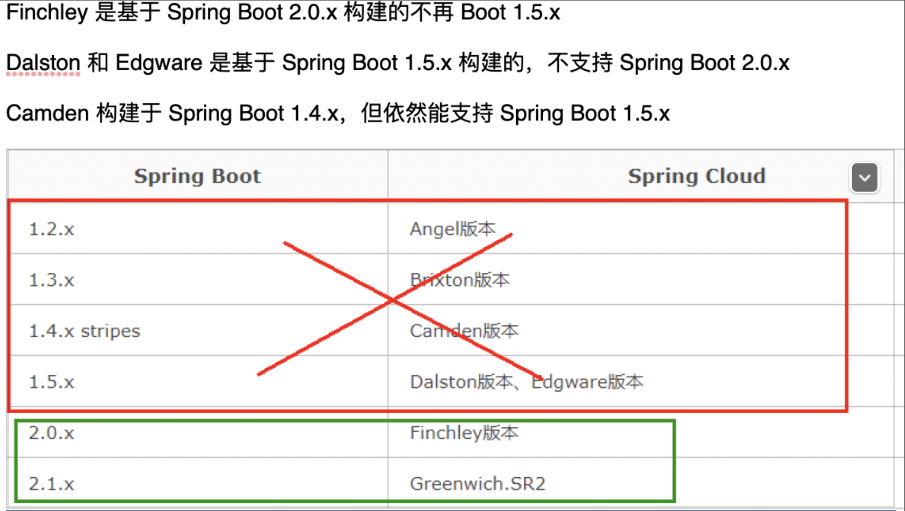
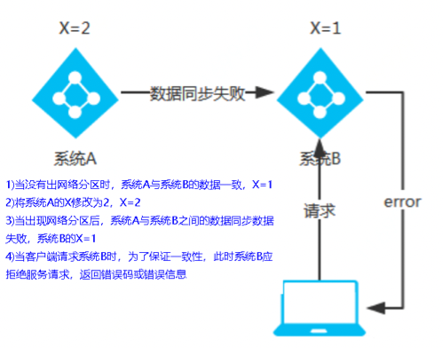
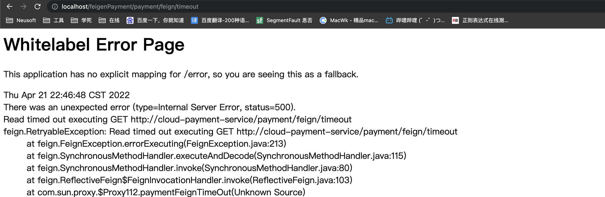
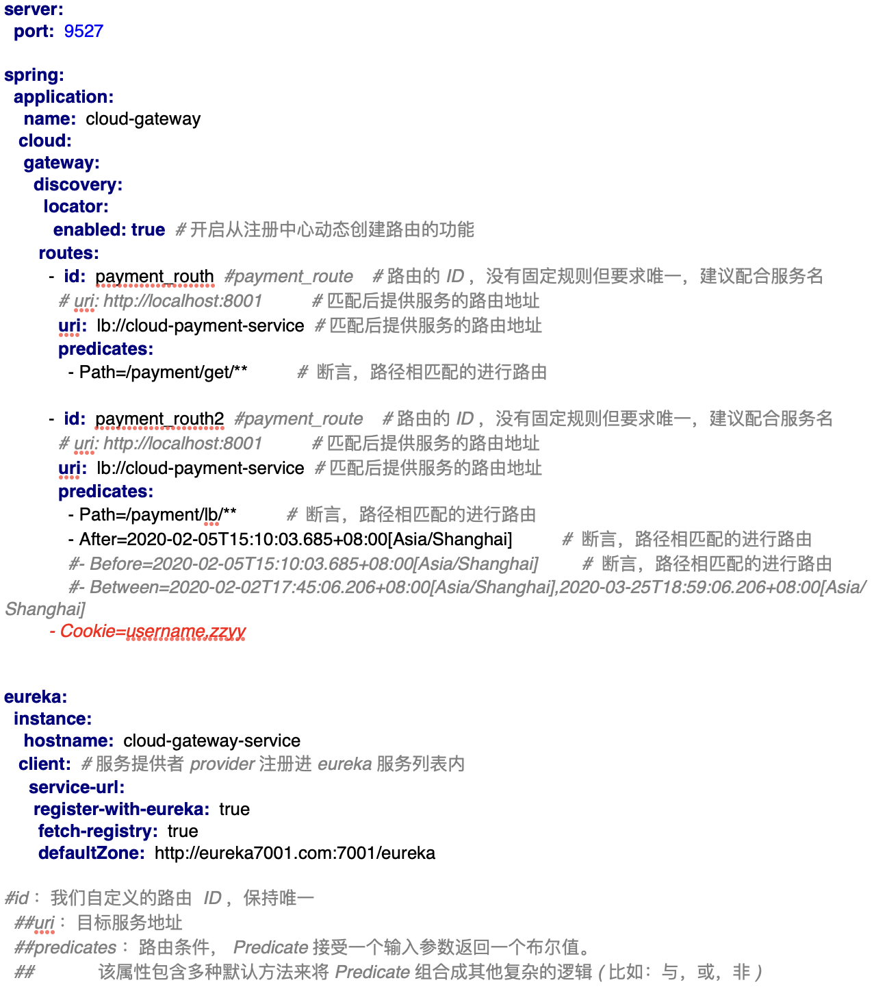
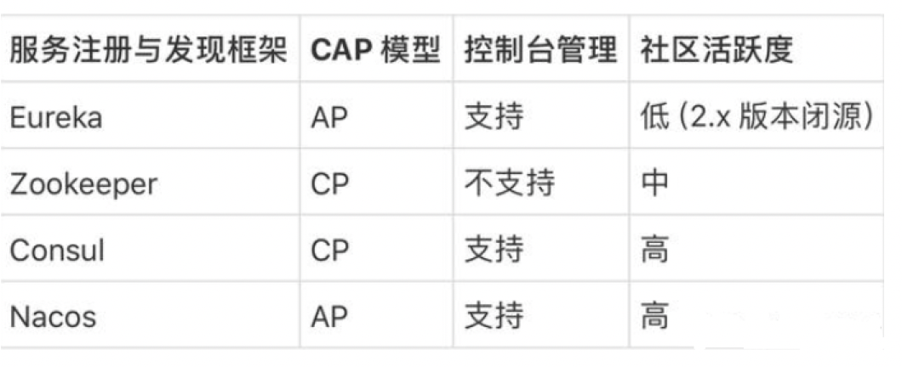
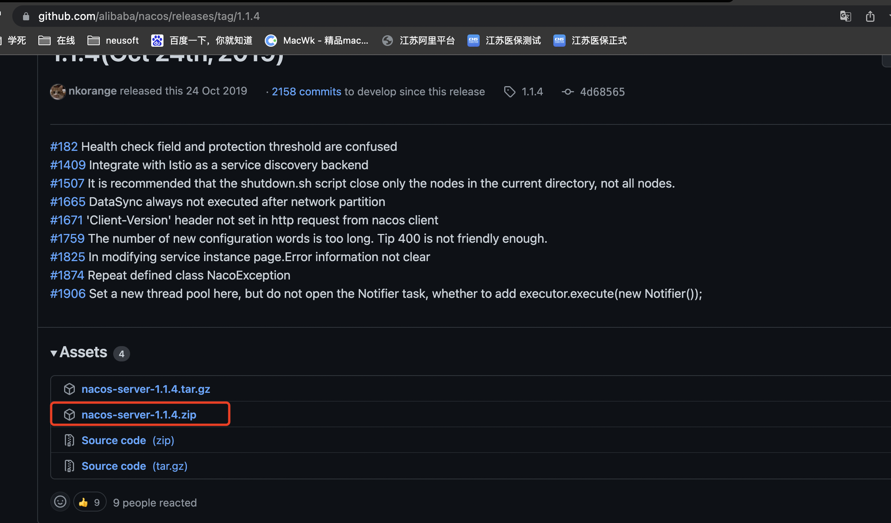
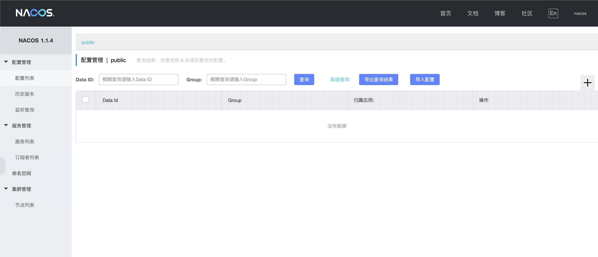
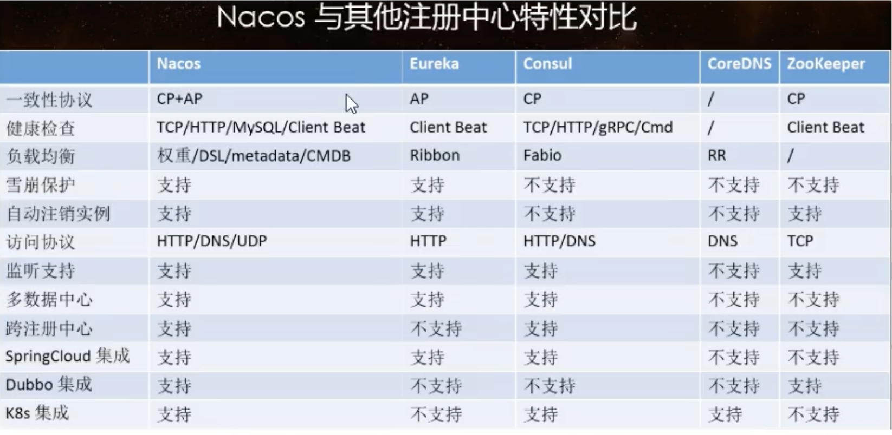
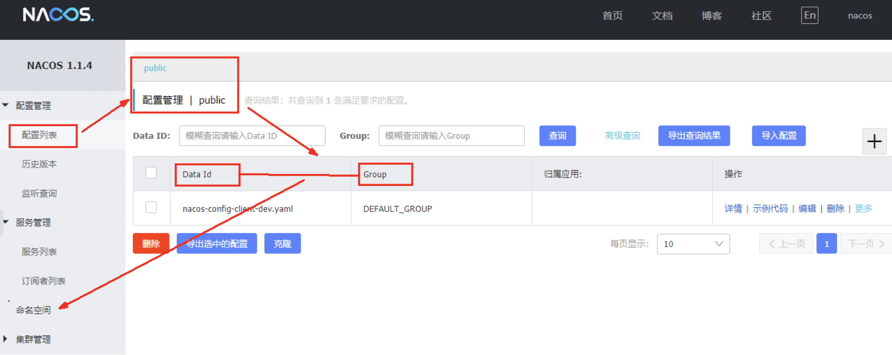

[Demo  GitHub - SoftLeaderGy/cloud: 开启springcloud奇妙之旅～](https://github.com/SoftLeaderGy/cloud)

---

# 一、boot、cloud版本选择

## 1、springboot、springcloud版本依赖关系如何查看

-  [https://spring.io/projects/spring-cloud#overview](https://spring.io/projects/spring-cloud#overview) 
-  依赖 
   - 
-  更详细的版本对应查看方法 
   - [https://start.spring.io/actuator/info](https://start.spring.io/actuator/info)
   - 查看json返回的结果 
      - 

## 2、版本选定

-  cloud：Hoxton.SR1boot： 2.2.2.RELEASE 
-  cloud alibaba：2.1.0.RELEASE 
-  Java：8Maven：3.5及以上 
-  Mysql：5.7及以上boot 2.2.4 
-  最新，为什么选择2.2.2？ 
   -  只用boot，直接用最新，没有问题 
   -  同时用boot和cloud，需要照顾cloud，由cloud决定boot的版本 
      - 
   -  SpringCloud和SpringBoot版本对应关系 
      - 
-  **2.X**版本常用的组件**pom** 
   - 

# 二、关于cloud各种组件

## 1、停更/升级/替换明细条目

-  

## 2、参考资料见官网

-  Spring Cloud 
   -  [https://cloud.spring.io/spring-cloud-static/Hoxton.SR1/reference/htmlsingle/](https://cloud.spring.io/spring-cloud-static/Hoxton.SR1/reference/htmlsingle/) 
   -  cloud中文文档 
      - [https://www.bookstack.cn/read/spring-cloud-docs/docs-index.md](https://www.bookstack.cn/read/spring-cloud-docs/docs-index.md)
-  Spring Boot 
   - [https://docs.spring.io/spring-boot/docs/2.2.2.RELEASE/reference/htmlsingle/](https://docs.spring.io/spring-boot/docs/2.2.2.RELEASE/reference/htmlsingle/)

# 三、微服务架构编码构建

> 约定 > 配置> 编码


## 1、Idea新建project工作空间

### 1、微服务cloud整体聚合父工程Project

-  New Project 
   - 
-  File Types过滤文件 
   - 

### 2、父工程pom文件

-  pom.xml 
```xml
    <groupId>com.yang</groupId>
    <artifactId>cloud</artifactId>
    <version>1.0-SNAPSHOT</version>
    <packaging>pom</packaging>

    <!--统一管理jar包版本-->
    <properties>
        <project.build.sourceEncoding>UTF-8</project.build.sourceEncoding>
        <maven.compiler.source>1.8</maven.compiler.source>
        <maven.compiler.target>1.8</maven.compiler.target>
        <junit.version>4.12</junit.version>
        <lombok.version>1.16.18</lombok.version>
        <log4j.version>1.2.17</log4j.version>
        <mysql.version>8.0.18</mysql.version>
        <druid.version>1.1.16</druid.version>
        <mybatis.spring.boot.version>2.1.1</mybatis.spring.boot.version>
    </properties>
    <!--子模块继承之后，提供作用：锁定版本+子module不用谢groupId和version-->
    <dependencyManagement>
    <dependencies>
<!--    <dependency>-->
<!--        <groupId>org.apache.maven.plugins</groupId>-->
<!--        <artifactId>maven-project-info-reports-plugin</artifactId>-->
<!--        <version>3.0.0</version>-->
<!--    </dependency>-->
    <!--spring boot 2.2.2-->
    <dependency>
        <groupId>org.springframework.boot</groupId>
        <artifactId>spring-boot-dependencies</artifactId>
        <version>2.2.2.RELEASE</version>
        <type>pom</type>
        <scope>import</scope>
    </dependency>
    <!--spring cloud Hoxton.SR1-->
    <dependency>
        <groupId>org.springframework.cloud</groupId>
        <artifactId>spring-cloud-dependencies</artifactId>
        <version>Hoxton.SR1</version>
        <type>pom</type>
        <scope>import</scope>
    </dependency>
    <!--spring cloud 阿里巴巴-->
    <dependency>
        <groupId>com.alibaba.cloud</groupId>
        <artifactId>spring-cloud-alibaba-dependencies</artifactId>
        <version>2.1.0.RELEASE</version>
        <type>pom</type>
        <scope>import</scope>
    </dependency>
    <!--mysql-->
    <dependency>
        <groupId>mysql</groupId>
        <artifactId>mysql-connector-java</artifactId>
        <version>${mysql.version}</version>
        <scope>runtime</scope>
    </dependency>
    <!-- druid-->
    <dependency>
        <groupId>com.alibaba</groupId>
        <artifactId>druid</artifactId>
        <version>${druid.version}</version>
    </dependency>
        <!--mybatis-->
        <dependency>
            <groupId>org.mybatis.spring.boot</groupId>
            <artifactId>mybatis-spring-boot-starter</artifactId>
            <version>${mybatis.spring.boot.version}</version>
        </dependency>
        <!--junit-->
        <dependency>
            <groupId>junit</groupId>
            <artifactId>junit</artifactId>
            <version>${junit.version}</version>
        </dependency>
        <!--log4j-->
        <dependency>
            <groupId>log4j</groupId>
            <artifactId>log4j</artifactId>
            <version>${log4j.version}</version>
        </dependency>
    </dependencies>
    </dependencyManagement>
    <build>
        <plugins>
            <plugin>
                <groupId>org.springframework.boot</groupId>
                <artifactId>spring-boot-maven-plugin</artifactId>
                <configuration>
                    <fork>true</fork>
                    <addResources>true</addResources>
                </configuration>
            </plugin>
        </plugins>
    </build>
```


### 3、dependencyManagement 和 dependency区别

> Maven 使用dependencyManagement 元素来提供了一种管理依赖版本号的方式。 通常会在一个组织或者项目的最顶层的父POM 中看到dependencyManagement 元素。


- 使用pom.xml 中的dependencyManagement 元素能让所有在子项目中引用一个依赖而不用显式的列出版本号。
- Maven 会沿着父子层次向上走，直到找到一个拥有dependencyManagement 元素的项目，然后它就会使用这个 dependencyManagement 元素中指定的版本号。
- 
- 好处： 
   - 如果有多个子项目都引用同一样依赖，则可以避免在每个使用的子项目里都声明一个版本号，这样当想升级或切换到另一个版本时，只需要在顶层父容器里更新，而不需要一个一个子项目的修改 ；
   - 另外如果某个子项目需要另外的一个版本，只需要声明version就可。
- 注意 
   - dependencyManagement里只是声明依赖， **并不实现引入** ，因此子项目需要显示的声明需要用的依赖。
   - 如果不在子项目中声明依赖，是不会从父项目中继承下来的；只有在子项目中写了该依赖项，并且没有指定具体版本， 才会从父项目中继承该项，并且version和scope都读取自父pom;
   - 如果子项目中指定了版本号，那么会使用子项目中指定的jar版本。

## 2、Rest微服务工程构建

### 1、构建步骤

#### 1、cloud-provider-payment8001

> （微服务提供者支付Module模块）


-  建cloud-provider-payment8001 ——> 创建完成后请回到父工程查看pom文件变化 
-  改POM 
```xml
    <artifactId>cloud-provider-payment8001</artifactId>


    <dependencies>
        <dependency>
            <groupId>org.springframework.boot</groupId>
            <artifactId>spring-boot-starter-web</artifactId>
        </dependency>
        <dependency>
            <groupId>org.springframework.boot</groupId>
            <artifactId>spring-boot-starter-actuator</artifactId>
        </dependency>
        <dependency>
            <groupId>org.mybatis.spring.boot</groupId>
            <artifactId>mybatis-spring-boot-starter</artifactId>
        </dependency>
        <dependency>
            <groupId>com.alibaba</groupId>
            <artifactId>druid-spring-boot-starter</artifactId>
            <version>1.2.8</version>
        </dependency>
<!--        mysql-connector-java-->
        <dependency>
            <groupId>mysql</groupId>
            <artifactId>mysql-connector-java</artifactId>
        </dependency>
        <!--jdbc-->
        <dependency>
            <groupId>org.springframework.boot</groupId>
            <artifactId>spring-boot-starter-jdbc</artifactId>
        </dependency>
        <dependency>
            <groupId>org.springframework.boot</groupId>
            <artifactId>spring-boot-devtools</artifactId>
            <scope>runtime</scope>
            <optional>true</optional>
        </dependency>
        <dependency>
            <groupId>org.projectlombok</groupId>
            <artifactId>lombok</artifactId>
            <optional>true</optional>
        </dependency>
        <dependency>
            <groupId>org.springframework.boot</groupId>
            <artifactId>spring-boot-starter-test</artifactId>
            <scope>test</scope>
        </dependency>
    </dependencies>
```


-  写yml 
```yaml
server:
  port: 8001
spring:
  application:
    name: cloud-payment-service
  datasource:
    type: com.alibaba.druid.pool.DruidDataSource  # 当前数据源操作类型
    driver-class-name: com.mysql.jdbc.Driver   # mysql 驱动包 com.mysql.jdbc.Driver
    url: jdbc:mysql://localhost:3306/db2019?useUnicode=true&characterEncoding=utf-8&useSSL=false
    username: root
    password: 123456
mybatis:
  mapperLocations: classpath:mapper/*.xml
  type-aliases-package: com.atguigu.springcloud.entities  # 所有 Entity 别名类所在包
```


-  主启动 
```java
import org.springframework.boot.SpringApplication;
import org.springframework.boot.autoconfigure.SpringBootApplication;

/**
 * @Description:
 * @Author: Guo.Yang
 * @Date: 2022/04/14/23:33
 */
@SpringBootApplication
public class PaymentMain8001 {
    public static void main(String[] args) {
        SpringApplication.run(PaymentMain8001.class,args);
    }
}
```


-  业务类 
   - db
   - Dao
   - Service
   - Controller

#### 2、**cloud-consumer-order80**

> 微服务消费者订单Module模块


-  建cloud-consumer-order80 
   -  改pom 
```xml
    <artifactId>cloud-consumer-order80</artifactId>

    <dependencies>
        <dependency>
            <groupId>org.springframework.boot</groupId>
            <artifactId>spring-boot-starter-web</artifactId>
        </dependency>
        <dependency>
            <groupId>org.springframework.boot</groupId>
            <artifactId>spring-boot-starter-actuator</artifactId>
        </dependency>
        <dependency>
            <groupId>org.springframework.boot</groupId>
            <artifactId>spring-boot-devtools</artifactId>
            <scope>runtime</scope>
            <optional>true</optional>
        </dependency>
        <dependency>
            <groupId>org.projectlombok</groupId>
            <artifactId>lombok</artifactId>
            <optional>true</optional>
        </dependency>
        <dependency>
            <groupId>org.springframework.boot</groupId>
            <artifactId>spring-boot-starter-test</artifactId>
            <scope>test</scope>
        </dependency>
    </dependencies>
```


   -  写yml 
```yaml
server:
  port: 80
```


   -  主启动 
```java
@SpringBootApplication
public class OrderMain80 {
    public static void main(String[] args) {
        SpringApplication.run(OrderMain80.class,args);
    }
}
```


   -  业务类 
      -  首说RestTemplate 
         -  是什么？ 
            -  RestTemplate提供了多种便捷访问远程Http服务的方法，
            是一种简单便捷的访问restful服务模板类，是Spring提供的用于访问Rest服务的 客户端模板工具集 
         -  官网及使用 
            -  官网地址
            [https://docs.spring.io/spring-framework/docs/5.2.2.RELEASE/javadoc-api/org/springframework/web/client/RestTemplate.html](https://docs.spring.io/spring-framework/docs/5.2.2.RELEASE/javadoc-api/org/springframework/web/client/RestTemplate.html) 
            -  使用
            使用restTemplate访问restful接口非常的简单粗暴无脑。 (url, requestMap, ResponseBean.class)这三个参数分别代表 ：REST请求地址、请求参数、HTTP响应转换被转换成的对象类型。 
   -  
      -  config（ApplicationContextConfig） 
         -  
> RestTemplate配置类，可注入后使用。

 

      -  controller 
```java
/**
 * @Description:
 * @Author: Guo.Yang
 * @Date: 2022/04/15/22:14
 */
@RestController
@Slf4j
public class OrderController {

    private static final String PAYMENT_URL= "http://localhost:8001";
    @Autowired
    private RestTemplate restTemplate;

    @GetMapping("/consumer/payment/create")
    public CommonResult<Payment> create(Payment payment){
        return restTemplate.postForObject(PAYMENT_URL+ "/payment/create",payment,CommonResult.class);
    }

    @GetMapping("/consumer/payment/get/{id}")
    public CommonResult<Payment> getPayment(@PathVariable("id") Long id){
        return restTemplate.getForObject(PAYMENT_URL + "/payment/getPaymentById/" + id ,CommonResult.class);
    }
}
```


      -  entity（实体）-- 略 
   -  测试 
   -  
> 调用order80服务接口，接口使用restTemplate调用了8001服务端口。

 

      - [http://localhost/consumer/payment/create?serial=1qwe](http://localhost/consumer/payment/create?serial=1qwe)
      - [http://localhost/consumer/payment/get/1](http://localhost/consumer/payment/get/1)

#### 3、工程重构

-  问题 
> 不同的服务如果需要相同的实体，或相同的工具类，每个服务都会有，代码冗余。


-  新建cloud-api-commons服务 
-  pom 
```xml
<dependencies>
    <dependency>
        <groupId>org.springframework.boot</groupId>
        <artifactId>spring-boot-devtools</artifactId>
        <scope>runtime</scope>
        <optional>true</optional>
    </dependency>
    <dependency>
        <groupId>org.projectlombok</groupId>
        <artifactId>lombok</artifactId>
        <optional>true</optional>
    </dependency>
    <dependency>
        <groupId>cn.hutool</groupId>
        <artifactId>hutool-all</artifactId>
        <version>5.3.10</version>
    </dependency>
</dependencies>
```


-  在cloud-api-commons服务创建实体 
   - entity
-  maven打成jar包 
-  订单80服务和支付8001服务分别改造 
   -  删除原有的entity包 
   -  在80服务、8001服务pom文件引入 
```xml
<!--引入自己定义的 api 通用包，可以使用 Payment 支付 Entity -->
<dependency>
  <groupId>com.yang</groupId>
  <artifactId>cloud-api-commons</artifactId>
  <version>1.0-SNAPSHOT</version>
  <scope>compile</scope>
</dependency>
```


      - 测试

# 四、Eureka服务注册与发现

## 1、Eureka基础知识

### 1、什么是服务治理？

- Spring Cloud 封装了 Netflix 公司开发的 Eureka 模块来 实现服务治理
- 在传统的rpc远程调用框架中，管理每个服务与服务之间依赖关系比较复杂，管理比较复杂，所以需要使用服务治理，管理服务于服务之间依赖关系，可以实现服务调用、负载均衡、容错等，实现服务发现与注册。

### 2、什么是服务注册？

-  Eureka采用了CS的设计架构，Eureka Server 作为服务注册功能的服务器，它是服务注册中心。而系统中的其他微服务，使用 Eureka的客户端连接到 Eureka Server并维持心跳连接。这样系统的维护人员就可以通过 Eureka Server 来监控系统中各个微服务是否正常运行。 
-  在服务注册与发现中，有一个注册中心。当服务器启动的时候，会把当前自己服务器的信息 比如 服务地址通讯地址等以别名方式注册到注册中心上。另一方（消费者|服务提供者），以该别名的方式去注册中心上获取到实际的服务通讯地址，然后再实现本地RPC调用RPC远程调用框架核心设计思想：在于注册中心，因为使用注册中心管理每个服务与服务之间的一个依赖关系(服务治理概念)。在任何rpc远程框架中，都会有一个注册中心(存放服务地址相关信息(接口地址))


### 3、Eureka两个组件（Eureka Server和Eureka Client ）

-  Eureka Server 提供服务注册服务
各个微服务节点通过配置启动后，会在EurekaServer中进行注册，这样EurekaServer中的服务注册表中将会存储所有可用服务节点的信息，服务节点的信息可以在界面中直观看到。 
-  EurekaClient 通过注册中心进行访问
是一个Java客户端，用于简化Eureka Server的交互，客户端同时也具备一个内置的、使用轮询(round-robin)负载算法的负载均衡器。在应用启动后，将会向Eureka Server发送心跳(默认周期为30秒)。如果Eureka Server在多个心跳周期内没有接收到某个节点的心跳，EurekaServer将会从服务注册表中把这个服务节点移除（默认90秒） 

## 2、单机Eureka构建步骤

### 1、IDEA生成eurekaServer端服务注册中心（7001端口）

-  建Module（cloud-eureka-server7001） 
-  改pom 
```xml
    <dependencies>
        <!--    引入eureka组件-->
        <dependency>
            <groupId>org.springframework.cloud</groupId>
            <artifactId>spring-cloud-starter-netflix-eureka-server</artifactId>
        </dependency>
        <!--引入自己定义的 api 通用包，可以使用 Payment 支付 Entity -->
        <dependency>
            <groupId>com.yang</groupId>
            <artifactId>cloud-api-commons</artifactId>
            <version>1.0-SNAPSHOT</version>
            <scope>compile</scope>
        </dependency>
        <dependency>
            <groupId>org.springframework.boot</groupId>
            <artifactId>spring-boot-starter-web</artifactId>
        </dependency>
        <dependency>
            <groupId>org.springframework.boot</groupId>
            <artifactId>spring-boot-starter-actuator</artifactId>
        </dependency>
        <dependency>
            <groupId>org.springframework.boot</groupId>
            <artifactId>spring-boot-devtools</artifactId>
            <scope>runtime</scope>
            <optional>true</optional>
        </dependency>
        <dependency>
            <groupId>org.projectlombok</groupId>
            <artifactId>lombok</artifactId>
            <optional>true</optional>
        </dependency>
        <dependency>
            <groupId>org.springframework.boot</groupId>
            <artifactId>spring-boot-starter-test</artifactId>
            <scope>test</scope>
        </dependency>
        <dependency>
            <groupId>junit</groupId>
            <artifactId>junit</artifactId>
        </dependency>
    </dependencies>
```


-  写yml 
```yaml
server:
  port: 7001
eureka:
  instance:
    hostname: localhost # eureka服务端的实例
  client:
    # false 表示不向服务中心注册自己
    register-with-eureka: false
    # false 表示自己端就是服务注册中心,我的服务是维护服务实例，不需要检索服务
    fetch-registry: false
    service-url:
      # 设置与Eureka Server交互的地址查询服务和注册服务都需要这个地址
      defaultZone: http://${eureka.instance.hostname}:${server.port}/eureka/
```


-  主启动 
```java
@SpringBootApplication
@EnableEurekaServer // 表示该服务为EurekaServer （注册中心） 
public class EurekaMain7001 {
    public static void main(String[] args) {
        SpringApplication.run(EurekaMain7001.class,args);
    }
}
```


-  测试
启动服务后访问：[http://localhost:7001/](http://localhost:7001/) 

### 2、EurekaClient端cloud-provider-payment8001

> 将cloud-provider-payment8001注册进EurekaServer成为服务提供者provider


-  改pom 
```xml
<!--        引入eureka-client-->
        <dependency>
            <groupId>org.springframework.cloud</groupId>
            <artifactId>spring-cloud-starter-netflix-eureka-client</artifactId>
        </dependency>
```


-  写yml 
```yaml
#eureka配置
eureka:
  client:
    # 将自己注册进eureka注册中心中
    register-with-eureka: true
    # 是否从 EurekaServer 抓取已有的注册信息，默认为 true 。单节点无所谓，集群必须设置为 true 才能配合 ribbon 使用负载均衡
    fetch-registry: true
    # eureka注册中心服务的地址
    service-url:
      defaultZone: http://localhost:7001/eureka
```


-  主启动 
```java
@SpringBootApplication
@EnableEurekaClient // 添加EnableEurekaClien 表示该服务为erueka的客户端，需要将其注册进eureka里
public class PaymentMain8001 {
    public static void main(String[] args) {
        SpringApplication.run(PaymentMain8001.class,args);
    }
}
```


-  测试
访问：[http://localhost:7001/](http://localhost:7001/)


### 3、EurekaClient端cloud-consumer-order80

> 将cloud-consumer-order80服务注册进eureka中


- 步骤与cloud-provider-payment8001注册相同，此处略过

## 3、集群Eureka构建步骤

> **Eureka集群的每个服务都是，相互注册，互相守望**
>  
> 例如：有两个eureka注册中心，他两个想搭建集群，7001需要向7002注册，7002要想7001服务注册


### 1、Eureka集群原理说明


-  问题：微服务RPC远程服务调用最核心的是什么 ？
高可用，试想你的注册中心只有一个only one， 它出故障了那就呵呵(￣▽￣)"了，会导致整个为服务环境不可用，所以 
-  解决办法：搭建Eureka注册中心集群 ，实现负载均衡+故障容错 

### 2、EurekaServer集群构建步骤

-  参考cloud-eureka-server7001 新建 参考cloud-eureka-server7002 
-  改pom（与7001相同） 
-  修改Host文件
由于是本机搭建eureka集群，两个服务的eureka实例不可以配置不能相同，
通过修改Host文件的域名即可 
```
127.0.0.1       eureka7001.com
127.0.0.1       eureka7002.com
127.0.0.1       eureka7003.com
```


-  改yml 
   -  7001 
```yaml
server:
  port: 7001
eureka:
  instance:
    hostname: eureka7001.com # eureka服务端的实例
  client:
    # false 表示不向服务中心注册自己
    register-with-eureka: false
    # false 表示自己端就是服务注册中心,我的服务是维护服务实例，不需要检索服务
    fetch-registry: false
    service-url:
      # 设置与Eureka Server交互的地址查询服务和注册服务都需要这个地址
      defaultZone: http://eureka7002.com:7002/eureka/
```


   -  7002 
```yaml
server:
  port: 7002
eureka:
  instance:
    hostname: eureka7002.com # eureka服务端的实例
  client:
    # false 表示不向服务中心注册自己
    register-with-eureka: false
    # false 表示自己端就是服务注册中心,我的服务是维护服务实例，不需要检索服务
    fetch-registry: false
    service-url:
      # 设置与Eureka Server交互的地址查询服务和注册服务都需要这个地址
      defaultZone: http://eureka7001.com:7001/eureka/
```


-  主启动（与7001相同） 
-  测试 
```
http://localhost:7001/
http://localhost:7002/
```


### 3、将服务8001微服务发布到上面2台Eureka集群配置中

-  改yml
注册进多个eureka服务可添加多个连接，以 “ ,” 分割即可 
```yaml
    service-url:
      defaultZone: http://eureka7001.com:7001/eureka/,http://eureka7001.com:7002/eureka/
```


### 4、将服务8001微服务发布到上面2台Eureka集群配置中

- 改pom （以8001步骤相同）

### 5、修改8001 和 8002 服务的ServiceImpl 的返回结果来监测调用的是哪个服务

-  
```java
    @Value("${server.port}")
    private String port;
    @Override
    public CommonResult create(Payment payment) {
        int i = paymentDao.create(payment);
        if (i > 0) {
            return new CommonResult<>(200,"添加成功 端口为："+ port);
        }
        return new CommonResult(444,"操作失败");
    }
```


### 6、测试

1.  先要启动EurekaServer，7001/7002服务 
2.  再要启动服务提供者provider，8001 
3.  再要启动消费者，80 
4.  [http://localhost/consumer/payment/get/1](http://localhost/consumer/payment/get/1) 
5.  问题出现
   
   -  端口始终是8001，是因为当前我们在使用restTemplate调用是时候直接将调用的url写死了
      这样明显是不合理的，需要修改 
      -  **修改** 
         1.  将80服务的restTemplate调用的地址修改为以注册中心调用服务的方式进行 
```java
    private static final String PAYMENT_URL= "http://CLOUD-PAYMENT-SERVICE";\
```


         2.  开启负载均衡
在配置RestTemplate 时 添加注解[@LoadBalanced ](/LoadBalanced )  
```java
@Configuration
public class ApplicationContextConfig {

    @Bean
    @LoadBalanced
    public RestTemplate restTemplate(){
        return new RestTemplate();
    }
}
```


   -  端口在8001、8002之间进行切换（服务进行轮询调用） 

## 4、actuator微服务信息完善

-  当前Eureka显示服务形式为

-  修改服务的别名，并点击显示主机地址 
   1.  修改8001、8002服务的yml 
```yaml
logging:
  level:
    com.yang.springcloud.dao: debug
#    eureka配置
eureka:
  client:
    # 将自己注册进eureka注册中心中
    register-with-eureka: true
    # 是否从 EurekaServer 抓取已有的注册信息，默认为 true 。单节点无所谓，集群必须设置为 true 才能配合 ribbon 使用负载均衡
    fetch-registry: true
    # eureka注册中心服务的地址
    service-url:
      defaultZone: http://eureka7001.com:7001/eureka/,http://eureka7001.com:7002/eureka/
  instance:
    instance-id: payment8002  # Eureka显示服务的别名
    prefer-ip-address: true # 点击服务别名显示服务地址
```


   2.  重启服务测试、观察Eureka中8001、8002服务名称变化 
-  修改后


## 5、服务发现Discovery

> 对于注册进eureka里面的微服务，可以通过服务发现来获得该服务的信息


-  修改cloud-provider-payment8001的Controller 
```java
    @Autowired
    private DiscoveryClient discoveryClient;    


		@GetMapping("/getPaymentById/discovery")
    public Object discovery(){
        // 获取注册进eureka的所有服务
        List<String> services = discoveryClient.getServices();
        for (String service : services) {
            log.info("service: "+ service);
        }

        // 获取某个服务中的所有实例信息
        List<ServiceInstance> instances = discoveryClient.getInstances("CLOUD-PAYMENT-SERVICE");
        for (ServiceInstance instance : instances) {
            log.info("实例："+ instance);
            log.info("服务主机："+ instance.getHost() + "端口："+ instance.getPort() + "地址：" + instance.getUri());
        }
        return discoveryClient;
    }
```


-  8001服务的启动类
启动上添加注解 
```java
@EnableDiscoveryClient
```


-  自测
	访问http://localhost:8001/payment/getPaymentById/discovery
	

		日志

```
service: cloud-payment-service
实例：org.springframework.cloud.netflix.eureka.EurekaDiscoveryClient$EurekaServiceInstance@3c61b61d
服务主机：192.168.1.101端口：8002地址：http://192.168.1.101:8002
实例：org.springframework.cloud.netflix.eureka.EurekaDiscoveryClient$EurekaServiceInstance@3f5262df
服务主机：192.168.1.101端口：8001地址：http://192.168.1.101:8001
```

## 6、Eureka自我保护机制

### 1、导致原因

-  为什么产生Eureka自我保护机制？
为了防止EurekaClient可以正常运行，但是 与 EurekaServer网络不通情况下，EurekaServer 不会立刻 将EurekaClient服务剔除 
-  什么是自我保护模式？
默认情况下，如果EurekaServer在一定时间内没有接收到某个微服务实例的心跳，EurekaServer将会注销该实例（默认90秒）。但是当网络分区故障发生(延时、卡顿、拥挤)时，微服务与EurekaServer之间无法正常通信，以上行为可能变得非常危险了——因为微服务本身其实是健康的， 此时本不应该注销这个微服务 。Eureka通过“自我保护模式”来解决这个问题——当EurekaServer节点在短时间内丢失过多客户端时（可能发生了网络分区故障），那么这个节点就会进入自我保护模式。


	在自我保护模式中，Eureka Server会保护服务注册表中的信息，不再注销任何服务实例。

-  它的设计哲学就是宁可保留错误的服务注册信息，也不盲目注销任何可能健康的服务实例 。一句话讲解：好死不如赖活着 
-  综上，自我保护模式是一种应对网络异常的安全保护措施。它的架构哲学是宁可同时保留所有微服务（健康的微服务和不健康的微服务都会保留）也不盲目注销任何健康的微服务。使用自我保护模式，可以让Eureka集群更加的健壮、稳定。 

### 2、怎么禁止自我保护

-  注册中心eureakeServer端7001 
   1. 默认是开启的自我保护机制的
   2. 使用eureka.server.enable-self-preservation = false 可以禁用自我保护模式
-  生产者客户端eureakeClient端8001 
   1.  设置发送心跳包的时间
   **eureka.instance.lease-renewal-interval-in-seconds**=**30** 
   2.  设置服务断连的超时时间
   **eureka.instance.lease-expiration-duration-in-seconds**=**90** 

# 五、Zookeeper服务注册与服务

## 1、Zookeeper服务安装

- 本机为mac 直接就`brew install zookeeper` 安装
- 启动：zkServer
- 连接客户端：zkCli

## 2、SpringCloud整合Zookeeper代替Eureka

### 1、注册中心Zookeeper

> zookeeper是一个分布式协调工具，可以实现注册中心功能


- 启动zookeeper服务器
- zookeeper服务器取代Eureka服务器，zk作为服务注册中心

## 3、服务提供者

### 1、新建cloud-provider-payment8004

-  pom 
```xml
    <dependencies>
        <dependency>
            <groupId>org.springframework.boot</groupId>
            <artifactId>spring-boot-starter-web</artifactId>
        </dependency>
        <dependency>
            <groupId>org.springframework.boot</groupId>
            <artifactId>spring-boot-starter-actuator</artifactId>
        </dependency>
        <dependency>
            <groupId>org.mybatis.spring.boot</groupId>
            <artifactId>mybatis-spring-boot-starter</artifactId>
        </dependency>
        <dependency>
            <groupId>com.alibaba</groupId>
            <artifactId>druid-spring-boot-starter</artifactId>
            <version>1.2.8</version>
        </dependency>
        <!--        mysql-connector-java-->
        <dependency>
            <groupId>mysql</groupId>
            <artifactId>mysql-connector-java</artifactId>
        </dependency>
        <!--jdbc-->
        <dependency>
            <groupId>org.springframework.boot</groupId>
            <artifactId>spring-boot-starter-jdbc</artifactId>
        </dependency>
        <dependency>
            <groupId>org.springframework.boot</groupId>
            <artifactId>spring-boot-devtools</artifactId>
            <scope>runtime</scope>
            <optional>true</optional>
        </dependency>
        <dependency>
            <groupId>org.projectlombok</groupId>
            <artifactId>lombok</artifactId>
            <optional>true</optional>
        </dependency>
        <dependency>
            <groupId>org.springframework.boot</groupId>
            <artifactId>spring-boot-starter-test</artifactId>
            <scope>test</scope>
        </dependency>
        <!--引入自己定义的 api 通用包，可以使用 Payment 支付 Entity -->
        <dependency>
            <groupId>com.yang</groupId>
            <artifactId>cloud-api-commons</artifactId>
            <version>1.0-SNAPSHOT</version>
            <scope>compile</scope>
        </dependency>
      <!--        引入zookeeper组件-->
        <dependency>
            <groupId>org.springframework.cloud</groupId>
            <artifactId>spring-cloud-starter-zookeeper-discovery</artifactId>
        </dependency>
    </dependencies>
```


-  yml 
```yaml
server:
  port: 8004
spring:
  application:
    name: cloud-provider-payment
  cloud:
    zookeeper:
      connect-string: 127.0.0.1:2181 # 配置zookeeper服务器的连接
```


-  Controller 
```java
@RestController
public class PaymentController {
    @Value("${server.port}")
    private String serverPort ;

    @RequestMapping("/payment/zk")
    public String payment(){
        return "springcloud with zookeeper" + serverPort + "\t" + UUID.randomUUID().toString();
    }
}
```


-  启动8004服务注册进zookeeper 
```java
@SpringBootApplication
@EnableDiscoveryClient // 该注解用于向使用 consul 或者 zookeeper 作为注册中心时注册服务
public class PaymentMain8004 {
    public static void main(String[] args) {
        SpringApplication.run(PaymentMain8004.class,args);
    }
}
```


-  测试 
   -  测试服务：[http://localhost:8004/payment/zk](http://localhost:8004/payment/zk) 
   -  测试zookeeper服务
   

## 4、服务消费者

-  新建cloud-consumerzk-order80 
-  pom（与8004相同） 
-  yml 
```yaml
server:
  port: 80
spring:
  application:
    name: cloud-consumer-order
  cloud:
    zookeeper:
      connect-string: 127.0.0.1:2181 # 配置zookeeper服务器的连接
```


-  主启动 
```java
@SpringBootApplication
public class OrderZK80 {
    public static void main(String[] args) {
        SpringApplication.run(OrderZK80.class,args);
    }
}
```


-  业务类 
   -  配置restTemplate 
   -  Controller 
```java
@RestController
public class OrderZKController {
    public static final String INVOKE_URL = "http://cloud-provider-payment";

    @Autowired
    private RestTemplate restTemplate;

    @RequestMapping("/consumer/payment/zk")
    public String paymentInfo(){
        String result = restTemplate.getForObject(INVOKE_URL+ "/payment/zk",String.class);
        System.out.println(" 消费者调用支付服务 (zookeeper)--->result:" + result);
        return result;
    }
}
```


-  zookeeper测试

-  服务地址测试
[http://localhost/consumer/payment/zk](http://localhost/consumer/payment/zk)


# 六、Consul服务注册与发现

# * Eureka、Zookeeper、Consul对比

## 1、CAP

-  C：Consistency（强一致性） 
-  A：Availability（可用性） 
-  P：Partition tolerance（分区容错性）a 
> CAP理论关注粒度是数据，而不是整体系统设计的策略

 

## 2、经典CAP图

-  AP（Eureka） 
   1.  AP架构
   当网络分区出现后，为了保证可用性，系统B 可以返回旧值 ，保证系统的可用性。
   结论：违背了一致性C的要求，只满足可用性和分区容错，即AP
   
-  CP（Zookeper、Consul） 
   1.  CP架构
   当网络分区出现后，为了保证一致性，就必须拒接请求，否则无法保证一致性
   结论：违背了可用性A的要求，只满足一致性和分区容错，即CP
   

# 七、Ribbon负载均衡服务调用

## 1、概述

-  是什么？
Spring Cloud Ribbon是基于Netflix Ribbon实现的一套 客户端    负载均衡的工具 。
简单的说，Ribbon是Netflix发布的开源项目，主要功能是提供 客户端的软件负载均衡算法和服务调用。 Ribbon客户端组件提供一系列完善的配置项如连接超时，重试等。简单的说，就是在配置文件中列出Load Balancer（简称LB）后面所有的机器，Ribbon会自动的帮助你基于某种规则（如简单轮询，随机连接等）去连接这些机器。我们很容易使用Ribbon实现自定义的负载均衡算法。 
-  官网资料
[https://github.com/Netflix/ribbon/wiki/Getting-Started](https://github.com/Netflix/ribbon/wiki/Getting-Started)
Ribbon目前也进入维护模式 
-  能干什么？ 
   -  LB（负载均衡）
   LB负载均衡(Load Balance)是什么
   简单的说就是将用户的请求平摊的分配到多个服务上，从而达到系统的HA（高可用）。
   常见的负载均衡有软件Nginx，LVS，硬件 F5等。 
      -  集中式LB
   即在服务的消费方和提供方之间使用独立的LB设施(可以是硬件，如F5, 也可以是软件，如nginx), 由该设施负责把访问请求通过某种策略转发至服务的提供方； 
      -  进程内LB
   将LB逻辑集成到消费方，消费方从服务注册中心获知有哪些地址可用，然后自己再从这些地址中选择出一个合适的服务器。
   Ribbon就属于进程内LB ，它只是一个类库， 集成于消费方进程 ，消费方通过它来获取到服务提供方的地址。 
   -  前面我们讲解过了80通过轮询负载访问8001/8002 
   -  一句话：Ribbon = 负载均衡 + RestTemplate调用 
-  **Ribbon本地负载均衡客户端 VS Nginx服务端负载均衡区别？**  
> **Nginx是服务器负载均衡，客户端所有请求都会交给nginx，然后由nginx实现转发请求。即负载均衡是由服务端实现的。**
>  
> **Ribbon本地负载均衡，在调用微服务接口时候，会在注册中心上获取注册信息服务列表之后缓存到JVM本地，从而在本地实现RPC远程服务调用技术。 **

 

## 2、Ribbon负载均衡演示

### 1、架构说明


-  Ribbon在工作时分成两步 
   -  第一步先选择 EurekaServer ,它优先选择在同一个区域内负载较少的server. 
   -  第二步再根据用户指定的策略，在从server取到的服务注册列表中选择一个地址。 

其中Ribbon提供了多种策略：比如轮询、随机和根据响应时间加权。 

### 2、pom

-  之前写样例时候没有引入spring-cloud-starter-ribbon**也可以使用ribbon,** 
```xml
<dependency>
    <groupId>org.springframework.cloud</groupId> 
    <artifactId>spring-cloud-starter-netflix-ribbon</artifactId> 
</dependency>
```


-  猜测spring-cloud-starter-netflix-eureka-client自带了spring-cloud-starter-ribbon引用，
证明如下：可以看到spring-cloud-starter-netflix-eureka-client 确实引入了Ribbon


### 3、二说RestTemplate的使用

#### 1、官网

[https://docs.spring.io/spring-framework/docs/5.2.2.RELEASE/javadoc-api/org/springframework/web/client/RestTemplate.html](https://docs.spring.io/spring-framework/docs/5.2.2.RELEASE/javadoc-api/org/springframework/web/client/RestTemplate.html)


#### 2、getForObject方法/getForEntity方法

-  对比
getForObject方法： 返回对象为响应体中数据转化成的对象，基本上可以理解为Json

getForEntity方法： 返回对象为ResponseEntity对象，包含了响应中的一些重要信息，比如响应头、响应状态码、响应体等


#### 3、postForObject/postForEntity

-  postForEntity方法

-  postForObject方法


#### 4、GET请求方法

#### 5、POST请求方法

## 3、Ribbon核心组件IRule（负载均衡策略）


### 1、IRule：根据特定算法中从服务列表中选取一个要访问的服务

-  com.netflix.loadbalancer.RoundRobinRule
轮询 
-  com.netflix.loadbalancer.RandomRule
随机 
-  com.netflix.loadbalancer.RetryRule
先按照RoundRobinRule的策略获取服务，如果获取服务失败则在指定时间内会进行重试，获取可用的服务 
-  WeightedResponseTimeRule
对RoundRobinRule的扩展，响应速度越快的实例选择权重越大，越容易被选择 
-  BestAvailableRule
会先过滤掉由于多次访问故障而处于断路器跳闸状态的服务，然后选择一个并发量最小的服务 
-  AvailabilityFilteringRule
先过滤掉故障实例，再选择并发较小的实例 
-  ZoneAvoidanceRule
默认规则,复合判断server所在区域的性能和server的可用性选择服务器 

### 2、切换不同的负载策略

-  修改cloud-consumer-order80 
-  注意配置细节
官方文档明确给出了警告：
这个自定义配置类不能放在@ComponentScan所扫描的当前包下以及子包下，
否则我们自定义的这个配置类就会被所有的Ribbon客户端所共享，达不到特殊化定制的目的了。

-  新建package
com.yang.ribbon

-  上面包下新建MySelfRule规则类 
```java
import com.netflix.loadbalancer.IRule;
import com.netflix.loadbalancer.RandomRule;
import org.springframework.context.annotation.Bean;
import org.springframework.context.annotation.Configuration;

/**
 * @Description: Ribbon负载均衡策略配置类
 * @Author: Guo.Yang
 * @Date: 2022/04/19/09:43
 */
@Configuration
public class MyRule {

    @Bean
    public IRule iRule(){
        return new RandomRule(); // 随机策略
    }
}
```


-  主启动类添加[@RibbonClient ](/RibbonClient )  
   - [@RibbonClient(name ](/RibbonClient(name ) = "CLOUD-PAYMENT-SERVICE",configuration = MyRule.class) 
   - name：标识在注册中心要调用的服务名称
   - configuration：表示我们新建的负载均衡配置类
```java
@SpringBootApplication
@EnableEurekaClient
@RibbonClient(name = "CLOUD-PAYMENT-SERVICE",configuration = MyRule.class)
public class OrderMain80 {
    public static void main(String[] args) {
        SpringApplication.run(OrderMain80.class,args);
    }
}
```

-  测试
[http://localhost/consumer/payment/get/31](http://localhost/consumer/payment/get/31) 

## 4、Ribbon负载均衡算法

### 1、原理

-  负载均衡算法： 
-  rest接口第几次请求数 % 服务器集群总数量 = 实际调用服务器位置下标 ，每次服务重启动后rest接口计数从1开始。
List instances = discoveryClient.getInstances("CLOUD-PAYMENT-SERVICE");
如：  List [0] instances = 127.0.0.1:8002
         List [1] instances = 127.0.0.1:8001 

> 8001+ 8002 组合成为集群，它们共计2台机器，集群总数为2， 按照轮询算法原理：
>  
> 当总请求数为1时： 1 % 2 =1 对应下标位置为1 ，则获得服务地址为127.0.0.1:8001
>  
> 当总请求数位2时： 2 % 2 =0 对应下标位置为0 ，则获得服务地址为127.0.0.1:8002
>  
> 当总请求数位3时： 3 % 2 =1 对应下标位置为1 ，则获得服务地址为127.0.0.1:8001
>  
> 当总请求数位4时： 4 % 2 =0 对应下标位置为0 ，则获得服务地址为127.0.0.1:8002
>  
> 如此类推......


### 2、RoundRobinRule源码

# 八、OpenFeign服务接口调用

## 1、概述

-  OpenFeign是什么？
官网解释：
[https://cloud.spring.io/spring-cloud-static/Hoxton.SR1/reference/htmlsingle/#spring-cloud-openfeign](https://cloud.spring.io/spring-cloud-static/Hoxton.SR1/reference/htmlsingle/#spring-cloud-openfeign) 
> **Feign是一个声明式WebService客户端。使用Feign能让编写Web Service客户端更加简单。**
>  
> **它的使用方法是 定义一个服务接口然后在上面添加注解 。Feign也支持可拔插式的编码器和解码器。Spring Cloud对Feign进行了封装，使其支持了Spring MVC标准注解和HttpMessageConverters。Feign可以与Eureka和Ribbon组合使用以支持负载均衡 **

 

   - Feign是一个声明式的Web服务客户端，让编写Web服务客户端变得非常容易，只需创建一个接口并在接口上添加注解即可
   - GitHub：[https://github.com/spring-cloud/spring-cloud-openfeign](https://github.com/spring-cloud/spring-cloud-openfeign)
-  能干嘛？ 
   -  Feign能干什么 
> Feign旨在使编写Java Http客户端变得更容易。
>  
> 前面在使用Ribbon+RestTemplate时，利用RestTemplate对http请求的封装处理，形成了一套模版化的调用方法。但是在实际开发中，由于对服务依赖的调用可能不止一处， 往往一个接口会被多处调用，所以通常都会针对每个微服务自行封装一些客户端类来包装这些依赖服务的调用。 所以，Feign在此基础上做了进一步封装，由他来帮助我们定义和实现依赖服务接口的定义。在Feign的实现下， 我们只需创建一个接口并使用注解的方式来配置它(以前是Dao接口上面标注Mapper注解,现在是一个微服务接口上面标注一个Feign注解即可) ，即可完成对服务提供方的接口绑定，简化了使用Spring cloud Ribbon时，自动封装服务调用客户端的开发量。

 

   -  Feign集成了Ribbon 
> 利用Ribbon维护了Payment的服务列表信息，并且通过轮询实现了客户端的负载均衡。而与Ribbon不同的是， 通过feign只需要定义服务绑定接口且以声明式的方法 ，优雅而简单的实现了服务调用

 

-  Feign和OpenFeign两者区别？  
| Feign | OpenFeign |
| --- | --- |
| Feign是Spring Cloud组件中的一个轻量级RESTful的HTTP服务客户端 Feign内置了Ribbon，用来做客户端负载均衡，去调用服务注册中心的服务。Feign的使用方式是：使用Feign的注解定义接口，调用这个接口，就可以调用服务注册中心的服务 | OpenFeign是Spring Cloud 在Feign的基础上支持了SpringMVC的注解，如@RequesMapping等等。OpenFeign的@FeignClient可以解析SpringMVC的@RequestMapping注解下的接口，并通过动态代理的方式产生实现类，实现类中做负载均衡并调用其他服务。 |
|       org.springframework.cloud      spring-cloud-starter- feign  |      org.springframework.cloud     spring-cloud-starter- openfeign |


## 2、OpenFeign使用步骤

-  接口+注解
微服务调用接口+[@FeignClient ](/FeignClient )  
-  新建cloud-consumer-feign-order80
Feign在消费端使用 
-  POM 
```xml
    <dependencies>
        <dependency>
            <groupId>org.springframework.cloud</groupId>
            <artifactId>spring-cloud-starter-openfeign</artifactId>
        </dependency>
        <!--    引入eureka组件-->
        <dependency>
            <groupId>org.springframework.cloud</groupId>
            <artifactId>spring-cloud-starter-netflix-eureka-server</artifactId>
        </dependency>
        <!--引入自己定义的 api 通用包，可以使用 Payment 支付 Entity -->
        <dependency>
            <groupId>com.yang</groupId>
            <artifactId>cloud-api-commons</artifactId>
            <version>1.0-SNAPSHOT</version>
            <scope>compile</scope>
        </dependency>
        <dependency>
            <groupId>org.springframework.boot</groupId>
            <artifactId>spring-boot-starter-web</artifactId>
        </dependency>
        <dependency>
            <groupId>org.springframework.boot</groupId>
            <artifactId>spring-boot-starter-actuator</artifactId>
        </dependency>
        <dependency>
            <groupId>org.springframework.boot</groupId>
            <artifactId>spring-boot-devtools</artifactId>
            <scope>runtime</scope>
            <optional>true</optional>
        </dependency>
        <dependency>
            <groupId>org.projectlombok</groupId>
            <artifactId>lombok</artifactId>
            <optional>true</optional>
        </dependency>
        <dependency>
            <groupId>org.springframework.boot</groupId>
            <artifactId>spring-boot-starter-test</artifactId>
            <scope>test</scope>
        </dependency>
        <dependency>
            <groupId>junit</groupId>
            <artifactId>junit</artifactId>
        </dependency>
    </dependencies>
```


-  YML 
```
server:
  port: 80
eureka:
  client:
    register-with-eureka: false
    service-url:
      defaultZone: http://eureka7001.com:7001/eureka/,http://eureka7002.com:7002/eureka/
```


-  启动类
[@EnableFeignClients ](/EnableFeignClients )  
```java
import org.springframework.boot.SpringApplication;
import org.springframework.boot.autoconfigure.SpringBootApplication;
import org.springframework.cloud.openfeign.EnableFeignClients;

/**
 * @Description:
 * @Author: Guo.Yang
 * @Date: 2022/04/20/08:59
 */
@SpringBootApplication
@EnableFeignClients // 开启@FeignClient使用
public class OrderFeignMain80 {
    public static void main(String[] args) {
        SpringApplication.run(OrderFeignMain80.class,args);
    }
}
```


-  业务类 
   -  业务逻辑接口+@FeignClient配置调用provider服务 
   -  新建PaymentFeignService接口并新增注解[@FeignClient ](/FeignClient )  
```java
/**
 * @Description: feign接口
 * @Author: Guo.Yang
 * @Date: 2022/04/20/09:02
 */
@Component
@FeignClient("cloud-payment-service") // 参数为：注册中心暴露的服务的名称
public interface PaymentFeignService {

    // 相当于调用注册中心中暴露的服务名称为：cloud-payment-service 下的服务
    // 并且路径为"/payment/getPaymentById/{id}" 的接口
    @GetMapping("/payment/getPaymentById/{id}")
    CommonResult<Payment> getPaymentById(@PathVariable("id") Long id );
}
```


   -  控制器Controller 
```java
@RestController
@RequestMapping("/feigenPayment")
public class PaymentController {
    
    // 注入我们写好的feign接口
    @Autowired
    private PaymentFeignService paymentFeignService;

    @GetMapping("/payment/getPaymentById/{id}")
    public CommonResult<Payment> getPaymentById(@PathVariable("id") Long id ){
        // 调用feign接口中的方法，feign接口调用其他服务的接口，实现本服务调用其他服务的目的
        CommonResult<Payment> paymentById = paymentFeignService.getPaymentById(id);
        return paymentById;
    }
}
```


-  测试 
   - 先启动2个eureka集群7001/7002
   - 再启动2个微服务8001/8002
   - 启动OpenFeign启动
   - [http://localhost/feigenPayment/payment/getPaymentById/2](http://localhost/feigenPayment/payment/getPaymentById/2)
   - Feign自带负载均衡配置项
-  小总结


## 3、OpenFeign超时控制

### 1、超时设置，故意设置超时演示出错情况

-  服务提供方8001故意写暂停程序 
```java
    /**
     * 服务提供者超时方法，测试Feign接口调用服务超时
     * @return
     */
    @GetMapping("/feign/timeout")
    public Integer paymentFeignTimeOut(){
        try {
            TimeUnit.SECONDS.sleep(3);
        } catch (InterruptedException e) {
            e.printStackTrace();
        }
        return 123;
    }
```


-  服务消费方80添加超时方法OrderFeignController 
```java

    /**
     * 服务消费者调用超时方法，测试Feign接口调用服务超时
     * @return
     */
    @GetMapping("/payment/feign/timeout")
    public Integer paymentFeignTimeOut(){
        return paymentFeignService.paymentFeignTimeOut();
    }
```


-  80消费服务的Feign接口，添加调用8001服务的超时方法（PaymentFeignService） 
```java
	  @GetMapping("/payment/feign/timeout")
    Integer paymentFeignTimeOut();
```


-  测试 
   -  [http://localhost/feigenPayment/payment/feign/timeout](http://localhost/feigenPayment/payment/feign/timeout) 
   -  错误页面
   

### 2、OpenFeign默认等待1秒钟，超过后报错

### 3、是什么？

-  默认Feign客户端只等待一秒钟，但是服务端处理需要超过1秒钟，导致Feign客户端不想等待了，直接返回报错。
为了避免这样的情况，有时候我们需要设置Feign客户端的超时控制。 
-  yml文件中开启配置 
-  OpenFeign默认支持Ribbon


### 4、YML文件里需要开启OpenFeign客户端超时控制

```yaml
server:
  port: 80
eureka:
  client:
    register-with-eureka: false
    service-url:
      defaultZone: http://eureka7001.com:7001/eureka/,http://eureka7002.com:7002/eureka/

# 设置 feign 客户端超时时间(OpenFeign默认支持 ribbon )
ribbon:
  # 请求连接的超时时间 默认的时间为 1 秒
  # 指的是建立连接所用的时间，适用于网络状况正常的情况下 , 两端连接所用的时间
  ConnectTimeout: 5000

  # 请求处理的超时时间
  # 指的是建立连接后从服务器读取到可用资源所用的时间
  ReadTimeout: 5000
```

## 4、OpenFeign日志打印功能

-  是什么
Feign 提供了日志打印功能，我们可以通过配置来调整日志级别，从而了解 Feign 中 Http 请求的细节。
说白了就是 对Feign接口的调用情况进行监控和输出 
-  日志级别 
   - NONE：默认的，不显示任何日志；
   - BASIC：仅记录请求方法、URL、响应状态码及执行时间；
   - HEADERS：除了 BASIC 中定义的信息之外，还有请求和响应的头信息；
   - FULL：除了 HEADERS 中定义的信息之外，还有请求和响应的正文及元数据。
-  配置日志Bean 
```java
/**
 * @Description:
 * @Author: Guo.Yang
 * @Date: 2022/04/21/22:29
 */
@Configuration
public class FeignConfig {

    @Bean
    Logger.Level feignLevel(){
        return Logger.Level.FULL;
    }
}
```


-  YML文件里需要开启日志的Feign客户端 
```yaml
server:
  port: 80
eureka:
  client:
    register-with-eureka: false
    service-url:
      defaultZone: http://eureka7001.com:7001/eureka/,http://eureka7002.com:7002/eureka/

# 设置 feign 客户端超时时间(OpenFeign默认支持 ribbon )
ribbon:
  # 请求连接的超时时间 默认的时间为 1 秒
  # 指的是建立连接所用的时间，适用于网络状况正常的情况下 , 两端连接所用的时间
  ConnectTimeout: 5000

  # 请求处理的超时时间
  # 指的是建立连接后从服务器读取到可用资源所用的时间
  ReadTimeout: 1000

# 开启feign接口调用服务的日志
logging:
  level:
    com.yang.springcloud.feign.PaymentFeignService: debug
```


-  后台日志查看


# 九、Hystrix断路器

## 1、概念

### 1、分布式系统面临的问题

复杂分布式体系结构中的应用程序有数十个依赖关系，每个依赖关系在某些时候将不可避免地失败。


服务雪崩 ：

-  多个微服务之间调用的时候，假设微服务A调用微服务B和微服务C，微服务B和微服务C又调用其它的微服务，这就是所谓的 “扇出” 。如果扇出的链路上某个微服务的调用响应时间过长或者不可用，对微服务A的调用就会占用越来越多的系统资源，进而引起系统崩溃，所谓的“雪崩效应”.
对于高流量的应用来说，单一的后端依赖可能会导致所有服务器上的所有资源都在几秒钟内饱和。比失败更糟糕的是，这些应用程序还可能导致服务之间的延迟增加，备份队列，线程和其他系统资源紧张，导致整个系统发生更多的级联故障。这些都表示需要对故障和延迟进行隔离和管理，以便单个依赖关系的失败，不能取消整个应用程序或系统。
所以， 通常当你发现一个模块下的某个实例失败后，这时候这个模块依然还会接收流量，然后这个有问题的模块还调用了其他的模块，这样就会发生级联故障，或者叫雪崩。 

### 2、是什么

- Hystrix是一个用于处理分布式系统的 延迟 和 容错 的开源库，在分布式系统里，许多依赖不可避免的会调用失败，比如超时、异常等，Hystrix能够保证在一个依赖出问题的情况下， 不会导致整体服务失败，避免级联故障，以提高分布式系统的弹性。
- “断路器”本身是一种开关装置，当某个服务单元发生故障之后，通过断路器的故障监控（类似熔断保险丝）， 向调用方返回一个符合预期的、可处理的备选响应（FallBack） ， 而不是长时间的等待或者抛出调用方无法处理的异常 ，这样就保证了服务调用方的线程不会被长时间、不必要地占用，从而避免了故障在分布式系统中的蔓延，乃至雪崩。

### 3、能干嘛

- 服务降级
- 服务熔断
- 接近实时的监控
- ...

### 4、官网资料

> [https://github.com/Netflix/Hystrix/wiki/How-To-Use](https://github.com/Netflix/Hystrix/wiki/How-To-Use)


### 5、Hystrix官宣，停更进维

> [https://github.com/Netflix/Hystrix](https://github.com/Netflix/Hystrix)


- 被动修复bugs
- 不再接受合并请求
- 不再发布新版本

## 2、Hystrix重要概念

### 1、服务降级

- 服务器忙，请稍后再试，不让客户端等待并立刻返回一个友好提示，fallback
- 哪些情况会出发降级 
   - 程序运行异常
   - 超时
   - 服务熔断出发服务降级
   - 线程池/信号量打满也会导致服务降级

### 2、服务熔断

- 类比保险丝达到最大服务访问后，直接拒绝访问，拉闸限电，然后调用服务降级的方法并返回友好提示
- 就是保险丝 
   - 服务的降级->进而熔断->恢复调用链路

### 3、服务限流

- 秒杀高并发等操作，严禁一窝蜂的过来拥挤，大家排队，一秒钟N个，有序进行

## 3、hystrix案例

### 1、构造

-  新建cloud-provider-hystrix-payment8001 
-  pom 
```xml
    <dependencies>
        <dependency>
            <groupId>org.springframework.cloud</groupId>
            <artifactId>spring-cloud-starter-netflix-hystrix</artifactId>
        </dependency>
        <dependency>
            <groupId>org.springframework.boot</groupId>
            <artifactId>spring-boot-starter-web</artifactId>
        </dependency>
        <dependency>
            <groupId>org.springframework.boot</groupId>
            <artifactId>spring-boot-starter-actuator</artifactId>
        </dependency>
        <dependency>
            <groupId>org.springframework.boot</groupId>
            <artifactId>spring-boot-devtools</artifactId>
            <scope>runtime</scope>
            <optional>true</optional>
        </dependency>
        <dependency>
            <groupId>org.projectlombok</groupId>
            <artifactId>lombok</artifactId>
            <optional>true</optional>
        </dependency>
        <dependency>
            <groupId>org.springframework.boot</groupId>
            <artifactId>spring-boot-starter-test</artifactId>
            <scope>test</scope>
        </dependency>
        <!--引入自己定义的 api 通用包，可以使用 Payment 支付 Entity -->
        <dependency>
            <groupId>com.yang</groupId>
            <artifactId>cloud-api-commons</artifactId>
            <version>1.0-SNAPSHOT</version>
            <scope>compile</scope>
        </dependency>
        <!--        引入eureka-client-->
        <dependency>
            <groupId>org.springframework.cloud</groupId>
            <artifactId>spring-cloud-starter-netflix-eureka-client</artifactId>
        </dependency>
    </dependencies>
```


-  yml 
```yaml
server:
  port: 8001

spring:
  application:
    name: cloud-provider-hystrix-payment
eureka:
  client:
    register-with-eureka: true
    fetch-registry: true
    service-url:
      defaultZone: http://eureka7001.com:7001/eureka
```


-  主启动 
```java
@SpringBootApplication
@EnableEurekaClient
@EnableHystrix // 激活Hystrix 
//@EnableCircuitBreaker // 激活Hystrix
public class PaymentHystrixMain8001 {
    public static void main(String[] args) {
        SpringApplication.run(PaymentHystrixMain8001.class,args);
    }
}
```


-  业务类 
   -  service 
```java
import java.util.concurrent.TimeUnit;

import com.netflix.hystrix.contrib.javanica.annotation.HystrixCommand;
import com.netflix.hystrix.contrib.javanica.annotation.HystrixProperty;
import lombok.SneakyThrows;
import org.springframework.stereotype.Service;

/**
 * @Description:
 * @Author: Guo.Yang
 * @Date: 2022/04/25/22:13
 */
@Service("PaymentService")
public class PaymentService {

    /**
     * 正常访问
     * @param id
     * @return
     */
    public String paymentInfo_OK(Integer id){
        return "线程池" + Thread.currentThread().getName() +  "paymentInfo_OK,id: " + id;
    }

    /**
     * 超时访问，演示降级
     * @param id
     * @return
     */
    @SneakyThrows
    @HystrixCommand(fallbackMethod = "paymentInfo_timeOutFallback",commandProperties = {
            @HystrixProperty(name = "execution.isolation.thread.timeoutInMilliseconds",value = "3000")
    })
    public String paymentInfo_timeOut(Integer id){
        Integer timeOutNum = 5;
        // 延时3秒
        TimeUnit.SECONDS.sleep(2);
        return "线程池" + Thread.currentThread().getName() + "paymentInfo_timeOut ,id : " + id + "延时了" + timeOutNum + "秒";
    }

    /**
     * @HystrixCommand 注解里边配置的fallbackMethod 方法
     * 也就是说 当被标记的方法出问题了，就会降级到对应配置的降级方法
     * @param id
     * @return
     */
    public String paymentInfo_timeOutFallback(Integer id){
        return "线程池" + Thread.currentThread().getName() + "系统繁忙，请稍后再试 ,id : " + id ;
    }
}
```


   -  controller 
```java
import com.yang.springcloud.service.PaymentService;
import org.springframework.beans.factory.annotation.Autowired;
import org.springframework.web.bind.annotation.PathVariable;
import org.springframework.web.bind.annotation.RequestMapping;
import org.springframework.web.bind.annotation.RestController;

/**
 * @Description:
 * @Author: Guo.Yang
 * @Date: 2022/04/25/22:20
 */
@RestController
public class PaymentController {

    @Autowired
    private PaymentService paymentService;

    @RequestMapping( "/payment/hystrix/ok/{id}" )
    public String payment_ok(@PathVariable("id") Integer id){
        return paymentService.paymentInfo_OK(id);
    }

    @RequestMapping("/payment/hystrix/timeout/{id}")
    public String payment_timeout(@PathVariable("id") Integer id){
        return paymentService.paymentInfo_timeOut(id);
    }
}
```


-  正常测试 
   -  启动eureka7001 
   -  启动cloud-provider-hystrix-payment8001 
   -  访问 
      -  success
      [http://localhost:8001/payment/hystrix/ok/1](http://localhost:8001/payment/hystrix/ok/1) 
      -  每次调用耗费5秒钟
      [http://localhost:8001/payment/hystrix/timeout/1](http://localhost:8001/payment/hystrix/timeout/1) 
   -  上述module均OK 
      - 以上述为根基平台，从正确->错误->降级熔断->恢复

### 2、高并发测试

1.  上述在非高并发情形下，还能勉强满足  but...... 
2.  Jmeter压测测试 
   1.  开启Jmeter，来20000个并发压死8001，20000个请求都去访问paymentInfo_TimeOut服务 
   2.  再来一个访问 --->. [http://localhost:8001/payment/hystrix/ok/1](http://localhost:8001/payment/hystrix/ok/1) 
   3.  看演示结果 
      1.  两个都在自己转圈圈 
      2.  为什么会被卡死？
      tomcat的默认的工作线程数被打满 了，没有多余的线程来分解压力和处理。 
3.  Jmeter压测结论 
   1.  上面还是服务提供者8001自己测试，假如此时外部的消费者80也来访问，
   那消费者只能干等，最终导致消费端80不满意，服务端8001直接被拖死 
4.  看热闹不嫌弃事大，80新建加入 
> cloud-consumer-feign-hystrix-order80

 

   -  新建cloud-consumer-feign-hystrix-order80 
   -  pom 
```xml
    <dependencies>
        <dependency>
            <groupId>org.springframework.cloud</groupId>
            <artifactId>spring-cloud-starter-netflix-hystrix</artifactId>
        </dependency>
        <dependency>
            <groupId>org.springframework.cloud</groupId>
            <artifactId>spring-cloud-starter-openfeign</artifactId>
        </dependency>
        <!--    引入eureka组件-->
        <dependency>
            <groupId>org.springframework.cloud</groupId>
            <artifactId>spring-cloud-starter-netflix-eureka-server</artifactId>
        </dependency>
        <!--引入自己定义的 api 通用包，可以使用 Payment 支付 Entity -->
        <dependency>
            <groupId>com.yang</groupId>
            <artifactId>cloud-api-commons</artifactId>
            <version>1.0-SNAPSHOT</version>
            <scope>compile</scope>
        </dependency>
        <dependency>
            <groupId>org.springframework.boot</groupId>
            <artifactId>spring-boot-starter-web</artifactId>
        </dependency>
        <dependency>
            <groupId>org.springframework.boot</groupId>
            <artifactId>spring-boot-starter-actuator</artifactId>
        </dependency>
        <dependency>
            <groupId>org.springframework.boot</groupId>
            <artifactId>spring-boot-devtools</artifactId>
            <scope>runtime</scope>
            <optional>true</optional>
        </dependency>
        <dependency>
            <groupId>org.projectlombok</groupId>
            <artifactId>lombok</artifactId>
            <optional>true</optional>
        </dependency>
        <dependency>
            <groupId>org.springframework.boot</groupId>
            <artifactId>spring-boot-starter-test</artifactId>
            <scope>test</scope>
        </dependency>
        <dependency>
            <groupId>junit</groupId>
            <artifactId>junit</artifactId>
        </dependency>
    </dependencies>
```


   -  yml 
```yaml
server:
  port: 80
spring:
  application:
    name: cloud-consumer-feign-hystrix-order80

eureka:
  client:
    register-with-eureka: false
    service-url:
      defaultZone: http://eureka7001.com:7001/eureka/
ribbon:
  ConnectTimeout: 5000
  ReadTimeout: 5000
```


   -  主启动 
```java
@SpringBootApplication
@EnableEurekaClient
@EnableFeignClients
@EnableHystrix
public class OrderHystrixMain80 {
    public static void main(String[] args) {
        SpringApplication.run(OrderHystrixMain80.class,args);
    }
}
```


   -  业务类 
      -  OrderController 
```java
import com.netflix.hystrix.contrib.javanica.annotation.HystrixCommand;
import com.netflix.hystrix.contrib.javanica.annotation.HystrixProperty;
import com.yang.springcloud.feign.OrderFeignService;
import org.springframework.beans.factory.annotation.Autowired;
import org.springframework.web.bind.annotation.PathVariable;
import org.springframework.web.bind.annotation.RequestMapping;
import org.springframework.web.bind.annotation.RestController;

/**
 * @Description:
 * @Author: Guo.Yang
 * @Date: 2022/04/26/22:06
 */
@RestController
public class OrderController {

    @Autowired
    private OrderFeignService orderFeignService;

    @RequestMapping( "/consumer/payment/hystrix/ok/{id}" )
    public String payment_ok(@PathVariable("id") Integer id){
        return orderFeignService.payment_ok(id);
    }

    /**
     * 消费端服务 的服务降级应用场景：
     *  对于服务端来说 接口3秒返回是在正常的范围之内的，但是对于服务消费端来说，
     *  接口返回有有效时间为1秒， 这样就会跳到消费端服务的降级方法中去
     * @param id
     * @return
     */
    @RequestMapping("/consumer/payment/hystrix/timeout/{id}")
    @HystrixCommand(fallbackMethod = "payment_timeoutFallback",commandProperties = {
            @HystrixProperty(name = "execution.isolation.thread.timeoutInMilliseconds",value = "1000")
    })
    public String payment_timeout(@PathVariable("id") Integer id){
//        int a = 10/0;
        return orderFeignService.payment_timeout(id);
    }

    public String payment_timeoutFallback(@PathVariable("id") Integer id){
        return "我是消费者 80, 对方支付系统繁忙请 10 秒钟后再试或者自己运行出错请检查自己,o(╥﹏╥)o ";
    }
}
```


      -  OrderFeignService 
```java
import org.springframework.cloud.openfeign.FeignClient;
import org.springframework.stereotype.Service;
import org.springframework.web.bind.annotation.PathVariable;
import org.springframework.web.bind.annotation.RequestMapping;

/**
 * @Description:
 * @Author: Guo.Yang
 * @Date: 2022/04/26/22:08
 */
@Service
@FeignClient("cloud-provider-hystrix-payment")
public interface OrderFeignService {
    @RequestMapping( "/payment/hystrix/ok/{id}" )
    public String payment_ok(@PathVariable("id") Integer id);

    @RequestMapping("/payment/hystrix/timeout/{id}")
    public String payment_timeout(@PathVariable("id") Integer id);
}
```


   -  正常测试
[http://localhost/consumer/payment/hystrix/ok/1](http://localhost/consumer/payment/hystrix/ok/1) 
   -  并发测试 
      -  2W个线程压8001 
      -  消费端80微服务再去访问正常的Ok微服务8001地址 
      -  [http://localhost/consumer/payment/hystrix/ok/1](http://localhost/consumer/payment/hystrix/ok/1) 
      -  消费者80，o(╥﹏╥)o 
         -  要么转圈圈等待 
         -  要么消费端报超时错误
         

### 3、故障现象和导致原因

1. 8001同一层次的其它接口服务被困死，因为tomcat线程池里面的工作线程已经被挤占完毕
2. 80此时调用8001，客户端访问响应缓慢，转圈圈

### 4、上诉结论

- 正因为有上述故障或不佳表现
- 才有我们的降级/容错/限流等技术诞生

### 5、如何解决？解决的要求

- 超时导致服务器变慢(转圈) 
   - 超时不再等待
- 出错(宕机或程序运行出错) 
   - 出错要有兜底
- 解决 
   - 对方服务(8001)超时了，调用者(80)不能一直卡死等待，必须有服务降级
   - 对方服务(8001)down机了，调用者(80)不能一直卡死等待，必须有服务降级
   - 对方服务(8001)OK，调用者(80)自己出故障或有自我要求（自己的等待时间小于服务提供者），自己处理降级

## 4、服务降级

### 1、降级配置

- [**@HystrixCommand **](/HystrixCommand )** **

### 2、8001先从自身找问题

- 设置自身调用超时时间的峰值，峰值内可以正常运行，
- 超过了需要有兜底的方法处理，作服务降级fallback

### 3、8001fallback

-  业务类启用 
   -  [**@HystrixCommand **](/HystrixCommand )** **报异常后如何处理 
      -  一旦调用服务方法失败并抛出了错误信息后，会自动调用@HystrixCommand标注好的fallbackMethod调用类中的指定方法 
      -  图示
      
-  主启动类激活 
   - 添加新注解[@EnableCircuitBreaker ](/EnableCircuitBreaker ) 

### 4、80fallback

-  80订单微服务，也可以更好的保护自己，自己也依样画葫芦进行客户端降级保护 
-  题外话，切记 
   - 我们自己配置过的热部署方式对java代码的改动明显，但对[**@HystrixCommand **](/HystrixCommand )** **内属性的修改建议重启微服务
-  yml 
```yaml
feign:
  hystrix:
    enabled: true
```


-  主启动 
   - 添加注解：[@EnableHystrix ](/EnableHystrix ) 
-  业务类 
```java
    @HystrixCommand(fallbackMethod = "payment_timeoutFallback",commandProperties = {
            @HystrixProperty(name = "execution.isolation.thread.timeoutInMilliseconds",value = "1000")
    })
public String payment_timeout(@PathVariable("id") Integer id){
  
  .....
  
}

    public String payment_timeoutFallback(@PathVariable("id") Integer id){
        return "我是消费者 80, 对方支付系统繁忙请 10 秒钟后再试或者自己运行出错请检查自己,o(╥﹏╥)o ";
    }
```


---

### 5、目前问题

- 每个业务方法对应一个兜底的方法，代码膨胀
- 统一和自定义的分开

### 6、解决问题

-  每个方法配置一个？？？膨胀 
   -  feign接口系列 
   -  [@DefaultProperties(defaultFallback ](/DefaultProperties(defaultFallback ) = "") 
      
      -  说明 
> [@DefaultProperties(defaultFallback ](/DefaultProperties(defaultFallback ) = "") 
>  
> 1：1 每个方法配置一个服务降级方法，技术上可以，实际上傻X
>  
> 1：N 除了个别重要核心业务有专属，其它普通的可以通过[@DefaultProperties(defaultFallback ](/DefaultProperties(defaultFallback ) = "") 统一跳转到统一处理结果页面 
>  
> 通用的和独享的各自分开，避免了代码膨胀，合理减少了代码量，O(∩_∩)O哈哈~

 

   -  controller配置 
```java
import com.netflix.hystrix.contrib.javanica.annotation.DefaultProperties;
import com.netflix.hystrix.contrib.javanica.annotation.HystrixCommand;
import com.netflix.hystrix.contrib.javanica.annotation.HystrixProperty;
import com.yang.springcloud.feign.OrderFeignService;
import org.springframework.beans.factory.annotation.Autowired;
import org.springframework.web.bind.annotation.PathVariable;
import org.springframework.web.bind.annotation.RequestMapping;
import org.springframework.web.bind.annotation.RestController;

/**
 * @Description:
 * @Author: Guo.Yang
 * @Date: 2022/04/26/22:06
 */
@RestController
@DefaultProperties(defaultFallback = "payment_Global_FallbackMethod") // 配置全局的服务降级
public class OrderController {

    @Autowired
    private OrderFeignService orderFeignService;

    @RequestMapping( "/consumer/payment/hystrix/ok/{id}" )
    public String payment_ok(@PathVariable("id") Integer id){
        return orderFeignService.payment_ok(id);
    }

    /**
     * 消费端服务 的服务降级应用场景：
     *  对于服务端来说 接口3秒返回是在正常的范围之内的，但是对于服务消费端来说，
     *  接口返回有有效时间为1秒， 这样就会跳到消费端服务的降级方法中去
     * @param id
     * @return
     */
    @RequestMapping("/consumer/payment/hystrix/timeout/{id}")
//    @HystrixCommand(fallbackMethod = "payment_timeoutFallback",commandProperties = {
//            @HystrixProperty(name = "execution.isolation.thread.timeoutInMilliseconds",value = "1000")
//    })
    @HystrixCommand //加了@DefaultProperties属性注解，并且没有写具体方法名字，就用统一全局的
    public String payment_timeout(@PathVariable("id") Integer id){
//        int a = 10/0;
        return orderFeignService.payment_timeout(id);
    }

    public String payment_timeoutFallback(@PathVariable("id") Integer id){
        return "我是消费者 80, 对方支付系统繁忙请 10 秒钟后再试或者自己运行出错请检查自己,o(╥﹏╥)o ";
    }

    public String payment_Global_FallbackMethod() {
        return"Global 异常处理信息，请稍后再试， /( ㄒ o ㄒ )/~~" ;
    }
}
```


-  和业务逻辑混一起？？？混乱 
   -  服务降级，客户端去调用服务端，碰上服务端宕机或关闭 
   -  本次案例服务降级处理是在客户端80实现完成的，与服务端8001没有关系只需要为Feign客户端定义的接口添加一个服务降级处理的实现类即可实现解耦 
   -  未来我们要面对的异常 
      - 运行异常
      - 超时异常
      - 宕机
   -  再看我们的业务类PaymentController
   
   -  修改cloud-consumer-feign-hystrix-order80 
   -  根据cloud-consumer-feign-hystrix-order80已经有的PaymentHystrixService接口，重新新建一个类(PaymentFallbackService)实现该接口，统一为接口里面的方法进行异常处理 
   -  PaymentFallbackService类实现PaymentFeignClientService接口 
```java
import com.yang.springcloud.feign.OrderFeignService;
import org.springframework.stereotype.Component;

/**
 * @Description:
 * @Author: Guo.Yang
 * @Date: 2022/05/03/19:22
 */
@Component
public class OrderFeignServiceFallbackServiceImpl implements OrderFeignService {
    @Override
    public String payment_ok(Integer id) {
        return "payment_ok--> fallback";
    }

    @Override
    public String payment_timeout(Integer id) {
        return "payment_timeout--> fallback";
    }
}
```


   -  yml 
```yaml
feign:
  hystrix:
    enabled: true
```


   -  PaymentFeignClientService接口 
```java
/**
 * @Description: // 添加 fallback = OrderFeignServiceFallbackServiceImpl.class 属性
 * @Author: Guo.Yang
 * @Date: 2022/04/26/22:08
 */
@Service
@FeignClient(value = "cloud-provider-hystrix-payment",fallback = OrderFeignServiceFallbackServiceImpl.class)
public interface OrderFeignService {
    @RequestMapping( "/payment/hystrix/ok/{id}" )
    public String payment_ok(@PathVariable("id") Integer id);

    @RequestMapping("/payment/hystrix/timeout/{id}")
    public String payment_timeout(@PathVariable("id") Integer id);
}
```


   -  测试 
      -  单个eureka先启动7001 
      -  PaymentHystrixMain8001启动 
      -  正常访问测试 
         - [http://localhost:8001/consumer/payment/hystrix/ok/1](http://localhost:8001/consumer/payment/hystrix/ok/1)
      -  故意关闭微服务8001 
      -  客户端自己调用提示 
         -  此时服务端provider已经down了，但是我们做了服务降级处理，
         让客户端在服务端不可用时也会获得提示信息而不会挂起耗死服务器 

## 5、服务熔断

### 1、熔断器

> 一句话就是家里的保险丝


### 2、熔断的是什么

-  熔断机制概述
熔断机制是应对雪崩效应的一种微服务链路保护机制。当扇出链路的某个微服务出错不可用或者响应时间太长时，会进行服务的降级，进而熔断该节点微服务的调用，快速返回错误的响应信息。 
-  当检测到该节点微服务调用响应正常后，恢复调用链路 。
在Spring Cloud框架里，熔断机制通过Hystrix实现。Hystrix会监控微服务间调用的状况，当失败的调用到一定阈值，缺省是5秒内20次调用失败，就会启动熔断机制。熔断机制的注解是@HystrixCommand。 
-  大神论文
[https://martinfowler.com/bliki/CircuitBreaker.html](https://martinfowler.com/bliki/CircuitBreaker.html) 

### 3、实操

-  修改cloud-provider-hystrix-payment8001 
-  PaymentService 
```java
    /**
     * 服务熔断
     * @param id
     * @return
     */
    @HystrixCommand(fallbackMethod = "paymentCircuitBreaker_fallback",commandProperties = {
        @HystrixProperty(name = "circuitBreaker.enabled",value = "true"),
        @HystrixProperty(name = "circuitBreaker.requestVolumeThreshold",value = "10"),
        @HystrixProperty(name = "circuitBreaker.sleepWindowInMilliseconds",value = "10000"),
        @HystrixProperty(name = "circuitBreaker.errorThresholdPercentage",value = "60")
})
    public String paymentCircuitBreaker(@PathVariable("id") Integer id) {
        if(id < 0) {
            throw new RuntimeException("******id  不能负数 ");
        }
        String serialNumber = IdUtil.simpleUUID();
        return Thread.currentThread().getName() + " \t " + " 调用成功，流水号 : " + serialNumber;
    }

    public String paymentCircuitBreaker_fallback(
            @PathVariable ( "id" ) Integer id){ return "id 不能负数，请稍后再试， /( ㄒ o ㄒ )/~~ id: " +id;
    }
```


-  PaymentController 
```java
    @GetMapping("/payment/circuit/{id}")
    public String paymentCircuitBreaker(@PathVariable("id") Integer id) {
        String result = paymentService.paymentCircuitBreaker(id);
        log.info("****result: " + result);
        return result;
    }
```


-  测试 
   -  自测cloud-provider-hystrix-payment8001 
   -  正确
   [http://localhost:8001/payment/circuit/1](http://localhost:8001/payment/circuit/1) 
   -  错误
   [http://localhost:8001/payment/circuit/-1](http://localhost:8001/payment/circuit/-1) 
   -  一次正确一次错误trytry 
   -  重点测试 
      - 多次错误，然后慢慢正确，发现刚开始不满足条件，就算是正确的访问地址也不能进行

## 6、Hystrix监控

# 十、Zuul网关

## 1、简介

### 1、官方资料

- [https://github.com/Netflix/zuul/wiki/Getting-Started](https://github.com/Netflix/zuul/wiki/Getting-Started)
- [https://cloud.spring.io/spring-cloud-static/spring-cloud-netflix/2.2.1.RELEASE/reference/html/#router-and-filter-zuul](https://cloud.spring.io/spring-cloud-static/spring-cloud-netflix/2.2.1.RELEASE/reference/html/#router-and-filter-zuul)

### 2、是什么

-  Zuul是一种提供动态路由、监视、弹性、安全性等功能的边缘服务。 
-  Zuul是Netflix出品的一个基于JVM路由和服务端的负载均衡器。 
-  API网关为微服务架构中的服务提供了统一的访问入口，客户端通过API网关访问相关服务。API网关的定义类似于设计模式中的门面模式，它相当于整个微服务架构中的门面，所有客户端的访问都通过它来进行路由及过滤。它实现了请求路由、负载均衡、校验过滤、服务容错、服务聚合等功能。 
-  Zuul包含了如下最主要的功能：
**代理+路由+过滤三大功能 ** 

### 3、能干嘛

-  路由 
-  过滤 
-  负载均衡 
   -  网关为入口，由网关与微服务进行交互，所以网关必须要实现负载均衡的功能； 
   -  网关会获取微服务注册中心里面的服务连接地址，再配合一些算法选择其中一个服务地址，进行处理业务。 
   -  这个属于客户端侧的负载均衡，由调用方去实现负载均衡逻辑。
   
-  灰度发布
又称金丝雀发布 
> 起源是，矿井工人发现，金丝雀对瓦斯气体很敏感，矿工会在下井之前，先放一只金丝雀到井中，如果金丝雀不叫了，就代表瓦斯浓度高。

 

   - 
> 在灰度发布开始后，先启动一个新版本应用，但是并不直接将流量切过来，而是测试人员对新版本进行线上测试，启动的这个新版本应用，就是我们的金丝雀。如果没有问题，那么可以将少量的用户流量导入到新版本上，然后再对新版本做运行状态观察，收集各种运行时数据，如果此时对新旧版本做各种数据对比，就是所谓的A/B测试。新版本没什么问题，那么逐步扩大范围、流量，把所有用户都迁移到新版本上面来。


## 2、路由基本配置

-  功能
路由功能负责将外部请求转发到具体的服务实例上去，是实现统一访问入口的基础 
-  新建Module模块cloud-zuul-gateway9527 
-  pom 
```xml
    <dependencies>
        <dependency>
            <groupId>org.springframework.cloud</groupId>
            <artifactId>spring-cloud-starter-netflix-zuul</artifactId>
        </dependency>
        <dependency>
            <groupId>org.springframework.boot</groupId>
            <artifactId>spring-boot-starter-web</artifactId>
        </dependency>
        <dependency>
            <groupId>org.springframework.boot</groupId>
            <artifactId>spring-boot-starter-actuator</artifactId>
        </dependency>
        <dependency>
            <groupId>org.springframework.boot</groupId>
            <artifactId>spring-boot-devtools</artifactId>
            <scope>runtime</scope>
            <optional>true</optional>
        </dependency>
        <dependency>
            <groupId>org.projectlombok</groupId>
            <artifactId>lombok</artifactId>
            <optional>true</optional>
        </dependency>
        <dependency>
            <groupId>org.springframework.boot</groupId>
            <artifactId>spring-boot-starter-test</artifactId>
            <scope>test</scope>
        </dependency>
        <!--引入自己定义的 api 通用包，可以使用 Payment 支付 Entity -->
        <dependency>
            <groupId>com.yang</groupId>
            <artifactId>cloud-api-commons</artifactId>
            <version>1.0-SNAPSHOT</version>
            <scope>compile</scope>
        </dependency>
        <!--        引入eureka-client-->
        <dependency>
            <groupId>org.springframework.cloud</groupId>
            <artifactId>spring-cloud-starter-netflix-eureka-client</artifactId>
        </dependency>
    </dependencies>
```


-  yml 
```yaml
server:
  port: 9527

spring:
  application:
    name: cloud-zuul-gateway

eureka:
  client:
    service-url:
      defaultZone: http://eureka7001.com:7001/eureka
  instance:
    instance-id: gateway-9527.com
    prefer-ip-address: true
```


-  host文件修改 
```latex
127.0.0.1       zuul.com
```


-  主启动类 
   - 添加注解： [@EnableZuulProxy ](/EnableZuulProxy ) 
```java
@SpringBootApplication
@EnableZuulProxy
public class Zuul_9527_StartSpringCloudApp {
    public static void main(String[] args) {
        SpringApplication.run(Zuul_9527_StartSpringCloudApp.class,args);
    }
}
```

-  启动 
   - eureka服务（cloud-eureka-server7001）
   - 一个服务提供者（cloud-provider-payment8001）
   - 一个路由服务（cloud-zuul-gateway9527）
-  测试 
   -  不用路由
   [http://localhost:8001/payment/getPaymentById/1](http://localhost:8001/payment/getPaymentById/1) 
   -  启用路由
   **zuul服务映射配置+注册中心注册后对外暴露的服务名称+rest调用地址**
   [http://zuul.com:9527/cloud-payment-service/payment/getPaymentById/1](http://zuul.com:9527/cloud-payment-service/payment/getPaymentById/1) 

...

# 十一、Gateway网关

## 1、概念简介

### 1、官网

-  上一代zuul 1.X
[https://github.com/Netflix/zuul/wiki](https://github.com/Netflix/zuul/wiki) 
-  当前gateway
[https://cloud.spring.io/spring-cloud-static/spring-cloud-gateway/2.2.1.RELEASE/reference/html/](https://cloud.spring.io/spring-cloud-static/spring-cloud-gateway/2.2.1.RELEASE/reference/html/) 

### 2、是什么

> Cloud全家桶中有个很重要的组件就是网关，在1.x版本中都是采用的Zuul网关；
>  
> 但在2.x版本中，zuul的升级一直跳票，SpringCloud最后自己研发了一个网关替代Zuul，
>  
> 那就是SpringCloud Gateway 一句话： gateway是原zuul1.x版的替代


-  概述 
> Gateway是在Spring生态系统之上构建的API网关服务，基于Spring 5，Spring Boot 2和 Project Reactor等技术。
>  
> Gateway旨在提供一种简单而有效的方式来对API进行路由，以及提供一些强大的过滤器功能， 例如：熔断、限流、重试等
>  
> 

  

-  一句话 
   -  SpringCloud Gateway 使用的Webflux中的reactor-netty响应式编程组件，底层使用了Netty通讯框架。 
   -  源码架构
   

### 3、能干嘛

- 反向代理
- 鉴权
- 流量监控
- 熔断
- 日志监控
- ......

### 4、微服务架构中网关的位置


### 5、有Zuul了怎么又出来了gateway

#### 1、我们为什么选择Gateway？

1.  neflix不太靠谱，zuul2.0一直跳票，迟迟不发布 
> 一方面因为Zuul1.0已经进入了维护阶段，而且Gateway是SpringCloud团队研发的，是亲儿子产品，值得信赖。 而且很多功能Zuul都没有用起来也非常的简单便捷。
>  
> Gateway是基于 异步非阻塞模型上 进行开发的，性能方面不需要担心。虽然Netflix早就发布了最新的 Zuul 2.x， 但 Spring Cloud 貌似没有整合计划。而且Netflix相关组件都宣布进入维护期；不知前景如何？
>  
> 多方面综合考虑Gateway是很理想的网关选择。

 

2.  SpringCloud Gateway具有如下特性 
> 基于Spring Framework 5, Project Reactor 和 Spring Boot 2.0 进行构建；
>  
> 动态路由：能够匹配任何请求属性；
>  
> 可以对路由指定 Predicate（断言）和 Filter（过滤器）；
>  
> 集成Hystrix的断路器功能；
>  
> 集成 Spring Cloud 服务发现功能；
>  
> 易于编写的 Predicate（断言）和 Filter（过滤器）；
>  
> 请求限流功能；
>  
> 支持路径重写。

 

3.  SpringCloud Gateway 与 Zuul的区别
   在SpringCloud Finchley 正式版之前，Spring Cloud 推荐的网关是 Netflix 提供的Zuul： 
   1. Zuul 1.x，是一个基于阻塞 I/ O 的 API Gateway
   2. Zuul 1.x  基于Servlet 2. 5使用阻塞架构 它不支持任何长连接(如 WebSocket) Zuul 的设计模式和Nginx较像，每次 I/ O 操作都是从工作线程中选择一个执行，请求线程被阻塞到工作线程完成，但是差别是Nginx 用C++ 实现，Zuul 用 Java 实现，而 JVM 本身会有第一次加载较慢的情况，使得Zuul 的性能相对较差。
   3. Zuul 2.x理念更先进，想基于Netty非阻塞和支持长连接，但SpringCloud目前还没有整合。 Zuul 2.x的性能较 Zuul 1.x 有较大提升。在性能方面，根据官方提供的基准测试， Spring Cloud Gateway 的 RPS（每秒请求数）是Zuul 的 1. 6 倍。
   4. Spring Cloud Gateway 建立 在 Spring Framework 5、 Project Reactor 和 Spring Boot 2 之上， 使用非阻塞 API。
   5. Spring Cloud Gateway 还 支持 WebSocket， 并且与Spring紧密集成拥有更好的开发体验

#### 2、Zuul1.x模型

> Springcloud中所集成的Zuul版本，采用的是Tomcat容器，使用的是传统的Servlet IO处理模型。
>  
> 学过尚硅谷web中期课程都知道一个题目， Servlet的生命周期? servlet由servlet container进行生命周期管理。
>  
> container启动时构造servlet对象并调用servlet init()进行初始化；
>  
> container运行时接受请求，并为每个请求分配一个线程（一般从线程池中获取空闲线程）然后调用service()。
>  
> container关闭时调用servlet destory()销毁servlet；


上述模式的缺点：

> servlet是一个简单的网络IO模型，当请求进入servlet container时，servlet container就会为其绑定一个线程，在 并发不高的场景下 这种模型是适用的。但是一旦高并发(比如抽风用jemeter压)，线程数量就会上涨，而线程资源代价是昂贵的（上线文切换，内存消耗大）严重影响请求的处理时间。在一些简单业务场景下，不希望为每个request分配一个线程，只需要1个或几个线程就能应对极大并发的请求，这种业务场景下servlet模型没有优势


所以Zuul 1.X是 基于servlet之上的一个阻塞式处理模型 ，即spring实现了处理所有request请求的一个servlet（DispatcherServlet）并由该servlet阻塞式处理处理。所以Springcloud Zuul无法摆脱servlet模型的弊端

#### 3、GateWay模型

-  WebFlux是什么
   
   -  [https://docs.spring.io/spring/docs/current/spring-framework-reference/web-reactive.html#webflux-new-framework](https://docs.spring.io/spring/docs/current/spring-framework-reference/web-reactive.html#webflux-new-framework) 
   -  说明 
> 传统的Web框架，比如说：struts2，springmvc等都是基于Servlet API与Servlet容器基础之上运行的。 但是
>  
> 在Servlet3.1之后有了异步非阻塞的支持 。而WebFlux是一个典型非阻塞异步的框架，它的核心是基于Reactor的相关API实现的。相对于传统的web框架来说，它可以运行在诸如Netty，Undertow及支持Servlet3.1的容器上。非阻塞式+函数式编程（Spring5必须让你使用java8）
>  
> Spring WebFlux 是 Spring 5.0 引入的新的响应式框架，区别于 Spring MVC，它不需要依赖Servlet API，它是完全异步非阻塞的，并且基于 Reactor 来实现响应式流规范。

 

## 2、三大核心概念

### 1、Route(路由)

路由是构建网关的基本模块，它由ID，目标URI，一系列的断言和过滤器组成，如果断言为true则匹配该路由

### 2、Predicate(断言)

参考的是Java8的java.util.function.Predicate

开发人员可以匹配HTTP请求中的所有内容(例如请求头或请求参数)，如果请求与断言相匹配则进行路由

### 3、Filter(过滤)

指的是Spring框架中GatewayFilter的实例，使用过滤器，可以在请求被路由前或者之后对请求进行修改。

### 4、总体


> web请求，通过一些匹配条件，定位到真正的服务节点。并在这个转发过程的前后，进行一些精细化控制。
>  
> predicate就是我们的匹配条件；
>  
> 而filter，就可以理解为一个无所不能的拦截器。有了这两个元素，再加上目标uri，就可以实现一个具体的路由了


## 3、GateWay工作流程

### 1、官网总结

-  
-  
> 客户端向 Spring Cloud Gateway 发出请求。然后在 Gateway Handler Mapping 中找到与请求相匹配的路由，将其发送到 Gateway Web Handler。
>  
> Handler 再通过指定的过滤器链来将请求发送到我们实际的服务执行业务逻辑，然后返回。
>  
> 过滤器之间用虚线分开是因为过滤器可能会在发送代理请求之前（“pre”）或之后（“post”）执行业务逻辑。
>  
> Filter在“pre”类型的过滤器可以做参数校验、权限校验、流量监控、日志输出、协议转换等，
>  
> 在“post”类型的过滤器中可以做响应内容、响应头的修改，日志的输出，流量监控等有着非常重要的作用。

 

### 2、核心逻辑

- 路由转发+执行过滤器链

## 4、入门配置

### 1、新建Module

cloud-gateway-gateway9527

### 2、pom

```xml
    <dependencies>
        <dependency>
            <groupId>org.springframework.cloud</groupId>
            <artifactId>spring-cloud-starter-gateway</artifactId>
        </dependency>
<!--        gateway里边集成了web，需要将web依赖去掉-->
<!--        <dependency>-->
<!--            <groupId>org.springframework.boot</groupId>-->
<!--            <artifactId>spring-boot-starter-web</artifactId>-->
<!--        </dependency>-->
        <dependency>
            <groupId>org.springframework.boot</groupId>
            <artifactId>spring-boot-starter-actuator</artifactId>
        </dependency>
        <dependency>
            <groupId>org.springframework.boot</groupId>
            <artifactId>spring-boot-devtools</artifactId>
            <scope>runtime</scope>
            <optional>true</optional>
        </dependency>
        <dependency>
            <groupId>org.projectlombok</groupId>
            <artifactId>lombok</artifactId>
            <optional>true</optional>
        </dependency>
        <dependency>
            <groupId>org.springframework.boot</groupId>
            <artifactId>spring-boot-starter-test</artifactId>
            <scope>test</scope>
        </dependency>
        <!--引入自己定义的 api 通用包，可以使用 Payment 支付 Entity -->
        <dependency>
            <groupId>com.yang</groupId>
            <artifactId>cloud-api-commons</artifactId>
            <version>1.0-SNAPSHOT</version>
            <scope>compile</scope>
        </dependency>
        <!--        引入eureka-client-->
        <dependency>
            <groupId>org.springframework.cloud</groupId>
            <artifactId>spring-cloud-starter-netflix-eureka-client</artifactId>
        </dependency>
    </dependencies>
```

### 3、yml

```yaml
server:
  port: 9527

spring:
  application:
    name: cloud-gateway

eureka:
  instance:
    hostname: cloud-gateway-serivce
  client:
    register-with-eureka: true
    fetch-registry: true
    service-url:
      defaultZone: http://eureka7001.com:7001/eureka
```

### 4、主启动

```java
@SpringBootApplication
@EnableEurekaClient
public class GateWayMain9527 {
    public static void main(String[] args) {
        SpringApplication.run(GateWayMain9527.class,args);
    }
}
```

### 5、业务类（无）

### 6、9527网关如何做路由映射那？？？

- cloud-provider-payment8001看看controller的访问地址 
   - /getPaymentById
   - /lb
- 我们目前不想暴露8001端口，希望在8001外面套一层9527

### 7、yml新增网关配置

```yaml
server:
  port: 9527

spring:
  application:
    name: cloud-gateway
#########    新增gateway配置start
  cloud:
    gateway:
      routes:
        - id: payment_routh #payment_route # 路由的 ID ，没有固定规则但要求唯一，建议配合服务名
          uri: http://localhost:8001  # 匹配后提供服务的路由地址
          predicates:
            - Path=/payment/getPaymentById/**  # 断言，路径相匹配的进行路由
        - id: payment_routh #payment_route # 路由的 ID ，没有固定规则但要求唯一，建议配合服务名
          uri: http://localhost:8001  # 匹配后提供服务的路由地址
          predicates:
            - Path=/payment/lb/**  # 断言，路径相匹配的进行路由
#########    新增gateway配置end
eureka:
  instance:
    hostname: cloud-gateway-serivce
  client:
    register-with-eureka: true
    fetch-registry: true
    service-url:
      defaultZone: http://eureka7001.com:7001/eureka
```

### 8、测试

-  启动7001 
-  启动8001（cloud-provider-payment8001） 
-  启动9527网关 
-  访问说明 
-  
   -  添加网关前
   [http://localhost:8001/payment/getPaymentById/31](http://localhost:8001/payment/getPaymentById/31) 
   -  添加网关后
   [http://localhost:9527/payment/getPaymentById/31](http://localhost:9527/payment/getPaymentById/31) 

### 9、yml配置说明

Gateway网关路由有两种配置方式：

-  在配置文件yml中配置（以上的步骤） 
-  代码中注入RouteLocator的Bean 
   -  官网案例
   
   -  百度国内新闻网址，需要外网
   [http://news.baidu.com/guonei](http://news.baidu.com/guonei) 
   -  自己写一个 
      -  百度新闻 
      -  业务需求
      通过9527网关访问到外网的百度新闻网址 
      -  编码
      cloud-gateway-gateway9527
      业务实现（GateWayConfig 配置类 ） 
```java
import org.springframework.cloud.gateway.route.RouteLocator;
import org.springframework.cloud.gateway.route.builder.RouteLocatorBuilder;
import org.springframework.cloud.loadbalancer.core.RoundRobinLoadBalancer;
import org.springframework.context.annotation.Bean;
import org.springframework.context.annotation.Configuration;

/**
 * @Description:
 * @Author: Guo.Yang
 * @Date: 2022/05/07/22:52
 */
@Configuration
public class GateWayConfig {

    @Bean
    public RouteLocator customRouteLocator(RouteLocatorBuilder builder){
        RouteLocatorBuilder.Builder routes = builder.routes();
        routes.route("path_route_atguigu",r -> r.path("/guonei").uri("http://news.baidu.com/guonei")).build();
        return routes.build();
    }
    @Bean
    public RouteLocator customRouteLocator2(RouteLocatorBuilder builder) {
        RouteLocatorBuilder.Builder routes = builder.routes();
        routes.route( "path_route_atguigu2" , r -> r.path( "/guoji" ).uri( "http://news.baidu.com/guoji" )).build();
        return routes.build();
    }
}
```


      -  测试
[http://localhost:9527/guonei](http://localhost:9527/guonei) 访问的就是 -->  [http://news.baidu.com/guonei](http://news.baidu.com/guonei) 

## 5、通过微服务名实现动态路由

> 默认情况下Gateway会根据注册中心注册的服务列表，以注册中心上微服务名为路径创建动态路由进行转发，从而实现动态路由的功能


-  启动
eureka7001、服务提供8001、8002 
-  pom 
```xml
        <!--        引入eureka-client-->
        <dependency>
            <groupId>org.springframework.cloud</groupId>
            <artifactId>spring-cloud-starter-netflix-eureka-client</artifactId>
        </dependency>
```


-  yml
添加discovery.locator.enable=true 开启从注册中心动态路由，利用服务名进行路由
uri: lb://cloud-payment-service # 需要注意的是uri的协议为lb，表示启用Gateway的负载均衡功能 
```yaml
server:
  port: 9527

spring:
  application:
    name: cloud-gateway
#########    新增gateway配置start
  cloud:
    gateway:
      discovery:
        locator:
          enabled: true # 开启从注册中心动态创建路由的功能，利用微服务名进行路由
      routes:
        - id: payment_routh #payment_route # 路由的 ID,没有固定规则但要求唯一，建议配合服务名
#          uri: http://localhost:8001  # 匹配后提供服务的路由地址
          uri: lb://cloud-payment-service # 需要注意的是uri的协议为lb，表示启用Gateway的负载均衡功能
          predicates:
            - Path=/payment/getPaymentById/**  # 断言，路径相匹配的进行路由
        - id: payment_routh #payment_route # 路由的 ID,没有固定规则但要求唯一，建议配合服务名
#          uri: http://localhost:8001  # 匹配后提供服务的路由地址
          uri: lb://cloud-payment-service # 需要注意的是uri的协议为lb，表示启用Gateway的负载均衡功能
          predicates:
            - Path=/payment/lb/**  # 断言，路径相匹配的进行路由
#########    新增gateway配置end
eureka:
  instance:
    hostname: cloud-gateway-serivce
  client:
    register-with-eureka: true
    fetch-registry: true
    service-url:
      defaultZone: http://eureka7001.com:7001/eureka
```


   - 需要注意的是uri的协议为lb，表示启用Gateway的负载均衡功能。
   - **lb://serviceName**是springcloud gateway在微服务中自动为我们创建的负载均衡uri
-  测试
[http://localhost:9527/payment/getPaymentById/31](http://localhost:9527/payment/getPaymentById/31)
现象：8001/8002两个端口切换， 

## 6、Predicate的使用

### 1、是什么

-  启动我们的gateway9527


### 2、Route Predicate Factories这个是什么东东?

- 

> Spring Cloud Gateway将路由匹配作为Spring WebFlux HandlerMapping基础架构的一部分。
>  
> Spring Cloud Gateway包括许多内置的Route Predicate工厂。所有这些Predicate都与HTTP请求的不同属性匹配。多个Route Predicate工厂可以进行组合
>  
> Spring Cloud Gateway 创建 Route 对象时， 使用 RoutePredicateFactory 创建 Predicate 对象，Predicate 对象可以赋值给 Route。 Spring Cloud Gateway 包含许多内置的Route Predicate Factories。
>  
> 所有这些谓词都匹配HTTP请求的不同属性。多种谓词工厂可以组合，并通过逻辑and。


### 3、常用的Route Predicate


#### 1、After Route Predicate

**说明：表示在某个时间节点之后范围该路径，可以访问，否则访问失败**

-  
-  我们的问题是：上述这个After好懂，这个时间串串？？？ 
```java
package  com.atguigu.test;


import  java.time.ZoneId;
import  java.time.ZonedDateTime;

/**
 *  @auther  zzyy
 *  @create  2019-12-02 17:37
 */
public class  ZonedDateTimeDemo
{
     public static void  main(String[] args)
    {
        ZonedDateTime zbj = ZonedDateTime. now ();  //  默认时区
         System. out .println(zbj);
//        ZonedDateTime zny = ZonedDateTime.now(ZoneId.of("America/New_York")); //  用指定时区获取当前时间
//        System.out.println(zny);
     }
}
```


-  yml 
   - 

#### 2、Before Route Predicate

- 
- yml 
   - 

#### 3、Between Route Predicate

- yml 
   - 

#### 4、Cookie Route Predicate

- 

> Cookie Route Predicate需要两个参数，一个是 Cookie name ,一个是正则表达式。
>  
> 路由规则会通过获取对应的 Cookie name 值和正则表达式去匹配，如果匹配上就会执行路由，如果没有匹配上则不执行


-  不带cookies访问 
   -  
   curl [http://localhost:9527/payment/lb](http://localhost:9527/payment/lb) 
-  带cookies访问 
   -  
   -  curl [http://localhost:9527/payment/getPaymentById/31](http://localhost:9527/payment/getPaymentById/31) --Cookie "username=gy"
   curl [http://localhost:9527/payment/lb](http://localhost:9527/payment/lb) --cookie "username=zzyy" 
      -  加入curl返回中文乱码
   [https://blog.csdn.net/leedee/article/details/82685636](https://blog.csdn.net/leedee/article/details/82685636) 
-  yml 
   - 

#### 5、Header Route Predicate

- 
- 两个参数：一个是属性名称和一个正则表达式，这个属性值和正则表达式匹配则执行。
- yml 
   - 
   - curl [http://localhost:9588/paymentInfo](http://localhost:9588/paymentInfo) -H "X-Request-Id:123" 
   - curl [http://localhost:9527/payment/lb](http://localhost:9527/payment/lb) -H "X-Request-Id:123"

#### 6、Host Route Predicate

- 

> Host Route Predicate 接收一组参数，一组匹配的域名列表，这个模板是一个 ant 分隔的模板，用.号作为分隔符。
>  
> 它通过参数中的主机地址作为匹配规则。


-  yml 
   - 
   - 
> curl [http://localhost:9588/paymentInfo](http://localhost:9588/paymentInfo) -H "Host: www.atguigu.com"
>  
> curl [http://localhost:9588/paymentInfo](http://localhost:9588/paymentInfo) -H "Host: news.atguigu.com"
>  
> ====================================================================================
>  
> 正确：curl [http://localhost:9527/payment/lb](http://localhost:9527/payment/lb) -H "Host: www.atguigu.com"
>  
> 正确：curl [http://localhost:9527/payment/lb](http://localhost:9527/payment/lb) -H "Host: java.atguigu.com"
>  
> 错误： curl [http://localhost:9527/payment/lb](http://localhost:9527/payment/lb) -H "Host: java.atguigu.net"


#### 7、Method Route Predicate

- 
- yml 
   - 

#### 8、Path Route Predicate

- 
- 

#### 9、Query Route Predicate

- 
- 

> [http://localhost:9527/payment/lb?username=31](http://localhost:9527/payment/lb?username=31)
>  
> [http://localhost:9527/payment/lb?username=-31](http://localhost:9527/payment/lb?username=-31)


#### 10、小总结

- ALL 
   - 
- 说白了，Predicate就是为了实现一组匹配规则，让请求过来找到对应的Route进行处理。

## 7、Filter的使用

### 1、是什么


- 路由过滤器可用于修改进入的HTTP请求和返回的HTTP响应，路由过滤器只能指定路由进行使用。
- Spring Cloud Gateway 内置了多种路由过滤器，他们都由GatewayFilter的工厂类来产生

### 2、Spring Cloud Gateway的Filter

-  生命周期，Only Two 
   - pre
   - post
-  种类，Only Two 
   -  GatewayFilter
   [https://cloud.spring.io/spring-cloud-static/spring-cloud-gateway/2.2.1.RELEASE/reference/html/#the-addrequestparameter-gatewayfilter-factory](https://cloud.spring.io/spring-cloud-static/spring-cloud-gateway/2.2.1.RELEASE/reference/html/#the-addrequestparameter-gatewayfilter-factory)
   
   -  GlobalFilter 
   -  

### 3、常用的GatewayFilter

-  AddRequestParameter 
   -  yml 
```yaml
server:
  port: 9527

spring:
  application:
    name: cloud-gateway
#########    新增gateway配置start
  cloud:
    gateway:
      discovery:
        locator:
          enabled: true # 开启从注册中心动态创建路由的功能，利用微服务名进行路由
      routes:
        - id: payment_routh #payment_route # 路由的 ID,没有固定规则但要求唯一，建议配合服务名
#          uri: http://localhost:8001  # 匹配后提供服务的路由地址
          uri: lb://cloud-payment-service # 需要注意的是uri的协议为lb，表示启用Gateway的负载均衡功能
          filters:
            - AddRequestParameter=X-Request-Id,1024 # 过滤器工厂会在匹配的请求头加上一对请求头，名称为 X-Request-Id 值为 1024
          predicates:
            - Path=/payment/getPaymentById/**  # 断言，路径相匹配的进行路由
#            - After=2022-05-09T18:41:06.497+08:00[Asia/Shanghai]
#            - Cookie=username,gy
        - id: payment_routh #payment_route # 路由的 ID,没有固定规则但要求唯一，建议配合服务名
#          uri: http://localhost:8001  # 匹配后提供服务的路由地址
          uri: lb://cloud-payment-service # 需要注意的是uri的协议为lb，表示启用Gateway的负载均衡功能
          predicates:
            - Path=/payment/lb/**  # 断言，路径相匹配的进行路由
            - Cookie=username,gy
#            - After=2022-05-09T18:41:06.497+08:00[Asia/Shanghai]
#########    新增gateway配置end
eureka:
  instance:
    hostname: cloud-gateway-serivce
  client:
    register-with-eureka: true
    fetch-registry: true
    service-url:
      defaultZone: http://eureka7001.com:7001/eureka
```


   -  省略 

### 4、自定义过滤器

自定义全局GlobalFilter

-  两个主要接口介绍
**implements** GlobalFilter,Ordered 
-  能干嘛 
   - 全局日志记录
   - 统一网关鉴权
   - 。。。。。。
-  案例代码 
```java
	import lombok.extern.slf4j.Slf4j;
import org.springframework.boot.web.servlet.filter.OrderedFilter;
import org.springframework.cloud.gateway.filter.GatewayFilterChain;
import org.springframework.cloud.gateway.filter.GlobalFilter;
import org.springframework.core.Ordered;
import org.springframework.http.HttpStatus;
import org.springframework.stereotype.Component;
import org.springframework.web.server.ServerWebExchange;
import reactor.core.publisher.Mono;

/**
 * @Description:
 * @Author: Guo.Yang
 * @Date: 2022/05/09/19:53
 */
@Component
@Slf4j
public class MyLogGateWayFilter implements GlobalFilter, Ordered {
    @Override
    public Mono<Void> filter(ServerWebExchange exchange, GatewayFilterChain chain) {
        log.info("========执行了全局的过滤器=========");
        // 获取请求中的参数
        // http://localhost:9527/payment/getPaymentById/31?unname=z3 正常访问
        String unname = exchange.getRequest().getQueryParams().getFirst("unname");
        if(unname == null){
            // 写入状态码
            exchange.getResponse().setStatusCode(HttpStatus.NOT_ACCEPTABLE);
            // 返回
            return exchange.getResponse().setComplete();
        }
        // 放行
        return chain.filter(exchange);
    }

    @Override
    public int getOrder() {
        return 0;
    }
}
```


# 十二、SpringCloud Config分布式配置中心

## 1、概念

### 1、分布式系统面临的---配置问题

- 微服务意味着要将单体应用中的业务拆分成一个个子服务，每个服务的粒度相对较小，因此系统中会出现大量的服务。由于每个服务都需要必要的配置信息才能运行，所以一套集中式的、动态的配置管理设施是必不可少的。
- SpringCloud提供了ConfigServer来解决这个问题，我们每一个微服务自己带着一个application.yml，上百个配置文件的管理...... /(ㄒoㄒ)/~~

### 2、是什么


-  SpringCloud Config为微服务架构中的微服务提供集中化的外部配置支持，配置服务器为 各个不同微服务应用 的所有环境提供了一个 中心化 的外部配置 。
**怎么玩** 
-  SpringCloud Config分为 服务端和客户端两部分 。 
   - 服务端也称为 分布式配置中心，它是一个独立的微服务应用 ，用来连接配置服务器并为客户端提供获取配置信息，加密/解密信息等访问接口
   - 客户端则是通过指定的配置中心来管理应用资源，以及与业务相关的配置内容，并在启动的时候从配置中心获取和加载配置信息配置服务器默认采用git来存储配置信息，这样就有助于对环境配置进行版本管理，并且可以通过git客户端工具来方便的管理和访问配置内容。

### 3、能干嘛

- 集中管理配置文件
- 不同环境不同配置，动态化的配置更新，分环境部署比如dev/test/prod/beta/release
- 运行期间动态调整配置，不再需要在每个服务部署的机器上编写配置文件，服务会向配置中心统一拉取配置自己的信息
- 当配置发生变动时，服务不需要重启即可感知到配置的变化并应用新的配置
- 将配置信息以REST接口的形式暴露 
   - post、curl访问刷新均可......

### 4、与GitHub整合配置

> 由于SpringCloud Config默认使用Git来存储配置文件(也有其它方式,比如支持SVN和本地文件)，但最推荐的还是Git，而且使用的是http/https访问的形式


### 5、官网

[https://cloud.spring.io/spring-cloud-static/spring-cloud-config/2.2.1.RELEASE/reference/html/](https://cloud.spring.io/spring-cloud-static/spring-cloud-config/2.2.1.RELEASE/reference/html/)

## 2、Config服务端配置与测试

-  用你自己的账号在GitHub上新建一个名为springcloud-config的新Repository 
-  由上一步获得刚新建的git地址
[https://github.com/SoftLeaderGy/springcloud-config.git](https://github.com/SoftLeaderGy/springcloud-config.git) 
-  本地硬盘目录上新建git仓库并clone
git clone [https://github.com/SoftLeaderGy/springcloud-config.git](https://github.com/SoftLeaderGy/springcloud-config.git) 
-  /Users/yang/学习/阳哥SpringCloud2020.2.29/SpringCloud2020Config/springcloud-config 
   - 表示多个环境的配置文件
   - 保存格式必须为UTF-8
   - 如果需要修改，此处模拟运维人员操作git和github 
      - git add .
      - git commit -m "init yml"
      - git push origin master

#### 1、创建服务配置中心服务

-  新建Module模块cloud-config-center-3344，它即为Cloud的配置中心模块cloudConfig Center 
-  pom 
```xml
    <dependencies>
        <dependency>
            <groupId>org.springframework.cloud</groupId>
            <artifactId>spring-cloud-config-server</artifactId>
        </dependency>
        <dependency>
            <groupId>org.springframework.boot</groupId>
            <artifactId>spring-boot-starter-actuator</artifactId>
        </dependency>
        <dependency>
            <groupId>org.springframework.boot</groupId>
            <artifactId>spring-boot-devtools</artifactId>
            <scope>runtime</scope>
            <optional>true</optional>
        </dependency>
        <dependency>
            <groupId>org.projectlombok</groupId>
            <artifactId>lombok</artifactId>
            <optional>true</optional>
        </dependency>
        <dependency>
            <groupId>org.springframework.boot</groupId>
            <artifactId>spring-boot-starter-test</artifactId>
            <scope>test</scope>
        </dependency>
        <!--引入自己定义的 api 通用包，可以使用 Payment 支付 Entity -->
        <dependency>
            <groupId>com.yang</groupId>
            <artifactId>cloud-api-commons</artifactId>
            <version>1.0-SNAPSHOT</version>
            <scope>compile</scope>
        </dependency>
        <!--        引入eureka-client-->
        <dependency>
            <groupId>org.springframework.cloud</groupId>
            <artifactId>spring-cloud-starter-netflix-eureka-client</artifactId>
        </dependency>
    </dependencies>
```


-  yml 
```yaml
server:
  port: 3344
spring:
  application:
    name: cloud-config-center # 注册进 Eureka 服务器的微服务名
  cloud:
    config:
      enabled: true
      server:
        git:
          uri: https://github.com/SoftLeaderGy/springcloud-config.git # GitHub 上面的 git 仓库名字
          search-paths: #### 搜索目录
            - springcloud-config
          #### 读取分支
        default-label: main

eureka:
  client:
    service-url:
      defaultZone: http://localhost:7001/eureka
```


-  主启动 
```java
@SpringBootApplication
@EnableConfigServer
public class ConfigCenterMain3344 {
    public static void main(String[] args) {
        SpringApplication.run(ConfigCenterMain3344.class,args);
    }
}
```


-  修改hosts文件，映射ip域名 
```shell
127.0.0.1       config-3344.com
```


-  测试通过Config微服务是否可以从GitHub上获取配置内容 
   - 启动微服务3344
   - [http://config-3344.com:3344/main/config-dev.yml](http://config-3344.com:3344/main/config-dev.yml)
   - 

#### 2、配置读取规则

-  官网 
-  
-  /{label}/{application}-{profile}.yml 
   -  master分支 
      - [http://config-3344.com:3344/main/config-dev.yml](http://config-3344.com:3344/main/config-dev.yml)
      - [http://config-3344.com:3344/main/config-dev.yml](http://config-3344.com:3344/main/config-dev.yml))[http://config-3344.com:3344/master/config-test.yml](http://config-3344.com:3344/master/config-test.yml)
      - [http://config-3344.com:3344/main/config-test.yml](http://config-3344.com:3344/main/config-test.yml))[http://config-3344.com:3344/master/config-prod.yml](http://config-3344.com:3344/master/config-prod.yml)
   -  dev分支 
      - [http://config-3344.com:3344/dev/config-dev.yml](http://config-3344.com:3344/dev/config-dev.yml)
      - [http://config-3344.com:3344/dev/config-dev.yml](http://config-3344.com:3344/dev/config-dev.yml))[http://config-3344.com:3344/master/config-test.yml](http://config-3344.com:3344/master/config-test.yml)
      - [http://config-3344.com:3344/dev/config-test.yml](http://config-3344.com:3344/dev/config-test.yml))[http://config-3344.com:3344/master/config-prod.yml](http://config-3344.com:3344/master/config-prod.yml)
-  /{application}-{profile}.yml 
> 因为我们在配置中心微服务中配置了我们配置文件的分支，所以我们访问不加分支会默认去找我们服务配置的分支


	

   - [http://config-3344.com:3344/config-dev.yml](http://config-3344.com:3344/config-dev.yml)
   - [http://config-3344.com:3344/config-test.yml](http://config-3344.com:3344/config-test.yml)
   - [http://config-3344.com:3344/config-prod.yml](http://config-3344.com:3344/config-prod.yml)
   - http://config-3344.com:3344/config-xxxx.yml(不存在的配置)
-  /{application}/{profile}[/{label}] 
   - [http://config-3344.com:3344/config/dev/main](http://config-3344.com:3344/config/dev/main)
   - [http://config-3344.com:3344/config/test/main](http://config-3344.com:3344/config/test/main)
   - [http://config-3344.com:3344/config/test/dev](http://config-3344.com:3344/config/test/dev)
-  重要配置细节总结 
> label：分支(branch)
>  
> name ：服务名
>  
> profiles：环境(dev/test/prod)

 

   -  /{name}-{profiles}.yml 
   -  /{label}-{name}-{profiles}.yml 
-  成功实现了用SpringCloud Config通过GitHub获取配置信息 

## 3、**Config客户端配置与测试**

### 1、创建客户端读取配置中心的配置

-  建cloud-config-client-3355 
-  POM 
```xml
    <dependencies>
        <dependency>
            <groupId>org.springframework.cloud</groupId>
            <artifactId>spring-cloud-config-client</artifactId>
        </dependency>
        <dependency>
            <groupId>org.springframework.boot</groupId>
            <artifactId>spring-boot-starter-actuator</artifactId>
        </dependency>
        <dependency>
            <groupId>org.springframework.boot</groupId>
            <artifactId>spring-boot-devtools</artifactId>
            <scope>runtime</scope>
            <optional>true</optional>
        </dependency>
        <dependency>
            <groupId>org.projectlombok</groupId>
            <artifactId>lombok</artifactId>
            <optional>true</optional>
        </dependency>
        <dependency>
            <groupId>org.springframework.boot</groupId>
            <artifactId>spring-boot-starter-test</artifactId>
            <scope>test</scope>
        </dependency>
        <!--引入自己定义的 api 通用包，可以使用 Payment 支付 Entity -->
        <dependency>
            <groupId>com.yang</groupId>
            <artifactId>cloud-api-commons</artifactId>
            <version>1.0-SNAPSHOT</version>
            <scope>compile</scope>
        </dependency>
        <!--        引入eureka-client-->
        <dependency>
            <groupId>org.springframework.cloud</groupId>
            <artifactId>spring-cloud-starter-netflix-eureka-client</artifactId>
        </dependency>
    </dependencies>
```


-  bootstrap.yml 
   -  是什么 
> applicaiton.yml是用户级的资源配置项
>  
> bootstrap.yml是系统级的， 优先级更加高
>  
> Spring Cloud会创建一个“Bootstrap Context”，作为Spring应用的`Application Context`的 父上下文 。初始化的时候，`Bootstrap Context`负责从 外部源 加载配置属性并解析配置。这两个上下文共享一个从外部获取的`Environment`。
>  
> `Bootstrap`属性有高优先级，默认情况下，它们不会被本地配置覆盖。 `Bootstrap context`和`Application Context`有着不同的约定，所以新增了一个`bootstrap.yml`文件，保证`Bootstrap Context`和`Application Context`配置的分离。
>  
> 要将Client模块下的application.yml文件改为bootstrap.yml,这是很关键的，
>  
> 因为bootstrap.yml是比application.yml先加载的。bootstrap.yml优先级高于application.yml

 

   -  内容 
```yaml
server:
  port: 3355

spring:
  application:
    name: config-client
  cloud:
    #Config 客户端配置
    config:
      label: main # 分支名称
      name: config # 配置文件名称
      profile: dev # 读取后缀名称 上述 3 个综合： master 分支上 config-dev.yml 的配置文件被读取 http://config-3344.com:3344/master/config-dev.yml
      uri: http://localhost:3344 # 配置中心地址 k

# 服务注册到 eureka 地址
eureka:
  client:
    service-url:
      defaultZone: http://localhost:7001/eureka
```

   -  说明

-  修改config-dev.yml配置并提交到GitHub中，比如加个变量age或者版本号version 
-  主启动 
```java
@SpringBootApplication
@EnableEurekaClient
public class ConfigClientMain3355 {
    public static void main(String[] args) {
        SpringApplication.run(ConfigClientMain3355.class,args);
    }
}
```


-  业务类 
```java
@RestController
public class ConfigClientController {

    @Value("${config.info}")
    private String configInfo;

    @GetMapping("/getConfigInfo")
    public String getConfigInfo(){
        return configInfo;
    }
}
```


-  测试 
   - 启动Config配置中心3344微服务并自测 
      - [http://config-3344.com:3344/main/config-prod.yml](http://config-3344.com:3344/main/config-prod.yml)
      - [http://config-3344.com:3344/main/config-dev.yml](http://config-3344.com:3344/main/config-dev.yml)
   - 启动3355作为Client准备访问 
      - [http://localhost:3355/getConfigInfo](http://localhost:3355/getConfigInfo)
-  成功实现了客户端3355访问SpringCloud Config3344通过GitHub获取配置信息 

### 2、问题随时而来，分布式配置的动态刷新问题

- Linux运维修改GitHub上的配置文件内容做调整
- 刷新3344，发现ConfigServer配置中心立刻响应
- 刷新3355，发现ConfigClient客户端没有任何响应
- 3355没有变化除非自己重启或者重新加载
- 难到每次运维修改配置文件，客户端都需要重启？？噩梦

## 4、Config客户端之动态刷新

> 避免每次更新配置都要重启客户端微服务3355


#### 1、步骤

-  修改3355模块 
-  POM引入actuator监控 
```xml
        <dependency>
            <groupId>org.springframework.boot</groupId>
            <artifactId>spring-boot-starter-actuator</artifactId>
        </dependency>
```


-  修改YML，暴露监控端口 
```yaml
server:
  port: 3355

spring:
  application:
    name: config-client
  cloud:
    #Config 客户端配置
    config:
      label: main # 分支名称
      name: config # 配置文件名称
      profile: dev # 读取后缀名称 上述 3 个综合： master 分支上 config-dev.yml 的配置文件被读取 http://config-3344.com:3344/master/config-dev.yml
      uri: http://localhost:3344 # 配置中心地址 k

# 服务注册到 eureka 地址
eureka:
  client:
    service-url:
      defaultZone: http://localhost:7001/eureka

# 添加暴露监控端点 配置
management:
  endpoints:
    web:
      exposure:
        include: "*"
```


-  [**@RefreshScope **](/RefreshScope )** **   业务类Controller添加刷新注解 
```java
@RestController
@RefreshScope
public class ConfigClientController {

    @Value("${config.info}")
    private String configInfo;

    @GetMapping("/getConfigInfo")
    public String getConfigInfo(){
        return configInfo;
    }
}
```


-  此时修改github---> 3344 ---->3355 
   - [http://localhost:3355/configInfo](http://localhost:3355/configInfo)
   - 3355改变没有？？？ 
      - 没有，/(ㄒoㄒ)/~~
-  How 
-  
   -  需要运维人员发送Post请求刷新3355 
   -  必须是POST请求 
   -  curl -X POST "[http://localhost:3355/actuator/refresh](http://localhost:3355/actuator/refresh)" 
-  再次
	[http://localhost:3355/getConfigInfo](http://localhost:3355/getConfigInfo)
	[	](http://localhost:3355/configInfo)成功实现了客户端3355刷新到最新配置内容
	避免了服务重启 

#### 2、想想还有什么问题？

- 假如有多个微服务客户端3355/3366/3377。。。。。。
- 每个微服务都要执行一次post请求，手动刷新？
- 可否广播，一次通知，处处生效？
- 我们想大范围的自动刷新，求方法
- 下一章节...

# 十三、SpringCloud Bus消息总线

## 1、概述

-  上一讲解的加深和扩充，一言以蔽之 
   - 分布式自动刷新配置功能
   - Spring Cloud Bus 配合 Spring Cloud Config 使用可以实现配置的动态刷新。
-  是什么 
   -  
   -  Bus支持两种消息代理：RabbitMQ 和 Kafka 
-  能干嘛 
   - Spring Cloud Bus能管理和传播分布式系统间的消息，就像一个分布式执行器，可用于广播状态更改、事件推送等，也可以当作微服务间的通信通道。
-  为何被称为总线 
> 什么是总线
>  
> 在微服务架构的系统中，通常会使用 轻量级的消息代理 来构建一个 共用的消息主题 ，并让系统中所有微服务实例都连接上来。由于 该主题中产生的消息会被所有实例监听和消费，所以称它为消息总线。 在总线上的各个实例，都可以方便地广播一些需要让其他连接在该主题上的实例都知道的消息。
>  
> 基本原理
>  
> ConfigClient实例都监听MQ中同一个topic(默认是springCloudBus)。当一个服务刷新数据的时候，它会把这个信息放入到Topic中，这样其它监听同一Topic的服务就能得到通知，然后去更新自身的配置。

 

## 2、RabbitMQ环境配置

- 略...

## 3、SpringCloud Bus动态刷新全局广播

> 必须先具备良好的RabbitMQ环境先


### 1、演示广播效果，增加复杂度，再以3355为模板再制作一个3366

-  新建cloud-config-client-3366 
-  pom 
```xml
    <dependencies>
        <dependency>
            <groupId>org.springframework.cloud</groupId>
            <artifactId>spring-cloud-starter-config</artifactId>
        </dependency>
        <dependency>
            <groupId>org.springframework.boot</groupId>
            <artifactId>spring-boot-starter-web</artifactId>
        </dependency>
        <dependency>
            <groupId>org.springframework.boot</groupId>
            <artifactId>spring-boot-starter-actuator</artifactId>
        </dependency>
        <dependency>
            <groupId>org.springframework.boot</groupId>
            <artifactId>spring-boot-devtools</artifactId>
            <scope>runtime</scope>
            <optional>true</optional>
        </dependency>
        <dependency>
            <groupId>org.projectlombok</groupId>
            <artifactId>lombok</artifactId>
            <optional>true</optional>
        </dependency>
        <dependency>
            <groupId>org.springframework.boot</groupId>
            <artifactId>spring-boot-starter-test</artifactId>
            <scope>test</scope>
        </dependency>
        <!--引入自己定义的 api 通用包，可以使用 Payment 支付 Entity -->
        <dependency>
            <groupId>com.yang</groupId>
            <artifactId>cloud-api-commons</artifactId>
            <version>1.0-SNAPSHOT</version>
            <scope>compile</scope>
        </dependency>
        <!--        引入eureka-client-->
        <dependency>
            <groupId>org.springframework.cloud</groupId>
            <artifactId>spring-cloud-starter-netflix-eureka-client</artifactId>
        </dependency>
    </dependencies>
```


-  yml（bootstrap.yml） 
```yaml
server:
  port: 3366

spring:
  application:
    name: config-client
  cloud:
    #Config 客户端配置
    config:
      label: main # 分支名称
      name: config # 配置文件名称
      profile: dev # 读取后缀名称 上述 3 个综合： master 分支上 config-dev.yml 的配置文件被读取 http://config-3344.com:3344/master/config-dev.yml
      uri: http://localhost:3344 # 配置中心地址 k

# 服务注册到 eureka 地址
eureka:
  client:
    service-url:
      defaultZone: http://localhost:7001/eureka

# 添加暴露监控端点 配置
management:
  endpoints:
    web:
      exposure:
        include: "*"
```


-  主启动 
```java
@SpringBootApplication
@EnableEurekaClient
public class ConfigClientMain3366 {
    public static void main(String[] args) {
        SpringApplication.run(ConfigClientMain3366.class,args);
    }
}
```


-  controller 
```java
@RestController
@RefreshScope
public class ConfigClientController {

    @Value("server.port")
    private String port;

    @Value("config.info")
    private String configInfo;

    @GetMapping("/getConfigInfo")
    public String getConfigInfo(){
        return "Server port: " + port + "Config Info: "  + configInfo;
    }
}
```


### 2、设计思想

-  1）利用消息总线触发一个客户端/bus/refresh,而刷新所有客户端的配置 
   - 
-  2）利用消息总线触发一个服务端ConfigServer的/bus/refresh端点，而刷新所有客户端的配置 
   - 
-  图二的架构显然更加适合，图一不适合的原因如下 
   -  打破了微服务的职责单一性，因为微服务本身是业务模块，它本不应该承担配置刷新的职责。 
   -  破坏了微服务各节点的对等性。 
   -  有一定的局限性。例如，微服务在迁移时，它的网络地址常常会发生变化，此时如果想要做到自动刷新，那就会增加更多的修改 

### 3、给cloud-config-center-3344配置中心服务端添加消息总线支持

-  pom 
```xml
        <dependency>
            <groupId>org.springframework.cloud</groupId>
            <artifactId>spring-cloud-starter-bus-amqp</artifactId>
        </dependency>
        <dependency>
            <groupId>org.springframework.cloud</groupId>
            <artifactId>spring-cloud-config-server</artifactId>
        </dependency>
```


-  yml 
```yaml
##rabbitmq 相关配置 , 暴露 bus 刷新配置的端点
management:
  endpoint: # 暴露 bus 刷新配置的端点
    web:
      exposure:
        include: "bus-refresh"
```


### 4、给cloud-config-client-3355客户端添加消息总线支持

-  pom 
```xml
        <dependency>
            <groupId>org.springframework.cloud</groupId>
            <artifactId>spring-cloud-starter-bus-amqp</artifactId>
        </dependency>
        <dependency>
            <groupId>org.springframework.cloud</groupId>
            <artifactId>spring-cloud-starter-config</artifactId>
        </dependency>
```


-  yml 
```yaml
# 添加暴露监控端点 配置
management:
  endpoints:
    web:
      exposure:
        include: '*'
```


### 5、给cloud-config-client-3366客户端添加消息总线支持

-  pom 
```xml
        <dependency>
            <groupId>org.springframework.cloud</groupId>
            <artifactId>spring-cloud-starter-bus-amqp</artifactId>
        </dependency>
        <dependency>
            <groupId>org.springframework.cloud</groupId>
            <artifactId>spring-cloud-starter-config</artifactId>
        </dependency>
```


-  yml 
```yaml
# 添加暴露监控端点 配置
management:
  endpoints:
    web:
      exposure:
        include: '*'
```


### 6、测试

-  运维工程师 
   - 修改Github上配置文件增加版本号
   - 发送POST请求 
      - curl -X POST "[http://localhost:3344/actuator/bus-refresh](http://localhost:3344/actuator/bus-refresh)"
      - 一次发送，处处生效
-  配置中心
	[http://config-3344.com:3344/config-dev.yml](http://config-3344.com:3344/config-dev.yml) 
-  客户端
	[http://localhost:3355/configInfo](http://localhost:3355/configInfo)
	[	](http://localhost:3355/configInfo)[http://localhost:3366/configInfo](http://localhost:3366/configInfo)
	[	](http://localhost:3366/configInfo)获取配置信息，发现都已经刷新了 
-  一次修改，广播通知，处处生效 

# 十四、SpringCloud Stream消息驱动

## 1、消息驱动概述

.....

# 十五、SpringCloud Alibaba入门简介

## 1、why会出现SpringCloud alibaba

-  Spring Cloud Netflix项目进入维护模式
   [https://spring.io/blog/2018/12/12/spring-cloud-greenwich-rc1-available-now](https://spring.io/blog/2018/12/12/spring-cloud-greenwich-rc1-available-now) 
   - 说明 
      - 
-  Spring Cloud Netflix Projects Entering Maintenance Mode 
   -  什么是维护模式 
      - 
   -  进入维护模式意味着什么呢？ 
> 进入维护模式意味着
>  
> Spring Cloud Netflix 将不再开发新的组件
>  
> 我们都知道Spring Cloud 版本迭代算是比较快的，因而出现了很多重大ISSUE都还来不及Fix就又推另一个Release了。进入维护模式意思就是目前一直以后一段时间Spring Cloud Netflix提供的服务和功能就这么多了，不在开发新的组件和功能了。以后将以维护和Merge分支Full Request为主
>  
> 新组件功能将以其他替代平代替的方式实现

 

      - 

## 2、SpringCloud alibaba带来了什么

-  是什么 
> 官网：
>  
> [https://github.com/alibaba/spring-cloud-alibaba/blob/master/README-zh.md](https://github.com/alibaba/spring-cloud-alibaba/blob/master/README-zh.md)
>  
> 诞生：
>  
> 2018.10.31，Spring Cloud Alibaba 正式入驻了 Spring Cloud 官方孵化器，并在 Maven 中央库发布了第一个版本。

 

   - 
-  能干嘛 
   - 服务限流降级：默认支持 Servlet、Feign、RestTemplate、Dubbo 和 RocketMQ 限流降级功能的接入，可以在运行时通过控制台实时修改限流降级规则，还支持查看限流降级 Metrics 监控。
   - 服务注册与发现：适配 Spring Cloud 服务注册与发现标准，默认集成了 Ribbon 的支持。
   - 分布式配置管理：支持分布式系统中的外部化配置，配置更改时自动刷新。
   - 消息驱动能力：基于 Spring Cloud Stream 为微服务应用构建消息驱动能力。
   - 阿里云对象存储：阿里云提供的海量、安全、低成本、高可靠的云存储服务。支持在任何应用、任何时间、任何地点存储和访问任意类型的数据。
   - 分布式任务调度：提供秒级、精准、高可靠、高可用的定时（基于 Cron 表达式）任务调度服务。同时提供分布式的任务执行模型，如网格任务。网格任务支持海量子任务均匀分配到所有 Worker（schedulerx-client）上执行。
-  去哪下 
   - [https://github.com/alibaba/spring-cloud-alibaba/blob/master/README-zh.md](https://github.com/alibaba/spring-cloud-alibaba/blob/master/README-zh.md)
-  怎么玩 
   - 

## 3、SpringCloud alibaba学习资料获取

- 官网 
   - 

> Spring Cloud Alibaba 致力于提供微服务开发的一站式解决方案。此项目包含开发分布式应用微服务的必需组件，方便开发者通过 Spring Cloud 编程模型轻松使用这些组件来开发分布式应用服务。
>  
> 依托 Spring Cloud Alibaba，您只需要添加一些注解和少量配置，就可以将 Spring Cloud 应用接入阿里微服务解决方案，通过阿里中间件来迅速搭建分布式应用系统。
>  
> SpringCloud Alibaba进入了SpringCloud官方孵化器，而且毕业了


- 英文 
   - [https://github.com/alibaba/spring-cloud-alibaba](https://github.com/alibaba/spring-cloud-alibaba)
   - [https://spring-cloud-alibaba-group.github.io/github-pages/greenwich/spring-cloud-alibaba.html](https://spring-cloud-alibaba-group.github.io/github-pages/greenwich/spring-cloud-alibaba.html)
- 中文 
   - [https://github.com/alibaba/spring-cloud-alibaba/blob/master/README-zh.md](https://github.com/alibaba/spring-cloud-alibaba/blob/master/README-zh.md)

---

# 十六、Nacos服务注册和配置中心

## 1、Nacos简介

### 1、为什么叫Nacos

前四个字母分别为Naming和Configuration的前两个字母，最后的s为Service。

### 2、是什么

-  一个更易于构建云原生应用的动态服务发现、配置管理和服务管理平台。 
-  Nacos: Dynamic Naming and Configuration Service 
-  Nacos就是注册中心 + 配置中心的组合 
   -  等价于
   Nacos = Eureka+Config +Bus 

### 3、能干啥

- 替代Eureka做服务注册中心
- 替代Config做服务配置中心

### 4、去哪下

- [https://github.com/alibaba/Nacos](https://github.com/alibaba/Nacos)
- 官网文档 
   - [https://nacos.io/zh-cn/index.html](https://nacos.io/zh-cn/index.html)
   - [https://spring-cloud-alibaba-group.github.io/github-pages/greenwich/spring-cloud-alibaba.html#_spring_cloud_alibaba_nacos_discovery](https://spring-cloud-alibaba-group.github.io/github-pages/greenwich/spring-cloud-alibaba.html#_spring_cloud_alibaba_nacos_discovery)

### 5、各种注册中心比较

- 

据说 Nacos 在阿里巴巴内部有超过 10 万的实例运行，已经过了类似双十一等各种大型流量的考验

## 2、安装并运行Nacos

-  保证本地Java8+Maven环境已经OK 
-  先从官网下载Nacos
	[https://github.com/alibaba/nacos/releases](https://github.com/alibaba/nacos/releases)
	本次使用nacos版本为1.1.4 
   - 
-  解压安装包，直接运行bin目录下的startup.sh 
```shell
sh startup.sh -m standalone
```


-  命令运行成功后直接访问http://localhost:8848/nacos 
   - 默认账号密码都是nacos
-  结果页面 
   - 

---

## 3、Nacos作为服务注册中心演示

### 1、官网文档

- [https://spring-cloud-alibaba-group.github.io/github-pages/greenwich/spring-cloud-alibaba.html#_spring_cloud_alibaba_nacos_config](https://spring-cloud-alibaba-group.github.io/github-pages/greenwich/spring-cloud-alibaba.html#_spring_cloud_alibaba_nacos_config)

### 2、**基于Nacos的服务提供者**

-  新建Module
cloudalibaba-provider-payment9001 
-  POM 
   -  父POM 
```xml
<!--spring cloud 阿里巴巴-->
<dependency>
  <groupId>com.alibaba.cloud</groupId>
  <artifactId>spring-cloud-alibaba-dependencies</artifactId>
  <version>2.1.0.RELEASE</version>
  <type>pom</type>
  <scope>import</scope>
</dependency>
```


   -  本模块pom 
```xml
    <dependencies>
        <!--    引入阿里巴巴nacos-->
        <dependency>
            <groupId>com.alibaba.cloud</groupId>
            <artifactId>spring-cloud-starter-alibaba-nacos-discovery</artifactId>
        </dependency>
        <dependency>
            <groupId>org.springframework.boot</groupId>
            <artifactId>spring-boot-starter-web</artifactId>
        </dependency>
        <dependency>
            <groupId>org.springframework.boot</groupId>
            <artifactId>spring-boot-starter-actuator</artifactId>
        </dependency>
        <dependency>
            <groupId>org.springframework.boot</groupId>
            <artifactId>spring-boot-devtools</artifactId>
            <scope>runtime</scope>
            <optional>true</optional>
        </dependency>
        <dependency>
            <groupId>org.projectlombok</groupId>
            <artifactId>lombok</artifactId>
            <optional>true</optional>
        </dependency>
        <dependency>
            <groupId>org.springframework.boot</groupId>
            <artifactId>spring-boot-starter-test</artifactId>
            <scope>test</scope>
        </dependency>
        <!--引入自己定义的 api 通用包，可以使用 Payment 支付 Entity -->
        <dependency>
            <groupId>com.yang</groupId>
            <artifactId>cloud-api-commons</artifactId>
            <version>1.0-SNAPSHOT</version>
            <scope>compile</scope>
        </dependency>
    </dependencies>
```


-  YML 
```yaml
server:
  port: 9001

spring:
  application:
    name: nacos-payment-provider
  cloud:
    nacos:
      discovery:
        server-addr: localhost:8848 # 配置nacos地址
management:
  endpoint:
    web:
      exposure:
        include: "*"
```


-  主启动 
```java
@SpringBootApplication
@EnableDiscoveryClient
public class PaymentMain9001 {
    public static void main(String[] args) {
        SpringApplication.run(PaymentMain9001.class,args);
    }
}
```


-  业务类 
```java
@RestController
public class PaymentController {

    @Value("${server.port}")
    private String port;

    @GetMapping("/payment/nacos/{id}")
    public String getPayment(@PathVariable("id") Integer id){
        return "nacos registry, serverPort: " + port + " \t id" +id;
    }
}
```


-  测试 
   -  [http://localhost:9001/payment/nacos/1](http://localhost:9001/payment/nacos/1) 
   -  nacos控制台 
      - 
   -  nacos服务注册中心+服务提供者9001都OK了 
   -  为了下一章节演示nacos的负载均衡，参照9001新建9002 

### 3、基于Nacos的服务消费者

-  新建Module
cloudalibaba-consumer-nacos-order83 
-  pom 
```xml
<dependency>
  <groupId>org.springframework.cloud</groupId>
  <artifactId>spring-cloud-starter-openfeign</artifactId>
</dependency>
<dependency>
  <groupId>com.alibaba.cloud</groupId>
  <artifactId>spring-cloud-starter-alibaba-nacos-discovery</artifactId>
</dependency>
```


   - 为什么nacos支持负载均衡 
      - 
-  yml 
```yaml
server:
  port: 8083
spring:
  application:
    name: nacos-order-consumer
  cloud:
    nacos:
      discovery:
        server-addr: localhost:8848

# 消费者将要去访问的微服务名称 ( 注册成功进 nacos 的微服务提供者 )
server-url:
  nacos-user-service: http://nacos-payment-provider
```


-  主启动 
```java
@SpringBootApplication
@EnableDiscoveryClient
@EnableFeignClients
public class OrderNacosMain83 {
    public static void main(String[] args) {
        SpringApplication.run(OrderNacosMain83.class,args);
    }
}
```


-  业务类 
   -  OrderNacosController 
```java
@RestController
public class OrderNacosController {

    @Value("${server.port}")
    private String serverPort;

    @Autowired
    private OrderFeign orderFeign;

    @GetMapping("cunsumer/payment/nacos/{id}")
    public String getPayment(@PathVariable("id") Integer id){
        return "端口号："+ serverPort + " " +  orderFeign.getPayment(id);
    }
}
```


   -  OrderFeign 
```java
@Service
@FeignClient("nacos-payment-provider")
public interface OrderFeign {
    @GetMapping("/payment/nacos/{id}")
    public String getPayment(@PathVariable("id") Integer id);
}
```


-  测试 
   -  nacos控制台
   
   -  [http://localhost:8083/cunsumer/payment/nacos/1](http://localhost:8083/cunsumer/payment/nacos/1) 
      - 83访问9001/9002，轮询负载OK

### 4、各种服务注册中心对比

**Nacos 支持AP和CP模式的切换**

-  Nacos全景图所示

-  Nacos和CAP


-  切换
	Nacos 支持AP和CP模式的切换 
> C是所有节点在同一时间看到的数据是一致的；而A的定义是所有的请求都会收到响应。
>  
> 何时选择使用何种模式？
>  
> 一般来说，
>  
> 如果不需要存储服务级别的信息且服务实例是通过nacos-client注册，并能够保持心跳上报，那么就可以选择AP模式。当前主流的服务如 Spring cloud 和 Dubbo 服务，都适用于AP模式，AP模式为了服务的可能性而减弱了一致性，因此AP模式下只支持注册临时实例。
>  
> 如果需要在服务级别编辑或者存储配置信息，那么 CP 是必须，K8S服务和DNS服务则适用于CP模式。
>  
> CP模式下则支持注册持久化实例，此时则是以 Raft 协议为集群运行模式，该模式下注册实例之前必须先注册服务，如果服务不存在，则会返回错误。
>  
> 切换命令：
>  
> curl -X PUT '$NACOS_SERVER:8848/nacos/v1/ns/operator/switches?entry=serverMode&value=CP'


## 4、Nacos作为服务配置中心演示

### 1、Nacos作为配置中心-基础配置

-  cloudalibaba-config-nacos-client3377 
-  pom 
```xml
    <dependencies>
        <dependency>
            <groupId>com.alibaba.cloud</groupId>
            <artifactId>spring-cloud-starter-alibaba-nacos-config</artifactId>
        </dependency>
        <!--    引入阿里巴巴nacos-->
        <dependency>
            <groupId>com.alibaba.cloud</groupId>
            <artifactId>spring-cloud-starter-alibaba-nacos-discovery</artifactId>
        </dependency>
        <dependency>
            <groupId>org.springframework.boot</groupId>
            <artifactId>spring-boot-starter-web</artifactId>
        </dependency>
        <dependency>
            <groupId>org.springframework.boot</groupId>
            <artifactId>spring-boot-starter-actuator</artifactId>
        </dependency>
        <dependency>
            <groupId>org.springframework.boot</groupId>
            <artifactId>spring-boot-devtools</artifactId>
            <scope>runtime</scope>
            <optional>true</optional>
        </dependency>
        <dependency>
            <groupId>org.projectlombok</groupId>
            <artifactId>lombok</artifactId>
            <optional>true</optional>
        </dependency>
        <dependency>
            <groupId>org.springframework.boot</groupId>
            <artifactId>spring-boot-starter-test</artifactId>
            <scope>test</scope>
        </dependency>
        <!--引入自己定义的 api 通用包，可以使用 Payment 支付 Entity -->
        <dependency>
            <groupId>com.yang</groupId>
            <artifactId>cloud-api-commons</artifactId>
            <version>1.0-SNAPSHOT</version>
            <scope>compile</scope>
        </dependency>
    </dependencies>
```


-  yml 
   -  为什么配置两个 
> Nacos同springcloud-config一样，在项目初始化时，要保证先从配置中心进行配置拉取，
>  
> 拉取配置之后，才能保证项目的正常启动。
>  
> springboot中配置文件的加载是存在优先级顺序的， bootstrap优先级高于application

 

   -  bootstrap 
```yaml
server:
  port: 3377
spring:
  application:
    name: nacos-config-client

  cloud:
    nacos:
      discovery:
        server-addr: localhost:8848  #Nacos 服务注册中心地址
      config:
        server-addr: localhost:8848 #Nacos 作为配置中心地址
        file-extension: yaml #指定yaml 格式的配置

# ${spring.application.name}-${spring.profile.active}.${spring.cloud.nacos.config.file-extension}

# nacos-config-client-dev.yaml
```


   -  application 
```yaml
spring:
  profiles:
    active: dev # 表示开发环境
```


-  主启动 
```java
@SpringBootApplication
@EnableDiscoveryClient
public class NacosConfigClientMain3377 {
    public static void main(String[] args) {
        SpringApplication.run(NacosConfigClientMain3377.class,args);
    }
}
```


-  业务类 
```java
@RestController
@RefreshScope // 在控制器类加入 @RefreshScope 注解使当前类下的配置支持 Nacos 的动态刷新功能。
public class ConfigClientController {

    @Value("${config.info}")
    private String configInfo;

    @GetMapping("config/info")
    public String getConfigInfo(){
        return configInfo;
    }
}
```


   -  [@RefreshScope ](/RefreshScope ) 

-  在Nacos中添加配置信息,Nacos中的匹配规则 
   -  理论 
      -  Nacos中的dataid的组成格式及与SpringBoot配置文件中的匹配规则 
      -  官网
      
      -  公式为： 
```xml
${spring.application.name}-${spring.profiles.active}.${spring.cloud.nacos.config.file-extension}
```

   -  实操 
      -  配置新增 
      -  Nacos界面配置对应 
      -  设置DataId
	公式：`${spring.application.name}-${spring.profiles.active}.${spring.cloud.nacos.config.file-extension}`
	prefix 默认为 spring.application.name 的值
	spring.profile.active 即为当前环境对应的 profile，可以通过配置项 spring.profile.active 来配置。
	file-exetension 为配置内容的数据格式，可以通过配置项 spring.cloud.nacos.config.file-extension 来配置
	小总结说明 
      -  历史配置 
         -  Nacos会记录配置文件的历史版本默认保留30天，此外还有一键回滚功能，回滚操作将会触发配置更新 
         -  回滚 
-  测试 
   - 启动前需要在nacos客户端-配置管理-配置管理栏目下有对应的yaml配置文件
   - 运行cloud-config-nacos-client3377的主启动类
   - 调用接口查看配置信息
   - [http://localhost:3377/config/info](http://localhost:3377/config/info)
-  自带动态刷新 
   - 修改下Nacos中的yaml配置文件，再次调用查看配置的接口，就会发现配置已经刷新

### 2、Nacos作为配置中心-分类配置

#### 1、问题

-  多环境多项目管理 
> 问题1：
>  
> 实际开发中，通常一个系统会准备
>  
> dev开发环境
>  
> test测试环境
>  
> prod生产环境。
>  
> 如何保证指定环境启动时服务能正确读取到Nacos上相应环境的配置文件呢？
>  
> 问题2：
>  
> 一个大型分布式微服务系统会有很多微服务子项目，
>  
> 每个微服务项目又都会有相应的开发环境、测试环境、预发环境、正式环境......
>  
> 那怎么对这些微服务配置进行管理呢？

 

#### 2、Nacos的图形化管理界面

-  配置管理 
-  命名空间 
   - 

#### 3、Namespace+Group+Data ID三者关系？为什么这么设计？

-  是什么
类似Java里面的package名和类名
最外层的namespace是可以用于区分部署环境的，Group和DataID逻辑上区分两个目标对象。 
-  三者情况 
- 

> 默认情况：
>  
> Namespace=public，Group=DEFAULT_GROUP, 默认Cluster是DEFAULT
>  
> Nacos默认的命名空间是public，Namespace主要用来实现隔离。
>  
> 比方说我们现在有三个环境：开发、测试、生产环境，我们就可以创建三个Namespace，不同的Namespace之间是隔离的。
>  
> Group默认是DEFAULT_GROUP，Group可以把不同的微服务划分到同一个分组里面去
>  
> Service就是微服务；一个Service可以包含多个Cluster（集群），Nacos默认Cluster是DEFAULT，Cluster是对指定微服务的一个虚拟划分。
>  
> 比方说为了容灾，将Service微服务分别部署在了杭州机房和广州机房，
>  
> 这时就可以给杭州机房的Service微服务起一个集群名称（HZ），
>  
> 给广州机房的Service微服务起一个集群名称（GZ），还可以尽量让同一个机房的微服务互相调用，以提升性能。
>  
> 最后是Instance，就是微服务的实例。

