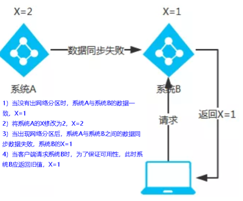
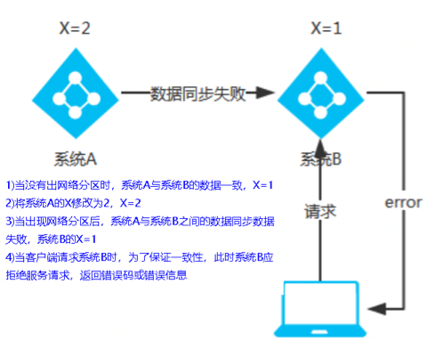

# * Eureka、Zookeeper、Consul对比

## 1、CAP

-  C：Consistency（强一致性） 
-  A：Availability（可用性） 
-  P：Partition tolerance（分区容错性）a 
> CAP理论关注粒度是数据，而不是整体系统设计的策略

## 2、经典CAP图

-  AP（Eureka） 
   1.  AP架构
当网络分区出现后，为了保证可用性，系统B 可以返回旧值 ，保证系统的可用性。
结论：违背了一致性C的要求，只满足可用性和分区容错，即AP

-  CP（Zookeper、Consul） 
   1.  CP架构
当网络分区出现后，为了保证一致性，就必须拒接请求，否则无法保证一致性
结论：违背了可用性A的要求，只满足一致性和分区容错，即CP

# 

