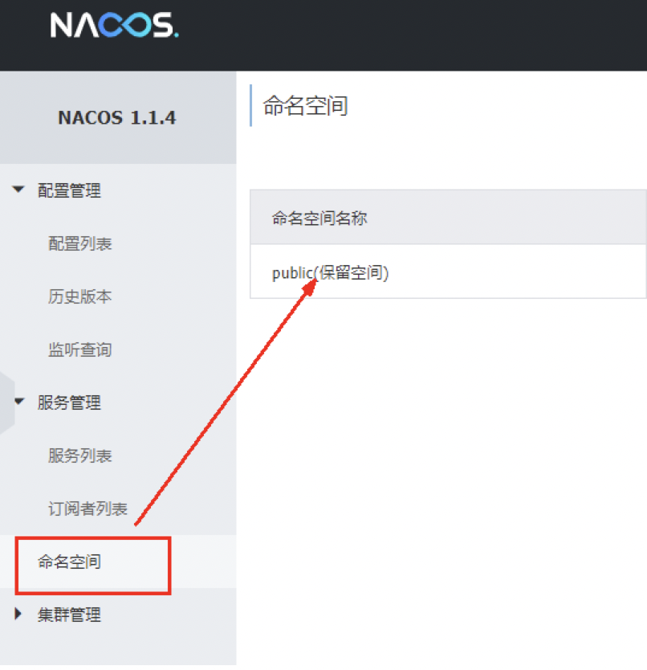

# Nacos服务注册和配置中心
## 1、Nacos简介
### 1、为什么叫Nacos
前四个字母分别为Naming和Configuration的前两个字母，最后的s为Service。
### 2、是什么

-  一个更易于构建云原生应用的动态服务发现、配置管理和服务管理平台。 
-  Nacos: Dynamic Naming and Configuration Service 
-  Nacos就是注册中心 + 配置中心的组合 
   -  等价于
Nacos = Eureka+Config +Bus 

### 3、能干啥

- 替代Eureka做服务注册中心
- 替代Config做服务配置中心

### 4、去哪下

- [https://github.com/alibaba/Nacos](https://github.com/alibaba/Nacos)
- 官网文档 
   - [https://nacos.io/zh-cn/index.html](https://nacos.io/zh-cn/index.html)
   - [https://spring-cloud-alibaba-group.github.io/github-pages/greenwich/spring-cloud-alibaba.html#_spring_cloud_alibaba_nacos_discovery](https://spring-cloud-alibaba-group.github.io/github-pages/greenwich/spring-cloud-alibaba.html#_spring_cloud_alibaba_nacos_discovery)

### 5、各种注册中心比较

- 

据说 Nacos 在阿里巴巴内部有超过 10 万的实例运行，已经过了类似双十一等各种大型流量的考验

## 2、安装并运行Nacos

-  保证本地Java8+Maven环境已经OK 
-  先从官网下载Nacos
	[https://github.com/alibaba/nacos/releases](https://github.com/alibaba/nacos/releases)
	本次使用nacos版本为1.1.4 
   - 
-  解压安装包，直接运行bin目录下的startup.sh 
```shell
sh startup.sh -m standalone
```
 

-  命令运行成功后直接访问http://localhost:8848/nacos 
   - 默认账号密码都是nacos
-  结果页面 
   - 

---

## 3、Nacos作为服务注册中心演示

### 1、官网文档

- [https://spring-cloud-alibaba-group.github.io/github-pages/greenwich/spring-cloud-alibaba.html#_spring_cloud_alibaba_nacos_config](https://spring-cloud-alibaba-group.github.io/github-pages/greenwich/spring-cloud-alibaba.html#_spring_cloud_alibaba_nacos_config)

### 2、**基于Nacos的服务提供者**

-  新建Module
cloudalibaba-provider-payment9001 
-  POM 
   -  父POM 
```xml
<!--spring cloud 阿里巴巴-->
<dependency>
  <groupId>com.alibaba.cloud</groupId>
  <artifactId>spring-cloud-alibaba-dependencies</artifactId>
  <version>2.1.0.RELEASE</version>
  <type>pom</type>
  <scope>import</scope>
</dependency>
```
 

   -  本模块pom 
```xml
    <dependencies>
        <!--    引入阿里巴巴nacos-->
        <dependency>
            <groupId>com.alibaba.cloud</groupId>
            <artifactId>spring-cloud-starter-alibaba-nacos-discovery</artifactId>
        </dependency>
        <dependency>
            <groupId>org.springframework.boot</groupId>
            <artifactId>spring-boot-starter-web</artifactId>
        </dependency>
        <dependency>
            <groupId>org.springframework.boot</groupId>
            <artifactId>spring-boot-starter-actuator</artifactId>
        </dependency>
        <dependency>
            <groupId>org.springframework.boot</groupId>
            <artifactId>spring-boot-devtools</artifactId>
            <scope>runtime</scope>
            <optional>true</optional>
        </dependency>
        <dependency>
            <groupId>org.projectlombok</groupId>
            <artifactId>lombok</artifactId>
            <optional>true</optional>
        </dependency>
        <dependency>
            <groupId>org.springframework.boot</groupId>
            <artifactId>spring-boot-starter-test</artifactId>
            <scope>test</scope>
        </dependency>
        <!--引入自己定义的 api 通用包，可以使用 Payment 支付 Entity -->
        <dependency>
            <groupId>com.yang</groupId>
            <artifactId>cloud-api-commons</artifactId>
            <version>1.0-SNAPSHOT</version>
            <scope>compile</scope>
        </dependency>
    </dependencies>
```
 

-  YML 
```yaml
server:
  port: 9001

spring:
  application:
    name: nacos-payment-provider
  cloud:
    nacos:
      discovery:
        server-addr: localhost:8848 # 配置nacos地址
management:
  endpoint:
    web:
      exposure:
        include: "*"
```
 

-  主启动 
```java
@SpringBootApplication
@EnableDiscoveryClient
public class PaymentMain9001 {
    public static void main(String[] args) {
        SpringApplication.run(PaymentMain9001.class,args);
    }
}
```
 

-  业务类 
```java
@RestController
public class PaymentController {

    @Value("${server.port}")
    private String port;

    @GetMapping("/payment/nacos/{id}")
    public String getPayment(@PathVariable("id") Integer id){
        return "nacos registry, serverPort: " + port + " \t id" +id;
    }
}
```
 

-  测试 
   -  [http://localhost:9001/payment/nacos/1](http://localhost:9001/payment/nacos/1) 
   -  nacos控制台 
      - 
   -  nacos服务注册中心+服务提供者9001都OK了 
   -  为了下一章节演示nacos的负载均衡，参照9001新建9002 

### 3、基于Nacos的服务消费者

-  新建Module
cloudalibaba-consumer-nacos-order83 
-  pom 
```xml
<dependency>
  <groupId>org.springframework.cloud</groupId>
  <artifactId>spring-cloud-starter-openfeign</artifactId>
</dependency>
<dependency>
  <groupId>com.alibaba.cloud</groupId>
  <artifactId>spring-cloud-starter-alibaba-nacos-discovery</artifactId>
</dependency>
```
 

   - 为什么nacos支持负载均衡 
      - 
-  yml 
```yaml
server:
  port: 8083
spring:
  application:
    name: nacos-order-consumer
  cloud:
    nacos:
      discovery:
        server-addr: localhost:8848

# 消费者将要去访问的微服务名称 ( 注册成功进 nacos 的微服务提供者 )
server-url:
  nacos-user-service: http://nacos-payment-provider
```
 

-  主启动 
```java
@SpringBootApplication
@EnableDiscoveryClient
@EnableFeignClients
public class OrderNacosMain83 {
    public static void main(String[] args) {
        SpringApplication.run(OrderNacosMain83.class,args);
    }
}
```
 

-  业务类 
   -  OrderNacosController 
```java
@RestController
public class OrderNacosController {

    @Value("${server.port}")
    private String serverPort;

    @Autowired
    private OrderFeign orderFeign;

    @GetMapping("cunsumer/payment/nacos/{id}")
    public String getPayment(@PathVariable("id") Integer id){
        return "端口号："+ serverPort + " " +  orderFeign.getPayment(id);
    }
}
```
 

   -  OrderFeign 
```java
@Service
@FeignClient("nacos-payment-provider")
public interface OrderFeign {
    @GetMapping("/payment/nacos/{id}")
    public String getPayment(@PathVariable("id") Integer id);
}
```
 

-  测试 
   -  nacos控制台

   -  [http://localhost:8083/cunsumer/payment/nacos/1](http://localhost:8083/cunsumer/payment/nacos/1) 
      - 83访问9001/9002，轮询负载OK

### 4、各种服务注册中心对比

**Nacos 支持AP和CP模式的切换**

-  Nacos全景图所示

-  Nacos和CAP


-  切换
	Nacos 支持AP和CP模式的切换 
> C是所有节点在同一时间看到的数据是一致的；而A的定义是所有的请求都会收到响应。
>  
> 何时选择使用何种模式？
>  
> 一般来说，
>  
> 如果不需要存储服务级别的信息且服务实例是通过nacos-client注册，并能够保持心跳上报，那么就可以选择AP模式。当前主流的服务如 Spring cloud 和 Dubbo 服务，都适用于AP模式，AP模式为了服务的可能性而减弱了一致性，因此AP模式下只支持注册临时实例。
>  
> 如果需要在服务级别编辑或者存储配置信息，那么 CP 是必须，K8S服务和DNS服务则适用于CP模式。
>  
> CP模式下则支持注册持久化实例，此时则是以 Raft 协议为集群运行模式，该模式下注册实例之前必须先注册服务，如果服务不存在，则会返回错误。
>  
> 切换命令：
>  
> curl -X PUT '$NACOS_SERVER:8848/nacos/v1/ns/operator/switches?entry=serverMode&value=CP'


## 4、Nacos作为服务配置中心演示

### 1、Nacos作为配置中心-基础配置

-  cloudalibaba-config-nacos-client3377 
-  pom 
```xml
    <dependencies>
        <dependency>
            <groupId>com.alibaba.cloud</groupId>
            <artifactId>spring-cloud-starter-alibaba-nacos-config</artifactId>
        </dependency>
        <!--    引入阿里巴巴nacos-->
        <dependency>
            <groupId>com.alibaba.cloud</groupId>
            <artifactId>spring-cloud-starter-alibaba-nacos-discovery</artifactId>
        </dependency>
        <dependency>
            <groupId>org.springframework.boot</groupId>
            <artifactId>spring-boot-starter-web</artifactId>
        </dependency>
        <dependency>
            <groupId>org.springframework.boot</groupId>
            <artifactId>spring-boot-starter-actuator</artifactId>
        </dependency>
        <dependency>
            <groupId>org.springframework.boot</groupId>
            <artifactId>spring-boot-devtools</artifactId>
            <scope>runtime</scope>
            <optional>true</optional>
        </dependency>
        <dependency>
            <groupId>org.projectlombok</groupId>
            <artifactId>lombok</artifactId>
            <optional>true</optional>
        </dependency>
        <dependency>
            <groupId>org.springframework.boot</groupId>
            <artifactId>spring-boot-starter-test</artifactId>
            <scope>test</scope>
        </dependency>
        <!--引入自己定义的 api 通用包，可以使用 Payment 支付 Entity -->
        <dependency>
            <groupId>com.yang</groupId>
            <artifactId>cloud-api-commons</artifactId>
            <version>1.0-SNAPSHOT</version>
            <scope>compile</scope>
        </dependency>
    </dependencies>
```
 

-  yml 
   -  为什么配置两个 
> Nacos同springcloud-config一样，在项目初始化时，要保证先从配置中心进行配置拉取，
>  
> 拉取配置之后，才能保证项目的正常启动。
>  
> springboot中配置文件的加载是存在优先级顺序的， bootstrap优先级高于application

 

   -  bootstrap 
```yaml
server:
  port: 3377
spring:
  application:
    name: nacos-config-client

  cloud:
    nacos:
      discovery:
        server-addr: localhost:8848  #Nacos 服务注册中心地址
      config:
        server-addr: localhost:8848 #Nacos 作为配置中心地址
        file-extension: yaml #指定yaml 格式的配置

# ${spring.application.name}-${spring.profile.active}.${spring.cloud.nacos.config.file-extension}

# nacos-config-client-dev.yaml
```
 

   -  application 
```yaml
spring:
  profiles:
    active: dev # 表示开发环境
```
 

-  主启动 
```java
@SpringBootApplication
@EnableDiscoveryClient
public class NacosConfigClientMain3377 {
    public static void main(String[] args) {
        SpringApplication.run(NacosConfigClientMain3377.class,args);
    }
}
```
 

-  业务类 
```java
@RestController
@RefreshScope // 在控制器类加入 @RefreshScope 注解使当前类下的配置支持 Nacos 的动态刷新功能。
public class ConfigClientController {

    @Value("${config.info}")
    private String configInfo;

    @GetMapping("config/info")
    public String getConfigInfo(){
        return configInfo;
    }
}
```
 

   -  [@RefreshScope ](/RefreshScope ) 

-  在Nacos中添加配置信息,Nacos中的匹配规则 
   -  理论 
      -  Nacos中的dataid的组成格式及与SpringBoot配置文件中的匹配规则 
      -  官网

      -  公式为： 
```xml
${spring.application.name}-${spring.profiles.active}.${spring.cloud.nacos.config.file-extension}
```

   -  实操 
      -  配置新增 
      -  Nacos界面配置对应 
      -  设置DataId
	公式：`${spring.application.name}-${spring.profiles.active}.${spring.cloud.nacos.config.file-extension}`
	prefix 默认为 spring.application.name 的值
	spring.profile.active 即为当前环境对应的 profile，可以通过配置项 spring.profile.active 来配置。
	file-exetension 为配置内容的数据格式，可以通过配置项 spring.cloud.nacos.config.file-extension 来配置
	小总结说明 
      -  历史配置 
         -  Nacos会记录配置文件的历史版本默认保留30天，此外还有一键回滚功能，回滚操作将会触发配置更新 
         -  回滚 
-  测试 
   - 启动前需要在nacos客户端-配置管理-配置管理栏目下有对应的yaml配置文件
   - 运行cloud-config-nacos-client3377的主启动类
   - 调用接口查看配置信息
   - [http://localhost:3377/config/info](http://localhost:3377/config/info)
-  自带动态刷新 
   - 修改下Nacos中的yaml配置文件，再次调用查看配置的接口，就会发现配置已经刷新

### 2、Nacos作为配置中心-分类配置

#### 1、问题

-  多环境多项目管理 
> 问题1：
>  
> 实际开发中，通常一个系统会准备
>  
> dev开发环境
>  
> test测试环境
>  
> prod生产环境。
>  
> 如何保证指定环境启动时服务能正确读取到Nacos上相应环境的配置文件呢？
>  
> 问题2：
>  
> 一个大型分布式微服务系统会有很多微服务子项目，
>  
> 每个微服务项目又都会有相应的开发环境、测试环境、预发环境、正式环境......
>  
> 那怎么对这些微服务配置进行管理呢？

 

#### 2、Nacos的图形化管理界面

-  配置管理 
-  命名空间 
   - 

#### 3、Namespace+Group+Data ID三者关系？为什么这么设计？

-  是什么
类似Java里面的package名和类名
最外层的namespace是可以用于区分部署环境的，Group和DataID逻辑上区分两个目标对象。 
-  三者情况 
- 

> 默认情况：
>  
> Namespace=public，Group=DEFAULT_GROUP, 默认Cluster是DEFAULT
>  
> Nacos默认的命名空间是public，Namespace主要用来实现隔离。
>  
> 比方说我们现在有三个环境：开发、测试、生产环境，我们就可以创建三个Namespace，不同的Namespace之间是隔离的。
>  
> Group默认是DEFAULT_GROUP，Group可以把不同的微服务划分到同一个分组里面去
>  
> Service就是微服务；一个Service可以包含多个Cluster（集群），Nacos默认Cluster是DEFAULT，Cluster是对指定微服务的一个虚拟划分。
>  
> 比方说为了容灾，将Service微服务分别部署在了杭州机房和广州机房，
>  
> 这时就可以给杭州机房的Service微服务起一个集群名称（HZ），
>  
> 给广州机房的Service微服务起一个集群名称（GZ），还可以尽量让同一个机房的微服务互相调用，以提升性能。
>  
> 最后是Instance，就是微服务的实例。

