 **zookeeper**

- zookeeper
   - 安装
      - 环境：linux
         - 下载
            - 官网下载：[https://zookeeper.apache.org/releases.html](https://zookeeper.apache.org/releases.html)
         - 上传至服务器
         - 解压
tar -zxvf zookeeper-3.4.13.tar.gz
         - 编辑配置文件
            - 1.进入conf目录：
[root@localhost local]# cd zookeeper-3.4.13/conf
            - 2. 将zoo_sample.cfg这个文件复制为zoo.cfg (必须是这个文件名)
[root@localhost conf]# cp zoo_sample.cfg zoo.cfg
         - 配置环境变量
            - [root@localhost zookeeper-3.4.13]# export ZOOKEEPER_INSTALL=/usr/local/zookeeper-3.4.13/
            - [root@localhost zookeeper-3.4.13]# export PATH=PATH:PATH:PATH:ZOOKEEPER_INSTALL/bin
         - 启动zookeeper
            - 1.进入bin目录，并启动zookeeper。
如果不是在bin目录下执行，启动zookeeper时会报错： bash: ./zkServer.sh: No such file or directory
            - 注意： ./zkServer.sh start前面的 . 不可忽略。
               - [root@localhost local]# cd /usr/local/zookeeper-3.4.13/bin
               - [root@localhost bin]# ./zkServer.sh start
            - 2.启动成功效果如下：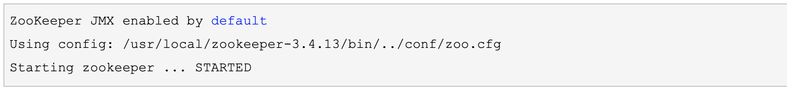
            - 3.zookeeper的服务端启动后，还需要启动zookeeper的客户端：
[root@localhost bin]# ./zkCli.sh
            - 4.查看状态：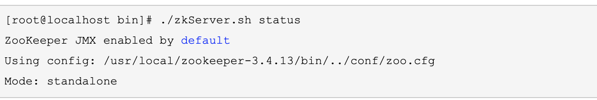
   - 创建服务并注册进zookeeper
      - 服务样例
      - appliaction.yml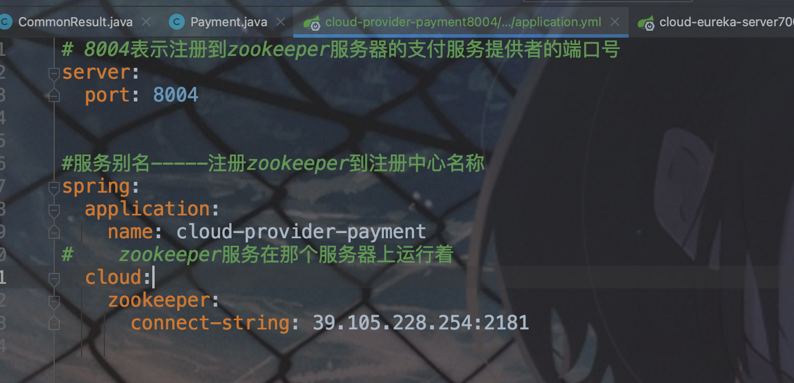
   - 测试
      - 启动zookeeper服务
         - ./zkServer.sh start
      - 在服务器上启用zookeeper客户端
         - ./zkCli.sh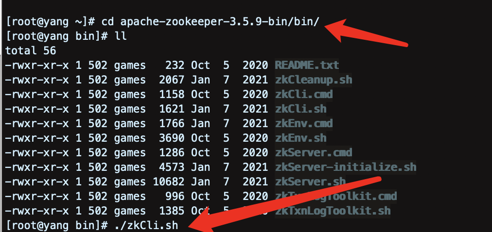
图二为结果
      - 查看根结点
如果没有服务注册进zookeeper时，根结点就只有一个zookeeper节点
         - ls /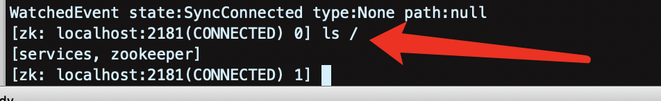
      - 查看节点里的其他节点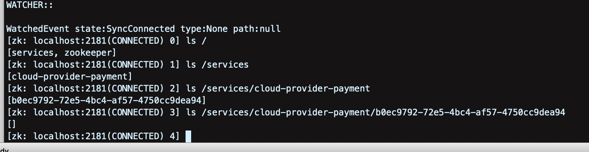
   - 获取在zookeeper中，注册的服务信息
get /.../....
      - 实例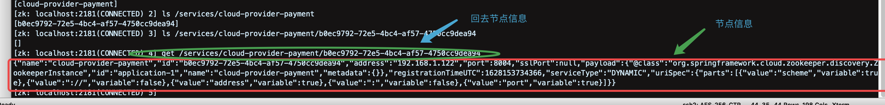
         - 节点信息转成json对象后
            - 实例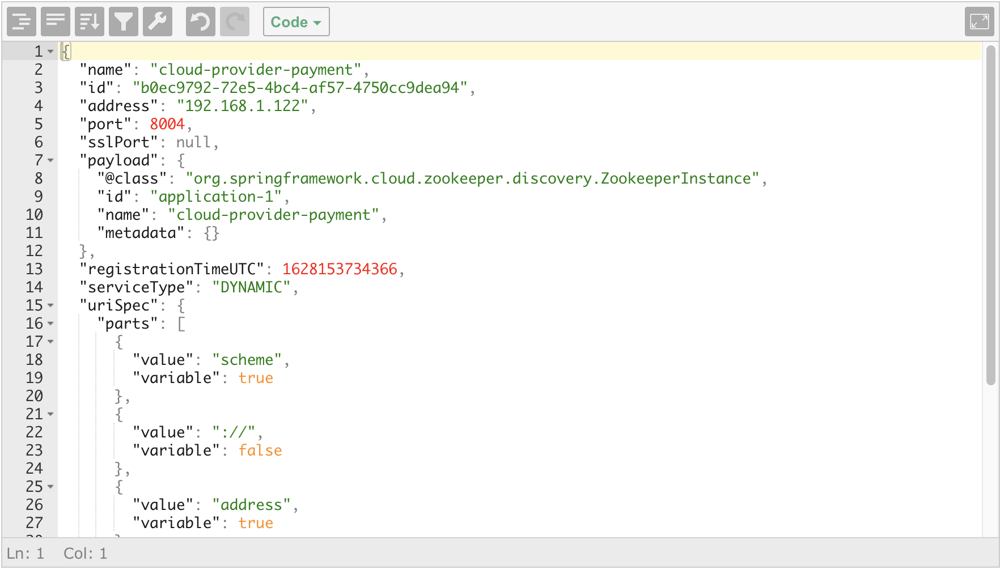
   - springcloud整合zookeeper
      - 服务配置（application.yml）
         - 服务提供者
            - application.yml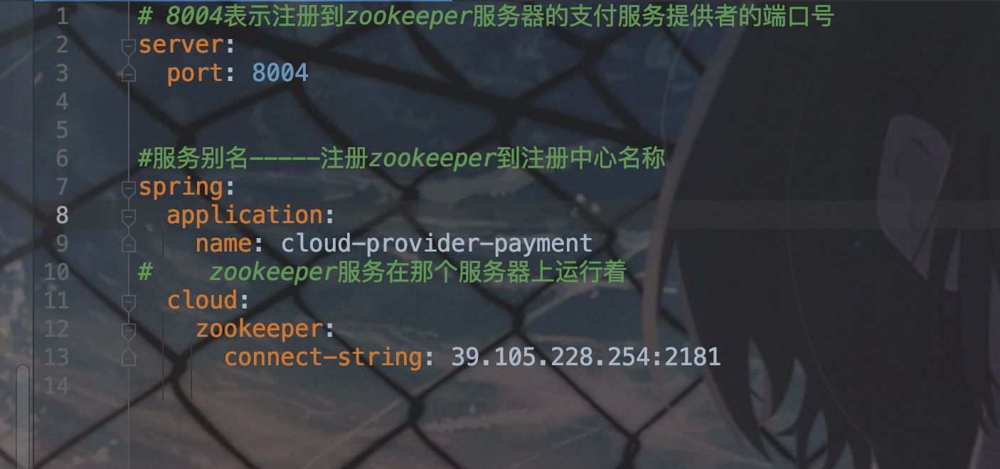
            - 主启动类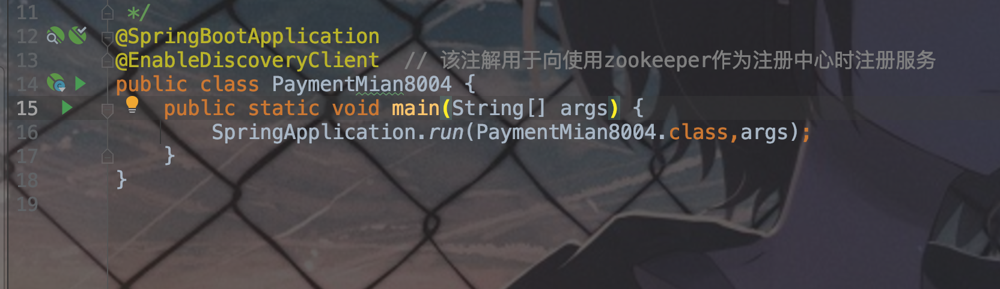
            - 业务类（controller）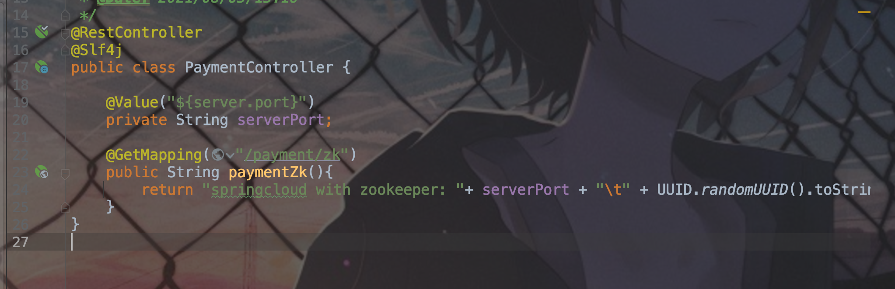
         - 服务消费者
            - application.yml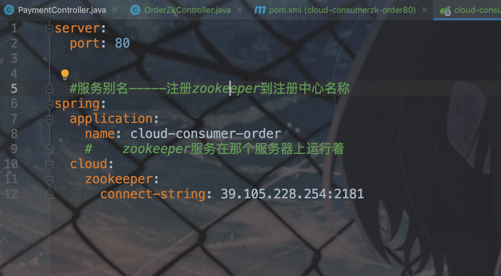
            - 主启动类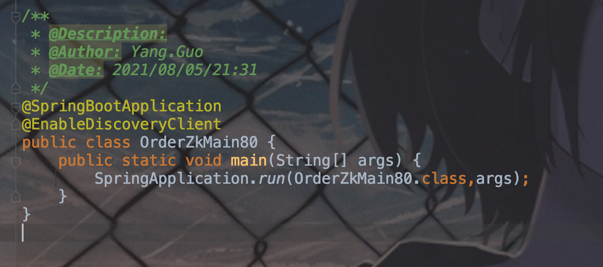
            - 业务类（controller）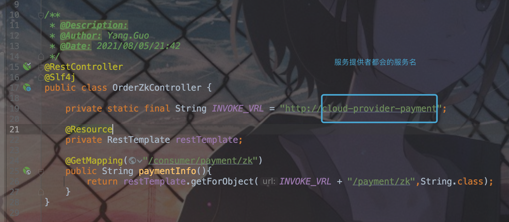
      - 服务注册
         - 当服务配置完以后，启动服务就会根据配置注册到zookeeper中。
         - zookeeper里被注册了服务后就会在根结点多一个services
         - 查看services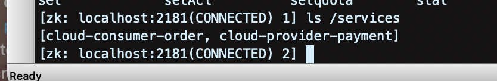
         - 查看单个服务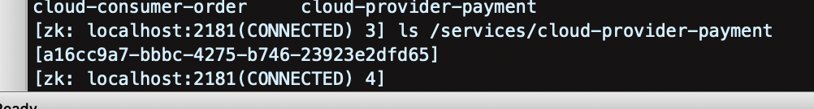
         - 根据节点流水号查询节点服务相关信息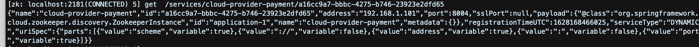
         - 根据返回的json串即可读取服务的相关信息

