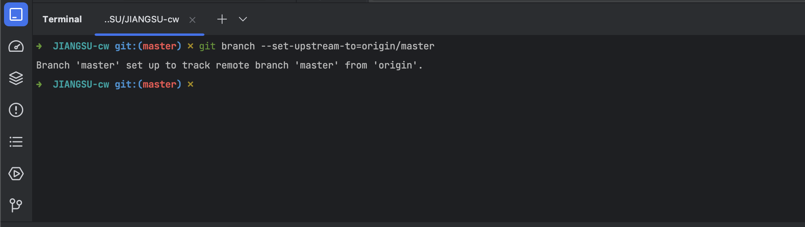

# 一、场景
## 1.1、Gitee更新代码提示:master has no tracked branch

**执行下方命令即可解决。**
```shell
git branch --set-upstream-to=origin/master
```
在 IDEA 下方找到 **Terminal** 控制台，执行命令即可。

## 1.2、[git设置当前项目的用户名称name和邮箱email](https://segmentfault.com/a/1190000041443286)
## 1.3、[搭建多个远程仓库，将代码同时提交Github、Gitee](https://segmentfault.com/a/1190000041508237)
## 1.4、修改全局用户名、邮箱
### 1.4.1、查看用户名和邮件
```shell
git config user.name
git config user.email
```
### 1.4.2、取消设置全局用户名和邮件
```shell
git config --unset --global user.name
git config --unset --global user.email
```
### 1.4.3、设置全局用户名和邮件
```shell
git config --global user.name "zhangsan"
git config --global user.email "zhangsan@neusoft.com"
```
### 1.4.4、再次查看用户名和邮件
```shell
git config user.name
git config user.email
```

