[GitHub - SoftLeaderGy/StartRedis](https://github.com/SoftLeaderGy/StartRedis)

---

## 一、NoSql

> NoSql(Not Only Sql) ，意为不仅仅是SQL，泛指非关系型数据库》NoSql这个技术门类，早期就有人提出来了，发展到2009年趋势越发高涨


- RDBMS：关系型数据库---sql语句
- NoSql ：非关系型数据库

## 二、为什么是NoSql

> 随着互联网网站的兴起，传统的关系型数据库在应付动态网站，特别是超大规模和高并发的纯动态网站已经显得力不从心了，暴露了很多难以克服的问题。如 商城网站中对商品数据频繁查询、对热搜商品的排行统计、订单超时问题、以及微信朋友圈（音频、视频）存储等相关使用传统的关系型数据库实现就显得非常复杂，虽然能实现相应功能但是在性能上却不是乐观的。nosql这门技术的出现。更好的解决了这些问题，他告诉了世界不仅仅是sql


## 三、NoSql的四大分类

### 3.1、键值（key-value）存储数据库

- 说明 
   - 这一类数据库主要是使用到一个哈希表，这个表中有个特定的键和一个指针指向的特定数据
- 特点 
   - key、value模型对于IT系统来说优势在于简单、易部署。
   - 但是如果DBA支队部分值进行查询货更新的时候，key、value就显得效率低下了。
- 相关产品 
   - Tokyo Cabinet/Tyrant
   - Redis 
      - key\value形式  ---> 内存中
   - SSDB 
      - key\value形式  ---> 硬盘中
   - Voldemort
   - Oracle BDB

### 3.2、列存储

- 说明 
   - 这部分数据库通常用来应对分布式存储的海量数据
- 特点 
   - 键仍然存在，但是他们的特点是指向了多个列，这些列是由列家族来安排的
- 相关产品 
   - Cassandra、HBase、Riak

### 3.3、文档型数据库

- 说明 
   - 文档型数据库的灵感是来自于LotusNotes办公软件的，而且它同第一种键值存储相类似该类型的数据模型是版本化的文档，半结构化的文档以特定的格式存储，比如JSON。文档型数据库可以看作是键值数据库的升级版，允许之间嵌套键值。而且文档型数据库比键值数据库的查询效率更高
   - 一JSON形式进行存储
- 特点 
   - 以文档形式存储
- 相关产品 
   - MongoDB、CouchDB、MongoDB（4.x）。国内也有文档型数据库SequoiaDB，已开源

### 3.4、图形（Graph）数据库

- 说明 
   - 图形结构的数据库同其他行列以及刚性结构的SQL数据库不同，它是使用灵活的图形模型，并且能够扩展到多个服务器上。
- 特点 
   - NoSQL数据库没有标准的查询语言(SQL)，因此进行数据库查询需要制定数据模型。许多NoSQL数据库都有REST式的数据接口或者查询 API。
- 相关产品 
   - Neo4J、InfoGrid、Infinite Graph

## 四、NoSql应用场景

- 数据模型比较简单
- 需要灵活性更强的IT系统
- 对数据库性能要求较高
- 不需要高度的数据一致性（NoSql产品对于事物支持都不是特别良好）

## 五、什么是Redis

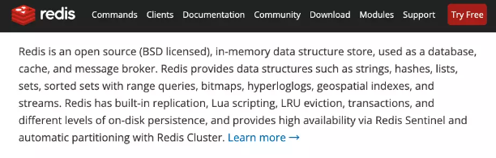

> Redis is an open source (BSD licensed), in-memory data structure store, used as a database, cache, and message broker.
Redis 开源 遵循BSD 基于内存数据存储 被用于作为 数据库 缓存 消息中间件


Redis 数据内存中 内存：读写块，断电立即消失 机制：持久化机制 内存数据 定期写入到磁盘

- 总结：redis是一个内存型的数据库

## 六、Redis的特点

- Redis是一个高性能Key、Value内存型关系型数据库
- Redis支持丰富的数据类型（String、List、Set、ZSet、Hash）
- Redis支持持久化 ： 内存的数据持久化到硬盘中
- Redis单进程、单线程 所以不存在线程不安全的问题 
   - 但是效率相比 Mamechache （key、value）多线程的数据库，redis的效率是高于Mamechache的
   - 原因是因为Mamechache虽然是多线程，但是为了保证线程的安全性，会加很多锁，反而效率会很低
   - Redis可以实现分布式锁

## 七、Redis安装

## 八、Redis细节

### 8.1、数据库操作指令

- redis启动服务的细节 
   - 注意：直接使用./redis-server方式启动使用的是redis-server这个shell脚本中的默认配置
- 如何在启动redis是指定配置文件启动 
   - 注意：默认在redis安装完成之后在安装目录没有任何的配置文件（使用命令安装的话会有配置文件），需要在源码目录中复制redis.conf配置文件到安装目录 
      - 进入源码目录
      - cp redis.conf /usr/redis
      - 进入/usr/redis/安装目录查看复制的配置文件
      - cd /usr/redis
      - ls
      - 进入bin目录加载配置启动
      - ./redis-server ../redis.conf
      - 修改redis默认端口号
- redis中库的概念 
   - 库：database用来存放数据一个基本单元，一个库可以存放key-value键值对 redis中每一个库都有一个唯一的名称｜编号 从0开始 默认库的个数：16个库 库的编号：0-15 默认使用是0号库
   - 切换库的命令：select dbid（库编号）
- redis中清除库的指令 
   - flushDB 清空当前库
   - flushAll  清空所有库
- redis客户端显示中文 
   - ./redis-cli -p 6379 --raw

### 8.2 操作key相关指令

- DEL指令 
   - 语法：DEL Key  [key ...]
   - 作用：删除给定的一个或多个key。不存在的key会被忽略。
   - 可用版本：>= 1.0.0
   - 返回值：被删除key 的数量
- EXISTS指令 
   - 语法：EXISTS key
   - 作用：检查给定的key 是否存在
   - 可用版本： >= 1.0.0
   - 返回值：若key存在，返回1，否则返回0
- EXPIRE 
   - 语法：EXPIRE key seconds
   - 作用：为给定key 设置生存时间 过期时（生存时间为0），他会被自动删除
   - 返回值：设置成功返回1、
- KEYS 
   - 语法：KEYS pattern
   - 作用：查找所有符号模式pattern 的key
   - 语法 
      - KEYS * 匹配数据库中所有key
      - KEYS h?llo 匹配hello ， hallo和hXllo 等
      - KEYS h*llo 匹配hllo 和heeeeeello等
      - KEYS h[ae]llo 匹配 hello 和hallo ，但不匹配hillo 。 特殊符号用 “\”隔开
      - 返回值：符合给定模式的key的列表
   - MOVE 
      - 语法：MOVE key db
      - 作用：将当前数据库的key 移动到给定的数据库db 当中
      - 返回值：移动成功返回1，失败返回0.
- PEXPIRE 
   - 语法：PEXPIRE key milliseconds
   - 作用：这个命令和EXPIRE命令的作用类似，但是它以毫秒为单位设置的key的生存时间，而不像EXPIRE命令那样，以秒为单位
   - 返回值：设置成功返回1 key不存在过设置失败，返回0
- PEXPIREAT 
   - 语法：PEXPIREAT key millisecond-timestamp
   - 作用：这个命令和EXPIRE 命令类似，但是他以毫秒为单位设置的key的过期unix 时间戳
   - 返回值；如果生存时间设置成功，返回1.当key不存在货没办法设置生存时间是，返回0（查看EXPIRE 命令获取更多信息）
- TTL 
   - 语法：TTL key
   - 作用：以秒为单位，返回给定的key的剩余时间 （TTL， time to live）
   - 返回值 
      - 当key不存在是，返回 -2
      - 当key存在但没有设置剩余生存时间是 返回 -1
      - 否则，以秒为单位，返回key的剩余生存时间
- PTTL 
   - 语法：PTTL key
   - 作用：这个命令类似与TTL 命令，但它以毫秒单位返回key的剩余生存时间，而不是像TTL 命令那样，以秒为单位
   - 返回值：当key不存在是，返回-2.当key存在但没有设置剩余时间是，返回-1，否则，一毫秒为单位，返回key的剩余生存时间
- RANDOMKEY 
   - 语法：RANDOMKEY
   - 作用：从当前数据库中随机返回（不删除）一个key
   - 返回值：当数据库不为空是，返回一个key。当数据库为空，返回null
- RENAME 
   - 语法：RENAME key newkey
   - 作用：将key改名为newkey。当key 和newkey相同，或这key不存在是，返回一个错误，当newkey已经存在是，RENAME命令覆盖旧值
   - 返回值：改名成功时提示ok，失败时候返回一个错误
- TYPE 
   - 语法：TYPE key
   - 作用：返回key 所存储的值的类型
   - 返回值 
      - none（key 不存在）
      - string（字符串）
      - list（列表）
      - set（集合）
      - zset（有序集）
      - hash（哈希表）

## 九、Redis数据类型

### Redis开启远程链接

> 注意：默认redis服务器是没有开启远程连接的，也就是默认拒绝所有的远程客户端连接


1. 修改配置文件开启远程连接 
   1. vim redis.conf
   2. 修改为   bind 0.0.0.0 （或将bind 属性注释掉）表示允许一切客户端连接
2. 修改配置之后重启redis服务
1. ./redis-server redis.conf  注意：一定要加载配置文件启动

## 十、持久化机制

client redis [内存] --->内存数据->数据之久化->磁盘

Redis官方提供给了两种不同的持久化方法来将数据存储到硬盘里面分别是

```
    * 快照（Snapshot）
    * AOF（Append Only File）之追加日志文件（把所有写的操作都存放在日志文件中）
```

### 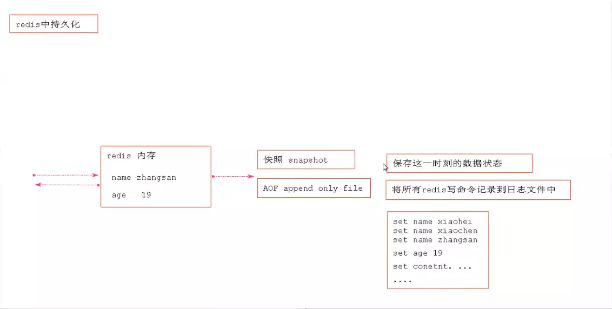

### 10.1、快照（Snapshot）

-  特点 
   - 这种方式可以将某一时刻的所有数据都写入硬盘中，当然这也是redis的默认开启持久化方式，保存的文件是以.rdb形式结尾的文件因此这种方式也称为RDB方式
   - 
-  快照生成方式 
   - 客户端方式：BGSAVE 和 SAVE 指令 
      -  BGSAVE 
         - 客户端可以使用BGSAVE命令来创建一个快照，当接收到客户端的BGSAVE命令时，redis会调用fork来创建一个子进程，然后子进程负责将快照写入磁盘中，而父进程则继续处理命令请求
         - 名词解释：fork当一个进程创建子进程的时候，底层的操作系统会创建该进程的一个副本，在类unix系统中常见子进程的操作会进行优化，在刚开始的时候，父子进程共享相同的内存，直到父进程或子进程对内存进行了写之后，对被写入的内存的共享才会结束服务
         - 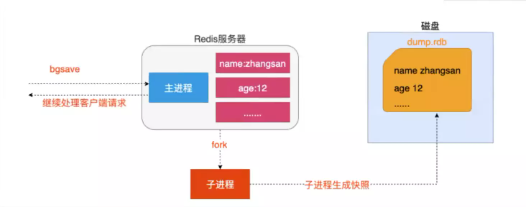
      -  SAVE 
         -  客户端还可以使用SAVE命令来创建一个快照，接收到SAVE命令的redis服务器在快照创建完毕之前将不再响应任何其他的 
         -  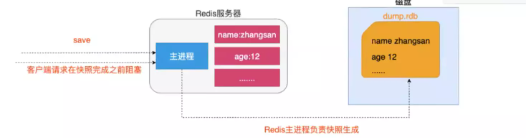
         -  注意：SAVE命令并不常用，使用SAVE命令在快照创建完毕之前，redis处于阻塞状态，无法对外提供服务 
   - 服务器配置自动触发 
      - 满足配置自动触发 
         -  如果用户在redis,conf中设置了save配置选项，redis会在save选项条件满足之后自定触发一次BGSAVE命令，如果设置多个save配置选项，当任意一个save配置选项满足条件，redis也会触发一次BGSAVE命令 
         -  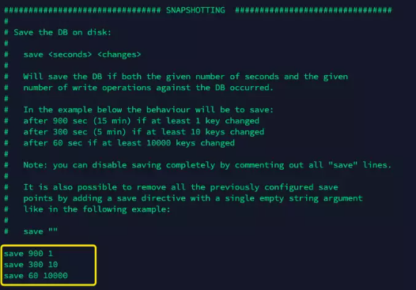
         -  save 秒数 key变化的次数 
            - 900秒redis中的key变化一次 会生成1次快照
            - 300秒redis中的key变化10次 会生成一次快照
            - 60秒redis中的key变化10000次 会生成一次快照
      - 服务器接收客户端shutdown指令 
         - 当redis通过shutdown指令接收到关闭服务器的请求是，会执行一个save命令，阻塞所有的客户端，不咋执行客户端发送的任何命令，并且在save命令执行完毕之后关闭服务器
-  配置生成快照名称和位置 
   - 修改生成快照名称 
      - dbfilename dump.rdb
   - 修改生成位置 
      - dir ./
   - 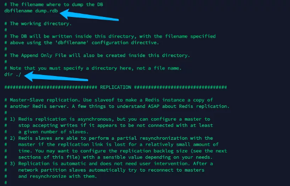
-  每次redis服务启动时都会自定加载dump.rdb快照文件，来恢复数据 

### 10.2、AOF只追加日志文件

-  特点 
   - 这种方式可以将所有客户端执行的写命令记录到日志文件中，AOF持久话会将被执行的写命令写到AOF的文件末尾，以此来记录数据发生的变化，因此只要redis从头到尾执行一次AOF文件所包含的所有写命令，就可以恢复AOF文件的记录数据集
   - 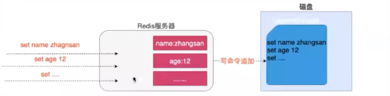
-  开启AOF持久化 
   - 在redis的默认配置中AOF持久化机制是没有开启的，需要在配置中开启
   - 开启AOF持久化 
      - 修改 appendonly yes 开启持久化
      - 修改 appendfilename “appendonly.aof” 指定生成文件名称
   - 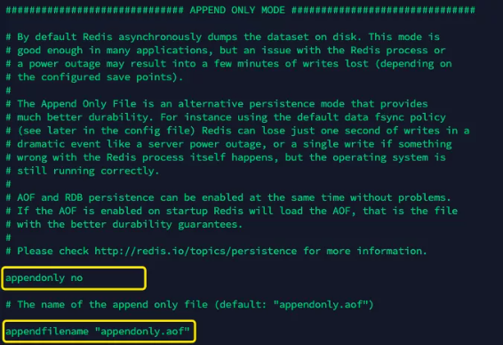
-  日志追加频率 
   - always（谨慎使用） 
      - 说明 
         - 每个redis写命令都要同步写入硬盘，严重降低redis速度
      - 解释 
         - 如果用户使用了always选项，那么每个redis写命令都会被写入硬盘，从而将发生系统崩溃时出现的数据丢失减到最少:遗憾的是，因为这种同步策略需要对硬盘进行大量的写入操作，所以redis处理命令的速度会受到硬盘性能的限制
      - 注意 
         - 转盘式硬盘在这种频率下200左右个命令/s;固态硬盘(SSD)几百万个命令/s;
      - 警告 
         - 使用SSD用户请谨慎使用alwavs洗项，这种模式不断写入少量数据的做法有可能会引发严重的写入放大问题，导致将固态硬盘的寿命从原来的几年降低为几个月。
   - everysec（推荐） 
      - 说明: 
         - 每秒执行一次同步显式的将多个写命令同步到磁盘
      - 解释: 
         - 为了兼顾数据安全和写入性能，用户可以考虑使用everysec选项让redis每秒一次的频率对AOF文件进行同步:redis每秒同步一次AOF文件时性能和不使用任何持久化特性时的性能相差无几，而通过每秒同步一次A0F文件，redis可以保证，即使系统崩溃，用户最多丢失一秒之内产生的数据。
   - no（不推荐） 
      - 说明: 
         - 由操作系统决定何时同步
      - 解释: 
         - 最后使用no选项，将完全有操作系统决定什么时候同步A0F日志文件，这个选项不会对redis性能带来影响但是系统崩溃时，会丢失不定数量的数据，另外如果用户硬盘处理写入操作不够快的话，当缓冲区被等待写入硬盘数据填满时，redis会处于阻塞状态，并导致 redis的处理命令请求的速度变慢。
-  修改日志同步频率 
   - 修改appendfsync everysec｜always｜no指定
   - 
-  如果Snapshot（快照）和AOF持久化同时开启，redis会优先一AOF文件为主恢复数据，因为AOF持久化的数据会比较准确 

### 10.3、AOF文件的重写

- AOF带来的问题 
   - AOF的方式也同时带来了另一个问题。持久化文件会变的越来越大。例如我们调用incrtest命令100次，文件中必须保存全部的100条命令，其实有99条都是多余的，因为要恢复数据库的状态其实文件中保存一条settest100就够了，为了压缩aof的持久化文件Redis提供了AOF重写机制。
- AOF重写 
   - 用来一定程度上减小AOF文件的体积
- 触发重写的方式 
   -  客户端方式触发重写 
      - 执行BGREWRITEAOF命令  且不会阻塞redis服务
   -  服务器配置方式自动触发 
      - 配置redis.conf中的auto-aof-rewrite-percentage选项
      - 如果设置auto-aof-rewrite-percentage值为100和auto-aof-rewrite-min-size 64mb,并且启用的AOF持久化时，那么当AOF文件体积大于64M，并且A0F文件的体积比上一次重写之后体积大了至少一倍(100%)时，会自动触发，如果重写过于频繁，用户可以考虑将 auto-aof-rewrite-percentage设置为更大
      - 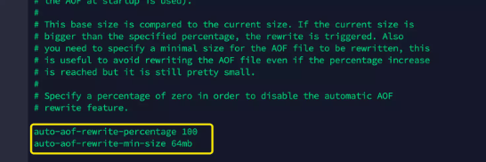
   -  重写流程 

> 注意：重写aof文件的操作，并不会读取旧文件，而是将整个内存中的数据内容以命令的方式重写了一个新的aof文件，替换原有的文件，这点与快照类似
* redis调用fork，现在有父子两个进程，子进程根据内存中的数据快照，往临时文件中写入重建数据库状态的命令
* 父进程继续处理client请求，除了把写命令写入到原来的aof文件中。同时把收到的写命令缓存起来。这样就能保证子进程重写失败的话也不会出现问题
* 当子进程把快照内容以命令方式写到临时文件中后，子进程发信号给父进程。然后父进程把缓存的写命令也写入到临时文件。
* 现在父进程就使用临时文件替换老得aof文件，并重命名，后面收到的写命令也开始往新的aof文件中追加

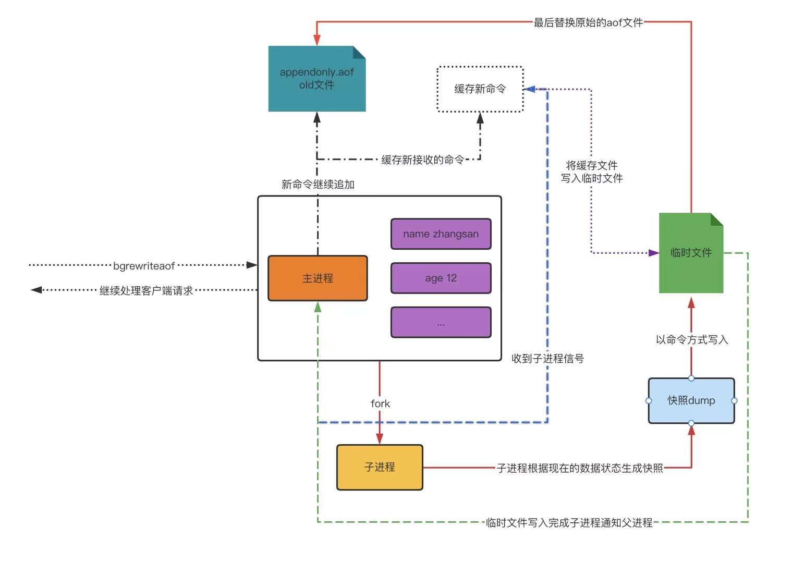

### 10.4、持久化总结

- 两种持久化方案既可以同时使用(aof),又可以单独使用在某种情况下也可以都不使用具体使用那种持久化方案取决于用户的数据和应用决定。
- 无论使用AOF还是快照机制持久化将数据持久化到硬盘都是有必要的,除了持久化外用户还应该对持久化的文件进行备份(最好备份在多个不同地方)。

## 十一、java操作Redis

### 11.1、环境准备

- 引入依赖

```xml
<!--引入redis依赖-->
<dependency>
  <groupId>redis.clients</groupId>
  <artifactId>jedis</artifactId>
  <version>2.9.0</version>
</dependency>
```

- 创建jedis对象

```java
import redis.clients.jedis.Jedis;
import java.util.Set;
/**
 * @Description: 测试java操作redis
 * @Author: Guo.Yang
 * @Date: 2022/02/27/21:20
 */
public class TestRedis {
    public static void main(String[] args) {
        // 创建jedis客户端对象
        Jedis jedis = new Jedis("39.105.228.254",6379); // redis服务必须关闭防火墙 2.redis服务必须开启远程连接
        // 设置redis密码
        jedis.auth("root123456");
        // 选择使用一个库 默认：使用 0号库
        jedis.select(0);
        // 执行相关操作
        // ...
        // 释放资源
        jedis.close();
    }
}
```

### 11.2、操作key相关API

```java
import org.junit.After;
import org.junit.Before;
import org.junit.Test;
import redis.clients.jedis.Jedis;
/**
 * @Description: 测试key操作
 * @Author: Guo.Yang
 * @Date: 2022/02/27/21:31
 */
public class TestKeys {
    private Jedis jedis;
    // 创建 TestKeys类之前方法
    @Before
    public void before(){
        // 创建redis对象
        this.jedis = new Jedis("39.105.228.254", 6379);
        this.jedis.auth("root123456");
    }
    // 创建 TestKeys类之后方法
    @After
    public void after(){
        this.jedis.close();
    }

    @Test
    public void testKeys(){
        // 测试redis操作键
        // 删除一个key
//        jedis.del("gy");
        // 删除多个key
//        jedis.del("gy","name");
        // 判断一个key是否存在exits
//        Boolean name = jedis.exists("name");
//        System.out.println(name);
        // 设置一个key超时时间 expire pexpire
        // 设置的key一定是存在的key
//        Long age = jedis.expire("gy", 100);
//        System.out.println(age);
        // 查看一个key超时时间 ttl
        // 查看的一定是存在的key
//        Long age1 = jedis.ttl("gy");
//        System.out.println(age1);
        // 随机获取一个key （不删除）
//        String s = jedis.randomKey();
//        System.out.println(s);
        // 获取key的类型
        String name = jedis.type("name");
        System.out.println(name);
    }
}
```

### 11.3、环境String相关API

```java
import org.junit.After;
import org.junit.Before;
import org.junit.Test;
import redis.clients.jedis.Jedis;
import java.util.List;
/**
 * @Description: 测试string操作
 * @Author: Guo.Yang
 * @Date: 2022/02/27/21:31
 */
public class TestString {
    private Jedis jedis;
    // 创建 TestKeys类之前方法
    @Before
    public void before(){
        // 创建redis对象
        this.jedis = new Jedis("39.105.228.254", 6379);
        this.jedis.auth("root123456");
    }
    // 创建 TestKeys类之后方法
    @After
    public void after(){
        this.jedis.close();
    }

    @Test
    public void testKeys(){
        // set
        String set = jedis.set("name", "小陈");
        // get
        String name = jedis.get("name");
        System.out.println(name);
        //mset
        jedis.mset("content", "好人", "address", "海淀区");
        //mget
        List<String> mget = jedis.mget("content", "address");
        for (String s : mget) {
            System.out.println(s);
        }
        //getset
        String set1 = jedis.getSet("name", "小明");
        System.out.println(set1);
    }
}
```

### 11.4、环境List相关API

```java
import org.junit.After;
import org.junit.Before;
import org.junit.Test;
import redis.clients.jedis.BinaryClient;
import redis.clients.jedis.Jedis;
import java.util.List;
/**
 * @Description: 测试List操作
 * @Author: Guo.Yang
 * @Date: 2022/02/27/21:31
 */
public class TestList {
    private Jedis jedis;
    // 创建 TestList类之前方法
    @Before
    public void before(){
        // 创建redis对象
        this.jedis = new Jedis("39.105.228.254", 6379);
        this.jedis.auth("root123456");
    }
    // 创建 TestKeys类之后方法
    @After
    public void after(){
        this.jedis.close();
    }

    @Test
    public void testList(){
        // lpush
        jedis.lpush("name1","张三","王武","李四");
        // rpush
        jedis.rpush("name1","xaioming");
        // lrange
        List<String> name1 = jedis.lrange("name1", 0, -1);
        for (String s : name1) {
            System.out.println(s);
        }
        // lpop
        String name11 = jedis.lpop("name1");
        System.out.println(name11);
        // rpop
        String name12 = jedis.rpop("name1");
        System.out.println(name12);
        // linsert
        jedis.linsert("lists", BinaryClient.LIST_POSITION.BEFORE, "小黑", "小陈");
    }
}
```

### 11.5、环境Set相关API

### 11.6、环境Hash相关API

## 十二、SpringBoot整合Redis

> SpringBoot Data Redis 中提供了RedisTemplate和StringRedisTemplate，其中StringRedisTemplate是RedisTemplate的子类，两个方法基本一直，不同之处主要体现操作的数据类型不同，RedisTemplate两个泛型都是Object，意味着存储的key和value都可以是一个对象，而StringRedisTemplate的两个泛型都是String，意味着StringRedisTemplate的key和value都只是字符串


- 使用RedisTemplate默认是将对象序列化到Redis中，所以放入的对象必须实现对象序列化接口

### 12.1、引入依赖

```xml
<!--        引入springboot data redis依赖-->
        <dependency>
            <groupId>org.springframework.boot</groupId>
            <artifactId>spring-boot-starter-data-redis</artifactId>
        </dependency>
```

### 12.2、配置application.properties

```xml
# 配置redis
spring.redis.host=localhost
spring.redis.port=6379
spring.redis.database=0
```

### 12.3、配置StringRedisTemplate和RedisTemplat

- User实体

```java
import lombok.Data;
import java.io.Serializable;
import java.util.Date;
/**
 * @Description:
 * @Author: Guo.Yang
 * @Date: 2022/03/01/20:17
 */
@Data
public class User implements Serializable {
    private String id;
    private Integer age;
    private Date bir;
    private String name;
}
```

#### 12.3.1、测试StringRedisTemplate

```java
import org.junit.jupiter.api.Test;
import org.springframework.beans.factory.annotation.Autowired;
import org.springframework.boot.test.context.SpringBootTest;
import org.springframework.data.redis.connection.DataType;
import org.springframework.data.redis.core.StringRedisTemplate;
import org.springframework.data.redis.core.ZSetOperations;
import java.time.Duration;
import java.util.ArrayList;
import java.util.Arrays;
import java.util.List;
import java.util.Set;
import java.util.concurrent.TimeUnit;
@SpringBootTest
class RedisBootApplicationTests {
    // 注入StringRedisTemplate
    @Autowired
    private StringRedisTemplate stringRedisTemplate;

    // 操作redis中字符串 opsForValue 实际上操作的就是redis中的String类型
    // 理解： stringRedisTemplate.opsFor谁 操作的就是谁，opsForList  就是操作的redis中的list类型
    @Test
    public void testString(){
        stringRedisTemplate.opsForValue().set("name","小陈");
        String name = stringRedisTemplate.opsForValue().get("name");
        System.out.println(name);
        // 设置一个键值 且超时时间为120秒 四个参数： 1key 2value 3超时时间 4超时时间的之间类型
        stringRedisTemplate.opsForValue().set("code","2312",120, TimeUnit.SECONDS);
        //追加在一个key的value后边的值
        Integer append = stringRedisTemplate.opsForValue().append("name", "他是一个好人");
    }

    @Test
    public void testKey(){
        Boolean name = stringRedisTemplate.delete("qq"); // 删除一个key
        System.out.println(name);
        Boolean name1 = stringRedisTemplate.hasKey("qw"); // 判断key是否存在
        System.out.println(name1);
        DataType name2 = stringRedisTemplate.type("666"); // 判断key的类型
        System.out.println(name2);
        Set<String> keys = stringRedisTemplate.keys("*"); // 获取redis中的所有key
        System.out.println(keys);
//        Boolean age = stringRedisTemplate.expire("age", Duration.ofDays(100)); // 设置key的超时时间
        Long age1 = stringRedisTemplate.getExpire("age");
        System.out.println(age1);
//        stringRedisTemplate.rename("age","age1"); // 修改key的名字，如果没有key会报错
        // 理论上是不抛异常的，可能api有些变化
//        Boolean aBoolean = stringRedisTemplate.renameIfAbsent("qwe", "qww"); // 修改key的名字，但修改之前会进行判断是否有这个key
        Boolean age2 = stringRedisTemplate.move("age", 1);// 移动一个可以 到1号库

    }
    @Test
    public void testList(){
        Long aLong = stringRedisTemplate.opsForList().leftPush("names", "小张");
        Long aLong1 = stringRedisTemplate.opsForList().rightPush("testList", "test");
        Long aLong2 = stringRedisTemplate.opsForList().leftPushAll("testLeftPushAll", "v1", "v2");

        ArrayList<String> list = new ArrayList<>();
        list.add("123");
        list.add("666");
        stringRedisTemplate.opsForList().leftPushAll("testPushAllOfList",list);
        List<String> testPushAllOfList = stringRedisTemplate.opsForList().range("testPushAllOfList",0,-1);
        for (String s : testPushAllOfList) {
            System.out.println("testPushAllOfList --- >" + s);
        }
    }
    @Test
    public void testSet(){
        // 设置一个set集合
         stringRedisTemplate.opsForSet().add("testSet","张三","张三","李四");
         // 查看set集合成员
        Set<String> testSet = stringRedisTemplate.opsForSet().members("testSet");
        for (String s : testSet) {
            System.out.println("testSet" + s);
        }
        // 查看testSet的值的长度
        Long testSet1 = stringRedisTemplate.opsForSet().size("testSet");
        System.out.println(testSet1);
    }
    @Test
    public void testZset(){
        // 创建一个zset集合
        Boolean add = stringRedisTemplate.opsForZSet().add("zset", "小黑", 10);
        // 便利zset集合
        Set<String> zset = stringRedisTemplate.opsForZSet().range("zset", 0, -1);
        for (String s : zset) {
            System.out.println(s);
        }
        System.out.println("-----------");
        // 获取 指定下标范围的zset元素
        Set<ZSetOperations.TypedTuple<String>> zset1 = stringRedisTemplate.opsForZSet().rangeByScoreWithScores("zset", 0, 100);
        for (ZSetOperations.TypedTuple<String> stringTypedTuple : zset1) {
            System.out.println(stringTypedTuple.getValue());// 元素
            System.out.println(stringTypedTuple.getScore());// 分数
        }
    }
    @Test
    public void testHash(){
        // Hash类型 和java里的haspmap很像
        // 3个参数 redis里边的大key 大key里边的 key value
        stringRedisTemplate.opsForHash().put("maps","name","张三");
        // 获取大key里边的多个key的值
        List<Object> maps = stringRedisTemplate.opsForHash().multiGet("maps", Arrays.asList("name","age"));
        // 获取hash类型key 的key的value
        Object o = stringRedisTemplate.opsForHash().get("maps", "name");
        //// 获取hash类型key 的value
        List<Object> maps1 = stringRedisTemplate.opsForHash().values("maps");
        // 获取hash类型key 的key
        Set<Object> maps2 = stringRedisTemplate.opsForHash().keys("maps");

    }
}
```

#### 12.3.2、测试RedisTemplate

```java
import com.yang.redisboot.entity.User;
import org.junit.jupiter.api.Test;
import org.springframework.beans.factory.annotation.Autowired;
import org.springframework.boot.test.context.SpringBootTest;
import org.springframework.data.redis.connection.DataType;
import org.springframework.data.redis.core.RedisTemplate;
import org.springframework.data.redis.core.StringRedisTemplate;
import org.springframework.data.redis.core.ZSetOperations;
import org.springframework.data.redis.serializer.RedisSerializer;
import org.springframework.data.redis.serializer.StringRedisSerializer;
import java.util.*;
import java.util.concurrent.TimeUnit;
@SpringBootTest
class RedisTemplateApplicationTests {
    // 注入StringRedisTemplate
    @Autowired
    private RedisTemplate redisTemplate;
    @Test
    public void testRedisTemplate(){

        User user = new User();
        user.setId(UUID.randomUUID().toString());
        user.setName("小陈");
        user.setAge(18);
        user.setBir(new Date());
        /**
         * 使用 redisTemplate去取StringRedisTemplate存进去的key时，是取不出来的
         * 因为 redisTemplate 无论存值、取值 都是要序列化完成之后存进去、或者按序列化的key取出来后在反序列化出来
         */
//        Object names = redisTemplate.opsForValue().get("names");
//        System.out.println(names); // 输出：null
        /**
         * 存进去的以user为key的User对象
         * 注意：如果使用终端命令取的话  get user 是取不出来的，因为看似java程序我们存进去的是以user为key
         * 但是实际是user序列化以后的值才是我们存进去的key
         * 所以我们想要存储的对象实体一定要实现序列化接口 Serializable
         */
        // 存入对象
//        User user = new User();
//        user.setId(UUID.randomUUID().toString());
//        user.setName("小陈");
//        user.setAge(18);
//        user.setBir(new Date());
//        redisTemplate.opsForValue().set("user",user);
        // 获取对象
//        User user = (User) redisTemplate.opsForValue().get("user");
//        System.out.println(user); //输出：User(id=b312bd22-6053-4f13-a4e1-ae2dedc932fb, age=18, bir=Tue Mar 01 20:28:54 CST 2022, name=小陈)
        /**
         * 存进去的key、value都是序列化的话 这样对于我们是有局限性的
         * 我们想要的是存进去的key是String 对象是序列化的
         * 我们可以 修改我们的redisTemplate的序列化方式
         * 默认的我们的redisTemplate对象的使用的是jbk的序列化策略
         */
        // 可以打印出redisTemplate key的序列化方案
        RedisSerializer keySerializer = redisTemplate.getKeySerializer();
        System.out.println(keySerializer);
        /**
         * 如果我们想修改key不序列化的话，也就是存就去的是个字符串，用字符串去取可以取出来的话
         * 我们可以修改redisTemplate key的序列化策略
         */
        // 修改redisTemplate key的序列化策略
        redisTemplate.setKeySerializer(new StringRedisSerializer());
//        User user = new User();
//        user.setId(UUID.randomUUID().toString());
//        user.setName("小陈");
//        user.setAge(18);
//        user.setBir(new Date());
//        redisTemplate.opsForValue().set("user",user);
//        redisTemplate.opsForList().leftPush("list",user);
//
//        redisTemplate.opsForSet().add("set",user);
//
//        redisTemplate.opsForZSet().add("zset",user,100);

        redisTemplate.opsForHash().put("map","user",user);
        /**
         * 发现问题
         * redisTemplate.opsForHash().put("map","user",user);
         * 设置的redis的key是没有被序列化的，但是hash里边的key是被序列化的，这也不是我们想要的
         * 于是我们可以修改redis.hash里边key的序列化策略
         */
        // 设置redis hash；里边key的序列化策略
        redisTemplate.setHashKeySerializer(new StringRedisSerializer());
        // 存入redis key 和hash key均未必序列化对象
        redisTemplate.opsForHash().put("mapOne","user",user);
    }
}
```

#### 12.3.3、测试RedisTemplate boundXXXOps API

```java
import com.yang.redisboot.entity.User;
import org.junit.jupiter.api.Test;
import org.springframework.beans.factory.annotation.Autowired;
import org.springframework.boot.test.context.SpringBootTest;
import org.springframework.data.redis.core.BoundValueOperations;
import org.springframework.data.redis.core.RedisTemplate;
import org.springframework.data.redis.serializer.RedisSerializer;
import org.springframework.data.redis.serializer.StringRedisSerializer;
import java.util.Date;
import java.util.UUID;
@SpringBootTest
class TestBoundAPI {
    // 注入StringRedisTemplate
    @Autowired
    private RedisTemplate redisTemplate;
    /**
     * spring data 为了方便我们对redis进行友好的操作，因此给我们提供了bound API 简化操作
     */
    @Test
    public void testbound(){
        redisTemplate.setHashKeySerializer(new StringRedisSerializer());
        redisTemplate.setKeySerializer(new StringRedisSerializer());
        /**
         * 也就是 我们在操作同一个key的时候我们无时无刻都得带着这个key
         */
//        redisTemplate.opsForValue().set("name" , "张三");
//        redisTemplate.opsForValue().append("name","是一个好人");
//        redisTemplate.opsForValue().get("name");
        /**
         * 为了简化操作，我们可以通过bound绑定一个key，并返回一个绑定之后的对象，以后我们对这个对象的操作就是我们对这个key的操作
         */
        // 上边的代码可以简化为：
        BoundValueOperations name = redisTemplate.boundValueOps("name");
        name.set("张三");
        name.append("是个好人");
        String o = (String) name.get();
        System.out.println(o);
        /**
         * 其他数据类型以此类推
         */
        /**
         * 总结：
         * 1、针对于处理key、value 都是string类型使用StringRedisTemplate
         * 2、针对于处理key、value 存在对象 使用RedisTemplate
         * 3、针对于同一个key的多个操作 建议使用boundXXXOps() value、list、Set、Zset的api简化代码
         */
    }
}
```

#### 12.3.4、总结

- 针对于处理key、value 都是string类型使用StringRedisTemplate
- 针对于处理key、value 存在对象 使用RedisTemplate
- 针对于同一个key的多个操作 建议使用boundXXXOps() value、list、Set、Zset的api简化代码

## 十三、redis的应用场景

1. 利用redis 中的字符串类型完成 项目中手机验证码存储的实现
2. 利用redis 中的字符串类型完成 具有失效性业务功能 例如 12306 淘宝 订单还有xx分钟过期
3. 利用redis 实现分布式集群系统中 Session共享
4. 利用redis zset类型 可排序set类型 元素、分数、排行榜之类的功能
5. 利用redis 实现分布式缓存
6. 利用redis存储认证之后的token信息
7. 利用redis解决分布式集群系统中分布式锁的问题  redis-单进程-单线程 
   1. 锁：LRA脚本

## 十四、分布式缓存

### 14.1、Redis分布式缓存实现（一）

- 什么是缓存 
   - 定义：就是计算机内存中的数据
- 内存中数据的特点 
   - 读写快
   - 断点立即丢失
- 缓存解决了什么问题 
   - 提高了网站吞吐量提高网站的运行效果
   - 核心解决的问题：缓存的存在是用来减轻数据库的访问压力
- 既然缓存能提高效率，那项目中所有数据加入缓存岂不是更好？ 
   - 注意：使用缓存是一定是数据库中数据极少发生修改，更多用于查询这种情况
- 本地缓存和分布式缓存的区别 
   - 本地缓存：存在应用服务器内存中的数据称之为本地缓存（local cache）
   - 分布式缓存：存储在当前应用服务器内存之外的数据称之为分布式缓存（distrbute cache）
   - 集群：将同一种服务的多个节点放在一起共同对系统提供服务的过程，称之为集群
   - 分布式：由多个不同服务集群共同对系统提供服务，这个系统称之为分布式系统（distrbute system）
- 利用mybatis自身本地缓存结合redis实现分布式缓存 
   - mybatis中应用级缓存（二级缓存） SqlSessionFactory 级别缓存，所有会话共享
   - 如何开启二级缓存 
      - mapper.xml文件中 添加 -- 本地缓存
   - 查看Cache标签缓存的实现 
      - 结论：mybatis底层默认使用的是 org.apache.ibatis.cache.impl.PerpettualCache 实现
   - 自定义Rediscache实现 
      - 通过mybatis默认cache源码得知，可以使用自定义Cache类implements Cache接口，并对里边的方法进行实现 
         - public class RedisCache implements Cache... 
         - 使用RedisCAche实现


### 14.2、Redis分布式缓存实现（二）

-  缓存在项目中应用 
   - 如果项目中表查询之间没有任何关联查询使用仙子啊的这种缓存方式没有任何问题
   - 现有缓存方式在表连接查询过程中存在一定问题
   - 如果是多表关联查询的话，现有的缓存中，另一个表修改信息，并不会影响其他的表，这样的话联表查询会击中缓存，并且拿出来的是数据库修改之前的数据
   - 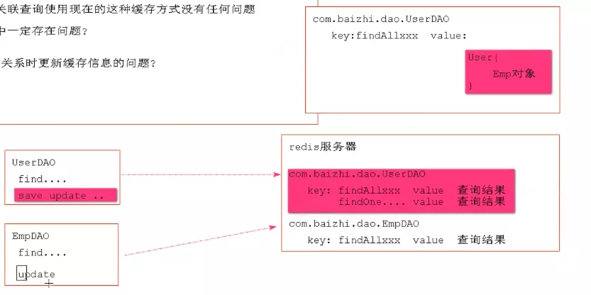
-  在mybatis的缓存中如何要解决关联关系是更新缓存信息的问题？ 
   - <cache-ref= "绑定Dao的全类名"> 
      - 用来将多个具有关联关系查询缓存放在一起处理

### 14.3、Redis分布式缓存（三）

- 缓存优化策略 
   - 对redis中的key进行优化：key的长度不能太长,例如

```java
-1544147975:587974899:com.yang.redisboot.dao.EmpDao.findAll:0:2147483647:select * from t_emp:SqlSessionFactoryBean
```

```
* 为了尽可能的将key变的整洁写，使用MD5加密处理
    * 特点
        * 一切文件字符串等经过md5处理之后，都会生成32位16进制的字符串
        * 不同内容文件经过md5进行加密，加密的算法一定不一致
            * 面试题：有两个文件 a.txt 、b.txt 如何判断这两个文件的内容是否相同
            * 使用md5对两个文件进行处理，如果结果一直 那内容一定一致 
        * 相同内容的文件多次经过md5生成的结果始终一致
* 推荐：在redis整合mybatis过程中建议将key 进行md5优化处理
```

### 14.4、面试相关概念

1. 什么是缓存穿透？ 
   1. 定义：客户端查询了一个数据库中没有的数据记录，导致缓存 在这种情况下无法利用 称之为缓存穿透
   2. 解： 在本代码中redis+mybatis 由于mybatis中的cache解决了缓存穿透：将数据库中没有查到结果也进行了缓存。
2. 什么是缓存血崩？ 
   1. 定义：在系统运行的某一时刻，突然系统中的缓存大面积失效，恰好在这个时刻涌来了大量客户端请求，导致所有模块缓存无法利用，大量请求涌向数据库导致极端情况 数据库阻塞或挂起。缓存存储时：业务系统非常大 模块多 业务数据不同 不同模块在放入缓存时 都会设置一个缓存超时时间。
   2. 解： 
      1. 缓存永久缓存 （不推荐的）
      2. 针对于不同的业务数据设置成不同的超时时间
3. 项目当中有没有遇到过？如何解决的？

## 十五、Redis主从复制

### 15.1、主从复制

- 主从复制架构仅仅用来解决数据的冗余备份，从节点仅仅用来同步数据

### 15.2、主从复制架构图


### 15.3、搭建主从复制

- 准备3台机器并修改配置

```java
- master (主)
    port 6379
    bind 0.0.0.0
   
- slave1 (从1)
    port 6380
    bind 0.0.0.0
    slave masyterip masterport (slave 主redisIP 从redis端口)
    
- slave2 (从2)
    port 6381
    bind 0.0.0.0
    slave masyterip masterport (slave 主redisIP 从redis端口)
```

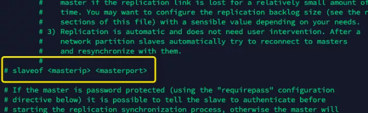

## 十六、Redis哨兵机制

### 16.1、哨兵Sentinel机制

Sentinel(哨兵)是Redis的高可用性解决方案:由一个或多个Sentinel实例组成的Sentinel系统可以监视任意多个主服务器以及这些主服务器属下的所有从服务器，并在被监视的主服务器进入下线状态时，自动将下线主服务器属下的某个从服务器升级为新的主服务器。简单的说哨兵就是带有自动故障转移功能的主从架构。

无法解决：1、单节点并发压力问题 2、单节点内存和磁盘物理上限问题

### 16.2、哨兵架构原理

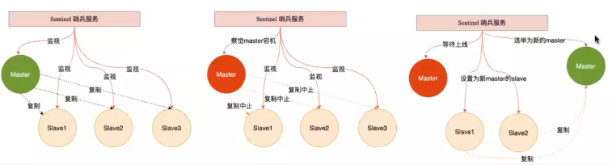

### 16.3、搭建哨兵架构

1. 在主节点上创建哨兵配置 
   1. 在Master对应redis.conf同目录下新建sentinel.conf文件，文件名绝对不能错
2. 配置哨兵，在sentinel.conf文件中填入内容： 
   1. sentinel monitor 被监控redis的名字（自己起）ip port 1

```java
例如： sentinel monitor mySentinel 39.105.228.254  6379 1

 //   sentinel monitor mySentinel 39.105.228.254(主节点ip)  6379(主节点端口) 1(哨兵的数量)
```

3. 启动哨兵模式进行测试 
   1. redis-sentinel ～/redis-master-slave/sentinal/sentinal.conf
   2. 说明：（sentinel monitor mymaster 39.105.228.254 6381 1） 
      1. 这个后边的数字2，是指当有两个集以上的sentinal服务检测到master宕机，才会去执行主从切换的功能

### 16.4、通过Spirngboot配置连接哨兵

- 配置

```xml
# 配置redis 哨兵模式
# master 书写是使用哨兵监听的名称
spring.redis.sentinel.master=mymaster
# 连接的不再是一个具体的redis主机 书写的是多个哨兵节点
spring.redis.sentinel.nodes=yang.gunveda.top:26379
# 配置redis密码
spring.redis.password=root123456
```

- 注意 
   - 在哨兵配置文件（sentinal.conf）中一定要开启远程连接
   - bind 0.0.0.0
   - sentinal.conf

```xml
sentinel myid 0f366835f15ad7e001a803891fb5c7af6eac41fd
bind 0.0.0.0
sentinel monitor mymaster 39.105.228.254 6379 1
# Generated by CONFIG REWRITE
port 26379
dir "/root/redis-master-slave/sentinel"
sentinel auth-pass mymaster root123456
sentinel config-epoch mymaster 1
sentinel leader-epoch mymaster 1
sentinel known-slave mymaster 39.105.228.254 6380
sentinel known-slave mymaster 39.105.228.254 6381
sentinel current-epoch 1
```

## 十七、Redis集群

### 17.1、集群

Redis在30后开始支持Cluster(模式)模式目前redis的集群支持节点的自动发现支持slave-master选举和容错支持在线分片(sharding shard)等特性。

reshard（重新分配）

### 17.2、集群架构图

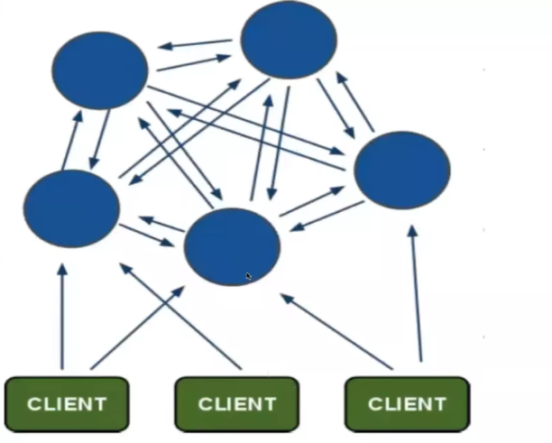

### 17.3、集群细节

-  所有的redis节点彼此互联(PING-PONG机制)，内部使用二进制协议优化传输速度和带宽。 
-  节点的宕机是否 是通过集群中超过半数的节点检测失效时才生效。 
-  客户端与redis节点直连，不需要中间proxy层客户端不需要连接集群所有节点，连接集群中任何一个可用节点即可 
-  redis集群把所有的物理节点映射到[0-16383]slot（hash槽）上，集群 负责维护master节点<->slot（槽）<->value（值） 
-  redis集群维护值的原理架构图 
-  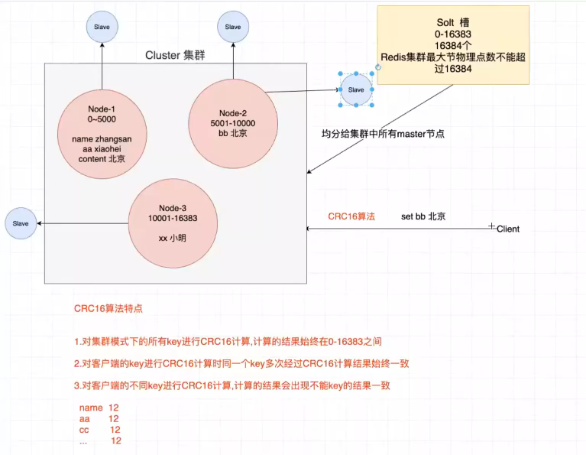
-  注意：redis集群中最多可放master节点数为（16384个），因为hash槽就这么多 而且要保证每个master节点要有一个hash槽， 

### 17.4、集群搭建

判断一个集群中节点是否可用，是集群中所用主节点选举的过程，如果半数以上的节点任务当前节点挂掉，那个当前节点就是挂掉了，所以搭建redis集群是建议节点数量为奇数，搭建集群至少需要三个主节点，三个从节点，至少需要6个节点。

- 环境准备

```xml
yum -install -y ruby rubygems

gem install redis
```

## 十八、Redis实现分布式session管理

### 18.1、管理机制

redis的session管理是利用了spring提供的session管理解决方案，将一个应用session交给Redis储存，整个应用session的请求都会去redis中获取对应的session数据

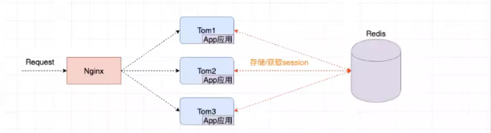

### 18.2、开发Session管理

1. 引入依赖

```xml
<dependency>
    <groupId>org.springframework.session</groupId>
    <artifactId>spring-session-data-redis</artifactId>
</dependency>
```

2. 开发Session管理配置类
RedisSessionManage

```xml
/**
 * @Description:
 * @Author: Guo.Yang
 * @Date: 2022/03/07/20:32
 */
@Configuration
@EnableRedisHttpSession // 将整个应用中使用session的数据全部交给redis管理
public class RedisSessionManage {
}
```

3. 配置

```xml
server.port=8090
server.servlet.context-path=/redis-session
# redis配置
spring.redis.sentinel.master=mymaster
spring.redis.sentinel.nodes=yang.gunveda.top:26379
spring.redis.password=root123456
```

4. controller测试

```java
/**
 * @Description:
 * @Author: Guo.Yang
 * @Date: 2022/03/07/20:33
 */
@RestController
@RequestMapping("/test")
public class TestController {
    /**
     * 使用redis的session管理  注意：当session中的数据发生变化是必须将session中变化的数据同步到redis中
     * @param request
     * @param response
     * @throws IOException
     */
    @RequestMapping("/test")
    public void test(HttpServletRequest request, HttpServletResponse response) throws IOException {
        List<String> list = (List<String>)request.getSession().getAttribute("list");
        if(list == null){
            list = new ArrayList<>();
        }
        list.add("XXXXX");
        request.getSession().setAttribute("list",list); // 每一次session变化都要同步
        response.getWriter().println("size: "+ list.size());
        response.getWriter().println("sessionid: " + request.getSession().getId());
    }
    @RequestMapping("/remove")
    void removeSessionAttribute(HttpServletRequest request, HttpServletResponse response) throws IOException {
        response.getWriter().println("sessionID: "+ request.getSession().getId());
        request.getSession().removeAttribute("list");
    }
    /**
     * 退出登陆，并会将redis的session也清除
     * @param request
     * @param response
     * @throws IOException
     */
    @RequestMapping("/logout")
    void logout(HttpServletRequest request, HttpServletResponse response) throws IOException {
        // 退出登陆
        request.getSession().invalidate(); // 注销session 使其失效
        response.getWriter().println("退出登录");
    }
}
```

---

