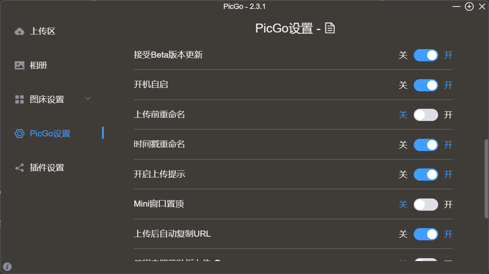

# 什么是图床
所谓图床，就是存储图片的服务器。
我们写在线文档的时候，如果我们把图片仅仅存放在本地，那么别人来去访问这个文档的时候，图片就看不到了。
那么，为了避免这样一种情况，使得别人在访问我的文档的时候，图片不会丢失，那么我就需要将我的图片存放到别人也可以访问的服务器上。通常，我们就称这样的服务器为图床。
> 因为是github搭建图床，访问github忙的情况，就得自行解决了。

# github创建图床服务器
## 创建仓库

## 生成token令牌

紧接着把这个repo全部选上：
然后拉到底部，选择创建就行了。

这个Token是你的服务器（即你的账户下的github服务器）的令牌，暂时和你的仓库还没有什么关系。
然后创建完以后，就会出现一串Token字符串，你把这个Token数字复制、保存下来(可以新创一个txt文件，保存到里面)。因为你可能一会儿就见不到了。
## 使用PicGo来实现图片上传
首先要说一下，PicGo是一款软件。我们就是用它来实现图片上传的。所以说，它是核心软件。
### 下载PicGo
> 下载地址：[https://mirrors.sdu.edu.cn/github-release/Molunerfinn_PicGo/v2.3.1/](https://mirrors.sdu.edu.cn/github-release/Molunerfinn_PicGo/v2.3.1/)

### PicGo配置

- 1、选择【图床设置】->【Github】然后进行配置：

- 具体配置方法：
   - 设定仓库名，实际上就是用户名+仓库名。这个仓库就是你刚刚在2.1中新建的仓库。具体来说，就是这个东西：
   - 设定分支名：就是你的仓库在哪个分支里，就填哪个分支。一般有main分支，master分支等。我这里是自己新创建的一个img分支。你填自己所在的分支就好。关于分支，具体来说，可以在这里查看：

- 设定Token：就是刚刚在2.2中我们复制的Token字符串。将其填进去即可。
- 设定存储路径，一般来说，它可以是你项目仓库中的一个文件夹。我们这里就统一设置成了img/
- 设置自定义域名。这个是比较关键的。我们可以用一个免费的加速域名作为我们自定义域名。

那么你所设置的就应当为[https://cdn.jsdelivr.net/gh/](https://cdn.jsdelivr.net/gh/) +你的账户名+你的仓库名@你的分支名。比如，我上面的就是[https://cdn.jsdelivr.net/gh/SoftLeaderGy/Pic@img](https://cdn.jsdelivr.net/gh/jianxiangwudi/MyPic@img) 按照需要改成你自己的。
> 需要注意的是，这里一定要设置成@，而不要设置成 / 我也是花了很长很长时间才搞明白。。。设置成 / 以后，你会惊奇地发现，它在你的typora里面显示不了。。。配置完以后，就可以点击确定，然后也可以将其设置为默认图床。

### 用PicGo上传图片
直接拖拽就可以了。

然后，我们能够在相册中看到我们已经上传的图片，可以查看、复制已经上传的图片的URL，同时也可以将上传的图片删除。

然后，我们也可以对PicGo进行一系列的设置。
比如启用时间戳，这样在多次上传同一张图片的时候就不会有问题了。

比如可以开启日志功能(默认开启)，这样我们上传失败可以通过查看日志来具体查看是什么原因。

##  设置Typora实现自动上传
这一点有个前提，就是你有那种代理呦hhh，否则，你可能会因为超时，而无法实现自动上传，只能手动将图片移到PicGo里面，然后再将URL复制到Typora里面啦~~

1. 首先，点击【文件】->【偏好设置】
2. 再次，选择【图像】。
3. 然后按照下图所示，插入图片时选择上传图片。然后在上传服务内选择PicGo，并选择PicGo.exe的路径。
4. 这里的可以这样来去配置：

> 然后这样的话，你将你的截图直接粘贴到Typora里面，你的Typora会将链接直接通过PicGo上传到你Github服务器的仓库中。然后别人和你就都可以通过访问这个链接来实现图片共享啦。这样，你在发送你的文件的时候，图片就不会丢失了。

