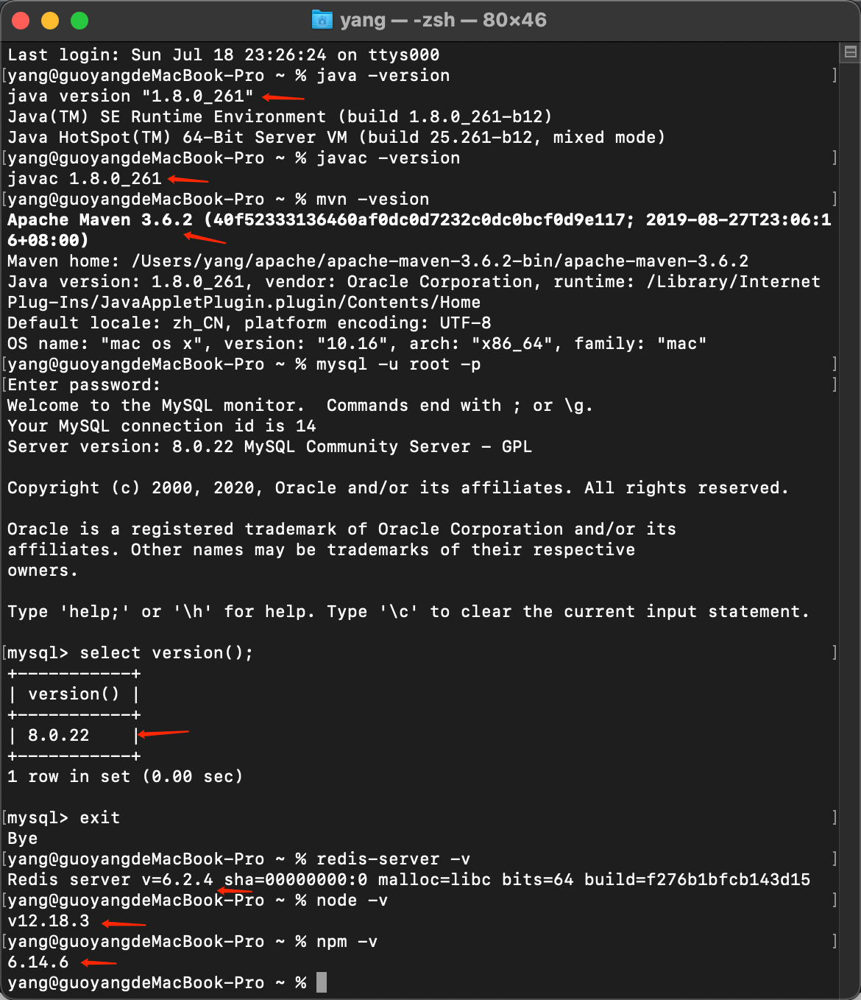

## 一、Mac-配置环境变量
> 作为计算机专业的，大学期间，环境变量是我的噩梦，但是他又很简单。。。。

### 1、步骤：
```haskell
// 打开终端
cd ~
vim ~/.bash_profile
// 配置环境变量就是在.bash_profile文件中起一个变量名字，变量名字等于配置者的安装路径（到bin的上层即可）
// export MAVEN_HOME=/Users/yang/apache/apache-maven-3.6.2-bin/apache-maven-3.6.2
// 配置PATH 
// export PATH=$PATH:$MAVEN_HOME/bin
// :wq(保存操作)
// source ~/.bash_profile（是刚才修改的内容生效）
// **************************************************************************
// *若当时终端生效，在新建终端窗口后命令不生效情况。
// *vim ~/.zshrc
// *将配置在~/.bash_profile中的信息，复制一份放在~/.zshrc文件中
// *:wq(保存修改的内容)
// *source ~/.zshrc
// ***************************************************************************
// ######################################
// #在配置mysql的时候如果不生效
// #vim ~/.bashrc
// #alias mysql=/usr/local/mysql/bin/mysql
// #source ~/.bashrc
// #到此为止即可解决问题
// ################ END #######################
```


_**.bash_profile文件**_
```haskell

//配置HomeBrew环境变量
# HomeBrew
export HOMEBREW_BOTTLE_DOMAIN=https://mirrors.ustc.edu.cn/homebrew-bottles
export PATH="/usr/local/bin:$PATH"
export PATH="/usr/local/sbin:$PATH"
# java
# HomeBrew END
//配置zookeeper环境变量
export PATH="/usr/local/Cellar/zookeeper/bin:$PATH"

//配置命令“ll”
alias ll='ls -alF'
alias 'll=ls -l'

//配置maven
# Maven
export MAVEN_HOME=/Users/yang/apache/apache-maven-3.6.2-bin/apache-maven-3.6.2
export PATH=$PATH:$MAVEN_HOME/bin

//配置mysql
#Mysql
#export MYSQL_HOME=/usr/local/mysql
#export PATH=$PATH:$MYSQL_HOME/bin
```

_**.zshrc文件**_
```haskell
# HomeBrew
export HOMEBREW_BOTTLE_DOMAIN=https://mirrors.ustc.edu.cn/homebrew-bottles
export PATH="/usr/local/bin:$PATH"
export PATH="/usr/local/sbin:$PATH"
# HomeBrew END
export PATH="/usr/local/Cellar/zookeeper/bin:$PATH"
source ~/.bash_profile
source ~/.bashrc
~    
```
_**~/.bashrc文件**_
```haskell
alias mysql=/usr/local/mysql/bin/mysql 
```
_**MacOS 当前系统环境**_

 ----------2021/07/19 00:13 

## 二、mac路由篇
### 1、mac添加路由
```shell
sudo route add -net 10.0.0.0 -netmask 255.0.0.0 10.59.122.129
```
### 2、mac删除路由
```shell
sudo route delete 10.0.0.0
```
### 3、mac查看路由表
```shell
netstat -rn
```
