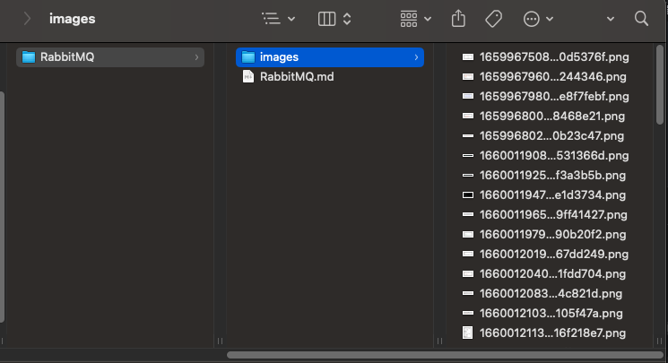
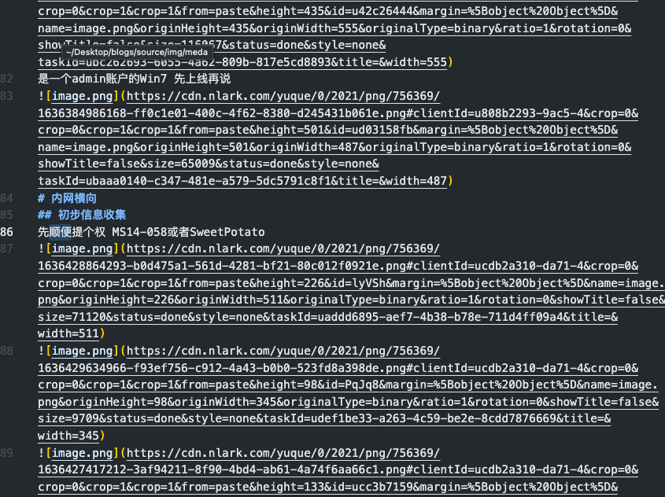
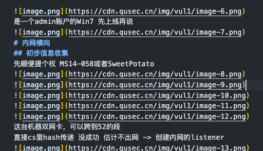
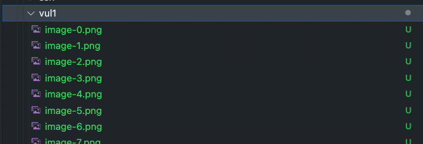

# 一、什么是语雀
> 文档与知识管理工具
> 语雀，是蚂蚁集团旗下的在线文档编辑与协同工具。
> 语雀使用了“结构化知识库管理”，形式上类似书籍的目录。与其他产品可以随意建立文档不同，语雀上的每一篇文档必须属于某一个知识库，语雀希望通过这样的产品设计，来从源头上帮助用户建立起知识管理的意识，培养良好的知识管理习惯。 
> 2022年2月22日正式推出移动端版本，移动端iOS与Android是同步上线。 

# 二、为什么要解决“图片CND指向问题”
语雀是我们爱记笔记同学的一款非常趁手的云文档软件了，我也是在语雀还没开始会员机制的时候就在使用了，也可以说是语雀的老玩家了。但是我发现在导出语雀文章的时候正常md文件访问，文件中的图片是没问题的，但是只要我把我的笔记部署在我的网站上的时候语雀图片就显示不了。原因就是图片的cdn指向的仍然是语雀的图床cdn。
# 三、解决方案
通过网络爬虫的方式将文章中语雀图床的图片爬取下来，存放在本地，并将文章中的图片cdn替换成下载的图片路径。
项目自行下载->[洋洋洋/yuque-md-img-handle](https://gitee.com/softleadergy/yuque-md-img-handle)
> 由于项目是python所写，需要有python3环境

## 3.1、使用
> 使用步骤中的文件夹位置，是我自己电脑的实际位置，实际使用时可替换成自己电脑的文件夹路径

```python
python3 main.py fileName 
```
### 3.1.1、步骤

1. 首先将下载的语雀原始md文件放在/Users/yang/SoftWare/knowledge-base/docs/yuque/fileName/下 路径可以在main.py文件中修改
2. 执行 python3 main.py fileName
3. main会将原始md文件中的图片爬去下来，存放的路径是原始文件所在的文件夹下的images目录下
4. 并且在此目录下生成一个名为new_fileName.md的文件，该文件里边的图片指向就是刚才爬去的图片
5. 至此就可以完成需求。。。。
6. 但是我为了方便，生成新文件后，我将原始文件删除，并把新文件改名成原始的文件名
7. 这样就做到将语雀导出的md文件中的图片转换处成本地指向的路径
### 3.1.2、实例运行
```python
python3 /Users/yang/PyCharmProjects/yuque-md/main.py RabbitMQ
```
### 3.1.3、效果展示

- 运行效果展示
   - 
   - 
- 使用前后对比
   - 从语雀官网导出的md:
      - 
   - 处理后的md:
      - 
   - 图片:
      - 
