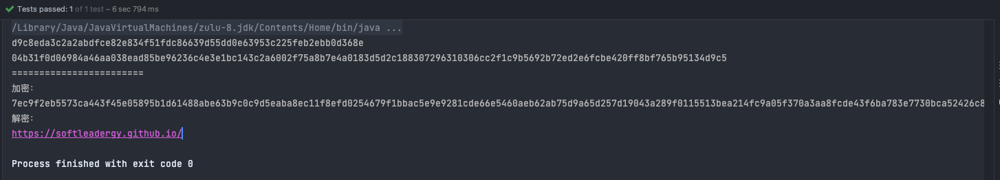
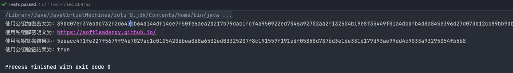

# 前言
> SM2是国家密码管理局于2010年12月17日发布的椭圆曲线公钥密码算法。
> SM2算法和RSA算法都是公钥密码算法，SM2算法是一种更先进安全的算法，在我们国家商用密码体系中被用来替换RSA算法。
> 随着密码技术和计算机技术的发展，目前常用的1024位RSA算法面临严重的安全威胁，我们国家密码管理部门经过研究，决定采用SM2椭圆曲线算法替换RSA算法。

# SM2算法和RSA算法比较
> SM2性能更优更安全：密码复杂度高、处理速度快、机器性能消耗更小
> 详细参考： [https://www.ecaa.org.cn/667.html](https://www.ecaa.org.cn/667.html)

# 后端代码实现
## 添加 sm2 依赖
```xml
<dependency>
    <groupId>com.antherd</groupId>
    <artifactId>sm-crypto</artifactId>
    <version>0.3.2</version>
</dependency>
```
## 获取密钥对
```java
    @Test
    public void testSM2(){
        // 生成出来的密钥可无缝衔接 前端 js 加解密
        Keypair keypair = Sm2.generateKeyPairHex();
        String privateKey = keypair.getPrivateKey(); // 公钥
        String publicKey = keypair.getPublicKey(); // 私钥

        System.out.println(privateKey);
        System.out.println(publicKey);

        System.out.println("========================");
    }
```
## 使用公私钥进行加解密
```java
    @Test
    public void testSM2(){
        // 生成出来的密钥可无缝衔接 前端 js 加解密
        Keypair keypair = Sm2.generateKeyPairHex();
        String privateKey = keypair.getPrivateKey(); // 公钥
        String publicKey = keypair.getPublicKey(); // 私钥

        System.out.println(privateKey);
        System.out.println(publicKey);

        System.out.println("========================");

        // cipherMode 1 - C1C3C2，0 - C1C2C3，默认为1
        // 使用公钥加密
        final String doEncrypt = Sm2.doEncrypt("https://softleadergy.github.io/", publicKey);
        System.out.println("加密： \n" + doEncrypt);
        // 私钥解密
        final String s = Sm2.doDecrypt(doEncrypt, privateKey);
        System.out.println("解密：\n" + s);
    }
```

# 前端代码实现 - vue
## 安装依赖
```shell
npm install --save sm-crypto
```
## 获取密钥对
```javascript
const sm2 = require('sm-crypto').sm2
let keypair = sm2.generateKeyPairHex()
publicKey = keypair.publicKey // 公钥
privateKey = keypair.privateKey // 私钥

// 自定义随机数，参数会直接透传给 jsbn 库的 BigInteger 构造器
// 注意：开发者使用自定义随机数，需要自行确保传入的随机数符合密码学安全
let keypair2 = sm2.generateKeyPairHex('123123123123123')
let keypair3 = sm2.generateKeyPairHex(256, SecureRandom)
let verifyResult = sm2.verifyPublicKey(publicKey) // 验证公钥

```
## 加密解密
```javascript

// 这里使用Java生成的密钥
// 后端生成密钥
const privateKey = 'a7a9846bbb015f8192bae355be4013d7b7b2bdcf56033b990d58bb5a7541f518'
const publicKey = '048ff6380b4db5c9fc9d80fc5e30bde049c12222c56b9085aa1f1c0b53cabd09e72dc5690110e5b57fc3ff88111d0d161723bcb6365c33cef70d3dbbdf32c7038f'


const sm2 = require('sm-crypto').sm2
const cipherMode = 1 // 1 - C1C3C2，0 - C1C2C3，默认为1
let encryptData = sm2.doEncrypt(msgString, publicKey, cipherMode) // 加密结果
let decryptData = sm2.doDecrypt(encryptData, privateKey, cipherMode) // 解密结果
// 指定输出类型
// encryptData = sm2.doEncrypt(msgArray, publicKey, cipherMode) // 加密结果，输入数组
// decryptData = sm2.doDecrypt(encryptData, privateKey, cipherMode, {output: 'array'}) // 解密结果，输出数组

```
## 最终封装
```javascript

/**
 * 前端加密
 * @param text
 * @returns {*}
 */
export function encrypt(text) {
  return sm2.doEncrypt(text, publicKey, 1) // 加密结果
}

/**
 * 前端解密
 * @param text
 * @returns {*}
 */
export function decrypt(text) {
  return sm2.doDecrypt(text, privateKey, 1) // 加密结果
}
```
# 签名验签
## 示例
```java
    @Test
    public void test(){
        // 获取公私钥
        Keypair keypair = Sm2.generateKeyPairHex();
        String privateKey = keypair.getPrivateKey(); // 公钥
        String publicKey = keypair.getPublicKey(); // 私钥
        // 需要加密的明文
        String msg = "https://softleadergy.github.io/";
        String encrypt = Sm2.doEncrypt(msg, publicKey);
        System.out.println("使用公钥加密密文为："+ encrypt);
        String decrypt = Sm2.doDecrypt(encrypt, privateKey);
        System.out.println("使用私钥解密明文为："+ decrypt);

        // 纯签名 + 生成椭圆曲线点
        String sigValueHex = Sm2.doSignature(msg, privateKey); // 签名
        System.out.println("使用私钥签名结果为："+ sigValueHex);
        boolean verifyResult = Sm2.doVerifySignature(msg, sigValueHex, publicKey); // 验签结果
        System.out.println("使用公钥验签结果为："+ verifyResult);
    }
```
## 输出
```java
使用公钥加密密文为：89bd07ef376bdc732f2d6430b64a144df14ce7f50fe6aea2d217b79dac1fcf4a950922ed7046a92702aa2f132504b19e8f35449f01a4dcbfb4d8a845e396d27d073b12cc89bb9db8d7bdd88e404be6d2b3d46527cc788012b210633500a3d7f00a7dc9d64d0a78a49ff58be351b03abe2d4cc30abbc5e2ec6fb297f10fa586
使用私钥解密明文为：https://softleadergy.github.io/
使用私钥签名结果为：5eeacc471fe227f5679f94e7029ac1c0105420dbea0d8a6532ed03325207f8c191559f191edf05858d787bd3e1de331d179d93ae99dd4c9033a93295054fb5b8
使用公钥验签结果为：true
```

> 签名验签、获取椭圆曲线点
> 详细请了解：[https://github.com/JuneAndGreen/sm-crypto#readme](https://github.com/JuneAndGreen/sm-crypto#readme)


---

