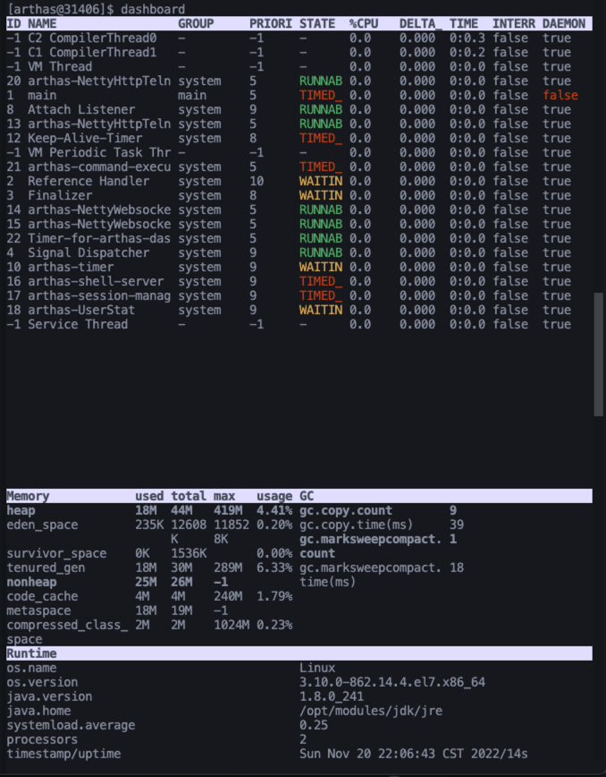
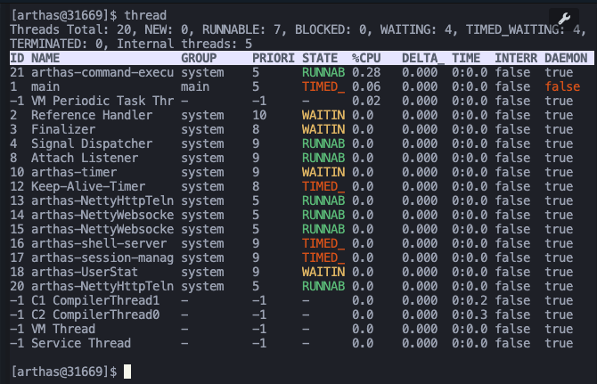
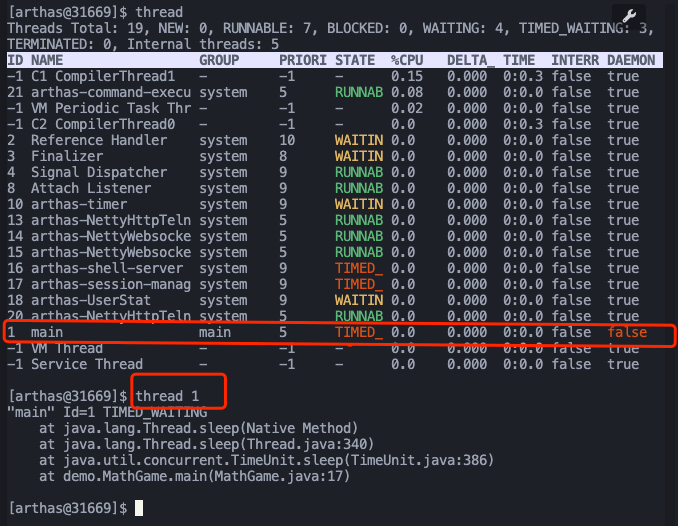
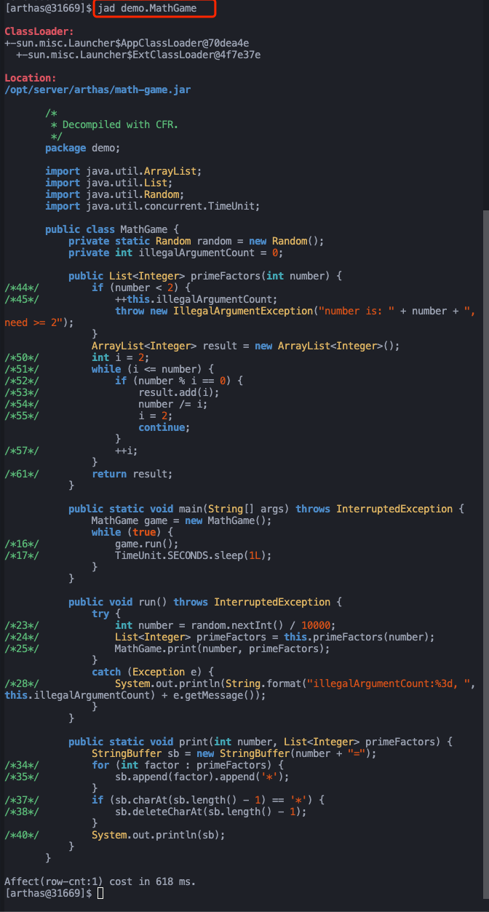

Java 应用诊断利器
> Arthas 是一款线上监控诊断产品，通过全局视角实时查看应用 load、内存、gc、线程的状态信息，并能在不修改应用代码的情况下，对业务问题进行诊断，包括查看方法调用的出入参、异常，监测方法执行耗时，类加载信息等，大大提升线上问题排查效率。

### 官网地址
[Arthas](https://arthas.aliyun.com/)
> 不用多说，阿里的开源的java应用诊断工具，嘎嘎好用

### 使用
#### 官网快速入门

   - 1. 启动 math-game

```bash
curl -O https://arthas.aliyun.com/math-game.jar
java -jar math-game.jar
```

`math-game`是一个简单的程序，每隔一秒生成一个随机数，再执行质因数分解，并打印出分解结果。

`math-game`源代码：

   - 2. 启动 arthas

在命令行下面执行（使用和目标进程一致的用户启动，否则可能 attach 失败）：

```bash
curl -O https://arthas.aliyun.com/arthas-boot.jar
java -jar arthas-boot.jar
```

   - 执行该程序的用户需要和目标进程具有相同的权限。比如以`admin`用户来执行：`sudo su admin && java -jar arthas-boot.jar` 或 `sudo -u admin -EH java -jar arthas-boot.jar`。
   - 如果 attach 不上目标进程，可以查看`~/logs/arthas/` 目录下的日志。
   - 如果下载速度比较慢，可以使用 aliyun 的镜像：`java -jar arthas-boot.jar --repo-mirror aliyun --use-http`
   - `java -jar arthas-boot.jar -h` 打印更多参数信息。

选择应用 java 进程：

```bash
$ $ java -jar arthas-boot.jar
* [1]: 35542
  [2]: 71560 math-game.jar
```

`math-game`进程是第 2 个，则输入 2，再输入`回车/enter`。Arthas 会 attach 到目标进程上，并输出日志：

```bash
[INFO] Try to attach process 71560
[INFO] Attach process 71560 success.
[INFO] arthas-client connect 127.0.0.1 3658
  ,---.  ,------. ,--------.,--.  ,--.  ,---.   ,---.
 /  O  \ |  .--. ''--.  .--'|  '--'  | /  O  \ '   .-'
|  .-.  ||  '--'.'   |  |   |  .--.  ||  .-.  |`.  `-.
|  | |  ||  |\  \    |  |   |  |  |  ||  | |  |.-'    |
`--' `--'`--' '--'   `--'   `--'  `--'`--' `--'`-----'


wiki: https://arthas.aliyun.com/doc
version: 3.0.5.20181127201536
pid: 71560
time: 2018-11-28 19:16:24

$
```

   - 3. 查看 dashboard

输入[dashboard](https://arthas.aliyun.com/doc/dashboard.html)，按`回车/enter`，会展示当前进程的信息，按`ctrl+c`可以中断执行。

```bash
$ dashboard
ID     NAME                   GROUP          PRIORI STATE  %CPU    TIME   INTERRU DAEMON
17     pool-2-thread-1        system         5      WAITIN 67      0:0    false   false
27     Timer-for-arthas-dashb system         10     RUNNAB 32      0:0    false   true
11     AsyncAppender-Worker-a system         9      WAITIN 0       0:0    false   true
9      Attach Listener        system         9      RUNNAB 0       0:0    false   true
3      Finalizer              system         8      WAITIN 0       0:0    false   true
2      Reference Handler      system         10     WAITIN 0       0:0    false   true
4      Signal Dispatcher      system         9      RUNNAB 0       0:0    false   true
26     as-command-execute-dae system         10     TIMED_ 0       0:0    false   true
13     job-timeout            system         9      TIMED_ 0       0:0    false   true
1      main                   main           5      TIMED_ 0       0:0    false   false
14     nioEventLoopGroup-2-1  system         10     RUNNAB 0       0:0    false   false
18     nioEventLoopGroup-2-2  system         10     RUNNAB 0       0:0    false   false
23     nioEventLoopGroup-2-3  system         10     RUNNAB 0       0:0    false   false
15     nioEventLoopGroup-3-1  system         10     RUNNAB 0       0:0    false   false
Memory             used   total max    usage GC
heap               32M    155M  1820M  1.77% gc.ps_scavenge.count  4
ps_eden_space      14M    65M   672M   2.21% gc.ps_scavenge.time(m 166
ps_survivor_space  4M     5M    5M           s)
ps_old_gen         12M    85M   1365M  0.91% gc.ps_marksweep.count 0
nonheap            20M    23M   -1           gc.ps_marksweep.time( 0
code_cache         3M     5M    240M   1.32% ms)
Runtime
os.name                Mac OS X
os.version             10.13.4
java.version           1.8.0_162
java.home              /Library/Java/JavaVir
                       tualMachines/jdk1.8.0
                       _162.jdk/Contents/Hom
                       e/jre
```

   - 4. 通过 thread 命令来获取到`math-game`进程的 Main Class

`thread 1`会打印线程 ID 1 的栈，通常是 main 函数的线程。

```bash
$ thread 1 | grep 'main('
    at demo.MathGame.main(MathGame.java:17)
```

   - 5. 通过 jad 来反编译 Main Class

```java
$ jad demo.MathGame

ClassLoader:
+-sun.misc.Launcher$AppClassLoader@3d4eac69
  +-sun.misc.Launcher$ExtClassLoader@66350f69

Location:
/tmp/math-game.jar

/*
 * Decompiled with CFR 0_132.
 */
package demo;

import java.io.PrintStream;
import java.util.ArrayList;
import java.util.Iterator;
import java.util.List;
import java.util.Random;
import java.util.concurrent.TimeUnit;

public class MathGame {
    private static Random random = new Random();
    private int illegalArgumentCount = 0;

    public static void main(String[] args) throws InterruptedException {
        MathGame game = new MathGame();
        do {
            game.run();
            TimeUnit.SECONDS.sleep(1L);
        } while (true);
    }

    public void run() throws InterruptedException {
        try {
            int number = random.nextInt();
            List<Integer> primeFactors = this.primeFactors(number);
            MathGame.print(number, primeFactors);
        }
        catch (Exception e) {
            System.out.println(String.format("illegalArgumentCount:%3d, ", this.illegalArgumentCount) + e.getMessage());
        }
    }

    public static void print(int number, List<Integer> primeFactors) {
        StringBuffer sb = new StringBuffer("" + number + "=");
        Iterator<Integer> iterator = primeFactors.iterator();
        while (iterator.hasNext()) {
            int factor = iterator.next();
            sb.append(factor).append('*');
        }
        if (sb.charAt(sb.length() - 1) == '*') {
            sb.deleteCharAt(sb.length() - 1);
        }
        System.out.println(sb);
    }

    public List<Integer> primeFactors(int number) {
        if (number < 2) {
            ++this.illegalArgumentCount;
            throw new IllegalArgumentException("number is: " + number + ", need >= 2");
        }
        ArrayList<Integer> result = new ArrayList<Integer>();
        int i = 2;
        while (i <= number) {
            if (number % i == 0) {
                result.add(i);
                number /= i;
                i = 2;
                continue;
            }
            ++i;
        }
        return result;
    }
}

Affect(row-cnt:1) cost in 970 ms.
```

   - 6. watch

通过[watch](https://arthas.aliyun.com/doc/watch.html)命令来查看`demo.MathGame#primeFactors`函数的返回值：

```bash
$ watch demo.MathGame primeFactors returnObj
Press Ctrl+C to abort.
Affect(class-cnt:1 , method-cnt:1) cost in 107 ms.
ts=2018-11-28 19:22:30; [cost=1.715367ms] result=null
ts=2018-11-28 19:22:31; [cost=0.185203ms] result=null
ts=2018-11-28 19:22:32; [cost=19.012416ms] result=@ArrayList[
    @Integer[5],
    @Integer[47],
    @Integer[2675531],
]
ts=2018-11-28 19:22:33; [cost=0.311395ms] result=@ArrayList[
    @Integer[2],
    @Integer[5],
    @Integer[317],
    @Integer[503],
    @Integer[887],
]
ts=2018-11-28 19:22:34; [cost=10.136007ms] result=@ArrayList[
    @Integer[2],
    @Integer[2],
    @Integer[3],
    @Integer[3],
    @Integer[31],
    @Integer[717593],
]
ts=2018-11-28 19:22:35; [cost=29.969732ms] result=@ArrayList[
    @Integer[5],
    @Integer[29],
    @Integer[7651739],
]
```

   - 7. 退出 arthas

如果只是退出当前的连接，可以用`quit`或者`exit`命令。Attach 到目标进程上的 arthas 还会继续运行，端口会保持开放，下次连接时可以直接连接上。

如果想完全退出 arthas，可以执行`stop`命令。
#### 进阶使用实战
##### 使用as.sh 启动 arthas 
```shell
curl -L https://arthas.aliyun.com/install.sh | sh
```
> 上述命令会下载启动脚本文件 as.sh 到当前目录，你可以放在任何地方或将其加入到 $PATH 中。
> 直接在 shell 下面执行./as.sh，就会进入交互界面。
> 也可以执行./as.sh -h来获取更多参数信息。

> 正常情况下，每次执行as.sh/arthas-boot.jar需要选择，或者指定 PID。这样会比较麻烦，因为每次启动应用，它的 PID 会变化。
> 通过select参数可以指定进程名字，非常方便。

实践使用`./as.sh --select math-game`直接启动arthas，并且监控到math-game服务上
```shell
[root@yang arthas]# ./as.sh --select math-game
Arthas script version: 3.6.7
[INFO] JAVA_HOME: /opt/modules/jdk
Arthas home: /root/.arthas/lib/3.6.7/arthas
Calculating attach execution time...
Attaching to 25609 using version /root/.arthas/lib/3.6.7/arthas...

real    0m1.134s
user    0m0.141s
sys     0m0.024s
Attach success.
telnet connecting to arthas server... current timestamp is 1668946894
Trying 127.0.0.1...
Connected to 127.0.0.1.
Escape character is '^]'.
  ,---.  ,------. ,--------.,--.  ,--.  ,---.   ,---.                           
 /  O  \ |  .--. ''--.  .--'|  '--'  | /  O  \ '   .-'                          
|  .-.  ||  '--'.'   |  |   |  .--.  ||  .-.  |`.  `-.                          
|  | |  ||  |\  \    |  |   |  |  |  ||  | |  |.-'    |                         
`--' `--'`--' '--'   `--'   `--'  `--'`--' `--'`-----'                          

wiki       https://arthas.aliyun.com/doc                                        
tutorials  https://arthas.aliyun.com/doc/arthas-tutorials.html                  
version    3.6.7                                                                
main_class                                                                      
pid        25609                                                                
time       2022-11-20 20:21:34                                                  

```
##### watch命令 监控服务的方法的入参、出参
使用命令
`watch 类路径 方法名 "{params[0],retuenObj}"`
实践
```shell
watch demo.MathGame primeFactors "{params[0],returnObj}"
```
效果
```shell
[arthas@26248]$ watch demo.MathGame primeFactors "{params[0],returnObj}"
Press Q or Ctrl+C to abort.
Affect(class count: 1 , method count: 1) cost in 69 ms, listenerId: 1
method=demo.MathGame.primeFactors location=AtExit
ts=2022-11-20 20:31:50; [cost=1.03729ms] result=@ArrayList[
    @Integer[1],
    @ArrayList[isEmpty=false;size=5],
]
method=demo.MathGame.primeFactors location=AtExit
ts=2022-11-20 20:31:51; [cost=0.127981ms] result=@ArrayList[
    @Integer[1],
    @ArrayList[isEmpty=false;size=4],
]
method=demo.MathGame.primeFactors location=AtExit
ts=2022-11-20 20:31:52; [cost=0.027071ms] result=@ArrayList[
    @Integer[1],
    @ArrayList[isEmpty=false;size=4],
]
```
##### dashboard命令
> 输入dashboard，会展示当前进程的信息


##### thread命令 

通过thread 查看的结果 的ID列 使用 `thread id` 可以查看运行的代码位置
通常用于判断应用CPU占用过高的情况

##### jad命令 通过 jad 来反编译 Main Class
命令： `jad 类路径`

