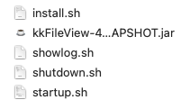

# 一、准备
- 代码获取 [https://gitee.com/kekingcn/file-online-preview](https://gitee.com/kekingcn/file-online-preview)
- 官网 [https://kkfileview.keking.cn/zh-cn/index.html](https://kkfileview.keking.cn/zh-cn/index.html)
# 二、获取kkFileView安装包

- 降代码拉取至本地
- 配置环境后，点击maven install
- 会在项目的根目录下`server/target/`下生成两个压缩包
- 
- `.zip`为windows版本，`.tar.gz`为linux版本
# 三、部署（以linux为例）
## 3.1、jar包形式部署

- 将生成的`.tar.gz`压缩包上传至linux服务器上
- 使用`tar -zxvf xxxx.tar.gz`进行解压
- 解压后 进入文件夹会有4文件夹
- 
- 进入bin目录
- 可以看到一些`sh`脚本、一个`jar`包
- 
- 通过`sh startup.sh`进行启动viewFile 程序
- 第一次启动时回去下载offic相关的插件，会比较慢
- 命令执行完成后，可以通过`sh showlog.sh`进行程序的日志查看
## 3.2、Docker 方式部署

- 拉取镜像 `docker pull keking/kkfileview:4.1.0`
- 如果网络环境不方便访问docker中央仓库可使用
   - `wget [http://kkfileview.keking.cn/kkFileView-4.1.0-docker.tar](http://kkfileview.keking.cn/kkFileView-4.1.0-docker.tar)`
   - `docker load -i kkFileView-4.1.0-docker.tar`
- 运行
   - `docker run -it-p8012:8012 keking/kkfileview:4.1.0`
   - 或使用 `-d`参数进行后台运行`docker run -itd -p8012:8012 keking/kkfileview:4.1.0`
- 查看日志
   - `docker logs -f--tail 容器ID`
## 3.3、可能遇到的问题
### 3.3.1、“找不到office组件，请确认’office.home’配置是否有误”
> 在启动服务的时候，会遇到报错“找不到office组件，请确认’office.home’配置是否有误”的情况，原因是因为我们的viewfile程序是需要office插件的支持才行，但是绝大部份linux服务器上并没有安装office插件的，需要我们自己来安装。

1. 其实`3.1`的步骤3中看到的`bin`文件夹中，会有一些文件
   - 
   - `KKFileView.xxx.jar`在线预览程序包，也就是说在线预览功能需要他来支撑。
   - `showlog.sh` 查看预览程序日志脚本。
   - `shutdown.sh` 停止预览程序。
   - `startup.sh` 启动预览程序
```bash
#!/bin/bash
DIR_HOME=("/opt/openoffice.org3" "/opt/libreoffice" "/opt/libreoffice6.1" "/opt/libreoffice7.0" "/opt/libreoffice7.1" "/opt/libreoffice7.2" "/opt/libreoffice7.3" "/opt/libreoffice7.4" "/opt/openoffice4" "/usr/lib/openoffice" "/usr/lib/libreoffice")
FLAG=
OFFICE_HOME=
KKFILEVIEW_BIN_FOLDER=$(cd "$(dirname "$0")" || exit 1 ;pwd)
PID_FILE_NAME="kkFileView.pid"
PID_FILE="${KKFILEVIEW_BIN_FOLDER}/${PID_FILE_NAME}"
export KKFILEVIEW_BIN_FOLDER=$KKFILEVIEW_BIN_FOLDER
#
## 如pid文件不存在则自动创建
if [ ! -f ${PID_FILE_NAME} ]; then
  touch "${KKFILEVIEW_BIN_FOLDER}/${PID_FILE_NAME}"
fi
## 判断当前是否有进程处于运行状态
if [ -s "${PID_FILE}" ]; then
  PID=$(cat "${PID_FILE}")
  echo "进程已处于运行状态，进程号为：${PID}"
  exit 1
else
  cd "$KKFILEVIEW_BIN_FOLDER" || exit 1
  echo "Using KKFILEVIEW_BIN_FOLDER $KKFILEVIEW_BIN_FOLDER"
  grep 'office\.home' ../config/application.properties | grep '!^#'
  if [ $? -eq 0 ]; then
    echo "Using customized office.home"
  else
  for i in ${DIR_HOME[@]}
    do
      if [ -f "$i/program/soffice.bin" ]; then
        FLAG=true
        OFFICE_HOME=${i}
        break
      fi
    done
    if [ ! -n "${FLAG}" ]; then
      echo "Installing LibreOffice"
      sh ./install.sh
    else
      echo "Detected office component has been installed in $OFFICE_HOME"
    fi
  fi

  ## 启动kkFileView
  echo "Starting kkFileView..."
  nohup java -Dfile.encoding=UTF-8 -Dspring.config.location=../config/application.properties -jar kkFileView-4.4.0-SNAPSHOT.jar > ../log/kkFileView.log 2>&1 &
  echo "Please execute ./showlog.sh to check log for more information"
  echo "You can get help in our official home site: https://kkview.cn"
  echo "If you need further help, please join our kk opensource community: https://t.zsxq.com/09ZHSXbsQ"
  echo "If this project is helpful to you, please star it on https://gitee.com/kekingcn/file-online-preview/stargazers"
  PROCESS=$(ps -ef | grep kkFileView | awk 'NR==1{print $2}')
  # 启动成功后将进程号写入pid文件
  echo "$PROCESS" > "$PID_FILE"
fi

```

   - 可以看到在`startup.sh`36行，回去主动执行一下，install.sh 文件，也就是说我们只需要启动`startup.sh`就可以了
   - `install.sh` 下载所需office插件脚本
```bash
#!/bin/bash
cd /tmp

install_redhat() {
   wget https://downloadarchive.documentfoundation.org/libreoffice/old/7.5.3.2/rpm/x86_64/LibreOffice_7.5.3.2_Linux_x86-64_rpm.tar.gz -cO LibreOffice_7_rpm.tar.gz && tar -zxf /tmp/LibreOffice_7_rpm.tar.gz && cd /tmp/LibreOffice_7.5.3.2_Linux_x86-64_rpm/RPMS
   echo $?
   if [ $? -eq 0 ];then
     yum install -y libSM.x86_64 libXrender.x86_64  libXext.x86_64
     yum groupinstall -y  "X Window System"
     yum localinstall -y *.rpm
     echo 'install finshed...'
   else
     echo 'download package error...'
   fi
}

install_ubuntu() {
   wget https://downloadarchive.documentfoundation.org/libreoffice/old/7.5.3.2/deb/x86_64/LibreOffice_7.5.3.2_Linux_x86-64_deb.tar.gz  -cO LibreOffice_7_deb.tar.gz && tar -zxf /tmp/LibreOffice_7_deb.tar.gz && cd /tmp/LibreOffice_7.5.3.2_Linux_x86-64_deb/DEBS
   echo $?
 if [ $? -eq 0 ];then
     apt-get install -y libxinerama1 libcairo2 libcups2 libx11-xcb1
     dpkg -i *.deb
     echo 'install finshed...'
  else
    echo 'download package error...'
 fi
}


if [ -f "/etc/redhat-release" ]; then
  yum install -y wget
  install_redhat
else
  apt-get install -y wget
  install_ubuntu
fi

```

2. 但是在执行后启动的时候一样会报错：找不到office组件，请确认’office.home’配置是否有误，
3. 我们通过`cd /tmp/LibreOffice_7.1.4.2_Linux_x86-64_rpm/RPMS`（注意LibreOffice的版本号）
4. 执行`yum localinstall *.rpm -y`进行安装
5. 再次回到`bin`文件夹执行`sh startup.sh`即可启动
### 3.3.2、“在cd /tmp/LibreOffice_7.1.4.2_Linux_x86-64_rpm/RPMS 过程中，找不到文件夹”

- 找不到文件夹的原因 可能是因为服务器的网络问题，没有下载下来。
- 打开`资源压缩包`，会有一个`LibreOffice_7_rpm.tar.gz`
- 将压缩包上传至服务器的 `/tmp`位置
- 使用`tar -zxvf xxxx.tar.gz`进行解压
- 执行 3.3.1.3步骤

