# 一、搭建过程
## 1.1、官网
[分布式任务调度平台XXL-JOB](https://www.xuxueli.com/xxl-job/)
## 1.2、代码结构
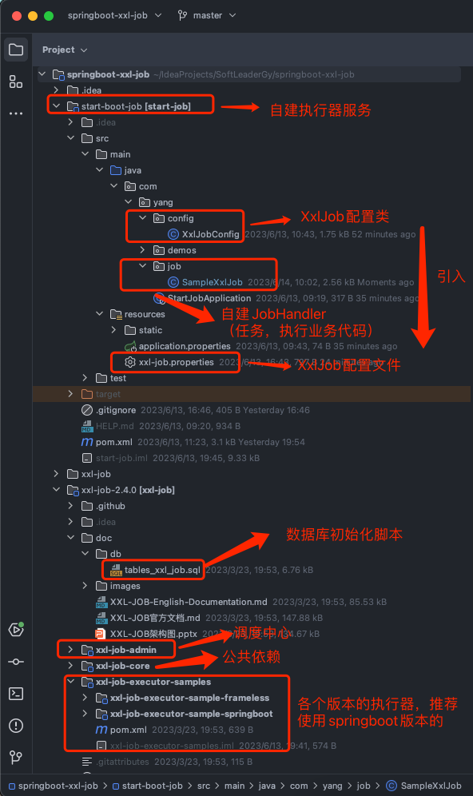
## 1.3、初始化数据库

- 初始化脚本在上面源码目录的  /doc/db/tables_xxl_job.sql ，将此脚本在MySQL数据库中执行一遍。
- 执行完毕，会在MySQL数据库中生成如下 8 张表：

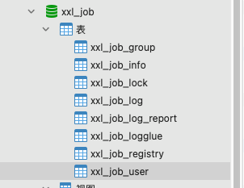
## 1.4、配置调度中心（admin）
调度中心就是源码中的 xxl-job-admin 工程，我们需要将其配置成自己需要的调度中心，通过该工程我们能够以图形化的方式统一管理任务调度平台上调度任务，负责触发调度执行
### 1.4.1、修改调度中心配置文件
文件地址：/xxl-job/xxl-job-admin/src/main/resources/xxl-job-admin.properties
配置文件说明：
```properties
### 1、调度中心项目的端口号以及访问路径
server.port=8080
server.context-path=/xxl-job-admin

### 2、配置静态文件的前缀
spring.mvc.static-path-pattern=/static/**
spring.resources.static-locations=classpath:/static/

### 3、配置模板文件
spring.freemarker.templateLoaderPath=classpath:/templates/
spring.freemarker.suffix=.ftl
spring.freemarker.charset=UTF-8
spring.freemarker.request-context-attribute=request
spring.freemarker.settings.number_format=0.##########

### 4、配置mybatis的mapper文件地址
mybatis.mapper-locations=classpath:/mybatis-mapper/*Mapper.xml

### 5、配置数据库的地址
spring.datasource.url=jdbc:mysql://127.0.0.1:3306/xxl_job?useUnicode=true&characterEncoding=UTF-8&autoReconnect=true&serverTimezone=Asia/Shanghai
spring.datasource.username=root
spring.datasource.password=root123456
spring.datasource.driver-class-name=com.mysql.cj.jdbc.Driver

spring.datasource.type=org.apache.tomcat.jdbc.pool.DataSource
spring.datasource.tomcat.max-wait=10000
spring.datasource.tomcat.max-active=30
spring.datasource.tomcat.test-on-borrow=true
spring.datasource.tomcat.validation-query=SELECT 1
spring.datasource.tomcat.validation-interval=30000

### 6、配置报警邮箱
spring.mail.host=smtp.qq.com
spring.mail.port=25
spring.mail.username=xxx@qq.com
spring.mail.password=xxx
spring.mail.properties.mail.smtp.auth=true
spring.mail.properties.mail.smtp.starttls.enable=true
spring.mail.properties.mail.smtp.starttls.required=true


### 7、调度中心通讯TOKEN，非空时启用
xxl.job.accessToken=default_token

### 8、调度中心国际化设置，默认为中文版本，值设置为“en”时切换为英文版本
xxl.job.i18n=
```
> 注意：基本上上面的配置文件我们需要修改的只有第 5 点，修改数据库的地址，这要与我们前面初始化的数据库名称径，用户名密码保持一致；
> 第二个就是修改第 6 点，报警邮箱，因为该工程任务失败后有失败告警功能，可以通过邮件来提醒，如果我们需要此功能，可以配置一下。

###  1.4.2、部署调度中心
该工程是一个springboot项目，我们只需要在IDEA中执行 XxlJobAdminApplication 类即可运行该工程：
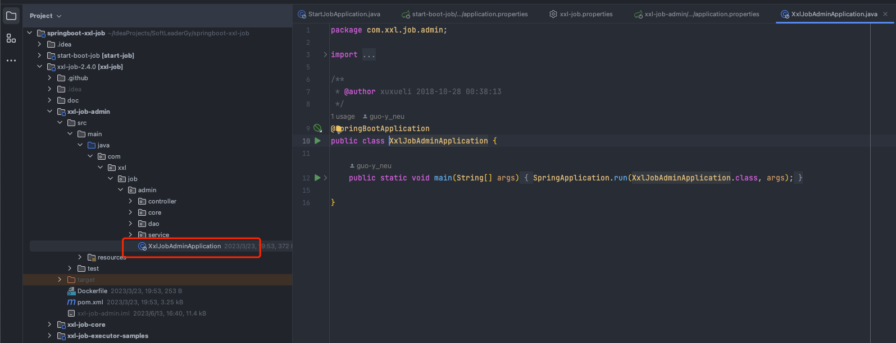
### 1.4.3、访问调度中心管理界面
在浏览器输入 [http://localhost:8080/xxl-job-admin](http://localhost:8080/xxl-job-admin) 然后输入用户名和密码（默认账密为admin/123456），即可看到如下管理界面。
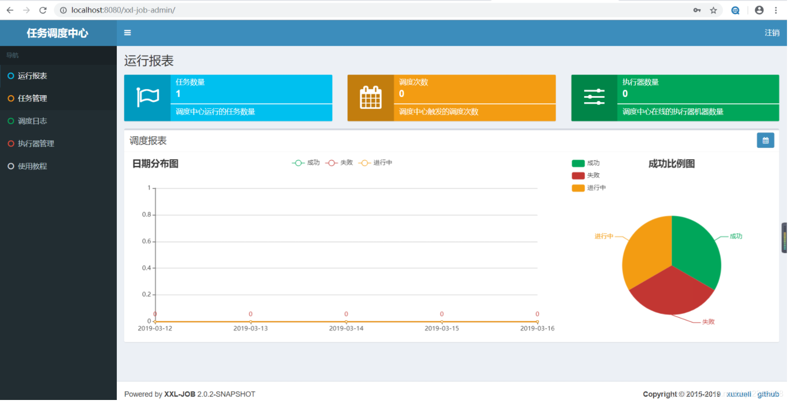
## 1.5、自建执行器项目
以创建一个 springboot 版本的执行器为例
### 1.5.1、添加maven依赖

- 在创建好的springboot 项目的pom.xml 文件中添加如下依赖：
```xml
<!-- xxl-rpc-core -->
<dependency>
  <groupId>com.xuxueli</groupId>
  <artifactId>xxl-job-core</artifactId>
  <version>2.4.0</version>
</dependency>
```
### 1.5.2、配置执行器
在创建好的springboot 项目的配置文件 xxl-job.properties 添加如下配置：
```properties
### xxl-job admin address list, such as "http://address" or "http://address01,http://address02"
xxl.job.admin.addresses=http://127.0.0.1:8080/xxl-job-admin

### xxl-job, access token
xxl.job.accessToken=default_token

### xxl-job executor appname
#xxl.job.executor.appname=xxl-job-executor-sample-cluster
xxl.job.executor.appname=xxl-job-executor-sample
### xxl-job executor registry-address: default use address to registry , otherwise use ip:port if address is null
xxl.job.executor.address=
### xxl-job executor server-info
xxl.job.executor.ip=
xxl.job.executor.port=9999
### xxl-job executor log-path
xxl.job.executor.logpath=./xxl-job/jobhandler
### xxl-job executor log-retention-days
xxl.job.executor.logretentiondays=30
```
> 注意：
> 1. 配置执行器的名称、IP地址、端口号，后面如果配置多个执行器时，要**防止端口冲突**。再就是**执行器的名称**，我们后面会到上一步的调度中心管理界面**进行对应配置**。

### 1.5.3、创建XxlJobConfig配置类
在项目中创建 XxlJobConfig并使用自定义的配置文件
```java
import com.xxl.job.core.executor.impl.XxlJobSpringExecutor;
import org.slf4j.Logger;
import org.slf4j.LoggerFactory;
import org.springframework.beans.factory.annotation.Value;
import org.springframework.context.annotation.Bean;
import org.springframework.context.annotation.Configuration;
import org.springframework.context.annotation.PropertySource;

/**
* @Description: xxl-job配置类
* @Author: Guo.Yang
* @Date: 2023/06/13/09:42
*/
@Configuration
@PropertySource("classpath:xxl-job.properties")
public class XxlJobConfig {

    private Logger logger = LoggerFactory.getLogger(XxlJobConfig.class);

    @Value("${xxl.job.admin.addresses}")
    private String adminAddresses;

    @Value("${xxl.job.executor.appname}")
    private String appname;

    @Value("${xxl.job.executor.ip}")
    private String ip;

    @Value("${xxl.job.executor.port}")
    private int port;

    @Value("${xxl.job.accessToken}")
    private String accessToken;

    @Value("${xxl.job.executor.logpath}")
    private String logPath;

    @Value("${xxl.job.executor.logretentiondays}")
    private int logRetentionDays;


    @Bean
    public XxlJobSpringExecutor xxlJobExecutor() {
        logger.info(">>>>>>>>>>> xxl-job config init.");
        XxlJobSpringExecutor xxlJobSpringExecutor = new XxlJobSpringExecutor();
        xxlJobSpringExecutor.setAdminAddresses(adminAddresses);
        xxlJobSpringExecutor.setAppname(appname);
        xxlJobSpringExecutor.setIp(ip);
        xxlJobSpringExecutor.setPort(port);
        xxlJobSpringExecutor.setAccessToken(accessToken);
        xxlJobSpringExecutor.setLogPath(logPath);
        xxlJobSpringExecutor.setLogRetentionDays(logRetentionDays);

        return xxlJobSpringExecutor;
    }
}
```
### 1.5.4、创建任务JobHandler
> 注意：这里有个注解 @XxlJob("demoJobHandler")，对于 value的值，我们会在下面进行相应配置。
> 在项目中创建一个Handler，用于执行我们想要执行的东西，这里我只是简单的打印一行日志：

:::info
注意⚠️： 以下代码列出了三种创建job的形式

1. 简单模式的job
2. 接受admin管理后台传入参数的job
3. 分片广播模式的job（适用于job的集群模式，触发任务使集群每一台机器的任务都能执行）
:::
```java
import com.xxl.job.core.context.XxlJobHelper;
import com.xxl.job.core.handler.annotation.XxlJob;
import lombok.extern.slf4j.Slf4j;
import org.springframework.stereotype.Component;

import java.util.List;

/**
* @Description:
* @Author: Guo.Yang
* @Date: 2023/06/13/09:47
*/


/**
* XxlJob开发示例（Bean模式）
*
* 开发步骤：
*      1、任务开发：在Spring Bean实例中，开发Job方法；
*      2、注解配置：为Job方法添加注解 "@XxlJob(value="自定义jobhandler名称", init = "JobHandler初始化方法", destroy = "JobHandler销毁方法")"，注解value值对应的是调度中心新建任务的JobHandler属性的值。
*      3、执行日志：需要通过 "XxlJobHelper.log" 打印执行日志；
*      4、任务结果：默认任务结果为 "成功" 状态，不需要主动设置；如有诉求，比如设置任务结果为失败，可以通过 "XxlJobHelper.handleFail/handleSuccess" 自主设置任务结果；
*
*/
@Component
@Slf4j
public class SampleXxlJob {

    /**
    * 简单任务实例（bean模式）
    */
    @XxlJob("demoJobHandler")
    public void demoJobHandler(){
        // 需要执行的任务业务代码
        log.info("xxl-job hello world");
    }

    /**
    * 获取admin传入的参数
    */
    @XxlJob("demoJobHandlerParams")
    public void demoJobHandlerParams(){
        // 获取后台管理传过来的参数
        String jobParam = XxlJobHelper.getJobParam();
    
        // 需要执行的任务业务代码
        log.info("xxl-job demoJobHandlerParams={}",jobParam);
    }


    /**
    * 2、分片广播任务
    */
    @XxlJob("shardingJobHandler")
    public void shardingJobHandler() throws Exception {
        // 分片参数
        int shardIndex = XxlJobHelper.getShardIndex();
        int shardTotal = XxlJobHelper.getShardTotal();

        XxlJobHelper.log("分片参数：当前分片序号 = {}, 总分片数 = {}", shardIndex, shardTotal);
        log.info("分片参数：当前分片序号 = {}, 总分片数 = {}", shardIndex, shardTotal);
        // 业务逻辑
        for (int i = 0; i < shardTotal; i++) {
            if (i == shardIndex) {
                XxlJobHelper.log("第 {} 片, 命中分片开始处理", i);
                log.info("第 {} 片, 命中分片开始处理", i);
            } else {
                XxlJobHelper.log("第 {} 片, 忽略", i);
                log.info("第 {} 片, 忽略", i);
            }
        }
    }
}
```
## 1.6、在调度中心中配置执行器
> 调度中心指的就是我们之前配置的xxl-job-admin（后台管理）
> 调度中心前面我们已经配置好了，启动该配置中心，进入[http://localhost:8080/xxl-job-admin](http://localhost:8080/xxl-job-admin) 界面。
> 初始化账密：admin/123456

### 1.6.1、配置执行器

- 点击  执行器管理-->  新增执行器-->，如下如下界面，然后填充此表格，点击**保存**即可。

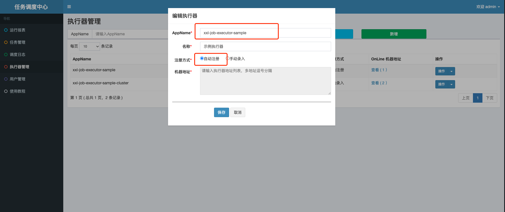

- 执行器被成功注册

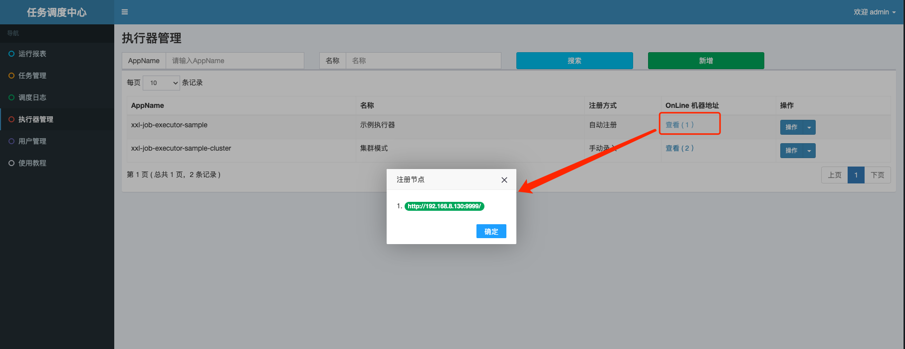
下面是对这几个参数的介绍：
- a**ppname**：是每个执行器集群的唯一标示a**ppname**, 执行器会周期性以a**ppname**为对象进行自动注册。可通过该配置自动发现注册成功的执行器, 供任务调度时使用;
- **名称**：执行器的名称, 因为AppName限制字母数字等组成,可读性不强, 名称为了提高执行器的可读性;
- 排序: 执行器的排序, 系统中需要执行器的地方,如任务新增, 将会按照该排序读取可用的执行器列表;
- 注册方式：调度中心获取执行器地址的方式，
- 自动注册：执行器自动进行执行器注册，调度中心通过底层注册表可以动态发现执行器机器地址；
- 手动录入：人工手动录入执行器的地址信息，多地址逗号分隔，供调度中心使用；
- 机器地址："注册方式"为"手动录入"时有效，支持人工维护执行器的地址信息；
:::info
注意：

1. 配置执行器时AppName需要与自建执行器项目中的 xxl.job.executor.appname=xxl-job-executor-sample 配置保持一致，且在自动注册中才能获取到注册节点，
2. 在手动注册执行器节点的时候，节点地址要写全，例如[http://127.0.0.1:9998/](http://127.0.0.1:9998/)，如果是多个执行器节点的时候地址与地址之间需要用英文的逗号分隔开，例如：[http://127.0.0.1:9998/,http://127.0.0.1:9999/](http://127.0.0.1:9998/,http://127.0.0.1:9999/)
:::
### 1.6.2、创建任务
点击 任务管理---》新增任务---》
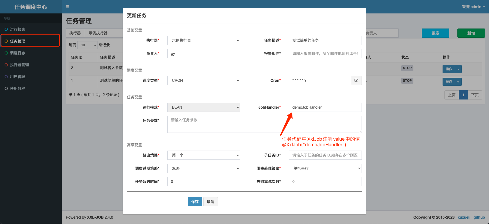
参数说明
- 执行器：任务的绑定的执行器，任务触发调度时将会自动发现注册成功的执行器, 实现任务自动发现功能; 另一方面也可以方便的进行任务分组。每个任务必须绑定一个执行器, 可在 "执行器管理" 进行设置。
- 任务描述：任务的描述信息，便于任务管理；
- 路由策略：当执行器集群部署时，提供丰富的路由策略，包括；
   - FIRST（第一个）：固定选择第一个机器；
   - LAST（最后一个）：固定选择最后一个机器；
   - ROUND（轮询）：；
   - RANDOM（随机）：随机选择在线的机器；
   - CONSISTENT_HASH（一致性HASH）：每个任务按照Hash算法固定选择某一台机器，且所有任务均匀散列在不同机器上。
   - LEAST_FREQUENTLY_USED（最不经常使用）：使用频率最低的机器优先被选举；
   - LEAST_RECENTLY_USED（最近最久未使用）：最久为使用的机器优先被选举；
   - FAILOVER（故障转移）：按照顺序依次进行心跳检测，第一个心跳检测成功的机器选定为目标执行器并发起调度；
   - BUSYOVER（忙碌转移）：按照顺序依次进行空闲检测，第一个空闲检测成功的机器选定为目标执行器并发起调度；
   - SHARDING_BROADCAST(分片广播)：广播触发对应集群中所有机器执行一次任务，同时系统自动传递分片参数；可根据分片参数开发分片任务；
   - Cron：触发任务执行的Cron表达式；
- 运行模式：
   - BEAN模式：任务以JobHandler方式维护在执行器端；需要结合 "JobHandler" 属性匹配执行器中任务；
   - GLUE模式(Java)：任务以源码方式维护在调度中心；该模式的任务实际上是一段继承自IJobHandler的Java类代码并 "groovy" 源码方式维护，它在执行器项目中运行，可使用@Resource/@Autowire注入执行器里中的其他服务；
   - GLUE模式(Shell)：任务以源码方式维护在调度中心；该模式的任务实际上是一段 "shell" 脚本；
   - GLUE模式(Python)：任务以源码方式维护在调度中心；该模式的任务实际上是一段 "python" 脚本；
   - GLUE模式(PHP)：任务以源码方式维护在调度中心；该模式的任务实际上是一段 "php" 脚本；
   - GLUE模式(NodeJS)：任务以源码方式维护在调度中心；该模式的任务实际上是一段 "nodejs" 脚本；
   - GLUE模式(PowerShell)：任务以源码方式维护在调度中心；该模式的任务实际上是一段 "PowerShell" 脚本；
   - JobHandler：运行模式为 "BEAN模式" 时生效，对应执行器中新开发的JobHandler类“@JobHandler”注解自定义的value值；
- 阻塞处理策略：调度过于密集执行器来不及处理时的处理策略；
   - 单机串行（默认）：调度请求进入单机执行器后，调度请求进入FIFO队列并以串行方式运行；
   - 丢弃后续调度：调度请求进入单机执行器后，发现执行器存在运行的调度任务，本次请求将会被丢弃并标记为失败；
   - 覆盖之前调度：调度请求进入单机执行器后，发现执行器存在运行的调度任务，将会终止运行中的调度任务并清空队列，然后运行本地调度任务；
- 子任务：每个任务都拥有一个唯一的任务ID(任务ID可以从任务列表获取)，当本任务执行结束并且执行成功时，将会触发子任务ID所对应的任务的一次主动调度。
- 任务超时时间：支持自定义任务超时时间，任务运行超时将会主动中断任务；
- 失败重试次数；支持自定义任务失败重试次数，当任务失败时将会按照预设的失败重试次数主动进行重试；
- 报警邮件：任务调度失败时邮件通知的邮箱地址，支持配置多邮箱地址，配置多个邮箱地址时用逗号分隔；
- 负责人：任务的负责人；
- 执行参数：任务执行所需的参数，多个参数时用逗号分隔，任务执行时将会把多个参数转换成数组传入；可通过以下方式获取传入的参数
```java
// 获取后台管理传过来的参数
String jobParam = XxlJobHelper.getJobParam();
```
# 二、启动测试
## 2.1、启动任务

- 配置完执行器以及任务，我们只需要启动该任务，便可以运行了。

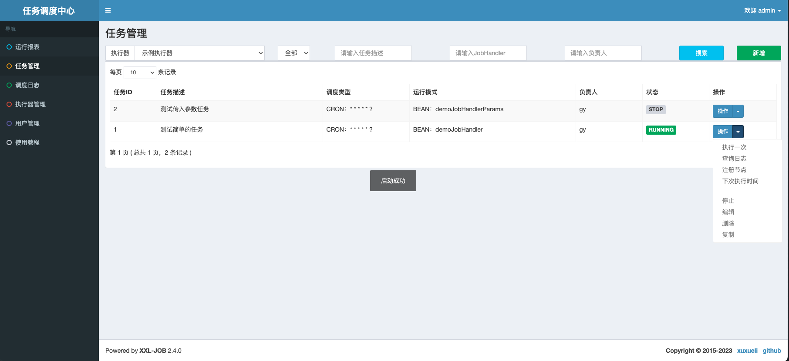
## 2.2、测试

- 启动之后我们查看日志

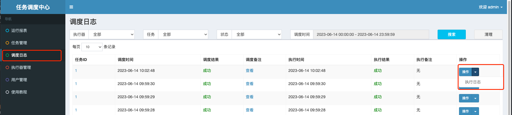
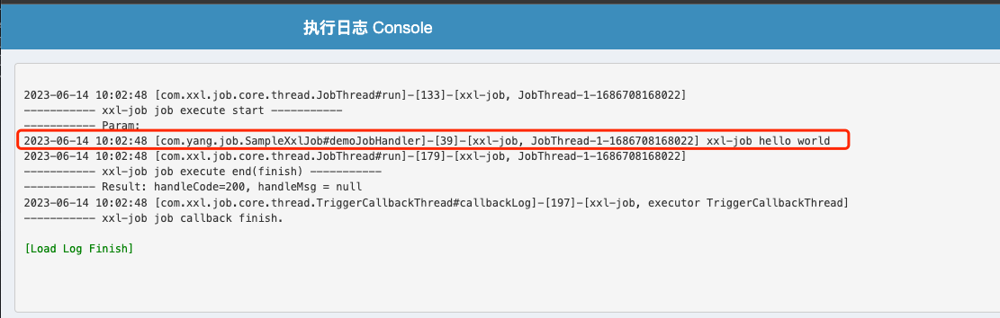
:::danger
注意：在项目中，只有通过 XxlJobLogger.log() 代码才能将日志打印到上面。
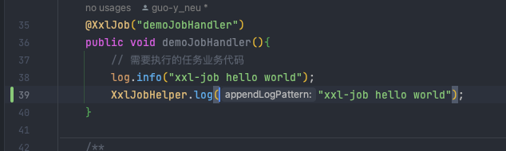
:::

- 项目中的控制台日志为

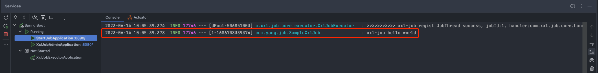

---


