# Mybatis学习


## 一、Mybatis简介


## 二、Mybatis的第一个程序

### 思路👇

- 搭建环境

- 导入Mybatis jar包

- 编写代码

- 测试

### 1、搭建环境

- 创建表

```javascript
create database Mybatis;

use Mybatis;

create table user(id int(20) not null,
                name varchar(50),
                pwd varchar(50),primary key(id))
                engine=innodb default charset=utf8;
                
insert into user values(1,'郭洋','123456'),
                        (2,'张三','45678'),
                        (3,'李四','989765');
                        
```

- 新建项目（Maven项目）

- 删除src目录

- 导入依赖

```javascript
<!--导入依赖-->
<dependencies>
    <!--导入mysql依赖-->
    <dependency>
        <groupId>mysql</groupId>
        <artifactId>mysql-connector-java</artifactId>
        <version>5.1.47</version>
    </dependency>
    <!--导入mybatis依赖-->
    <dependency>
        <groupId>org.mybatis</groupId>
        <artifactId>mybatis</artifactId>
        <version>3.5.2</version>
    </dependency>
    <!--junit-->
    <dependency>
        <groupId>junit</groupId>
        <artifactId>junit</artifactId>
        <version>4.12</version>
    </dependency>
    <dependency>
        <groupId>org.projectlombok</groupId>
        <artifactId>lombok</artifactId>
    <version>1.18.16</version>
</dependency>
</dependencies>

<!--在build中配置resource，来防止我们资源导出失败的问题-->
<build>
    <resources>
        <resource>
            <directory>src/main/resources</directory>
            <includes>
                <include>**/*.properties</include>
                <include>**/*.xml</include>
            </includes>
            <filtering>true</filtering>
        </resource>
        <resource>
            <directory>src/main/java</directory>
            <includes>
                <include>**/*.properties</include>
                <include>**/*.xml</include>
            </includes>
            <filtering>true</filtering>
        </resource>
    </resources>
</build>
```

### 2、创建Module

- 编写mybatis核心配置文件

```javascript
<?xml version="1.0" encoding="UTF-8" ?>
<!DOCTYPE configuration
        PUBLIC "-//mybatis.org//DTD Config 3.0//EN"
        "http://mybatis.org/dtd/mybatis-3-config.dtd">
<!--核心配置文件-->
<configuration>
    <environments default="development">
        <!--可配置多套环境：测试、开发、现场。。。-->
        <environment id="development">
            <!--事务管理使用的是JDBC-->
            <transactionManager type="JDBC"/>
            <!--配置数据源-->
            <dataSource type="POOLED">
                <property name="driver" value="com.mysql.jdbc.Driver"/>
                <property name="url" value="jdbc:mysql://localhost:3306/mybatis?useSSL=true;useUnicode=true;characterEncoding=UTF-8"/>
                <property name="username" value="root"/>
                <property name="password" value="root123456"/>
            </dataSource>
        </environment>
    </environments>
    // 每个mapper.xml文件都需要在核心配置文件中配置
    <mappers>
        <mapper resource="com/yang/mapper/userMapper.xml"/>
    </mappers>
</configuration>
```

- 编写mybatis工具类

```javascript
public class MybatisUtils {
    String resource = "mybatis-config.xml";
    private static SqlSessionFactory sqlSessionFactory;

    InputStream inputStream;

    {
        try {
            //获取sqlSessionFactory对象
            inputStream = Resources.getResourceAsStream(resource);
            sqlSessionFactory = new SqlSessionFactoryBuilder().build(inputStream);
        } catch (IOException e) {
            e.printStackTrace();
        }
    }
    public static SqlSession getSqlSession(){
        SqlSession sqlSession = sqlSessionFactory.openSession();
        return sqlSession;
    }
}
```

### 3、编写代码

- 实体类

```javascript
@Data
@NoArgsConstructor
@AllArgsConstructor
public class userPo {
    private int id;
    private String name;
    private String pwd;
}
```

- Mapper接口

```javascript
public interface userMapper {
    List<userPo> getUserList();
}
```

- 编写mapper.xml

```javascript
<?xml version="1.0" encoding="UTF-8" ?>
<!DOCTYPE mapper
        PUBLIC "-//mybatis.org//DTD Mapper 3.0//EN"
        "http://mybatis.org/dtd/mybatis-3-mapper.dtd">
<mapper namespace="com.yang.mapper.userMapper">
    <select id="getUserList" resultType="com.yang.po.userPo">
        select * from user
    </select>
</mapper>
```

### 4、测试

- 测试

```javascript
@Test
public void test(){

    SqlSession sqlSession = MybatisUtils.getSqlSession();
    userMapper mapper = sqlSession.getMapper(userMapper.class);
    List<userPo> userList = mapper.getUserList();
    for (userPo user:userList) {
        System.out.println(user);
    }
}
```

- 问题：

- 1、org.apache.ibatis.binding.BindingException: Type interface com.yang.mapper.userMapper is not known to the MapperRegistry.

- 说明：每一个Mapper.xml都需要在Mybatis核心配置文件中注册

```javascript
<mappers>
    <mapper resource="com/yang/mapper/userMapper.xml"/>
</mappers>
```

- 解释：默认从resources中读取，如果文件不是写在resources下就要配置

- 2、可能会遇到我们写的xml文件无法导出或不生效的问题。

- 解决方案：在pom文件中配置，使resources下和src/main/java下的文件可以被导出。

```javascript

<!--在build中配置resource，来防止我们资源导出失败的问题-->
<build>
    <resources>
        <resource>
            <directory>src/main/resource</directory>
            <includes>
                <include>**/*.properties</include>
                <include>**/*.xml</include>
            </includes>
            <filtering>true</filtering>
        </resource>
        <resource>
            <directory>src/main/java</directory>
            <includes>
                <include>**/*.properties</include>
                <include>**/*.xml</include>
            </includes>
            <filtering>true</filtering>
        </resource>
    </resources>
</build>
```


- JDBC连接出错Sat Oct 24 12:36:27 CST 2020 WARN: Establishing SSL connection without server‘s identity ver

- 解决方案：String url = “jdbc:mysql://localhost:3306/text?useSSL=false”;在jdbcURL属性标签中添加这样的一行代码便会跳过SSL验证数据库名后加上?useSSL=false

- 说明：工具类创建sqlSession的过程

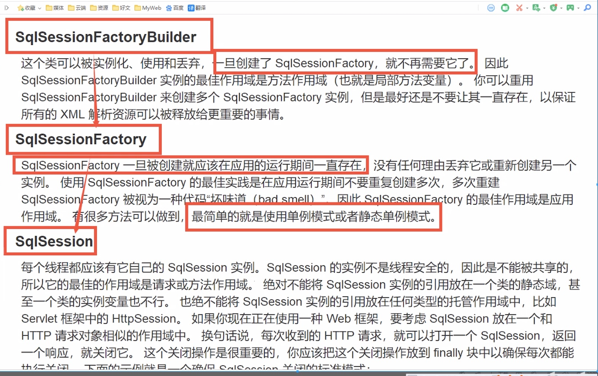


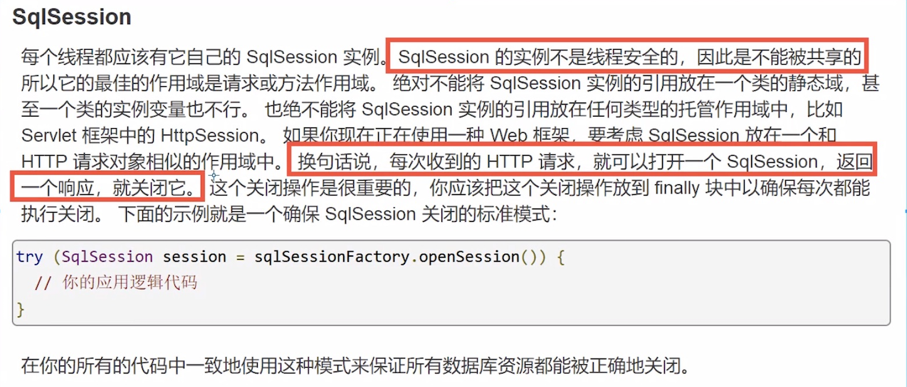

## 三、增删该查操作

### 1、namespace

- namespace中的包名要和mapper接口的包名一致


### 2、selece

- 1、编写接口

```javascript
userPo getUserById(int id);
```

- 2、编写mapper.xml中sql语句

```javascript
<select id="getUserById" resultType="com.yang.po.userPo">
  select * from user where id=#{id}
</select>
```

- 3、测试

```javascript
@Test
public void getUserByIdTest(){
    SqlSession sqlSession = MybatisUtils.getSqlSession();
    userMapper mapper = sqlSession.getMapper(userMapper.class);
    userPo user = mapper.getUserById(3);
    System.out.println(user);
    sqlSession.close();
}
```

3、insert

- .xml代码

```javascript
<insert id="insertUser" parameterType="com.yang.po.userPo">
    insert into user values (#{id},#{name},#{pwd})
</insert>
```

- 测试

```javascript
@Test
public void insertUserTest(){
    SqlSession sqlSession = MybatisUtils.getSqlSession();
    userMapper mapper = sqlSession.getMapper(userMapper.class);
    userPo userPo = new userPo();
    userPo.setId(10);
    userPo.setName("洋洋洋");
    userPo.setPwd("666");
    Integer integer = mapper.insertUser(userPo);
    if(integer > 0){
        sqlSession.commit();
    }
    sqlSession.close();
}
```

4、update

- .xml代码

```javascript
<update id="upDateUser" parameterType="com.yang.po.userPo">
    update user set name=#{name},pwd=#{pwd} where id = #{id}
</update>
```

- 测试

```javascript
@Test
public void upDateUser(){
    SqlSession sqlSession = MybatisUtils.getSqlSession();
    userMapper mapper = sqlSession.getMapper(userMapper.class);
    userPo userPo = new userPo(3,"李四","666");
    Integer integer = mapper.upDateUser(userPo);
    if(integer > 0){
        sqlSession.commit();
    }
    sqlSession.close();
}
```

### 5、delete

- .xml代码

```javascript
<delete id="deleteUser" >
    delete from user where id= #{id}
</delete>
```

- 测试

```javascript
@Test
public void deleteUser(){
    SqlSession sqlSession = MybatisUtils.getSqlSession();
    userMapper mapper = sqlSession.getMapper(userMapper.class);
    Integer integer = mapper.deleteUser(10);
    if (integer > 0) {
        sqlSession.commit();
    }
    sqlSession.close();
}
```

### 6、注意点

- 增删改需要提交事物

### 7、使用Map的 

- 1、mapper中的方法

```javascript
Integer insertUserByMap(Map<String,Object> map);
```

- 2、.xml代码

```javascript
<insert id="insertUserByMap" parameterType="Map">
    insert into user (id,name) values (#{mapId},#{mapPwd})
</insert>
```

- 3、测试

```javascript
    @Test
    public void insertUserByMap(){
        SqlSession sqlSession = MybatisUtils.getSqlSession();
        userMapper mapper = sqlSession.getMapper(userMapper.class);
        Map<String,Object> map = new HashMap<String, Object>();
        map.put("mapId",7);
        map.put("mapPwd","000");
        Integer integer = mapper.insertUserByMap(map);
        if(integer > 0){
            sqlSession.commit();
        }
        sqlSession.close();
    }
}
```

- Map传递参数，直接在sql中取出key即可！【parameterType="map"】

- 对象传递参数，直接在sql中去对象的属性即可！【parameterType="Object"】

- 只有一个基本数据类型参数的情况下，可以直接在sql中取到！

- 多个参数用Map

### 8、思考

#### 模糊查询怎么写？

- 1、java代码执行的时候，传递通配符% %

```javascript
List<user> userList = mapper.getUserList("%李%")
```

- 2、在sql拼接中使用通配符！

```javascript
select * from user where name like "%" #{value} "%"
```

## 四、配置解析

### 1、核心配置文件

- mybatis-config.xml

- Mybatis的配置文件包含了会深深影响Mybatis行为的设置和属性信息

---

Mybatis官网配置描述

配置

MyBatis 的配置文件包含了会深深影响 MyBatis 行为的设置和属性信息。 配置文档的顶层结构如下：

- configuration（配置）

- properties（属性）

- settings（设置）

- typeAliases（类型别名）

- typeHandlers（类型处理器）

- objectFactory（对象工厂）

- plugins（插件）

- environments（环境配置）

- environment（环境变量）

- transactionManager（事务管理器）

- dataSource（数据源）

- databaseIdProvider（数据库厂商标识）

- mappers（映射器）

---

### 2、配置多套环境

- Mybatis可以配置成使用多种环境

> 不过要记住：尽管可以配置多个环境，但每个SqlSessionFactory实例只能选择一种环境

- 学会使用配置多套运行环境

- Mybatis默认的事务管理就是JDBC，连接池：POOLED

### 3、属性（properties）

- 我们可以通过properties属性来实现引用配置文件

- 这些属性都是可外部配置且可动态替换，既可以在典型的java属性文件中配置，亦可通过properties元素的子元素来传递【db.properties】

- 编写一个配置文件

- db.properties

```javascript
driver=com.mysql.jdbc.Driver
url=jdbc:mysql://localhost:3306/mybatis?useSSL=false
username=root
password=root123456
```

- 在核心配置文件中引入db.properties文件

```javascript
<?xml version="1.0" encoding="UTF-8" ?>
<!DOCTYPE configuration
        PUBLIC "-//mybatis.org//DTD Config 3.0//EN"
        "http://mybatis.org/dtd/mybatis-3-config.dtd">
<configuration>
    <!--可以在properties标签下的resource属性引入.properties配置文件-->
    <properties resource="db.properties">
        <property name="username" value="root"></property>
        <property name="password" value="root123456"></property>
    </properties>
    
    <environments default="development">
        <environment id="development">
            <transactionManager type="JDBC"/>
            
            <!--可以通过${driver}来获取driver属性-->
            <dataSource type="POOLED">
                <property name="driver" value="${driver}"/>
                <property name="url" value="${url}"/>
                <property name="username" value="${username}"/>
                <property name="password" value="${password}"/>
            </dataSource>
            
        </environment>
    </environments>
    <mappers>
        <mapper resource="com/yang/mapper/userMapper.xml"/>
    </mappers>
</configuration>
```

- 说明

- 可以直接引入外部文件

- 可以在其中properties标签中增加一些属性配置

- 如果两个文件有相同的属性，优先使用外部的配置文件

### 4、属性别名

- 1、类型别名是为java类型设置一个短的名字

- 2、存在的意义仅在于用来减少类完全限定类名的冗余

- 起别名方式一：mybatis-config.xml文件

```javascript
<!--可以给实体类起个别名-->
<typeAliases>
    <typeAlias type="com.yang.po.userPo" alias="user"></typeAlias>
</typeAliases>
```

- userMapper.xml文件

```javascript
// 起别名之前
<select id="getUserList" resultType="com.yang.po.userPo">
  select * from user
</select>

// 起别名之后
<select id="getUserList" resultType="user">
  select * from user
</select>
```

- 起别名方式二：也可以指定一个包名，mybatis会在包名下面搜索需要的javaBean，比如：扫描实体类的包，他的默认别名就为这个类的类名，首字母小写

```javascript
<typeAliases>
    <package name="com.yang.po"/>
</typeAliases>
```

- 也可通过在实体类上添加注解，在扫描包的的过程中讲注解配置的别名用作其中

```javascript
@Data
@NoArgsConstructor
@AllArgsConstructor
@Alias("user")
public class userPo {
    private int id;
    private String name;
    private String pwd;
}
```

- userMapper.xml文件

```javascript
<select id="getUserList" resultType="user">
  select * from user
</select>
```

- userMapper.xml文件

```javascript
// 起别名之前
<select id="getUserList" resultType="com.yang.po.userPo">
  select * from user
</select>

// 起别名之后
<select id="getUserList" resultType="userPo">
  select * from user
</select>
```

### 5、设置

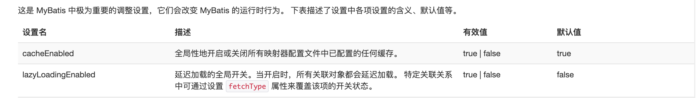


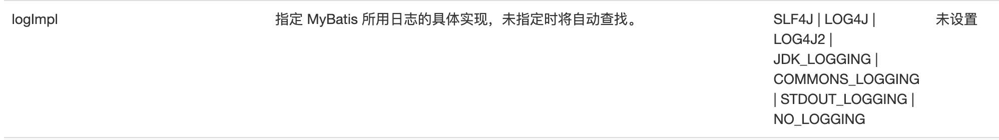

### 6、其他配置

- typeHandlers（类型处理器）

- objectFactory（对象工厂）

- plugins（插件）

- mybatis-generator-core

- mybatis-plus

- 通用mapper

### 7、映射器

- MapperRegistry：注册绑定我们的Mapper文件

- 方式一

```javascript
<mappers>
    <mapper resource="com/yang/mapper/userMapper.xml"/>
</mappers>
```

- 方式二

```javascript
<mappers>
    <mapper class="com.yang.mapper.userMapper"></mapper>
</mappers>
```

- 注意点

- 接口和他的mapper配置文件（mapper.xml文件）必须同名

- 接口和他的mapper配置文件（mapper.xml文件）必须在同一个包下

- 方式三

```javascript
<mappers>
    <mapper class="com.yang.mapper.userMapper"></mapper>
</mappers>
```

- 注意点

- 接口和他的mapper配置文件（mapper.xml文件）必须同名

- 接口和他的mapper配置文件（mapper.xml文件）必须在同一个包下

### 8、生命周期和作用域

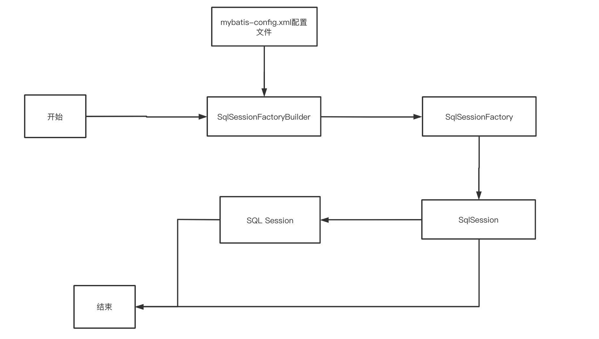

生命周期，和作用域，是至关重要的，因为错误的使用会导致分厂严重的并发问题

SqlSessionFactoryBuilder

- 一旦创建了SqlSessionFactory，就不在需要它了

- 作用域建议放在局部变量使用

SqlSessionFactory

- 可以想象成：数据库的连接池

- SqlSessionFactory 一旦被创建就应该在应用的运行期间一直存在，没有任何理由丢弃它或重新创建另一个实例。

- 因此SqlSessionFactory的最佳作用域是应用作用域

- 最简单的就是使用单里模式或者静态单里模式

SqlSession

- 连接到连接池的一个请求

- SqlSession 的实例不是线程安全的，因此是不能被共享的，所以它的最佳的作用域是请求或方法作用域。

- 用完之后需要赶紧关闭，否则资源被占用

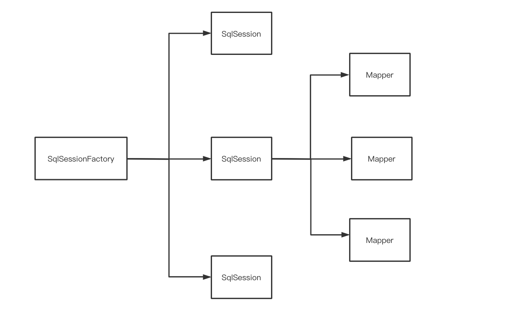

- 这里的mapper相当于一个一个的业务

## 五、解决属性名和字段名不一致的问题

数据库中的字段

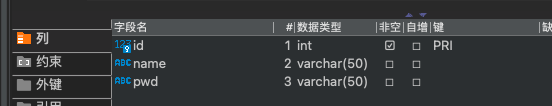

新建一个项目，拷贝之前的项目（mybatis-02），测试实体类字段不一致的情况

po实体情况：

```javascript
@Data
@NoArgsConstructor
@AllArgsConstructor
@Alias("user")
public class userPo {
    private int id;
    private String name;
    private String password;
}
```

测试出现问题：

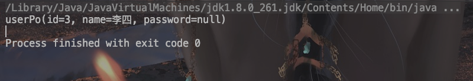


```javascript
select * from user where id=#{id}
//类型处理器处理之后的sql
select id,name,pwd from user where id=#{id}
```

### 1、解决方案：

-  1、在sql里起别名

```javascript
select id,name,password from user where id=#{id}
```

- 2、resultMap

- 结果集映射

```javascript
id name pwd
id name password
```


```javascript
<!--结果集映射-->
<resultMap id="userMap" type="user">
    <!--column对应数据库中的字段，property对应着实体类中的属性-->
    <result column="id" property="id"/>
    <result column="name" property="name"/>
    <result column="pwd" property="password"/>
</resultMap>

<select id="getUserById" resultMap="userMap">
  select * from user where id=#{id}
</select>
```

## 六、日志

### 1、日志工厂

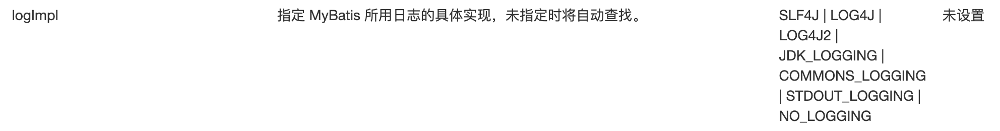

- SLF4J 

- LOG4J 

- LOG4J2 

- JDK_LOGGING 

- COMMONS_LOGGING

- STDOUT_LOGGING：标准的日志工厂的实现

- NO_LOGGING


在Mybatis中具体使用哪一个日志实现，在设置中设定

1.1 STDOUT_LOGGING：标准的日志输出

- 在mybatis核心配置文件中，配置我们的日志

```javascript
<settings>
    <!--标准的日志工厂实现-->
    <setting name="logImpl" value="STDOUT_LOGGING"/>
</settings>
```

日志输出：

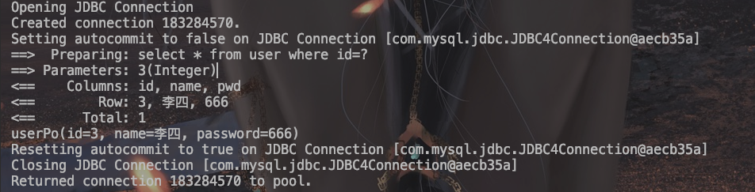

1.2 Log4j

- 什么是Log4j？

- Log4j是Apache的一个开源项目，通过使用Log4j，我们可以控制日志信息输送的目的地是控制台、文件、GUI组件

- 我们也可以控制每一条日志的输出格式；

- 通过定义每一条日志信息的级别，我们能够更加细致地控制日志的生成过程。

- 这些可以通过一个配置文件来灵活地进行配置，而不需要修改应用的代码。

- 1、先导入log4j的jar包

```javascript
<!-- https://mvnrepository.com/artifact/log4j/log4j -->
<dependency>
    <groupId>log4j</groupId>
    <artifactId>log4j</artifactId>
    <version>1.2.17</version>
</dependency>
```

- 2、创建log4j.properties配置log4j的配置文件，并进行简单配置

- 3、修改mybatis的核心配置文件（mybatis-config.xml）

```javascript
<settings>
    <!--LOG4J-->
    <setting name="logImpl" value="LOG4J"/>
</settings>
```

简单的使用

1、在使用log4j的类中，导入包import.org.apache.log4j.Logger;

2、日志对象，参数为当前类的class

```javascript
static Logger logger = Logger.getLogger(userTest.class);
```

3、日志级别

```javascript
logger.info("info:进入了testLog4j")
logger.debug("debug:进入了testLog4j")
logger.error("error:进入了testLog4j")
```

## 七、分页

- 思考：为什么要分页？

- 减少数据的处理量

### 1、使用Limit分页

```javascript
语法：select * from user limit startIndex，pageSize；
```

### 2、RowBounds分页：不在使用SQL实现分页

- 接口

```javascript
List<userPo> getUserListByRowBounds();
```

- mapper.xml

```javascript
<select id="getUserListByRowBounds" resultType="user">
    select * from user
</select>
```

- 测试

```javascript
@Test
public void getUserListByRowBounds(){
    SqlSession sqlSession = MybatisUtils.getSqlSession();
    RowBounds rowBounds = new RowBounds(1,2);
    // 通过java代码层面实现分页
    List<userPo> selectList = sqlSession.selectList("com.yang.mapper.userMapper.getUserListByRowBounds", "null", rowBounds);
    for (userPo user:selectList) {
        System.out.println(user);
    }
    sqlSession.close();

}
```

## 八、使用注解开发

### 1、注解

- 注解在接口上实现

```javascript
public interface userMapper {
    @Select("select * from user")
    List<userPo> getUsers();
}
```

- 需要在配置文件中绑定接口（mybatis-config.xml）

```javascript
<mappers>
    <mapper class="com.yang.mapper.userMapper"/>
</mappers>
```

- 测试

```javascript
@Test
public void test(){
    SqlSession sqlSession = MybatisUtils.getSqlSession();
    userMapper mapper = sqlSession.getMapper(userMapper.class);
    List<userPo> userPoList = mapper.getUsers();
    for (userPo user:userPoList
         ) {
        System.out.println(user);
    }
}
```

### 2、mybatis详细的执行流程

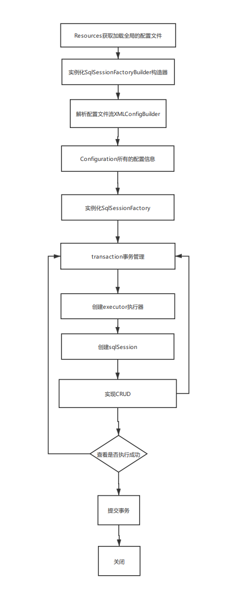

### 3、使用注解实现CRUD

- 设置自动提交事务

```javascript
public static SqlSession getSqlSession(){
    //将openSession里的参数设置成true是，就设置成了AutoCommit = true，设置了自动提交事务
    SqlSession sqlSession = sqlSessionFactory.openSession(true);
    return sqlSession;
}
```

- 编写接口mapper

```javascript
public interface userMapper {
    @Select("select * from user")
    List<userPo> getUsers();
    
    @Select("select * from user where id = #{id}")
    userPo getUserById(@Param("id") int id);

    @Insert("insert into user (id,name,pwd) values(#{id},#{name},#{pwd})")
    Integer addUser(userPo userPo);
    
    @Delete("delete from user where id = #{id}")
    Integer delUser(@Param("id") int id);
    
    @Update("update user set name = #{name}, pwd = #{pwd} where id = #{id} ")
    Integer updateUser(@Param("id") int id,@Param("name") String name,@Param("pwd") String pwd);
}
```

- 测试

- 注意：我们必须将接口注册绑定在配置文件中

- 关于@Param()注解

- 基本类型的参数或者String类型，需要加

- 引用类型不需要加

- 如果只有一个基本数据类型，可以忽略，但是建议加上

- 我们在SQL中引用的就是我们这里的@Param("key")中设定的key

## 九、Lombok

### 1、简介

- Lombok项目是一个Java库，它会自动插入编辑器和构建工具中，Lombok提供了一组有用的注释，用来消除Java类中的大量样板代码。仅五个字符(@Data)就可以替换数百行代码从而产生干净，简洁且易于维护的Java类。

### 2、常用注解

- @Setter ：注解在类或字段，注解在类时为所有字段生成setter方法，注解在字段上时只为该字段生成setter方法。

- @Getter ：使用方法同上，区别在于生成的是getter方法。

- @ToString ：注解在类，添加toString方法。

- @EqualsAndHashCode： 注解在类，生成hashCode和equals方法。

- @NoArgsConstructor： 注解在类，生成无参的构造方法。

- @RequiredArgsConstructor： 注解在类，为类中需要特殊处理的字段生成构造方法，比如final和被@NonNull注解的字段。

- @AllArgsConstructor： 注解在类，生成包含类中所有字段的构造方法。

- @Data： 注解在类，生成setter/getter、equals、canEqual、hashCode、toString方法，如为final属性，则不会为该属性生成setter方法。

- @Slf4j： 注解在类，生成log变量，严格意义来说是常量。

### 3、使用

-  在IDEA中安装Lombok插件

- 在项目中导入lombok的jar包

```javascript
<dependency>
    <groupId>org.projectlombok</groupId>
    <artifactId>lombok</artifactId>
    <version>1.18.16</version>
</dependency>
```

- 在实体类上加注解即可

```javascript
@Data
@NoArgsConstructor
@AllArgsConstructor
```

## 十、多对一处理

### 1、多对一概念

- 多个学生对应一个老师

- 对于学生而言，关联 多个学生关联一个老师「多对一」

- 对于老师而言，集合 一个老师，有很多学生「一对多」

### 2、创建teacher表和student表

```javascript
CREATE TABLE `student` (
  `id` int NOT NULL,
  `name` varchar(255) DEFAULT NULL,
  `tid` int DEFAULT NULL,
  PRIMARY KEY (`id`),
  KEY `fktid` (`tid`),
  CONSTRAINT `fktid` FOREIGN KEY (`tid`) REFERENCES `teacher` (`id`) ON DELETE CASCADE ON UPDATE CASCADE
) ENGINE=InnoDB DEFAULT CHARSET=utf8mb4 COLLATE=utf8mb4_0900_ai_ci;


CREATE TABLE `teacher` (
  `id` int NOT NULL,
  `name` varchar(255) DEFAULT NULL,
  PRIMARY KEY (`id`)
) ENGINE=InnoDB DEFAULT CHARSET=utf8mb4 COLLATE=utf8mb4_0900_ai_ci;
```


### 3、测试环境的搭建

- 导入lombok

- 新建实体类Teacher、Student

```javascript
@Data
public class Student {
    private int id;
    private String name;

    private Teacher teacher;
}

@Data
public class Teacher {
    private int id;
    private String name;
}
```

- 建立Mapper接口

- 建立Mapper.xml文件

- 在核心配置文件中绑定注册我们的Mapper接口或者文件

- 测试查询能否成功

### 4、按照查询嵌套处理

```javascript
<!--
思路：
    1、查询所有的学生信息
    2、根据所有的学生信息的tid，寻找对应的老师 相当于子查询
-->


    <select id="getStudent" resultMap="getStudent">
        select * from student
    </select>

    <resultMap id="getStudent" type="Student">
        <result property="id" column="id"/>
        <result property="name" column="name"/>
<!--        复杂的属性，我们需要单独处理  对象：association 集合：collection-->
        <association property="teacher" column="tid" javaType="Teacher" select="getTeacher"/>
    </resultMap>

    <select id="getTeacher" resultType="Teacher">
        select * from teacher where id = #{tid}
    </select>
```


### 5、按照结果进行处理

```javascript
<select id="getStudent1" resultMap="StudentTeacher">
    SELECT
        s.id AS sid,
        s.`name` AS sname,
        t.`name` as tname
    FROM
        student s,
        teacher t
</select>
  <resultMap id="StudentTeacher" type="Student">
      <result property="id" column="sid"/>
      <result property="name" column="sname"/>

      <association property="teacher" javaType="Teacher">
          <result property="name" column="tname"/>
      </association>
  </resultMap>
```


## 十一、一对多处理

比如：一个老师拥有多个学生

对于老师而言，就是一对多的关系


1、环境搭建

- 实体类

```javascript
@Data
public class Teacher {
    private int id;
    private String name;
    private List<Student> studentList;
}
```


```javascript
@Data
public class Student {
    private int id;
    private String name;

    private int tid;
}
```

### 1、按照结果进行嵌套处理

```javascript
    <select id="getTeacher" resultMap="TeacherStudent">
        SELECT
            s.id AS sid,
            s.`name` AS sname,
            t.id AS tid,
            t.`name` AS tname
        FROM
            student s,
            teacher t
        WHERE
            s.tid = t.id and t.id=#{tid}
    </select>
    <resultMap id="TeacherStudent" type="Teacher">
        <result property="id" column="tid"/>
        <result property="name" column="tname"/>
<!--        复杂的属性，我们需要单独处理  对象：association 集合：collection
            javaType：指定属性的类型
            集合中的泛型信息，我们使用ofType获取
-->
        <collection property="studentList" ofType="Student">
            <result property="id" column="sid"/>
            <result property="name" column="sname"/>
            <result property="tid" column="tid"/>
        </collection>
    </resultMap>
```

### 2、按照查询嵌套处理

```javascript
<select id="getTeacher2" resultMap="StudentTeacher2">
    select * from teacher where id = #{tid}
</select>
<resultMap id="StudentTeacher2" type="Teacher">
    <collection property="studentList" javaType="ArrayList" select="getStudentByTeacherId" column="id"/>
</resultMap>

<select id="getStudentByTeacherId" resultType="Student">
    select * from student where tid = #{id}
</select>
```

### 3、小结

- 关联- association【多对一】 

- 集合- collection【一对多】

- javaType & ofType

- javaType用来指定实体类中属性的类型

- ofType 用来指定映射到List或者集合中的pojo类型，泛型

## 十二、动态SQL

什么是动态SQL：动态SQL就是指根据不同的条件生成不同的SQL语句。

所谓动态SQL，本质还是SQL语句，只是我们可以在SQL层面，去执行一个逻辑代码


> 如果你之前用过 JSTL 或任何基于类 XML 语言的文本处理器，你对动态 SQL 元素可能会感觉似曾相识。在 MyBatis 之前的版本中，需要花时间了解大量的元素。借助功能强大的基于 OGNL 的表达式，MyBatis 3 替换了之前的大部分元素，大大精简了元素种类，现在要学习的元素种类比原来的一半还要少。

> if

> choose (when, otherwise)

> trim (where, set)

> foreach


### 1、搭建环境

- 创建blog表

```javascript
CREATE TABLE `blog` (
  `id` varchar(50) NOT NULL COMMENT '博客id',
  `title` varchar(100) NOT NULL,
  `author` varchar(30) NOT NULL,
  `create_time` datetime NOT NULL,
  `views` int NOT NULL
) ENGINE=InnoDB DEFAULT CHARSET=utf8;
```

- 创建一个基础工程

- 导包

- 编写配置文件

- 编写实体类

```javascript
@Data
public class Blog {
    private int id;
    private String title;
    private String author;
    private Date createTime;
    private int views;
}
```

- 编写实体类对应的Mapper接口和Mapper.XML文件

### 2、IF

```javascript
<select id="getBlogsIf" resultType="Blog" parameterType="Map">
    select * from blog
    <where>
        <if test="title != null">
            and title = #{title}
        </if>
    </where>
</select>
```


### 3、choose (when, otherwise)

- 相当于java中的switch。。。case。。。

- 满足一个条件就直接查询出来，不会在去匹配下一个条件。

```javascript
<select id="getBlogChoose" resultType="Blog">
    select * from blog
    <where>
        <choose>
            <when test="title != null">
                and title = #{title}
            </when>
            <when test="id != null">
                and id = #{id}
            </when>
            <when test="views != null">
               and views = #{views}
            </when>
            <otherwise>
               and author = #{author}
            </otherwise>
        </choose>
    </where>
</select>
```

### 4、trim (where, set)

```javascript
where:
<select id="getBlogsIf" resultType="Blog" parameterType="Map">
    select * from blog
    <where>
        <if test="title != null">
            and title = #{title}
        </if>
    </where>
</select>

set:
<update id="updateBlog" parameterType="map">
    update blog
    <set>
        <if test="title != null">
            title = #{title},
        </if>
        <if test="author != null">
            author = #{author},
        </if>
        <if test="views != null">
            views = #{views}
        </if>
        where id = #{id}
    </set>
</update>
```


### 5、foreach

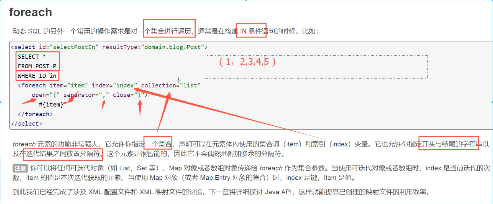

- SQL：

```javascript
<!--
    select * from blog where 1=1 and (id=1 or id = 2 or id = 3)

    我们需要传递一个万能的map，这个map中可以存一个集合！
    collection="ids" 集合名称
    item="id"        遍历集合后的每一项名称
    open="and ("     以什么开头
    close=")"        以什么结尾
    separator="or"   每一项的分隔符
-->
<select id="selectBlogForeach" parameterType="map" resultType="Blog">
    select * from blog
    <where>
        <foreach collection="ids" item="id" open="and (" close=")" separator="or">
            id = #{id}
        </foreach>
    </where>
</select>

```

-  测试；

```javascript
@Test
public void test4(){
    SqlSession sqlSession = MybatisUtils.getSqlSession();
    BlogMapper mapper = sqlSession.getMapper(BlogMapper.class);
    Map map = new HashMap();
    List<Integer> ids = new ArrayList<>();
    for (int i = 1; i < 5; i++) {
        ids.add(i);
    }
    map.put("ids",ids);
    List<Blog> blogs = mapper.selectBlogForeach(map);
    for (Blog blog : blogs) {
        System.out.println(blog);
    }
}
```

- 输出：

```javascript
==>  Preparing: select * from blog WHERE ( id = ? or id = ? or id = ? or id = ? ) 
==> Parameters: 1(Integer), 2(Integer), 3(Integer), 4(Integer)
<==    Columns: id, title, author, create_time, views
<==        Row: 1, Mybatis如此简单, 郭洋, 2021-03-30 23:49:17.0, 999
<==        Row: 2, Spring如此简单, 郭洋, 2021-03-30 23:49:17.0, 999
<==        Row: 3, java1, 郭洋, 2021-03-30 23:49:17.0, 888
<==        Row: 4, 微服务如此简单, 郭洋, 2021-03-30 23:49:17.0, 999
<==      Total: 4
Blog(id=1, title=Mybatis如此简单, author=郭洋, createTime=Tue Mar 30 23:49:17 CST 2021, views=999)
Blog(id=2, title=Spring如此简单, author=郭洋, createTime=Tue Mar 30 23:49:17 CST 2021, views=999)
Blog(id=3, title=java1, author=郭洋, createTime=Tue Mar 30 23:49:17 CST 2021, views=888)
Blog(id=4, title=微服务如此简单, author=郭洋, createTime=Tue Mar 30 23:49:17 CST 2021, views=999)

```

### 6、SQL片段

- 有的时候,我们会讲一些功能的部分抽取出来，方便复用！

- 1、使用SQL标签抽取出公共的部分

```javascript
<sql id="if-title">
    <if test="title != null">
        and title = #{title}
    </if>
</sql>
```

- 2、再需要使用的地方使用Include标签引用即可

```javascript
<select id="getBlogsIf" resultType="Blog" parameterType="Map">
    select * from blog
    <where>
        <include refid="if-title"></include>
    </where>
</select>
```

## 十三、缓存

### 1、简介

```javascript
查询： 连接数据库.. 耗资源
    一次查询的结果，给他暂存在一个可以直接去到的地方！--> 内存：缓存
我们再次查询相同的数据的时候，直接走缓存，就不走数据库了    
```

- 什么是缓存（Cache）

- 存在内存中的临时数据

- 将用户经常查询的数据放在缓存（内存）中，用户去查询数据就不用从磁盘上（关系型数据库数据文件）查询，从缓存中查询，从而提高查询效率，解决了高并发系统性能问题。

- 为什么使用缓存

- 减少和数据库的交互次数，减少系统开销，提高系统效率

- 什么样的数据能使用缓存

- 经常查询并且不经常改变的数据

### 2、Mybatis缓存

#### 2.1、一级缓存

- 一级缓存也叫本地缓存：一次SqlSession中

- 一数据库同一次回话期间查询到的数据会放在本地的缓存中

- 以后如果需要回去相同的数据，直接从缓存中拿，没必要再去查询数据库

- 测试步骤

- 开启日志

- 测试再一次SqlSession中查询两次相同的记录

- 查看日志输出

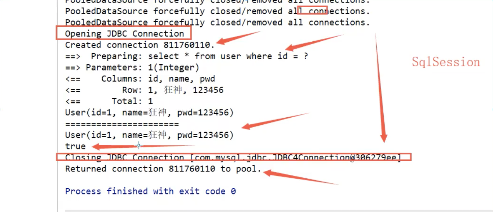

- 缓存失效的情况

- 查询不同的东西

- 增、删、改操作，可能会改变原来的数据，所以必定会刷新缓存

- 查询不同的Mapper.xml

- 手动清理缓存！

```javascript
sqlSession.clearCache();// 清理一级缓存
```

- 小结

- 一级缓存默认是开启的，只在一次SqlSession中有限，也就是拿到连接到关闭连接这个区间段！

#### 2.2、二级缓存

- 二级缓存也叫全局缓存，一级缓存作用域太低了，所以诞生了二级缓存！

- 基于namespace级别的缓存，一个名称空间，对应一个二级缓存;

- 工作机制

- 一个会话查询一条数据，这个数据就会被放在当前会话的一级缓存中;

- 如果当前会话关闭了，这个会话对应的一级缓存就没了;但是我们想要的是，会话关闭了，一级缓存中的数据被保存到.二级缓存中;

- 新的会话查询信息，就可以从二级缓存中获取内容;

- 不同的mapper查出的数据会放在自己对应的缓存(map)中;

- 步骤

- 开启全局缓存

```javascript
<!--显示的开启全局缓存-->
<setting name="cacheEnabled" value="true"/>
```

- 在要使用二级缓存的Mapper中开启

```javascript
<!--在当前Mapper.xml中使用二级缓存-->
<cache/>
```

- 也可以自定义参数

```javascript


这些属性可以通过 cache 元素的属性来修改。比如：
<cache
  eviction="FIFO" // 清除规则
  flushInterval="60000" // 时间内自动刷新缓存
  size="512" // 缓存大致个数
  readOnly="true"/>
```

- 测试

- 1、问题：我们需要讲实体类序列化！否则就会报错

- 小结

- 只要开启了二级缓存，再同一个mapper下就有效

- 所有的数据都会先放在一级缓存中；

- 只有当会话提交，或者关闭的时候，才会提交二级缓存中

### 3、缓存原理

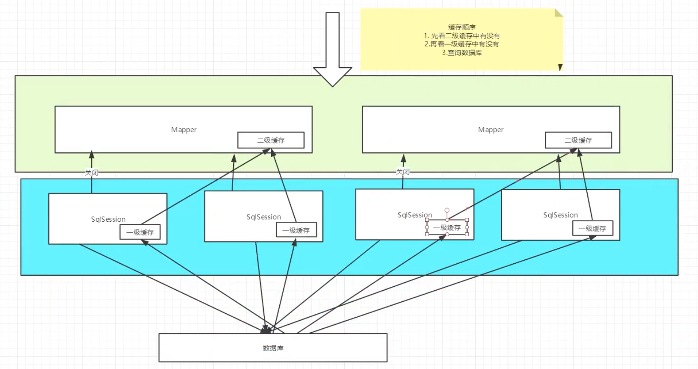

