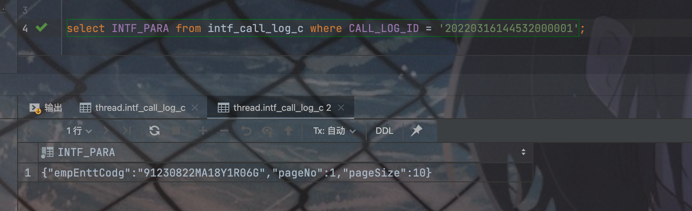
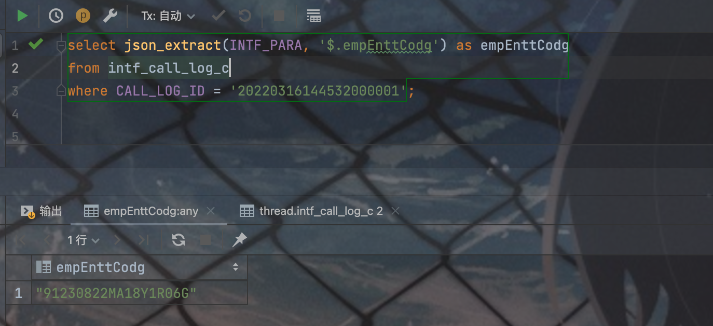
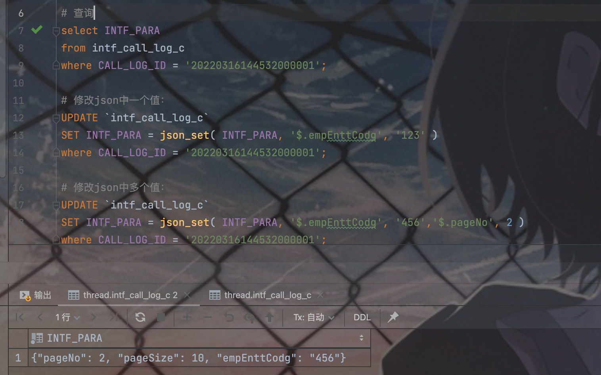
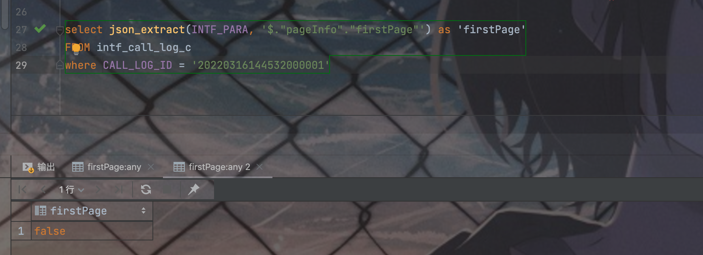
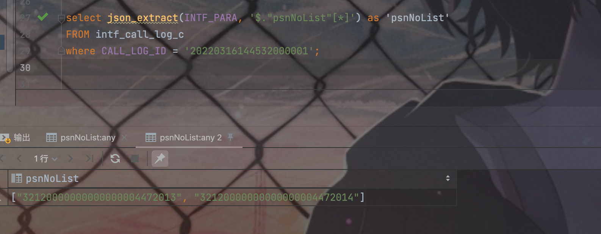
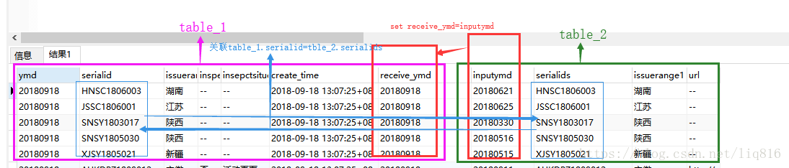

## 1、使用SQL替换指定字符串
### 背景
> 今天项目中有个地方又需要对数据库指定字符串进行替换，之前都是通过代码去实现的，但是这次感觉就是两个相同字符的替换，编写代码相对复杂，而且数据量不是很大，于是乎就想着通过sql直接去替换。

### 方法
```sql
UPDATE `table_name`
SET `field_name` = replace(`field_name`, 'from_str', 'to_str')
WHERE `field_name` LIKE '%from_str%'
```
### 说明
> **注释：**
**table_name：** 表的名字
**field_name：** 字段名
**from_str：** 需要替换的字符串
**to_str：** 替换成的字符串

## 2、SQL中json字段中的值处理
### 2.1、获取json字段中的值
#### 背景
> 在工作当作我们会在数据库的某个字段中存入一些json串数据，做日志记录、业务数据等等...  我们想取出这个json串中的某一个字段中的数据的时候，我们该如何做呢。

- 例如
   - 
- 需求：查询出 json串中的empEnttCodg字段值
#### 方法
```sql
select json_extract(INTF_PARA, '$.empEnttCodg') as empEnttCodg
from intf_call_log_c
where CALL_LOG_ID = '20220316144532000001';
```

- 输入
- 
#### 说明
> json_extract()函数
> $ . paramsName：取出一个key对应的value。
> $ **.paramsName 、$ .[*].paramsName：取出json数组所有该字段key对应的value并以，的方式拼接在一起

### 2.2、json格式数据修改
#### 方法
```sql
# 修改json中一个值：
UPDATE `intf_call_log_c`
SET INTF_PARA = json_set( INTF_PARA, '$.empEnttCodg', '123' )
where CALL_LOG_ID = '20220316144532000001';

# 修改json中多个值：
UPDATE `intf_call_log_c`
SET INTF_PARA = json_set( INTF_PARA, '$.empEnttCodg', '456','$.pageNo', 2 )
where CALL_LOG_ID = '20220316144532000001';
```

- 结果
- 
#### 说明
> sql中json_set是Mysql用来更新数据，
> json_data是存json数据的字段
> $.age'、$.school是json中的字段名

## 3、SQL解析嵌套json数组
#### 查询多层的单个值

- 原数据样式
```json
{
    "empNo": "32120000000000000010077870",
    "insuTypeList": [
        "310"
    ],
    "pageInfo": {
        "endRow": 0,
        "firstPage": false,
        "lastPage": false,
        "nextPage": 0,
        "pageNum": 0,
        "pageSize": 0,
        "pages": 0,
        "prePage": 0,
        "recordCounts": 0,
        "size": 0,
        "startRow": 0
    },
    "psnInsuStas": "1",
    "psnNoList": [
        "32120000000000000004472013",
        "32120000000000000004472014"
    ]
}
```

- 查询单个值
```sql
select json_extract(INTF_PARA, '$."pageInfo"."firstPage"') as 'firstPage'
FROM intf_call_log_c
where CALL_LOG_ID = '20220316144532000001';
```

- 结果
- 
- 查询数组
```sql
select json_extract(INTF_PARA, '$."psnNoList"[*]') as 'psnNoList'
FROM intf_call_log_c
where CALL_LOG_ID = '20220316144532000001';
```

- 结果
- 
## 4、**清空表数据的三种方式(truncate、delete、drop)**

- truncate：整体删除所有数据，保留表结构，不能撤销还原，不写服务器 log
> **truncate table 表名**

- delete：逐行删除速度极慢，不适合大量数据删除，**写服务器log **（没有truncate快的原因）
> **delete from 表名**
> **delete from 表名 where 列名 = "value "**

- drop：删除表，数据和表结构一起删除，快速
> **drop form 表名**

## 5、**mysql 查看存储容量**

1. 进入information_schema 数据库（存放了其他的数据库的信息）
   1. `use information_schema;`
2. 查询所有数据的大小：
   1. `select concat(round(sum(data_length/1024/1024),2),'MB') as data from tables;`
3. 查看指定数据库的大小：
   1. 比如查看数据库home的大小
   2. `select concat(round(sum(data_length/1024/1024),2),'MB') as data from tables where table_schema='home';`
4. 查看指定数据库的某个表的大小
   1. `比如查看数据库home中 members 表的大小`
   2. `select concat(round(sum(data_length/1024/1024),2),'MB') as data from tables where table_schema=‘home’ and table_name=‘members’;`
## 6、mysql 查看连接数、状态 、最大并发数、缓存 

- 查看mysql数据库的线程数： `show global status like 'Thread%';`
- 数据库线程池缓存大小查询：`show variables like 'thread_cache_size';`
- 数据库线程池缓存大小设置：`set global thread_cache_size=64;`
- 查看全局wait_timeout值：`show global variables like 'wait_timeout';`
- 修改全局wait_timeout值：`set global wait_timeout=28800;`
- 查看最大连接数：`show variables like '%connect%';`
- 重新设置最大连接数：`set global max_connections=151;`
- 查询数据库服务器响应的最大连接数：`show global status like 'Max_used_connections';`
- 如果想修改mysql服务的最大连接数时通过`set global max_connections=151;` 方式不好用时，需要修改my.cnf
   - 在/etc/my.cnf文件中（ 需要重启mysql服务）
```shell
[mysqld]部分增加
max_connections=1000
```

   - 重启mysql服务即可
## 7、update语句多表关联：

- 表1与表2根据seriaild 列做关联修改 set 表1.receive_ymd=表2.ymd


```sql
UPDATE 
    table_1 
SET receive_ymd=inputymd 
FROM(
    SELECT 
        *
    FROM table_1 AS  ta_1
    INNER JOIN tbale_2 AS tb_2
    ON ta_1.serialid=tb_2.serialid
)tbs
WHERE  table_1.create_time=tbs.create_time AND table_1.serialid=tbs.serialids
```

- 自己使用：
```sql
UPDATE t_dev_probe
SET specialty_name = pro.specility_name
FROM
 (SELECT b.* FROM t_dev_probe t INNER JOIN back_end.s_specility b ON T.specialty_code = b.specility_code) pro
WHERE
 pro.specility_code = t_dev_probe.specialty_code AND t_dev_probe.specialty_code NOTNULL
```
## 8、复制表

- 使用 **SHOW CREATE TABLE** 命令获取创建数据表(**CREATE TABLE**) 语句，该语句包含了原数据表的结构，索引等。
- 复制以下命令显示的SQL语句，修改数据表名，并执行SQL语句，通过以上命令 将完全的复制数据表结构。
- 如果你想复制表的内容，你就可以使用** INSERT INTO ... SELECT **语句来实现。
   - 获取建表表结构
```sql
SHOW CREATE TABLE runoob_tbl \G;
```

- 修改SQL语句的数据表名，并执行SQL语句。
- 执行完第二步骤后，你将在数据库中创建新的克隆表 clone_tbl。 如果你想拷贝数据表的数据你可以使用** INSERT INTO... SELECT **语句来实现。
```sql
mysql> INSERT INTO clone_tbl (runoob_id,
    ->                        runoob_title,
    ->                        runoob_author,
    ->                        submission_date)
    -> SELECT runoob_id,runoob_title,
    ->        runoob_author,submission_date
    -> FROM runoob_tbl;
Query OK, 3 rows affected (0.07 sec)
Records: 3  Duplicates: 0  Warnings: 0
```
