+++


title = 'Excel处理'
date = 2024-02-05T17:33:17+08:00
draft = true

+++


# 一、常用场景

> 1. 将用户信息导出为excel表格
> 2. 将excel的信息导入到数据库，减轻大量网站录入量 开发经常使用到excel导入导出

<a name="IxH5K"></a>
## 1.1、Apache POI官网：
[https://poi.apache.org/](https://poi.apache.org/) 比较麻烦
> Apache POI项目的任务是创建和维护Java API，以基于Office Open<br />XML标准（OOXML）和Microsoft的OLE 2复合文档格式（OLE2）来处理各种文件格式。简而言之，您可以使用Java读写MS<br />Excel文件。此外，您可以使用Java读写MS Word和MS PowerPoint文件。Apache POI是您的Java Excel解决方案（适用于Excel 97-2008）。

<a name="EFlX7"></a>
## 1.2、easyexcel官网：
[https://github.com/alibaba/easyexcel](https://github.com/alibaba/easyexcel)<br />
<a name="Zt7dV"></a>
# 二、POI使用
> **注意：xls03和xls07的区别 （excel版本）： 数据量的大小 03的只有65536行**
> <br />

- 03版的excel 只有65536行
<a name="LDO3V"></a>
## 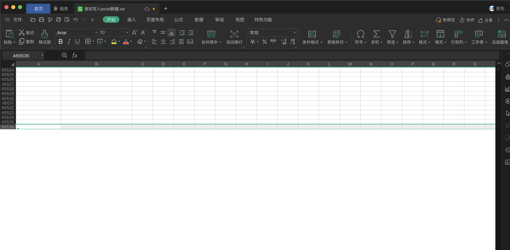

- 07版excel 无限制

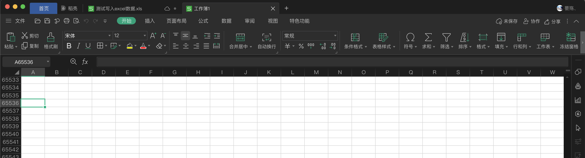
<a name="UpJSz"></a>
## 共通代码

- 创建maven项目
- 导入pom依赖
```xml
<dependencies>
  <dependency>
    <groupId>org.springframework.boot</groupId>
    <artifactId>spring-boot-starter</artifactId>
  </dependency>
  <!--		xml(03)-->
  <dependency>
    <groupId>org.apache.poi</groupId>
    <artifactId>poi</artifactId>
    <version>4.1.2</version>
  </dependency>
  <!--		xmlx(07)-->
  <dependency>
    <groupId>org.apache.poi</groupId>
    <artifactId>poi-ooxml</artifactId>
    <version>4.1.2</version>
  </dependency>
  <!--		日期格式化工具-->
  <dependency>
    <groupId>joda-time</groupId>
    <artifactId>joda-time</artifactId>
    <version>2.10.1</version>
  </dependency>
  <!--		测试-->
  <dependency>
    <groupId>junit</groupId>
    <artifactId>junit</artifactId>
    <version>4.12</version>
  </dependency>
  <dependency>
    <groupId>org.springframework.boot</groupId>
    <artifactId>spring-boot-starter-test</artifactId>
    <scope>test</scope>
  </dependency>
  <dependency>
    <groupId>org.projectlombok</groupId>
    <artifactId>lombok</artifactId>
    <scope>test</scope>
  </dependency>
</dependencies>
```
<a name="Zjhko"></a>
## 2.1、写文件使用步骤
<a name="p9Oce"></a>
### 少量数据写入
<a name="HfYW2"></a>
#### 03版本使用
```java
@Test
    @SneakyThrows
    public void testExcelWrite(){
    // 创建一个工作簿
    HSSFWorkbook workbook = new HSSFWorkbook();
    // 创建一个工作表
    HSSFSheet sheet = workbook.createSheet("测试工作表01");
    // 创建一行数据（1，1）
    Row row1 = sheet.createRow(0);
    // 创建一个单员格
    Cell cell = row1.createCell(0);
    // 写入单元格数据
    cell.setCellValue("测试单元格");
    Cell cell12 = row1.createCell(1);
    cell12.setCellValue("123");
    // 创建第二行数据
    Row row2 = sheet.createRow(1);
    Cell cell1 = row2.createCell(0);
    cell1.setCellValue("时间");
    Cell cell2 = row2.createCell(1);
    cell2.setCellValue(new DateTime().toString("yyyy-MM-dd HH:mm:ss"));
    // 创建文件流
    FileOutputStream fileOutputStream = new FileOutputStream(PATH + "/测试写入excel数据.xls");
    // 工作簿文件流写入
    workbook.write(fileOutputStream);
    // 关闭流
    fileOutputStream.close();
    log.info("文件生成完毕！");
}
```

- 输出结果
   - 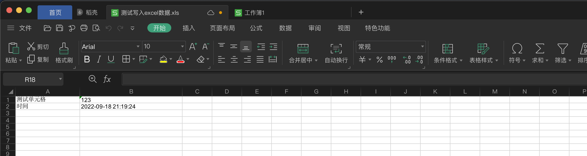
   <a name="G7k5P"></a>
#### 07版本使用
```java
	@Test
	@SneakyThrows
	public void test07ExcelWrite(){
		// 创建一个工作簿
		XSSFWorkbook workbook = new XSSFWorkbook();
		// 创建一个工作表
		XSSFSheet sheet = workbook.createSheet("测试工作表01");
		// 创建一行数据（1，1）
		Row row1 = sheet.createRow(0);
		// 创建一个单员格
		Cell cell = row1.createCell(0);
		// 写入单元格数据
		cell.setCellValue("测试单元格");
		Cell cell12 = row1.createCell(1);
		cell12.setCellValue("123");
		// 创建第二行数据
		Row row2 = sheet.createRow(1);
		Cell cell1 = row2.createCell(0);
		cell1.setCellValue("时间");
		Cell cell2 = row2.createCell(1);
		cell2.setCellValue(new DateTime().toString("yyyy-MM-dd HH:mm:ss"));
		// 创建文件流
		FileOutputStream fileOutputStream = new FileOutputStream(PATH + "/测试写入excel数据.xlsx");
		// 工作簿文件流写入
		workbook.write(fileOutputStream);
		// 关闭流
		fileOutputStream.close();
		log.info("文件生成完毕！");
	}
```

- 输出结果
   - 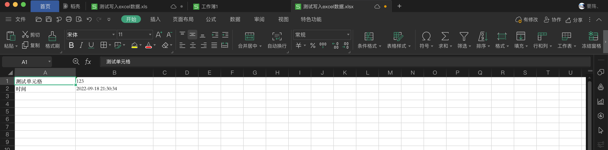
- 生成的两个文件对比
   - 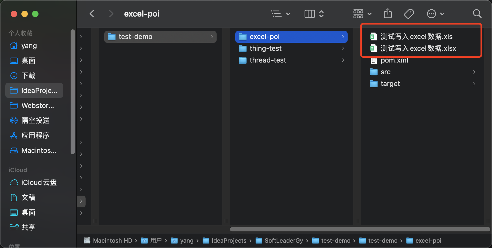
   <a name="VJDQF"></a>
#### 区别

- 大文件写入HSSF
   - **缺点：最多只能处理65536行否则会抛出异常**
   - **优点：过程中写入缓存，最后一次写入磁盘，速度快**
- 大文件写入XSSF
   - **缺点：写数据速度非常慢，消耗内存，也会内存溢出 入100万条**
   - **优点：可以写较大的数据量**
- **HSSF写入数据量条数超过65536 就会报错**
   - java.lang.IllegalArgumentException: Invalid row number (65536) outside allowable range (0..65535)
   <a name="cBBI2"></a>
### 批量数据写入
<a name="JbgwD"></a>
#### 03版本批量数据写入
```java
	/**
	 * 测试大数据写入
	 */
	@Test
	@SneakyThrows
	public void test03BigDataExcelWrite(){
		long strTime = System.currentTimeMillis();
		HSSFWorkbook workbook = new HSSFWorkbook();
		HSSFSheet sheet = workbook.createSheet();
		for (int rowNum = 0; rowNum < 65536; rowNum++) {
			HSSFRow row = sheet.createRow(rowNum);
			for (int celNum = 0; celNum < 10; celNum++) {
				HSSFCell cell = row.createCell(celNum);
				cell.setCellValue(celNum);
			}
		}
		FileOutputStream fileOutputStream = new FileOutputStream(PATH + "/批量写入03版本.xls");
		workbook.write(fileOutputStream);
		fileOutputStream.close();
		long endTime = System.currentTimeMillis();
		log.info("使用时间为： {}",((double)(endTime-strTime)/1000));
	}

// 日志输出
// 15:37:37.055 [main] INFO com.yang.excelpoi.ExcelPoiApplicationTests - 使用时间为： 1.28
```

- 输入结果
   - 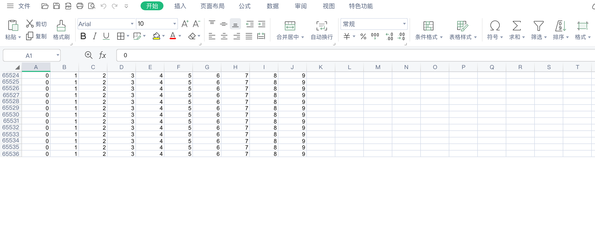
   <a name="jTho9"></a>
#### 07版本批量数据写入
```java
	/**
	 * 测试大数据写入
	 */
	@Test
	@SneakyThrows
	public void test07BigDataExcelWrite(){
		long strTime = System.currentTimeMillis();
		XSSFWorkbook workbook = new XSSFWorkbook();
		XSSFSheet sheet = workbook.createSheet();
		for (int rowNum = 0; rowNum < 65536; rowNum++) {
			XSSFRow row = sheet.createRow(rowNum);
			for (int celNum = 0; celNum < 10; celNum++) {
				XSSFCell cell = row.createCell(celNum);
				cell.setCellValue(celNum);
			}
		}
		FileOutputStream fileOutputStream = new FileOutputStream(PATH + "/批量写入07版本.xls");
		workbook.write(fileOutputStream);
		fileOutputStream.close();
		long endTime = System.currentTimeMillis();
		log.info("使用时间为： {}",((double)(endTime-strTime)/1000));
	}
// 日志输出
// 15:38:48.011 [main] INFO com.yang.excelpoi.ExcelPoiApplicationTests - 使用时间为： 5.255
```

- 输出
   - 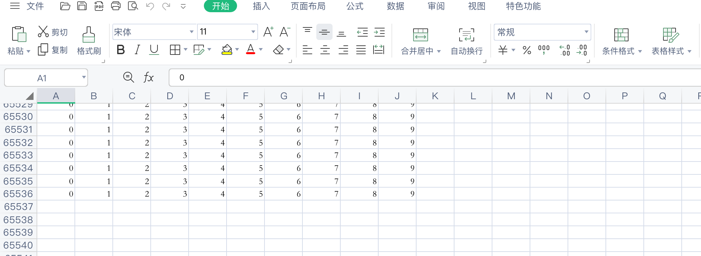
   <a name="tGbdD"></a>
#### 区别

- XSSFWorkbook耗时较长，但插入的数据可以很多
<a name="CD6Zf"></a>
#### 解决XSSFWorkbook耗时较长问题（SXSSFWorkbook）

- 升级版07 加速运行时间 但会产生临时文件，我们可以手动清除临时文件
```java
	/**
	 * 测试SXSSFWorkbook
	 * 测试大数据写入
	 */
	@Test
	@SneakyThrows
	public void test07BigDataExcelWriteS(){
		long strTime = System.currentTimeMillis();
		SXSSFWorkbook workbook = new SXSSFWorkbook();
		SXSSFSheet sheet = workbook.createSheet();
		for (int rowNum = 0; rowNum < 65536; rowNum++) {
			SXSSFRow row = sheet.createRow(rowNum);
			for (int celNum = 0; celNum < 10; celNum++) {
				SXSSFCell cell = row.createCell(celNum);
				cell.setCellValue(celNum);
			}
		}
		FileOutputStream fileOutputStream = new FileOutputStream(PATH + "/批量写入07S版本.xls");
		workbook.write(fileOutputStream);
		fileOutputStream.close();
		// 清除临时文件
		workbook.dispose();
		long endTime = System.currentTimeMillis();
		log.info("使用时间为： {}",((double)(endTime-strTime)/1000));
	}

// 日志输出
// 15:44:47.122 [main] INFO com.yang.excelpoi.ExcelPoiApplicationTests - 使用时间为： 2.255
```

- 输出
   - 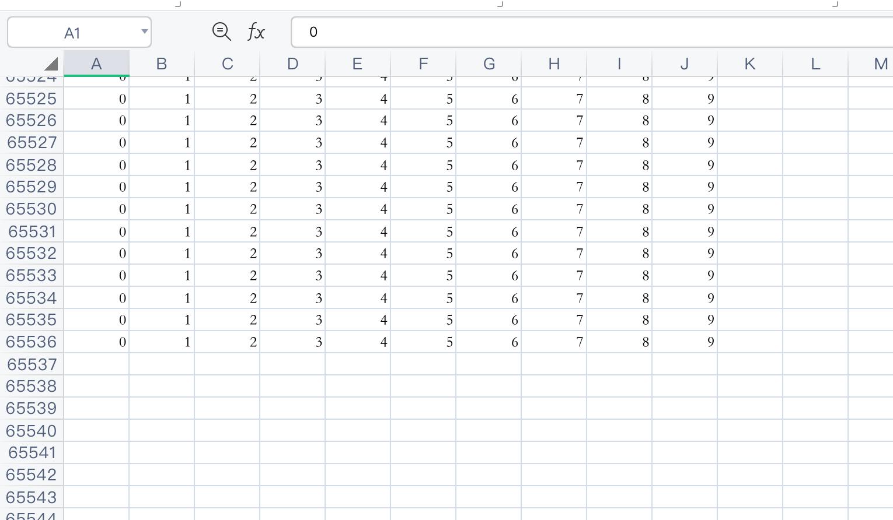
   <a name="wnxxx"></a>
## 2.2、读文件步骤
<a name="f389Y"></a>
### 03Excel测试读数据
```java
    public static final String PATH = "/Users/yang/IdeaProjects/SoftLeaderGy/test-demo/test-demo/excel-poi/";

    /**
     * 03Excel测试读数据
     */
    @Test
    @SneakyThrows
    public void excel03ReadTest(){
        FileInputStream fileInputStream = new FileInputStream(PATH + "测试写入excel数据.xls");
        HSSFWorkbook workbook = new HSSFWorkbook(fileInputStream);
        HSSFSheet sheetAt = workbook.getSheetAt(0);
        HSSFRow row = sheetAt.getRow(0);
        HSSFCell cell = row.getCell(0);
        System.out.println(cell.getStringCellValue());
    }


// 输出 ： 测试单元格
```
<a name="qJgeD"></a>
### _07Excel测试读数据_
```java
    /**
     * 07Excel测试读数据
     */
    @Test
    @SneakyThrows
    public void excel07ReadTest(){
        FileInputStream fileInputStream = new FileInputStream(PATH + "测试写入excel数据.xlsx");
        XSSFWorkbook workbook = new XSSFWorkbook(fileInputStream);
        XSSFSheet sheetAt = workbook.getSheetAt(0);
        XSSFRow row = sheetAt.getRow(0);
        XSSFCell cell = row.getCell(1);
        System.out.println(cell.getStringCellValue());
    }


// 输出： 123qwe
```
<a name="dicZl"></a>
### 注意点 ：数据类型

- 如果excel里的数据与代码中获取的类型不匹配就会报错
   - java.lang.IllegalStateException: Cannot get a STRING value from a NUMERIC cell
- 例如
   - excel中的是数字类型
      - 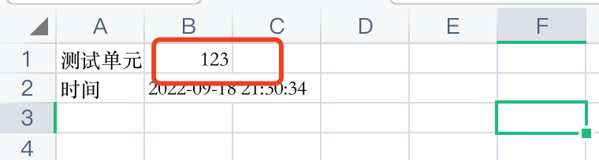
   - 代码中使用获取字符串的方法获取
      - 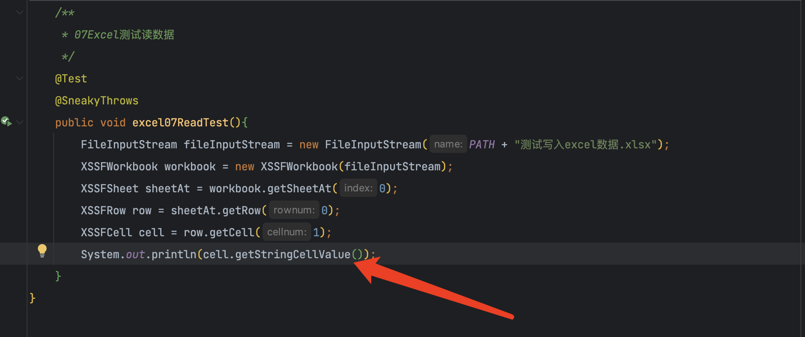
   - 就会报错：java.lang.IllegalStateException: Cannot get a STRING value from a NUMERIC cell
- 日期类型：
   - getDateCellValue() 日期	
   - getStringCellValue() 字符串
   - getBooleanCellValue()布尔类型
   - 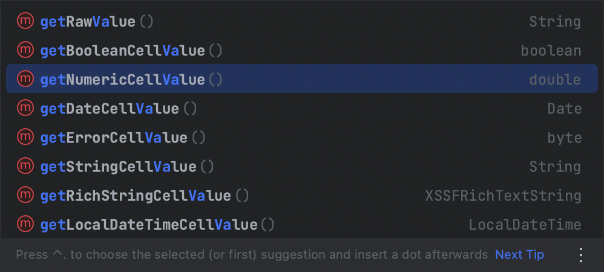
   <a name="KC0QS"></a>
### 07读取excel不同数据类型数据
```java
    /**
     * 07Excel测试读不同数据类型数据
     */
    @Test
    @SneakyThrows
    public void testCellType(){
        FileInputStream fileInputStream = new FileInputStream(PATH + "测试写入excel数据.xlsx");
        XSSFWorkbook workbook = new XSSFWorkbook(fileInputStream);
        XSSFSheet sheetAt = workbook.getSheetAt(0);
        XSSFRow rowTitle = sheetAt.getRow(0);
        int cellNum = rowTitle.getPhysicalNumberOfCells();
        for (int i = 0; i < cellNum; i++) {
            XSSFCell cell = rowTitle.getCell(i);
            if (cell != null) {
                CellType cellType = cell.getCellType();
                String stringCellValue = cell.getStringCellValue();
                System.out.print(stringCellValue + " | ");
            }
        }
        System.out.println();
        // 读数据
        // 获取excel行数
        int physicalNumberOfRows = sheetAt.getPhysicalNumberOfRows();
        for (int rowNum = 1; rowNum < physicalNumberOfRows; rowNum++) {
            XSSFRow rowData = sheetAt.getRow(rowNum);
            if (rowData != null) {
                int cellCount = rowData.getPhysicalNumberOfCells();
                for (int i = 0; i < cellCount; i++) {
                    XSSFCell cell = rowData.getCell(i);
                    if (cell != null) {
                        String cellValue="";
                        CellType cellType = cell.getCellType();
                        switch (cellType){
                            case STRING:cellValue = cell.getStringCellValue();
                                break;//string类型
                            case BOOLEAN:cellValue = String.valueOf(cell.getBooleanCellValue());
                                break;//布尔类型
                            case NUMERIC:
                                if (HSSFDateUtil.isCellDateFormatted(cell)){
                                    Date dateCellValue = cell.getDateCellValue();
                                    cellValue = new DateTime().toString("yyyy-MM-dd");
                                    break;
                                } else {
                                    // 数字以字符串的形式进行输出
                                    cell.setCellType(CellType.STRING);
                                    cellValue = cell.getStringCellValue();
                                    break;
                                }
                        }
                        System.out.print(cellValue + " | ");
                    }
                }
            }
        }
        fileInputStream.close();
    }
```
<a name="mQUQN"></a>
### 计算公式
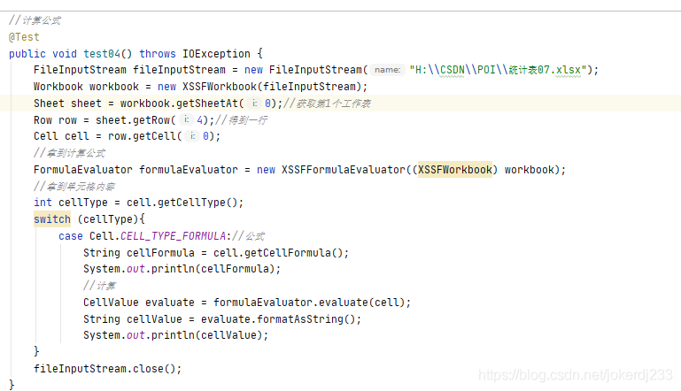

- 代码
```java
//计算公式
    @Test
    public void test04() throws IOException {
        FileInputStream fileInputStream = new FileInputStream("H:\\CSDN\\POI\\统计表07.xlsx");
        Workbook workbook = new XSSFWorkbook(fileInputStream);
        Sheet sheet = workbook.getSheetAt(0);//获取第1个工作表
        Row row = sheet.getRow(4);//得到一行
        Cell cell = row.getCell(0);
        //拿到计算公式
        FormulaEvaluator formulaEvaluator = new XSSFFormulaEvaluator((XSSFWorkbook) workbook);
        //拿到单元格内容
        int cellType = cell.getCellType();
        switch (cellType){
            case Cell.CELL_TYPE_FORMULA://公式
                String cellFormula = cell.getCellFormula();
                System.out.println(cellFormula);//输出公式
                //计算
                CellValue evaluate = formulaEvaluator.evaluate(cell);
                String cellValue = evaluate.formatAsString();
                System.out.println(cellValue);
        }
        fileInputStream.close();
    }
```

- 输出
   - 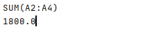
   <a name="PdSNC"></a>
# 三、easyexcel使用
> 导入依赖

```xml
<!-- https://mvnrepository.com/artifact/com.alibaba/easyexcel -->
<dependency>
  <groupId>com.alibaba</groupId>
  <artifactId>easyexcel</artifactId>
  <version>2.2.6</version>
</dependency>
```
<a name="qOtDR"></a>
## 3.1、简单的写
```java
public class TestEasyExcel {

    public static final String PATH = "/Users/yang/IdeaProjects/SoftLeaderGy/test-demo/test-demo/excel-poi/";
    private List<DemoData> data() {
        List<DemoData> list = new ArrayList<>();
        for (int i = 0; i < 10; i++) {
            DemoData data = new DemoData();
            data.setString("字符串" + i);
            data.setDate(new Date());
            data.setDoubleData(0.56);
            list.add(data);
        }
        return list;
    }

    @Test
    public void simpleWrite() {
        // 写法1
        String fileName =PATH + "easyexcel.xlsx";
        // 这里 需要指定写用哪个class去写，然后写到第一个sheet，名字为模板 然后文件流会自动关闭
        // 如果这里想使用03 则 传入excelType参数即可
        // write(文件路径，格式类)
        // sheet(工作表名)
        // doWrite(数据)
        EasyExcel.write(fileName, DemoData.class).sheet("模板").doWrite(data());
    }
}
```
<a name="lie7O"></a>
## 3.2、简单的读

- 编写监听器
```java
package com.yang.excelpoi.easyexcel;

import com.alibaba.excel.context.AnalysisContext;
import com.alibaba.excel.event.AnalysisEventListener;
import com.alibaba.excel.metadata.CellData;
import com.alibaba.excel.metadata.CellExtra;
import com.alibaba.excel.read.listener.ReadListener;
import com.alibaba.fastjson.JSON;
import com.yang.excelpoi.easyexcel.dao.DemoDAO;
import com.yang.excelpoi.easyexcel.dto.DemoData;
import com.yang.excelpoi.easyexcel.dto.DemoReadData;
import lombok.extern.slf4j.Slf4j;
import org.slf4j.LoggerFactory;

import java.util.ArrayList;
import java.util.List;
import java.util.Map;
import java.util.logging.Logger;

// 有个很重要的点 DemoDataListener 不能被spring管理，要每次读取excel都要new,然后里面用到spring可以构造方法传进去
@Slf4j
// 有个很重要的点 DemoDataListener 不能被spring管理，要每次读取excel都要new,然后里面用到spring可以构造方法传进去
public class DemoDataListener extends AnalysisEventListener<DemoReadData> {
    /**
     * 每隔5条存储数据库，实际使用中可以3000条，然后清理list ，方便内存回收
     */
    private static final int BATCH_COUNT = 5;
    List<DemoReadData> list = new ArrayList<DemoReadData>();
    /**
     * 假设这个是一个DAO，当然有业务逻辑这个也可以是一个service。当然如果不用存储这个对象没用。
     */
    private DemoDAO demoDAO;
    public DemoDataListener() {
        // 这里是demo，所以随便new一个。实际使用如果到了spring,请使用下面的有参构造函数
        demoDAO = new DemoDAO();
    }
    /**
     * 如果使用了spring,请使用这个构造方法。每次创建Listener的时候需要把spring管理的类传进来
     *
     * @param demoDAO
     */
    public DemoDataListener(DemoDAO demoDAO) {
        this.demoDAO = demoDAO;
    }
    /**
     * 这个每一条数据解析都会来调用
     *
     * @param data
     *            one row value. Is is same as {@link AnalysisContext#readRowHolder()}
     * @param context
     */
    @Override
    public void invoke(DemoReadData data, AnalysisContext context) {
        System.out.println(JSON.toJSONString(data));
        list.add(data);
        // 达到BATCH_COUNT了，需要去存储一次数据库，防止数据几万条数据在内存，容易OOM
        if (list.size() >= BATCH_COUNT) {
            saveData();
            // 存储完成清理 list
            list.clear();
        }
    }
    /**
     * 所有数据解析完成了 都会来调用
     *
     * @param context
     */
    @Override
    public void doAfterAllAnalysed(AnalysisContext context) {
        // 这里也要保存数据，确保最后遗留的数据也存储到数据库
        saveData();//保存数据库
        log.info("所有数据解析完成！");
    }
    /**
     * 加上存储数据库
     */
    private void saveData() {
        log.info("{}条数据，开始存储数据库！", list.size());
        demoDAO.save(list);
        log.info("存储数据库成功！");
    }
}
```

- 编写dao层 可不写 用来持久化操作（模拟）
```java
/**
 * 假设这个是你的DAO存储。当然还要这个类让spring管理，当然你不用需要存储，也不需要这个类。
 **/
public class DemoDAO {
    public void save(List<DemoData> list) {
        // 如果是mybatis,尽量别直接调用多次insert,自己写一个mapper里面新增一个方法batchInsert,所有数据一次性插入
    }
}
```

- 测试读取数据
```java
package com.yang.excelpoi.easyexcel;

import com.alibaba.excel.EasyExcel;
import com.alibaba.excel.ExcelReader;
import com.alibaba.excel.read.metadata.ReadSheet;
import com.yang.excelpoi.easyexcel.dto.DemoData;
import com.yang.excelpoi.easyexcel.dto.DemoReadData;
import org.junit.Test;

/**
 * @Description:
 * @Author: Guo.Yang
 * @Date: 2022/09/20/22:01
 */
public class TestReadEasyExcel {
    public static final String PATH = "/Users/yang/IdeaProjects/SoftLeaderGy/test-demo/test-demo/excel-poi/";

    /**
     * 最简单的读
     * <p>1. 创建excel对应的实体对象 参照{@link DemoData}
     * <p>2. 由于默认一行行的读取excel，所以需要创建excel一行一行的回调监听器，参照{@link DemoDataListener}
     * <p>3. 直接读即可
     */
    @Test
    public void simpleRead() {
        // 有个很重要的点 DemoDataListener 不能被spring管理，要每次读取excel都要new,然后里面用到spring可以构造方法传进去
        // 写法1：
        String fileName = PATH + "easyexcel.xlsx";
        // 这里 需要指定读用哪个class去读，然后读取第一个sheet 文件流会自动关闭
        EasyExcel.read(fileName, DemoReadData.class, new DemoDataListener()).sheet().doRead();
    }

}
```

- 输出
   - 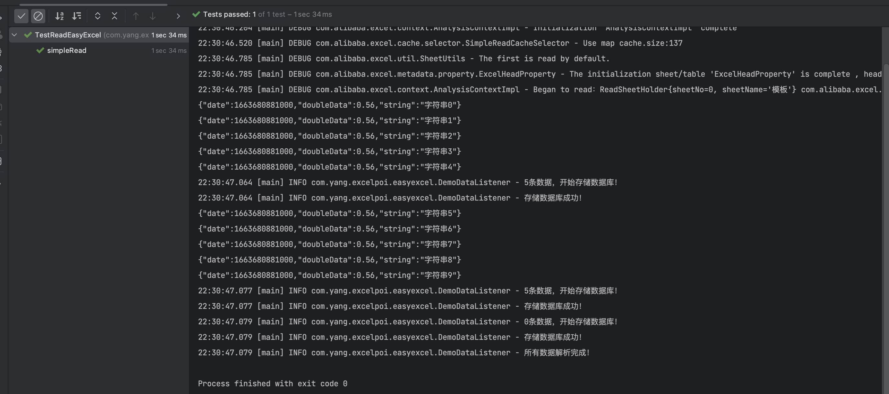

<a name="XkSki"></a>
## 3.3、链接

   - [Easy Excel 官网](https://easyexcel.opensource.alibaba.com/docs/current/)
