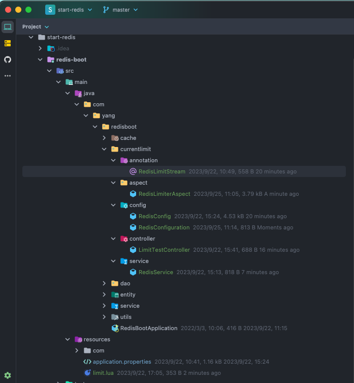
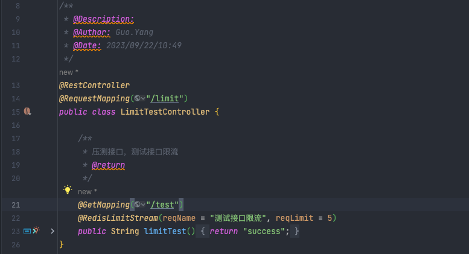
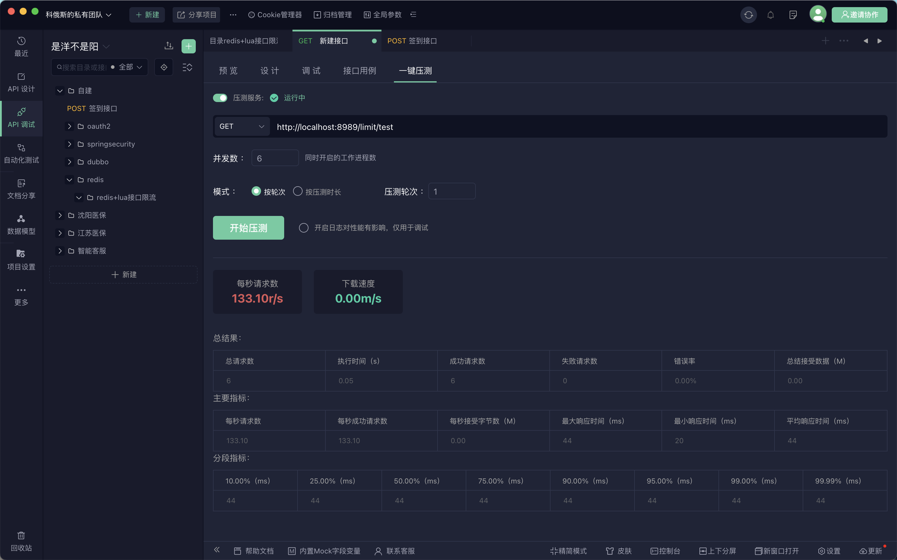
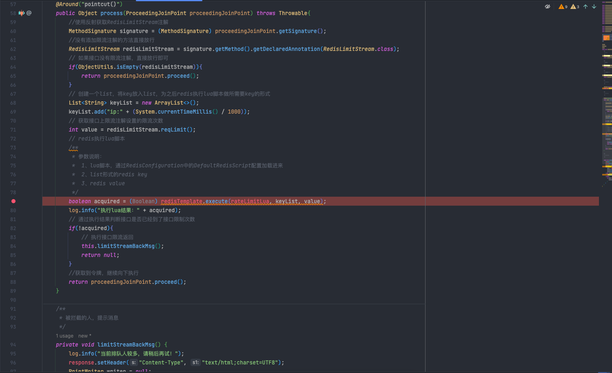
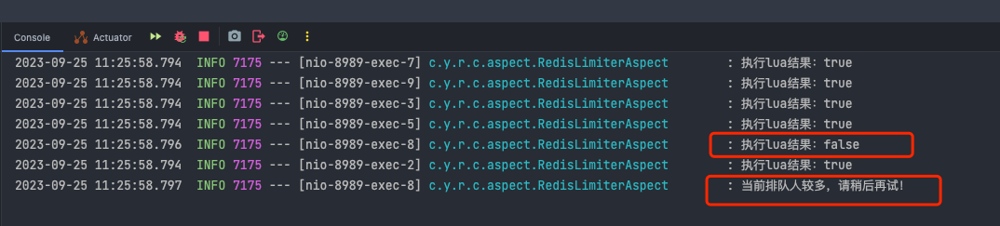

> 接口限流是项目中常见的需求，也就是为了限制项目中的某一个接口在一段时间没进行频繁访问，导致我们系统崩溃。
> 本文主要介绍`redis+lua`进行接口限流。

# 一、搭建
## 1.1、创建一个自定义限流注解

- 代码
```java
import java.lang.annotation.*;

/**
 * @Description: 自定义竹节实现分布式限流
 * @Author: Guo.Yang
 * @Date: 2023/09/22/10:47
 */

@Target(value = ElementType.METHOD)
@Retention(RetentionPolicy.RUNTIME)
@Documented
public @interface RedisLimitStream {
    /**
     * 请求限制，一秒内可以允许好多个进入(默认一秒可以支持100个)
     * @return
     */
    int reqLimit() default 100;

    /**
     * 模块名称
     * @return
     */
    String reqName() default "";
}
```

- 参数说明
   - `reqLimit`限流个数，一秒能进来的请求个数，默认100个
   - `reqName`模块名称
## 1.2、创建一个测试Controller

- 代码
```java
import com.yang.redisboot.currentlimit.annotation.RedisLimitStream;
import org.springframework.web.bind.annotation.GetMapping;
import org.springframework.web.bind.annotation.RequestMapping;
import org.springframework.web.bind.annotation.RestController;

/**
 * @Description:
 * @Author: Guo.Yang
 * @Date: 2023/09/22/10:49
 */
@RestController
@RequestMapping("/limit")
public class LimitTestController {

    /**
     * 压测接口，测试接口限流
     * @return
     */
    @GetMapping("/test")
    @RedisLimitStream(reqName = "测试接口限流", reqLimit = 5)
    public String limitTest(){
        return "success";
    }
}
```
## 1.3、创建一个限流的lua脚本

- limit.lua
```lua
local key = KEYS[1] --限流KEY（一秒一个）
local limit = tonumber(ARGV[1]) --限流大小
local current = tonumber(redis.call('get', key) or "0")
if current + 1 > limit then --如果超出限流大小
    return false
else --请求数+1，并设置2秒过期
    redis.call("INCRBY", key, "1")
    redis.call("expire", key, "2")
end
return true
```
将lua脚本放在项目中的`resources`目录下

- 说明
   - `KEYS[1] `用来表示在redis 中用作键值的参数占位，主要用來传递在redis 中用作keyz值的参数。
   - `ARGV[1] `用来表示在redis 中用作参数的占位，主要用来传递在redis中用做 value值的参数。
   - `INCRBY`redis操作，将key以指定数量进行增加
   - `expire`redis操作，将key设置过期时间
## 1.4、创建一个配置类，在启动的时候将我们的lua脚本代码加载到redisscript中
```java
import org.springframework.context.annotation.Bean;
import org.springframework.context.annotation.Configuration;
import org.springframework.core.io.ClassPathResource;
import org.springframework.data.redis.core.script.DefaultRedisScript;

/**
 * @Description: 将lua脚本加载到RedisScript中
 * @Author: Guo.Yang
 * @Date: 2023/09/22/10:49
 */
@Configuration
public class RedisConfiguration {

    /**
     * 初始化将lua脚本加载到redis脚本中
     * @return
     */
    @Bean
    public DefaultRedisScript loadRedisScript() {
        DefaultRedisScript redisScript = new DefaultRedisScript();
        redisScript.setLocation(new ClassPathResource("limit.lua"));
        redisScript.setResultType(Boolean.class);
        return redisScript;
    }
}
```
## 1.5、创建限流Aop，拦截相关包下的接口
```java
import com.yang.redisboot.currentlimit.annotation.RedisLimitStream;
import lombok.extern.slf4j.Slf4j;
import org.aspectj.lang.ProceedingJoinPoint;
import org.aspectj.lang.annotation.Around;
import org.aspectj.lang.annotation.Aspect;
import org.aspectj.lang.annotation.Pointcut;
import org.aspectj.lang.reflect.MethodSignature;
import org.springframework.beans.factory.annotation.Autowired;
import org.springframework.data.redis.core.RedisTemplate;
import org.springframework.data.redis.core.script.RedisScript;
import org.springframework.stereotype.Component;
import org.springframework.util.ObjectUtils;

import javax.servlet.http.HttpServletResponse;
import java.io.PrintWriter;
import java.util.ArrayList;
import java.util.List;

/**
 * @Description: MyRedisLimiter注解的切面类
 * @Author: Guo.Yang
 * @Date: 2023/09/22/10:49
 */
@Aspect
@Component
@Slf4j
public class RedisLimiterAspect {
    /**
     * 当前响应请求
     */
    @Autowired
    private HttpServletResponse response;

    /**
     * redis服务
     */
    @Autowired
    private RedisTemplate<String,Object> redisTemplate;

    /**
     * 执行redis的脚本文件
     */
    @Autowired(required = false)
    private RedisScript<Boolean> rateLimitLua;

    /**
     * 对所有接口进行拦截
     */
    @Pointcut("execution(public * com.yang.redisboot.currentlimit.controller.*.*(..))")
    public void pointcut(){}

    /**
     * 对切点进行继续处理
     */
    @Around("pointcut()")
    public Object process(ProceedingJoinPoint proceedingJoinPoint) throws Throwable{
        //使用反射获取RedisLimitStream注解
        MethodSignature signature = (MethodSignature) proceedingJoinPoint.getSignature();
        //没有添加限流注解的方法直接放行
        RedisLimitStream redisLimitStream = signature.getMethod().getDeclaredAnnotation(RedisLimitStream.class);
        // 如果接口没有限流注解，直接放行即可
        if(ObjectUtils.isEmpty(redisLimitStream)){
            return proceedingJoinPoint.proceed();
        }
        // 创建一个list，将key放入list，为之后redis执行lua脚本做所需要key的形式
        List<String> keyList = new ArrayList<>();
        keyList.add("ip:" + (System.currentTimeMillis() / 1000));
        // 获取接口上限流注解设置的限流次数
        int value = redisLimitStream.reqLimit();
        // redis执行lua脚本
        /**
         * 参数说明：
         *  1、lua脚本，通过RedisConfiguration中的DefaultRedisScript配置加载进来
         *  2、list形式的redis key
         *  3、redis value
         */
        boolean acquired = (Boolean) redisTemplate.execute(rateLimitLua, keyList, value);
        log.info("执行lua结果：" + acquired);
        // 通过执行结果判断接口是否已经到了接口限制次数
        if(!acquired){
            // 执行接口限流返回
            this.limitStreamBackMsg();
            return null;
        }
        //获取到令牌，继续向下执行
        return proceedingJoinPoint.proceed();
    }

    /**
     * 被拦截的人，提示消息
     */
    private void limitStreamBackMsg() {
        log.info("当前排队人较多，请稍后再试！");
        response.setHeader("Content-Type", "text/html;charset=UTF8");
        PrintWriter writer = null;
        try {
            writer = response.getWriter();
            writer.println("{\"code\":503,\"message\":\"当前排队人较多，请稍后再试！\",\"data\":\"null\"}");
            writer.flush();
        } catch (Exception e) {
            e.printStackTrace();
        } finally {
            if (writer != null) {
                writer.close();
            }
        }
    }
}

```
到此为止限流方案就算是搭建完毕了，目录结构如下

# 二、测试

- 测试工具api post
- 为了方便测试，接口限流注解设置成一秒限制为5个流量



- 压力测试，1秒6个流量



- 测试结果



5个成功，1个失败，限流成功。
