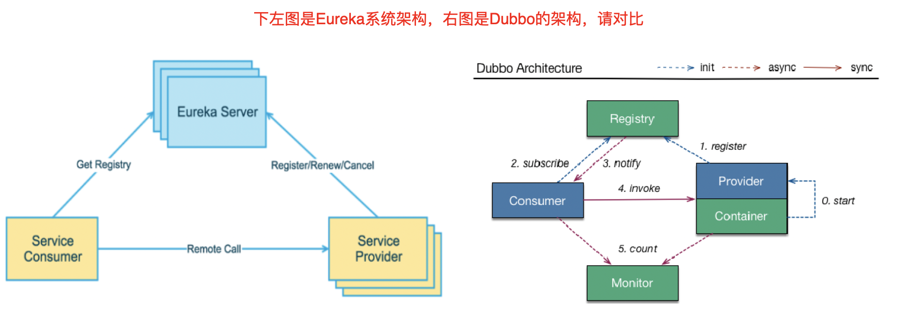

# 一、Eureka服务注册与发现

## 1、Eureka基础知识

### 1、什么是服务治理？

- Spring Cloud 封装了 Netflix 公司开发的 Eureka 模块来 实现服务治理
- 在传统的rpc远程调用框架中，管理每个服务与服务之间依赖关系比较复杂，管理比较复杂，所以需要使用服务治理，管理服务于服务之间依赖关系，可以实现服务调用、负载均衡、容错等，实现服务发现与注册。

### 2、什么是服务注册？

-  Eureka采用了CS的设计架构，Eureka Server 作为服务注册功能的服务器，它是服务注册中心。而系统中的其他微服务，使用 Eureka的客户端连接到 Eureka Server并维持心跳连接。这样系统的维护人员就可以通过 Eureka Server 来监控系统中各个微服务是否正常运行。 
-  在服务注册与发现中，有一个注册中心。当服务器启动的时候，会把当前自己服务器的信息 比如 服务地址通讯地址等以别名方式注册到注册中心上。另一方（消费者|服务提供者），以该别名的方式去注册中心上获取到实际的服务通讯地址，然后再实现本地RPC调用RPC远程调用框架核心设计思想：在于注册中心，因为使用注册中心管理每个服务与服务之间的一个依赖关系(服务治理概念)。在任何rpc远程框架中，都会有一个注册中心(存放服务地址相关信息(接口地址))


### 3、Eureka两个组件（Eureka Server和Eureka Client ）

-  Eureka Server 提供服务注册服务
各个微服务节点通过配置启动后，会在EurekaServer中进行注册，这样EurekaServer中的服务注册表中将会存储所有可用服务节点的信息，服务节点的信息可以在界面中直观看到。 
-  EurekaClient 通过注册中心进行访问
是一个Java客户端，用于简化Eureka Server的交互，客户端同时也具备一个内置的、使用轮询(round-robin)负载算法的负载均衡器。在应用启动后，将会向Eureka Server发送心跳(默认周期为30秒)。如果Eureka Server在多个心跳周期内没有接收到某个节点的心跳，EurekaServer将会从服务注册表中把这个服务节点移除（默认90秒） 

## 2、单机Eureka构建步骤

### 1、IDEA生成eurekaServer端服务注册中心（7001端口）

-  建Module（cloud-eureka-server7001） 
-  改pom 
```xml
    <dependencies>
        <!--    引入eureka组件-->
        <dependency>
            <groupId>org.springframework.cloud</groupId>
            <artifactId>spring-cloud-starter-netflix-eureka-server</artifactId>
        </dependency>
        <!--引入自己定义的 api 通用包，可以使用 Payment 支付 Entity -->
        <dependency>
            <groupId>com.yang</groupId>
            <artifactId>cloud-api-commons</artifactId>
            <version>1.0-SNAPSHOT</version>
            <scope>compile</scope>
        </dependency>
        <dependency>
            <groupId>org.springframework.boot</groupId>
            <artifactId>spring-boot-starter-web</artifactId>
        </dependency>
        <dependency>
            <groupId>org.springframework.boot</groupId>
            <artifactId>spring-boot-starter-actuator</artifactId>
        </dependency>
        <dependency>
            <groupId>org.springframework.boot</groupId>
            <artifactId>spring-boot-devtools</artifactId>
            <scope>runtime</scope>
            <optional>true</optional>
        </dependency>
        <dependency>
            <groupId>org.projectlombok</groupId>
            <artifactId>lombok</artifactId>
            <optional>true</optional>
        </dependency>
        <dependency>
            <groupId>org.springframework.boot</groupId>
            <artifactId>spring-boot-starter-test</artifactId>
            <scope>test</scope>
        </dependency>
        <dependency>
            <groupId>junit</groupId>
            <artifactId>junit</artifactId>
        </dependency>
    </dependencies>
```
 

-  写yml 
```yaml
server:
  port: 7001
eureka:
  instance:
    hostname: localhost # eureka服务端的实例
  client:
    # false 表示不向服务中心注册自己
    register-with-eureka: false
    # false 表示自己端就是服务注册中心,我的服务是维护服务实例，不需要检索服务
    fetch-registry: false
    service-url:
      # 设置与Eureka Server交互的地址查询服务和注册服务都需要这个地址
      defaultZone: http://${eureka.instance.hostname}:${server.port}/eureka/
```
 

-  主启动 
```java
@SpringBootApplication
@EnableEurekaServer // 表示该服务为EurekaServer （注册中心） 
public class EurekaMain7001 {
    public static void main(String[] args) {
        SpringApplication.run(EurekaMain7001.class,args);
    }
}
```
 

-  测试
启动服务后访问：[http://localhost:7001/](http://localhost:7001/) 

### 2、EurekaClient端cloud-provider-payment8001

> 将cloud-provider-payment8001注册进EurekaServer成为服务提供者provider


-  改pom 
```xml
<!--        引入eureka-client-->
        <dependency>
            <groupId>org.springframework.cloud</groupId>
            <artifactId>spring-cloud-starter-netflix-eureka-client</artifactId>
        </dependency>
```
 

-  写yml 
```yaml
#eureka配置
eureka:
  client:
    # 将自己注册进eureka注册中心中
    register-with-eureka: true
    # 是否从 EurekaServer 抓取已有的注册信息，默认为 true 。单节点无所谓，集群必须设置为 true 才能配合 ribbon 使用负载均衡
    fetch-registry: true
    # eureka注册中心服务的地址
    service-url:
      defaultZone: http://localhost:7001/eureka
```
 

-  主启动 
```java
@SpringBootApplication
@EnableEurekaClient // 添加EnableEurekaClien 表示该服务为erueka的客户端，需要将其注册进eureka里
public class PaymentMain8001 {
    public static void main(String[] args) {
        SpringApplication.run(PaymentMain8001.class,args);
    }
}
```
 

-  测试
访问：[http://localhost:7001/](http://localhost:7001/)


### 3、EurekaClient端cloud-consumer-order80

> 将cloud-consumer-order80服务注册进eureka中


- 步骤与cloud-provider-payment8001注册相同，此处略过

## 3、集群Eureka构建步骤

> **Eureka集群的每个服务都是，相互注册，互相守望**
>  
> 例如：有两个eureka注册中心，他两个想搭建集群，7001需要向7002注册，7002要想7001服务注册


### 1、Eureka集群原理说明


-  问题：微服务RPC远程服务调用最核心的是什么 ？
高可用，试想你的注册中心只有一个only one， 它出故障了那就呵呵(￣▽￣)"了，会导致整个为服务环境不可用，所以 
-  解决办法：搭建Eureka注册中心集群 ，实现负载均衡+故障容错 

### 2、EurekaServer集群构建步骤

-  参考cloud-eureka-server7001 新建 参考cloud-eureka-server7002 
-  改pom（与7001相同） 
-  修改Host文件
由于是本机搭建eureka集群，两个服务的eureka实例不可以配置不能相同，
通过修改Host文件的域名即可 
```
127.0.0.1       eureka7001.com
127.0.0.1       eureka7002.com
127.0.0.1       eureka7003.com
```
 

-  改yml 
   -  7001 
```yaml
server:
  port: 7001
eureka:
  instance:
    hostname: eureka7001.com # eureka服务端的实例
  client:
    # false 表示不向服务中心注册自己
    register-with-eureka: false
    # false 表示自己端就是服务注册中心,我的服务是维护服务实例，不需要检索服务
    fetch-registry: false
    service-url:
      # 设置与Eureka Server交互的地址查询服务和注册服务都需要这个地址
      defaultZone: http://eureka7002.com:7002/eureka/
```
 

   -  7002 
```yaml
server:
  port: 7002
eureka:
  instance:
    hostname: eureka7002.com # eureka服务端的实例
  client:
    # false 表示不向服务中心注册自己
    register-with-eureka: false
    # false 表示自己端就是服务注册中心,我的服务是维护服务实例，不需要检索服务
    fetch-registry: false
    service-url:
      # 设置与Eureka Server交互的地址查询服务和注册服务都需要这个地址
      defaultZone: http://eureka7001.com:7001/eureka/
```
 

-  主启动（与7001相同） 
-  测试 
```
http://localhost:7001/
http://localhost:7002/
```


### 3、将服务8001微服务发布到上面2台Eureka集群配置中

-  改yml
注册进多个eureka服务可添加多个连接，以 “ ,” 分割即可 
```yaml
    service-url:
      defaultZone: http://eureka7001.com:7001/eureka/,http://eureka7001.com:7002/eureka/
```
 

### 4、将服务8001微服务发布到上面2台Eureka集群配置中

- 改pom （以8001步骤相同）

### 5、修改8001 和 8002 服务的ServiceImpl 的返回结果来监测调用的是哪个服务

-  
```java
    @Value("${server.port}")
    private String port;
    @Override
    public CommonResult create(Payment payment) {
        int i = paymentDao.create(payment);
        if (i > 0) {
            return new CommonResult<>(200,"添加成功 端口为："+ port);
        }
        return new CommonResult(444,"操作失败");
    }
```
 

### 6、测试

1.  先要启动EurekaServer，7001/7002服务 
2.  再要启动服务提供者provider，8001 
3.  再要启动消费者，80 
4.  [http://localhost/consumer/payment/get/1](http://localhost/consumer/payment/get/1) 
5.  问题出现

   -  端口始终是8001，是因为当前我们在使用restTemplate调用是时候直接将调用的url写死了
这样明显是不合理的，需要修改 
      -  **修改** 
         1.  将80服务的restTemplate调用的地址修改为以注册中心调用服务的方式进行 
```java
    private static final String PAYMENT_URL= "http://CLOUD-PAYMENT-SERVICE";\
```
 

         2.  开启负载均衡
在配置RestTemplate 时 添加注解[@LoadBalanced ](/LoadBalanced )  
```java
@Configuration
public class ApplicationContextConfig {

    @Bean
    @LoadBalanced
    public RestTemplate restTemplate(){
        return new RestTemplate();
    }
}
```
 

   -  端口在8001、8002之间进行切换（服务进行轮询调用） 

## 4、actuator微服务信息完善

-  当前Eureka显示服务形式为

-  修改服务的别名，并点击显示主机地址 
   1.  修改8001、8002服务的yml 
```yaml
logging:
  level:
    com.yang.springcloud.dao: debug
#    eureka配置
eureka:
  client:
    # 将自己注册进eureka注册中心中
    register-with-eureka: true
    # 是否从 EurekaServer 抓取已有的注册信息，默认为 true 。单节点无所谓，集群必须设置为 true 才能配合 ribbon 使用负载均衡
    fetch-registry: true
    # eureka注册中心服务的地址
    service-url:
      defaultZone: http://eureka7001.com:7001/eureka/,http://eureka7001.com:7002/eureka/
  instance:
    instance-id: payment8002  # Eureka显示服务的别名
    prefer-ip-address: true # 点击服务别名显示服务地址
```
 

   2.  重启服务测试、观察Eureka中8001、8002服务名称变化 
-  修改后


## 5、服务发现Discovery

> 对于注册进eureka里面的微服务，可以通过服务发现来获得该服务的信息


-  修改cloud-provider-payment8001的Controller 
```java
    @Autowired
    private DiscoveryClient discoveryClient;    


		@GetMapping("/getPaymentById/discovery")
    public Object discovery(){
        // 获取注册进eureka的所有服务
        List<String> services = discoveryClient.getServices();
        for (String service : services) {
            log.info("service: "+ service);
        }

        // 获取某个服务中的所有实例信息
        List<ServiceInstance> instances = discoveryClient.getInstances("CLOUD-PAYMENT-SERVICE");
        for (ServiceInstance instance : instances) {
            log.info("实例："+ instance);
            log.info("服务主机："+ instance.getHost() + "端口："+ instance.getPort() + "地址：" + instance.getUri());
        }
        return discoveryClient;
    }
```
 

-  8001服务的启动类
启动上添加注解 
```java
@EnableDiscoveryClient
```
 

-  自测
访问http://localhost:8001/payment/getPaymentById/discovery


		日志

```
service: cloud-payment-service
实例：org.springframework.cloud.netflix.eureka.EurekaDiscoveryClient$EurekaServiceInstance@3c61b61d
服务主机：192.168.1.101端口：8002地址：http://192.168.1.101:8002
实例：org.springframework.cloud.netflix.eureka.EurekaDiscoveryClient$EurekaServiceInstance@3f5262df
服务主机：192.168.1.101端口：8001地址：http://192.168.1.101:8001
```

## 6、Eureka自我保护机制

### 1、导致原因

-  为什么产生Eureka自我保护机制？
为了防止EurekaClient可以正常运行，但是 与 EurekaServer网络不通情况下，EurekaServer 不会立刻 将EurekaClient服务剔除 
-  什么是自我保护模式？
默认情况下，如果EurekaServer在一定时间内没有接收到某个微服务实例的心跳，EurekaServer将会注销该实例（默认90秒）。但是当网络分区故障发生(延时、卡顿、拥挤)时，微服务与EurekaServer之间无法正常通信，以上行为可能变得非常危险了——因为微服务本身其实是健康的， 此时本不应该注销这个微服务 。Eureka通过“自我保护模式”来解决这个问题——当EurekaServer节点在短时间内丢失过多客户端时（可能发生了网络分区故障），那么这个节点就会进入自我保护模式。


	在自我保护模式中，Eureka Server会保护服务注册表中的信息，不再注销任何服务实例。

-  它的设计哲学就是宁可保留错误的服务注册信息，也不盲目注销任何可能健康的服务实例 。一句话讲解：好死不如赖活着 
-  综上，自我保护模式是一种应对网络异常的安全保护措施。它的架构哲学是宁可同时保留所有微服务（健康的微服务和不健康的微服务都会保留）也不盲目注销任何健康的微服务。使用自我保护模式，可以让Eureka集群更加的健壮、稳定。 

### 2、怎么禁止自我保护

-  注册中心eureakeServer端7001 
   1. 默认是开启的自我保护机制的
   2. 使用eureka.server.enable-self-preservation = false 可以禁用自我保护模式
-  生产者客户端eureakeClient端8001 
   1.  设置发送心跳包的时间
**eureka.instance.lease-renewal-interval-in-seconds**=**30** 
   2.  设置服务断连的超时时间
**eureka.instance.lease-expiration-duration-in-seconds**=**90** 
