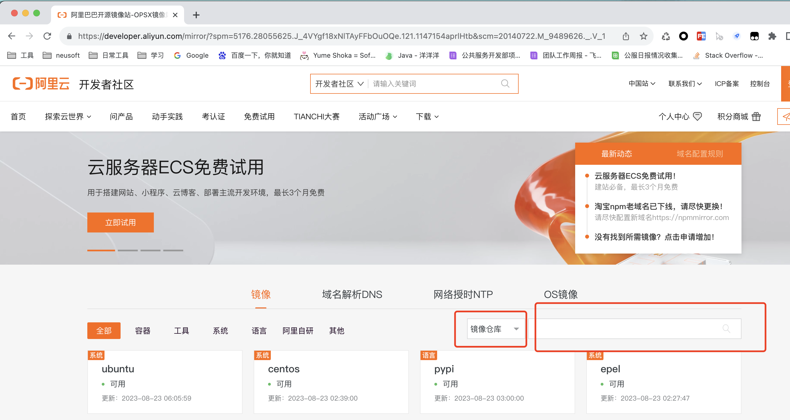
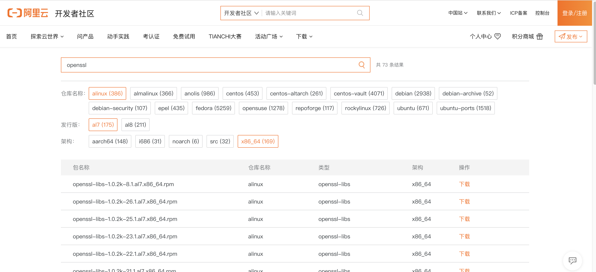

> nginx部署报错问题请看--> [nginx部署趟坑](https://www.yuque.com/yang.guo.top1/java-start/ts8z0i6p5v25nvwy)

# 一、离线安装

- 安装包获取：[nginx-1.18.0软件、依赖离线安装包 · 洋洋洋/nginx-rely-on - Gitee.com](https://gitee.com/yang-guo-code/nginx-rely-on/releases/tag/nginx-1.18.0%E8%BD%AF%E4%BB%B6%E3%80%81%E4%BE%9D%E8%B5%96%E7%A6%BB%E7%BA%BF%E5%AE%89%E8%A3%85%E5%8C%85)
## 1.1、上传安装包

- nginx安装包：`nginx-1.18.0.tar.gz`
- nginx安装依赖包：`gcc.zip`、`tools.zip`
- openssl源码包：`openssl-1.1.1d.tar.gz`
## 1.2、解压安装

1. 解压依赖包`gcc.zip`、`tools.zip`
2. 解压openssl源码包`openssl-1.1.1d.tar.gz`（有的nginx版本需要，在`步骤7`最后可配置，不需要可以去掉）
3. 进入gcc、tools文件夹内
4. 分别执行里边的install.sh   (`sh install.sh`)
5. 解压nginx安装包
6. 进入解压后的nginx文件夹
7. 执行命令（最后的`--with-openssl=/home/openssl-1.1.1d`需要指定`步骤2`解压的源码包）
```nginx
./configure --prefix=/opt/nginx --with-http_stub_status_module --with-http_ssl_module  --with-http_gzip_static_module --with-openssl=/home/openssl-1.1.1d
```

8. 如果不报错执行`make && make install`
9. 执行后可以进到`/opt/nginx/sbin`下看能否执行`./nginx`
10. 可以`curl [http://localhost:80/](http://localhost:80/)` 如果返回`Welcome to nginx!` 说明nginx部署完成！
## 1.3、说明

- 在`1.2`节中如果第7步出现错误，基本上就是缺依赖
- 查看报错缺少什么依赖
- 点击[阿里巴巴开源镜像站-OPSX镜像站-阿里云开发者社区](https://developer.aliyun.com/mirror/?spm=5176.28055625.J_4VYgf18xNlTAyFFbOuOQe.121.1147154aprlHtb&scm=20140722.M_9489626._.V_1) -> 选择资源包 -> 进行下载缺少的资源包




- 将下载好的.rpm文件依赖包上传至服务器
- 执行  `rpm -Uvh XXXXX.rpm --nodeps --force` 或者可以放在一个文件夹下 直接执行`rpm -Uvh *.rpm --nodeps --force`
- 然后在重复`1.2节`的`7步骤`及以后

---

