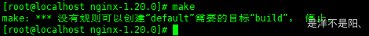

# 一、nginx相关

## 1、make报错

- 问题描述

> make: *** 没有规则可以创建“default”需要的目标“build”。 停止
> 

- 错误原因

> 安装nginx 编译时缺少一些依赖造成的

- 解决办法

```sql
# 安装依赖
yum -y install gcc openssl openssl-devel pcre-devel zlib zlib-devel
# 再次执行 启动命令
./configure
# 编译
make && make install
# 启动nginx
./nginx
```

- 补充
  - 开机启动nginx

```sql
# 编辑文件/etc/rc.d/rc.local
vi /etc/rc.d/rc.local
# 在后面添加内容
/home/admin/local/nginx/sbin/nginx
# ll查看下rc.local文件，如果不是绿色表示没有执行权限，则执行指令
chmod +x /etc/rc.d/rc.local
```

#
